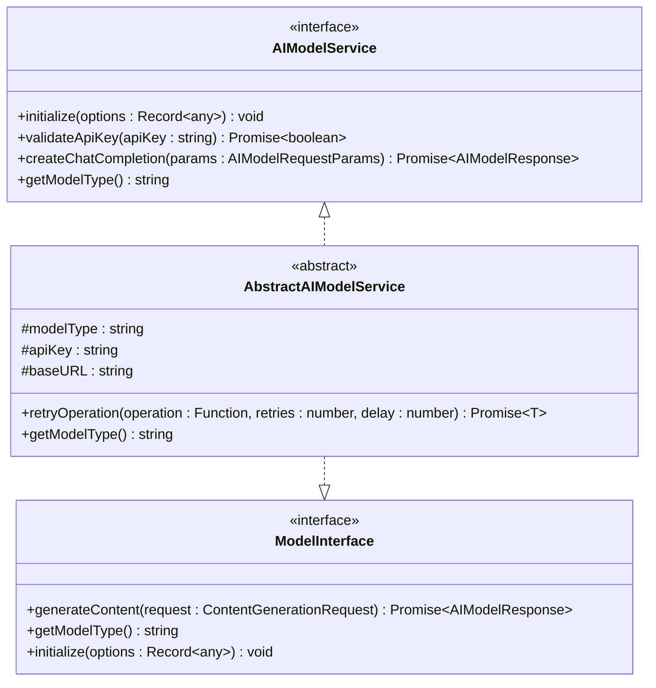
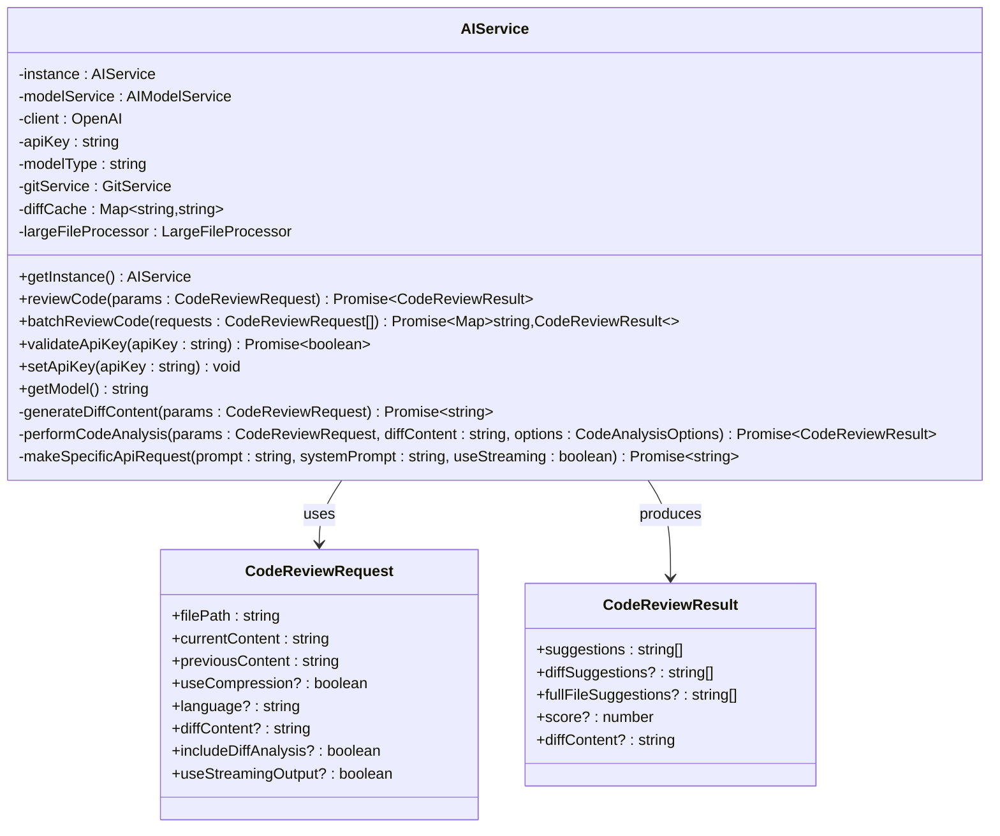
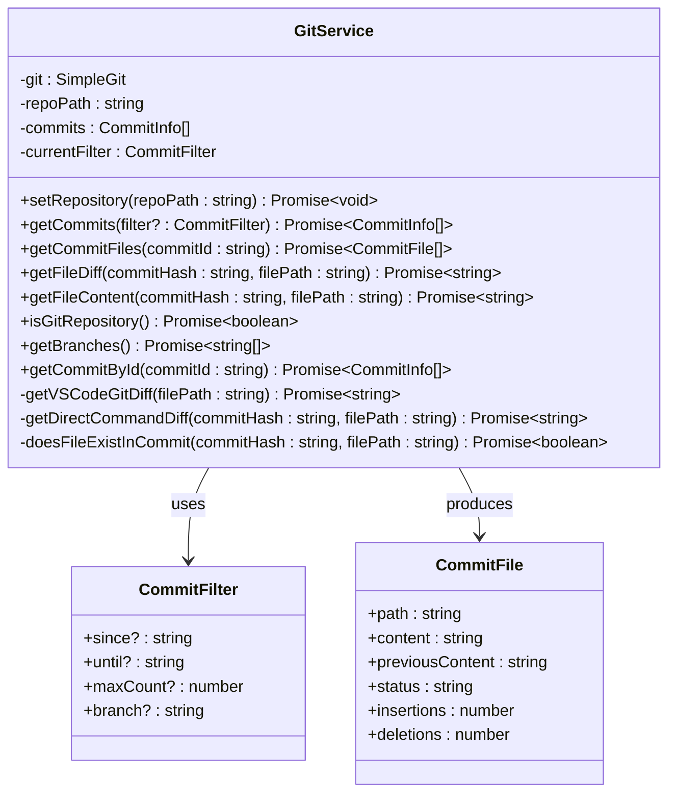
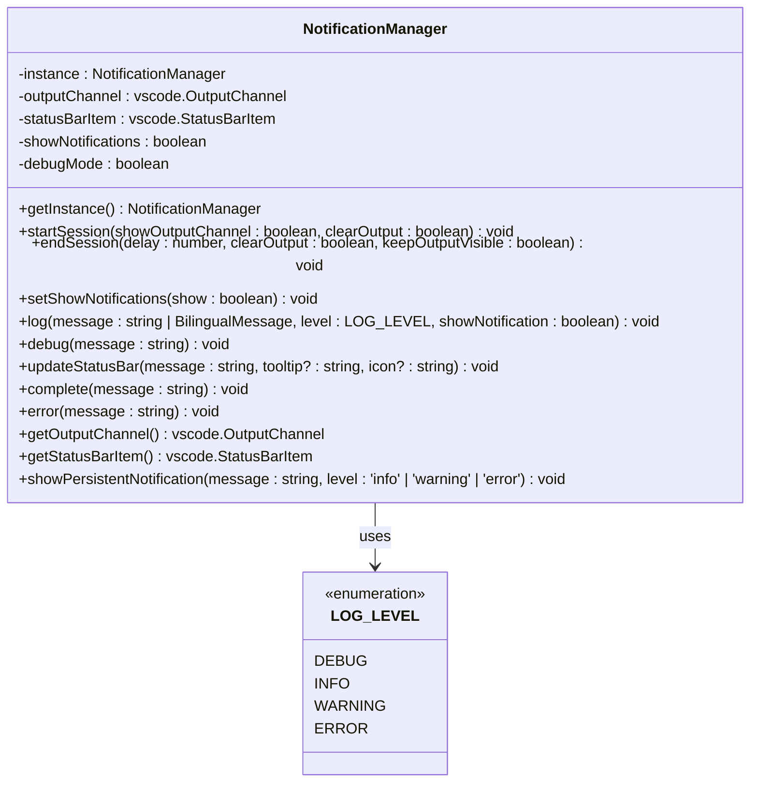

# API Reference

<cite>
**Referenced Files in This Document**
- [modelInterface.ts](file://src/models/modelInterface.ts)
- [types.ts](file://src/models/types.ts)
- [reviewTypes.ts](file://src/core/review/reviewTypes.ts)
- [versionControlTypes.ts](file://src/services/git/versionControlTypes.ts)
- [aiService.ts](file://src/services/ai/aiService.ts)
- [gitService.ts](file://src/services/git/gitService.ts)
- [notificationManager.ts](file://src/services/notification/notificationManager.ts)
- [chatTypes.ts](file://src/models/chatTypes.ts)
- [constants.ts](file://src/constants/constants.ts)
</cite>

## Table of Contents
1. [Introduction](#introduction)
2. [AI Model Interface](#ai-model-interface)
3. [Core Data Types](#core-data-types)
4. [Code Review Types](#code-review-types)
5. [Version Control Types](#version-control-types)
6. [Service APIs](#service-apis)
7. [Event Systems](#event-systems)
8. [Usage Patterns](#usage-patterns)
9. [Serialization Considerations](#serialization-considerations)

## Introduction

CodeKarmic provides a comprehensive API for AI-powered code review and version control integration. This reference documents the public interfaces, data models, and service APIs that enable developers to integrate with or extend the CodeKarmic extension.

The API is built around several core concepts:
- **AI Model Interface**: Standardized interaction with various AI providers
- **Code Review Types**: Structured data for code analysis and suggestions
- **Version Control Types**: Git and repository management interfaces
- **Service Layer**: High-level APIs for AI and Git operations
- **Event System**: Notification and logging infrastructure

## AI Model Interface

### IAIModel Interface

The AI Model Interface defines the contract for interacting with AI language models.



**Diagram sources**
- [modelInterface.ts](file://src/models/modelInterface.ts#L39-L185)

#### Methods

##### `initialize(options?: Record<string, any>)`
Initializes the model service with provider-specific configuration.

**Parameters:**
- `options` (optional): Provider-specific initialization parameters

**Returns:** `void`

**Usage Pattern:**
```typescript
const modelService = new ConcreteModelService();
modelService.initialize({
    apiKey: 'your-api-key',
    baseUrl: 'https://api.example.com',
    timeout: 30000
});
```

##### `validateApiKey(apiKey: string)`
Validates the authenticity of an API key with the AI provider.

**Parameters:**
- `apiKey`: Authentication token for the AI service

**Returns:** `Promise<boolean>` indicating key validity

**Usage Pattern:**
```typescript
const isValid = await modelService.validateApiKey('sk-...');
console.log(isValid ? 'Valid key' : 'Invalid key');
```

##### `createChatCompletion(params: AIModelRequestParams)`
Creates a chat completion request to the AI model.

**Parameters:**
- `params`: Request parameters including messages and model options

**Returns:** `Promise<AIModelResponse>` containing the model's response

**Usage Pattern:**
```typescript
const response = await modelService.createChatCompletion({
    messages: [
        { role: 'system', content: 'You are a helpful assistant.' },
        { role: 'user', content: 'Explain TypeScript' }
    ],
    temperature: 0.7,
    max_tokens: 1000
});
```

##### `getModelType()`
Retrieves the type identifier for the model service.

**Returns:** `string` representing the model type

**Section sources**
- [modelInterface.ts](file://src/models/modelInterface.ts#L39-L62)

### AI Model Response Types

#### AIModelResponse
Standardized response format from AI model interactions.

| Field | Type | Required | Description |
|-------|------|----------|-------------|
| `content` | `string` | Yes | Raw response content (backward compatibility) |
| `text` | `string` | Yes | Processed text content for code review |
| `model` | `string` | Yes | Name of the model used |
| `usage` | `object` | No | Token usage statistics |
| `usage.promptTokens` | `number` | No | Tokens used in the prompt |
| `usage.completionTokens` | `number` | No | Tokens used in the completion |
| `usage.totalTokens` | `number` | No | Total tokens consumed |

#### AIModelRequestParams
Parameters for AI model requests.

| Field | Type | Required | Description |
|-------|------|----------|-------------|
| `messages` | `ChatMessage[]` | Yes | Array of conversation messages |
| `model` | `string` | No | Specific model to use |
| `temperature` | `number` | No | Sampling temperature (0.0-2.0) |
| `max_tokens` | `number` | No | Maximum tokens to generate |
| `compressLargeContent` | `boolean` | No | Enable content compression |
| `compressionThreshold` | `number` | No | Character threshold for compression |
| `stream` | `boolean` | No | Enable streaming response |
| `[key: string]` | `any` | No | Additional provider-specific parameters |

**Section sources**
- [modelInterface.ts](file://src/models/modelInterface.ts#L6-L33)

### Content Generation Interface

#### ContentGenerationRequest
High-level interface for content generation requests.

| Field | Type | Required | Description |
|-------|------|----------|-------------|
| `systemPrompt` | `string` | No | System-level instructions |
| `userPrompt` | `string` | Yes | User-provided prompt |
| `options` | `object` | No | Generation options |
| `options.maxTokens` | `number` | No | Maximum token count |
| `options.temperature` | `number` | No | Sampling temperature |
| `options.compressLargeContent` | `boolean` | No | Enable compression |
| `options.compressionThreshold` | `number` | No | Compression threshold |
| `options.[key]` | `any` | No | Additional options |

**Section sources**
- [modelInterface.ts](file://src/models/modelInterface.ts#L142-L162)

## Core Data Types

### Model Types

#### ModelType Enum
Supported AI model types.

| Value | Description |
|-------|-------------|
| `DEEPSEEK_V3` | DeepSeek Chat model |
| `DEEPSEEK_R1` | DeepSeek Reasoner model |
| `OPENAI` | OpenAI-compatible model |

#### Model Configuration

| Field | Type | Required | Description |
|-------|------|----------|-------------|
| `type` | `ModelType` | Yes | Model type identifier |
| `name` | `string` | Yes | Human-readable model name |
| `version` | `string` | No | Model version |
| `maxTokens` | `number` | No | Maximum tokens |
| `temperature` | `number` | No | Default temperature |
| `[key: string]` | `any` | No | Provider-specific options |

**Section sources**
- [types.ts](file://src/models/types.ts#L8-L41)

### Model Request and Response Types

#### ModelRequest
Structured AI request format.

| Field | Type | Required | Description |
|-------|------|----------|-------------|
| `systemPrompt` | `string` | No | System-level instructions |
| `userPrompt` | `string` | Yes | User prompt content |
| `options` | `ModelRequestOptions` | No | Request-specific options |

#### ModelResponse
Standardized AI response format.

| Field | Type | Required | Description |
|-------|------|----------|-------------|
| `text` | `string` | Yes | Generated response text |
| `usedTokens` | `number` | No | Tokens actually used |
| `truncated` | `boolean` | No | Whether response was truncated |
| `finishReason` | `'stop' \| 'length' \| 'content_filter' \| 'timeout' \| 'error'` | No | Reason for completion |
| `error` | `string` | No | Error message if applicable |

**Section sources**
- [types.ts](file://src/models/types.ts#L78-L103)

## Code Review Types

### Review Modes

#### ReviewMode Enum
Different modes of code review operation.

| Value | Description |
|-------|-------------|
| `GIT_COMMIT` | Review based on Git commits |
| `EXPLORER` | Review based on VS Code Explorer |
| `REAL_TIME` | Real-time editing review |
| `DOMAIN_SPECIFIC` | Domain-specific code review |

### Code Review Request

#### CodeReviewRequest
Complete specification for code review operations.

| Field | Type | Required | Description |
|-------|------|----------|-------------|
| `filePath` | `string` | Yes | Path to the file being reviewed |
| `currentContent` | `string` | Yes | Current file content |
| `previousContent` | `string` | Yes | Previous file content |
| `useCompression` | `boolean` | No | Enable content compression |
| `language` | `string` | No | Programming language |
| `diffContent` | `string` | No | Pre-computed diff content |
| `reviewMode` | `ReviewMode` | No | Review operation mode |

**Git Commit Mode Fields:**
| Field | Type | Required | Description |
|-------|------|----------|-------------|
| `commitHash` | `string` | No | Git commit hash |
| `commitMessage` | `string` | No | Commit message |
| `commitAuthor` | `string` | No | Commit author |

**Explorer Mode Fields:**
| Field | Type | Required | Description |
|-------|------|----------|-------------|
| `folderPath` | `string` | No | Target folder path |
| `includeSubfolders` | `boolean` | No | Include subdirectories |
| `fileFilter` | `string[]` | No | File pattern filters |

**Real-time Mode Fields:**
| Field | Type | Required | Description |
|-------|------|----------|-------------|
| `editingContent` | `string` | No | Current editing content |
| `cursorPosition` | `number` | No | Cursor position |
| `editHistory` | `string[]` | No | Edit history stack |
| `contextWindowSize` | `number` | No | Context window size |

**Domain-specific Mode Fields:**
| Field | Type | Required | Description |
|-------|------|----------|-------------|
| `domainType` | `DomainType` | No | Domain classification |
| `domainRules` | `string[]` | No | Domain-specific rules |
| `domainContext` | `string` | No | Domain context information |

**Section sources**
- [reviewTypes.ts](file://src/core/review/reviewTypes.ts#L22-L73)

### Code Review Results

#### CodeReviewResult
Comprehensive result structure for code reviews.

| Field | Type | Required | Description |
|-------|------|----------|-------------|
| `suggestions` | `string[]` | Yes | List of improvement suggestions |
| `score` | `number` | No | Quality assessment score (0-10) |
| `reviewMode` | `ReviewMode` | No | Review operation mode |

**Git Commit Mode Results:**
| Field | Type | Required | Description |
|-------|------|----------|-------------|
| `diffSuggestions` | `string[]` | No | Suggestions based on differences |
| `fullFileSuggestions` | `string[]` | No | Full file analysis suggestions |
| `diffContent` | `string` | No | Computed diff content |
| `commitSuggestions` | `string[]` | No | Commit-specific suggestions |

**Explorer Mode Results:**
| Field | Type | Required | Description |
|-------|------|----------|-------------|
| `folderResults` | `Map<string, CodeReviewResult>` | No | Per-file review results |
| `structureSuggestions` | `string[]` | No | Project structure improvements |
| `fileRelationSuggestions` | `string[]` | No | File interdependencies |

**Real-time Mode Results:**
| Field | Type | Required | Description |
|-------|------|----------|-------------|
| `realtimeSuggestions` | `string[]` | No | Real-time editing suggestions |
| `completionSuggestions` | `string[]` | No | Code completion suggestions |
| `refactoringSuggestions` | `string[]` | No | Refactoring opportunities |
| `contextualSuggestions` | `string[]` | No | Context-aware suggestions |

**Domain-specific Mode Results:**
| Field | Type | Required | Description |
|-------|------|----------|-------------|
| `domainSpecificSuggestions` | `string[]` | No | Domain-specific improvements |
| `domainComplianceResults` | `object` | No | Compliance assessment |
| `domainMetrics` | `Record<string, number>` | No | Domain-specific metrics |

**Section sources**
- [reviewTypes.ts](file://src/core/review/reviewTypes.ts#L76-L125)

### Code Analysis Options

#### CodeAnalysisOptions
Configuration for code analysis operations.

| Field | Type | Required | Description |
|-------|------|----------|-------------|
| `useCompression` | `boolean` | Yes | Enable content compression |
| `maxTokens` | `number` | No | Maximum tokens for analysis |
| `reviewMode` | `ReviewMode` | No | Analysis operation mode |

**Git Commit Mode Options:**
| Field | Type | Required | Description |
|-------|------|----------|-------------|
| `includeDiffAnalysis` | `boolean` | No | Include difference analysis |
| `includeFullFileAnalysis` | `boolean` | No | Include full file analysis |
| `includeCommitMessageAnalysis` | `boolean` | No | Include commit message analysis |
| `includeCommitHistoryAnalysis` | `boolean` | No | Include commit history analysis |

**Explorer Mode Options:**
| Field | Type | Required | Description |
|-------|------|----------|-------------|
| `includeStructureAnalysis` | `boolean` | No | Include project structure analysis |
| `includeFileRelationAnalysis` | `boolean` | No | Include file relationship analysis |
| `includeCodeDuplicationAnalysis` | `boolean` | No | Include code duplication analysis |
| `maxFilesToAnalyze` | `number` | No | Maximum files to analyze |

**Real-time Mode Options:**
| Field | Type | Required | Description |
|-------|------|----------|-------------|
| `includeRealtimeAnalysis` | `boolean` | No | Include real-time analysis |
| `includeCompletionAnalysis` | `boolean` | No | Include completion analysis |
| `includeRefactoringAnalysis` | `boolean` | No | Include refactoring analysis |
| `realtimeAnalysisDelay` | `number` | No | Analysis delay in milliseconds |

**Domain-specific Mode Options:**
| Field | Type | Required | Description |
|-------|------|----------|-------------|
| `includeDomainSpecificAnalysis` | `boolean` | No | Include domain-specific analysis |
| `domainType` | `DomainType` | No | Domain classification |
| `domainRules` | `string[]` | No | Domain-specific rules |
| `domainComplianceLevel` | `'strict' \| 'moderate' \| 'relaxed'` | No | Compliance level |

**Section sources**
- [reviewTypes.ts](file://src/core/review/reviewTypes.ts#L139-L190)

### Domain Types

#### DomainType Enum
Classification of specialized domains for code review.

| Value | Description |
|-------|-------------|
| `SECURITY` | Security-sensitive code |
| `PERFORMANCE` | Performance-critical code |
| `ACCESSIBILITY` | Accessibility-focused code |
| `INTERNATIONALIZATION` | Internationalization code |
| `DATA_PROCESSING` | Data processing operations |

**Section sources**
- [reviewTypes.ts](file://src/core/review/reviewTypes.ts#L192-L206)

## Version Control Types

### Git Commit Information

#### Commit Interface
Represents a Git commit with metadata.

| Field | Type | Required | Description |
|-------|------|----------|-------------|
| `hash` | `string` | Yes | Commit hash |
| `message` | `string` | Yes | Commit message |
| `author` | `string` | Yes | Author name |
| `email` | `string` | Yes | Author email |
| `date` | `Date` | Yes | Commit date |
| `reviewed` | `boolean` | No | Whether reviewed |

#### GetCommitsOptions
Options for retrieving Git commits.

| Field | Type | Required | Description |
|-------|------|----------|-------------|
| `maxCount` | `number` | No | Maximum number of commits |
| `since` | `Date` | No | Start date filter |
| `until` | `Date` | No | End date filter |
| `author` | `string` | No | Author filter |
| `commitHash` | `string` | No | Specific commit hash |
| `includeMerges` | `boolean` | No | Include merge commits |

**Section sources**
- [versionControlTypes.ts](file://src/services/git/versionControlTypes.ts#L8-L41)

### File Change Information

#### FileChange Interface
Describes changes to files in a commit.

| Field | Type | Required | Description |
|-------|------|----------|-------------|
| `path` | `string` | Yes | File path |
| `status` | `'added' \| 'modified' \| 'deleted' \| 'renamed' \| 'copied' \| 'unchanged'` | Yes | Change type |
| `oldPath` | `string` | No | Original path (for renames) |
| `reviewed` | `boolean` | No | Whether reviewed |

#### DiffOptions
Options for generating diffs.

| Field | Type | Required | Description |
|-------|------|----------|-------------|
| `ignoreWhitespace` | `boolean` | No | Ignore whitespace changes |
| `contextLines` | `number` | No | Number of context lines |
| `includeStats` | `boolean` | No | Include statistics |

#### DiffStats Interface
Statistics from diff operations.

| Field | Type | Required | Description |
|-------|------|----------|-------------|
| `additions` | `number` | Yes | Lines added |
| `deletions` | `number` | Yes | Lines deleted |
| `changedFiles` | `number` | Yes | Files changed |

**Section sources**
- [versionControlTypes.ts](file://src/services/git/versionControlTypes.ts#L44-L80)

### Git Service Types

#### CommitFile Interface
Detailed file information for commits.

| Field | Type | Required | Description |
|-------|------|----------|-------------|
| `path` | `string` | Yes | File path |
| `content` | `string` | Yes | Current file content |
| `previousContent` | `string` | Yes | Previous file content |
| `status` | `'added' \| 'modified' \| 'deleted' \| 'renamed' \| 'copied' \| 'binary'` | Yes | Change status |
| `insertions` | `number` | Yes | Lines inserted |
| `deletions` | `number` | Yes | Lines deleted |

#### CommitInfo Interface
Comprehensive commit information.

| Field | Type | Required | Description |
|-------|------|----------|-------------|
| `hash` | `string` | Yes | Commit hash |
| `date` | `string` | Yes | Commit date string |
| `message` | `string` | Yes | Commit message |
| `author` | `string` | Yes | Author name |
| `authorEmail` | `string` | Yes | Author email |
| `files` | `string[]` | Yes | Changed file paths |

**Section sources**
- [gitService.ts](file://src/services/git/gitService.ts#L19-L36)

## Service APIs

### AI Service

#### AIService Class
High-level AI service for code review operations.



**Diagram sources**
- [aiService.ts](file://src/services/ai/aiService.ts#L40-L787)

#### Methods

##### `reviewCode(params: CodeReviewRequest)`
Performs comprehensive code review on a single file.

**Parameters:**
- `params`: Code review request with file content and metadata

**Returns:** `Promise<CodeReviewResult>` containing suggestions and score

**Usage Pattern:**
```typescript
const aiService = AIService.getInstance();
const result = await aiService.reviewCode({
    filePath: '/path/to/file.ts',
    currentContent: 'const x = 1;',
    previousContent: 'var x = 1;',
    useCompression: true,
    language: 'typescript'
});
```

##### `batchReviewCode(requests: CodeReviewRequest[])`
Processes multiple files for code review in optimized batches.

**Parameters:**
- `requests`: Array of code review requests

**Returns:** `Promise<Map<string, CodeReviewResult>>` mapping file paths to results

**Usage Pattern:**
```typescript
const results = await aiService.batchReviewCode([
    { filePath: 'file1.ts', currentContent: '...', previousContent: '...' },
    { filePath: 'file2.ts', currentContent: '...', previousContent: '...' }
]);
```

##### `validateApiKey(apiKey: string)`
Validates an API key with the configured AI provider.

**Parameters:**
- `apiKey`: Authentication token

**Returns:** `Promise<boolean>` indicating key validity

**Usage Pattern:**
```typescript
const isValid = await aiService.validateApiKey('sk-...');
if (isValid) {
    console.log('API key is valid');
}
```

##### `setApiKey(apiKey: string)`
Sets and validates a new API key for the service.

**Parameters:**
- `apiKey`: New authentication token

**Returns:** `void`

**Usage Pattern:**
```typescript
aiService.setApiKey('new-api-key');
```

**Section sources**
- [aiService.ts](file://src/services/ai/aiService.ts#L40-L787)

### Git Service

#### GitService Class
Provides Git repository operations and version control integration.



**Diagram sources**
- [gitService.ts](file://src/services/git/gitService.ts#L45-L800)

#### Methods

##### `setRepository(repoPath: string)`
Initializes the Git service with a repository path.

**Parameters:**
- `repoPath`: Path to the Git repository

**Returns:** `Promise<void>`

**Usage Pattern:**
```typescript
const gitService = new GitService();
await gitService.setRepository('/path/to/repo');
```

##### `getCommits(filter?: CommitFilter)`
Retrieves commit history with filtering options.

**Parameters:**
- `filter` (optional): Commit filtering criteria

**Returns:** `Promise<CommitInfo[]>` containing commit information

**Usage Pattern:**
```typescript
const commits = await gitService.getCommits({
    maxCount: 10,
    since: '2024-01-01',
    author: 'developer@example.com'
});
```

##### `getCommitFiles(commitId: string)`
Gets detailed information about files changed in a commit.

**Parameters:**
- `commitId`: Git commit hash

**Returns:** `Promise<CommitFile[]>` containing file change details

**Usage Pattern:**
```typescript
const files = await gitService.getCommitFiles('abc123');
files.forEach(file => {
    console.log(`${file.path}: ${file.status}`);
});
```

##### `getFileDiff(commitHash: string, filePath: string)`
Generates diff content for a specific file at a commit.

**Parameters:**
- `commitHash`: Target commit hash
- `filePath`: Path to the file within the repository

**Returns:** `Promise<string>` containing unified diff format

**Usage Pattern:**
```typescript
const diff = await gitService.getFileDiff('abc123', 'src/main.ts');
console.log(diff);
```

##### `isGitRepository()`
Checks if the current path contains a valid Git repository.

**Returns:** `Promise<boolean>` indicating repository validity

**Usage Pattern:**
```typescript
const isValidRepo = await gitService.isGitRepository();
if (isValidRepo) {
    console.log('Valid Git repository');
}
```

**Section sources**
- [gitService.ts](file://src/services/git/gitService.ts#L45-L800)

## Event Systems

### Notification Management

#### NotificationManager Class
Manages notifications, status bar updates, and logging for the extension.



**Diagram sources**
- [notificationManager.ts](file://src/services/notification/notificationManager.ts#L8-L213)

#### Methods

##### `log(message: string | BilingualMessage, level: LOG_LEVEL, showNotification: boolean)`
Logs a message with optional notification display.

**Parameters:**
- `message`: Message to log (supports bilingual messages)
- `level`: Log level (DEBUG, INFO, WARNING, ERROR)
- `showNotification`: Whether to show a VS Code notification

**Returns:** `void`

**Usage Pattern:**
```typescript
const notificationManager = NotificationManager.getInstance();
notificationManager.log('Code review started', 'INFO', true);
```

##### `updateStatusBar(message: string, tooltip?: string, icon?: string)`
Updates the VS Code status bar with progress information.

**Parameters:**
- `message`: Display message
- `tooltip` (optional): Hover tooltip text
- `icon` (optional): Status bar icon

**Returns:** `void`

**Usage Pattern:**
```typescript
notificationManager.updateStatusBar('Analyzing...', 'Processing code', 'sync~spin');
```

##### `complete(message: string)`
Marks operation completion with visual feedback.

**Parameters:**
- `message`: Completion message

**Returns:** `void`

**Usage Pattern:**
```typescript
notificationManager.complete('Code review completed');
```

##### `error(message: string)`
Reports errors with appropriate visual indicators.

**Parameters:**
- `message`: Error message

**Returns:** `void`

**Usage Pattern:**
```typescript
notificationManager.error('Failed to connect to AI service');
```

**Section sources**
- [notificationManager.ts](file://src/services/notification/notificationManager.ts#L8-L213)

### Logging Levels

#### LOG_LEVEL Enumeration
Defines severity levels for logging and notifications.

| Level | Priority | Usage |
|-------|----------|-------|
| `DEBUG` | 0 | Development debugging information |
| `INFO` | 1 | General informational messages |
| `WARNING` | 2 | Warning conditions |
| `ERROR` | 3 | Error conditions requiring attention |

**Section sources**
- [constants.ts](file://src/constants/constants.ts#L8-L33)

## Usage Patterns

### Basic AI Service Integration

```typescript
// Initialize AI service
const aiService = AIService.getInstance();

// Configure with API key
await aiService.setApiKey('your-api-key');

// Perform code review
try {
    const result = await aiService.reviewCode({
        filePath: 'src/index.ts',
        currentContent: 'console.log("Hello World");',
        previousContent: 'console.log("Hello");',
        useCompression: true,
        language: 'typescript'
    });

    // Process results
    console.log(`Score: ${result.score}/10`);
    result.suggestions.forEach((suggestion, index) => {
        console.log(`${index + 1}. ${suggestion}`);
    });
} catch (error) {
    console.error('Review failed:', error);
}
```

### Batch Processing

```typescript
// Prepare multiple review requests
const requests = [
    {
        filePath: 'src/file1.ts',
        currentContent: '// ...',
        previousContent: '// ...'
    },
    {
        filePath: 'src/file2.ts',
        currentContent: '// ...',
        previousContent: '// ...'
    }
];

// Process in optimized batches
const results = await aiService.batchReviewCode(requests);

// Access individual results
results.forEach((result, filePath) => {
    console.log(`File: ${filePath}`);
    console.log(`Suggestions: ${result.suggestions.length}`);
});
```

### Git Integration

```typescript
// Initialize Git service
const gitService = new GitService();
await gitService.setRepository('/path/to/repo');

// Get commit history
const commits = await gitService.getCommits({
    maxCount: 50,
    since: '2024-01-01'
});

// Process each commit
for (const commit of commits) {
    const files = await gitService.getCommitFiles(commit.hash);
    
    for (const file of files) {
        if (file.status === 'modified') {
            const diff = await gitService.getFileDiff(commit.hash, file.path);
            console.log(`Changes in ${file.path}:`);
            console.log(diff);
        }
    }
}
```

### Event-Driven Notifications

```typescript
const notificationManager = NotificationManager.getInstance();

// Start monitoring
notificationManager.startSession(true, true);

// Update progress
notificationManager.updateStatusBar('Starting analysis...', 'Analyzing code quality');

// Log progress
notificationManager.log('Beginning code review process', 'INFO', false);

// Handle completion
try {
    const result = await aiService.reviewCode(request);
    notificationManager.complete('Code review completed successfully');
} catch (error) {
    notificationManager.error('Code review failed');
    notificationManager.log(`Error: ${error.message}`, 'ERROR', true);
}

// End monitoring
notificationManager.endSession(3000, false, true);
```

## Serialization Considerations

### JSON Serialization

All public interfaces support JSON serialization for:
- API communication
- Configuration persistence
- Extension messaging
- Test data generation

### Optional Field Handling

Fields marked as optional (`?`) should be handled gracefully:
- Check for undefined before accessing
- Provide sensible defaults
- Validate presence when required

### Type Safety

Use TypeScript interfaces for compile-time safety:
- Generic type parameters for flexible data structures
- Union types for multiple possible values
- Readonly interfaces for immutable data

### Performance Considerations

- **Large Content**: Use compression for files exceeding thresholds
- **Batch Operations**: Group related operations to minimize API calls
- **Caching**: Implement caching for expensive operations
- **Streaming**: Use streaming for large responses when supported

### Error Handling

Implement robust error handling:
- Validate input parameters
- Handle network failures gracefully
- Provide meaningful error messages
- Log errors appropriately for debugging

**Section sources**
- [modelInterface.ts](file://src/models/modelInterface.ts#L1-L185)
- [types.ts](file://src/models/types.ts#L1-L103)
- [reviewTypes.ts](file://src/core/review/reviewTypes.ts#L1-L206)
- [versionControlTypes.ts](file://src/services/git/versionControlTypes.ts#L1-L80)
- [aiService.ts](file://src/services/ai/aiService.ts#L1-L787)
- [gitService.ts](file://src/services/git/gitService.ts#L1-L800)
- [notificationManager.ts](file://src/services/notification/notificationManager.ts#L1-L213)