# Configuration API

<cite>
**Referenced Files in This Document**
- [package.json](file://package.json)
- [src/config/appConfig.ts](file://src/config/appConfig.ts)
- [src/models/types.ts](file://src/models/types.ts)
- [src/services/ai/aiService.ts](file://src/services/ai/aiService.ts)
- [src/services/git/gitService.ts](file://src/services/git/gitService.ts)
- [src/extension.ts](file://src/extension.ts)
- [src/models/modelFactory.ts](file://src/models/modelFactory.ts)
- [src/models/modelValidator.ts](file://src/models/modelValidator.ts)
- [src/constants/constants.ts](file://src/constants/constants.ts)
</cite>

## Table of Contents
1. [Introduction](#introduction)
2. [Configuration Architecture](#configuration-architecture)
3. [AppConfig Class Overview](#appconfig-class-overview)
4. [Configuration Properties](#configuration-properties)
5. [Configuration Schema](#configuration-schema)
6. [Accessing Configuration Values](#accessing-configuration-values)
7. [Event-Driven Configuration Updates](#event-driven-configuration-updates)
8. [Integration with Services](#integration-with-services)
9. [Security and Validation](#security-and-validation)
10. [Best Practices](#best-practices)
11. [Troubleshooting](#troubleshooting)

## Introduction

CodeKarmic implements a centralized configuration management system through the `AppConfig` class, which provides unified access to all runtime settings. The configuration system is built on VS Code's native configuration API and offers type-safe access to application settings with automatic persistence and event-driven updates.

The configuration system manages critical settings including API keys, model selection, file size limits, exclusion patterns, and debugging options. It ensures secure handling of sensitive data while providing seamless integration across all application services.

## Configuration Architecture

The configuration system follows a singleton pattern with event-driven architecture for real-time configuration updates:

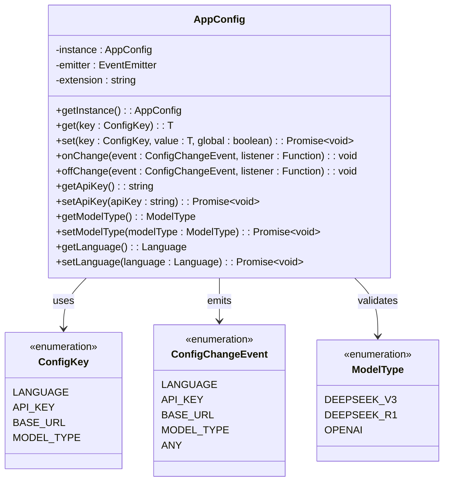

**Diagram sources**
- [src/config/appConfig.ts](file://src/config/appConfig.ts#L22-L189)
- [src/models/types.ts](file://src/models/types.ts#L10-L14)

**Section sources**
- [src/config/appConfig.ts](file://src/config/appConfig.ts#L49-L189)

## AppConfig Class Overview

The `AppConfig` class serves as the central hub for all application configuration management. It implements a singleton pattern to ensure consistent configuration access across the entire application.

### Key Features

- **Singleton Pattern**: Ensures only one configuration instance exists
- **Event-Driven Updates**: Automatically notifies subscribers of configuration changes
- **Type Safety**: Provides strongly-typed access to configuration values
- **VS Code Integration**: Leverages VS Code's configuration persistence
- **Default Value Management**: Falls back to predefined defaults when values are missing

### Initialization Process

The configuration system initializes automatically when the extension activates:

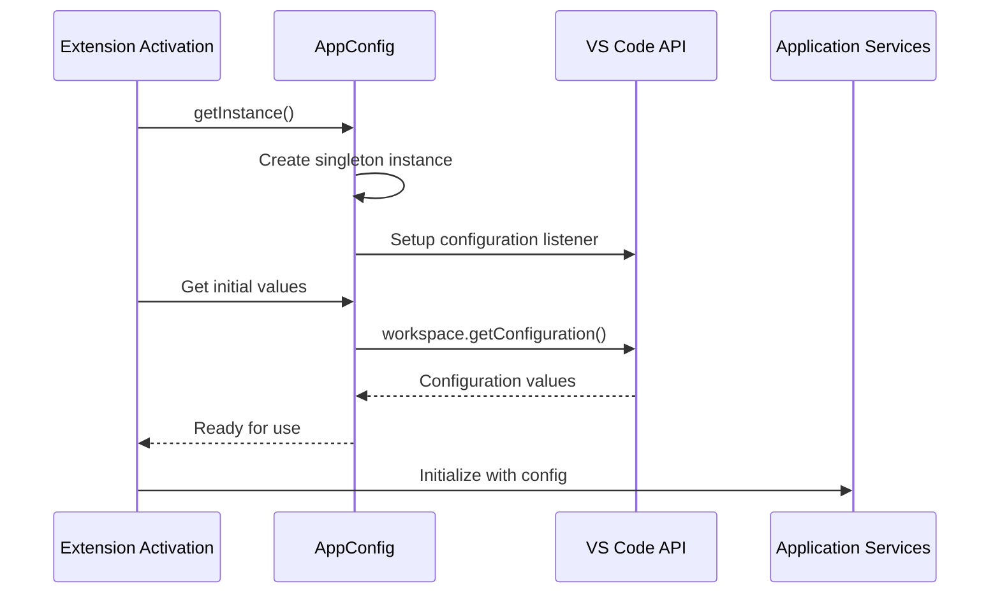

**Diagram sources**
- [src/extension.ts](file://src/extension.ts#L20-L40)
- [src/config/appConfig.ts](file://src/config/appConfig.ts#L54-L77)

**Section sources**
- [src/config/appConfig.ts](file://src/config/appConfig.ts#L54-L88)

## Configuration Properties

The configuration system manages four primary categories of settings, each serving specific functionality within the application.

### Core Configuration Keys

| Property | Type | Purpose | Default Value |
|----------|------|---------|---------------|
| `language` | `string` | User interface language preference | `'ENGLISH'` |
| `apiKey` | `string` | Authentication credentials for AI services | `''` |
| `baseUrl` | `string` | Endpoint URL for AI model provider | `'https://api.deepseek.com/v1'` |
| `modelType` | `string` | Selected AI model for code analysis | `'deepseek-reasoner'` |

### Advanced Configuration Options

| Property | Type | Purpose | Default Value |
|----------|------|---------|---------------|
| `debugMode` | `boolean` | Enable detailed logging and debugging | `false` |
| `maxFileSizeKb` | `number` | Maximum file size for code review (KB) | `100` |
| `excludeFileTypes` | `string[]` | File patterns to exclude from analysis | Comprehensive list |

**Section sources**
- [src/config/appConfig.ts](file://src/config/appConfig.ts#L37-L42)
- [package.json](file://package.json#L121-L207)

## Configuration Schema

The configuration schema defines the structure and validation rules for all settings through VS Code's contribution points in `package.json`.

### Schema Definition

The configuration schema provides comprehensive metadata for each setting:

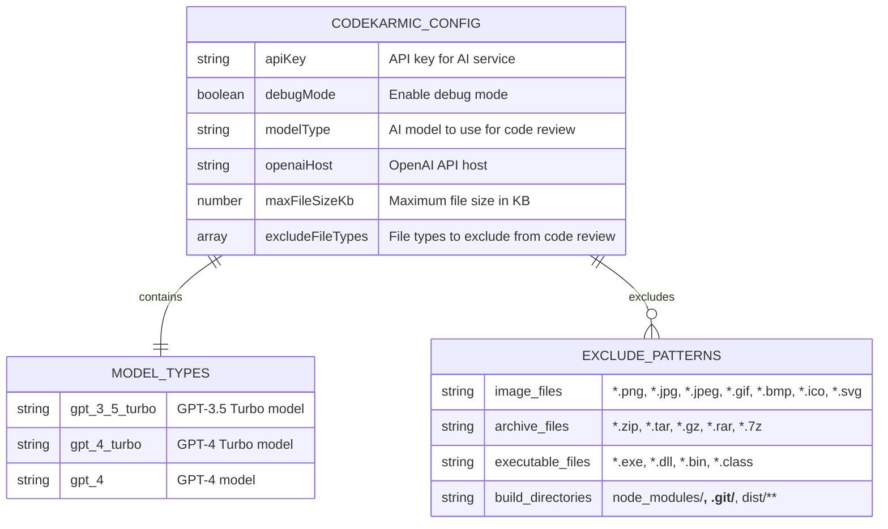

**Diagram sources**
- [package.json](file://package.json#L118-L209)

### UI Representation

The configuration schema enables VS Code to generate intuitive settings panels with:

- **Type Validation**: Automatic validation based on declared types
- **Enum Selection**: Dropdown menus for model selection
- **File Patterns**: Glob pattern support for exclusions
- **Scope Control**: Machine-wide vs workspace-specific settings

**Section sources**
- [package.json](file://package.json#L118-L209)

## Accessing Configuration Values

The configuration system provides multiple approaches for accessing and managing settings across different contexts.

### Basic Access Pattern

```mermaid
flowchart TD
A[Service Request] --> B{Configuration Needed?}
B --> |Yes| C[AppConfig.getInstance()]
C --> D[get&lt;Type&gt;(ConfigKey)]
D --> E{Value Available?}
E --> |Yes| F[Return Configuration Value]
E --> |No| G[Return Default Value]
F --> H[Use Configuration]
G --> H
B --> |No| I[Continue Operation]
```

**Diagram sources**
- [src/config/appConfig.ts](file://src/config/appConfig.ts#L95-L98)

### Service Integration Examples

#### AIService Configuration Access

The AI service demonstrates comprehensive configuration integration:

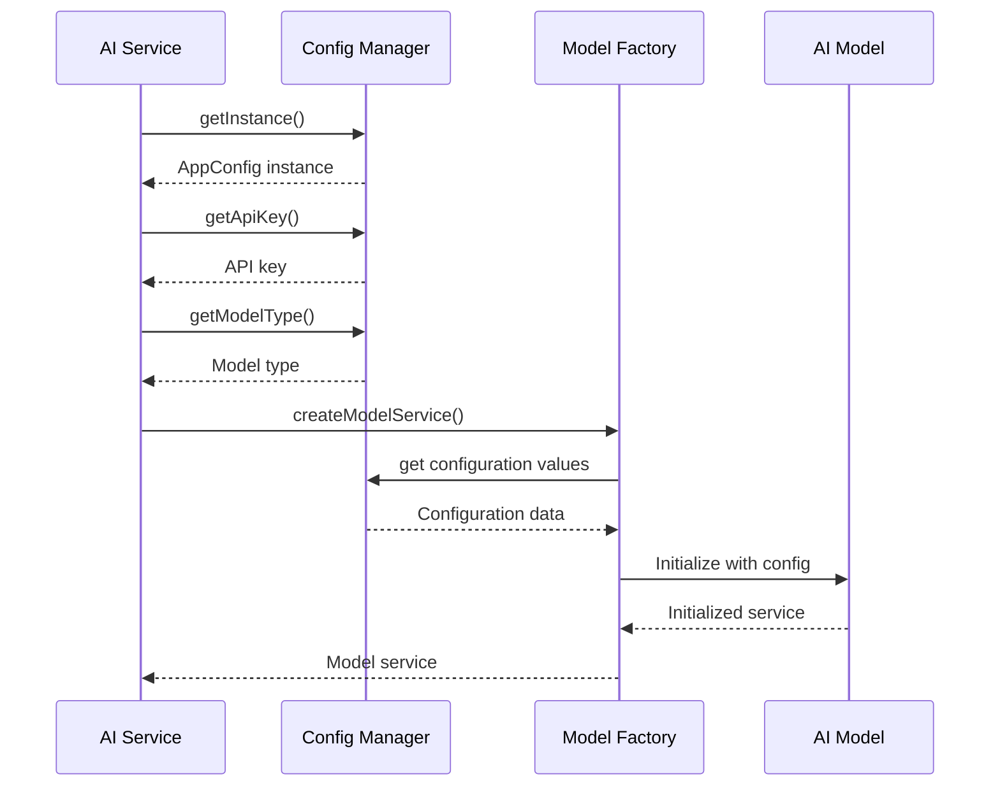

**Diagram sources**
- [src/services/ai/aiService.ts](file://src/services/ai/aiService.ts#L52-L61)
- [src/models/modelFactory.ts](file://src/models/modelFactory.ts#L58-L62)

#### GitService Configuration Access

The Git service shows how configuration affects service behavior:

```mermaid
flowchart LR
A[GitService] --> B[AppConfig.getInstance()]
B --> C[getMaxFileSizeKb]
B --> D[getExcludePatterns]
C --> E[Apply file size limits]
D --> F[Filter excluded files]
E --> G[Process files]
F --> G
```

**Diagram sources**
- [src/services/git/gitService.ts](file://src/services/git/gitService.ts#L46-L52)

**Section sources**
- [src/services/ai/aiService.ts](file://src/services/ai/aiService.ts#L52-L61)
- [src/services/git/gitService.ts](file://src/services/git/gitService.ts#L46-L52)

## Event-Driven Configuration Updates

The configuration system implements a sophisticated event-driven architecture that enables real-time updates across all application components.

### Event Flow Architecture

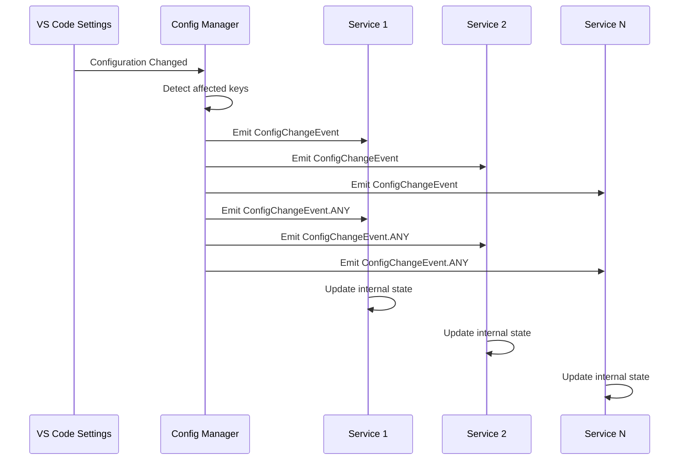

**Diagram sources**
- [src/config/appConfig.ts](file://src/config/appConfig.ts#L58-L76)

### Event Types and Handlers

The system supports multiple event types for granular control:

| Event Type | Trigger Condition | Use Case |
|------------|-------------------|----------|
| `LANGUAGE` | Language setting changed | Update UI localization |
| `API_KEY` | Authentication credentials updated | Reinitialize services |
| `BASE_URL` | Model endpoint changed | Update API connections |
| `MODEL_TYPE` | AI model selection changed | Switch model providers |
| `ANY` | Any configuration change | General state synchronization |

### Registration Pattern

Services register for configuration changes using the observer pattern:

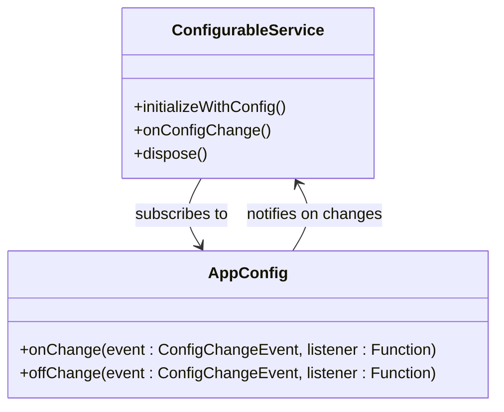

**Diagram sources**
- [src/config/appConfig.ts](file://src/config/appConfig.ts#L117-L128)

**Section sources**
- [src/config/appConfig.ts](file://src/config/appConfig.ts#L58-L76)
- [src/config/appConfig.ts](file://src/config/appConfig.ts#L117-L128)

## Integration with Services

The configuration system seamlessly integrates with all major application services, providing consistent access patterns and automatic updates.

### Service-Specific Configuration Patterns

#### AI Service Configuration

The AI service demonstrates comprehensive configuration integration:

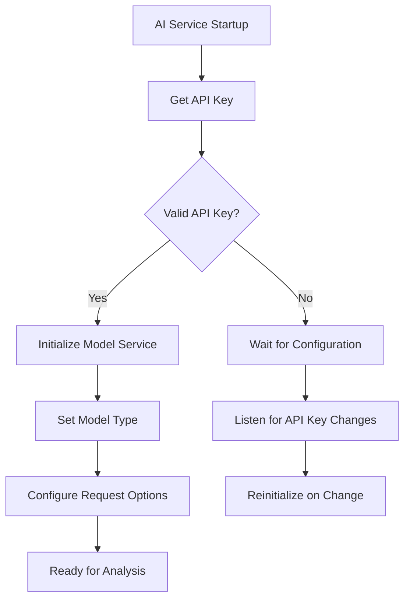

**Diagram sources**
- [src/services/ai/aiService.ts](file://src/services/ai/aiService.ts#L52-L61)

#### Model Factory Configuration

The model factory shows how configuration drives service creation:

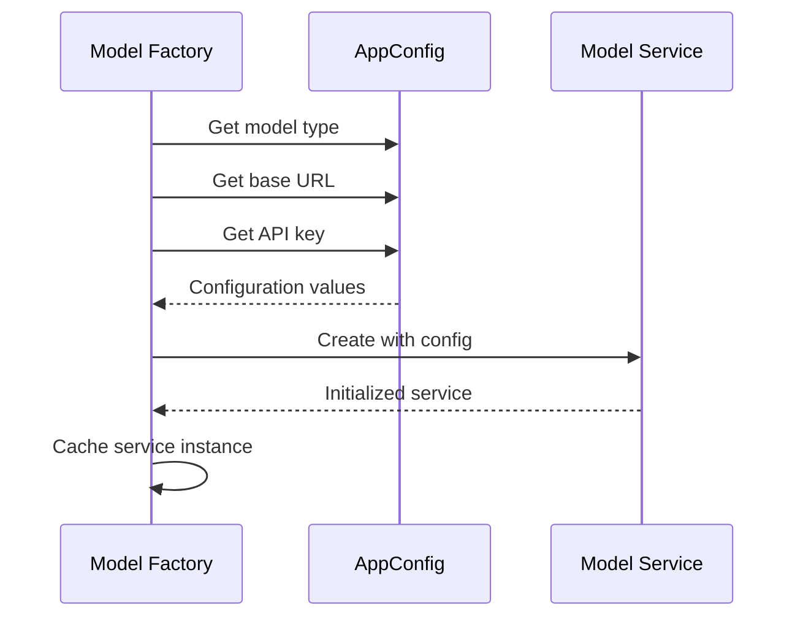

**Diagram sources**
- [src/models/modelFactory.ts](file://src/models/modelFactory.ts#L58-L62)

### Cross-Service Synchronization

Services maintain consistency through shared configuration access:

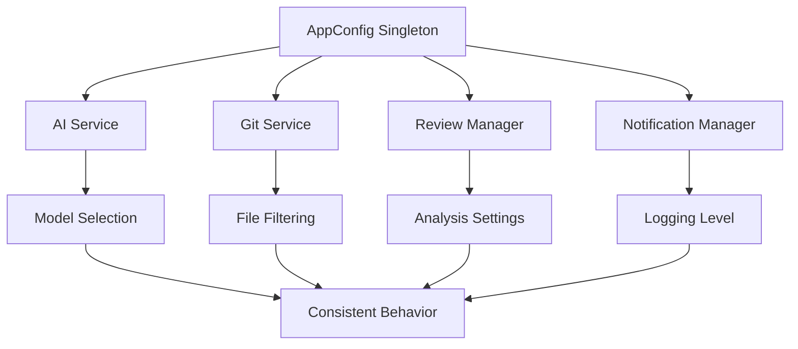

**Diagram sources**
- [src/extension.ts](file://src/extension.ts#L20-L40)

**Section sources**
- [src/services/ai/aiService.ts](file://src/services/ai/aiService.ts#L52-L61)
- [src/models/modelFactory.ts](file://src/models/modelFactory.ts#L58-L62)

## Security and Validation

The configuration system implements robust security measures and validation mechanisms to protect sensitive data and ensure system stability.

### API Key Security

The system handles API keys with special security considerations:

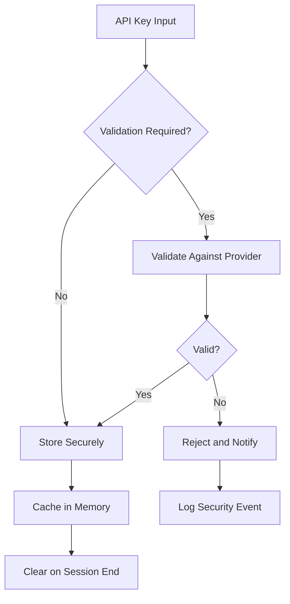

**Diagram sources**
- [src/services/ai/aiService.ts](file://src/services/ai/aiService.ts#L712-L723)

### Configuration Validation

The system implements multiple validation layers:

| Validation Layer | Purpose | Implementation |
|------------------|---------|----------------|
| **Schema Validation** | Type checking | VS Code configuration schema |
| **Business Logic** | Semantic validation | ModelValidator class |
| **Runtime Validation** | Operational checks | Service-specific validation |
| **Security Validation** | Sensitive data protection | API key validation |

### Secure Storage Practices

The configuration system follows VS Code's security guidelines:

- **Memory-only Storage**: API keys stored in memory, not persistent storage
- **Scope Limitation**: Machine-scoped storage for sensitive data
- **Encryption**: VS Code handles encryption of stored values
- **Access Control**: Restricted access through singleton pattern

**Section sources**
- [src/services/ai/aiService.ts](file://src/services/ai/aiService.ts#L712-L723)
- [src/models/modelValidator.ts](file://src/models/modelValidator.ts#L4-L14)

## Best Practices

### Configuration Management Guidelines

1. **Use Type-Safe Access**: Always use the typed getters for configuration values
2. **Handle Defaults Gracefully**: Rely on default values for optional settings
3. **Subscribe to Changes**: Register for configuration change events when needed
4. **Validate Early**: Check configuration validity during service initialization
5. **Clean Up Resources**: Dispose of listeners and cached resources appropriately

### Service Integration Patterns

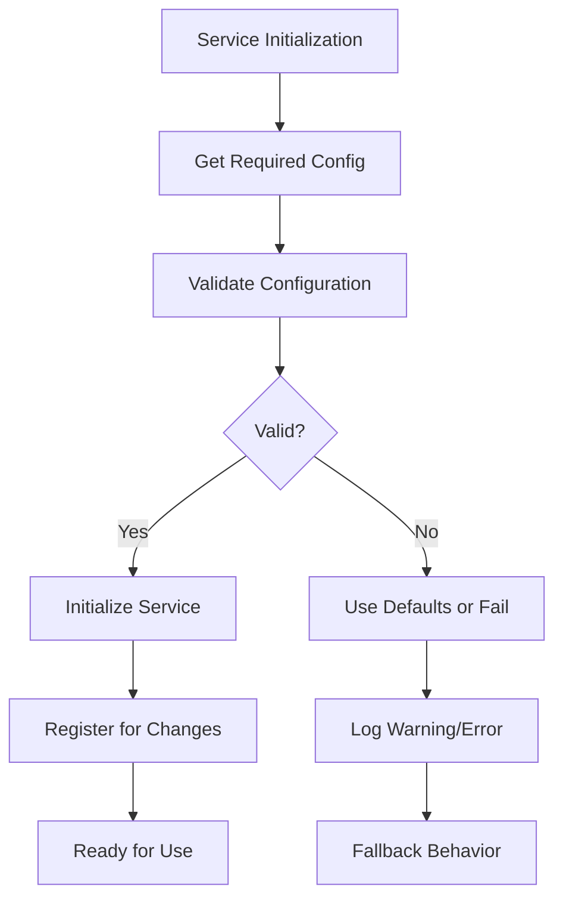

### Error Handling Strategies

The system implements comprehensive error handling:

- **Graceful Degradation**: Services continue operating with reduced functionality
- **User Notification**: Clear error messages for configuration issues
- **Fallback Mechanisms**: Default values prevent system failures
- **Logging Integration**: Detailed logs for debugging and monitoring

**Section sources**
- [src/extension.ts](file://src/extension.ts#L37-L66)
- [src/services/ai/aiService.ts](file://src/services/ai/aiService.ts#L691-L710)

## Troubleshooting

### Common Configuration Issues

| Issue | Symptoms | Solution |
|-------|----------|----------|
| **Missing API Key** | AI service fails to initialize | Configure API key through settings |
| **Invalid Model Type** | Service throws validation error | Select supported model from dropdown |
| **File Size Limits** | Large files not processed | Adjust `maxFileSizeKb` setting |
| **Exclusion Patterns** | Unexpected files included | Review and modify exclusion patterns |

### Diagnostic Commands

The extension provides several diagnostic capabilities:

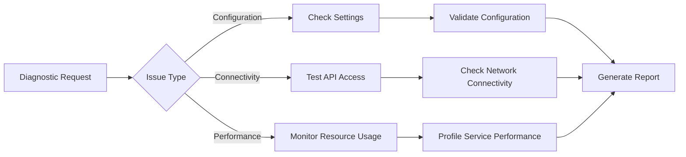

### Debug Mode Features

When debug mode is enabled, the system provides enhanced logging:

- **Detailed API Calls**: Complete request/response logging
- **Configuration Tracing**: Real-time configuration change tracking
- **Performance Metrics**: Timing information for service operations
- **Error Context**: Enhanced error messages with stack traces

**Section sources**
- [src/extension.ts](file://src/extension.ts#L37-L66)
- [src/services/ai/aiService.ts](file://src/services/ai/aiService.ts#L691-L710)