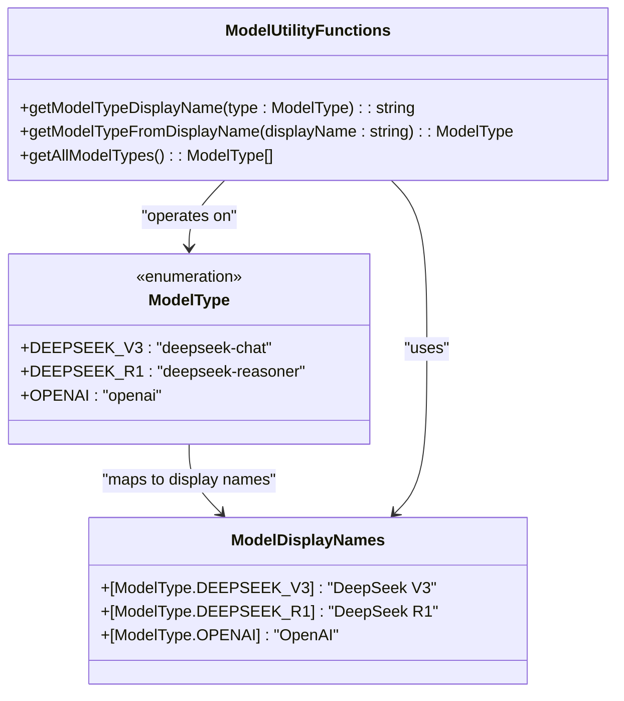
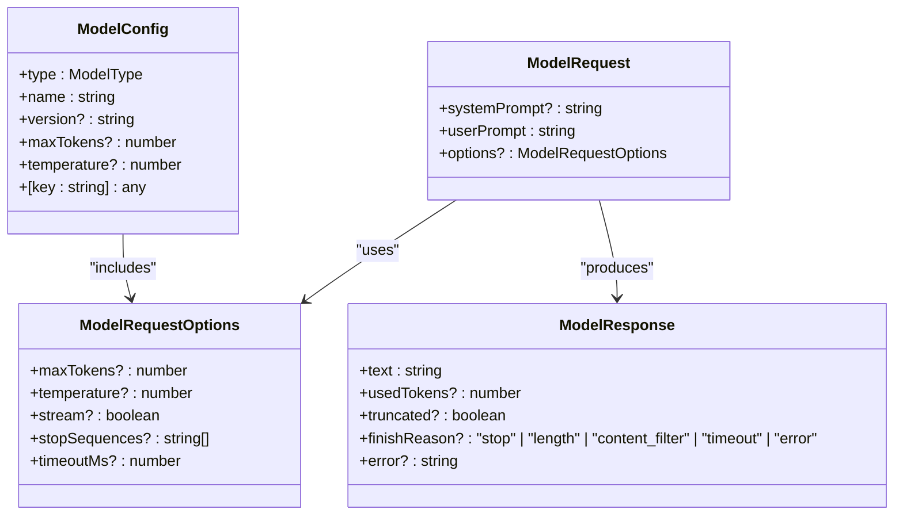
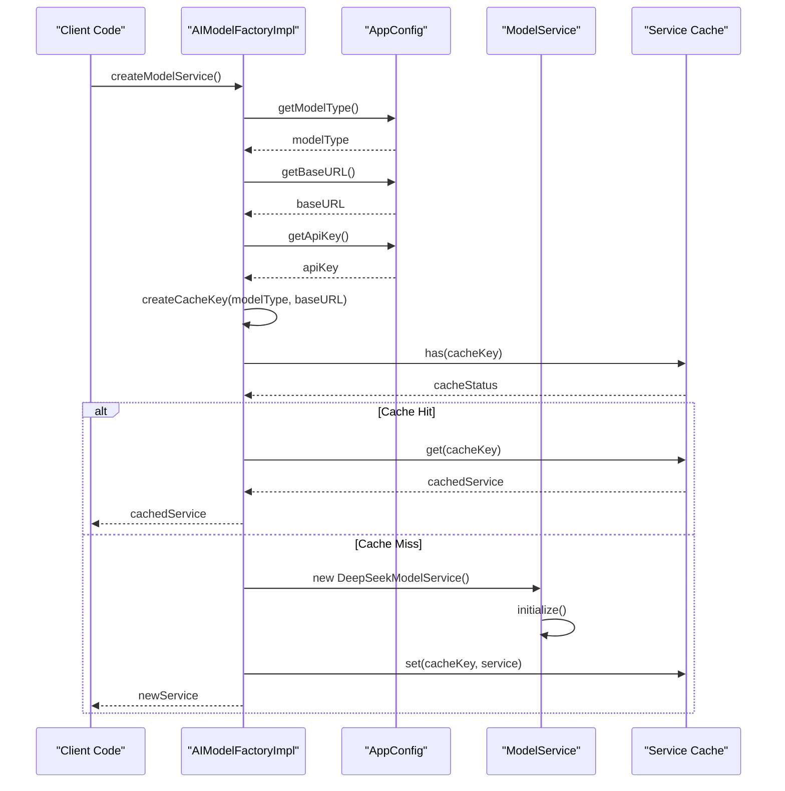
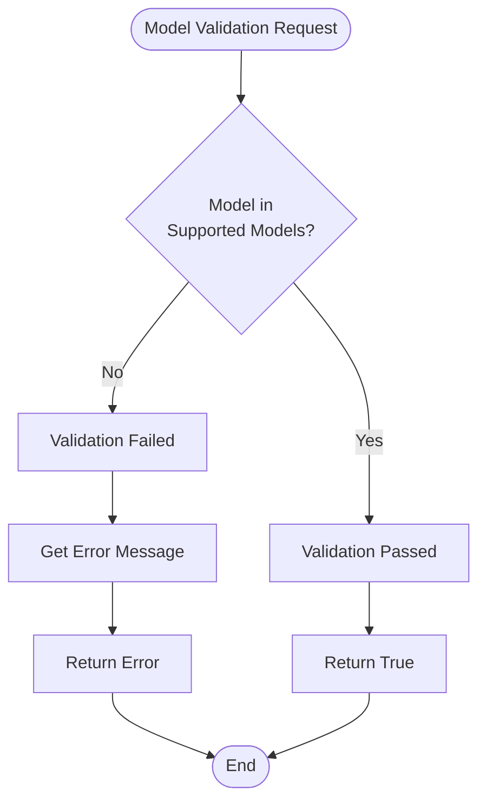
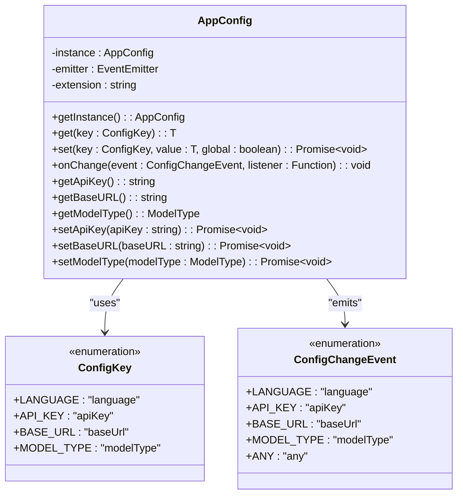
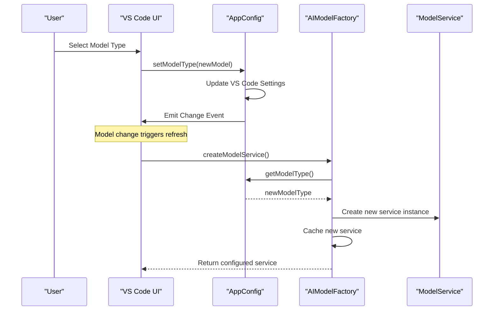
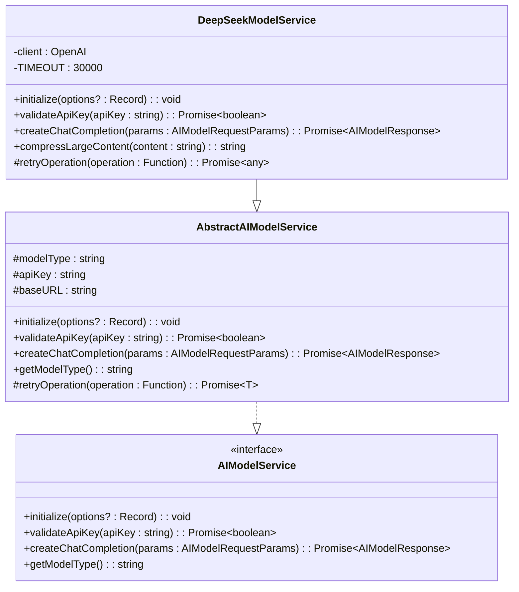
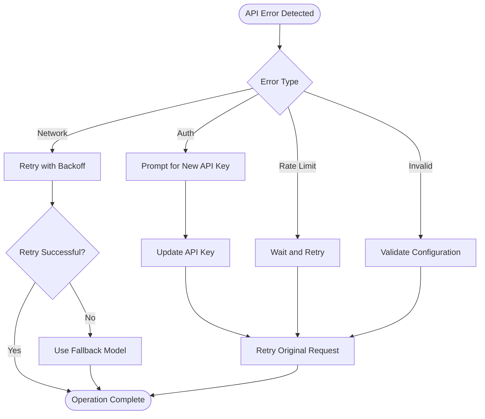

# AI Model Configuration

<cite>
**Referenced Files in This Document**
- [src/models/types.ts](file://src/models/types.ts)
- [src/models/modelFactory.ts](file://src/models/modelFactory.ts)
- [src/models/modelValidator.ts](file://src/models/modelValidator.ts)
- [src/config/appConfig.ts](file://src/config/appConfig.ts)
- [src/models/providers/deepseek.ts](file://src/models/providers/deepseek.ts)
- [src/models/modelInterface.ts](file://src/models/modelInterface.ts)
- [src/services/ai/aiService.ts](file://src/services/ai/aiService.ts)
- [package.json](file://package.json)
</cite>

## Table of Contents
1. [Introduction](#introduction)
2. [Model Type System](#model-type-system)
3. [Model Configuration Architecture](#model-configuration-architecture)
4. [Model Factory Pattern](#model-factory-pattern)
5. [Configuration Validation](#configuration-validation)
6. [Integration with Application Settings](#integration-with-application-settings)
7. [Runtime Model Selection](#runtime-model-selection)
8. [Error Handling and Troubleshooting](#error-handling-and-troubleshooting)
9. [Best Practices](#best-practices)
10. [Common Configuration Issues](#common-configuration-issues)

## Introduction

The CodeKarmic extension implements a sophisticated AI model configuration system that enables multi-model support and runtime model selection. This system provides a flexible architecture for integrating various AI providers while maintaining type safety and robust validation mechanisms.

The configuration system is built around several key components:
- **ModelType Enum**: Defines supported AI model types
- **ModelConfig Interface**: Standardizes model configuration parameters
- **ModelFactory**: Creates and manages model service instances
- **ModelValidator**: Enforces configuration validation
- **AppConfig**: Integrates with VS Code settings

## Model Type System

### ModelType Enum Definition

The `ModelType` enum serves as the foundation for multi-model support, defining all available AI model types:

**Diagram sources**
- [src/models/types.ts](file://src/models/types.ts#L10-L41)

### Supported Model Types

| Model Type | Identifier | Display Name | Provider |
|------------|------------|--------------|----------|
| DeepSeek V3 | `deepseek-chat` | DeepSeek V3 | DeepSeek API |
| DeepSeek R1 | `deepseek-reasoner` | DeepSeek R1 | DeepSeek API |
| OpenAI | `openai` | OpenAI | OpenAI API |

**Section sources**
- [src/models/types.ts](file://src/models/types.ts#L10-L21)

## Model Configuration Architecture

### ModelConfig Interface

The `ModelConfig` interface provides a standardized structure for model configuration:

**Diagram sources**
- [src/models/types.ts](file://src/models/types.ts#L46-L103)

### Configuration Field Specifications

| Field | Type | Required | Default | Valid Range | Description |
|-------|------|----------|---------|-------------|-------------|
| `type` | `ModelType` | Yes | - | Enum values | Specifies the AI model type |
| `name` | `string` | Yes | - | Any string | Human-readable model name |
| `version` | `string` | No | - | Semantic version | Model version identifier |
| `maxTokens` | `number` | No | 4096 | 1-8192 | Maximum tokens in response |
| `temperature` | `number` | No | 0.1 | 0.0-2.0 | Controls randomness in output |

**Section sources**
- [src/models/types.ts](file://src/models/types.ts#L46-L58)

## Model Factory Pattern

### AIModelFactory Implementation

The `AIModelFactoryImpl` class implements the factory pattern for creating model service instances:

**Diagram sources**
- [src/models/modelFactory.ts](file://src/models/modelFactory.ts#L58-L109)

### Factory Configuration Options

The factory supports configurable options for large file processing:

| Option | Type | Default | Description |
|--------|------|---------|-------------|
| `enableLargeFileCompression` | `boolean` | `true` | Enable automatic compression for large files |
| `compressionThreshold` | `number` | `10000` | Character threshold for compression |

**Section sources**
- [src/models/modelFactory.ts](file://src/models/modelFactory.ts#L10-L13)

## Configuration Validation

### ModelValidator Class

The `ModelValidator` ensures only supported model types are used:

**Diagram sources**
- [src/models/modelValidator.ts](file://src/models/modelValidator.ts#L4-L14)

### Validation Rules

- **Model Type Validation**: Ensures the model type is one of the supported enums
- **Error Message Generation**: Provides localized error messages for unsupported models
- **Singleton Pattern**: Uses static methods for efficient validation

**Section sources**
- [src/models/modelValidator.ts](file://src/models/modelValidator.ts#L4-L14)

## Integration with Application Settings

### AppConfig Integration

The `AppConfig` class manages application-wide settings and integrates with VS Code's configuration system:

**Diagram sources**
- [src/config/appConfig.ts](file://src/config/appConfig.ts#L49-L188)

### Configuration Defaults

| Setting | Default Value | Scope | Description |
|---------|---------------|-------|-------------|
| `language` | `"ENGLISH"` | Global | Interface language |
| `apiKey` | `""` | Machine | API authentication key |
| `baseUrl` | `"https://api.deepseek.com/v1"` | Global | API endpoint URL |
| `modelType` | `"deepseek-reasoner"` | Global | Default AI model |

**Section sources**
- [src/config/appConfig.ts](file://src/config/appConfig.ts#L37-L42)

## Runtime Model Selection

### Dynamic Model Instantiation

The system supports runtime model switching through the factory pattern:

**Diagram sources**
- [src/models/modelFactory.ts](file://src/models/modelFactory.ts#L84-L93)
- [src/config/appConfig.ts](file://src/config/appConfig.ts#L185-L187)

### Model-Specific Implementations

Currently, the system supports DeepSeek models through the `DeepSeekModelService`:

**Diagram sources**
- [src/models/modelInterface.ts](file://src/models/modelInterface.ts#L68-L117)
- [src/models/providers/deepseek.ts](file://src/models/providers/deepseek.ts#L11-L211)

**Section sources**
- [src/models/providers/deepseek.ts](file://src/models/providers/deepseek.ts#L15-L211)

## Error Handling and Troubleshooting

### Common Configuration Errors

#### 1. Invalid Model Type
**Symptoms**: `UNSUPPORTED_MODEL_TYPE` error message
**Cause**: Attempting to use a model not defined in the `ModelType` enum
**Solution**: Verify model type matches one of the supported enums

#### 2. Missing API Key
**Symptoms**: `NO_API_KEY` error during model initialization
**Cause**: API key not configured in VS Code settings
**Solution**: Configure API key in extension settings

#### 3. Invalid Base URL
**Symptoms**: Connection timeouts or 404 errors
**Cause**: Incorrect API endpoint URL
**Solution**: Verify and update base URL in settings

#### 4. Rate Limit Exceeded
**Symptoms**: 429 HTTP errors or request timeouts
**Cause**: Too many requests within rate limit window
**Solution**: Implement exponential backoff or reduce request frequency

### Error Recovery Strategies

### Debug Information Collection

The system provides comprehensive logging for troubleshooting:

- **Timestamped Logs**: All API requests include timestamps
- **Request/Response Lengths**: Logs show content sizes for debugging
- **Error Context**: Detailed error messages with stack traces
- **Performance Metrics**: Request timing and response sizes

**Section sources**
- [src/models/providers/deepseek.ts](file://src/models/providers/deepseek.ts#L95-L146)

## Best Practices

### Configuration Management

1. **Environment Variables**: Store sensitive API keys securely
2. **Default Values**: Always provide sensible defaults
3. **Validation**: Validate all configuration parameters
4. **Caching**: Cache model services to improve performance

### Model Selection Guidelines

1. **Performance vs Quality**: Choose appropriate models for task requirements
2. **Cost Optimization**: Consider token usage and pricing
3. **Latency Requirements**: Select models with acceptable response times
4. **Feature Compatibility**: Ensure model supports required features

### Error Handling Patterns

1. **Graceful Degradation**: Provide fallback options when primary fails
2. **User Feedback**: Communicate errors clearly to users
3. **Logging**: Maintain comprehensive logs for debugging
4. **Retry Logic**: Implement exponential backoff for transient failures

## Common Configuration Issues

### Issue 1: Model Not Loading
**Problem**: Model fails to initialize despite valid configuration
**Diagnosis Steps**:
1. Check API key validity using validation endpoint
2. Verify network connectivity to API endpoint
3. Confirm model type is supported
4. Review error logs for specific failure reasons

**Resolution**: 
- Test API key with validation method
- Verify firewall/proxy settings
- Check model availability status

### Issue 2: Poor Model Performance
**Problem**: Slow responses or low-quality outputs
**Possible Causes**:
- Inappropriate model selection for task
- Suboptimal temperature settings
- Token limits too restrictive

**Solutions**:
- Experiment with different model types
- Adjust temperature for creativity vs consistency
- Increase maxTokens for complex tasks

### Issue 3: Memory Issues with Large Files
**Problem**: Out-of-memory errors with large code files
**Prevention**:
- Enable large file compression
- Set appropriate compression thresholds
- Monitor memory usage patterns

**Section sources**
- [src/models/providers/deepseek.ts](file://src/models/providers/deepseek.ts#L154-L185)