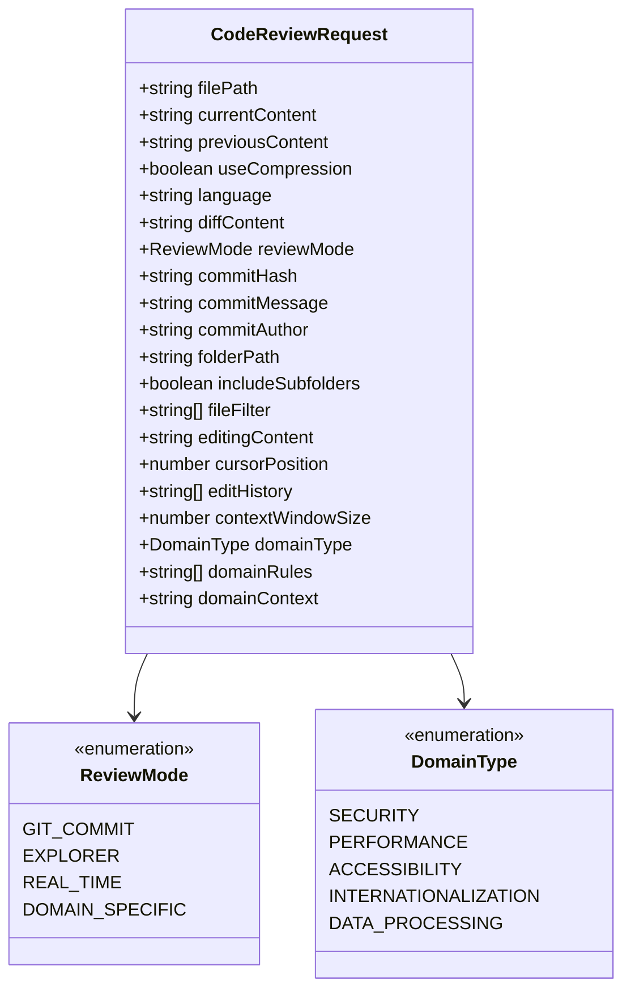
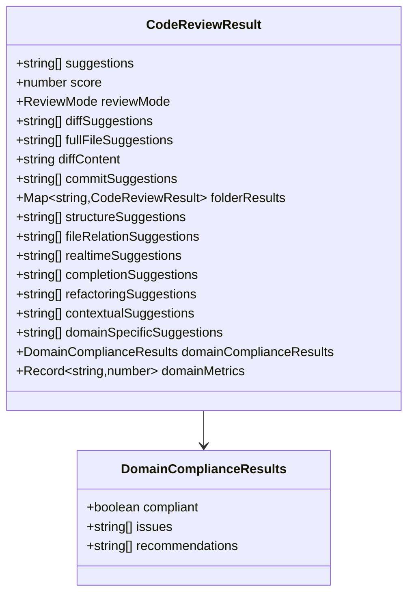
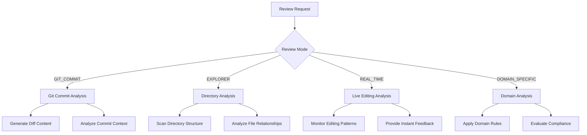
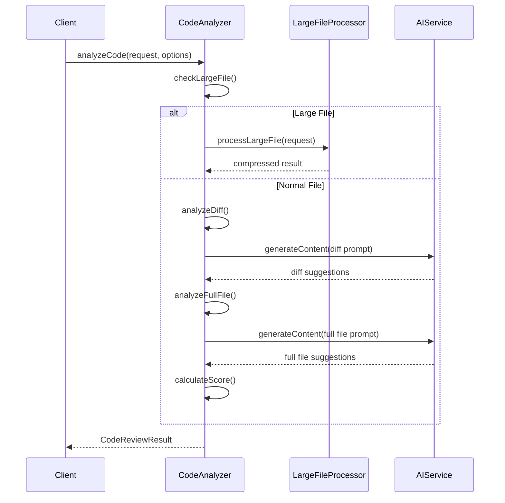
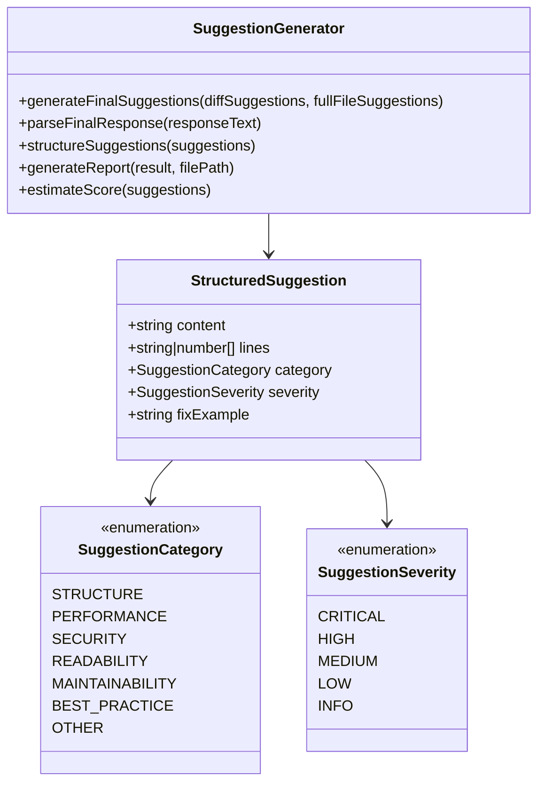
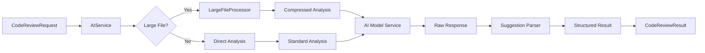
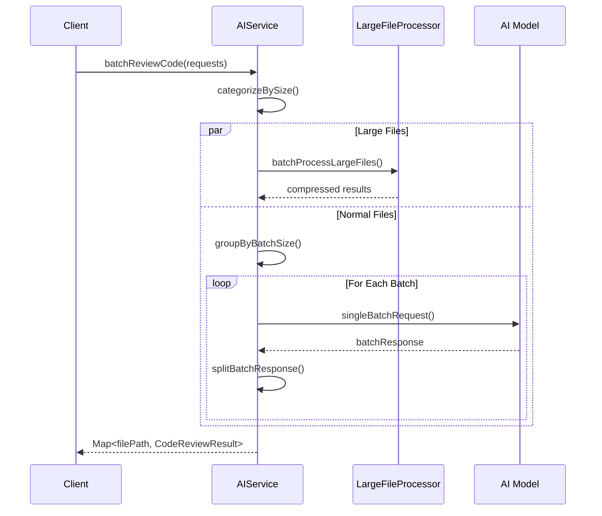
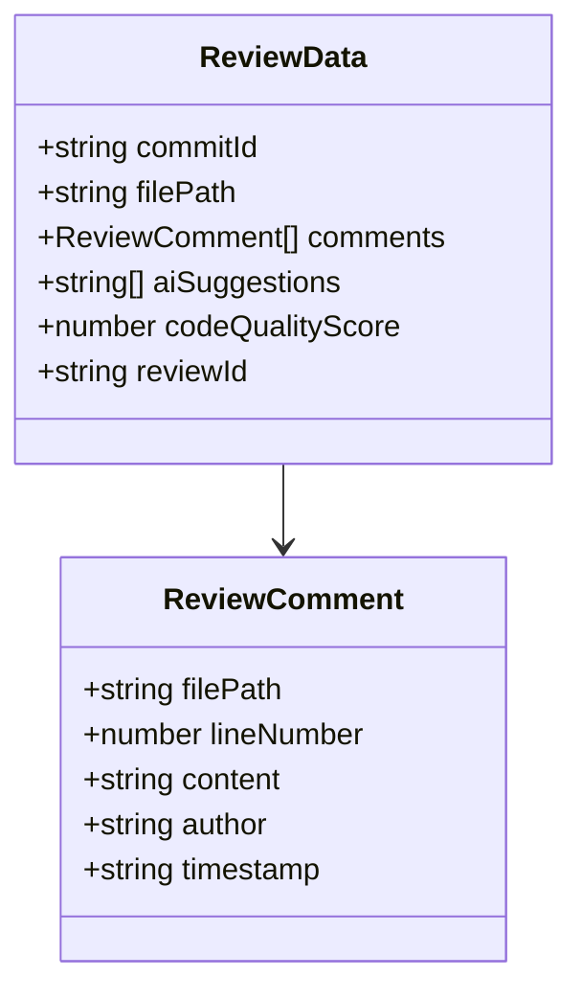
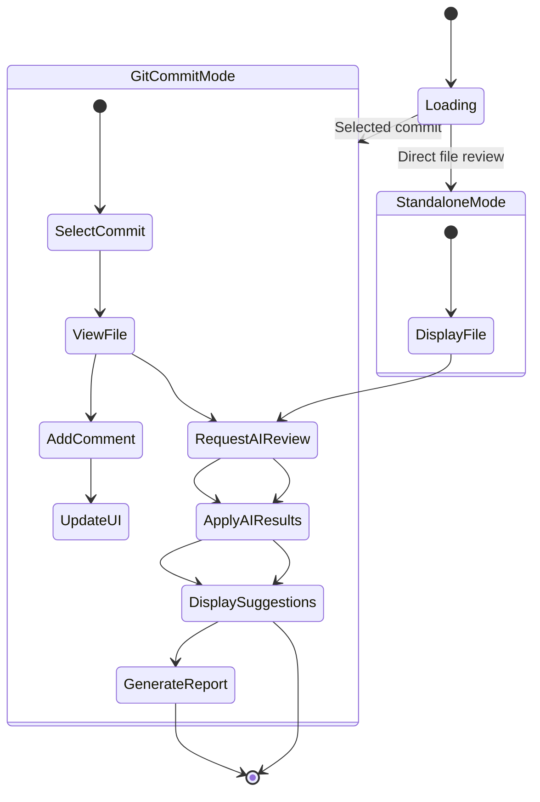

# Code Review Data Structures

<cite>
**Referenced Files in This Document**
- [reviewTypes.ts](file://src/core/review/reviewTypes.ts)
- [codeAnalyzer.ts](file://src/core/review/codeAnalyzer.ts)
- [suggestionGenerator.ts](file://src/core/review/suggestionGenerator.ts)
- [reviewPanel.ts](file://src/ui/views/reviewPanel.ts)
- [aiService.ts](file://src/services/ai/aiService.ts)
- [reviewManager.ts](file://src/services/review/reviewManager.ts)
- [chatTypes.ts](file://src/models/chatTypes.ts)
</cite>

## Table of Contents
1. [Introduction](#introduction)
2. [Core Data Models](#core-data-models)
3. [Review Modes and Configuration](#review-modes-and-configuration)
4. [Code Analysis Pipeline](#code-analysis-pipeline)
5. [Suggestion Generation and Formatting](#suggestion-generation-and-formatting)
6. [Data Flow Architecture](#data-flow-architecture)
7. [Review Panel Integration](#review-panel-integration)
8. [Error Handling and Validation](#error-handling-and-validation)
9. [Performance Considerations](#performance-considerations)
10. [Best Practices](#best-practices)

## Introduction

The CodeKarmic code review system is built around a comprehensive set of data models that structure AI-generated feedback and manage the review process across multiple review modes. These data structures serve as the foundation for organizing code analysis results, suggestions, and user interactions throughout the entire review workflow.

The system supports four distinct review modes: Git Commit, Explorer, Real-time, and Domain-specific reviews, each with specialized data structures and processing logic. The core data models ensure type safety, provide clear interfaces for AI integration, and enable efficient data transformation between different system components.

## Core Data Models

### CodeReviewRequest Interface

The `CodeReviewRequest` interface serves as the primary input structure for code review operations, containing all necessary information for AI analysis.

**Diagram sources**
- [reviewTypes.ts](file://src/core/review/reviewTypes.ts#L24-L73)

#### Field Descriptions

| Field | Type | Required | Description |
|-------|------|----------|-------------|
| `filePath` | `string` | Yes | Absolute path to the file being reviewed |
| `currentContent` | `string` | Yes | Current version of the file content |
| `previousContent` | `string` | Yes | Previous version of the file content |
| `useCompression` | `boolean?` | No | Whether to use content compression for large files |
| `language` | `string?` | No | Programming language of the file |
| `diffContent` | `string?` | No | Unified diff format for batch processing |
| `reviewMode` | `ReviewMode?` | No | Mode of operation for the review |

#### Mode-Specific Fields

**Git Commit Mode (`GIT_COMMIT`)**:
- `commitHash`: SHA hash of the commit being reviewed
- `commitMessage`: Commit message text
- `commitAuthor`: Author of the commit

**Explorer Mode (`EXPLORER`)**:
- `folderPath`: Path to the target directory
- `includeSubfolders`: Whether to include subdirectories in analysis
- `fileFilter`: Array of file patterns to include (e.g., `['*.ts', '*.js']`)

**Real-time Mode (`REAL_TIME`)**:
- `editingContent`: Current editing state of the file
- `cursorPosition`: Current cursor position in the editor
- `editHistory`: Array of recent editing actions
- `contextWindowSize`: Size of the context window around cursor

**Domain-specific Mode (`DOMAIN_SPECIFIC`)**:
- `domainType`: Specific domain classification
- `domainRules`: Custom rules for domain analysis
- `domainContext`: Additional context for domain-specific analysis

**Section sources**
- [reviewTypes.ts](file://src/core/review/reviewTypes.ts#L24-L73)

### CodeReviewResult Interface

The `CodeReviewResult` interface encapsulates the output of code analysis operations, providing structured results for different review modes.

**Diagram sources**
- [reviewTypes.ts](file://src/core/review/reviewTypes.ts#L78-L125)

#### Core Fields

| Field | Type | Description |
|-------|------|-------------|
| `suggestions` | `string[]` | Array of actionable improvement suggestions |
| `score` | `number?` | Overall code quality score (1-10) |
| `reviewMode` | `ReviewMode?` | Mode in which the analysis was performed |

#### Mode-Specific Results

**Git Commit Mode**:
- `diffSuggestions`: Suggestions specifically addressing differences
- `fullFileSuggestions`: Comprehensive suggestions for the entire file
- `diffContent`: Original diff content for reference
- `commitSuggestions`: Suggestions related to commit context

**Explorer Mode**:
- `folderResults`: Nested results for subdirectories
- `structureSuggestions`: Recommendations for project structure
- `fileRelationSuggestions`: Suggestions for inter-file relationships

**Real-time Mode**:
- `realtimeSuggestions`: Immediate feedback during editing
- `completionSuggestions`: Code completion recommendations
- `refactoringSuggestions`: Refactoring opportunities
- `contextualSuggestions`: Context-aware suggestions

**Domain-specific Mode**:
- `domainSpecificSuggestions`: Domain-specific improvement suggestions
- `domainComplianceResults`: Compliance assessment results
- `domainMetrics`: Quantitative metrics for domain analysis

**Section sources**
- [reviewTypes.ts](file://src/core/review/reviewTypes.ts#L78-L125)

### CodeReviewResponse Interface

The `CodeReviewResponse` interface provides a simplified response format for basic code review operations.

| Field | Type | Description |
|-------|------|-------------|
| `comments` | `string[]` | Array of review comments |
| `suggestions` | `string[]` | Array of improvement suggestions |
| `score` | `number` | Code quality score |

**Section sources**
- [reviewTypes.ts](file://src/core/review/reviewTypes.ts#L130-L137)

## Review Modes and Configuration

### ReviewMode Enumeration

The system supports four distinct review modes, each optimized for specific use cases:

**Diagram sources**
- [reviewTypes.ts](file://src/core/review/reviewTypes.ts#L10-L19)

### CodeAnalysisOptions Interface

The `CodeAnalysisOptions` interface controls the behavior of code analysis operations across different modes.

| Option Category | Fields | Purpose |
|----------------|--------|---------|
| **General** | `useCompression`, `maxTokens` | Control processing behavior |
| **Git Mode** | `includeDiffAnalysis`, `includeFullFileAnalysis` | Configure Git-specific analysis |
| **Explorer Mode** | `includeStructureAnalysis`, `includeFileRelationAnalysis` | Control directory analysis depth |
| **Real-time Mode** | `includeRealtimeAnalysis`, `realtimeAnalysisDelay` | Manage live analysis timing |
| **Domain Mode** | `includeDomainSpecificAnalysis`, `domainComplianceLevel` | Control domain-specific processing |

**Section sources**
- [reviewTypes.ts](file://src/core/review/reviewTypes.ts#L142-L189)

## Code Analysis Pipeline

### CodeAnalyzer Class

The `CodeAnalyzer` class orchestrates the code analysis process, handling both difference and full file analysis.

**Diagram sources**
- [codeAnalyzer.ts](file://src/core/review/codeAnalyzer.ts#L35-L82)

### Analysis Process Flow

1. **Input Validation**: Verify file size and content validity
2. **Compression Check**: Determine if large file processing is needed
3. **Diff Analysis**: Analyze changes between versions
4. **Full File Analysis**: Examine entire file context
5. **Score Calculation**: Compute overall quality rating
6. **Result Assembly**: Combine suggestions and metadata

**Section sources**
- [codeAnalyzer.ts](file://src/core/review/codeAnalyzer.ts#L35-L82)

## Suggestion Generation and Formatting

### SuggestionGenerator Class

The `SuggestionGenerator` class transforms raw AI suggestions into structured, categorized feedback.

**Diagram sources**
- [suggestionGenerator.ts](file://src/core/review/suggestionGenerator.ts#L39-L50)

### Suggestion Categorization

The system automatically categorizes suggestions based on content analysis:

| Category | Description | Keywords |
|----------|-------------|----------|
| `STRUCTURE` | Code organization and architecture | `结构`, `组织`, `架构`, `模块` |
| `PERFORMANCE` | Efficiency and optimization | `性能`, `效率`, `优化`, `速度` |
| `SECURITY` | Security vulnerabilities | `安全`, `漏洞`, `注入`, `验证` |
| `READABILITY` | Code clarity and naming | `可读性`, `命名`, `注释`, `格式` |
| `MAINTAINABILITY` | Long-term maintainability | `可维护性`, `重复`, `复杂度`, `测试` |
| `BEST_PRACTICE` | Coding standards | `最佳实践`, `约定`, `标准`, `模式` |

### Severity Levels

| Severity | Icon | Description |
|----------|------|-------------|
| `CRITICAL` | 🔴 | Critical issues requiring immediate attention |
| `HIGH` | 🟠 | Important issues that should be addressed soon |
| `MEDIUM` | 🟡 | Moderate issues with reasonable priority |
| `LOW` | 🟢 | Minor improvements with low priority |
| `INFO` | 🔵 | Informational suggestions and tips |

**Section sources**
- [suggestionGenerator.ts](file://src/core/review/suggestionGenerator.ts#L183-L248)

## Data Flow Architecture

### AIService Integration

The `AIService` class serves as the central hub for AI-powered code review operations, managing the complete request-response cycle.

**Diagram sources**
- [aiService.ts](file://src/services/ai/aiService.ts#L74-L119)

### Batch Processing

The system supports efficient batch processing for multiple files:

**Diagram sources**
- [aiService.ts](file://src/services/ai/aiService.ts#L426-L552)

**Section sources**
- [aiService.ts](file://src/services/ai/aiService.ts#L74-L119)

## Review Panel Integration

### ReviewData Structure

The `ReviewData` interface manages review state and results within the UI layer.

| Field | Type | Description |
|-------|------|-------------|
| `commitId` | `string` | Associated commit identifier |
| `filePath` | `string` | Target file path |
| `comments` | `ReviewComment[]` | User comments on the file |
| `aiSuggestions` | `string[]` | AI-generated improvement suggestions |
| `codeQualityScore` | `number?` | Calculated quality score |
| `reviewId` | `string` | Unique identifier for the review session |

### ReviewComment Interface

**Diagram sources**
- [reviewManager.ts](file://src/services/review/reviewManager.ts#L11-L17)

### UI Interaction Flow

The review panel provides interactive capabilities for reviewing and managing suggestions:

**Diagram sources**
- [reviewPanel.ts](file://src/ui/views/reviewPanel.ts#L149-L239)

**Section sources**
- [reviewManager.ts](file://src/services/review/reviewManager.ts#L19-L26)
- [reviewPanel.ts](file://src/ui/views/reviewPanel.ts#L149-L239)

## Error Handling and Validation

### Error Context Management

The system provides comprehensive error tracking through the `ErrorContext` enumeration:

| Context | Description |
|---------|-------------|
| `initialize` | Repository initialization failures |
| `setSelectedCommit` | Commit selection errors |
| `selectCommit` | Commit retrieval problems |
| `viewFile` | File opening issues |
| `reviewFile` | File review processing errors |
| `addComment` | Comment addition failures |
| `addAISuggestion` | AI suggestion processing errors |
| `setCodeQualityScore` | Score assignment problems |
| `generateReport` | Report generation failures |

### Validation Patterns

The system implements multiple validation layers:

1. **Input Validation**: File existence, content validity, parameter constraints
2. **Processing Validation**: AI service availability, model response parsing
3. **Output Validation**: Result completeness, data consistency checks
4. **UI Validation**: User input sanitization, state consistency

**Section sources**
- [reviewManager.ts](file://src/services/review/reviewManager.ts#L28-L77)

## Performance Considerations

### Large File Handling

The system optimizes performance for large files through several mechanisms:

- **Compression Threshold**: Automatic detection of files exceeding 50KB
- **Incremental Processing**: Batch processing with configurable batch sizes
- **Caching**: Diff content caching to avoid redundant computations
- **Streaming**: Real-time response processing for improved user experience

### Memory Management

- **Map-based Storage**: Efficient storage of review data using JavaScript Maps
- **Garbage Collection**: Proper cleanup of temporary objects and promises
- **Concurrent Processing**: Parallel analysis of independent files

### Network Optimization

- **Request Batching**: Combining multiple analysis requests into single API calls
- **Retry Logic**: Automatic retry with exponential backoff for transient failures
- **Timeout Management**: Configurable timeouts to prevent hanging operations

## Best Practices

### Data Model Usage Guidelines

1. **Type Safety**: Always use strongly-typed interfaces for data exchange
2. **Null Handling**: Implement proper null checking for optional fields
3. **Validation**: Validate all inputs before processing
4. **Documentation**: Maintain clear documentation for each field's purpose

### Review Mode Selection

Choose the appropriate review mode based on use case:

- **Git Commit Mode**: For reviewing changes between commits
- **Explorer Mode**: For analyzing project structure and relationships
- **Real-time Mode**: For interactive editing assistance
- **Domain-specific Mode**: For specialized domain analysis

### Performance Optimization

- **Batch Processing**: Use batch APIs when analyzing multiple files
- **Caching**: Leverage diff caching for repeated operations
- **Compression**: Enable compression for large files (>50KB)
- **Streaming**: Use streaming responses for better user experience

### Error Recovery

Implement robust error recovery mechanisms:

- **Graceful Degradation**: Provide fallback functionality when AI services are unavailable
- **User Feedback**: Clear error messages with actionable guidance
- **Logging**: Comprehensive logging for debugging and monitoring
- **Retry Logic**: Intelligent retry mechanisms for transient failures