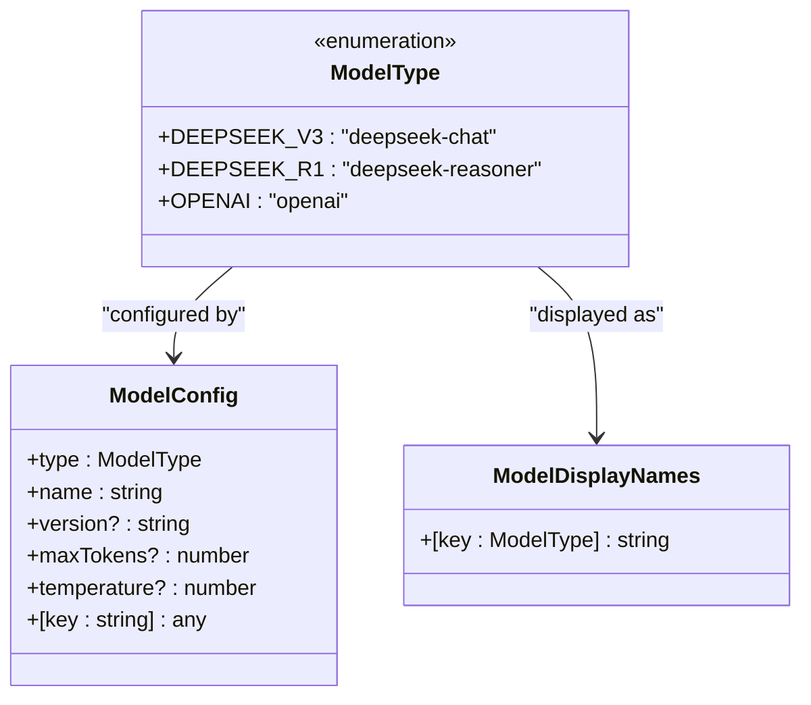
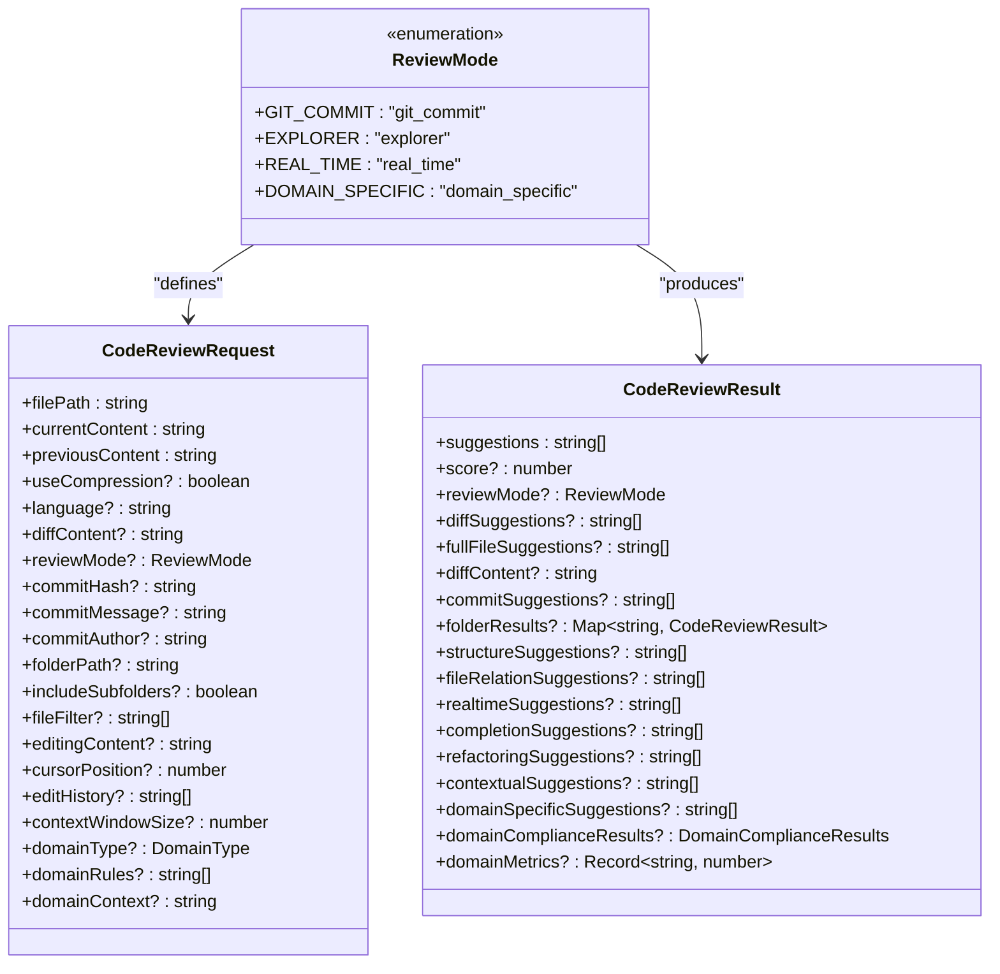
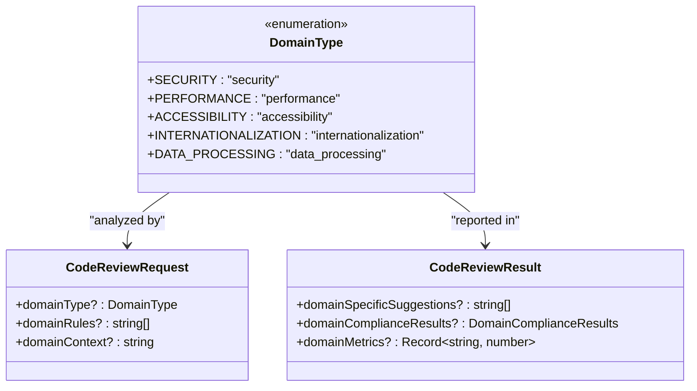
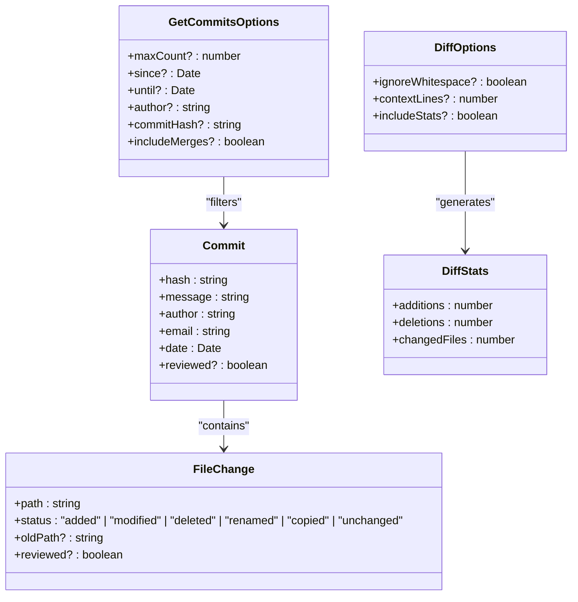
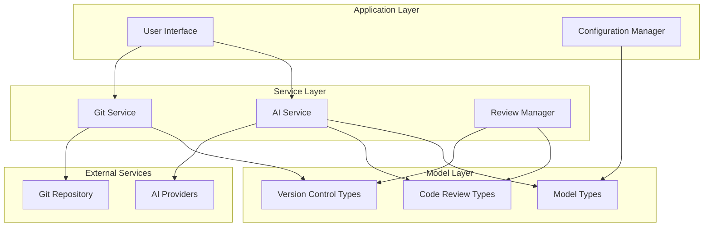
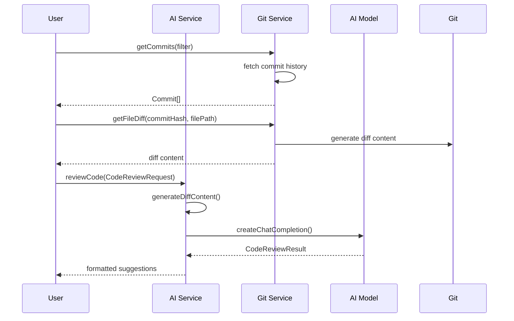
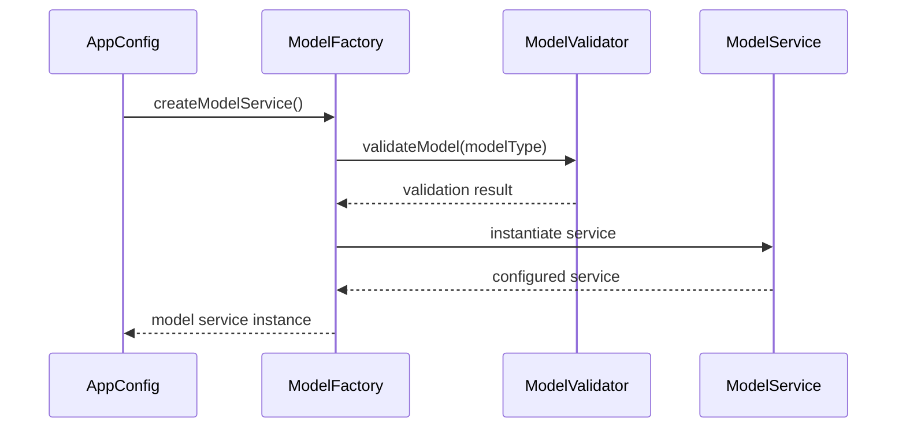
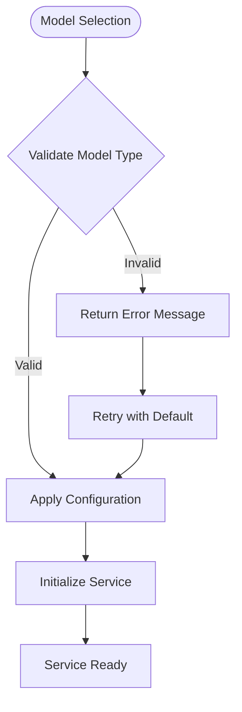
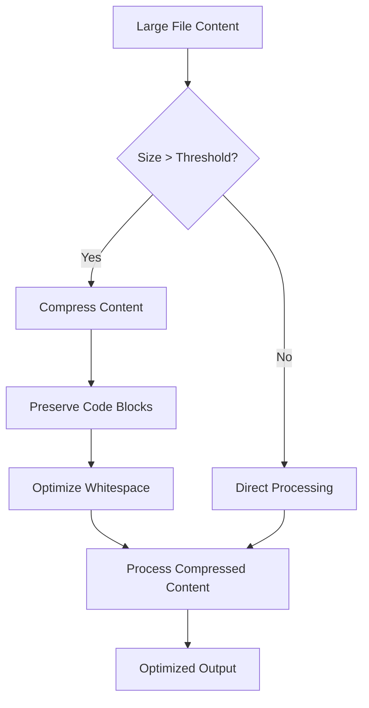

# Data Models

<cite>
**Referenced Files in This Document**
- [src/models/types.ts](file://src/models/types.ts)
- [src/core/review/reviewTypes.ts](file://src/core/review/reviewTypes.ts)
- [src/services/git/versionControlTypes.ts](file://src/services/git/versionControlTypes.ts)
- [src/services/ai/aiService.ts](file://src/services/ai/aiService.ts)
- [src/services/git/gitService.ts](file://src/services/git/gitService.ts)
- [src/models/baseModel.ts](file://src/models/baseModel.ts)
- [src/models/modelValidator.ts](file://src/models/modelValidator.ts)
- [src/models/modelFactory.ts](file://src/models/modelFactory.ts)
- [src/config/appConfig.ts](file://src/config/appConfig.ts)
</cite>

## Table of Contents
1. [Introduction](#introduction)
2. [Core Model Types](#core-model-types)
3. [Code Review Models](#code-review-models)
4. [Version Control Models](#version-control-models)
5. [Model Relationships](#model-relationships)
6. [Usage Examples](#usage-examples)
7. [Type Validation and Configuration](#type-validation-and-configuration)
8. [Advanced Features](#advanced-features)
9. [Best Practices](#best-practices)

## Introduction

CodeKarmic utilizes a comprehensive set of data models to manage AI-driven code reviews, version control operations, and model configurations. These models provide type safety, validation, and structured data flow throughout the application. The system supports multiple AI models, various review modes, and sophisticated version control integration.

## Core Model Types

### ModelType Enum

The `ModelType` enum defines the supported AI model types used throughout the CodeKarmic system.



**Diagram sources**
- [src/models/types.ts](file://src/models/types.ts#L10-L21)

#### ModelType Values

| Value | Description | Use Case |
|-------|-------------|----------|
| `DEEPSEEK_V3` | DeepSeek Chat model | General code analysis and review |
| `DEEPSEEK_R1` | DeepSeek Reasoner model | Advanced reasoning tasks and complex analysis |
| `OPENAI` | OpenAI model | Alternative AI provider integration |

#### Model Configuration Properties

| Property | Type | Required | Description |
|----------|------|----------|-------------|
| `type` | `ModelType` | Yes | The AI model type identifier |
| `name` | `string` | Yes | Human-readable model name |
| `version` | `string` | No | Model version specification |
| `maxTokens` | `number` | No | Maximum token limit for responses |
| `temperature` | `number` | No | Randomness factor for response generation (0.0-2.0) |

**Section sources**
- [src/models/types.ts](file://src/models/types.ts#L10-L103)

### Model Request and Response Types

The system defines comprehensive interfaces for AI model interactions:

#### ModelRequest Interface
- `systemPrompt?: string` - System-level instructions
- `userPrompt: string` - User-provided input
- `options?: ModelRequestOptions` - Request-specific options

#### ModelResponse Interface
- `text: string` - Generated response text
- `usedTokens?: number` - Number of tokens consumed
- `truncated?: boolean` - Whether response was truncated
- `finishReason?: string` - Reason for completion
- `error?: string` - Error information if applicable

**Section sources**
- [src/models/types.ts](file://src/models/types.ts#L64-L103)

## Code Review Models

### ReviewMode Enum

The `ReviewMode` enum defines the different code review approaches supported by CodeKarmic.



**Diagram sources**
- [src/core/review/reviewTypes.ts](file://src/core/review/reviewTypes.ts#L10-L206)

#### Review Mode Types

| Mode | Identifier | Description | Key Features |
|------|------------|-------------|--------------|
| Git Commit | `git_commit` | Review based on Git commit history | Commit analysis, diff comparison, author attribution |
| Explorer | `explorer` | Review files/folders in VS Code Explorer | Batch processing, folder structure analysis |
| Real-time | `real_time` | Live editing assistance | Cursor position tracking, edit history analysis |
| Domain-specific | `domain_specific` | Specialized domain review | Security, performance, accessibility compliance |

### CodeReviewRequest Detailed Fields

#### Core Fields
- `filePath: string` - Absolute path to the target file
- `currentContent: string` - Current file content
- `previousContent: string` - Previous version content (for diffs)
- `useCompression?: boolean` - Enable content compression for large files
- `language?: string` - Programming language detection
- `diffContent?: string` - Pre-computed diff for batch processing

#### Mode-Specific Fields

**Git Commit Mode (`git_commit`)**
- `commitHash?: string` - Git commit SHA hash
- `commitMessage?: string` - Commit message content
- `commitAuthor?: string` - Author name

**Explorer Mode (`explorer`)**
- `folderPath?: string` - Target directory path
- `includeSubfolders?: boolean` - Recursive directory traversal
- `fileFilter?: string[]` - File pattern filters (e.g., `['*.ts', '*.js']`)

**Real-time Mode (`real_time`)**
- `editingContent?: string` - Current editing buffer
- `cursorPosition?: number` - Caret position in content
- `editHistory?: string[]` - Recent edit operations
- `contextWindowSize?: number` - Context window size for analysis

**Domain-specific Mode (`domain_specific`)**
- `domainType?: DomainType` - Specific domain classification
- `domainRules?: string[]` - Custom compliance rules
- `domainContext?: string` - Domain-specific context

### CodeReviewResult Structure

The `CodeReviewResult` interface adapts its structure based on the review mode:

#### Common Fields
- `suggestions: string[]` - List of improvement suggestions
- `score?: number` - Quality rating (0-10 scale)
- `reviewMode?: ReviewMode` - Originating review mode

#### Mode-Specific Results

**Git Commit Mode Results**
- `diffSuggestions?: string[]` - Suggestions based on differences
- `fullFileSuggestions?: string[]` - Complete file analysis suggestions
- `diffContent?: string` - Generated diff content
- `commitSuggestions?: string[]` - Commit-specific feedback

**Explorer Mode Results**
- `folderResults?: Map<string, CodeReviewResult>` - Per-file analysis results
- `structureSuggestions?: string[]` - Project structure improvements
- `fileRelationSuggestions?: string[]` - Inter-file relationship advice

**Real-time Mode Results**
- `realtimeSuggestions?: string[]` - Immediate editing feedback
- `completionSuggestions?: string[]` - Code completion assistance
- `refactoringSuggestions?: string[]` - Refactoring opportunities
- `contextualSuggestions?: string[]` - Context-aware recommendations

**Domain-specific Mode Results**
- `domainSpecificSuggestions?: string[]` - Domain-compliance advice
- `domainComplianceResults?: DomainComplianceResults` - Compliance assessment
- `domainMetrics?: Record<string, number>` - Domain-specific metrics

**Section sources**
- [src/core/review/reviewTypes.ts](file://src/core/review/reviewTypes.ts#L24-L206)

### DomainType Enum

Specialized domain review types for focused code analysis:



**Diagram sources**
- [src/core/review/reviewTypes.ts](file://src/core/review/reviewTypes.ts#L194-L205)

#### Domain Types

| Type | Purpose | Analysis Focus |
|------|---------|----------------|
| `SECURITY` | Security vulnerability detection | Injection prevention, authentication, authorization |
| `PERFORMANCE` | Performance optimization | Algorithm efficiency, resource usage, scalability |
| `ACCESSIBILITY` | Accessibility compliance | Screen reader support, keyboard navigation, WCAG guidelines |
| `INTERNATIONALIZATION` | Internationalization support | Localization, Unicode handling, cultural adaptation |
| `DATA_PROCESSING` | Data handling optimization | Data validation, sanitization, processing efficiency |

**Section sources**
- [src/core/review/reviewTypes.ts](file://src/core/review/reviewTypes.ts#L194-L205)

## Version Control Models

### Commit Interface

Represents a Git commit with comprehensive metadata:



**Diagram sources**
- [src/services/git/versionControlTypes.ts](file://src/services/git/versionControlTypes.ts#L10-L80)

#### Commit Properties

| Property | Type | Description |
|----------|------|-------------|
| `hash` | `string` | Full commit SHA hash |
| `message` | `string` | Commit message content |
| `author` | `string` | Author name |
| `email` | `string` | Author email address |
| `date` | `Date` | Commit timestamp |
| `reviewed` | `boolean` | Review completion status |

#### FileChange Status Types

| Status | Description | Use Case |
|--------|-------------|----------|
| `added` | New file in commit | Track additions |
| `modified` | Modified file content | Analyze changes |
| `deleted` | Removed file | Understand removals |
| `renamed` | File moved/renamed | Track renames |
| `copied` | File copied from elsewhere | Detect copies |
| `unchanged` | File unchanged | Filter unchanged files |

#### Commit Retrieval Options

| Option | Type | Description |
|--------|------|-------------|
| `maxCount` | `number` | Maximum commits to retrieve |
| `since` | `Date` | Start date filter |
| `until` | `Date` | End date filter |
| `author` | `string` | Author name filter |
| `commitHash` | `string` | Specific commit retrieval |
| `includeMerges` | `boolean` | Include merge commits |

#### Diff Generation Options

| Option | Type | Description |
|--------|------|-------------|
| `ignoreWhitespace` | `boolean` | Skip whitespace-only changes |
| `contextLines` | `number` | Lines of context around changes |
| `includeStats` | `boolean` | Include statistics in results |

**Section sources**
- [src/services/git/versionControlTypes.ts](file://src/services/git/versionControlTypes.ts#L10-L80)

## Model Relationships

### System Architecture Overview



**Diagram sources**
- [src/services/ai/aiService.ts](file://src/services/ai/aiService.ts#L1-L50)
- [src/services/git/gitService.ts](file://src/services/git/gitService.ts#L1-L50)

### Data Flow Patterns

#### Git Commit Review Flow



**Diagram sources**
- [src/services/ai/aiService.ts](file://src/services/ai/aiService.ts#L75-L120)
- [src/services/git/gitService.ts](file://src/services/git/gitService.ts#L707-L794)

#### Model Configuration Flow



**Diagram sources**
- [src/config/appConfig.ts](file://src/config/appConfig.ts#L179-L188)
- [src/models/modelFactory.ts](file://src/models/modelFactory.ts#L113-L140)
- [src/models/modelValidator.ts](file://src/models/modelValidator.ts#L1-L14)

**Section sources**
- [src/services/ai/aiService.ts](file://src/services/ai/aiService.ts#L40-L70)
- [src/services/git/gitService.ts](file://src/services/git/gitService.ts#L45-L90)

## Usage Examples

### Basic Code Review Request

```typescript
// Simple file review
const basicRequest: CodeReviewRequest = {
    filePath: '/path/to/file.ts',
    currentContent: '// Current file content...',
    previousContent: '// Previous file content...',
    language: 'typescript',
    useCompression: true
};

// Git commit review
const gitRequest: CodeReviewRequest = {
    filePath: '/path/to/file.ts',
    currentContent: '// Current content...',
    previousContent: '// Previous content...',
    reviewMode: ReviewMode.GIT_COMMIT,
    commitHash: 'abc123def456',
    commitMessage: 'Fix bug in user authentication',
    commitAuthor: 'developer@example.com'
};
```

### Model Configuration Example

```typescript
// DeepSeek V3 configuration
const deepseekConfig: ModelConfig = {
    type: ModelType.DEEPSEEK_V3,
    name: 'DeepSeek V3 Chat',
    version: 'v3.1',
    maxTokens: 4000,
    temperature: 0.1
};

// OpenAI configuration
const openaiConfig: ModelConfig = {
    type: ModelType.OPENAI,
    name: 'GPT-4',
    maxTokens: 8000,
    temperature: 0.3,
    top_p: 0.9
};
```

### Version Control Operations

```typescript
// Get recent commits
const commitOptions: GetCommitsOptions = {
    maxCount: 10,
    since: new Date(Date.now() - 7 * 24 * 60 * 60 * 1000), // Last 7 days
    includeMerges: false
};

// Generate diff with custom options
const diffOptions: DiffOptions = {
    ignoreWhitespace: true,
    contextLines: 3,
    includeStats: true
};
```

### Domain-Specific Review

```typescript
// Security-focused review
const securityRequest: CodeReviewRequest = {
    filePath: '/path/to/security/file.ts',
    currentContent: '// Security-sensitive code...',
    previousContent: '// Previous version...',
    reviewMode: ReviewMode.DOMAIN_SPECIFIC,
    domainType: DomainType.SECURITY,
    domainRules: ['OWASP Top 10', 'CWE Guidelines'],
    domainContext: 'Financial transaction processing'
};
```

**Section sources**
- [src/core/review/reviewTypes.ts](file://src/core/review/reviewTypes.ts#L24-L73)
- [src/models/types.ts](file://src/models/types.ts#L46-L103)

## Type Validation and Configuration

### Model Validation

The system provides robust validation for model types and configurations:



**Diagram sources**
- [src/models/modelValidator.ts](file://src/models/modelValidator.ts#L1-L14)

#### Validation Functions

| Function | Purpose | Return Type |
|----------|---------|-------------|
| `validateModel()` | Check if model type is supported | `boolean` |
| `getErrorMessage()` | Get formatted error message | `string` |
| `getAllModelTypes()` | Retrieve all supported types | `ModelType[]` |

### Configuration Management

#### Application Configuration

The `AppConfig` class manages model preferences and global settings:

```typescript
// Setting model type
await config.setModelType(ModelType.DEEPSEEK_V3);

// Getting current configuration
const currentModel = config.getModelType();
const apiKey = config.getApiKey();
```

#### Dynamic Model Switching

The system supports runtime model switching with automatic service recreation:

```typescript
// Change model dynamically
const factory = AIModelFactoryImpl.getInstance();
factory.clearModelServices(); // Clear cached instances
factory.createModelService(); // Recreate with new model
```

**Section sources**
- [src/models/modelValidator.ts](file://src/models/modelValidator.ts#L1-L14)
- [src/config/appConfig.ts](file://src/config/appConfig.ts#L179-L188)
- [src/models/modelFactory.ts](file://src/models/modelFactory.ts#L113-L140)

## Advanced Features

### Compression and Large File Handling

The system includes intelligent content compression for large files:



**Diagram sources**
- [src/models/baseModel.ts](file://src/models/baseModel.ts#L20-L60)

#### Compression Features

- **Code Block Preservation**: Maintains fenced code blocks during compression
- **Whitespace Optimization**: Reduces excessive spacing while preserving readability
- **Threshold Configuration**: Configurable size thresholds for compression triggers
- **Performance Monitoring**: Tracks compression effectiveness

### Streaming and Batch Processing

#### Streaming AI Responses

The AI service supports real-time streaming for improved user experience:

```typescript
// Stream-enabled request
const streamingRequest = {
    messages: [...],
    stream: true,
    max_tokens: 8192,
    temperature: 0.1
};
```

#### Batch Processing Capabilities

```typescript
// Batch review multiple files
const batchRequests: CodeReviewRequest[] = [
    { filePath: 'file1.ts', ... },
    { filePath: 'file2.ts', ... },
    { filePath: 'file3.ts', ... }
];

const results = await aiService.batchReviewCode(batchRequests);
```

### Caching and Performance Optimization

#### Diff Content Caching

The AI service implements intelligent caching for Git diff operations:

```typescript
// Cache key generation based on content fingerprint
const cacheKey = `${filePath}:${calculateFingerprint(currentContent)}`;
diffCache.set(cacheKey, diffContent);
```

#### Model Service Caching

The factory pattern provides singleton model service instances:

```typescript
// Singleton pattern for model services
private static instance: AIModelFactoryImpl;
public static getInstance(): AIModelFactoryImpl {
    if (!this.instance) {
        this.instance = new AIModelFactoryImpl();
    }
    return this.instance;
}
```

**Section sources**
- [src/models/baseModel.ts](file://src/models/baseModel.ts#L20-L60)
- [src/services/ai/aiService.ts](file://src/services/ai/aiService.ts#L426-L552)

## Best Practices

### Model Selection Guidelines

1. **Use DEEPSEEK_V3** for general code analysis and standard reviews
2. **Choose DEEPSEEK_R1** for complex reasoning tasks and advanced analysis
3. **Select OPENAI** for specialized use cases requiring OpenAI's capabilities

### Review Mode Selection

1. **Git Commit Mode**: Use for historical analysis and pull request reviews
2. **Explorer Mode**: Ideal for bulk analysis of project directories
3. **Real-time Mode**: Perfect for interactive development sessions
4. **Domain-specific Mode**: Essential for compliance-focused code reviews

### Performance Optimization

1. **Enable Compression**: For files larger than 50KB, enable compression
2. **Use Streaming**: Enable streaming for better user experience
3. **Implement Caching**: Leverage built-in caching mechanisms
4. **Batch Processing**: Group similar operations for efficiency

### Error Handling

1. **Validate Model Types**: Always validate model selections before use
2. **Handle API Errors**: Implement robust error handling for AI service calls
3. **Fallback Mechanisms**: Provide fallback options for failed operations
4. **Logging**: Maintain comprehensive logs for debugging and monitoring

### Configuration Management

1. **Environment Variables**: Store sensitive configuration in environment variables
2. **Validation**: Validate all configuration inputs
3. **Default Values**: Provide sensible defaults for optional parameters
4. **Documentation**: Document all configuration options clearly