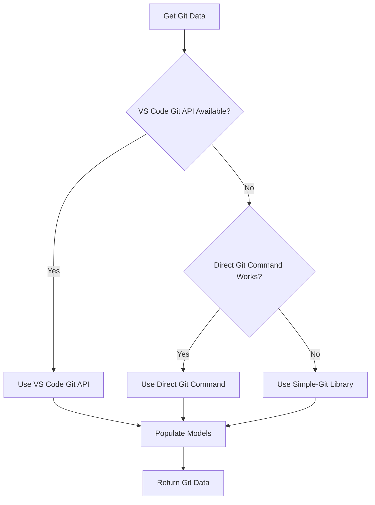
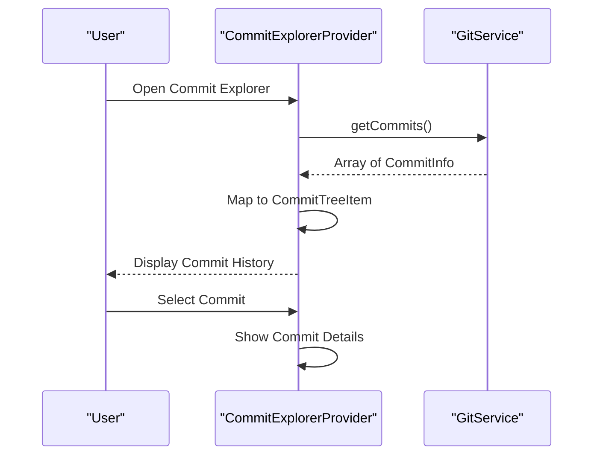
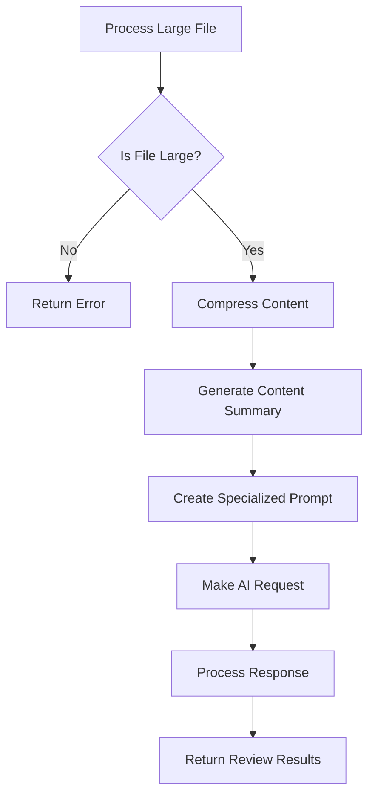
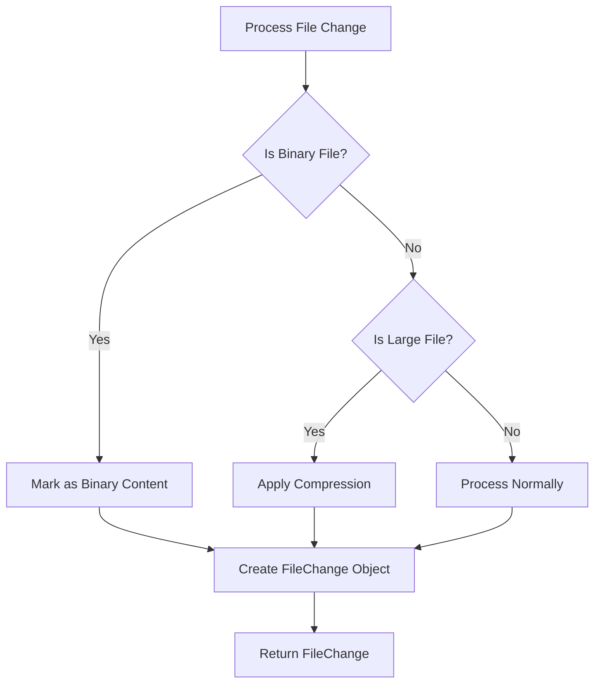
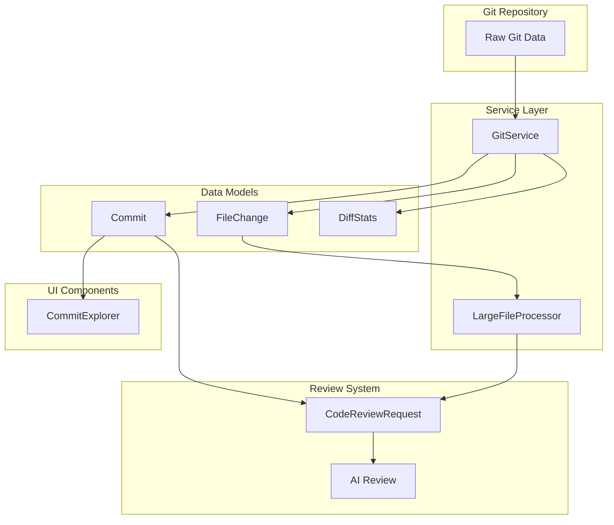

# Git Repository Models

<cite>
**Referenced Files in This Document**   
- [versionControlTypes.ts](file://src/services/git/versionControlTypes.ts)
- [gitService.ts](file://src/services/git/gitService.ts)
- [commitExplorer.ts](file://src/ui/components/commitExplorer.ts)
- [largeFileProcessor.ts](file://src/core/compression/largeFileProcessor.ts)
- [reviewTypes.ts](file://src/core/review/reviewTypes.ts)
- [compressionTypes.ts](file://src/core/compression/compressionTypes.ts)
</cite>

## Table of Contents
1. [Introduction](#introduction)
2. [Core Data Models](#core-data-models)
3. [Model Population Mechanisms](#model-population-mechanisms)
4. [Commit Model Usage](#commit-model-usage)
5. [FileChange Processing](#filechange-processing)
6. [Data Transformation to CodeReviewRequest](#data-transformation-to-codereviewrequest)
7. [Edge Case Handling](#edge-case-handling)
8. [Architecture Overview](#architecture-overview)

## Introduction
This document details the Git repository data models defined in versionControlTypes.ts, focusing on the Commit, FileChange, and BranchInfo interfaces that represent the state of a Git repository. The models capture essential Git metadata including commit hash, author, timestamp, file path, change type (added/modified/deleted), and diff content. These models are populated by gitService.ts through both direct Git commands and VS Code's Git API, then utilized across various components including commitExplorer.ts for displaying commit history and largeFileProcessor.ts for handling large file compression. The document explains how these models are transformed into CodeReviewRequest objects for code review processing, including handling of edge cases like binary files, large diffs, and merge commits.

## Core Data Models

The Git repository models are defined in versionControlTypes.ts and represent the fundamental data structures for Git operations within the application. These models capture the essential metadata needed for code review and repository analysis.

### Commit Interface
The Commit interface represents a Git commit with its associated metadata:

```typescript
export interface Commit {
    hash: string;
    message: string;
    author: string;
    email: string;
    date: Date;
    reviewed?: boolean;
}
```

**Section sources**
- [versionControlTypes.ts](file://src/services/git/versionControlTypes.ts#L10-L23)

### FileChange Interface
The FileChange interface represents a file modification within a commit:

```typescript
export interface FileChange {
    path: string;
    status: 'added' | 'modified' | 'deleted' | 'renamed' | 'copied' | 'unchanged';
    oldPath?: string;
    reviewed?: boolean;
}
```

**Section sources**
- [versionControlTypes.ts](file://src/services/git/versionControlTypes.ts#L46-L55)

### Diff Statistics
The DiffStats interface captures statistical information about changes:

```typescript
export interface DiffStats {
    additions: number;
    deletions: number;
    changedFiles: number;
}
```

**Section sources**
- [versionControlTypes.ts](file://src/services/git/versionControlTypes.ts#L72-L79)

## Model Population Mechanisms

The Git data models are populated through multiple mechanisms in gitService.ts, which implements a robust strategy for retrieving Git information using both direct Git commands and VS Code's Git API.

### Dual-Strategy Data Retrieval
The GitService class employs a dual-strategy approach to populate models, attempting multiple methods to ensure reliability:

1. **VS Code Git API**: The preferred method for performance and integration
2. **Direct Git Commands**: Fallback method using execAsync for command-line Git operations
3. **Simple-Git Library**: Third option using the simple-git npm package

This layered approach ensures that Git data can be retrieved even when one method fails, providing resilience against different development environments and configurations.



**Diagram sources **
- [gitService.ts](file://src/services/git/gitService.ts#L367-L406)
- [gitService.ts](file://src/services/git/gitService.ts#L415-L670)

**Section sources**
- [gitService.ts](file://src/services/git/gitService.ts#L1-L1201)

## Commit Model Usage

The Commit model is extensively used in commitExplorer.ts to display the commit history in a tree view, providing users with a visual representation of the repository's evolution.

### Commit Explorer Implementation
The CommitExplorerProvider class implements VS Code's TreeDataProvider interface to display commits in the UI. It retrieves commits from the GitService and maps them to tree items that can be rendered in the explorer view.

When a user interacts with the commit explorer, the following process occurs:
1. The provider fetches commits from the GitService
2. Commits are mapped to CommitTreeItem objects
3. Tree items are displayed with relevant metadata (hash, date, message)
4. Users can select commits to view detailed information



**Diagram sources **
- [commitExplorer.ts](file://src/ui/components/commitExplorer.ts#L5-L172)
- [gitService.ts](file://src/services/git/gitService.ts#L197-L242)

**Section sources**
- [commitExplorer.ts](file://src/ui/components/commitExplorer.ts#L5-L172)

## FileChange Processing

FileChange objects are processed by largeFileProcessor.ts to handle compression of large files, ensuring that code reviews can be performed efficiently even with large codebases.

### Large File Processing Workflow
The LargeFileProcessor class handles files that exceed a configured size threshold, applying compression techniques to make them manageable for AI analysis while preserving essential information.

The processing workflow includes:
1. Detection of large files based on character count
2. Content compression using configurable strategies
3. Generation of content summaries for AI processing
4. Batch processing of multiple large files



**Diagram sources **
- [largeFileProcessor.ts](file://src/core/compression/largeFileProcessor.ts#L23-L241)
- [compressionTypes.ts](file://src/core/compression/compressionTypes.ts#L64-L80)

**Section sources**
- [largeFileProcessor.ts](file://src/core/compression/largeFileProcessor.ts#L23-L241)

## Data Transformation to CodeReviewRequest

Git data is transformed into CodeReviewRequest objects that serve as input for the code review system. This transformation occurs in reviewManager.ts, which coordinates between Git data and AI review services.

### Transformation Process
The transformation from Git models to CodeReviewRequest objects involves several steps:

1. Retrieval of commit files and their content
2. Creation of CodeReviewRequest objects with file content and metadata
3. Population of Git-specific fields (commit hash, author, message)
4. Setting of review mode to GIT_COMMIT

The CodeReviewRequest interface includes Git-specific fields that capture the context of the commit being reviewed:

```typescript
export interface CodeReviewRequest {
    filePath: string;
    currentContent: string;
    previousContent: string;
    useCompression?: boolean;
    language?: string;
    diffContent?: string;
    reviewMode?: ReviewMode;
    
    // Git commit mode specific fields
    commitHash?: string;
    commitMessage?: string;
    commitAuthor?: string;
}
```

**Section sources**
- [reviewTypes.ts](file://src/core/review/reviewTypes.ts#L24-L47)
- [reviewManager.ts](file://src/services/review/reviewManager.ts#L487-L492)

## Edge Case Handling

The system implements comprehensive edge case handling for scenarios such as binary files, large diffs, and merge commits, ensuring robust operation across diverse repository states.

### Binary File Handling
Binary files are detected and handled specially to prevent attempting to process non-text content:

```typescript
if (file.binary) {
    currentContent = '(Binary File)';
    previousContent = '(Binary File)';
    status = 'binary';
}
```

### Large Diff Management
Large diffs are managed through content compression and summarization techniques that preserve essential information while reducing token usage for AI processing.

### Merge Commit Processing
Merge commits are handled by analyzing the changes introduced by the merge, focusing on the actual file modifications rather than the merge metadata itself.



**Diagram sources **
- [gitService.ts](file://src/services/git/gitService.ts#L127-L132)
- [largeFileProcessor.ts](file://src/core/compression/largeFileProcessor.ts#L47-L50)

**Section sources**
- [gitService.ts](file://src/services/git/gitService.ts#L110-L177)
- [largeFileProcessor.ts](file://src/core/compression/largeFileProcessor.ts#L47-L81)

## Architecture Overview

The Git repository models form a critical part of the application architecture, serving as the bridge between raw Git data and the code review functionality.



**Diagram sources **
- [versionControlTypes.ts](file://src/services/git/versionControlTypes.ts#L10-L79)
- [gitService.ts](file://src/services/git/gitService.ts#L45-L800)
- [largeFileProcessor.ts](file://src/core/compression/largeFileProcessor.ts#L23-L241)
- [commitExplorer.ts](file://src/ui/components/commitExplorer.ts#L5-L172)

**Section sources**
- [versionControlTypes.ts](file://src/services/git/versionControlTypes.ts#L1-L80)
- [gitService.ts](file://src/services/git/gitService.ts#L1-L1201)
- [largeFileProcessor.ts](file://src/core/compression/largeFileProcessor.ts#L1-L242)
- [commitExplorer.ts](file://src/ui/components/commitExplorer.ts#L1-L172)
- [reviewTypes.ts](file://src/core/review/reviewTypes.ts#L1-L206)
- [compressionTypes.ts](file://src/core/compression/compressionTypes.ts#L1-L87)