# Event System

<cite>
**Referenced Files in This Document**
- [appConfig.ts](file://src/config/appConfig.ts)
- [extension.ts](file://src/extension.ts)
- [aiService.ts](file://src/services/ai/aiService.ts)
- [gitService.ts](file://src/services/git/gitService.ts)
- [logger.ts](file://src/utils/logger.ts)
- [notificationManager.ts](file://src/services/notification/notificationManager.ts)
- [index.ts](file://src/i18n/index.ts)
- [reviewManager.ts](file://src/services/review/reviewManager.ts)
- [commitExplorer.ts](file://src/ui/components/commitExplorer.ts)
</cite>

## Table of Contents
1. [Introduction](#introduction)
2. [Event Architecture Overview](#event-architecture-overview)
3. [Configuration Change Notifications](#configuration-change-notifications)
4. [Service Lifecycle Events](#service-lifecycle-events)
5. [Logging Events and Debugging](#logging-events-and-debugging)
6. [Event Registration and Handling](#event-registration-and-handling)
7. [Asynchronous Event Propagation](#asynchronous-event-propagation)
8. [Best Practices for Event Listener Management](#best-practices-for-event-listener-management)
9. [Extending the Event System](#extending-the-event-system)
10. [Troubleshooting Guide](#troubleshooting-guide)

## Introduction

CodeKarmic implements a sophisticated event-driven architecture that enables loose coupling between components through EventEmitter patterns. While no dedicated event interface is defined, the system leverages Node.js's built-in EventEmitter along with custom event emitters to create a robust notification system for configuration changes, service lifecycle events, and logging activities.

The event system serves as the backbone for maintaining consistency across the application, enabling components to react to changes without direct dependencies. This architecture facilitates clean separation of concerns and enhances the extensibility of the code review platform.

## Event Architecture Overview

CodeKarmic's event system is built around several key patterns and components that work together to provide comprehensive event-driven communication:

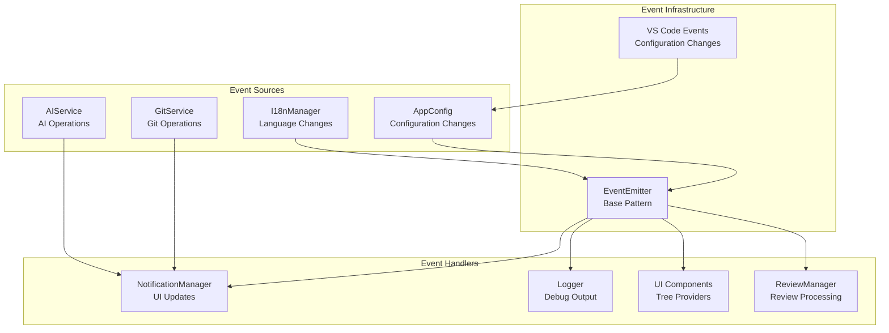

**Diagram sources**
- [appConfig.ts](file://src/config/appConfig.ts#L50-L77)
- [index.ts](file://src/i18n/index.ts#L75-L102)
- [notificationManager.ts](file://src/services/notification/notificationManager.ts#L8-L29)

The architecture follows a publish-subscribe pattern where event sources notify interested parties without knowing their specific implementations. This decoupling allows for flexible component interactions and easy testing.

**Section sources**
- [appConfig.ts](file://src/config/appConfig.ts#L44-L120)
- [index.ts](file://src/i18n/index.ts#L75-L102)

## Configuration Change Notifications

The AppConfig class serves as the central hub for configuration change notifications, utilizing EventEmitter patterns to broadcast updates to dependent components throughout the application.

### Configuration Change Event Types

CodeKarmic defines specific event types for different configuration categories:

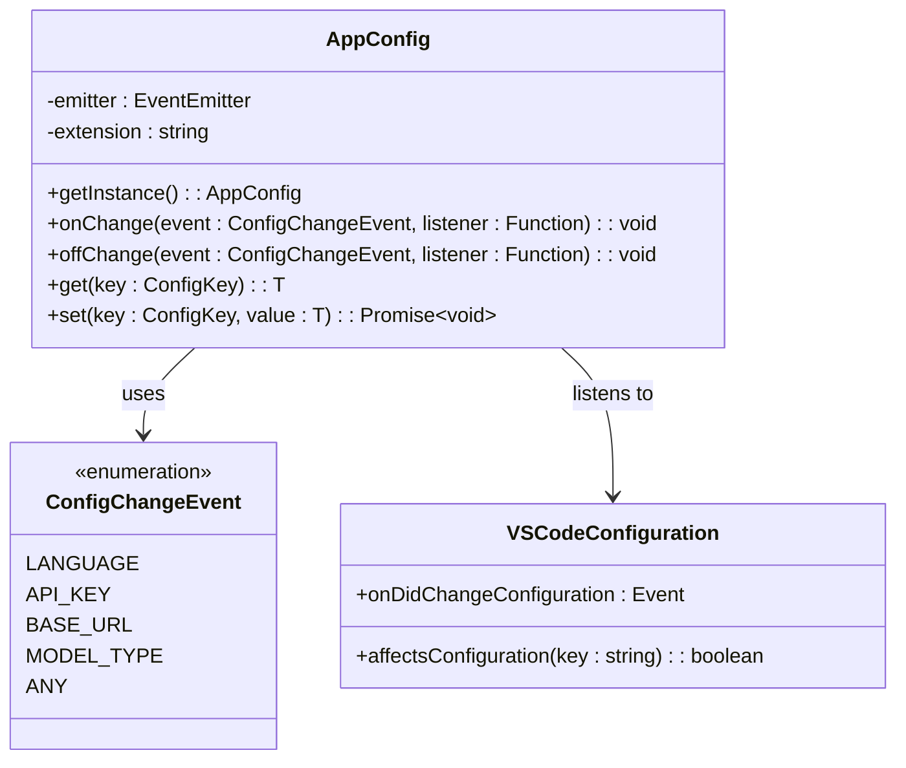

**Diagram sources**
- [appConfig.ts](file://src/config/appConfig.ts#L11-L17)
- [appConfig.ts](file://src/config/appConfig.ts#L50-L77)

### Configuration Change Detection

The system monitors VS Code's configuration changes and translates them into specific events:

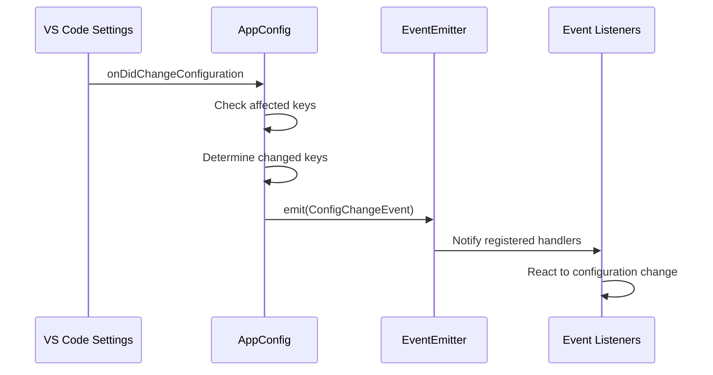

**Diagram sources**
- [appConfig.ts](file://src/config/appConfig.ts#L58-L75)

### Event Broadcasting Mechanism

When configuration changes occur, the system follows a structured approach:

1. **Detection Phase**: VS Code's configuration change events trigger the AppConfig listener
2. **Analysis Phase**: The system determines which specific configuration keys were modified
3. **Broadcast Phase**: Events are emitted for each changed key and a general "ANY" event
4. **Propagation Phase**: Registered listeners receive notifications and can react accordingly

**Section sources**
- [appConfig.ts](file://src/config/appConfig.ts#L58-L77)

## Service Lifecycle Events

Services in CodeKarmic react to configuration changes and other lifecycle events through their event subscription mechanisms. The AIService and GitService demonstrate how components integrate with the event system.

### AIService Event Integration

The AIService responds to configuration changes by updating its internal state and reinitializing when necessary:

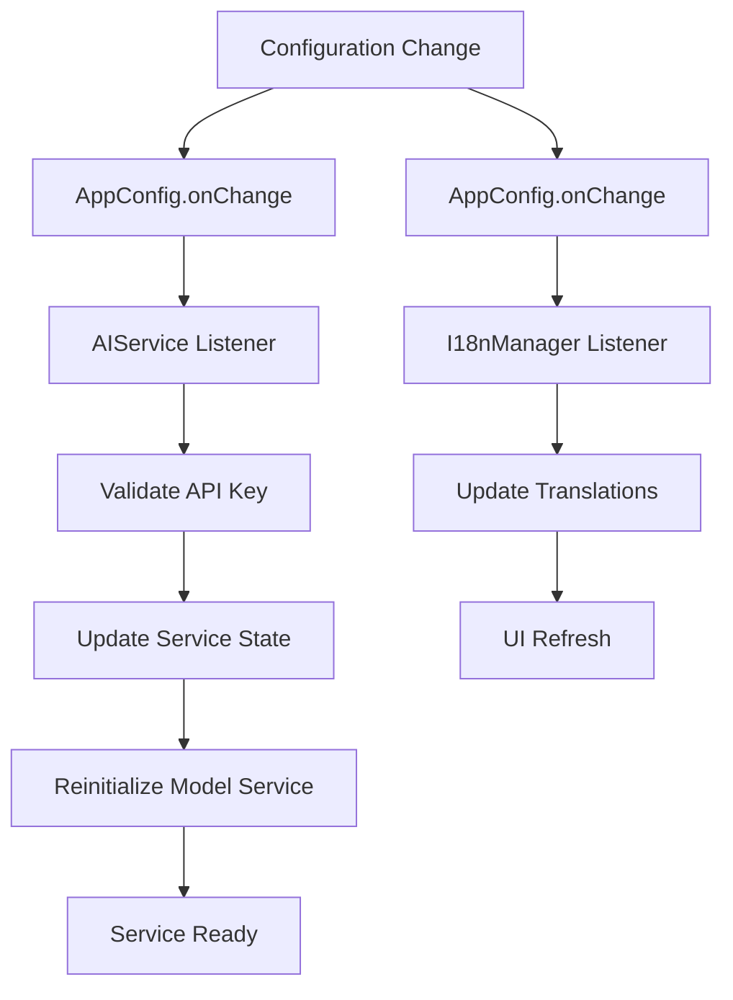

**Diagram sources**
- [aiService.ts](file://src/services/ai/aiService.ts#L726-L732)
- [appConfig.ts](file://src/config/appConfig.ts#L116-L128)

### GitService Event Coordination

The GitService coordinates with other components during repository operations and maintains event consistency:

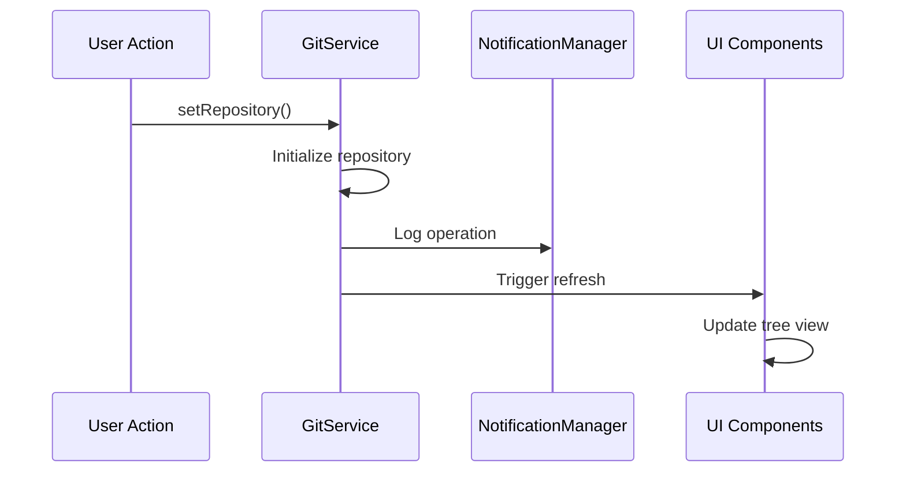

**Diagram sources**
- [gitService.ts](file://src/services/git/gitService.ts#L64-L107)
- [notificationManager.ts](file://src/services/notification/notificationManager.ts#L79-L121)

**Section sources**
- [aiService.ts](file://src/services/ai/aiService.ts#L726-L732)
- [gitService.ts](file://src/services/git/gitService.ts#L64-L107)

## Logging Events and Debugging

The Logger utility provides comprehensive logging capabilities that integrate with the event system to facilitate debugging and monitoring of application activities.

### Logging Level Management

CodeKarmic implements a hierarchical logging system with configurable levels:

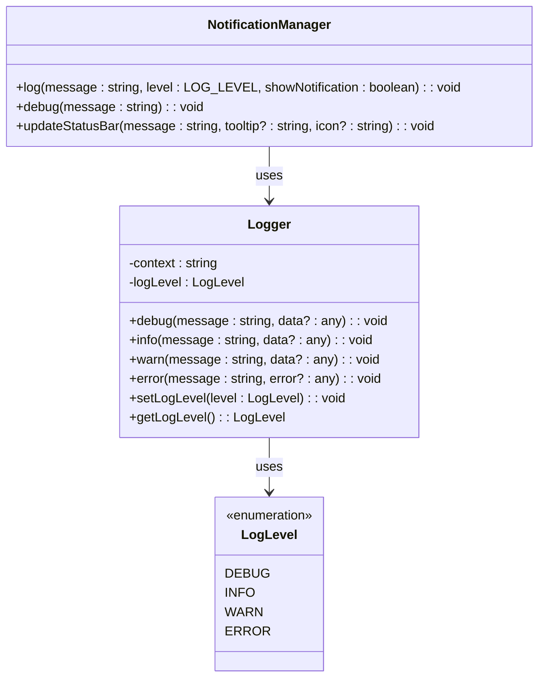

**Diagram sources**
- [logger.ts](file://src/utils/logger.ts#L8-L13)
- [notificationManager.ts](file://src/services/notification/notificationManager.ts#L18-L213)

### Debug Event Patterns

The logging system supports various debug patterns for different scenarios:

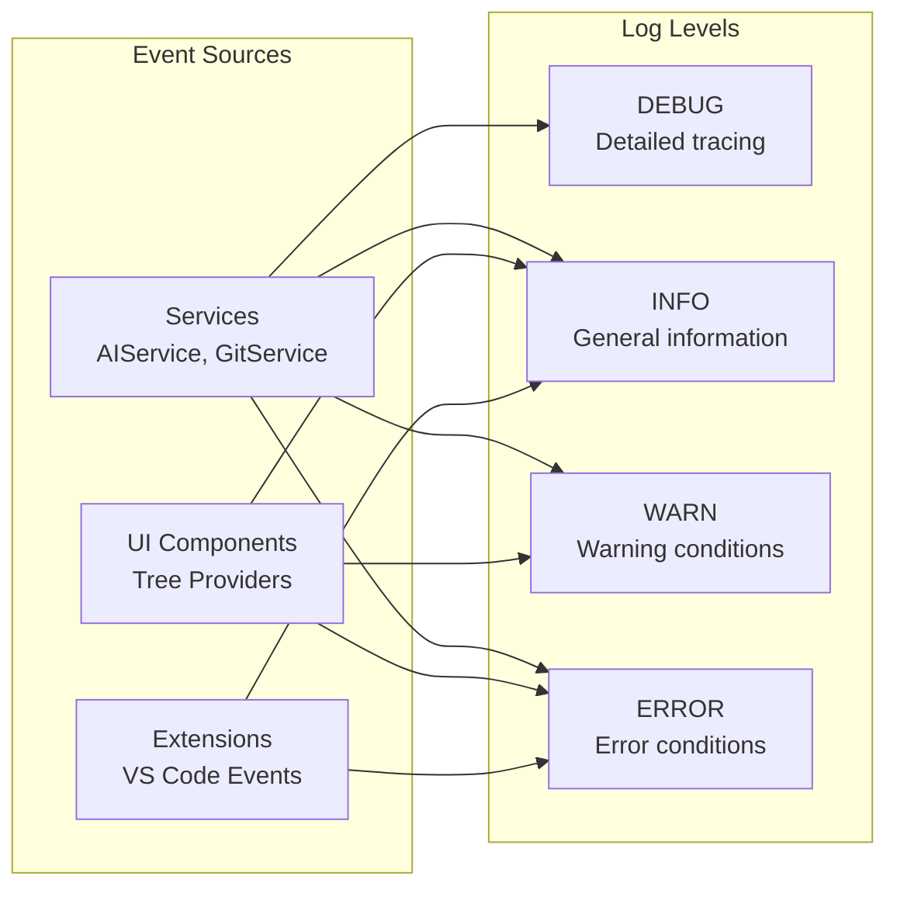

**Diagram sources**
- [logger.ts](file://src/utils/logger.ts#L50-L86)
- [notificationManager.ts](file://src/services/notification/notificationManager.ts#L123-L142)

### Logging Event Integration

The NotificationManager integrates with the logging system to provide unified event handling:

1. **Message Processing**: Handles bilingual messages and log level filtering
2. **Status Bar Updates**: Updates UI status indicators based on log levels
3. **Output Channel Management**: Maintains persistent log output for debugging
4. **Notification Display**: Shows appropriate VS Code notifications based on severity

**Section sources**
- [logger.ts](file://src/utils/logger.ts#L18-L88)
- [notificationManager.ts](file://src/services/notification/notificationManager.ts#L79-L121)

## Event Registration and Handling

CodeKarmic provides multiple patterns for event registration and handling, allowing components to subscribe to specific events and react appropriately.

### Standard Event Registration Pattern

Components register for events using the standard EventEmitter pattern:

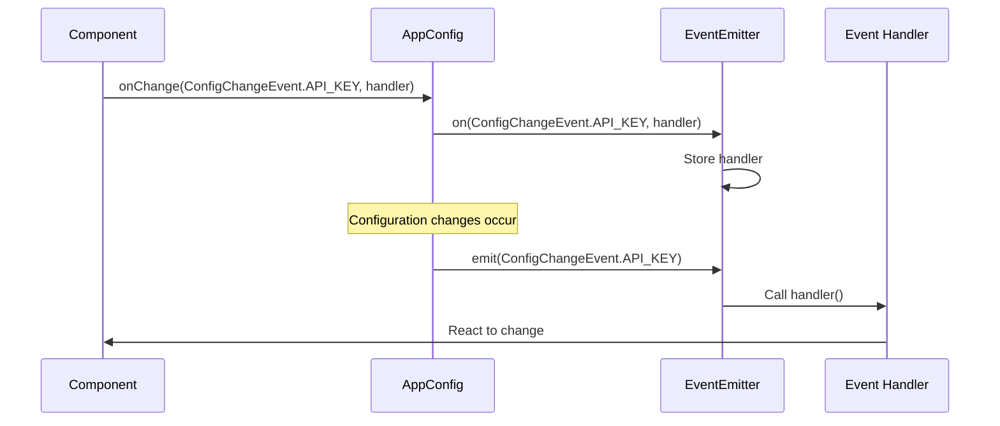

**Diagram sources**
- [appConfig.ts](file://src/config/appConfig.ts#L116-L128)
- [index.ts](file://src/i18n/index.ts#L157-L167)

### Extension-Specific Event Handling

The extension.ts file demonstrates comprehensive event handling for VS Code-specific scenarios:

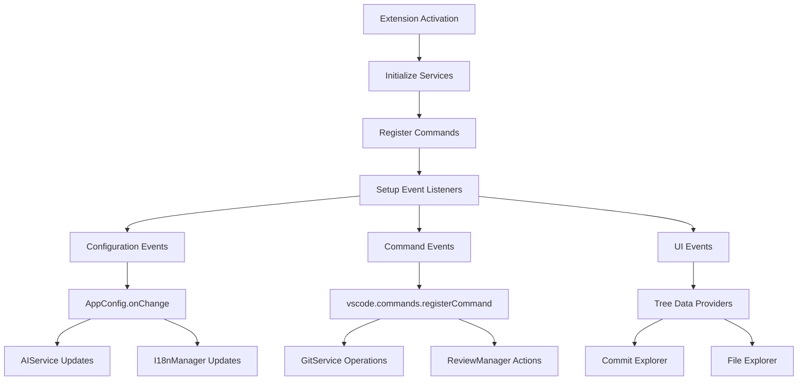

**Diagram sources**
- [extension.ts](file://src/extension.ts#L20-L920)

### Event Handler Implementation Patterns

Different components implement event handlers according to their specific requirements:

1. **Immediate Reaction**: Some handlers perform immediate actions upon receiving events
2. **Debounced Processing**: Handlers may debounce rapid successive events
3. **Conditional Processing**: Handlers evaluate conditions before processing events
4. **Chain Processing**: Handlers trigger subsequent events in response to initial events

**Section sources**
- [extension.ts](file://src/extension.ts#L20-L920)
- [appConfig.ts](file://src/config/appConfig.ts#L116-L128)

## Asynchronous Event Propagation

CodeKarmic's event system handles asynchronous operations gracefully, ensuring that event propagation doesn't block the main thread while maintaining proper ordering and error handling.

### Asynchronous Event Flow

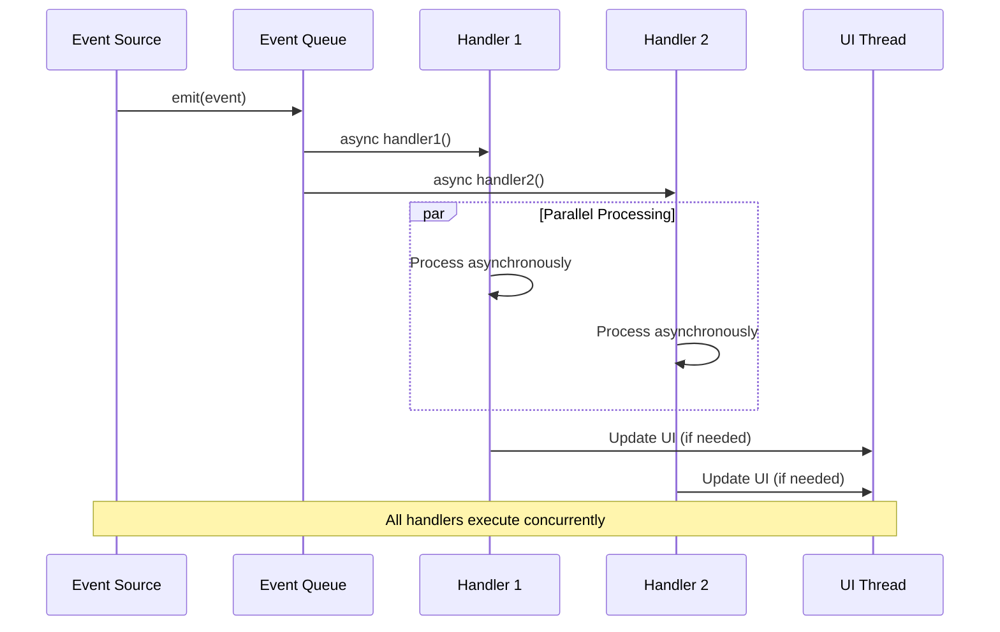

**Diagram sources**
- [appConfig.ts](file://src/config/appConfig.ts#L73-L75)
- [notificationManager.ts](file://src/services/notification/notificationManager.ts#L79-L121)

### Memory Management in Async Operations

The system implements careful memory management for asynchronous event handling:

1. **Promise-Based Handlers**: Event handlers return promises to ensure proper completion tracking
2. **Timeout Management**: Long-running operations are protected with appropriate timeouts
3. **Resource Cleanup**: Resources are properly cleaned up after event processing
4. **Error Isolation**: Errors in one handler don't affect others

### Event Ordering Guarantees

While events are processed asynchronously, the system maintains certain ordering guarantees:

- **Sequential Execution**: Each handler executes sequentially within its own event loop
- **Priority Handling**: Higher-priority events may be processed before lower-priority ones
- **Dependency Resolution**: Handlers wait for dependencies before proceeding
- **Completion Tracking**: The system tracks completion of all event processing

**Section sources**
- [appConfig.ts](file://src/config/appConfig.ts#L73-L75)
- [notificationManager.ts](file://src/services/notification/notificationManager.ts#L79-L121)

## Best Practices for Event Listener Management

Proper event listener management is crucial for preventing memory leaks and ensuring optimal performance in CodeKarmic's event-driven architecture.

### Memory Leak Prevention Strategies

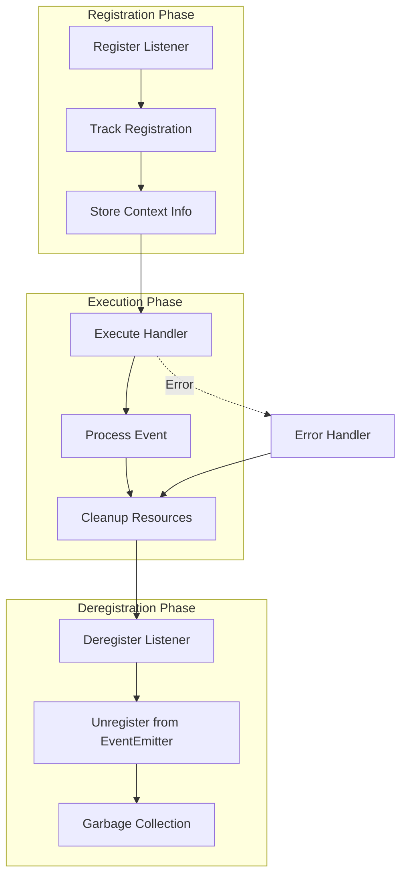

**Diagram sources**
- [appConfig.ts](file://src/config/appConfig.ts#L125-L128)
- [index.ts](file://src/i18n/index.ts#L165-L167)

### Listener Lifecycle Management

CodeKarmic implements several patterns for managing listener lifecycles:

1. **Automatic Cleanup**: Listeners are automatically removed when components are disposed
2. **Manual Deregistration**: Components can manually deregister listeners when needed
3. **Context-Aware Removal**: Listeners are removed based on their registration context
4. **Graceful Degradation**: Systems continue functioning even if listeners fail to unregister

### Resource Management Patterns

The system employs specific patterns for resource management:

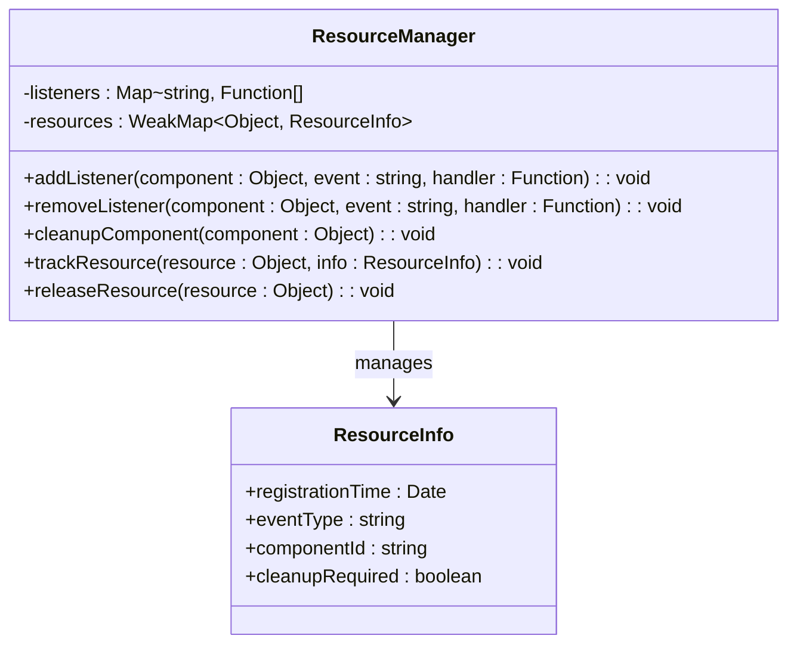

**Diagram sources**
- [appConfig.ts](file://src/config/appConfig.ts#L125-L128)
- [index.ts](file://src/i18n/index.ts#L165-L167)

### Error Handling in Event Listeners

Robust error handling ensures that failures in one listener don't affect others:

1. **Try-Catch Wrapping**: All event handlers are wrapped in try-catch blocks
2. **Error Propagation**: Errors are logged but don't crash the application
3. **Fallback Mechanisms**: Systems have fallback mechanisms when listeners fail
4. **Health Monitoring**: The system monitors listener health and performance

**Section sources**
- [appConfig.ts](file://src/config/appConfig.ts#L125-L128)
- [index.ts](file://src/i18n/index.ts#L165-L167)

## Extending the Event System

CodeKarmic's event system is designed to be extensible, allowing developers to add new event types and handlers without modifying existing code.

### Adding New Event Types

To add new event types, follow these patterns:

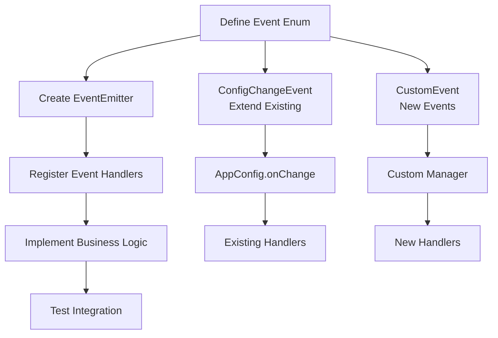

**Diagram sources**
- [appConfig.ts](file://src/config/appConfig.ts#L11-L17)
- [index.ts](file://src/i18n/index.ts#L18-L20)

### Creating Custom Event Managers

Developers can create custom event managers following established patterns:

1. **Singleton Pattern**: Ensure only one instance of the manager exists
2. **EventEmitter Integration**: Use EventEmitter for core event functionality
3. **Configuration Integration**: Integrate with AppConfig for configuration changes
4. **Lifecycle Management**: Implement proper initialization and cleanup

### Extension Points

CodeKarmic provides several extension points for custom event systems:

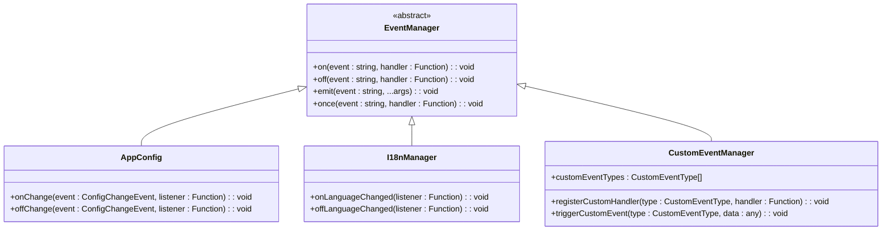

**Diagram sources**
- [appConfig.ts](file://src/config/appConfig.ts#L116-L128)
- [index.ts](file://src/i18n/index.ts#L157-L167)

### Integration with VS Code Extensions

The system integrates seamlessly with VS Code's extension ecosystem:

1. **Command Registration**: Events trigger VS Code commands
2. **Configuration Management**: Events modify VS Code settings
3. **UI Integration**: Events update VS Code UI components
4. **Workspace Integration**: Events interact with VS Code workspace features

**Section sources**
- [appConfig.ts](file://src/config/appConfig.ts#L11-L17)
- [index.ts](file://src/i18n/index.ts#L18-L20)

## Troubleshooting Guide

Common issues with the event system and their solutions:

### Memory Leaks

**Symptoms**: Increasing memory usage over time, slow performance
**Causes**: Event listeners not properly deregistered
**Solutions**: 
- Ensure all listeners are removed in component cleanup
- Use weak references where appropriate
- Monitor listener counts in development builds

### Event Handler Failures

**Symptoms**: Events not triggering, inconsistent behavior
**Causes**: Exception in event handlers, missing event registration
**Solutions**:
- Wrap event handlers in try-catch blocks
- Implement proper error logging
- Verify event registration timing

### Configuration Change Issues

**Symptoms**: Settings not applying, stale configuration values
**Causes**: Incorrect event handling, timing issues
**Solutions**:
- Verify AppConfig.onChange registrations
- Check event propagation chain
- Ensure proper initialization order

### Asynchronous Event Problems

**Symptoms**: Race conditions, inconsistent state
**Causes**: Improper async handling, missing synchronization
**Solutions**:
- Use proper promise handling
- Implement proper synchronization mechanisms
- Add appropriate timeouts

**Section sources**
- [appConfig.ts](file://src/config/appConfig.ts#L125-L128)
- [notificationManager.ts](file://src/services/notification/notificationManager.ts#L79-L121)