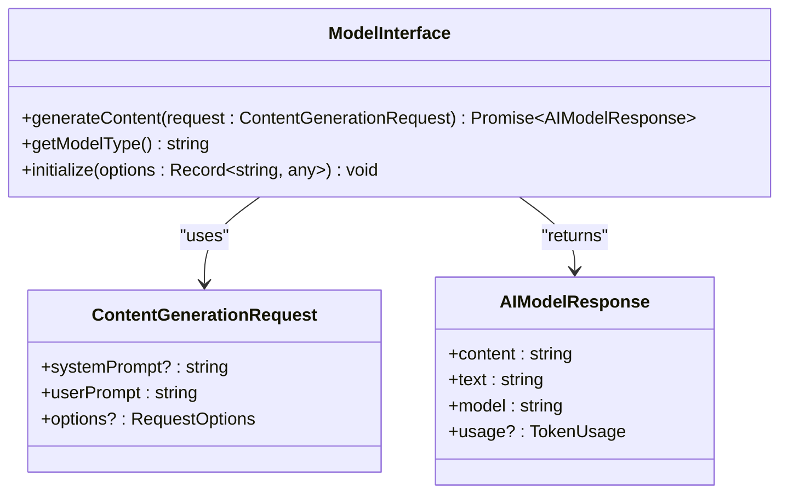
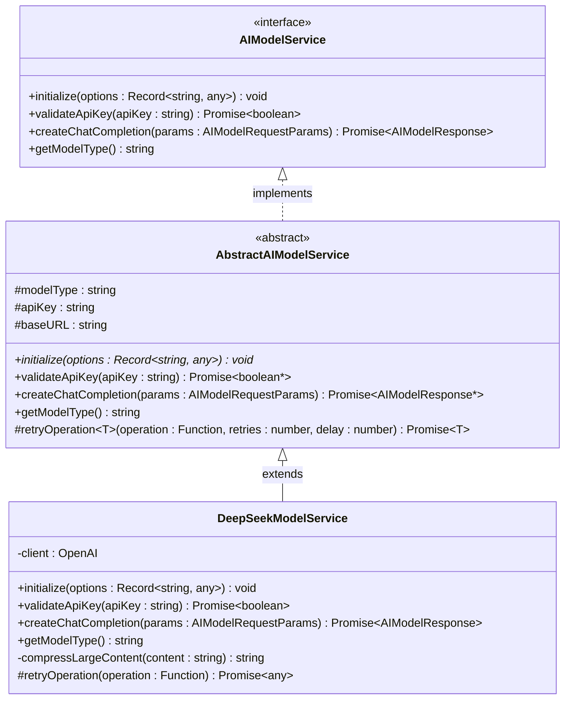
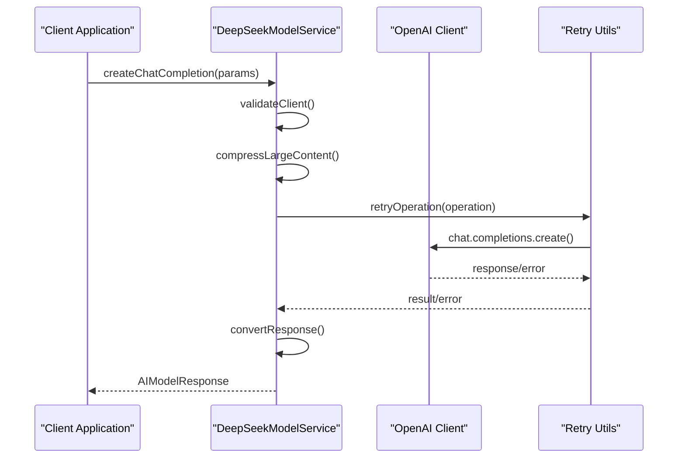
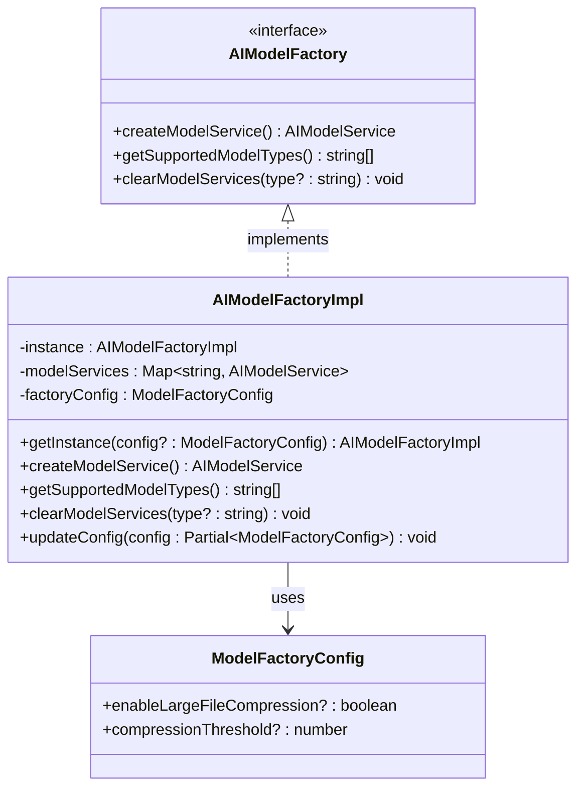
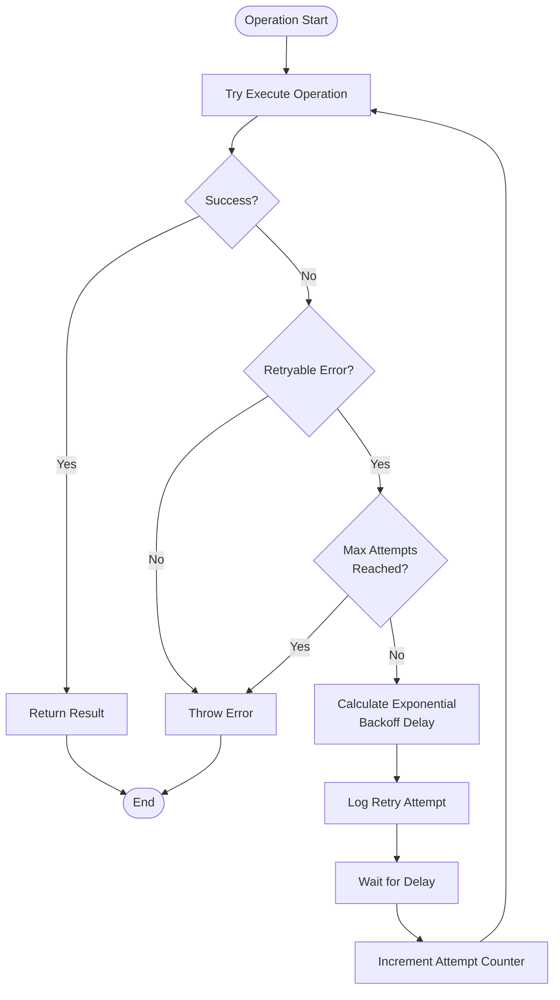
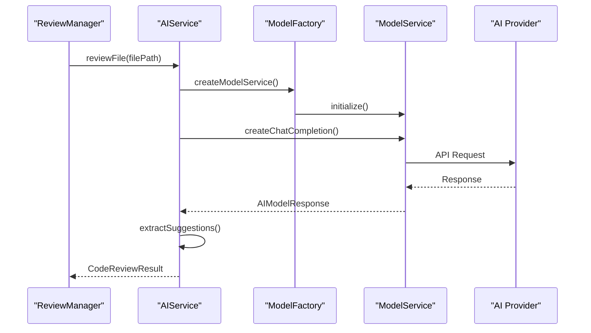

# Service Interfaces

<cite>
**Referenced Files in This Document**
- [modelInterface.ts](file://src/models/modelInterface.ts)
- [aiService.ts](file://src/services/ai/aiService.ts)
- [baseModel.ts](file://src/models/baseModel.ts)
- [deepseek.ts](file://src/models/providers/deepseek.ts)
- [modelFactory.ts](file://src/models/modelFactory.ts)
- [reviewManager.ts](file://src/services/review/reviewManager.ts)
- [retryUtils.ts](file://src/utils/retryUtils.ts)
- [chatTypes.ts](file://src/models/chatTypes.ts)
- [types.ts](file://src/models/types.ts)
</cite>

## Table of Contents
1. [Introduction](#introduction)
2. [Core ModelInterface](#core-modelinterface)
3. [AI Model Service Architecture](#ai-model-service-architecture)
4. [DeepSeek Provider Implementation](#deepseek-provider-implementation)
5. [Service Factory Pattern](#service-factory-pattern)
6. [Error Handling and Retry Mechanisms](#error-handling-and-retry-mechanisms)
7. [Integration with ReviewManager](#integration-with-reviewmanager)
8. [Usage Patterns and Examples](#usage-patterns-and-examples)
9. [Best Practices](#best-practices)
10. [Troubleshooting](#troubleshooting)

## Introduction

CodeKarmic provides a comprehensive service interface architecture for AI model integration, centered around the `ModelInterface` and supporting infrastructure. This system enables seamless integration with various AI providers while maintaining consistent APIs and robust error handling mechanisms.

The architecture follows established design patterns including the Factory pattern for service creation, Abstract classes for common functionality, and comprehensive retry mechanisms for reliable operation in distributed environments.

## Core ModelInterface

The `ModelInterface` serves as the primary abstraction for AI model interactions, providing three essential methods for content generation and model management.

### Interface Definition



**Diagram sources**
- [modelInterface.ts](file://src/models/modelInterface.ts#L168-L185)

### Method Specifications

#### generateContent(request: ContentGenerationRequest)

Generates AI-generated content based on the provided request parameters.

**Parameters:**
- `request` (ContentGenerationRequest): Contains system prompt, user prompt, and generation options
  - `systemPrompt` (string, optional): System-level instructions for the AI model
  - `userPrompt` (string): Main content request for the AI
  - `options` (Object, optional): Generation configuration
    - `maxTokens` (number, optional): Maximum token count for response
    - `temperature` (number, optional): Creativity level (0.0-2.0)
    - `compressLargeContent` (boolean, optional): Enable content compression
    - `compressionThreshold` (number, optional): Character threshold for compression
    - `[key: string]` (any): Additional provider-specific options

**Returns:** Promise resolving to AIModelResponse containing generated content and usage statistics.

**Section sources**
- [modelInterface.ts](file://src/models/modelInterface.ts#L168-L174)

#### getModelType()

Returns the type identifier of the underlying AI model.

**Returns:** string representing the model type (e.g., "deepseek-chat", "deepseek-reasoner")

**Section sources**
- [modelInterface.ts](file://src/models/modelInterface.ts#L175-L179)

#### initialize(options?: Record<string, any>)

Initializes the model interface with provider-specific configuration options.

**Parameters:**
- `options` (Record<string, any>, optional): Provider-specific initialization parameters

**Section sources**
- [modelInterface.ts](file://src/models/modelInterface.ts#L180-L185)

## AI Model Service Architecture

The AI model service architecture is built around the `AIModelService` interface and `AbstractAIModelService` base class, providing a foundation for implementing various AI providers.

### Service Interface Hierarchy



**Diagram sources**
- [modelInterface.ts](file://src/models/modelInterface.ts#L39-L117)
- [deepseek.ts](file://src/models/providers/deepseek.ts#L11-L211)

### Core Service Methods

#### initialize(options?: Record<string, any>)

Initializes the AI model service with provider-specific configuration.

**Implementation Notes:**
- Validates required configuration parameters
- Establishes connection to AI provider endpoint
- Sets up authentication credentials
- Configures request timeouts and retry policies

**Section sources**
- [modelInterface.ts](file://src/models/modelInterface.ts#L44-L46)

#### validateApiKey(apiKey: string)

Verifies the validity of the provided API key through a test request.

**Parameters:**
- `apiKey` (string): Authentication token for the AI service

**Returns:** Promise resolving to boolean indicating key validity

**Implementation Details:**
- Makes a lightweight test request to the provider
- Handles rate limiting and network errors gracefully
- Returns false for invalid or expired keys

**Section sources**
- [modelInterface.ts](file://src/models/modelInterface.ts#L50-L52)

#### createChatCompletion(params: AIModelRequestParams)

Processes a chat completion request and returns the AI-generated response.

**Parameters:**
- `params` (AIModelRequestParams): Request configuration including messages, model parameters, and compression options

**Returns:** Promise resolving to AIModelResponse with content and usage statistics

**Request Parameters:**
- `messages` (ChatMessage[]): Array of conversation messages
- `model` (string, optional): Specific model variant to use
- `temperature` (number, optional): Creativity control (0.0-2.0)
- `max_tokens` (number, optional): Maximum response length
- `compressLargeContent` (boolean, optional): Enable content compression
- `compressionThreshold` (number, optional): Character threshold for compression
- `stream` (boolean, optional): Enable streaming responses
- `[key: string]` (any): Additional provider-specific parameters

**Section sources**
- [modelInterface.ts](file://src/models/modelInterface.ts#L56-L58)

## DeepSeek Provider Implementation

The `DeepSeekModelService` class demonstrates a concrete implementation of the AI model service interface, showcasing advanced features like content compression and sophisticated retry mechanisms.

### DeepSeek Service Features



**Diagram sources**
- [deepseek.ts](file://src/models/providers/deepseek.ts#L87-L147)
- [retryUtils.ts](file://src/utils/retryUtils.ts#L33-L69)

### Advanced Compression Algorithm

The DeepSeek implementation includes intelligent content compression for large files:

**Compression Strategy:**
1. **Header Extraction**: Preserves first 10 lines for context
2. **Statistics Calculation**: Counts lines, comments, and empty lines
3. **Sampling**: Extracts representative samples from the middle section
4. **Footer Preservation**: Maintains last 10 lines for context
5. **Metadata**: Includes line counts and statistical information

**Compression Thresholds:**
- Default threshold: 50,000 characters
- Automatic activation for files exceeding threshold
- Configurable via `compressionThreshold` parameter

**Section sources**
- [deepseek.ts](file://src/models/providers/deepseek.ts#L154-L185)

### Retry Operation Implementation

The `DeepSeekModelService` overrides the base retry mechanism with provider-specific error handling:

**Retry Configuration:**
- Max retries: 3 attempts
- Initial delay: 1000ms
- Backoff factor: 2.0 (exponential backoff)
- Retryable errors: Network timeouts, rate limits, server errors

**Error Handling:**
- Logs retry attempts for debugging
- Converts provider-specific errors to standardized format
- Implements exponential backoff with jitter

**Section sources**
- [deepseek.ts](file://src/models/providers/deepseek.ts#L198-L210)

## Service Factory Pattern

The `AIModelFactoryImpl` implements the Factory pattern to manage AI model service instances, providing centralized creation and caching of model services.

### Factory Architecture



**Diagram sources**
- [modelFactory.ts](file://src/models/modelFactory.ts#L19-L140)

### Singleton Factory Pattern

The factory implements a singleton pattern with lazy initialization:

**Instance Management:**
- Single global instance shared across application
- Lazy initialization on first access
- Thread-safe instance creation
- Configurable through static `getInstance()` method

**Caching Strategy:**
- Cache key: `${modelType}:${baseURL}`
- Automatic caching when API key is available
- Manual cache clearing via `clearModelServices()`
- Memory-efficient storage of service instances

**Section sources**
- [modelFactory.ts](file://src/models/modelFactory.ts#L36-L44)

### Model Type Support

The factory supports multiple AI providers through a unified interface:

**Supported Models:**
- `deepseek-chat` (DeepSeek V3)
- `deepseek-reasoner` (DeepSeek R1)
- Future providers can be easily integrated

**Configuration Management:**
- Centralized model type selection
- Dynamic configuration updates
- Validation of supported model types

**Section sources**
- [modelFactory.ts](file://src/models/modelFactory.ts#L85-L93)

## Error Handling and Retry Mechanisms

CodeKarmic implements comprehensive error handling and retry mechanisms across all service layers, ensuring robust operation in distributed environments.

### Retry Infrastructure



**Diagram sources**
- [retryUtils.ts](file://src/utils/retryUtils.ts#L33-L69)

### Retry Configuration Options

The retry system provides extensive customization:

**Default Configuration:**
- Max retries: 2 attempts
- Initial delay: 500ms
- Backoff factor: 1.5 (exponential growth)
- Timeout: 30 seconds per request

**Customizable Options:**
- `maxRetries`: Maximum number of retry attempts
- `initialDelay`: Base delay between retries (milliseconds)
- `backoffFactor`: Multiplier for exponential backoff
- `retryableErrors`: Array of error patterns to trigger retries
- `onRetry`: Callback function for retry logging

**Section sources**
- [retryUtils.ts](file://src/utils/retryUtils.ts#L8-L14)

### Error Classification

The system distinguishes between retryable and non-retryable errors:

**Network Retryable Errors:**
- Connection resets (`ECONNRESET`)
- Socket timeouts (`ESOCKETTIMEDOUT`)
- Network connectivity issues
- Rate limiting responses
- Server unavailability (5xx status codes)

**API-Specific Patterns:**
- "timeout" in error messages
- "rate limit" occurrences
- "Service Unavailable" responses
- Internal server error indications

**Section sources**
- [retryUtils.ts](file://src/utils/retryUtils.ts#L95-L117)

### Service-Level Error Handling

Each service implements comprehensive error handling:

**DeepSeek Error Handling:**
- API key validation failures
- Request timeout management
- Content compression errors
- Response parsing exceptions

**AI Service Error Management:**
- Model service initialization failures
- Batch processing errors
- Streaming operation interruptions
- Resource exhaustion handling

**Section sources**
- [deepseek.ts](file://src/models/providers/deepseek.ts#L143-L146)
- [aiService.ts](file://src/services/ai/aiService.ts#L691-L710)

## Integration with ReviewManager

The ReviewManager orchestrates AI model services for comprehensive code review operations, demonstrating practical usage patterns and integration strategies.

### Review Workflow Integration



**Diagram sources**
- [reviewManager.ts](file://src/services/review/reviewManager.ts#L229-L262)
- [aiService.ts](file://src/services/ai/aiService.ts#L75-L119)

### Batch Processing Capabilities

The ReviewManager supports efficient batch processing for multiple files:

**Batch Strategies:**
- Size-based grouping (smaller files first)
- Token estimation for optimal batching
- Parallel processing with configurable concurrency
- Progress tracking and reporting

**Performance Optimizations:**
- Intelligent file categorization (large vs normal)
- Compressed content processing for large files
- Streaming responses for improved UX
- Caching of intermediate results

**Section sources**
- [reviewManager.ts](file://src/services/review/reviewManager.ts#L289-L370)

### Real-World Usage Examples

**Single File Review:**
```typescript
// Basic file review with default settings
const result = await reviewManager.reviewFile('src/main.ts');

// Review with custom options
const result = await reviewManager.reviewFile('src/utils.ts', {
    useCompression: true,
    includeDiffAnalysis: true
});
```

**Batch Review Operations:**
```typescript
// Process multiple files efficiently
const files = ['src/a.ts', 'src/b.ts', 'src/c.ts'];
const results = await reviewManager.reviewFilesParallel(files);

// Access individual results
results.forEach((result, filePath) => {
    console.log(`File: ${filePath}, Suggestions: ${result.aiSuggestions.length}`);
});
```

**Section sources**
- [reviewManager.ts](file://src/services/review/reviewManager.ts#L289-L370)

## Usage Patterns and Examples

### Basic Model Interface Usage

**Initialization and Configuration:**
```typescript
// Create model interface instance
const modelInterface = new ModelInterface();

// Initialize with provider-specific options
await modelInterface.initialize({
    apiKey: 'your-api-key',
    model: 'deepseek-chat',
    temperature: 0.1
});
```

**Content Generation:**
```typescript
// Generate code review suggestions
const request: ContentGenerationRequest = {
    systemPrompt: "You are a senior code reviewer specializing in TypeScript.",
    userPrompt: "Review this function and suggest improvements:\n\nfunction calculate(a: number, b: number) { return a + b; }",
    options: {
        maxTokens: 1000,
        temperature: 0.2,
        compressLargeContent: true
    }
};

const response = await modelInterface.generateContent(request);
console.log(response.text);
```

### Advanced AI Service Patterns

**Streaming Responses:**
```typescript
// Enable streaming for real-time feedback
const response = await aiService.reviewCode({
    filePath: 'src/app.ts',
    currentContent: fileContent,
    useStreamingOutput: true
});

// Process streaming chunks
response.on('chunk', (chunk) => {
    console.log('Received chunk:', chunk);
});
```

**Error Recovery:**
```typescript
// Implement graceful error handling
try {
    const result = await aiService.reviewCode(request);
    return result;
} catch (error) {
    if (error.message.includes('rate limit')) {
        // Implement backoff strategy
        await new Promise(resolve => setTimeout(resolve, 5000));
        return retryReview(request);
    }
    throw error;
}
```

### Factory Pattern Usage

**Service Creation:**
```typescript
// Get factory instance with custom configuration
const factory = AIModelFactoryImpl.getInstance({
    enableLargeFileCompression: true,
    compressionThreshold: 20000
});

// Create model service
const modelService = factory.createModelService();

// Validate API key
const isValid = await modelService.validateApiKey('your-api-key');
if (!isValid) {
    throw new Error('Invalid API key');
}
```

**Section sources**
- [aiService.ts](file://src/services/ai/aiService.ts#L40-L787)
- [modelFactory.ts](file://src/models/modelFactory.ts#L58-L114)

## Best Practices

### Configuration Management

**Environment Variables:**
- Store API keys securely using environment variables
- Use different keys for development and production
- Implement key rotation strategies

**Provider Selection:**
- Choose appropriate models based on use case requirements
- Consider cost, speed, and quality trade-offs
- Implement fallback mechanisms for provider failures

### Performance Optimization

**Request Optimization:**
- Use compression for large files (>50KB)
- Implement request batching for multiple files
- Leverage caching for repeated operations
- Monitor token usage and optimize prompts

**Resource Management:**
- Limit concurrent requests to prevent rate limiting
- Implement connection pooling for high-volume scenarios
- Use streaming for long-running operations
- Monitor memory usage for large file processing

### Error Handling Strategies

**Graceful Degradation:**
- Implement fallback responses when AI services are unavailable
- Provide meaningful error messages to users
- Log errors for debugging while protecting sensitive information
- Use circuit breaker patterns for external service failures

**Monitoring and Alerting:**
- Track API usage and costs
- Monitor response times and error rates
- Implement health checks for model services
- Set up alerts for service degradation

## Troubleshooting

### Common Issues and Solutions

**API Key Validation Failures:**
- Verify API key format and permissions
- Check provider account status and billing
- Ensure correct base URL configuration
- Test key validity independently

**Rate Limiting:**
- Implement exponential backoff strategies
- Reduce request frequency during peak hours
- Use request queuing for batch operations
- Consider upgrading provider plans

**Timeout Issues:**
- Increase timeout values for large files
- Enable streaming for long-running operations
- Implement retry mechanisms with backoff
- Monitor network connectivity and latency

**Memory Issues with Large Files:**
- Enable content compression automatically
- Process files in smaller chunks
- Use streaming APIs when available
- Monitor heap usage and garbage collection

### Debugging Tools

**Logging Configuration:**
```typescript
// Enable detailed logging
console.log = (message, ...args) => {
    // Custom logging implementation
    console.log(`[${new Date().toISOString()}] ${message}`, ...args);
};
```

**Performance Monitoring:**
- Track request/response times
- Monitor token consumption patterns
- Analyze error frequency and patterns
- Measure memory usage during operations

**Section sources**
- [aiService.ts](file://src/services/ai/aiService.ts#L691-L710)
- [deepseek.ts](file://src/models/providers/deepseek.ts#L47-L80)