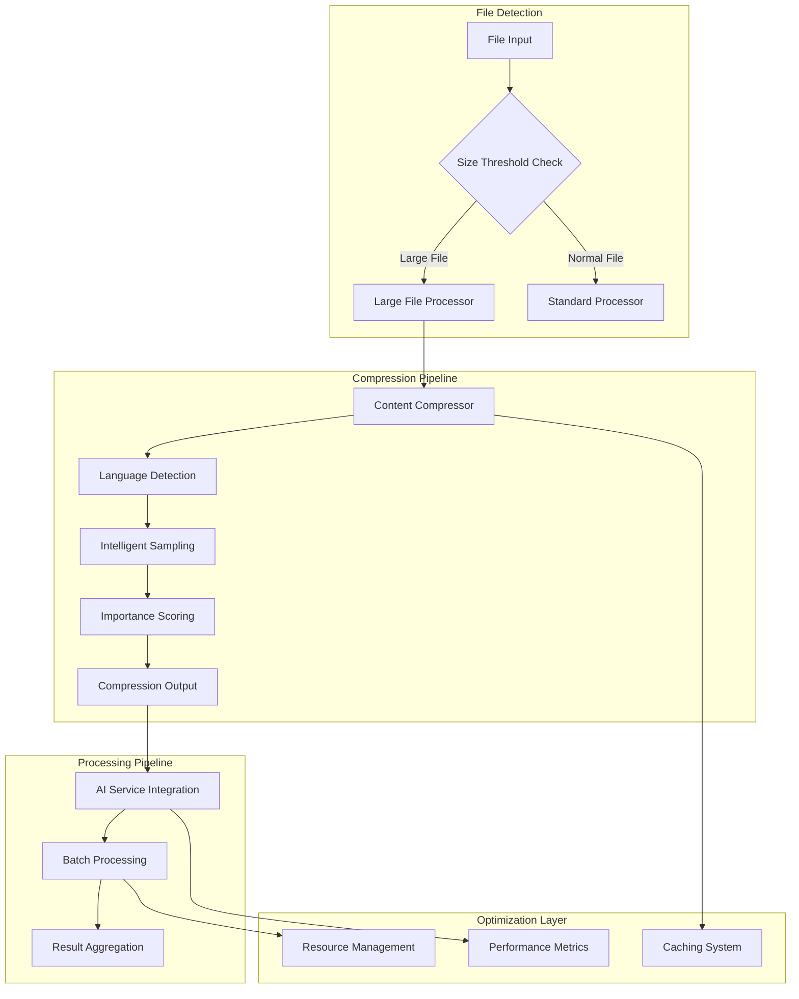
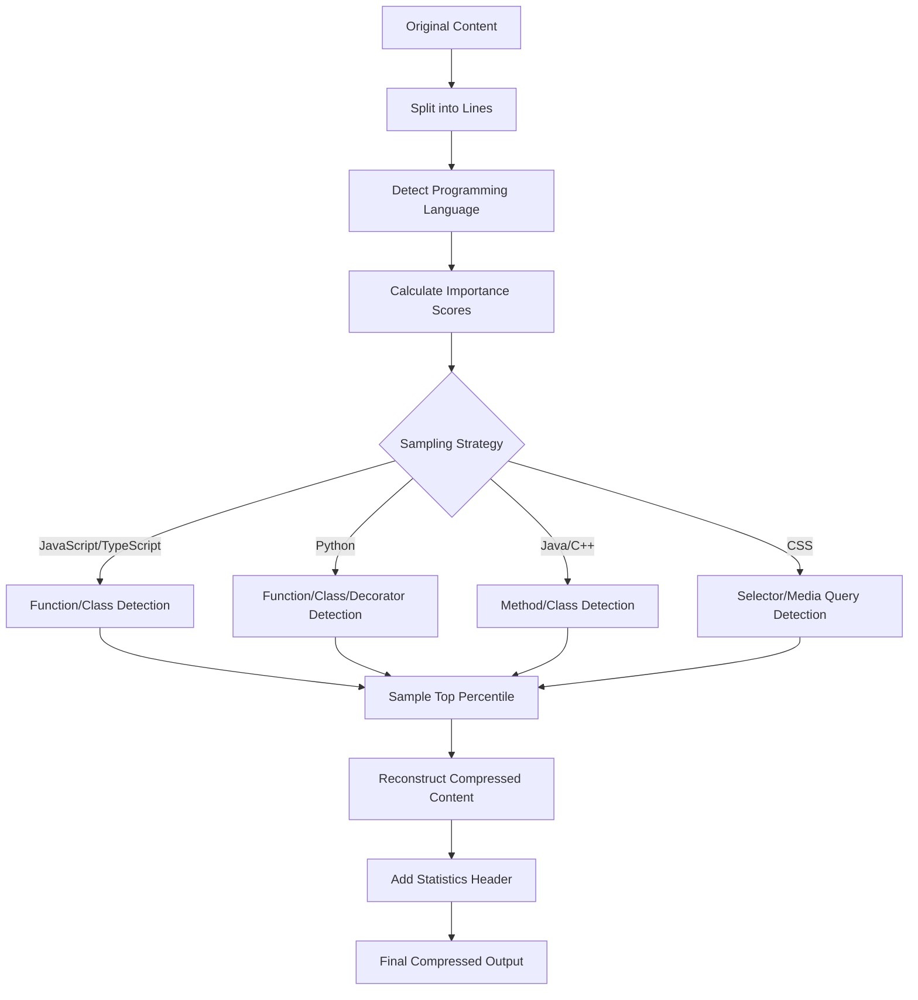
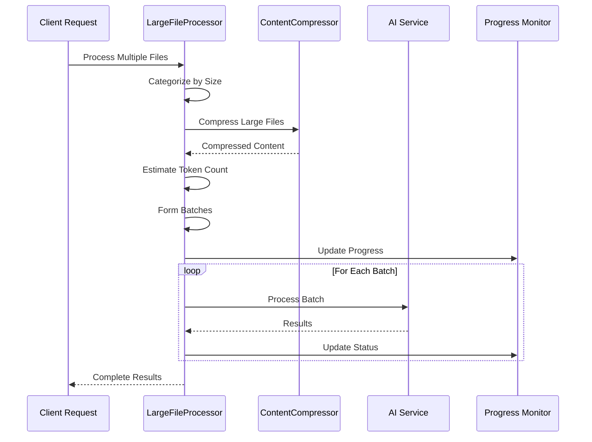
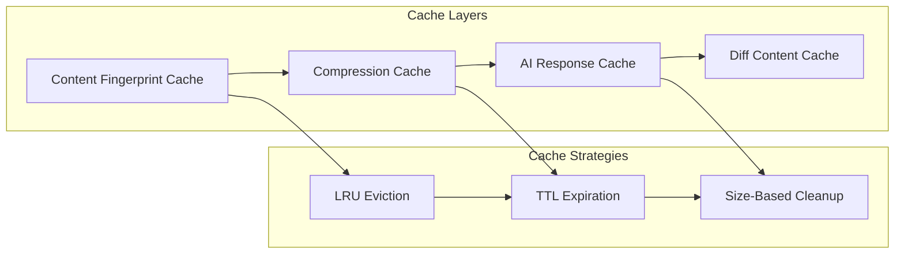
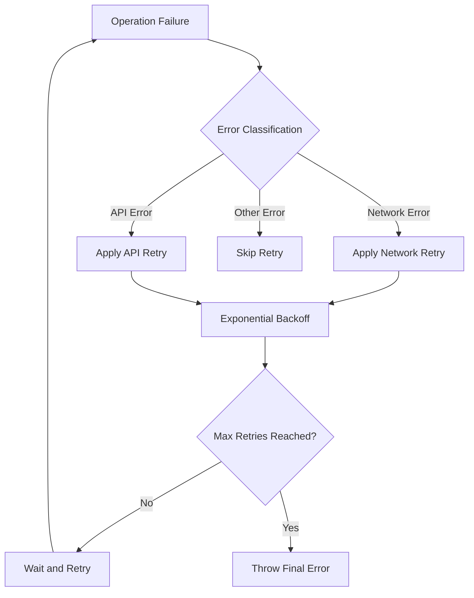
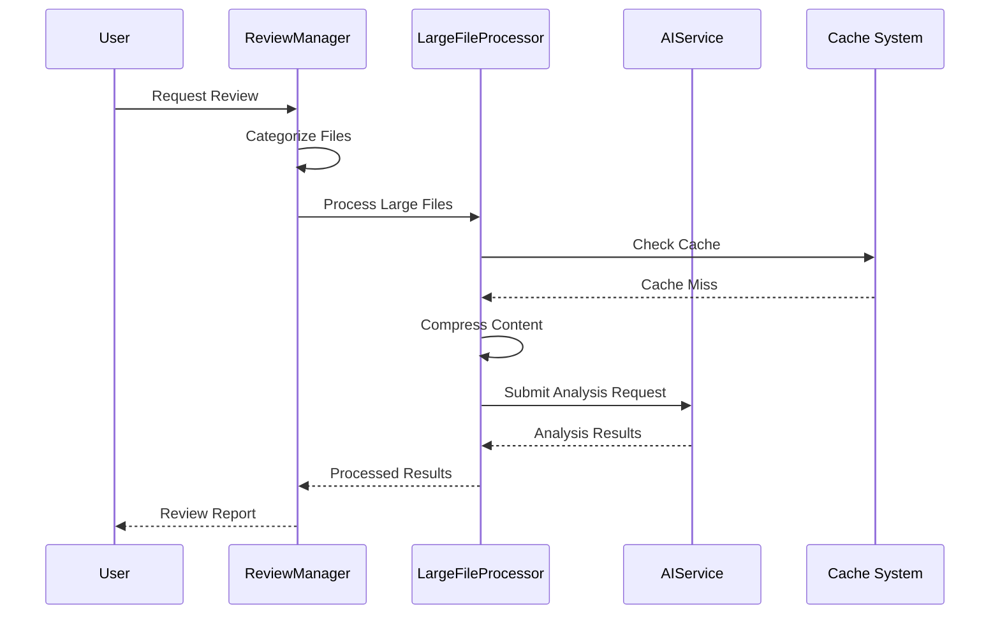

# Advanced Features

<cite>
**Referenced Files in This Document**
- [contentCompressor.ts](file://src/core/compression/contentCompressor.ts)
- [largeFileProcessor.ts](file://src/core/compression/largeFileProcessor.ts)
- [compressionTypes.ts](file://src/core/compression/compressionTypes.ts)
- [retryUtils.ts](file://src/utils/retryUtils.ts)
- [reviewManager.ts](file://src/services/review/reviewManager.ts)
- [aiService.ts](file://src/services/ai/aiService.ts)
- [reviewTypes.ts](file://src/core/review/reviewTypes.ts)
- [appConfig.ts](file://src/config/appConfig.ts)
- [fileUtils.ts](file://src/utils/fileUtils.ts)
- [logger.ts](file://src/utils/logger.ts)
</cite>

## Table of Contents
1. [Introduction](#introduction)
2. [Large File Processing Architecture](#large-file-processing-architecture)
3. [Content Compression Subsystem](#content-compression-subsystem)
4. [Batch Processing and Async Execution](#batch-processing-and-async-execution)
5. [Performance Optimization Techniques](#performance-optimization-techniques)
6. [Retry Mechanisms and Error Handling](#retry-mechanisms-and-error-handling)
7. [Integration with Review Workflows](#integration-with-review-workflows)
8. [Configuration and Tuning](#configuration-and-tuning)
9. [Best Practices and Use Cases](#best-practices-and-use-cases)
10. [Troubleshooting and Monitoring](#troubleshooting-and-monitoring)

## Introduction

CodeKarmic's advanced features are designed to handle large-scale code review scenarios efficiently while maintaining code quality and performance. The system employs sophisticated compression algorithms, intelligent batching strategies, and robust error handling to process massive files, minified code, and extensive log outputs without compromising analysis accuracy.

The core architecture focuses on three primary pillars: **Intelligent Content Compression**, **Scalable Batch Processing**, and **Resilient Error Recovery**. These components work together to provide seamless large file processing capabilities while optimizing resource utilization and maintaining throughput.

## Large File Processing Architecture

The large file processing system is built around a modular architecture that separates concerns between content analysis, compression, and review execution. The system automatically identifies large files, applies intelligent compression techniques, and processes them through specialized pipelines.

**Diagram sources**
- [largeFileProcessor.ts](file://src/core/compression/largeFileProcessor.ts#L23-L241)
- [contentCompressor.ts](file://src/core/compression/contentCompressor.ts#L18-L414)

The architecture ensures that large files are handled efficiently through multiple optimization layers, including intelligent compression, batch processing, and caching mechanisms.

**Section sources**
- [largeFileProcessor.ts](file://src/core/compression/largeFileProcessor.ts#L23-L241)
- [compressionTypes.ts](file://src/core/compression/compressionTypes.ts#L61-L87)

## Content Compression Subsystem

The content compression subsystem forms the backbone of large file processing, employing sophisticated algorithms to reduce file sizes while preserving critical information. The system uses semantic analysis to identify and retain important code structures while discarding less significant content.

### Compression Algorithm Design

The compression algorithm operates on multiple levels, combining statistical analysis with language-specific heuristics to achieve optimal compression ratios.

**Diagram sources**
- [contentCompressor.ts](file://src/core/compression/contentCompressor.ts#L56-L174)

### Language-Specific Optimization

The compression system implements specialized algorithms for different programming languages, recognizing syntax patterns and structural elements that are crucial for code understanding.

| Language | Key Patterns | Optimization Strategy |
|----------|-------------|----------------------|
| JavaScript/TypeScript | Functions, Classes, React Hooks, JSX | Preserve component structure and functional patterns |
| Python | Functions, Classes, Decorators, Docstrings | Maintain indentation-sensitive structure |
| Java/C++ | Methods, Classes, Templates, Preprocessor | Preserve type information and namespace structure |
| CSS/SASS | Selectors, Media Queries, Variables | Keep responsive design patterns intact |
| SQL | Queries, Tables, Procedures | Maintain logical structure and relationships |

### Compression Trade-offs

The system balances compression efficiency against information retention through configurable parameters:

- **Header/Footer Preservation**: Maintains context by keeping first and last N lines
- **Importance Scoring**: Uses weighted scoring based on code structure significance
- **Sampling Rate Control**: Adjustable percentage of content to retain
- **Token Efficiency**: Optimizes for AI model token limits while preserving meaning

**Section sources**
- [contentCompressor.ts](file://src/core/compression/contentCompressor.ts#L56-L231)
- [compressionTypes.ts](file://src/core/compression/compressionTypes.ts#L10-L41)

## Batch Processing and Async Execution

The batch processing system enables efficient handling of multiple large files through intelligent grouping and parallel execution strategies. The system dynamically adjusts batch sizes based on token limits and file characteristics.

### Dynamic Batch Formation

**Diagram sources**
- [largeFileProcessor.ts](file://src/core/compression/largeFileProcessor.ts#L158-L225)
- [aiService.ts](file://src/services/ai/aiService.ts#L430-L552)

### Token-Based Batch Sizing

The system implements intelligent token estimation to prevent API limits while maximizing throughput:

- **Token Estimation**: 0.25 tokens per character as baseline
- **Batch Limits**: 4,000 tokens per batch (configurable)
- **Dynamic Adjustment**: Real-time batch size optimization
- **Memory Management**: Controlled concurrent processing

### Parallel Execution Strategies

The system employs multiple parallelization approaches:

1. **File-Level Parallelism**: Process independent files concurrently
2. **Batch-Level Parallelism**: Execute multiple batches simultaneously
3. **Pipeline Parallelism**: Overlap compression and AI processing
4. **Async Streaming**: Stream results as they become available

**Section sources**
- [largeFileProcessor.ts](file://src/core/compression/largeFileProcessor.ts#L158-L225)
- [aiService.ts](file://src/services/ai/aiService.ts#L430-L552)

## Performance Optimization Techniques

CodeKarmic implements comprehensive performance optimization strategies across multiple layers of the system, focusing on memory efficiency, computational optimization, and resource management.

### Caching Mechanisms

The system employs multi-level caching to minimize redundant computations:

**Diagram sources**
- [contentCompressor.ts](file://src/core/compression/contentCompressor.ts#L281-L413)
- [aiService.ts](file://src/services/ai/aiService.ts#L218-L225)

### Memory Management

Efficient memory usage is achieved through:

- **Streaming Processing**: Process content without loading entire files
- **Lazy Evaluation**: Defer expensive operations until needed
- **Object Pooling**: Reuse frequently allocated objects
- **Garbage Collection Optimization**: Minimize memory pressure

### Computational Optimization

The system optimizes computational resources through:

- **Algorithmic Efficiency**: O(n) complexity for most operations
- **Preprocessing**: Cache language detection results
- **Incremental Processing**: Process only changed content
- **Resource Pooling**: Shared worker threads and connections

**Section sources**
- [contentCompressor.ts](file://src/core/compression/contentCompressor.ts#L281-L413)
- [logger.ts](file://src/utils/logger.ts#L18-L88)

## Retry Mechanisms and Error Handling

The retry system provides robust error recovery through configurable retry policies, exponential backoff, and intelligent error classification.

### Retry Policy Configuration

**Diagram sources**
- [retryUtils.ts](file://src/utils/retryUtils.ts#L33-L70)

### Error Classification Patterns

The system recognizes common error patterns for intelligent retry decisions:

| Error Category | Patterns | Retry Strategy |
|---------------|----------|----------------|
| Network Errors | ECONNRESET, ETIMEDOUT, socket hang up | Exponential backoff |
| API Errors | 5xx status codes, rate limit exceeded | Linear backoff |
| Authentication | 401, 403 errors | Immediate failure |
| Validation | Input format errors | Skip retry |

### Async Error Handling

The system implements comprehensive error propagation:

- **Promise Rejection**: Proper error handling in async operations
- **Cancellation Support**: Graceful cancellation of long-running operations
- **Partial Success**: Continue processing despite individual failures
- **Error Aggregation**: Collect and report multiple failure scenarios

**Section sources**
- [retryUtils.ts](file://src/utils/retryUtils.ts#L1-L117)

## Integration with Review Workflows

The large file processing system seamlessly integrates with CodeKarmic's review workflows, providing transparent handling of large files during code analysis.

### Workflow Integration Points

**Diagram sources**
- [reviewManager.ts](file://src/services/review/reviewManager.ts#L329-L551)
- [aiService.ts](file://src/services/ai/aiService.ts#L430-L467)

### Review Mode Adaptation

The system adapts processing strategies based on review mode:

- **Git Commit Mode**: Process diffs and full file changes
- **Explorer Mode**: Handle directory-based file collections
- **Real-time Mode**: Provide immediate feedback on large edits
- **Domain-specific Mode**: Apply specialized analysis for specific domains

### Quality Assurance

Integration ensures consistent quality across different file sizes:

- **Consistent Analysis**: Same algorithms for small and large files
- **Progress Tracking**: Real-time status updates
- **Error Reporting**: Comprehensive failure diagnostics
- **Result Validation**: Verify analysis accuracy

**Section sources**
- [reviewManager.ts](file://src/services/review/reviewManager.ts#L329-L551)
- [aiService.ts](file://src/services/ai/aiService.ts#L430-L467)

## Configuration and Tuning

The system provides extensive configuration options for optimizing performance based on specific use cases and infrastructure constraints.

### Key Configuration Parameters

| Parameter | Default Value | Purpose | Tuning Guidelines |
|-----------|---------------|---------|-------------------|
| `sizeThreshold` | 20,000 characters | Large file detection | Increase for larger files |
| `sampleRate` | 0.2 (20%) | Compression sampling | Higher for smaller files |
| `headerLines` | 30 | Context preservation | More for complex files |
| `footerLines` | 20 | Completion context | Adjust based on file type |
| `maxRetries` | 2 | Retry attempts | Increase for unreliable networks |
| `initialDelay` | 500ms | Initial retry delay | Higher for rate-limited APIs |

### Performance Tuning Strategies

Effective tuning requires balancing several factors:

- **Throughput vs. Accuracy**: Higher sample rates improve accuracy but reduce speed
- **Memory Usage**: Larger batches consume more memory but improve efficiency
- **Network Efficiency**: Fewer, larger requests are more efficient than many small ones
- **Resource Constraints**: Adjust based on available CPU and memory

### Environment-Specific Optimization

Different environments require different optimization approaches:

- **Development**: Prioritize accuracy and debugging information
- **CI/CD**: Optimize for speed and reliability
- **Production**: Balance all factors for production stability
- **Testing**: Use conservative settings for reproducibility

**Section sources**
- [compressionTypes.ts](file://src/core/compression/compressionTypes.ts#L32-L87)
- [appConfig.ts](file://src/config/appConfig.ts#L37-L42)

## Best Practices and Use Cases

### Recommended Use Cases

1. **Minified File Analysis**: Automatically compress and analyze minified JavaScript/CSS files
2. **Log File Review**: Process large log files for pattern detection and anomaly identification
3. **Build Artifacts**: Analyze compiled code and generated files
4. **Third-party Libraries**: Review vendor-provided code without manual preprocessing
5. **Legacy Codebases**: Handle large legacy systems efficiently

### Implementation Guidelines

- **File Type Detection**: Use language hints for better compression accuracy
- **Batch Size Optimization**: Monitor token usage and adjust accordingly
- **Progress Monitoring**: Implement comprehensive progress tracking
- **Error Handling**: Provide meaningful error messages and recovery options
- **Performance Monitoring**: Track compression ratios and processing times

### Common Pitfalls to Avoid

- **Over-compression**: Risk losing critical information by compressing too aggressively
- **Memory Leaks**: Ensure proper cleanup of large file processing
- **Network Issues**: Implement robust retry mechanisms for unreliable connections
- **Token Limits**: Monitor API token usage and adjust batch sizes
- **Language Detection**: Provide explicit language hints for ambiguous files

## Troubleshooting and Monitoring

### Performance Monitoring

The system provides comprehensive monitoring capabilities:

- **Compression Ratios**: Track effectiveness of compression algorithms
- **Processing Times**: Monitor file processing performance
- **Error Rates**: Track retry success and failure patterns
- **Resource Usage**: Monitor memory and CPU consumption
- **API Utilization**: Track token usage and rate limiting

### Diagnostic Tools

Built-in diagnostic capabilities help identify performance bottlenecks:

- **Logging Levels**: Configurable verbosity for different components
- **Performance Timers**: Built-in timing for critical operations
- **Statistics Collection**: Automatic collection of processing metrics
- **Error Tracking**: Comprehensive error reporting and categorization

### Debugging Large Files

When dealing with problematic large files:

1. **Check Language Detection**: Verify correct language identification
2. **Adjust Compression Settings**: Modify sample rates and thresholds
3. **Monitor Memory Usage**: Ensure adequate memory allocation
4. **Test with Smaller Samples**: Validate processing pipeline with subsets
5. **Review Error Logs**: Analyze detailed error information

**Section sources**
- [logger.ts](file://src/utils/logger.ts#L18-L88)
- [largeFileProcessor.ts](file://src/core/compression/largeFileProcessor.ts#L230-L241)