# Batch Processing

<cite>
**Referenced Files in This Document**
- [largeFileProcessor.ts](file://src/core/compression/largeFileProcessor.ts)
- [reviewManager.ts](file://src/services/review/reviewManager.ts)
- [aiService.ts](file://src/services/ai/aiService.ts)
- [gitService.ts](file://src/services/git/gitService.ts)
- [compressionTypes.ts](file://src/core/compression/compressionTypes.ts)
- [reviewTypes.ts](file://src/core/review/reviewTypes.ts)
- [logger.ts](file://src/utils/logger.ts)
- [notificationManager.ts](file://src/services/notification/notificationManager.ts)
</cite>

## Table of Contents
1. [Introduction](#introduction)
2. [System Architecture](#system-architecture)
3. [Batch Processing Components](#batch-processing-components)
4. [File Grouping and Batching Strategies](#file-grouping-and-batching-strategies)
5. [ReviewManager Orchestration](#reviewmanager-orchestration)
6. [Error Handling and Isolation](#error-handling-and-isolation)
7. [User Experience Features](#user-experience-features)
8. [Practical Scenarios](#practical-scenarios)
9. [Configuration and Optimization](#configuration-and-optimization)
10. [Limitations and Trade-offs](#limitations-and-trade-offs)
11. [Best Practices](#best-practices)

## Introduction

CodeKarmic's batch processing system enables efficient handling of multiple files or commits within a single review session. This sophisticated architecture coordinates multiple services to process large volumes of code efficiently while maintaining performance, reliability, and user experience. The system employs intelligent file grouping, parallel processing, and comprehensive error isolation to deliver scalable code review capabilities.

The batch processing framework operates on several key principles: intelligent file categorization based on size and complexity, strategic batching to optimize AI token consumption, parallel execution for improved throughput, and robust error handling that prevents cascade failures. This approach allows developers to review entire pull requests, legacy code migrations, or large codebases with consistent performance characteristics.

## System Architecture

The batch processing system follows a layered architecture that separates concerns between file processing, AI analysis, and user interface coordination. This design enables scalability, maintainability, and extensibility while providing reliable batch operations.

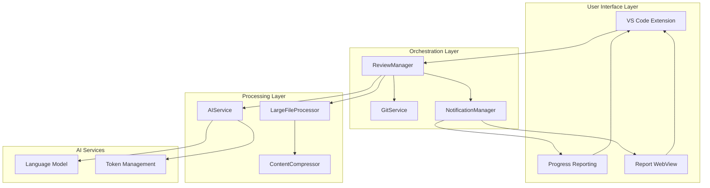

**Diagram sources**
- [reviewManager.ts](file://src/services/review/reviewManager.ts#L79-L85)
- [gitService.ts](file://src/services/git/gitService.ts#L45-L52)
- [largeFileProcessor.ts](file://src/core/compression/largeFileProcessor.ts#L23-L32)
- [aiService.ts](file://src/services/ai/aiService.ts#L40-L50)

The architecture demonstrates clear separation of responsibilities where each component has specific domains of expertise. The ReviewManager acts as the central coordinator, managing the orchestration of file processing, AI analysis, and user feedback. The LargeFileProcessor specializes in handling oversized files through compression and summarization techniques, while the AIService manages AI model interactions and batch processing optimizations.

**Section sources**
- [reviewManager.ts](file://src/services/review/reviewManager.ts#L79-L85)
- [gitService.ts](file://src/services/git/gitService.ts#L45-L52)
- [largeFileProcessor.ts](file://src/core/compression/largeFileProcessor.ts#L23-L32)
- [aiService.ts](file://src/services/ai/aiService.ts#L40-L50)

## Batch Processing Components

### LargeFileProcessor

The LargeFileProcessor serves as the cornerstone of batch processing for oversized files, employing sophisticated compression and summarization techniques to manage token limits while preserving essential code information.

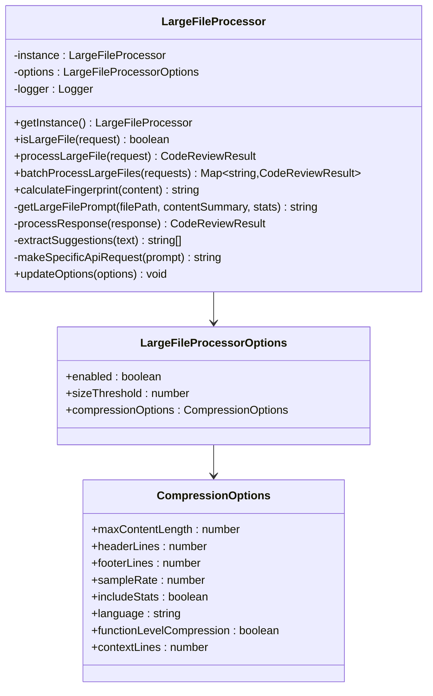

**Diagram sources**
- [largeFileProcessor.ts](file://src/core/compression/largeFileProcessor.ts#L23-L42)
- [compressionTypes.ts](file://src/core/compression/compressionTypes.ts#L64-L80)

The LargeFileProcessor implements a singleton pattern to ensure consistent configuration across the application. It provides intelligent file detection based on size thresholds and employs configurable compression strategies to reduce content complexity while maintaining semantic integrity.

### AIService Batch Processing

The AIService orchestrates AI analysis across multiple files using sophisticated batching strategies that optimize token usage and processing efficiency.

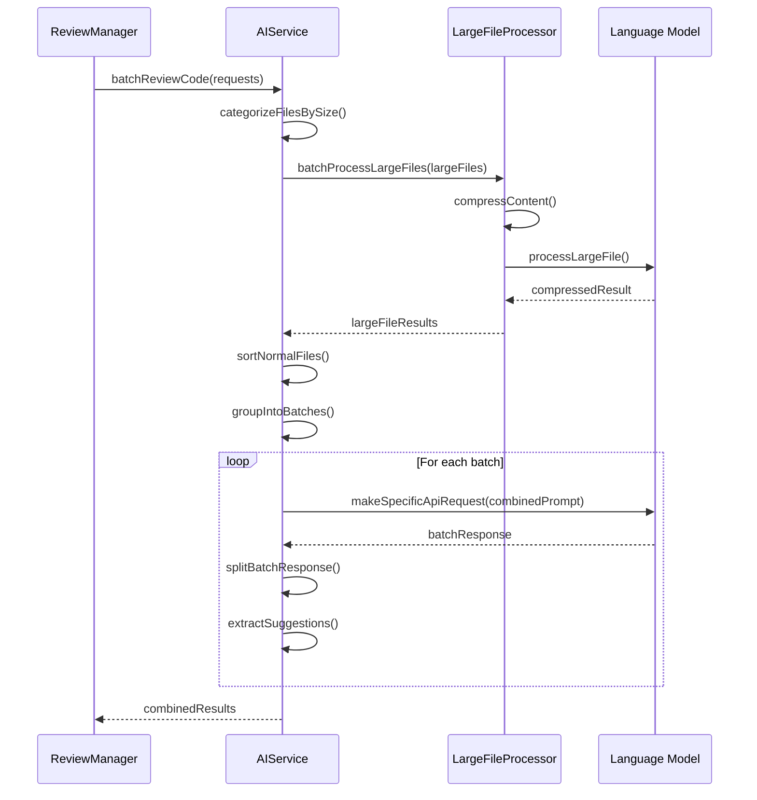

**Diagram sources**
- [aiService.ts](file://src/services/ai/aiService.ts#L431-L552)
- [largeFileProcessor.ts](file://src/core/compression/largeFileProcessor.ts#L159-L224)

The AIService implements a dual-tier batching strategy, separating large files requiring compression from normal-sized files suitable for direct AI analysis. This approach optimizes resource utilization and ensures that token limits are respected across different file sizes.

**Section sources**
- [largeFileProcessor.ts](file://src/core/compression/largeFileProcessor.ts#L23-L42)
- [aiService.ts](file://src/services/ai/aiService.ts#L431-L552)

## File Grouping and Batching Strategies

### Size-Based Categorization

The system employs intelligent file categorization to apply appropriate processing strategies based on file characteristics. This approach ensures optimal performance and resource utilization across diverse codebases.

| File Category | Size Threshold | Processing Strategy | Batch Size |
|---------------|----------------|-------------------|------------|
| Large Files | > 100,000 characters | Compression + Summarization | 1-5 files per batch |
| Normal Files | ≤ 100,000 characters | Direct AI Analysis | 5-10 files per batch |
| Small Files | ≤ 10,000 characters | Full File Analysis | 10-20 files per batch |

### Token-Based Batching

The system implements sophisticated token management to prevent exceeding AI model limits while maximizing processing efficiency.

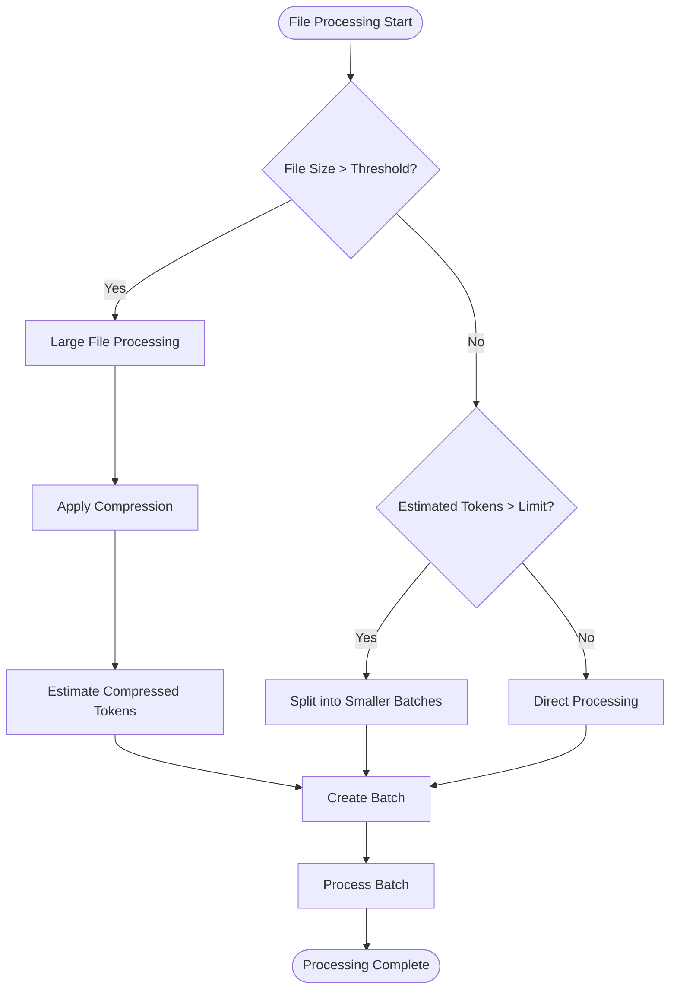

**Diagram sources**
- [largeFileProcessor.ts](file://src/core/compression/largeFileProcessor.ts#L169-L195)
- [aiService.ts](file://src/services/ai/aiService.ts#L478-L490)

The token-based batching system dynamically adjusts batch composition based on estimated token requirements, ensuring compliance with AI model constraints while minimizing processing overhead.

### Parallel Processing Coordination

The ReviewManager coordinates parallel processing across multiple batches, implementing sophisticated scheduling and resource management strategies.

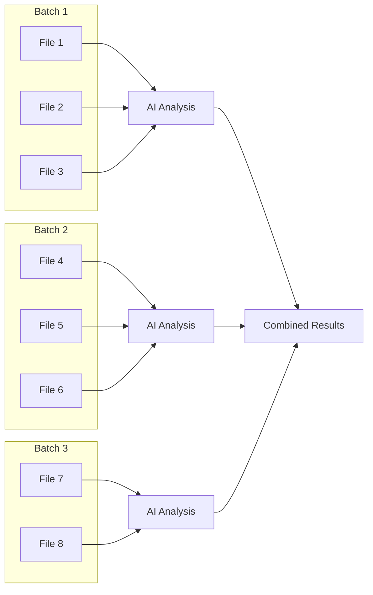

**Diagram sources**
- [reviewManager.ts](file://src/services/review/reviewManager.ts#L329-L369)

**Section sources**
- [largeFileProcessor.ts](file://src/core/compression/largeFileProcessor.ts#L169-L195)
- [aiService.ts](file://src/services/ai/aiService.ts#L478-L490)
- [reviewManager.ts](file://src/services/review/reviewManager.ts#L329-L369)

## ReviewManager Orchestration

### Central Coordination Hub

The ReviewManager serves as the central orchestrator for batch processing operations, managing the coordination between GitService, AIService, and user interface components.

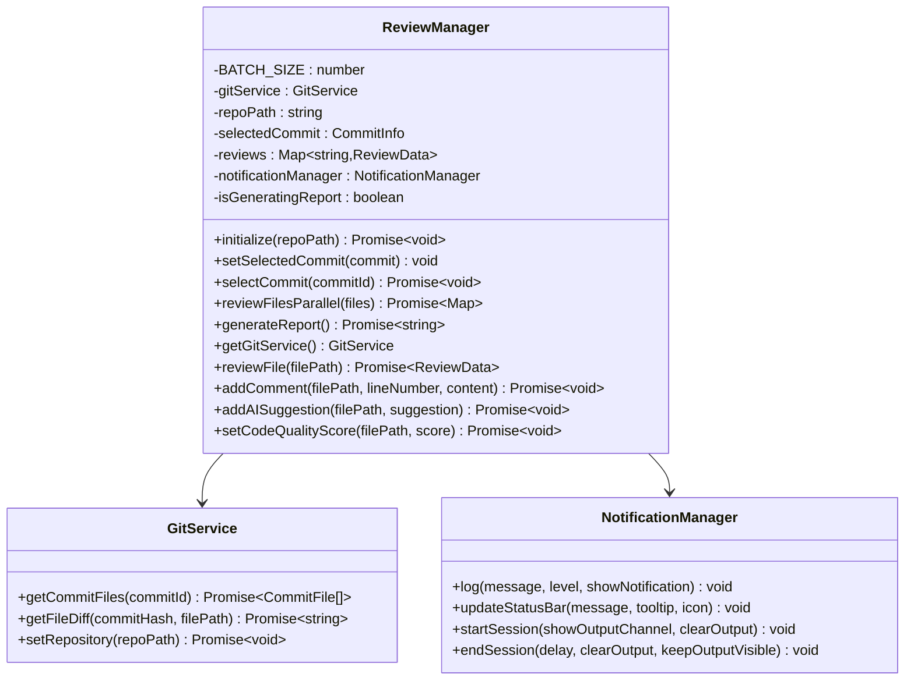

**Diagram sources**
- [reviewManager.ts](file://src/services/review/reviewManager.ts#L79-L85)
- [gitService.ts](file://src/services/git/gitService.ts#L45-L52)
- [notificationManager.ts](file://src/services/notification/notificationManager.ts#L8-L18)

### Batch Processing Workflow

The ReviewManager implements a sophisticated workflow that coordinates multiple processing stages while maintaining progress visibility and error resilience.

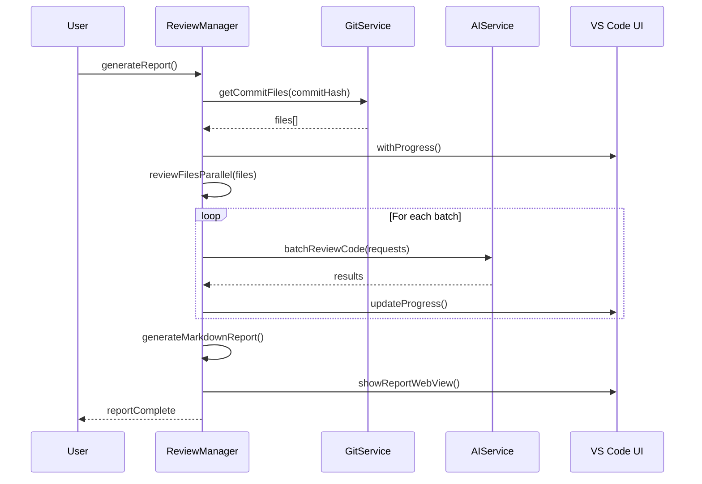

**Diagram sources**
- [reviewManager.ts](file://src/services/review/reviewManager.ts#L329-L369)
- [reviewManager.ts](file://src/services/review/reviewManager.ts#L467-L565)

**Section sources**
- [reviewManager.ts](file://src/services/review/reviewManager.ts#L79-L85)
- [reviewManager.ts](file://src/services/review/reviewManager.ts#L329-L369)
- [reviewManager.ts](file://src/services/review/reviewManager.ts#L467-L565)

## Error Handling and Isolation

### Individual File Failure Isolation

The batch processing system implements comprehensive error isolation mechanisms to prevent cascade failures and maintain system stability during large-scale operations.

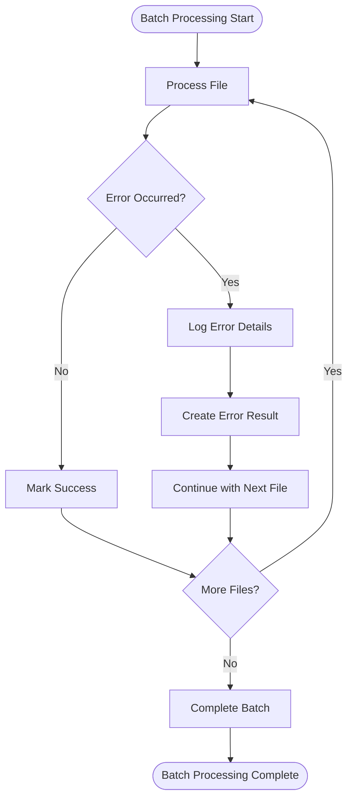

**Diagram sources**
- [largeFileProcessor.ts](file://src/core/compression/largeFileProcessor.ts#L210-L221)
- [aiService.ts](file://src/services/ai/aiService.ts#L691-L710)

### Error Recovery Strategies

The system implements multiple error recovery strategies to maintain processing continuity and provide meaningful feedback to users.

| Error Type | Recovery Strategy | User Impact |
|------------|------------------|-------------|
| Network Timeout | Retry with exponential backoff | Automatic retry |
| Token Limit Exceeded | Split into smaller batches | Transparent adjustment |
| File Processing Error | Isolate file, continue batch | Individual failure reported |
| AI Service Unavailable | Fallback to sequential processing | Reduced performance |
| Memory Exhaustion | Reduce batch size | Automatic optimization |

### Comprehensive Logging and Monitoring

The system provides extensive logging capabilities to track batch processing activities and diagnose issues effectively.

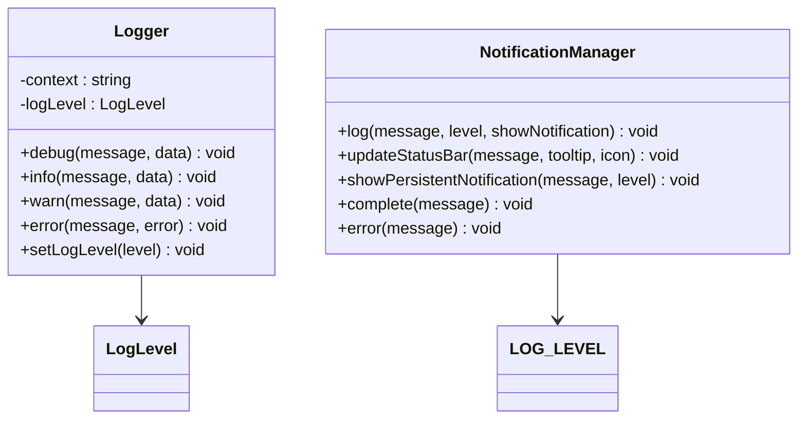

**Diagram sources**
- [logger.ts](file://src/utils/logger.ts#L18-L88)
- [notificationManager.ts](file://src/services/notification/notificationManager.ts#L8-L18)

**Section sources**
- [largeFileProcessor.ts](file://src/core/compression/largeFileProcessor.ts#L210-L221)
- [aiService.ts](file://src/services/ai/aiService.ts#L691-L710)
- [logger.ts](file://src/utils/logger.ts#L18-L88)
- [notificationManager.ts](file://src/services/notification/notificationManager.ts#L8-L18)

## User Experience Features

### Real-Time Progress Reporting

The system provides comprehensive progress reporting through multiple channels, ensuring users remain informed throughout batch processing operations.

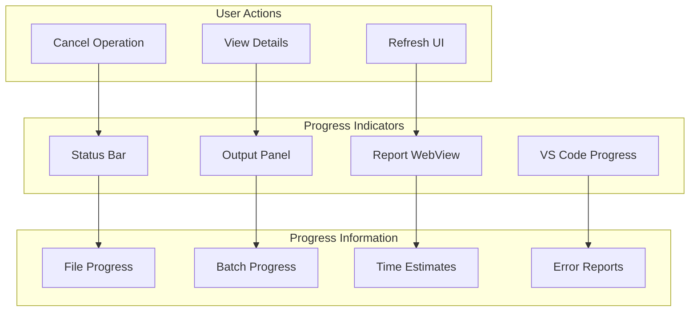

**Diagram sources**
- [notificationManager.ts](file://src/services/notification/notificationManager.ts#L130-L142)
- [reviewManager.ts](file://src/services/review/reviewManager.ts#L666-L722)

### Interactive Report Generation

The system generates interactive reports with real-time updates, allowing users to monitor progress and access detailed information as it becomes available.

### Partial Result Availability

The batch processing system provides partial results as soon as they become available, enabling users to access valuable insights before the entire batch completes.

**Section sources**
- [reviewManager.ts](file://src/services/review/reviewManager.ts#L467-L565)
- [reviewManager.ts](file://src/services/review/reviewManager.ts#L666-L722)
- [notificationManager.ts](file://src/services/notification/notificationManager.ts#L130-L142)

## Practical Scenarios

### Pull Request Reviews

Batch processing excels in scenarios involving comprehensive pull request reviews, where multiple files across various categories need analysis.

**Scenario Characteristics:**
- File count: 20-100 files
- File sizes: Mixed small, medium, and large files
- Complexity: Varies from simple fixes to major feature additions
- Time constraints: Developer-driven deadlines

**Optimization Strategy:**
- Separate large files for compression processing
- Group similar-sized files for efficient AI analysis
- Implement parallel processing with progress monitoring
- Provide incremental result delivery

### Legacy Code Migration

Legacy code migration projects benefit significantly from batch processing capabilities, enabling comprehensive analysis of large, complex codebases.

**Scenario Characteristics:**
- File count: 100-1000 files
- File sizes: Predominantly large legacy files
- Complexity: High complexity, potential architectural issues
- Time constraints: Project timelines with milestone deadlines

**Optimization Strategy:**
- Aggressive compression for large legacy files
- Prioritized processing based on file importance
- Comprehensive error reporting for problematic files
- Incremental migration support through partial results

### Code Quality Audits

Enterprise code quality audits require systematic analysis of large codebases with consistent reporting standards.

**Scenario Characteristics:**
- File count: 500-5000 files
- File sizes: Variable, often large enterprise codebases
- Complexity: High, with multiple architectural layers
- Time constraints: Quarterly or annual audit schedules

**Optimization Strategy:**
- Hierarchical batching based on code organization
- Standardized result formatting across all files
- Comprehensive metrics collection and reporting
- Scalable processing with resource monitoring

## Configuration and Optimization

### Batch Size Configuration

The system provides flexible configuration options to optimize batch processing for different scenarios and system capabilities.

| Configuration Parameter | Default Value | Range | Impact |
|------------------------|---------------|-------|---------|
| BATCH_SIZE | 5 | 1-20 | Processing speed vs. resource usage |
| MAX_BATCH_TOKENS | 4000 | 1000-16000 | AI model compliance vs. processing efficiency |
| LARGE_FILE_THRESHOLD | 100000 | 10000-500000 | Compression usage vs. direct processing |
| COMPRESSION_SAMPLE_RATE | 0.2 | 0.1-0.5 | Compression effectiveness vs. processing time |

### Memory Optimization Settings

The system implements several memory optimization strategies to handle large batches efficiently.

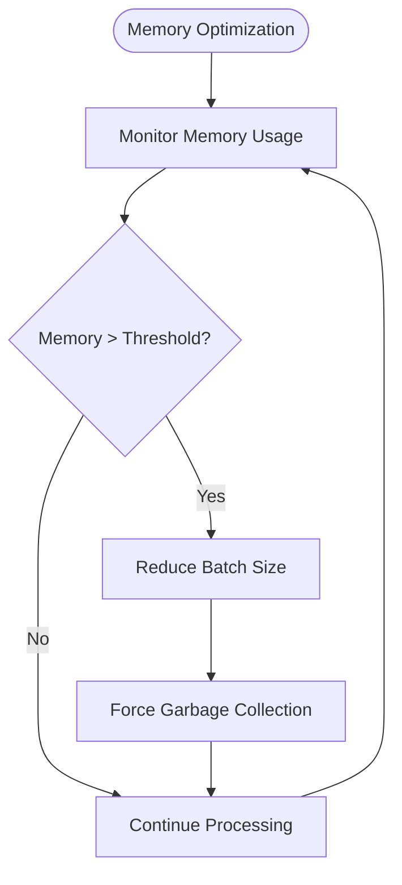

**Diagram sources**
- [compressionTypes.ts](file://src/core/compression/compressionTypes.ts#L85-L87)
- [reviewManager.ts](file://src/services/review/reviewManager.ts#L80)

### Concurrency Control

The system implements intelligent concurrency control to balance processing speed with system stability and resource utilization.

**Section sources**
- [compressionTypes.ts](file://src/core/compression/compressionTypes.ts#L85-L87)
- [reviewManager.ts](file://src/services/review/reviewManager.ts#L80)
- [aiService.ts](file://src/services/ai/aiService.ts#L478-L490)

## Limitations and Trade-offs

### Memory Usage During Large Batches

Large batch processing operations can consume significant memory resources, particularly when handling numerous large files simultaneously.

**Memory Consumption Factors:**
- File content storage in memory during processing
- Batch result accumulation before final aggregation
- Concurrent processing overhead
- Compression algorithm memory requirements

**Mitigation Strategies:**
- Dynamic batch size adjustment based on available memory
- Progressive result streaming to reduce peak memory usage
- Garbage collection optimization during long-running operations
- Memory profiling and monitoring during development

### AI Token Consumption

Batch processing operations must carefully manage AI token consumption to stay within budgetary and model limits.

**Token Management Challenges:**
- Variable token requirements based on file content complexity
- Compression effectiveness affecting token savings
- Batch size optimization balancing efficiency and cost
- Rate limiting considerations for AI service APIs

**Optimization Approaches:**
- Intelligent file categorization for optimal compression
- Dynamic batch sizing based on estimated token requirements
- Prioritized processing for high-value files
- Cost monitoring and alerting systems

### Processing Time Predictions

Accurate time predictions for large batch operations can be challenging due to variable file characteristics and system conditions.

**Factors Affecting Time Predictions:**
- File size distribution within batches
- AI service response times
- Network latency variations
- System resource availability

**Improvement Strategies:**
- Historical performance data analysis
- Adaptive prediction algorithms
- Real-time performance monitoring
- User-configurable prediction sensitivity

## Best Practices

### Optimal Batch Configuration

For most scenarios, the default batch configuration provides excellent performance. However, specific use cases may benefit from customization.

**Recommended Configurations:**
- **Development Reviews:** Use default settings for balanced performance
- **Production Deployments:** Reduce batch size for reliability
- **CI/CD Pipelines:** Increase batch size for throughput optimization
- **Interactive Development:** Enable progress monitoring and incremental results

### Error Handling Best Practices

Implement comprehensive error handling strategies to ensure robust batch processing operations.

**Error Handling Guidelines:**
- Always implement individual file error isolation
- Provide meaningful error messages with actionable suggestions
- Maintain operation logs for troubleshooting and auditing
- Implement graceful degradation for non-critical failures

### Performance Monitoring

Establish comprehensive monitoring to track batch processing performance and identify optimization opportunities.

**Monitoring Metrics:**
- Processing time per batch and per file
- Memory usage patterns during batch operations
- Error rates and failure patterns
- AI token consumption and cost tracking
- User satisfaction metrics for progress reporting

### Resource Management

Implement effective resource management strategies to ensure system stability during intensive batch operations.

**Resource Management Strategies:**
- Monitor system resources during batch processing
- Implement adaptive batch sizing based on available resources
- Schedule intensive operations during off-peak hours when possible
- Provide user controls for batch operation prioritization