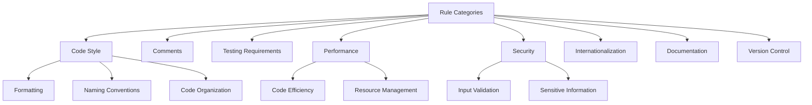
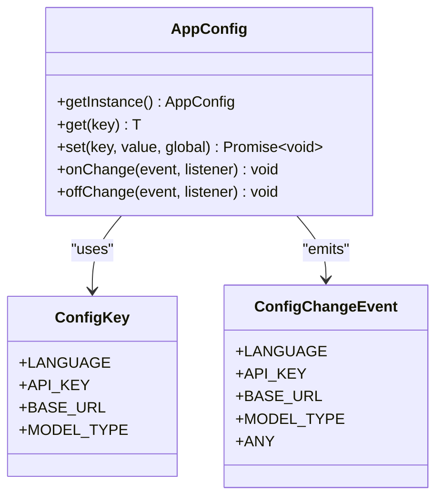
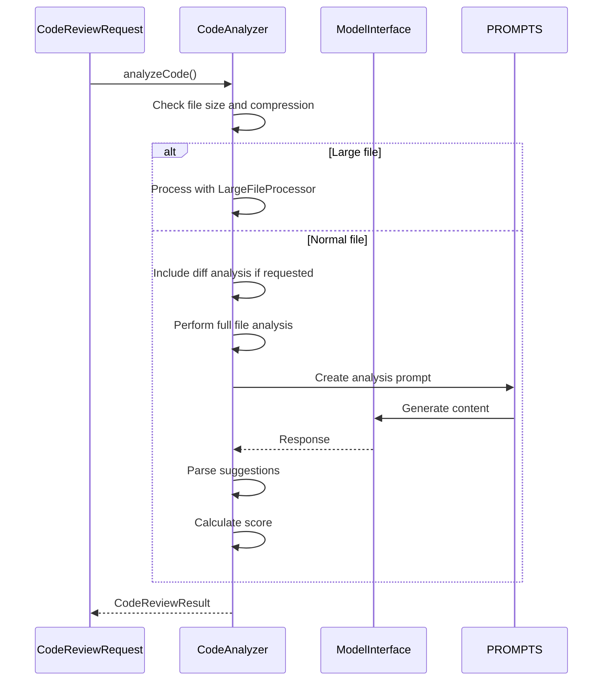
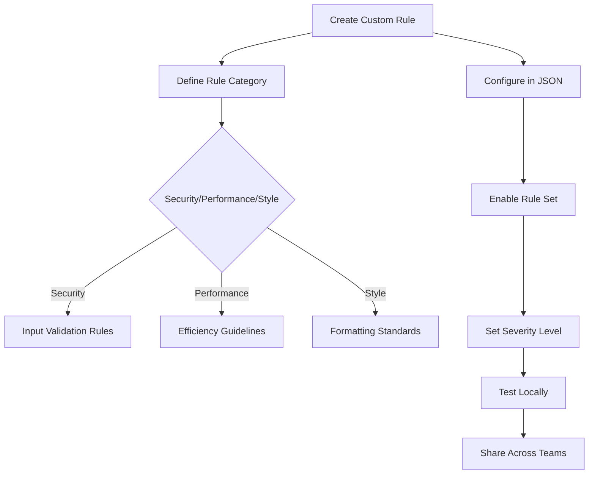
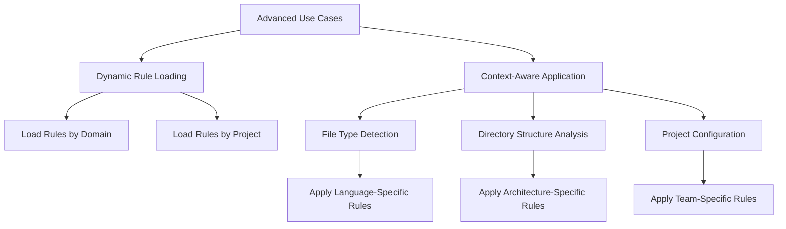
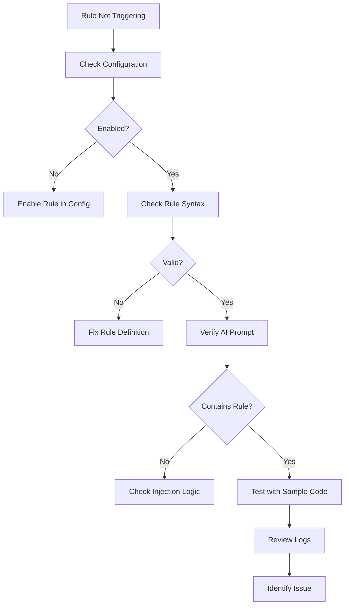
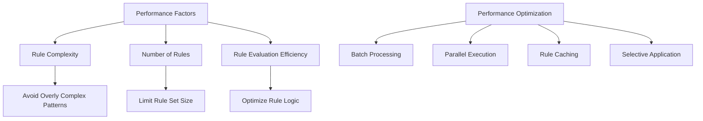

# Custom Review Rules

<cite>
**Referenced Files in This Document**   
- [code-review-rules.md](file://docs/zh-CN/guide/code-review-rules.md)
- [appConfig.ts](file://src/config/appConfig.ts)
- [codeAnalyzer.ts](file://src/core/review/codeAnalyzer.ts)
- [reviewTypes.ts](file://src/core/review/reviewTypes.ts)
- [aiService.ts](file://src/services/ai/aiService.ts)
- [prompts.ts](file://src/i18n/en/prompts.ts)
</cite>

## Table of Contents
1. [Introduction](#introduction)
2. [Rule Definition Format](#rule-definition-format)
3. [Configuration via AppConfig](#configuration-via-appconfig)
4. [Integration with CodeAnalyzer](#integration-with-codeanalyzer)
5. [Creating Custom Rules](#creating-custom-rules)
6. [Advanced Use Cases](#advanced-use-cases)
7. [Troubleshooting](#troubleshooting)
8. [Performance Considerations](#performance-considerations)

## Introduction
CodeKarmic enables users to define custom review rules that influence AI-generated suggestions during code review processes. These rules allow teams to enforce domain-specific or team-specific coding standards by injecting them into AI prompts or post-processing suggestions. The system supports various rule types including security, performance, and style enforcement through configurable JSON settings in appConfig.ts. This documentation explains how to implement, configure, and manage custom review rules within the CodeKarmic framework.

## Rule Definition Format
The rule definition format is documented in the code-review-rules.md file, which outlines comprehensive guidelines for code quality across multiple dimensions. The rules are organized into categories such as code style, comments, testing requirements, performance considerations, security, internationalization, documentation, and version control.

**Diagram sources**
- [code-review-rules.md](file://docs/zh-CN/guide/code-review-rules.md)

**Section sources**
- [code-review-rules.md](file://docs/zh-CN/guide/code-review-rules.md)

## Configuration via AppConfig
Custom review rules are configured through the AppConfig class, which provides centralized management of application settings. The configuration system allows users to enable/disable rule sets and adjust severity levels through JSON settings.

The AppConfig class implements a singleton pattern and manages configuration changes through event-based notifications. It exposes methods to get and set configuration values, with support for global or workspace-specific settings.

**Diagram sources**
- [appConfig.ts](file://src/config/appConfig.ts#L22-L17)

**Section sources**
- [appConfig.ts](file://src/config/appConfig.ts#L49-L188)

## Integration with CodeAnalyzer
The CodeAnalyzer class integrates custom rules by injecting them into AI prompts or post-processing suggestions. It analyzes code based on the provided request and options, generating review results that incorporate the configured rules.

The integration occurs through the analyzeCode method, which processes code review requests and applies the appropriate analysis based on the configuration. The system supports both diff analysis and full file analysis, with the ability to handle large files through compression.

**Diagram sources**
- [codeAnalyzer.ts](file://src/core/review/codeAnalyzer.ts#L35-L83)
- [reviewTypes.ts](file://src/core/review/reviewTypes.ts#L24-L73)

## Creating Custom Rules
To create custom rules in CodeKarmic, users can define domain-specific or team-specific coding standards that influence AI-generated suggestions. The process involves defining rules in the configuration system and ensuring they are properly integrated into the AI prompt generation process.

Custom rules are implemented through the domain-specific review functionality, which supports various domain types including security, performance, accessibility, internationalization, and data processing. Users can create rules by specifying domain rules in the configuration and enabling domain-specific analysis.

**Diagram sources**
- [reviewTypes.ts](file://src/core/review/reviewTypes.ts#L194-L205)
- [aiService.ts](file://src/services/ai/aiService.ts#L74-L123)

**Section sources**
- [reviewTypes.ts](file://src/core/review/reviewTypes.ts#L180-L188)
- [aiService.ts](file://src/services/ai/aiService.ts#L260-L387)

## Advanced Use Cases
CodeKarmic supports advanced use cases for custom review rules, including dynamic rule loading and context-aware rule application based on file type or project structure. These capabilities enable more sophisticated code analysis that adapts to the specific context of the code being reviewed.

Dynamic rule loading allows the system to load different rule sets based on the domain type or project configuration. Context-aware rule application enables different rules to be applied based on file type, directory structure, or other project-specific factors.

**Diagram sources**
- [reviewTypes.ts](file://src/core/review/reviewTypes.ts#L68-L72)
- [aiService.ts](file://src/services/ai/aiService.ts#L260-L387)

**Section sources**
- [reviewTypes.ts](file://src/core/review/reviewTypes.ts#L180-L188)
- [aiService.ts](file://src/services/ai/aiService.ts#L260-L387)

## Troubleshooting
When custom rules don't trigger as expected, several troubleshooting steps can help identify and resolve the issue. Common problems include incorrect configuration, rule conflicts, or issues with rule loading.

Key troubleshooting steps include verifying the configuration settings, checking the rule syntax, ensuring the rules are properly enabled, and validating that the AI model is receiving the correct prompts. The system provides logging capabilities through the NotificationManager to help diagnose issues.

**Diagram sources**
- [appConfig.ts](file://src/config/appConfig.ts#L95-L110)
- [aiService.ts](file://src/services/ai/aiService.ts#L691-L710)

**Section sources**
- [appConfig.ts](file://src/config/appConfig.ts#L95-L110)
- [aiService.ts](file://src/services/ai/aiService.ts#L691-L710)

## Performance Considerations
When using complex rule sets in CodeKarmic, several performance considerations should be taken into account. Large rule sets can increase processing time and memory usage, potentially impacting the overall performance of the code review process.

To optimize performance, users should consider the complexity of their rules, the number of rules being applied, and the efficiency of rule evaluation. The system provides options for batching requests and processing files in parallel to improve performance when dealing with large codebases.

**Diagram sources**
- [aiService.ts](file://src/services/ai/aiService.ts#L431-L553)
- [codeAnalyzer.ts](file://src/core/review/codeAnalyzer.ts#L47-L50)

**Section sources**
- [aiService.ts](file://src/services/ai/aiService.ts#L431-L553)
- [codeAnalyzer.ts](file://src/core/review/codeAnalyzer.ts#L47-L50)