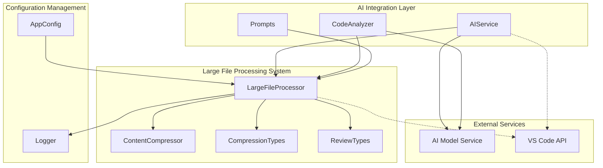
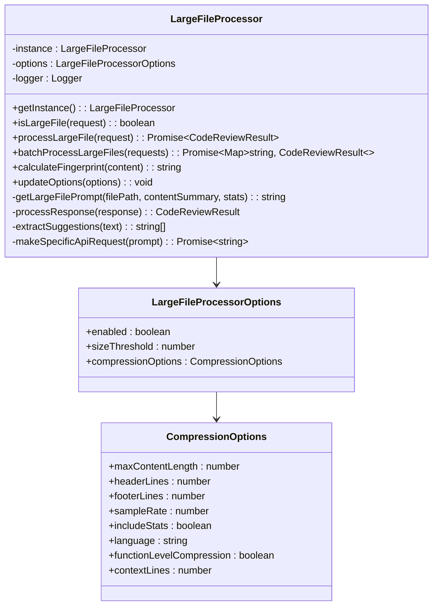
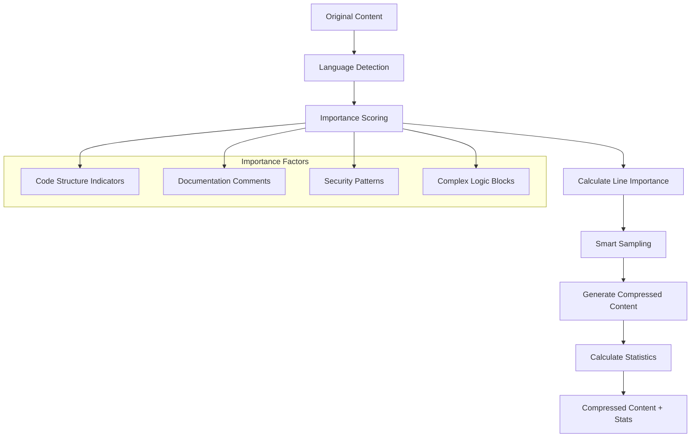
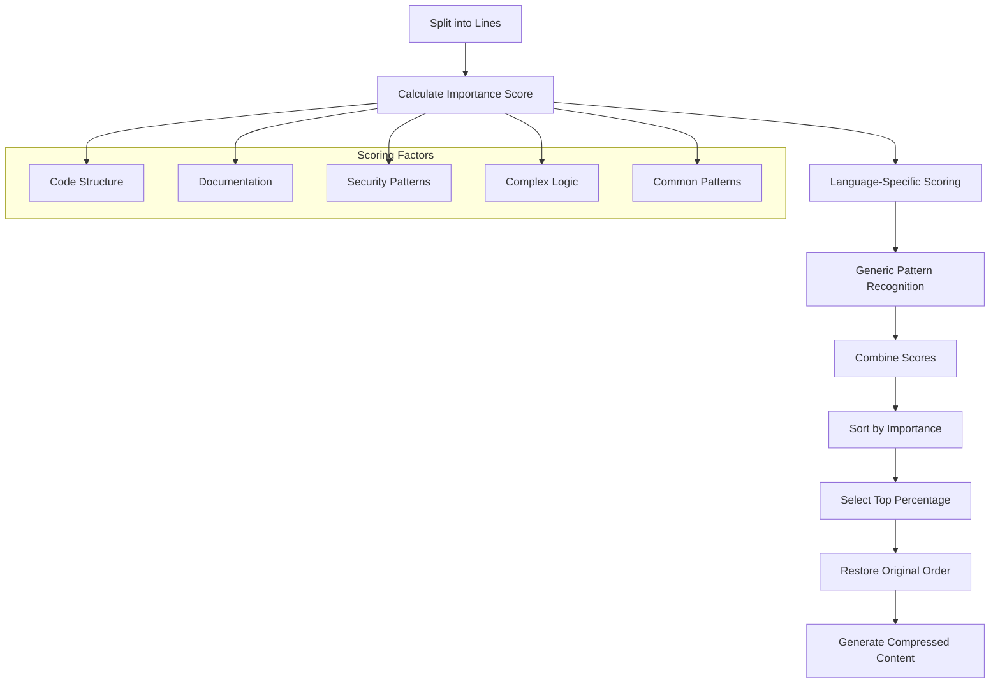
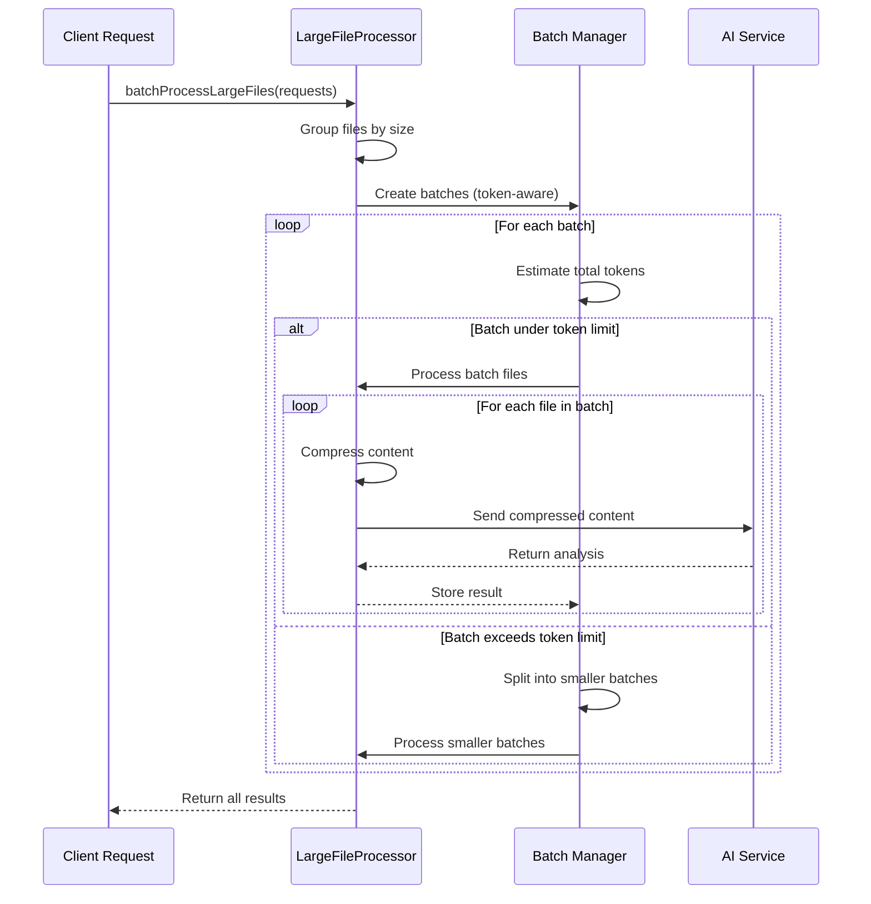
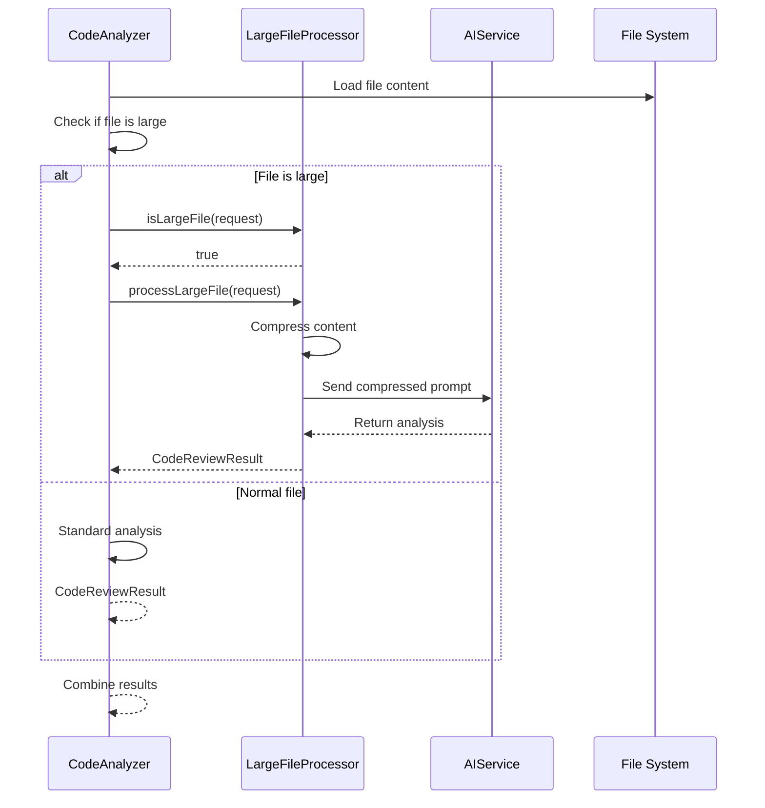
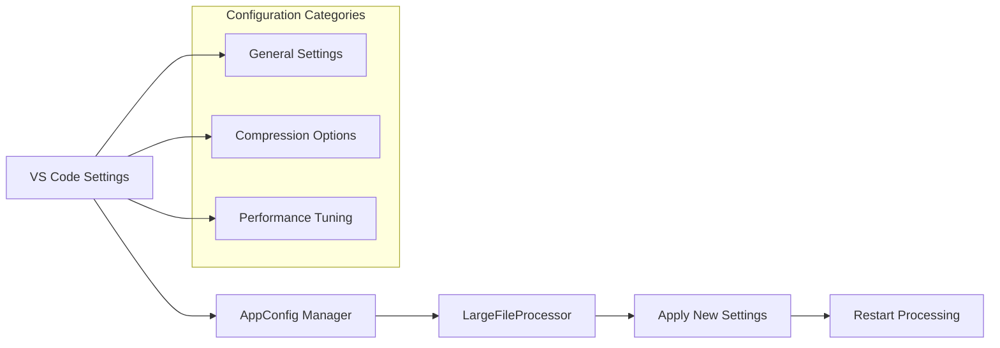
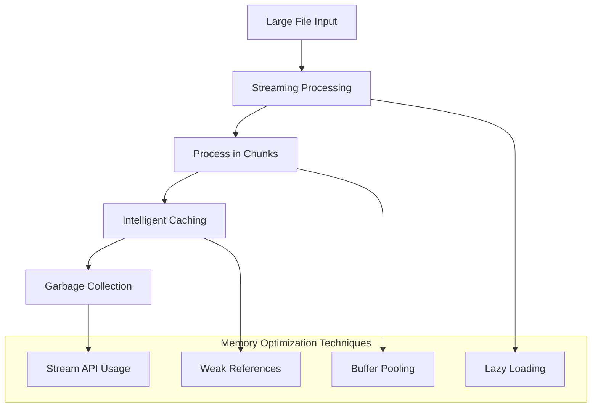
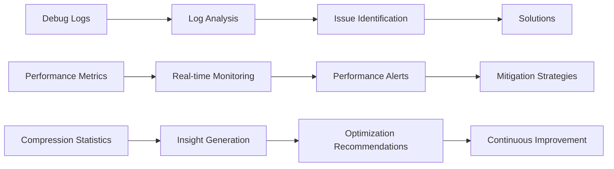

# Large File Processing

<cite>
**Referenced Files in This Document**
- [largeFileProcessor.ts](file://src/core/compression/largeFileProcessor.ts)
- [contentCompressor.ts](file://src/core/compression/contentCompressor.ts)
- [compressionTypes.ts](file://src/core/compression/compressionTypes.ts)
- [reviewTypes.ts](file://src/core/review/reviewTypes.ts)
- [codeAnalyzer.ts](file://src/core/review/codeAnalyzer.ts)
- [aiService.ts](file://src/services/ai/aiService.ts)
- [appConfig.ts](file://src/config/appConfig.ts)
- [prompts.ts](file://src/i18n/en/prompts.ts)
</cite>

## Table of Contents
1. [Introduction](#introduction)
2. [System Architecture](#system-architecture)
3. [Core Components](#core-components)
4. [Compression Strategies](#compression-strategies)
5. [Batch Processing Mechanism](#batch-processing-mechanism)
6. [Integration with Review Workflow](#integration-with-review-workflow)
7. [Configuration and Tuning](#configuration-and-tuning)
8. [Real-World Use Cases](#real-world-use-cases)
9. [Performance Optimization](#performance-optimization)
10. [Troubleshooting Guide](#troubleshooting-guide)
11. [Best Practices](#best-practices)

## Introduction

The Large File Processing subsystem in CodeKarmic is a sophisticated framework designed to handle files that exceed AI model token limits during code review. This system employs intelligent compression and summarization techniques to make large files manageable for AI analysis while preserving essential information for thorough code review.

The subsystem addresses several critical challenges:
- **Token Limit Management**: Prevents AI model overload by compressing content before analysis
- **Quality Preservation**: Maintains code structure and important patterns during compression
- **Performance Optimization**: Enables efficient batch processing of multiple large files
- **Error Resilience**: Handles failures gracefully while maintaining review quality
- **Scalability**: Supports processing of thousands of files in various sizes

## System Architecture

The Large File Processing subsystem follows a modular architecture with clear separation of concerns:



**Diagram sources**
- [largeFileProcessor.ts](file://src/core/compression/largeFileProcessor.ts#L23-L42)
- [contentCompressor.ts](file://src/core/compression/contentCompressor.ts#L13-L20)
- [aiService.ts](file://src/services/ai/aiService.ts#L48-L65)

**Section sources**
- [largeFileProcessor.ts](file://src/core/compression/largeFileProcessor.ts#L1-L242)
- [contentCompressor.ts](file://src/core/compression/contentCompressor.ts#L1-L414)

## Core Components

### LargeFileProcessor Class

The `LargeFileProcessor` serves as the central orchestrator for large file handling, implementing a singleton pattern for consistent configuration and state management.



**Diagram sources**
- [largeFileProcessor.ts](file://src/core/compression/largeFileProcessor.ts#L23-L42)
- [compressionTypes.ts](file://src/core/compression/compressionTypes.ts#L64-L87)

### ContentCompressor Module

The `ContentCompressor` provides intelligent content compression using semantic analysis to preserve important code structures while reducing file size.



**Diagram sources**
- [contentCompressor.ts](file://src/core/compression/contentCompressor.ts#L18-L231)

**Section sources**
- [largeFileProcessor.ts](file://src/core/compression/largeFileProcessor.ts#L23-L242)
- [contentCompressor.ts](file://src/core/compression/contentCompressor.ts#L13-L414)

## Compression Strategies

The system implements three primary compression strategies, each optimized for different scenarios:

### Header/Footer Preservation Strategy

This strategy maintains the beginning and end sections of files while intelligently compressing the middle content:

| Strategy Component | Purpose | Configuration |
|-------------------|---------|---------------|
| **Header Lines** | Preserve file metadata, imports, and setup code | Configurable (default: 30 lines) |
| **Footer Lines** | Maintain closing statements, exports, and cleanup | Configurable (default: 20 lines) |
| **Middle Section** | Intelligent sampling of important content | Smart algorithm with importance scoring |

### Intelligent Sampling Algorithm

The compression engine uses a sophisticated scoring system to determine which lines to preserve:



**Diagram sources**
- [contentCompressor.ts](file://src/core/compression/contentCompressor.ts#L57-L172)

### Language-Aware Compression

The system adapts compression strategies based on detected programming languages:

| Language Family | Special Considerations | Preserved Patterns |
|----------------|----------------------|-------------------|
| **JavaScript/TypeScript** | React components, hooks, JSX elements | Function definitions, class declarations, import/export statements |
| **Python** | Decorators, docstrings, special methods | Function/class definitions, import statements, docstring preservation |
| **Java/Kotlin** | Annotations, generics, visibility modifiers | Class/interface definitions, method signatures, annotation preservation |
| **C/C++** | Preprocessor directives, templates | Include guards, function prototypes, template definitions |
| **CSS/SASS** | Selectors, media queries, variables | Selector patterns, property-value pairs, mixin definitions |

**Section sources**
- [contentCompressor.ts](file://src/core/compression/contentCompressor.ts#L240-L279)
- [contentCompressor.ts](file://src/core/compression/contentCompressor.ts#L56-L172)

## Batch Processing Mechanism

The batch processing system efficiently handles multiple large files by grouping them based on token estimates and processing them in parallel batches.

### Token-Based Batching Strategy



**Diagram sources**
- [largeFileProcessor.ts](file://src/core/compression/largeFileProcessor.ts#L159-L225)

### Error Resilience Mechanism

The batch processing system implements comprehensive error handling to ensure that individual file failures don't compromise the entire batch:

| Error Scenario | Handling Strategy | Recovery Action |
|---------------|------------------|-----------------|
| **AI Service Timeout** | Retry with exponential backoff | Skip problematic file, continue with others |
| **Memory Overflow** | Reduce batch size dynamically | Split batch into smaller chunks |
| **Invalid Content** | Fallback compression strategy | Use basic truncation instead of smart sampling |
| **Network Issues** | Circuit breaker pattern | Pause processing, retry later with delay |

**Section sources**
- [largeFileProcessor.ts](file://src/core/compression/largeFileProcessor.ts#L159-L225)

## Integration with Review Workflow

The Large File Processing subsystem seamlessly integrates with CodeKarmic's overall review workflow through multiple integration points:

### CodeAnalyzer Integration



**Diagram sources**
- [codeAnalyzer.ts](file://src/core/review/codeAnalyzer.ts#L46-L49)
- [largeFileProcessor.ts](file://src/core/compression/largeFileProcessor.ts#L55-L81)

### AIService Batch Processing

The AI service coordinates between normal file processing and large file processing:

```mermaid
flowchart TD
Requests[Multiple File Requests] --> Categorize[Categorize by Size]
Categorize --> LargeFiles[Large Files (>20KB)]
Categorize --> NormalFiles[Normal Files]
LargeFiles --> LFP[LargeFileProcessor]
LFP --> BatchProcess[Batch Process Large Files]
NormalFiles --> TokenEstimate[Estimate Tokens]
TokenEstimate --> BatchGroup[Group into Batches]
BatchGroup --> ParallelProcess[Parallel Processing]
BatchProcess --> Results[Results Map]
ParallelProcess --> Results
Results --> FinalMerge[Merge All Results]
```

**Diagram sources**
- [aiService.ts](file://src/services/ai/aiService.ts#L439-L467)

**Section sources**
- [codeAnalyzer.ts](file://src/core/review/codeAnalyzer.ts#L35-L90)
- [aiService.ts](file://src/services/ai/aiService.ts#L439-L467)

## Configuration and Tuning

### Default Configuration Settings

The system provides extensive configuration options for fine-tuning compression behavior:

| Configuration Parameter | Default Value | Description | Impact on Performance |
|------------------------|---------------|-------------|---------------------|
| **maxContentLength** | 20,000 chars | Maximum uncompressed content before compression | Higher values reduce compression frequency |
| **headerLines** | 30 lines | Number of lines preserved at file start | More header lines improve context |
| **footerLines** | 20 lines | Number of lines preserved at file end | More footer lines preserve cleanup code |
| **sampleRate** | 0.2 (20%) | Percentage of middle content to sample | Higher rates preserve more content |
| **sizeThreshold** | 20,000 chars | File size triggering large file processing | Lower thresholds trigger earlier compression |
| **TOKENS_PER_CHAR** | 0.25 | Estimated tokens per character | Affects batch sizing calculations |

### Dynamic Configuration Updates

The system supports runtime configuration updates through the AppConfig system:



**Diagram sources**
- [appConfig.ts](file://src/config/appConfig.ts#L50-L88)

**Section sources**
- [compressionTypes.ts](file://src/core/compression/compressionTypes.ts#L32-L87)
- [largeFileProcessor.ts](file://src/core/compression/largeFileProcessor.ts#L227-L241)

## Real-World Use Cases

### Minified JavaScript Files

Processing highly compressed JavaScript files presents unique challenges:

**Before Compression:**
- File size: 500,000+ characters
- No whitespace or comments
- Single-line function definitions
- Complex nested structures

**After Compression:**
- Retained function signatures and structure
- Preserved import/export patterns
- Maintained class and interface definitions
- Reduced to ~20% of original size

### Massive Log Files

Log files often contain repetitive patterns that can be effectively summarized:

**Use Case Characteristics:**
- High volume of repetitive entries
- Structured timestamp patterns
- Error message templates
- Performance metrics

**Compression Strategy:**
- Preserve header with metadata and configuration
- Sample representative error patterns
- Maintain footer with summary statistics
- Include statistical indicators for trends

### Generated Code Files

Automatically generated code benefits from structural preservation:

**Generated Code Patterns:**
- Template-based function definitions
- Auto-generated serialization methods
- Boilerplate exception handling
- Metadata annotations

**Preservation Priority:**
1. Core business logic patterns
2. Interface definitions and contracts
3. Configuration and setup code
4. Cleanup and resource management

**Section sources**
- [contentCompressor.ts](file://src/core/compression/contentCompressor.ts#L56-L172)
- [prompts.ts](file://src/i18n/en/prompts.ts#L74-L90)

## Performance Optimization

### Memory Management

The system implements several memory optimization strategies:



### Processing Speed Optimizations

| Optimization Technique | Performance Gain | Trade-off |
|-----------------------|------------------|-----------|
| **Parallel Batch Processing** | 3-5x faster | Higher memory usage |
| **Intelligent Caching** | 2-3x faster for repeated files | Increased memory consumption |
| **Language-Specific Heuristics** | 15-25% faster parsing | Additional computation overhead |
| **Token Estimation Accuracy** | Better batch utilization | Initial estimation cost |

### Scalability Considerations

The system scales effectively with multiple concurrent processing strategies:

- **Horizontal Scaling**: Multiple AI service instances
- **Vertical Scaling**: Optimized memory and CPU usage
- **Adaptive Batching**: Dynamic batch size adjustment
- **Priority Queuing**: Critical files processed first

**Section sources**
- [largeFileProcessor.ts](file://src/core/compression/largeFileProcessor.ts#L159-L225)
- [aiService.ts](file://src/services/ai/aiService.ts#L439-L552)

## Troubleshooting Guide

### Common Issues and Solutions

#### Incomplete Summaries

**Symptoms:**
- AI analysis missing important code patterns
- Insufficient coverage of file structure
- Missing critical functionality details

**Diagnosis Steps:**
1. Check compression statistics in logs
2. Verify sample rate configuration
3. Review language detection accuracy
4. Examine file structure complexity

**Solutions:**
- Increase `sampleRate` from 0.2 to 0.3 or higher
- Enable `functionLevelCompression` for complex files
- Adjust `headerLines` and `footerLines` for better context
- Use manual compression for critical files

#### Excessive Processing Time

**Symptoms:**
- Files taking minutes to process
- Memory usage spikes during compression
- Timeout errors in AI service

**Diagnosis Steps:**
1. Monitor batch sizes and token counts
2. Check file complexity metrics
3. Analyze compression ratios
4. Review system resource availability

**Solutions:**
- Reduce `maxContentLength` threshold
- Implement progressive compression stages
- Add processing time limits
- Use fallback compression strategies

#### AI Model Overload

**Symptoms:**
- Token limit exceeded errors
- Model timeouts or failures
- Poor quality responses

**Diagnosis Steps:**
1. Calculate estimated tokens per file
2. Monitor batch token distribution
3. Check AI model capabilities
4. Analyze compression effectiveness

**Solutions:**
- Decrease `TOKENS_PER_CHAR` estimate
- Implement adaptive compression
- Use model-specific optimizations
- Add preprocessing validation

### Debugging Tools and Techniques

The system provides comprehensive logging and monitoring capabilities:



**Section sources**
- [largeFileProcessor.ts](file://src/core/compression/largeFileProcessor.ts#L60-L81)
- [contentCompressor.ts](file://src/core/compression/contentCompressor.ts#L200-L231)

## Best Practices

### Configuration Guidelines

#### Optimal Threshold Settings

| File Type | Recommended Threshold | Rationale |
|-----------|----------------------|-----------|
| **Configuration Files** | 10,000 chars | Small files benefit from compression |
| **Source Code** | 20,000 chars | Balance between quality and performance |
| **Generated Code** | 50,000 chars | Complex structures need more context |
| **Test Suites** | 15,000 chars | Test logic varies greatly in complexity |

#### Compression Strategy Selection

**High-Priority Files:**
- Critical business logic modules
- Security-sensitive code
- Performance-critical components
- Legacy system integrations

**Standard Files:**
- Regular business logic
- Utility functions
- Standard library wrappers
- Documentation files

**Low-Priority Files:**
- Temporary build artifacts
- Generated temporary code
- Debug/test configurations
- Third-party integration stubs

### Performance Tuning

#### Batch Processing Optimization

1. **Dynamic Batch Sizing**: Adjust batch sizes based on file complexity
2. **Priority Queuing**: Process critical files first
3. **Resource Monitoring**: Track memory and CPU usage
4. **Progressive Processing**: Break down extremely large files

#### Memory Management

1. **Streaming Processing**: Process files in chunks
2. **Intelligent Caching**: Cache frequently accessed compressed versions
3. **Garbage Collection**: Regular cleanup of unused resources
4. **Memory Profiling**: Monitor memory usage patterns

### Quality Assurance

#### Compression Effectiveness Validation

1. **Content Integrity Checks**: Verify preserved code compiles/runs
2. **Pattern Recognition Testing**: Ensure important patterns remain visible
3. **Statistical Analysis**: Monitor compression ratios and quality metrics
4. **Human Review Validation**: Periodic manual review of compressed content

#### Continuous Improvement

1. **Performance Metrics**: Track processing times and success rates
2. **Quality Feedback**: Collect user feedback on compression quality
3. **Algorithm Refinement**: Continuously improve scoring algorithms
4. **Configuration Optimization**: Adapt settings based on usage patterns

**Section sources**
- [compressionTypes.ts](file://src/core/compression/compressionTypes.ts#L32-L87)
- [largeFileProcessor.ts](file://src/core/compression/largeFileProcessor.ts#L227-L241)