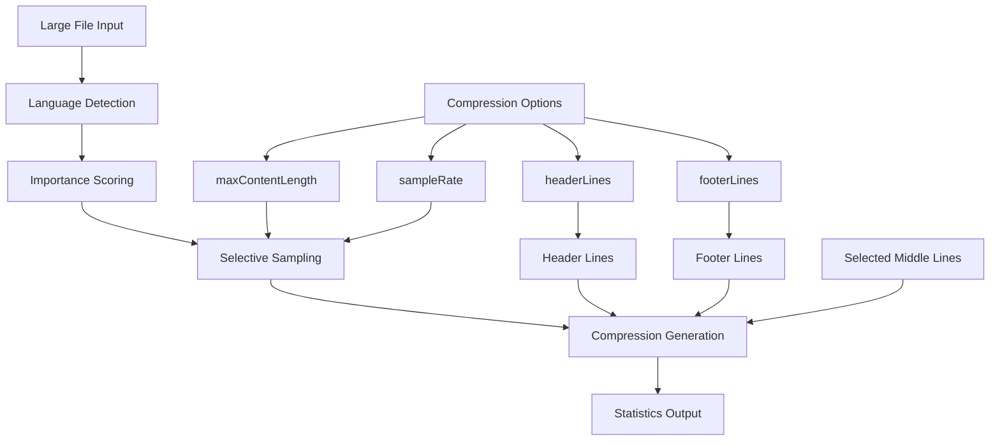
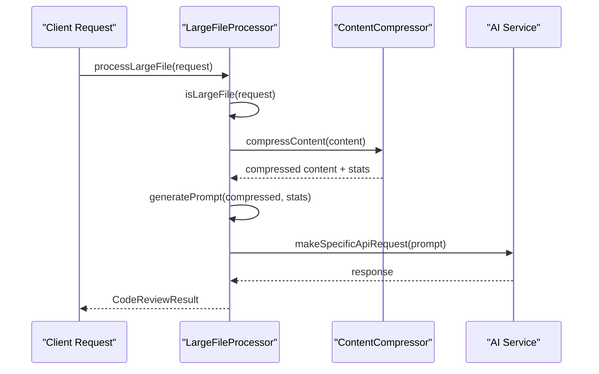
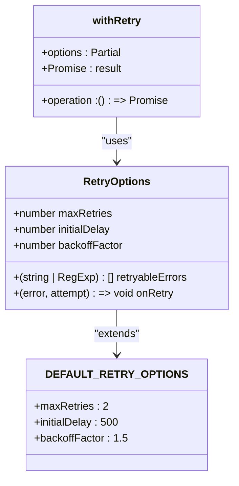
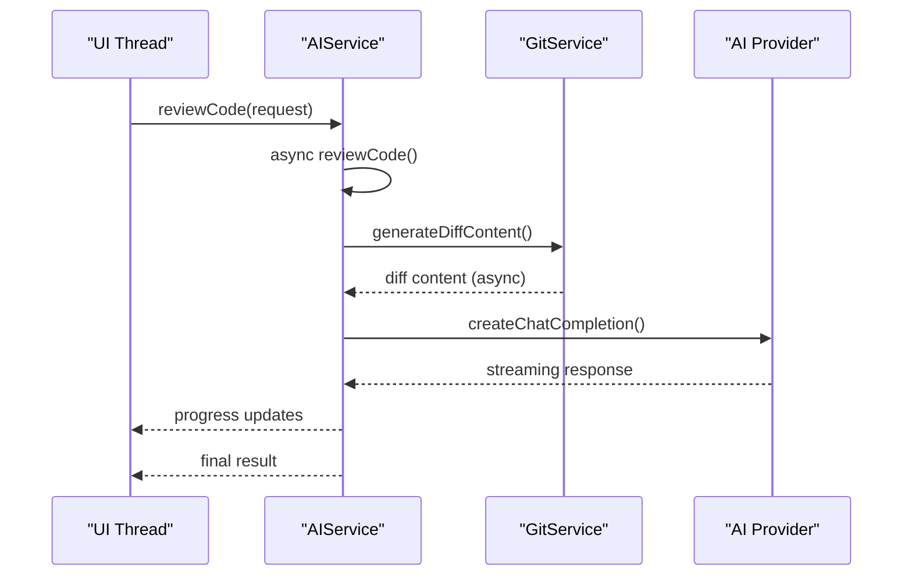
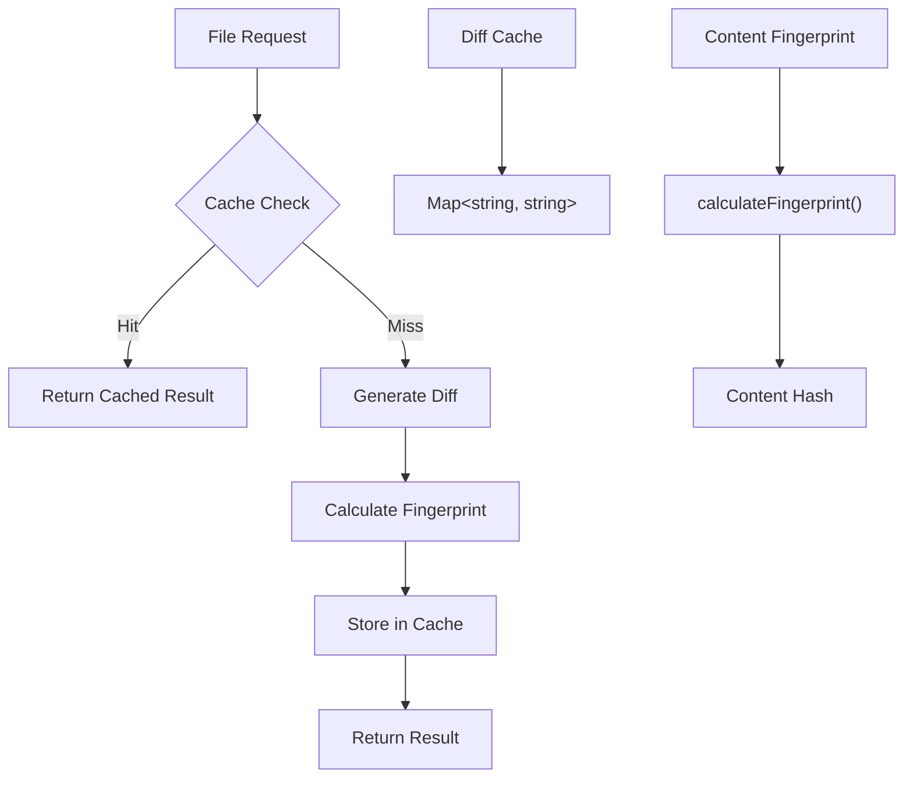
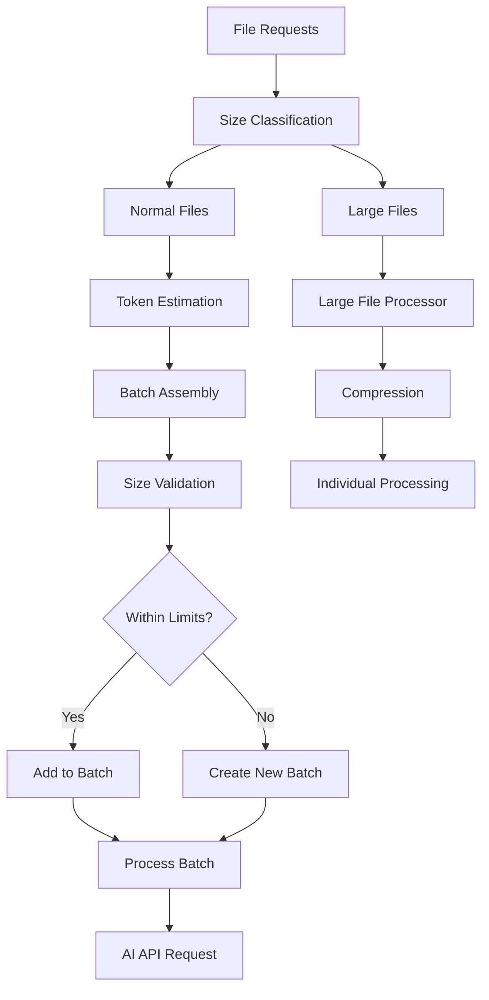
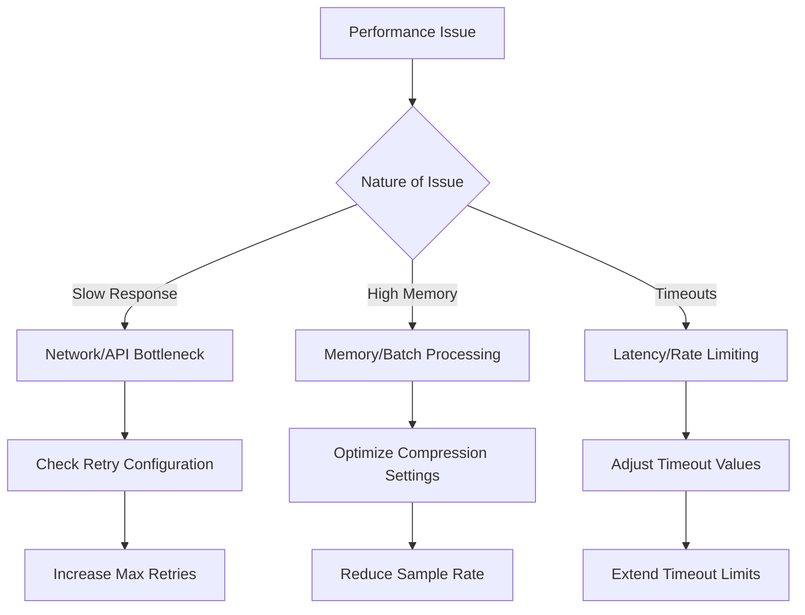

# Performance Optimization

<cite>
**Referenced Files in This Document**
- [retryUtils.ts](file://src/utils/retryUtils.ts)
- [aiService.ts](file://src/services/ai/aiService.ts)
- [contentCompressor.ts](file://src/core/compression/contentCompressor.ts)
- [largeFileProcessor.ts](file://src/core/compression/largeFileProcessor.ts)
- [compressionTypes.ts](file://src/core/compression/compressionTypes.ts)
- [appConfig.ts](file://src/config/appConfig.ts)
- [gitService.ts](file://src/services/git/gitService.ts)
- [deepseek.ts](file://src/models/providers/deepseek.ts)
- [baseModel.ts](file://src/models/baseModel.ts)
</cite>

## Table of Contents
1. [Introduction](#introduction)
2. [Content Compression Strategies](#content-compression-strategies)
3. [Exponential Backoff Retry Mechanisms](#exponential-backoff-retry-mechanisms)
4. [Async Execution Patterns](#async-execution-patterns)
5. [Caching and Diff Parsing Optimization](#caching-and-diff-parsing-optimization)
6. [Batch Processing and Token Management](#batch-processing-and-token-management)
7. [Performance Monitoring and Metrics](#performance-monitoring-and-metrics)
8. [Best Practices and Tuning Guidelines](#best-practices-and-tuning-guidelines)
9. [Common Performance Bottlenecks](#common-performance-bottlenecks)
10. [Troubleshooting Guide](#troubleshooting-guide)

## Introduction

CodeKarmic implements a comprehensive performance optimization framework designed to handle large-scale code review operations efficiently. The system employs multiple strategies including content compression, intelligent retry mechanisms, asynchronous execution patterns, and sophisticated caching systems to minimize computational overhead and improve AI processing speed.

The performance optimization architecture focuses on three core areas:
- **Token Load Reduction**: Through intelligent content compression and selective sampling
- **Network Resilience**: Via exponential backoff retry mechanisms with configurable parameters
- **Resource Efficiency**: Through async execution patterns and batch processing optimizations

## Content Compression Strategies

### Intelligent Content Compression

CodeKarmic implements a sophisticated content compression system that intelligently reduces token load while preserving critical code information.



**Diagram sources**
- [contentCompressor.ts](file://src/core/compression/contentCompressor.ts#L18-L231)
- [compressionTypes.ts](file://src/core/compression/compressionTypes.ts#L10-L41)

### Compression Implementation Details

The compression system operates through several key mechanisms:

#### 1. Semantic Analysis and Importance Scoring
The system assigns importance scores to code lines based on multiple factors:

- **Language-Specific Patterns**: Different scoring weights for various programming languages
- **Code Structure Indicators**: Functions, classes, imports, and declarations receive higher scores
- **Documentation Comments**: Comments containing TODO, FIXME, or REVIEW markers are prioritized
- **Security Patterns**: Code related to authentication, encryption, and access control receives elevated importance

#### 2. Intelligent Sampling Algorithm
The system uses a weighted sampling approach:

```typescript
// Example sampling logic from contentCompressor.ts
const scoredLines = middleLines.map((line, index) => ({
    line,
    index: middleStartIndex + index,
    score: importanceScore(line),
}));

// Sort by importance score (highest first)
scoredLines.sort((a, b) => b.score - a.score);

// Select top percentage based on sample rate
const samplesToTake = Math.ceil(middleLines.length * opts.sampleRate);
const selectedLines = scoredLines.slice(0, samplesToTake);
```

#### 3. Compression Statistics and Monitoring
Each compression operation generates detailed statistics:

| Metric | Description | Purpose |
|--------|-------------|---------|
| `originalSize` | Original file size in characters | Performance baseline |
| `compressedSize` | Compressed file size in characters | Compression effectiveness |
| `compressionRatio` | Compressed/Original ratio | Efficiency measurement |
| `lineRetentionRate` | Percentage of lines retained | Quality assurance |
| `totalLines` | Original line count | Processing complexity |
| `keptLines` | Retained line count | Final content size |

**Section sources**
- [contentCompressor.ts](file://src/core/compression/contentCompressor.ts#L18-L231)
- [compressionTypes.ts](file://src/core/compression/compressionTypes.ts#L46-L58)

### Large File Processing

For files exceeding size thresholds, CodeKarmic employs specialized large file processing:



**Diagram sources**
- [largeFileProcessor.ts](file://src/core/compression/largeFileProcessor.ts#L55-L80)
- [aiService.ts](file://src/services/ai/aiService.ts#L413-L424)

**Section sources**
- [largeFileProcessor.ts](file://src/core/compression/largeFileProcessor.ts#L23-L242)
- [compressionTypes.ts](file://src/core/compression/compressionTypes.ts#L64-L87)

## Exponential Backoff Retry Mechanisms

### Retry Configuration System

CodeKarmic implements a flexible retry mechanism with configurable parameters for handling transient failures gracefully.



**Diagram sources**
- [retryUtils.ts](file://src/utils/retryUtils.ts#L8-L23)

### Retry Implementation Details

#### 1. Exponential Backoff Algorithm
The retry mechanism implements exponential backoff with the formula:

```
delay = initialDelay × backoffFactor^(attempt - 1)
```

Current default configuration:
- **Max Retries**: 2 attempts (reduced from standard 3-5)
- **Initial Delay**: 500ms (reduced from standard 1000ms)
- **Backoff Factor**: 1.5 (lowered from 2.0 for faster recovery)

#### 2. Error Pattern Matching
The system supports both string literals and regular expressions for error matching:

```typescript
// Network-related errors
const NETWORK_RETRYABLE_ERRORS = [
    'ECONNRESET', 'ETIMEDOUT', 'ESOCKETTIMEDOUT',
    'socket hang up', 'network error', 'timeout',
    /^5\d\d$/, // 500-level status codes
    'rate limit', 'too many requests', 'Service Unavailable'
];

// API-specific errors
const API_RETRYABLE_ERRORS = [...NETWORK_RETRYABLE_ERRORS, 'internal server error', 'backend error'];
```

#### 3. Integration with AI Services
The retry mechanism is seamlessly integrated with AI service calls:

```typescript
// Example integration from deepseek.ts
protected override async retryOperation(operation: () => Promise<any>): Promise<any> {
    try {
        return await withRetry(operation, {
            retryableErrors: API_RETRYABLE_ERRORS,
            onRetry: (error, attempt) => {
                console.log(`API request retry attempt ${attempt}:`, error);
            }
        });
    } catch (error) {
        console.error('API request failed:', error);
        throw new Error(`API request failed: ${error instanceof Error ? error.message : String(error)}`);
    }
}
```

**Section sources**
- [retryUtils.ts](file://src/utils/retryUtils.ts#L33-L70)
- [retryUtils.ts](file://src/utils/retryUtils.ts#L95-L116)
- [deepseek.ts](file://src/models/providers/deepseek.ts#L198-L210)

## Async Execution Patterns

### Non-Blocking Operations

CodeKarmic employs sophisticated async execution patterns to ensure non-blocking operations and efficient resource utilization.



**Diagram sources**
- [aiService.ts](file://src/services/ai/aiService.ts#L75-L118)
- [aiService.ts](file://src/services/ai/aiService.ts#L125-L239)

### Stream Processing Implementation

The system implements streaming output for real-time progress feedback:

```typescript
// Streaming configuration from aiService.ts
const modelRequestOptions: ModelRequestOptions = {
    maxTokens: options.maxTokens || 4000,
    temperature: 0.1,
    stream: true,  // Enable streaming output
    timeoutMs: 180000, // 3-minute timeout
};

// Progress monitoring during streaming
if (useStreaming) {
    notificationManager.updateStatusBar('AI分析中...', '流式响应处理中', 'sync~spin');
}
```

### Concurrent Processing Patterns

#### 1. Parallel File Processing
Large file processing supports concurrent batch operations:

```typescript
// Batch processing with token estimation
for (const request of requests) {
    const { compressed } = compressContent(request.currentContent, options);
    const estimatedTokens = compressed.length * TOKENS_PER_CHAR;
    
    if (currentBatchSize + estimatedTokens > MAX_BATCH_TOKENS) {
        // Create new batch
        currentBatchIndex++;
        batches[currentBatchIndex] = [];
        currentBatchSize = 0;
    }
    
    batches[currentBatchIndex].push(request);
    currentBatchSize += estimatedTokens;
}
```

#### 2. Git Operation Optimization
Multiple Git operations are optimized for performance:

- **VS Code Git Extension Fallback**: Prioritizes VS Code's native Git API for speed
- **Multi-Method Fallback**: Implements fallback strategies for Git operations
- **Caching Layer**: Maintains commit caches to avoid redundant operations

**Section sources**
- [aiService.ts](file://src/services/ai/aiService.ts#L260-L356)
- [aiService.ts](file://src/services/ai/aiService.ts#L431-L552)
- [gitService.ts](file://src/services/git/gitService.ts#L369-L399)

## Caching and Diff Parsing Optimization

### Intelligent Caching System

CodeKarmic implements a multi-layered caching system to minimize computational overhead.



**Diagram sources**
- [aiService.ts](file://src/services/ai/aiService.ts#L47-L48)
- [largeFileProcessor.ts](file://src/core/compression/largeFileProcessor.ts#L110-L113)

### Diff Parsing Techniques

#### 1. Multi-Strategy Diff Generation
The system employs multiple strategies for diff generation:

```typescript
// Strategy 1: VS Code Git Extension (Fastest)
if (gitExtension) {
    const api = gitExtension.getAPI(1);
    if (api) {
        const repo = api.repositories[0];
        const diffResult = await repo?.diffWithHEAD?.(uri);
        if (diffResult && typeof diffResult === 'string' && diffResult.length > 10) {
            return diffResult;
        }
    }
}

// Strategy 2: Custom Git Implementation (Fallback)
const diffContent = await this.gitService?.getFileDiff(currentCommit, params.filePath);
```

#### 2. Efficient Diff Caching
The caching system uses intelligent key generation:

```typescript
// Cache key based on file path and content fingerprint
const cacheKey = `${params.filePath}:${this.largeFileProcessor.calculateFingerprint(params.currentContent)}`;

// Store in diff cache
this.diffCache.set(cacheKey, diffContent);
```

#### 3. Simple Diff Generation
As a fallback, the system generates simple diffs for basic comparisons:

```typescript
private generateSimpleDiff(params: CodeReviewRequest): string {
    const diffContent = `--- a/${params.filePath}\n+++ b/${params.filePath}\n`;
    const previousLines = params.previousContent.split('\n');
    const currentLines = params.currentContent.split('\n');
    
    let result = diffContent;
    for (let i = 0; i < Math.max(previousLines.length, currentLines.length); i++) {
        if (i >= previousLines.length) {
            result += `+${currentLines[i]}\n`;
        } else if (i >= currentLines.length) {
            result += `-${previousLines[i]}\n`;
        } else if (previousLines[i] !== currentLines[i]) {
            result += `-${previousLines[i]}\n+${currentLines[i]}\n`;
        }
    }
    return result;
}
```

**Section sources**
- [aiService.ts](file://src/services/ai/aiService.ts#L125-L239)
- [aiService.ts](file://src/services/ai/aiService.ts#L242-L258)
- [largeFileProcessor.ts](file://src/core/compression/largeFileProcessor.ts#L108-L113)

## Batch Processing and Token Management

### Intelligent Batch Sizing

CodeKarmic implements sophisticated batch processing with dynamic token management to optimize AI API usage.



**Diagram sources**
- [aiService.ts](file://src/services/ai/aiService.ts#L431-L552)
- [largeFileProcessor.ts](file://src/core/compression/largeFileProcessor.ts#L159-L224)

### Token Management Strategies

#### 1. Dynamic Batch Sizing
The system calculates optimal batch sizes based on token estimates:

```typescript
// Token estimation constants
const TOKENS_PER_CHAR = 0.25; // Estimated tokens per character
const MAX_BATCH_TOKENS = 4000; // Maximum tokens per batch

// Dynamic batch assembly
for (const request of requests) {
    const fileSize = request.currentContent.length;
    const estimatedTokens = fileSize * TOKENS_PER_CHAR;
    
    if (currentBatchSize + estimatedTokens > MAX_BATCH_TOKENS) {
        // Create new batch
        fullFileBatches.push(currentBatch);
        currentBatch = [request];
        currentBatchSize = estimatedTokens;
    } else {
        currentBatch.push(request);
        currentBatchSize += estimatedTokens;
    }
}
```

#### 2. Large File Batch Processing
Special handling for large files with compression:

```typescript
// Large file batch processing with token-aware grouping
for (const request of requests) {
    if (!this.isLargeFile(request)) continue;
    
    const { compressed } = compressContent(
        request.currentContent, 
        this.options.compressionOptions
    );
    
    const estimatedTokens = compressed.length * TOKENS_PER_CHAR;
    
    if (currentBatchSize + estimatedTokens > MAX_BATCH_TOKENS) {
        currentBatchIndex++;
        batches[currentBatchIndex] = [];
        currentBatchSize = 0;
    }
    
    batches[currentBatchIndex].push(request);
    currentBatchSize += estimatedTokens;
}
```

#### 3. Response Parsing and Splitting
The system includes sophisticated response splitting for batch processing:

```typescript
private splitBatchResponse(batchResponse: string, filePaths: string[]): string[] {
    const result: string[] = [];
    
    for (let i = 0; i < filePaths.length; i++) {
        const filePath = filePaths[i];
        const fileMarker = `--- FILE: ${filePath} ---`;
        
        const startIdx = batchResponse.indexOf(fileMarker);
        if (startIdx === -1) {
            // Fallback pattern matching
            const patterns = [
                new RegExp(`---\\s*FILE:\\s*${this.escapeRegExp(filePath)}\\s*---([\\s\\S]*?)(?=---\\s*FILE:|$)`, 'i'),
                new RegExp(`File:\\s*${this.escapeRegExp(filePath)}([\\s\\S]*?)(?=File:|$)`, 'i')
            ];
            
            // Try each pattern until match found
            for (const pattern of patterns) {
                const match = batchResponse.match(pattern);
                if (match && match[1]) {
                    fileContent = match[1].trim();
                    break;
                }
            }
        }
        
        result.push(fileContent);
    }
    
    return result;
}
```

**Section sources**
- [aiService.ts](file://src/services/ai/aiService.ts#L431-L552)
- [largeFileProcessor.ts](file://src/core/compression/largeFileProcessor.ts#L159-L224)
- [compressionTypes.ts](file://src/core/compression/compressionTypes.ts#L85-L87)

## Performance Monitoring and Metrics

### Comprehensive Performance Tracking

CodeKarmic implements extensive performance monitoring to track optimization effectiveness and identify bottlenecks.

#### 1. Timing Measurements
The system includes detailed timing measurements:

```typescript
// Performance timing from aiService.ts
console.time('PERF: generateDiffContent - Total');
console.time('PERF: generateDiffContent - Create cache key');
console.time('PERF: generateDiffContent - Check cache');
console.time('PERF: generateDiffContent - Workspace check');
console.time('PERF: generateDiffContent - GitService init');
console.time('PERF: generateDiffContent - VS Code Git API');
console.time('PERF: generateDiffContent - getCommits');
console.time('PERF: generateDiffContent - getFileDiff');

// Completion logging
console.timeEnd('PERF: generateDiffContent - Total');
```

#### 2. Compression Statistics
Detailed compression metrics are tracked:

| Statistic | Calculation | Purpose |
|-----------|-------------|---------|
| Compression Ratio | `compressedSize / originalSize` | Efficiency measurement |
| Line Retention Rate | `keptLines / totalLines` | Quality assurance |
| Processing Time | `endTime - startTime` | Performance tracking |
| Token Savings | `(originalTokens - compressedTokens)` | Optimization impact |

#### 3. Retry Performance Metrics
Retry mechanism performance is monitored:

```typescript
// Retry timing and statistics
const startTime = new Date();
const delay = config.initialDelay * Math.pow(config.backoffFactor, attempt - 1);
await new Promise(resolve => setTimeout(resolve, delay));

// Performance logging
console.log(`API request retry attempt ${attempt}:`, error);
```

**Section sources**
- [aiService.ts](file://src/services/ai/aiService.ts#L125-L239)
- [contentCompressor.ts](file://src/core/compression/contentCompressor.ts#L200-L217)

## Best Practices and Tuning Guidelines

### Retry Parameter Optimization

Based on network conditions and model response times, the following retry configurations are recommended:

#### Conservative Configuration (High Reliability)
```typescript
const CONSERVATIVE_RETRY_OPTIONS: RetryOptions = {
    maxRetries: 3,
    initialDelay: 1000,
    backoffFactor: 2.0,
    retryableErrors: API_RETRYABLE_ERRORS
};
```

#### Aggressive Configuration (Low Latency Networks)
```typescript
const AGGRESSIVE_RETRY_OPTIONS: RetryOptions = {
    maxRetries: 1,
    initialDelay: 200,
    backoffFactor: 1.2,
    retryableErrors: ['timeout', 'ETIMEDOUT']
};
```

#### Adaptive Configuration (Dynamic Adjustment)
```typescript
const ADAPTIVE_RETRY_OPTIONS: RetryOptions = {
    maxRetries: 2,
    initialDelay: 500,
    backoffFactor: 1.5,
    retryableErrors: [
        'timeout',
        'rate limit',
        /^5\d\d$/,
        /network error/,
        /ECONNRESET/
    ],
    onRetry: (error, attempt) => {
        // Dynamic adjustment based on error type
        if (error.includes('rate limit')) {
            // Increase delay for rate limiting
            console.log(`Rate limit detected, increasing delay`);
        }
    }
};
```

### Compression Settings Tuning

#### Small File Optimization (≤ 10KB)
```typescript
const SMALL_FILE_OPTIONS: CompressionOptions = {
    maxContentLength: 10000,
    headerLines: 10,
    footerLines: 10,
    sampleRate: 0.1,
    includeStats: false
};
```

#### Medium File Optimization (10KB - 100KB)
```typescript
const MEDIUM_FILE_OPTIONS: CompressionOptions = {
    maxContentLength: 50000,
    headerLines: 20,
    footerLines: 20,
    sampleRate: 0.2,
    includeStats: true
};
```

#### Large File Optimization (> 100KB)
```typescript
const LARGE_FILE_OPTIONS: CompressionOptions = {
    maxContentLength: 200000,
    headerLines: 30,
    footerLines: 30,
    sampleRate: 0.3,
    includeStats: true,
    functionLevelCompression: true
};
```

### Network Condition Adaptation

#### High Latency Networks
- Increase `initialDelay` to 1000-2000ms
- Reduce `maxRetries` to 1-2
- Use conservative backoff factor (2.0-3.0)

#### Low Latency Networks
- Reduce `initialDelay` to 200-500ms
- Increase `maxRetries` to 3-5
- Use aggressive backoff factor (1.2-1.5)

#### Unstable Networks
- Enable comprehensive error patterns
- Implement exponential backoff with jitter
- Add circuit breaker patterns

## Common Performance Bottlenecks

### 1. Rate Limiting from AI Providers

**Symptoms:**
- Frequent "rate limit exceeded" errors
- Long delays between API calls
- 429 HTTP status codes

**Solutions:**
```typescript
// Implement rate limiting awareness
const API_RETRYABLE_ERRORS = [
    'rate limit',
    'too many requests',
    'Rate limit exceeded',
    '429 Too Many Requests',
    /^4\d\d$/ // All 4xx errors
];

// Add adaptive delay calculation
const calculateAdaptiveDelay = (attempt: number, baseDelay: number) => {
    // Add jitter to prevent thundering herd
    const jitter = Math.random() * 100;
    return baseDelay * Math.pow(2, attempt) + jitter;
};
```

### 2. High-Latency Git Operations

**Symptoms:**
- Slow file diff generation
- Timeout errors in Git operations
- UI freezing during code review

**Solutions:**
```typescript
// Optimize Git operations with timeouts
const GIT_TIMEOUT = 30000; // 30 seconds

// Use VS Code Git API when available
if (gitExtension) {
    const api = gitExtension.getAPI(1);
    if (api) {
        const repo = api.repositories[0];
        const diffResult = await Promise.race([
            repo.diffWithHEAD(uri),
            new Promise((_, reject) => 
                setTimeout(() => reject(new Error('Git operation timeout')), GIT_TIMEOUT)
            )
        ]);
    }
}
```

### 3. Memory Consumption with Large Files

**Symptoms:**
- Out of memory errors
- Slow processing of large files
- High CPU usage

**Solutions:**
```typescript
// Implement streaming processing for large files
const STREAMING_THRESHOLD = 1000000; // 1MB

if (fileContent.length > STREAMING_THRESHOLD) {
    // Process in chunks
    const chunkSize = 100000; // 100KB chunks
    for (let i = 0; i < fileContent.length; i += chunkSize) {
        const chunk = fileContent.substring(i, i + chunkSize);
        await processChunk(chunk);
    }
}
```

### 4. Token Limit Exceeded

**Symptoms:**
- "context_length_exceeded" errors
- Truncated AI responses
- Incomplete code analysis

**Solutions:**
```typescript
// Implement intelligent truncation
const MAX_TOKENS = 4000;
const ESTIMATED_TOKENS_PER_CHAR = 0.25;

const estimateTokens = (text: string) => text.length * ESTIMATED_TOKENS_PER_CHAR;

if (estimateTokens(prompt) > MAX_TOKENS) {
    // Truncate or compress content
    const excessTokens = estimateTokens(prompt) - MAX_TOKENS;
    const charsToRemove = Math.ceil(excessTokens / ESTIMATED_TOKENS_PER_CHAR);
    
    // Remove from the middle to preserve context
    const halfRemove = Math.ceil(charsToRemove / 2);
    const start = Math.max(0, prompt.length / 2 - halfRemove);
    const end = Math.min(prompt.length, prompt.length / 2 + halfRemove);
    
    const truncatedPrompt = prompt.slice(0, start) + prompt.slice(end);
}
```

## Troubleshooting Guide

### Performance Issues Diagnosis

#### Step 1: Identify Bottleneck Type


#### Step 2: Diagnostic Commands

**Enable Debug Logging:**
```typescript
// Set debug level for performance monitoring
Logger.setLevel('debug');

// Monitor compression effectiveness
console.log('Compression Stats:', {
    originalSize: content.length,
    compressedSize: compressedContent.length,
    ratio: compressedContent.length / content.length
});
```

**Monitor Retry Performance:**
```typescript
// Track retry attempts and delays
const retryMetrics = {
    attempts: 0,
    totalDelay: 0,
    errors: []
};

const withRetryMonitoring = async (operation, options) => {
    return withRetry(operation, {
        ...options,
        onRetry: (error, attempt) => {
            retryMetrics.attempts++;
            retryMetrics.errors.push(error.message);
            console.log(`Retry ${attempt}: ${error.message}`);
        }
    });
};
```

#### Step 3: Common Solutions

**Network-Related Issues:**
```typescript
// Enhanced retry with exponential backoff
const ENHANCED_RETRY_OPTIONS: RetryOptions = {
    maxRetries: 5,
    initialDelay: 1000,
    backoffFactor: 2.0,
    retryableErrors: [
        ...API_RETRYABLE_ERRORS,
        /connection refused/,
        /dns resolution/,
        /network unreachable/
    ]
};
```

**Memory-Related Issues:**
```typescript
// Memory-efficient compression
const MEMORY_EFFICIENT_OPTIONS: CompressionOptions = {
    maxContentLength: 50000,
    headerLines: 15,
    footerLines: 15,
    sampleRate: 0.15, // Reduced sampling
    includeStats: false // Disable stats for memory savings
};
```

**Timeout-Related Issues:**
```typescript
// Extended timeout configuration
const EXTENDED_TIMEOUT_OPTIONS = {
    timeoutMs: 300000, // 5 minutes
    maxRetries: 3,
    initialDelay: 1000
};
```

### Performance Optimization Checklist

#### Pre-Implementation
- [ ] Profile baseline performance metrics
- [ ] Identify target optimization goals
- [ ] Establish monitoring infrastructure
- [ ] Define success criteria

#### During Implementation
- [ ] Test compression effectiveness
- [ ] Validate retry mechanism reliability
- [ ] Monitor memory usage patterns
- [ ] Track API rate limiting impacts

#### Post-Implementation
- [ ] Measure performance improvements
- [ ] Validate quality metrics remain acceptable
- [ ] Document configuration changes
- [ ] Update monitoring dashboards

**Section sources**
- [retryUtils.ts](file://src/utils/retryUtils.ts#L8-L23)
- [contentCompressor.ts](file://src/core/compression/contentCompressor.ts#L18-L41)
- [aiService.ts](file://src/services/ai/aiService.ts#L738-L786)