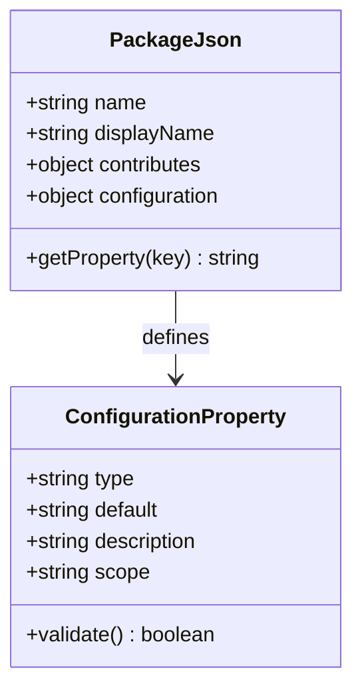
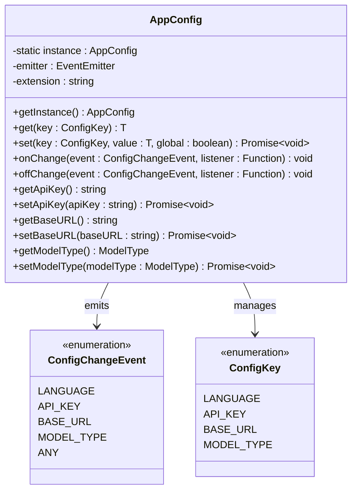
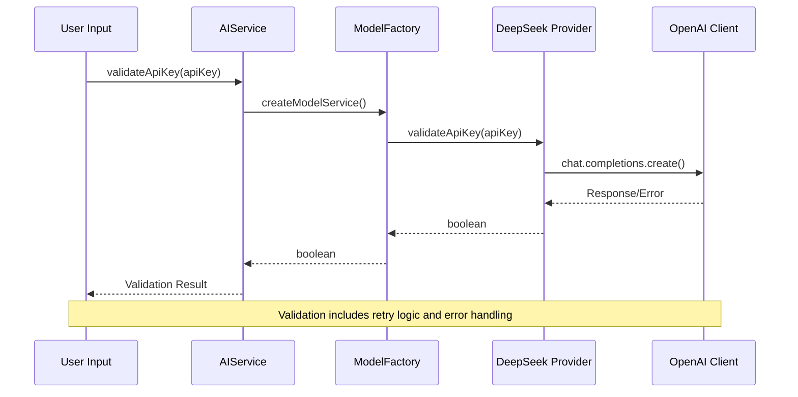
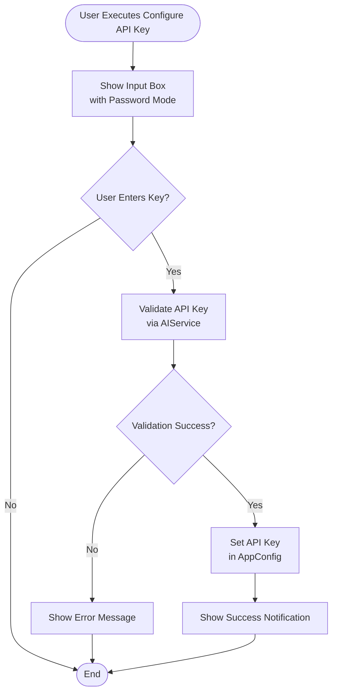
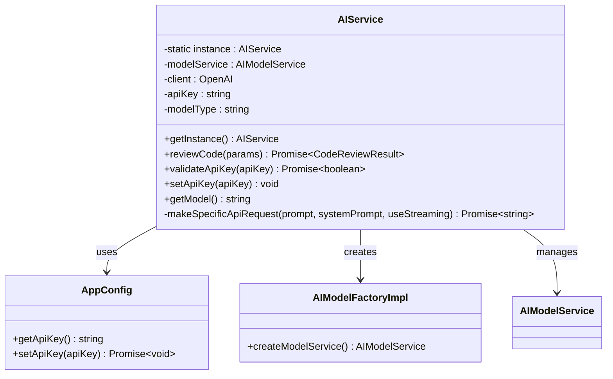
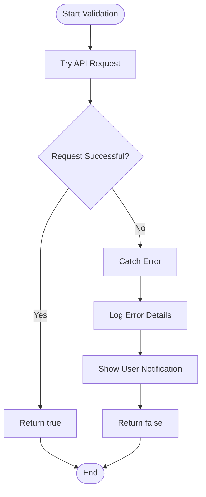

# API Key Management

<cite>
**Referenced Files in This Document**
- [package.json](file://package.json)
- [src/config/appConfig.ts](file://src/config/appConfig.ts)
- [src/services/ai/aiService.ts](file://src/services/ai/aiService.ts)
- [src/models/providers/deepseek.ts](file://src/models/providers/deepseek.ts)
- [src/models/modelFactory.ts](file://src/models/modelFactory.ts)
- [src/extension.ts](file://src/extension.ts)
- [src/i18n/en/ui.ts](file://src/i18n/en/ui.ts)
- [src/i18n/zh/ui.ts](file://src/i18n/zh/ui.ts)
</cite>

## Table of Contents
1. [Introduction](#introduction)
2. [Configuration Property Definition](#configuration-property-definition)
3. [AppConfig Class Architecture](#appconfig-class-architecture)
4. [API Key Validation System](#api-key-validation-system)
5. [Command Implementation](#command-implementation)
6. [Integration with AIService](#integration-with-aiservice)
7. [Security Considerations](#security-considerations)
8. [Error Handling](#error-handling)
9. [User Interface Integration](#user-interface-integration)
10. [Configuration Management](#configuration-management)
11. [Best Practices](#best-practices)

## Introduction

CodeKarmic implements a comprehensive API key management system that securely stores and validates AI service credentials using Visual Studio Code's native configuration system. The system provides seamless integration between user input, configuration persistence, and runtime validation through a centralized architecture built around the `AppConfig` class and event-driven notifications.

The API key management system serves as the foundation for accessing DeepSeek AI services, enabling automated code review capabilities while maintaining security best practices and providing robust error handling mechanisms.

## Configuration Property Definition

The API key configuration is defined in the extension's package.json file under the `codekarmic.apiKey` property, utilizing VS Code's native configuration system for secure storage and management.



**Diagram sources**
- [package.json](file://package.json#L121-L126)

The configuration property exhibits several key characteristics:

- **Type**: String - Ensures proper serialization and validation
- **Default Value**: Empty string - Prevents accidental API usage
- **Description**: "API key for AI service" - Clear user guidance
- **Scope**: Machine - Stores locally on the user's machine
- **Secure Storage**: Leverages VS Code's encrypted configuration system

**Section sources**
- [package.json](file://package.json#L121-L126)

## AppConfig Class Architecture

The `AppConfig` class serves as the central hub for all application configuration management, implementing a singleton pattern with event-driven change notifications for real-time configuration updates.



**Diagram sources**
- [src/config/appConfig.ts](file://src/config/appConfig.ts#L49-L188)

### Singleton Pattern Implementation

The AppConfig class implements a thread-safe singleton pattern ensuring consistent configuration access across the entire application:

```typescript
public static getInstance(): AppConfig {
    if (!AppConfig.instance) {
        AppConfig.instance = new AppConfig();
    }
    return AppConfig.instance;
}
```

### Event-Driven Architecture

The configuration system utilizes Node.js EventEmitter for real-time change notifications:

```typescript
// Listen for configuration changes from VS Code
vscode.workspace.onDidChangeConfiguration(e => {
    if (e.affectsConfiguration(this.extension)) {
        // Determine which settings changed
        const changedKeys: ConfigChangeEvent[] = [];
        
        for (const key of Object.values(ConfigKey)) {
            if (e.affectsConfiguration(`${this.extension}.${key}`)) {
                changedKeys.push(key as unknown as ConfigChangeEvent);
            }
        }
        
        // Emit events for each changed key
        for (const key of changedKeys) {
            this.emitter.emit(key);
        }
    }
});
```

**Section sources**
- [src/config/appConfig.ts](file://src/config/appConfig.ts#L49-L188)

## API Key Validation System

The API key validation system implements a multi-layered approach combining client-side validation with server-side verification to ensure credential security and reliability.



**Diagram sources**
- [src/services/ai/aiService.ts](file://src/services/ai/aiService.ts#L712-L736)
- [src/models/providers/deepseek.ts](file://src/models/providers/deepseek.ts#L47-L80)

### Validation Implementation

The validation process involves multiple steps to ensure API key authenticity:

1. **Client-Side Preparation**: The AIService initiates validation through the model factory
2. **Model Service Creation**: A specialized model service instance is created for validation
3. **Server-Side Verification**: The provider sends a test request to the AI service
4. **Retry Logic**: Built-in retry mechanism handles transient network issues
5. **Result Processing**: Validation outcome is returned to the caller

### Error Handling in Validation

The validation system implements comprehensive error handling:

```typescript
public async validateApiKey(apiKey: string): Promise<boolean> {
    try {
        const modelFactory = AIModelFactoryImpl.getInstance();
        const modelService = modelFactory.createModelService();
        return await modelService.validateApiKey(apiKey);
    } catch (error) {
        const notificationManager = NotificationManager.getInstance();
        const errorDetails = error instanceof Error ? error.message : String(error);
        console.error('API key validation error:', error);
        notificationManager.log(`API key validation failed: ${errorDetails}`, 'error', true);
        return false;
    }
}
```

**Section sources**
- [src/services/ai/aiService.ts](file://src/services/ai/aiService.ts#L712-L736)
- [src/models/providers/deepseek.ts](file://src/models/providers/deepseek.ts#L47-L80)

## Command Implementation

The `codekarmic.configureApiKey` command provides a streamlined user interface for API key configuration through VS Code's command palette and integrated validation.



**Diagram sources**
- [src/extension.ts](file://src/extension.ts#L82-L97)

### Command Registration

The command is registered during extension activation:

```typescript
vscode.commands.registerCommand('codekarmic.configureApiKey', async () => {
    const apiKey = await vscode.window.showInputBox({
        prompt: UI.PLACEHOLDERS.API_KEY,
        password: true
    });
    
    if (apiKey) {
        const isValid = await AIService.getInstance().validateApiKey(apiKey);
        if (isValid) {
            AIService.getInstance().setApiKey(apiKey);
            NotificationManager.getInstance().log(UI.MESSAGES.API_KEY_SUCCESS, 'info', true);
        } else {
            vscode.window.showErrorMessage(UI.MESSAGES.API_KEY_INVALID);
        }
    }
});
```

### Activation-Time Validation

The extension also performs initial API key validation during activation:

```typescript
const config = AppConfig.getInstance();
const apiKey = config.getApiKey();

if (!apiKey) {
    const configureNow = UI.BUTTONS.CONFIGURE_API_KEY;
    const openSettings = UI.BUTTONS.OPEN_SETTINGS;
    vscode.window.showWarningMessage(
        UI.MESSAGES.API_KEY_MISSING,
        configureNow,
        openSettings
    ).then(selection => {
        if (selection === configureNow) {
            // Show input box and validate
        }
    });
}
```

**Section sources**
- [src/extension.ts](file://src/extension.ts#L82-L97)
- [src/extension.ts](file://src/extension.ts#L34-L66)

## Integration with AIService

The AIService class serves as the primary interface between the API key management system and the AI service functionality, providing seamless integration and automatic service initialization.



**Diagram sources**
- [src/services/ai/aiService.ts](file://src/services/ai/aiService.ts#L40-L787)
- [src/config/appConfig.ts](file://src/config/appConfig.ts#L49-L188)

### Automatic Service Initialization

The AIService automatically initializes the model service when an API key becomes available:

```typescript
private constructor() {
    const modelFactory = AIModelFactoryImpl.getInstance();
    const config = AppConfig.getInstance();
    const apiKey = config.getApiKey();
    const modelType = config.getModelType();
    
    // Language configuration
    this.modelType = modelType;
    
    if (apiKey) {
        this.modelService = modelFactory.createModelService();
    }
    
    // Initialize large file handler
    this.largeFileProcessor = LargeFileProcessor.getInstance();
}
```

### API Key Setting Method

The `setApiKey` method provides a unified interface for updating the API key:

```typescript
public setApiKey(apiKey: string): void {
    const config = AppConfig.getInstance();
    config.setApiKey(apiKey);
    
    const modelFactory = AIModelFactoryImpl.getInstance();
    this.modelService = modelFactory.createModelService();
}
```

**Section sources**
- [src/services/ai/aiService.ts](file://src/services/ai/aiService.ts#L40-L787)
- [src/services/ai/aiService.ts](file://src/services/ai/aiService.ts#L726-L732)

## Security Considerations

The API key management system implements multiple security measures to protect sensitive credentials and ensure secure handling throughout the application lifecycle.

### Secure Storage

- **VS Code Encrypted Storage**: API keys are stored using VS Code's built-in encryption
- **Machine Scope**: Keys are scoped to the local machine to prevent accidental sharing
- **Memory Protection**: Keys are not persisted in memory beyond immediate usage

### Transmission Security

- **HTTPS Protocol**: All API communications use encrypted HTTPS connections
- **Timeout Protection**: Requests include timeout mechanisms to prevent hanging
- **Retry Logic**: Built-in retry with exponential backoff for transient failures

### Access Control

- **Singleton Pattern**: Ensures single point of access control
- **Event-Driven Updates**: Real-time propagation of configuration changes
- **Validation Requirements**: All keys must pass validation before acceptance

### Error Handling Security

The system implements secure error handling that prevents credential exposure:

```typescript
// Secure error handling that doesn't expose credentials
catch (error) {
    const errorDetails = error instanceof Error ? error.message : String(error);
    console.error('API key validation error:', error);
    notificationManager.log(`API key validation failed: ${errorDetails}`, 'error', true);
    return false;
}
```

## Error Handling

The API key management system implements comprehensive error handling across all layers, providing meaningful feedback to users while maintaining security and stability.

### Validation Error Handling



**Diagram sources**
- [src/models/providers/deepseek.ts](file://src/models/providers/deepseek.ts#L47-L80)

### Error Categories

The system handles several categories of errors:

1. **Network Errors**: Connection timeouts, DNS resolution failures
2. **Authentication Errors**: Invalid API keys, expired credentials
3. **Rate Limiting**: API quota exceeded, temporary restrictions
4. **Service Unavailable**: Temporary service downtime
5. **Configuration Errors**: Malformed API keys, unsupported formats

### User-Facing Error Messages

The system provides localized error messages through the i18n system:

- **Invalid API Key**: "Invalid API key. Please check your key and try again."
- **Missing API Key**: "API key not configured. Please configure your API key to use code review features."
- **Validation Failure**: "API key validation failed: [error details]"

**Section sources**
- [src/models/providers/deepseek.ts](file://src/models/providers/deepseek.ts#L47-L80)
- [src/services/ai/aiService.ts](file://src/services/ai/aiService.ts#L712-L736)
- [src/i18n/en/ui.ts](file://src/i18n/en/ui.ts#L40-L41)

## User Interface Integration

The API key management system integrates seamlessly with VS Code's user interface through multiple entry points and contextual help.

### Command Palette Integration

The `Configure API Key` command appears in the VS Code command palette, providing easy access to API key configuration:

```json
{
    "command": "codekarmic.configureApiKey",
    "title": "Configure API Key",
    "category": "CodeKarmic",
    "icon": "$(key)"
}
```

### Extension Activation Dialog

During extension activation, users receive contextual guidance when the API key is missing:

```typescript
vscode.window.showWarningMessage(
    UI.MESSAGES.API_KEY_MISSING,
    configureNow,
    openSettings
).then(selection => {
    if (selection === configureNow) {
        // Show input box for API key entry
    } else if (selection === openSettings) {
        vscode.commands.executeCommand('workbench.action.openSettings', 'codekarmic.apiKey');
    }
});
```

### Settings Integration

The API key appears in VS Code's settings UI with appropriate descriptions and validation hints:

```json
"codekarmic.apiKey": {
    "type": "string",
    "default": "",
    "description": "API key for AI service",
    "scope": "machine"
}
```

### Visual Feedback

The system provides immediate visual feedback for API key operations:

- **Success Notifications**: Green confirmation messages
- **Error Notifications**: Red error messages with actionable guidance
- **Progress Indicators**: Loading states during validation
- **Status Bar Integration**: Real-time status updates

**Section sources**
- [package.json](file://package.json#L52-L55)
- [src/extension.ts](file://src/extension.ts#L34-L66)
- [src/i18n/en/ui.ts](file://src/i18n/en/ui.ts#L40-L42)

## Configuration Management

The configuration management system provides flexible APIs for both programmatic and manual configuration updates, supporting various use cases and integration scenarios.

### Programmatic Configuration

```typescript
// Get current API key
const apiKey = AppConfig.getInstance().getApiKey();

// Set new API key
await AppConfig.getInstance().setApiKey('new-api-key');

// Listen for configuration changes
AppConfig.getInstance().onChange(ConfigChangeEvent.API_KEY, () => {
    console.log('API key has changed');
});
```

### Settings.json Integration

Users can manually edit their API key in the settings.json file:

```json
{
    "codekarmic.apiKey": "your-deepseek-api-key-here",
    "codekarmic.modelType": "deepseek-reasoner",
    "codekarmic.debugMode": false
}
```

### Runtime Configuration Updates

The system supports dynamic configuration updates without requiring extension restart:

```typescript
// Change API key programmatically
const config = AppConfig.getInstance();
await config.setApiKey('updated-key');

// Listen for changes
config.onChange(ConfigChangeEvent.API_KEY, () => {
    // Update dependent services
    AIService.getInstance().setApiKey(config.getApiKey());
});
```

### Configuration Defaults

The system maintains sensible defaults for all configuration properties:

```typescript
const CONFIG_DEFAULTS = {
    [ConfigKey.LANGUAGE]: 'ENGLISH',
    [ConfigKey.MODEL_TYPE]: 'deepseek-reasoner',
    [ConfigKey.BASE_URL]: 'https://api.deepseek.com/v1',
    [ConfigKey.API_KEY]: ''
};
```

**Section sources**
- [src/config/appConfig.ts](file://src/config/appConfig.ts#L37-L42)
- [src/config/appConfig.ts](file://src/config/appConfig.ts#L95-L110)

## Best Practices

### API Key Security

1. **Never Hardcode Credentials**: All API keys are stored externally using VS Code's configuration system
2. **Use Machine Scope**: Keys are scoped to the local machine to prevent accidental sharing
3. **Validate Before Use**: All keys undergo validation before being accepted
4. **Secure Transmission**: All communications use encrypted protocols

### Error Handling

1. **Graceful Degradation**: The system continues operating with reduced functionality when API keys are unavailable
2. **Meaningful Messages**: Users receive clear, actionable error messages
3. **Logging**: Comprehensive logging for debugging while avoiding credential exposure
4. **Retry Logic**: Intelligent retry mechanisms handle transient failures

### User Experience

1. **Contextual Guidance**: Users receive appropriate guidance based on their current state
2. **Immediate Feedback**: Configuration changes are immediately reflected throughout the application
3. **Multiple Entry Points**: API key configuration is accessible through multiple UI pathways
4. **Localization**: All user-facing messages are localized for international users

### Performance Optimization

1. **Lazy Initialization**: Services are initialized only when needed
2. **Caching**: Validated API keys are cached to avoid repeated validation
3. **Event-Driven Updates**: Changes propagate efficiently through the system
4. **Resource Management**: Proper cleanup of resources and event listeners

### Integration Patterns

1. **Singleton Pattern**: Consistent access to configuration across the application
2. **Observer Pattern**: Event-driven configuration change notifications
3. **Factory Pattern**: Flexible model service creation based on configuration
4. **Strategy Pattern**: Pluggable validation strategies for different AI providers