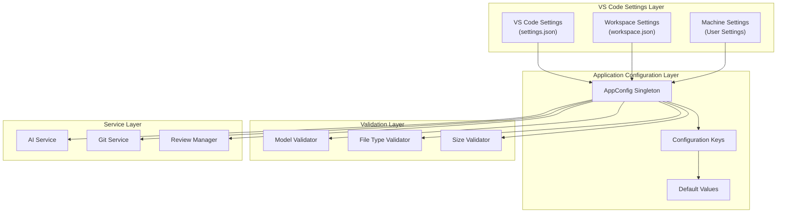
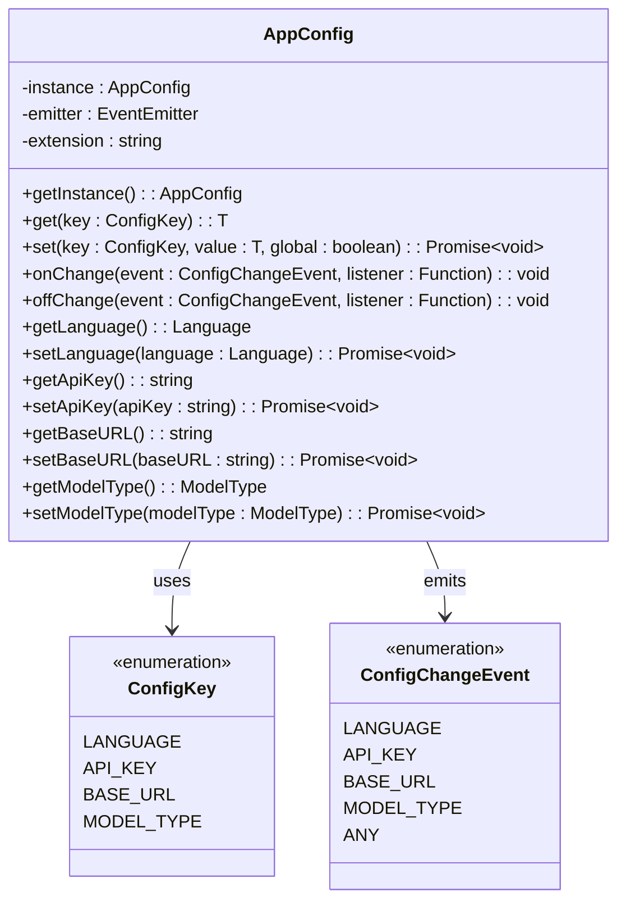
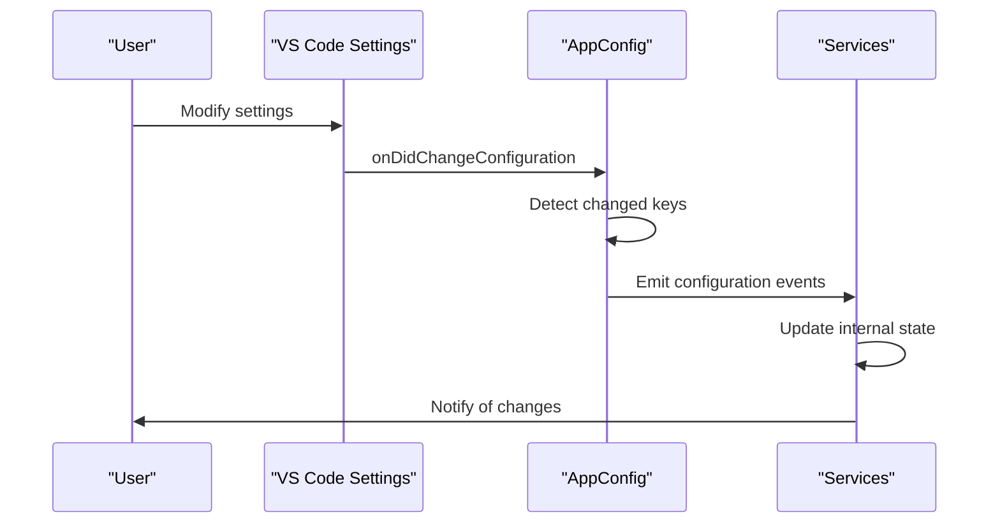

# Configuration Options

<cite>
**Referenced Files in This Document**
- [package.json](file://package.json)
- [src/config/appConfig.ts](file://src/config/appConfig.ts)
- [src/constants/constants.ts](file://src/constants/constants.ts)
- [src/models/types.ts](file://src/models/types.ts)
- [src/models/modelValidator.ts](file://src/models/modelValidator.ts)
- [src/core/compression/compressionTypes.ts](file://src/core/compression/compressionTypes.ts)
- [src/core/compression/largeFileProcessor.ts](file://src/core/compression/largeFileProcessor.ts)
- [src/utils/fileUtils.ts](file://src/utils/fileUtils.ts)
- [src/extension.ts](file://src/extension.ts)
- [src/services/ai/aiService.ts](file://src/services/ai/aiService.ts)
- [src/models/modelFactory.ts](file://src/models/modelFactory.ts)
</cite>

## Table of Contents
1. [Introduction](#introduction)
2. [Configuration Architecture](#configuration-architecture)
3. [Core Configuration Properties](#core-configuration-properties)
4. [Configuration Access and Validation](#configuration-access-and-validation)
5. [Practical Configuration Examples](#practical-configuration-examples)
6. [Best Practices](#best-practices)
7. [Common Misconfigurations and Troubleshooting](#common-misconfigurations-and-troubleshooting)
8. [Advanced Configuration Scenarios](#advanced-configuration-scenarios)

## Introduction

CodeKarmic provides a comprehensive configuration system that allows users to customize the behavior of AI-powered code review functionality. The configuration system is built around VS Code's native settings infrastructure and provides centralized management through the AppConfig singleton pattern. This documentation covers all configurable properties defined in the package.json contributions, their purposes, data types, default values, and scope.

## Configuration Architecture

The configuration system follows a hierarchical structure with multiple layers of abstraction:



**Diagram sources**
- [src/config/appConfig.ts](file://src/config/appConfig.ts#L49-L189)
- [package.json](file://package.json#L118-L207)

**Section sources**
- [src/config/appConfig.ts](file://src/config/appConfig.ts#L49-L189)
- [package.json](file://package.json#L118-L207)

## Core Configuration Properties

### apiKey

| Property | Value |
|----------|-------|
| **Type** | `string` |
| **Default** | `""` (empty string) |
| **Scope** | `machine` |
| **Purpose** | Authentication key for AI service providers |

The `apiKey` property is essential for authenticating with AI services. CodeKarmic supports multiple AI providers including OpenAI, DeepSeek, and others. The extension will prompt users to configure this setting if it's not provided.

**Key Features:**
- Stored securely at machine level
- Validated during startup
- Supports multiple AI providers
- Automatic API key validation

**Section sources**
- [package.json](file://package.json#L121-L125)
- [src/config/appConfig.ts](file://src/config/appConfig.ts#L144-L156)

### modelType

| Property | Value |
|----------|-------|
| **Type** | `string` |
| **Default** | `"deepseek-reasoner"` |
| **Enum Values** | `["deepseek-chat", "deepseek-reasoner", "openai"]` |
| **Scope** | `workspace` |
| **Purpose** | Specifies the AI model to use for code review |

The `modelType` property determines which AI model will handle code review requests. Different models offer varying capabilities and performance characteristics.

**Available Models:**
- **DeepSeek V3 (`deepseek-chat`)**: General-purpose code review with good performance
- **DeepSeek R1 (`deepseek-reasoner`)**: Advanced reasoning capabilities for complex code analysis
- **OpenAI (`openai`)**: OpenAI models (GPT-3.5, GPT-4 variants)

**Section sources**
- [package.json](file://package.json#L132-L136)
- [src/models/types.ts](file://src/models/types.ts#L10-L14)
- [src/config/appConfig.ts](file://src/config/appConfig.ts#L174-L186)

### maxFileSizeKb

| Property | Value |
|----------|-------|
| **Type** | `number` |
| **Default** | `100` |
| **Scope** | `workspace` |
| **Purpose** | Maximum file size in kilobytes for code review |

This setting controls the maximum file size that can be processed in a single code review request. Larger files are automatically handled by the large file processing system.

**Default Behavior:**
- Files smaller than 100KB are processed normally
- Files larger than 100KB trigger compression and batching
- Compression reduces file size while preserving code structure
- Large files are split into manageable chunks for processing

**Section sources**
- [package.json](file://package.json#L143-L147)
- [src/core/compression/compressionTypes.ts](file://src/core/compression/compressionTypes.ts#L75-L80)

### excludeFileTypes

| Property | Value |
|----------|-------|
| **Type** | `array` |
| **Default** | Comprehensive list of binary and build files |
| **Scope** | `workspace` |
| **Purpose** | File patterns to exclude from code review |

The `excludeFileTypes` setting defines file patterns that should be excluded from code review analysis. This helps improve performance by avoiding unnecessary processing of non-code files.

**Default Exclusions:**
- Binary files: `.png`, `.jpg`, `.exe`, `.dll`, `.jar`
- Archive files: `.zip`, `.tar`, `.gz`, `.rar`
- Build artifacts: `node_modules/**`, `dist/**`, `build/**`
- Version control: `.git/**`
- IDE files: `.vscode/**`

**Customization:**
Users can modify this list to include or exclude specific file types based on their project requirements.

**Section sources**
- [package.json](file://package.json#L148-L206)
- [src/utils/fileUtils.ts](file://src/utils/fileUtils.ts#L6-L19)

### debugMode

| Property | Value |
|----------|-------|
| **Type** | `boolean` |
| **Default** | `false` |
| **Scope** | `workspace` |
| **Purpose** | Enable debug logging and verbose output |

When enabled, debug mode provides detailed logging information for troubleshooting and development purposes.

**Features:**
- Enhanced logging output
- Detailed API request/response logs
- Performance metrics collection
- Error stack traces with context

**Section sources**
- [package.json](file://package.json#L127-L131)
- [src/constants/constants.ts](file://src/constants/constants.ts#L8-L33)

### openaiHost

| Property | Value |
|----------|-------|
| **Type** | `string` |
| **Default** | `"https://api.openai.com"` |
| **Scope** | `workspace` |
| **Purpose** | Base URL for OpenAI API endpoints |

This setting specifies the base URL for OpenAI API requests. It's primarily used when connecting to OpenAI-compatible APIs or custom deployments.

**Default Value:** `https://api.openai.com`
**Alternative Hosts:**
- Custom OpenAI-compatible endpoints
- Local development servers
- Enterprise API gateways

**Section sources**
- [package.json](file://package.json#L138-L142)

## Configuration Access and Validation

### AppConfig Singleton Pattern

The AppConfig class implements a singleton pattern to provide centralized configuration access throughout the application:



**Diagram sources**
- [src/config/appConfig.ts](file://src/config/appConfig.ts#L49-L189)

### Configuration Change Events

The system provides event-driven configuration updates:



**Diagram sources**
- [src/config/appConfig.ts](file://src/config/appConfig.ts#L57-L76)

**Section sources**
- [src/config/appConfig.ts](file://src/config/appConfig.ts#L49-L189)

## Practical Configuration Examples

### Basic Configuration via VS Code UI

1. **Access Settings:**
   - Open Command Palette (`Ctrl+Shift+P` or `Cmd+Shift+P`)
   - Type "Preferences: Open Settings (UI)"
   - Navigate to Extensions → CodeKarmic

2. **Configure API Key:**
   ```
   codekarmic.apiKey: "your-api-key-here"
   ```

3. **Select Model Type:**
   ```
   codekarmic.modelType: "deepseek-reasoner"
   ```

### Advanced Configuration via settings.json

```json
{
    "codekarmic.apiKey": "sk-your-openai-api-key",
    "codekarmic.modelType": "deepseek-reasoner",
    "codekarmic.maxFileSizeKb": 200,
    "codekarmic.debugMode": true,
    "codekarmic.excludeFileTypes": [
        "*.log",
        "*.tmp",
        "*.cache",
        "custom-excluded-folder/**"
    ],
    "codekarmic.openaiHost": "https://api.openai.com"
}
```

### Workspace-Specific Configuration

For projects with specific requirements:

```json
{
    "codekarmic.maxFileSizeKb": 500,
    "codekarmic.excludeFileTypes": [
        "*.config",
        "*.settings",
        "${workspaceFolder}/legacy/**"
    ]
}
```

### Environment-Specific Configuration

```json
{
    "codekarmic.apiKey": "${env:CODEKARMIC_API_KEY}",
    "codekarmic.debugMode": false
}
```

**Section sources**
- [package.json](file://package.json#L118-L207)

## Best Practices

### Performance Optimization

1. **File Size Management:**
   ```json
   {
       "codekarmic.maxFileSizeKb": 200,
       "codekarmic.excludeFileTypes": [
           "*.png", "*.jpg", "*.gif", "*.mp3", "*.mp4"
       ]
   }
   ```

2. **Model Selection:**
   - Use `deepseek-chat` for general code review
   - Switch to `deepseek-reasoner` for complex architectural analysis
   - Consider `openai` models for specific use cases

3. **Exclusion Strategy:**
   - Exclude large binary files
   - Remove temporary and cache files
   - Filter out generated code

### Cost Management

1. **Optimize API Calls:**
   - Increase `maxFileSizeKb` to reduce batch processing
   - Use appropriate models for different file types
   - Monitor usage patterns

2. **Environment Configuration:**
   ```json
   {
       "codekarmic.debugMode": false,
       "codekarmic.maxFileSizeKb": 150
   }
   ```

### Accuracy Enhancement

1. **Model Configuration:**
   ```json
   {
       "codekarmic.modelType": "deepseek-reasoner",
       "codekarmic.debugMode": true
   }
   ```

2. **File Type Specificity:**
   ```json
   {
       "codekarmic.excludeFileTypes": []
   }
   ```

### Security Considerations

1. **API Key Management:**
   ```json
   {
       "codekarmic.apiKey": "${env:CODEKARMIC_API_KEY}"
   }
   ```

2. **Access Control:**
   - Store sensitive settings in environment variables
   - Use machine-level scope for API keys
   - Regularly rotate API keys

**Section sources**
- [src/config/appConfig.ts](file://src/config/appConfig.ts#L37-L42)
- [src/core/compression/compressionTypes.ts](file://src/core/compression/compressionTypes.ts#L75-L80)

## Common Misconfigurations and Troubleshooting

### API Key Issues

**Problem:** Extension fails to start with API key error
**Symptoms:**
- Warning message about missing API key
- Extension activation failures
- Authentication errors

**Solutions:**
1. Verify API key format and validity
2. Check API key scope (machine vs workspace)
3. Test API key with external tools
4. Ensure proper environment variable configuration

**Example Fix:**
```json
{
    "codekarmic.apiKey": "sk-${env:OPENAI_API_KEY}"
}
```

### Model Type Validation

**Problem:** Unsupported model type error
**Symptoms:**
- Extension crashes on startup
- Model selection failures
- Validation errors

**Solutions:**
1. Use only supported model types
2. Check model availability
3. Verify model configuration

**Supported Models:**
- `deepseek-chat`
- `deepseek-reasoner`
- `openai`

### File Size Configuration

**Problem:** Large files causing timeouts or errors
**Symptoms:**
- Processing hangs or fails
- Memory issues
- Slow performance

**Solutions:**
1. Adjust `maxFileSizeKb` based on system resources
2. Increase compression thresholds
3. Exclude unnecessary files

**Recommended Settings:**
```json
{
    "codekarmic.maxFileSizeKb": 500,
    "codekarmic.excludeFileTypes": [
        "*.dll", "*.exe", "*.lib", "*.obj"
    ]
}
```

### Debug Mode Issues

**Problem:** Excessive logging or performance impact
**Symptoms:**
- Slow operation
- Large log files
- Memory consumption

**Solutions:**
1. Disable debug mode in production
2. Use selective logging
3. Monitor performance metrics

**Section sources**
- [src/extension.ts](file://src/extension.ts#L37-L66)
- [src/models/modelValidator.ts](file://src/models/modelValidator.ts#L4-L14)

## Advanced Configuration Scenarios

### Multi-Environment Setup

For teams working across different environments:

```json
{
    "codekarmic.apiKey": "${env:CODEKARMIC_DEV_KEY}",
    "codekarmic.modelType": "deepseek-chat",
    "codekarmic.debugMode": false,
    "codekarmic.maxFileSizeKb": 200
}
```

### CI/CD Integration

For automated code review in continuous integration:

```json
{
    "codekarmic.apiKey": "${env:CI_CODEKARMIC_API_KEY}",
    "codekarmic.modelType": "deepseek-reasoner",
    "codekarmic.debugMode": false,
    "codekarmic.maxFileSizeKb": 1000
}
```

### Custom Model Providers

For organizations using custom AI providers:

```json
{
    "codekarmic.apiKey": "custom-api-key",
    "codekarmic.baseURL": "https://custom-ai-provider.com/v1",
    "codekarmic.modelType": "custom-model"
}
```

### Performance Tuning

For high-performance scenarios:

```json
{
    "codekarmic.maxFileSizeKb": 1000,
    "codekarmic.excludeFileTypes": [
        "*.log", "*.tmp", "*.cache",
        "node_modules/**", "dist/**"
    ],
    "codekarmic.debugMode": false
}
```

**Section sources**
- [src/config/appConfig.ts](file://src/config/appConfig.ts#L95-L109)
- [src/models/modelFactory.ts](file://src/models/modelFactory.ts#L58-L81)