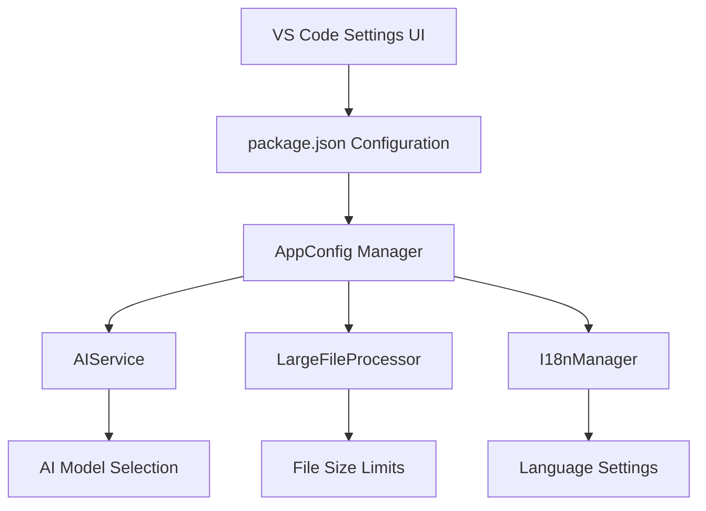
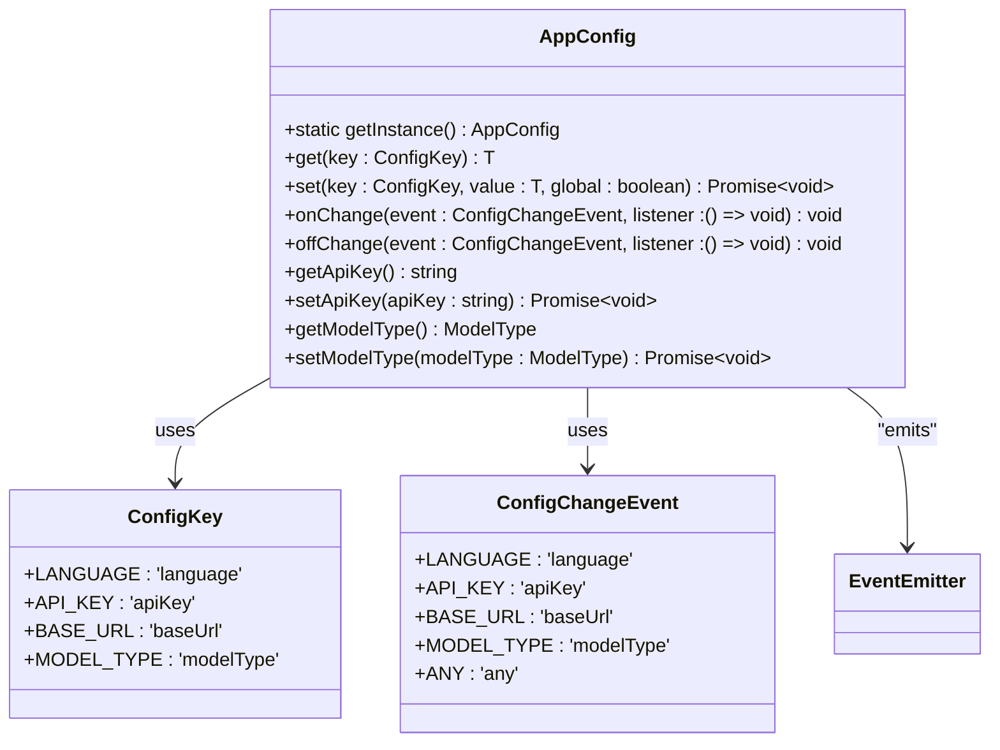
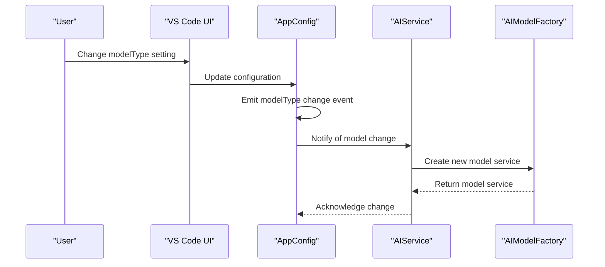
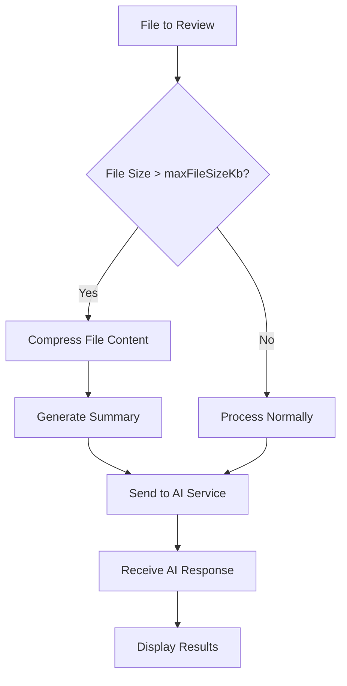
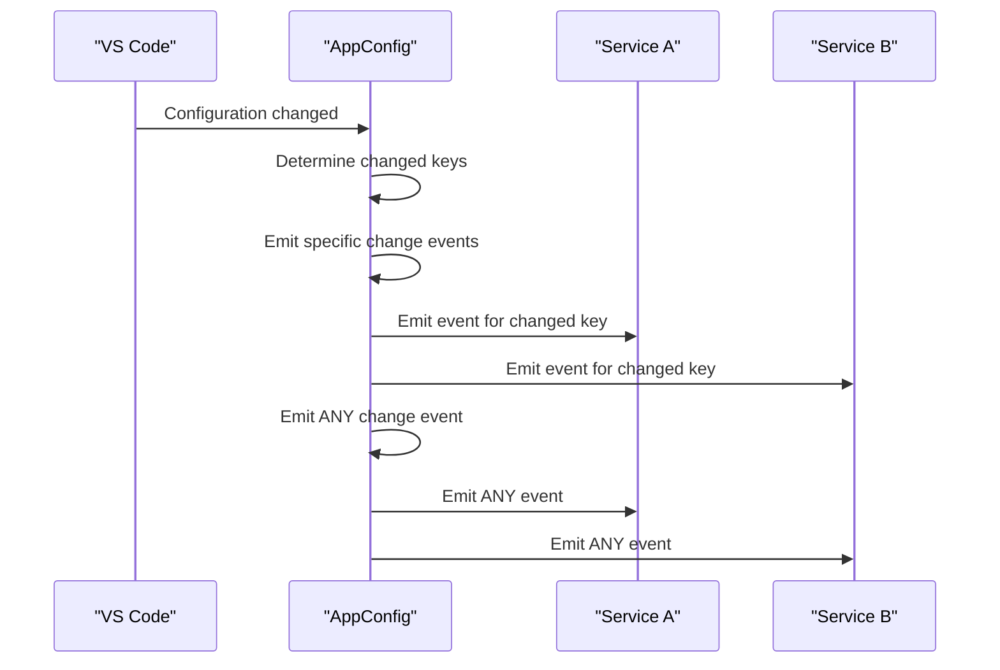
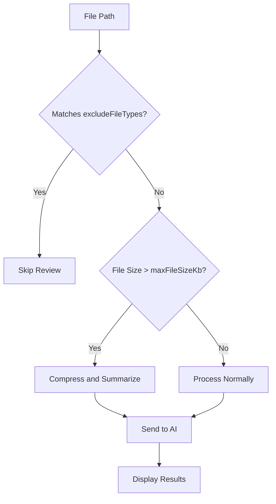

# Configuration

<cite>
**Referenced Files in This Document**   
- [package.json](file://package.json)
- [src/config/appConfig.ts](file://src/config/appConfig.ts)
- [src/services/ai/aiService.ts](file://src/services/ai/aiService.ts)
- [src/core/compression/largeFileProcessor.ts](file://src/core/compression/largeFileProcessor.ts)
- [src/models/types.ts](file://src/models/types.ts)
- [src/core/compression/compressionTypes.ts](file://src/core/compression/compressionTypes.ts)
- [src/utils/fileUtils.ts](file://src/utils/fileUtils.ts)
</cite>

## Table of Contents
1. [Introduction](#introduction)
2. [Configuration Overview](#configuration-overview)
3. [Core Configuration Options](#core-configuration-options)
4. [Configuration Architecture](#configuration-architecture)
5. [Runtime Behavior and Service Integration](#runtime-behavior-and-service-integration)
6. [Configuration Change Propagation](#configuration-change-propagation)
7. [Practical Configuration Examples](#practical-configuration-examples)
8. [Advanced Configuration Use Cases](#advanced-configuration-use-cases)
9. [Validation and Default Values](#validation-and-default-values)
10. [Scope and Persistence](#scope-and-persistence)
11. [Performance, Cost, and Accuracy Implications](#performance-cost-and-accuracy-implications)

## Introduction
The CodeKarmic extension provides a comprehensive configuration system that allows users to customize the AI-powered code review experience. This document details all configurable options defined in the package.json under 'contributes.configuration', including apiKey, modelType, maxFileSizeKb, excludeFileTypes, and debugMode. It explains how these settings map to runtime behavior in AppConfig and are consumed by services like AIService for model selection and LargeFileProcessor for size limits. The document also covers how configuration changes are observed and propagated using event emitters, provides practical examples of setting values via VS Code UI or settings.json, addresses advanced use cases like switching between AI models or customizing file exclusions, and explains how configuration impacts performance, cost, and accuracy of AI reviews.

## Configuration Overview
The CodeKarmic configuration system is designed to provide users with fine-grained control over the extension's behavior, particularly in relation to AI model selection, file processing limits, and review scope. The configuration is defined in the package.json file under the 'contributes.configuration' section, which exposes settings to the VS Code settings UI. These settings are then accessed and managed at runtime through the AppConfig class, which serves as a centralized configuration manager with event-based notification for configuration changes.

The configuration system follows a hierarchical approach where settings are defined at the extension level and can be overridden at the workspace or user level. This allows for flexible configuration that can be tailored to specific projects or user preferences. The system also includes validation rules, default values, and scope considerations to ensure consistent behavior across different environments.



**Diagram sources**
- [package.json](file://package.json#L118-L208)
- [src/config/appConfig.ts](file://src/config/appConfig.ts#L49-L188)

## Core Configuration Options
The CodeKarmic extension exposes several key configuration options that directly impact the functionality and behavior of the AI-powered code review system. These options are defined in the package.json file and are accessible through the VS Code settings UI.

### apiKey
The apiKey configuration option stores the API key for the AI service used by CodeKarmic. This key is required for authenticating requests to the AI service and is stored securely in the VS Code settings. The apiKey is scoped to the machine level, meaning it is shared across all workspaces on the same machine.

**Section sources**
- [package.json](file://package.json#L121-L126)
- [src/config/appConfig.ts](file://src/config/appConfig.ts#L146-L156)

### modelType
The modelType configuration option determines which AI model is used for code review. It supports a predefined set of models including gpt-3.5-turbo, gpt-4-turbo, and gpt-4. This setting allows users to select the appropriate model based on their requirements for accuracy, speed, and cost. The modelType is used by the AIService to instantiate the appropriate model adapter.

**Section sources**
- [package.json](file://package.json#L132-L137)
- [src/config/appConfig.ts](file://src/config/appConfig.ts#L176-L187)
- [src/models/types.ts](file://src/models/types.ts#L10-L21)

### maxFileSizeKb
The maxFileSizeKb configuration option sets the maximum file size in kilobytes for code review. Files larger than this limit are either excluded from review or processed using specialized compression techniques. This setting helps prevent performance issues and excessive API costs when reviewing large files. The default value is 100 KB, which balances thoroughness with performance.

**Section sources**
- [package.json](file://package.json#L143-L147)
- [src/core/compression/compressionTypes.ts](file://src/core/compression/compressionTypes.ts#L76-L80)

### excludeFileTypes
The excludeFileTypes configuration option defines a list of file types and patterns that should be excluded from code review. This includes binary files, images, archives, and build artifacts that are not suitable for AI analysis. The setting accepts an array of glob patterns that are matched against file paths. This helps improve performance by avoiding unnecessary processing of non-code files and reduces API costs.

**Section sources**
- [package.json](file://package.json#L148-L205)
- [src/utils/fileUtils.ts](file://src/utils/fileUtils.ts#L6-L19)

### debugMode
The debugMode configuration option enables or disables debug logging and diagnostic features. When enabled, the extension provides additional logging information that can be useful for troubleshooting issues or understanding the review process. This setting is primarily intended for developers and advanced users who need to diagnose problems with the extension.

**Section sources**
- [package.json](file://package.json#L127-L131)

## Configuration Architecture
The CodeKarmic configuration system is built around a centralized configuration manager (AppConfig) that provides a unified interface for accessing and modifying configuration settings. This architecture ensures consistency across the application and simplifies the process of adding new configuration options.

The AppConfig class implements the singleton pattern, ensuring that there is only one instance of the configuration manager throughout the application lifecycle. This instance is responsible for reading configuration values from VS Code's workspace configuration, providing default values when settings are not explicitly defined, and managing the propagation of configuration changes to interested components.



**Diagram sources**
- [src/config/appConfig.ts](file://src/config/appConfig.ts#L49-L188)

## Runtime Behavior and Service Integration
Configuration settings in CodeKarmic are not just static values; they directly influence the runtime behavior of various services within the extension. The AppConfig manager acts as a bridge between the user-defined settings and the services that consume them, ensuring that changes to configuration are properly propagated and applied.

### AIService Integration
The AIService class uses configuration settings to determine which AI model to use for code review. When the service is initialized, it reads the modelType setting from AppConfig and creates the appropriate model adapter. This allows the extension to support multiple AI providers and models without requiring code changes.



**Diagram sources**
- [src/services/ai/aiService.ts](file://src/services/ai/aiService.ts#L50-L65)
- [src/config/appConfig.ts](file://src/config/appConfig.ts#L176-L187)

### LargeFileProcessor Integration
The LargeFileProcessor service uses configuration settings to determine how to handle large files during code review. The maxFileSizeKb setting is used to identify files that exceed the size threshold, while the excludeFileTypes setting helps filter out files that should not be processed. This integration ensures that large files are handled efficiently without overwhelming the AI service or consuming excessive resources.



**Diagram sources**
- [src/core/compression/largeFileProcessor.ts](file://src/core/compression/largeFileProcessor.ts#L47-L50)
- [src/core/compression/compressionTypes.ts](file://src/core/compression/compressionTypes.ts#L76-L80)

## Configuration Change Propagation
The CodeKarmic configuration system uses an event-driven architecture to propagate configuration changes throughout the application. When a configuration setting is modified, the AppConfig manager emits an event that notifies all registered listeners of the change. This allows services and components to react to configuration changes in real-time without requiring a restart of the extension.

The event propagation system is built on Node.js's EventEmitter class, which provides a robust mechanism for handling asynchronous events. Each configuration key has a corresponding event type defined in the ConfigChangeEvent enum, allowing listeners to subscribe to specific configuration changes or to a general "any" event that is emitted for all configuration changes.



**Diagram sources**
- [src/config/appConfig.ts](file://src/config/appConfig.ts#L58-L76)

## Practical Configuration Examples
Configuring CodeKarmic can be done through the VS Code UI or by directly editing the settings.json file. Both methods provide the same functionality, with the UI offering a more user-friendly interface and the JSON file allowing for more precise control and version control of settings.

### Setting Values via VS Code UI
To configure CodeKarmic through the VS Code UI, users can open the settings panel (Ctrl+, or Cmd+, on macOS) and search for "CodeKarmic" to find all available settings. Each setting is presented with its description, default value, and current value. Users can modify the settings by clicking on the input field and entering a new value.

For example, to change the AI model used for code review:
1. Open VS Code settings (Ctrl+,)
2. Search for "CodeKarmic model"
3. Select the desired model from the dropdown (gpt-3.5-turbo, gpt-4-turbo, or gpt-4)
4. The change takes effect immediately

**Section sources**
- [package.json](file://package.json#L132-L137)

### Setting Values via settings.json
Advanced users may prefer to edit the settings.json file directly, which allows for more precise control and the ability to manage settings as part of version control. The settings.json file can be opened from the VS Code Command Palette (Ctrl+Shift+P) by selecting "Preferences: Open Settings (JSON)".

Example settings.json configuration:
```json
{
    "codekarmic.apiKey": "your-api-key-here",
    "codekarmic.modelType": "gpt-4-turbo",
    "codekarmic.maxFileSizeKb": 200,
    "codekarmic.excludeFileTypes": [
        "*.png",
        "*.jpg",
        "*.jpeg",
        "*.gif",
        "*.bmp",
        "*.ico",
        "*.svg",
        "*.pdf",
        "*.zip",
        "*.tar",
        "*.gz",
        "*.rar",
        "*.7z",
        "node_modules/**",
        ".git/**",
        "dist/**",
        "build/**",
        "out/**",
        "target/**",
        "vendor/**",
        ".vscode/**"
    ],
    "codekarmic.debugMode": true
}
```

**Section sources**
- [package.json](file://package.json#L119-L208)

## Advanced Configuration Use Cases
The CodeKarmic configuration system supports several advanced use cases that allow users to customize the extension for specific workflows and requirements.

### Switching Between AI Models
Users can switch between different AI models based on their specific needs. For example, they might use gpt-3.5-turbo for quick reviews of simple code changes due to its lower cost and faster response time, while reserving gpt-4-turbo for complex architectural reviews that require higher accuracy and deeper understanding.

The model switching is handled seamlessly by the AIService, which reinitializes the model adapter when the modelType setting is changed. This allows users to experiment with different models and find the optimal balance between cost, performance, and accuracy for their specific use case.

### Customizing File Exclusions
The excludeFileTypes setting can be customized to match the specific file types and patterns used in a project. For example, a Python project might want to exclude .pyc files and __pycache__ directories, while a JavaScript project might want to exclude .min.js files and coverage reports.

Users can also use this setting to include specific file types that are typically excluded by default. For example, they might want to review configuration files like .env or .editorconfig that contain important security or formatting rules.



**Diagram sources**
- [src/utils/fileUtils.ts](file://src/utils/fileUtils.ts#L26-L36)
- [src/core/compression/largeFileProcessor.ts](file://src/core/compression/largeFileProcessor.ts#L47-L50)

## Validation and Default Values
The CodeKarmic configuration system includes validation rules and default values to ensure that the extension functions correctly even when settings are not explicitly defined by the user.

### Validation Rules
Each configuration option has validation rules that ensure the values are appropriate for their intended use. For example, the apiKey must be a non-empty string, the modelType must be one of the predefined values, and the maxFileSizeKb must be a positive number. These validations are enforced both in the VS Code UI and at runtime through the AppConfig manager.

### Default Values
The configuration system provides sensible default values for all settings, allowing the extension to function out-of-the-box without requiring user configuration. These defaults are defined in the package.json file and in the AppConfig class:

- apiKey: "" (empty string, requires user input)
- modelType: "gpt-4-turbo" (balanced choice of performance and capability)
- maxFileSizeKb: 100 (reasonable limit for most code files)
- excludeFileTypes: Comprehensive list of common binary and build files
- debugMode: false (disabled by default to avoid excessive logging)

These defaults can be overridden at the user or workspace level, allowing for flexible configuration that meets the needs of different projects and users.

**Section sources**
- [package.json](file://package.json#L123-L146)
- [src/config/appConfig.ts](file://src/config/appConfig.ts#L37-L42)

## Scope and Persistence
Configuration settings in CodeKarmic have different scopes that determine where they are stored and how they are applied. Understanding these scopes is important for managing settings across different projects and environments.

### Machine vs Workspace Scope
The apiKey setting is scoped to the machine level, meaning it is shared across all workspaces on the same machine. This is appropriate for authentication credentials that are typically associated with a user account rather than a specific project.

Other settings like modelType, maxFileSizeKb, excludeFileTypes, and debugMode can be set at both the user and workspace levels. User-level settings apply to all workspaces, while workspace-level settings override user settings for a specific project. This allows teams to define project-specific configuration in version control while still allowing individual users to customize their experience.

### Persistence Mechanism
Configuration settings are persisted using VS Code's built-in configuration system, which stores settings in JSON files. User-level settings are stored in the user's settings.json file, while workspace-level settings are stored in the workspace's settings.json file (typically in the .vscode directory).

This persistence mechanism ensures that settings are preserved across VS Code restarts and can be easily shared and version-controlled when appropriate.

**Section sources**
- [package.json](file://package.json#L125)
- [src/config/appConfig.ts](file://src/config/appConfig.ts#L106-L108)

## Performance, Cost, and Accuracy Implications
The configuration settings in CodeKarmic have significant implications for the performance, cost, and accuracy of AI reviews. Understanding these trade-offs is essential for optimizing the extension for specific use cases.

### Performance Implications
The maxFileSizeKb and excludeFileTypes settings directly impact performance by controlling which files are processed and how they are handled. Larger file size limits and fewer exclusions can lead to longer review times and higher resource consumption, while more restrictive settings improve performance but may miss important code changes.

The debugMode setting also affects performance, as enabling debug logging increases I/O operations and can slow down the review process.

### Cost Implications
AI service costs are typically based on the number of tokens processed, making the modelType and file size settings critical for cost management. More advanced models like gpt-4-turbo are generally more expensive than gpt-3.5-turbo, and larger files consume more tokens, increasing costs.

By carefully configuring the maxFileSizeKb and excludeFileTypes settings, users can significantly reduce API costs while still maintaining effective code review coverage.

### Accuracy Implications
The modelType setting has the most direct impact on review accuracy, with more advanced models generally providing better analysis and suggestions. However, this comes at the cost of higher prices and potentially slower response times.

The excludeFileTypes setting also affects accuracy by determining which files are included in the review. Excluding too many file types may miss important code changes, while including inappropriate file types (like binary files) can lead to irrelevant or misleading suggestions.

Balancing these factors requires understanding the specific needs of the project and the trade-offs between thoroughness, speed, and cost.

**Section sources**
- [src/services/ai/aiService.ts](file://src/services/ai/aiService.ts#L349-L355)
- [src/core/compression/largeFileProcessor.ts](file://src/core/compression/largeFileProcessor.ts#L63-L67)
- [src/models/types.ts](file://src/models/types.ts#L10-L21)