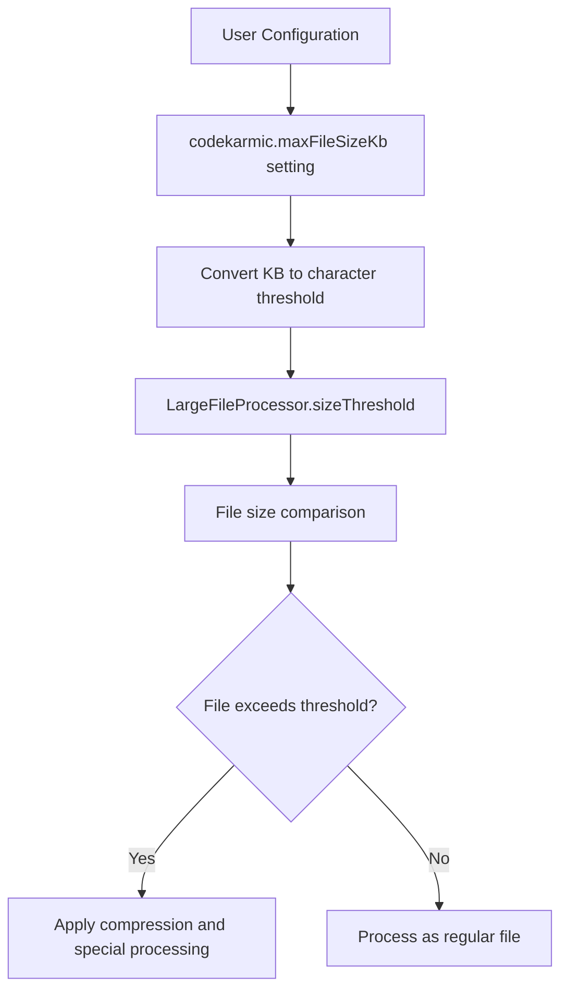
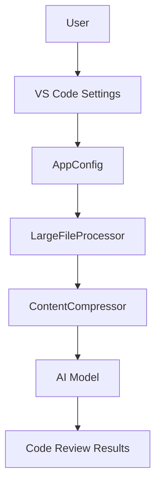
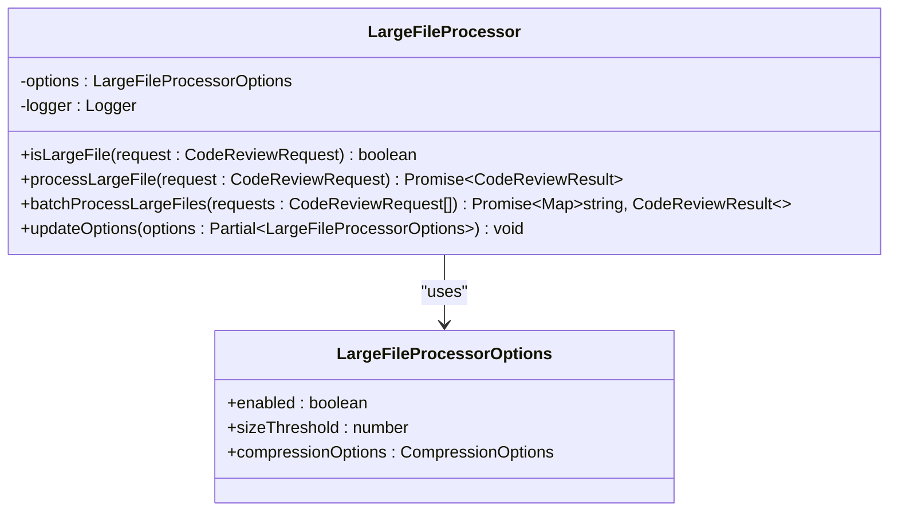
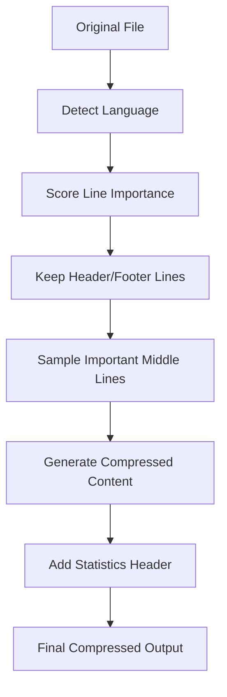
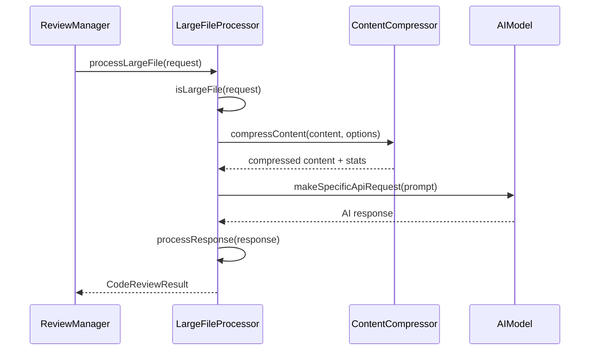

# File Size Limits

<cite>
**Referenced Files in This Document**   
- [appConfig.ts](file://src/config/appConfig.ts)
- [largeFileProcessor.ts](file://src/core/compression/largeFileProcessor.ts)
- [compressionTypes.ts](file://src/core/compression/compressionTypes.ts)
- [contentCompressor.ts](file://src/core/compression/contentCompressor.ts)
- [package.json](file://package.json)
</cite>

## Table of Contents
1. [Introduction](#introduction)
2. [Configuration Overview](#configuration-overview)
3. [Core Components](#core-components)
4. [Architecture Overview](#architecture-overview)
5. [Detailed Component Analysis](#detailed-component-analysis)
6. [Error Handling](#error-handling)
7. [Integration with Content Compression](#integration-with-content-compression)
8. [Best Practices](#best-practices)
9. [Conclusion](#conclusion)

## Introduction
CodeKarmic implements file size limits to maintain optimal performance during code review operations. The system prevents performance degradation by limiting the size of files processed by the AI model, balancing thoroughness with efficiency. This document explains the `codekarmic.maxFileSizeKb` configuration setting, its default value of 100KB, and how it integrates with the LargeFileProcessor and content compression system.

**Section sources**
- [package.json](file://package.json#L143-L147)

## Configuration Overview
The `codekarmic.maxFileSizeKb` setting controls the maximum file size (in kilobytes) that CodeKarmic will process during code review operations. This configuration parameter is defined in the extension's package.json with a default value of 100KB. The setting serves as a critical performance safeguard, preventing the AI model from processing excessively large files that could lead to slow response times, high processing costs, and potential timeouts.

The configuration is accessible through VS Code settings and can be customized based on project requirements. While the setting is defined in package.json, the actual enforcement logic is implemented through the LargeFileProcessor component, which uses character count thresholds to determine if a file should be treated as "large" and processed accordingly.

**Diagram sources**
- [package.json](file://package.json#L143-L147)
- [compressionTypes.ts](file://src/core/compression/compressionTypes.ts#L76-L80)

**Section sources**
- [package.json](file://package.json#L143-L147)

## Core Components
The file size limit functionality is implemented through several interconnected components that work together to manage large files efficiently. The LargeFileProcessor class serves as the primary component responsible for identifying and handling large files during code review operations. It uses the size threshold to determine whether a file requires special processing.

The content compression system works in conjunction with the LargeFileProcessor to reduce the size of large files while preserving essential information. This allows the AI model to analyze the most important aspects of the code without processing the entire file content, which would be both time-consuming and costly.

**Section sources**
- [largeFileProcessor.ts](file://src/core/compression/largeFileProcessor.ts#L23-L241)
- [contentCompressor.ts](file://src/core/compression/contentCompressor.ts#L18-L414)

## Architecture Overview
The file size limit system follows a layered architecture where configuration settings are translated into processing rules that are enforced during code review operations. The AppConfig class provides centralized access to all application settings, including the maxFileSizeKb parameter. When a code review is initiated, the LargeFileProcessor checks if the file exceeds the configured size threshold and applies appropriate processing strategies.

The architecture separates configuration management from processing logic, allowing for flexible adjustment of file size limits without modifying the core processing algorithms. This separation of concerns enables the system to adapt to different project requirements while maintaining consistent processing behavior.

**Diagram sources**
- [appConfig.ts](file://src/config/appConfig.ts#L49-L188)
- [largeFileProcessor.ts](file://src/core/compression/largeFileProcessor.ts#L23-L241)

**Section sources**
- [appConfig.ts](file://src/config/appConfig.ts#L49-L188)
- [largeFileProcessor.ts](file://src/core/compression/largeFileProcessor.ts#L23-L241)

## Detailed Component Analysis

### LargeFileProcessor Analysis
The LargeFileProcessor class is responsible for handling large files in code reviews. It implements a singleton pattern to ensure consistent processing across the application. The processor uses a configurable size threshold to determine whether a file should be treated as large. By default, this threshold is set to 20,000 characters, which approximately corresponds to 100KB for typical source code files.

The processor checks file size through the `isLargeFile` method, which compares the file's character count against the configured threshold. If a file exceeds this threshold, it is processed using specialized compression techniques before being sent to the AI model for analysis.

**Diagram sources**
- [largeFileProcessor.ts](file://src/core/compression/largeFileProcessor.ts#L23-L241)
- [compressionTypes.ts](file://src/core/compression/compressionTypes.ts#L64-L80)

**Section sources**
- [largeFileProcessor.ts](file://src/core/compression/largeFileProcessor.ts#L23-L241)

### Content Compression System
The content compression system implements intelligent compression algorithms that preserve the most important aspects of code while reducing its size. The system uses language-aware compression techniques to prioritize important code elements such as function definitions, class declarations, and key logic structures.

The compression process retains header and footer lines while intelligently sampling from the middle section based on content importance. This approach ensures that critical information at the beginning and end of files is preserved, while the most significant content from the middle section is included in the compressed version.

**Diagram sources**
- [contentCompressor.ts](file://src/core/compression/contentCompressor.ts#L18-L232)
- [compressionTypes.ts](file://src/core/compression/compressionTypes.ts#L10-L41)

**Section sources**
- [contentCompressor.ts](file://src/core/compression/contentCompressor.ts#L18-L232)

## Error Handling
The file size limit system includes comprehensive error handling to manage edge cases and unexpected conditions. When a file is processed that doesn't meet the large file criteria, the system throws a descriptive error indicating that the file is not large enough for special processing. This prevents accidental misuse of the large file processing pipeline for regular-sized files.

The system also includes error handling for API request failures during large file processing. If the AI service call fails, the processor logs the error and returns a fallback response with an appropriate error message. This ensures that the code review process continues even when individual file analyses encounter issues.

**Section sources**
- [largeFileProcessor.ts](file://src/core/compression/largeFileProcessor.ts#L56-L81)

## Integration with Content Compression
The file size limit system is tightly integrated with the content compression functionality to provide seamless handling of large files. When a file exceeds the size threshold, the LargeFileProcessor automatically applies compression using the configured compression options. The compressed content is then used for AI analysis, significantly reducing the token count while preserving essential information.

The integration includes batch processing capabilities that group multiple large files into batches based on token estimates. This ensures that the total token count for each batch stays within the AI model's limits, optimizing both performance and cost efficiency.

**Diagram sources**
- [largeFileProcessor.ts](file://src/core/compression/largeFileProcessor.ts#L55-L81)
- [contentCompressor.ts](file://src/core/compression/contentCompressor.ts#L18-L232)

**Section sources**
- [largeFileProcessor.ts](file://src/core/compression/largeFileProcessor.ts#L55-L81)
- [contentCompressor.ts](file://src/core/compression/contentCompressor.ts#L18-L232)

## Best Practices
When configuring file size limits in CodeKarmic, consider the following best practices:

1. **Balance thoroughness with performance**: While larger file size limits allow for more comprehensive analysis, they also increase processing time and AI costs. The default 100KB limit provides a good balance for most projects.

2. **Adjust based on project type**: For projects with naturally large files (such as generated code or data files), consider increasing the limit. For projects with many small, focused files, the default limit is usually appropriate.

3. **Monitor AI costs**: Larger file sizes result in higher token usage and increased AI processing costs. Regularly review your usage patterns and adjust the limit accordingly.

4. **Consider file types**: Some file types (like minified JavaScript or CSS) may benefit from lower size limits, as their content is less amenable to meaningful analysis.

5. **Test with representative files**: Before finalizing your configuration, test the code review process with files that are representative of your codebase to ensure optimal performance.

**Section sources**
- [package.json](file://package.json#L143-L147)
- [compressionTypes.ts](file://src/core/compression/compressionTypes.ts#L76-L80)

## Conclusion
The file size limit system in CodeKarmic provides an effective mechanism for maintaining performance during code review operations. By implementing the `codekarmic.maxFileSizeKb` setting with a sensible default of 100KB, the system prevents performance degradation from large files while still allowing for thorough code analysis. The integration with the LargeFileProcessor and content compression system ensures that large files are handled efficiently, preserving important information while reducing processing overhead. By following best practices for configuration, users can optimize their code review experience for both performance and cost efficiency.