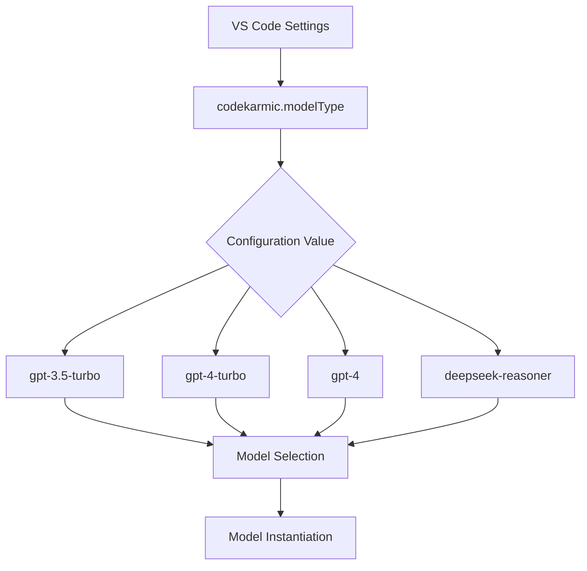
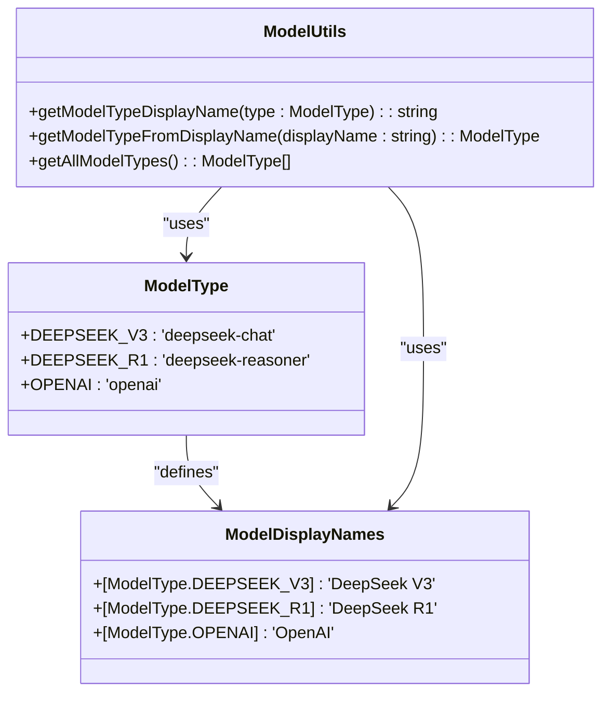
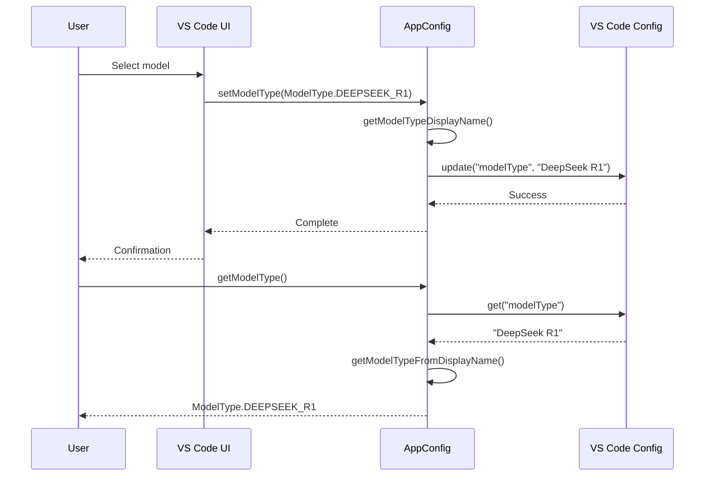
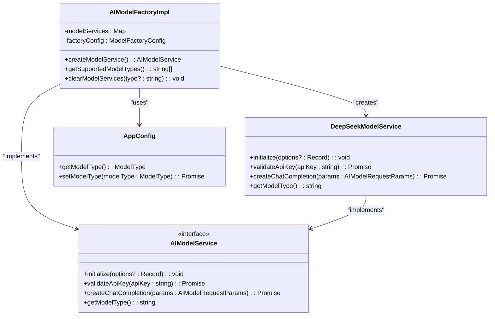
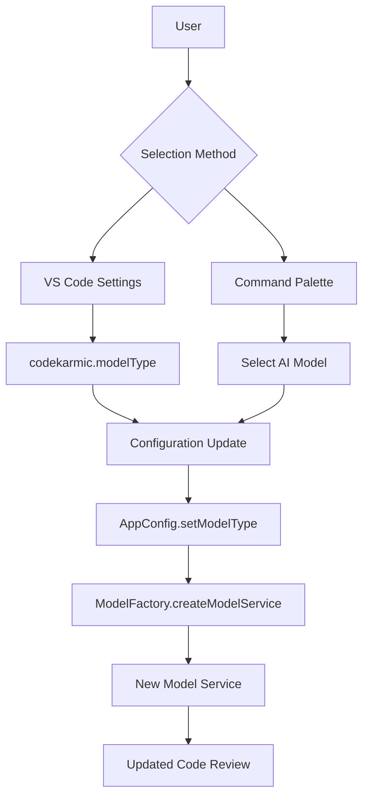

# Model Selection

<cite>
**Referenced Files in This Document**   
- [appConfig.ts](file://src/config/appConfig.ts)
- [types.ts](file://src/models/types.ts)
- [modelFactory.ts](file://src/models/modelFactory.ts)
- [deepseek.ts](file://src/models/providers/deepseek.ts)
- [aiService.ts](file://src/services/ai/aiService.ts)
- [extension.ts](file://src/extension.ts)
- [package.json](file://package.json)
</cite>

## Table of Contents
1. [Introduction](#introduction)
2. [Configuration Overview](#configuration-overview)
3. [Model Type Definition](#model-type-definition)
4. [AppConfig Implementation](#appconfig-implementation)
5. [Model Factory and Instantiation](#model-factory-and-instantiation)
6. [User Interface and Commands](#user-interface-and-commands)
7. [Model Performance Characteristics](#model-performance-characteristics)
8. [Extending the Model System](#extending-the-model-system)
9. [Conclusion](#conclusion)

## Introduction
This document provides comprehensive documentation for the model selection system in CodeKarmic, an AI-powered extension for Git commit code review. The model selection mechanism allows users to choose between different AI models for code analysis, with configuration managed through VS Code settings. The system is designed with extensibility in mind, allowing for easy addition of new models while maintaining a consistent interface for model interaction. The current implementation supports multiple AI models with a focus on DeepSeek models, providing users with options that balance performance, cost, and accuracy requirements.

**Section sources**
- [appConfig.ts](file://src/config/appConfig.ts#L1-L188)
- [types.ts](file://src/models/types.ts#L1-L103)
- [modelFactory.ts](file://src/models/modelFactory.ts#L1-L140)

## Configuration Overview
The `codekarmic.modelType` configuration option in CodeKarmic controls which AI model is used for code review operations. This setting is defined in the extension's package.json file and can be modified through VS Code's settings UI or settings.json file. The configuration has a default value of "gpt-4-turbo" as specified in the package.json, providing a reasonable out-of-the-box experience for users. The configuration system is built on VS Code's configuration API, allowing for both workspace-level and user-level settings with appropriate scoping. The model selection is stored as a string value that corresponds to display names, which are then mapped to internal model type constants for consistent handling throughout the application.

**Diagram sources**
- [package.json](file://package.json#L132-L137)
- [appConfig.ts](file://src/config/appConfig.ts#L39)

**Section sources**
- [package.json](file://package.json#L118-L137)
- [appConfig.ts](file://src/config/appConfig.ts#L37-L42)

## Model Type Definition
The model types in CodeKarmic are defined in the ModelType enum within the types.ts file. The allowed values include "gpt-3.5-turbo", "gpt-4-turbo", and "deepseek-reasoner", with "deepseek-reasoner" set as the default in the configuration defaults. The ModelType enum provides a type-safe way to reference models throughout the codebase, preventing invalid model references. Each model type has a corresponding display name through the ModelDisplayNames constant, which maps the internal model type to a user-friendly display name. The system includes utility functions getModelTypeDisplayName and getModelTypeFromDisplayName for bidirectional conversion between internal model types and their display representations, ensuring consistency in how models are referenced and displayed to users.

**Diagram sources**
- [types.ts](file://src/models/types.ts#L10-L36)

**Section sources**
- [types.ts](file://src/models/types.ts#L10-L41)

## AppConfig Implementation
The AppConfig class provides the primary interface for model configuration management in CodeKarmic. It implements a singleton pattern to ensure consistent access to configuration settings across the application. The class includes specific methods for model type management: getModelType and setModelType. The getModelType method retrieves the current model type from VS Code's configuration system, using the getModelTypeFromDisplayName function to convert the stored display name back to the corresponding ModelType enum value. Conversely, the setModelType method stores the model selection by converting the ModelType enum value to its display name using getModelTypeDisplayName before persisting it to the configuration. This approach ensures that user-facing display names are stored in settings while the application uses type-safe enum values internally.

**Diagram sources**
- [appConfig.ts](file://src/config/appConfig.ts#L176-L187)

**Section sources**
- [appConfig.ts](file://src/config/appConfig.ts#L49-L188)

## Model Factory and Instantiation
The model selection system uses a factory pattern implemented in the AIModelFactoryImpl class to instantiate the appropriate AI model service based on the selected model type. When a model service is requested, the factory retrieves the current model type from AppConfig and creates an instance of the corresponding model service. For DeepSeek models, this results in the creation of a DeepSeekModelService instance that handles communication with the DeepSeek API. The factory implements caching to improve performance by reusing model service instances when possible, keyed by the combination of model type and base URL. The system validates the selected model type during extension activation using the ModelValidator class, which checks against the list of supported models and provides appropriate error messages if an invalid model is configured.

**Diagram sources**
- [modelFactory.ts](file://src/models/modelFactory.ts#L19-L140)
- [deepseek.ts](file://src/models/providers/deepseek.ts#L11-L211)
- [modelInterface.ts](file://src/models/modelInterface.ts#L1-L185)

**Section sources**
- [modelFactory.ts](file://src/models/modelFactory.ts#L1-L140)
- [deepseek.ts](file://src/models/providers/deepseek.ts#L1-L211)
- [modelValidator.ts](file://src/models/modelValidator.ts#L1-L14)

## User Interface and Commands
Users can switch between available models through two primary methods: VS Code settings and the 'Select AI Model' command. The 'Select AI Model' command is registered in the extension and can be accessed through the VS Code command palette. When executed, it presents a quick pick interface showing the available models with their display names and descriptions. Selecting a model updates the configuration through the AppConfig service, which triggers appropriate events to notify other components of the change. The command implementation is minimal, focusing on presenting the selection interface and handling the user's choice by updating the configuration. The system also validates the model configuration during extension activation, ensuring that only supported models are used and providing feedback if the configured model is invalid.

**Diagram sources**
- [extension.ts](file://src/extension.ts#L287-L289)
- [extension.ts](file://src/extension.ts#L521-L535)

**Section sources**
- [extension.ts](file://src/extension.ts#L287-L289)
- [extension.ts](file://src/extension.ts#L521-L535)

## Model Performance Characteristics
The different models available in CodeKarmic offer varying trade-offs in performance, cost, and accuracy. The gpt-3.5-turbo model provides faster response times and lower computational costs, making it suitable for quick code reviews and iterative development. The gpt-4-turbo model offers improved accuracy and reasoning capabilities at the expense of higher computational requirements and potentially longer response times, making it better suited for complex code analysis tasks. The deepseek-reasoner model is optimized for code understanding and reasoning tasks, potentially offering better performance for code review scenarios compared to general-purpose models. Users should consider their specific use cases when selecting a model, balancing the need for thorough analysis against performance requirements and potential API costs.

**Section sources**
- [types.ts](file://src/models/types.ts#L10-L21)
- [package.json](file://package.json#L132-L137)

## Extending the Model System
Adding new models to CodeKarmic requires extending the ModelType enum with a new value and corresponding display name in the ModelDisplayNames constant. The model factory implementation may need to be updated to support the new model type, typically by adding a new case to the switch statement in createModelService. For models with different API requirements, a new model service class should be created that implements the AIModelService interface, ensuring consistent interaction patterns across all models. The system is designed to be extensible, with the factory pattern and interface-based design allowing for new model implementations without modifying existing code. Configuration validation ensures that only supported models can be selected, maintaining system stability when new models are added.

**Section sources**
- [types.ts](file://src/models/types.ts#L10-L21)
- [modelFactory.ts](file://src/models/modelFactory.ts#L85-L93)
- [modelInterface.ts](file://src/models/modelInterface.ts#L39-L62)

## Conclusion
The model selection system in CodeKarmic provides a flexible and extensible framework for choosing AI models for code review tasks. By combining configuration management through VS Code settings with a factory-based instantiation system, the extension allows users to select the most appropriate model for their needs while maintaining a clean separation between configuration and implementation. The use of display name mapping ensures a user-friendly experience while preserving type safety in the codebase. The system's design supports future expansion with additional models, making it adaptable to evolving AI capabilities and user requirements.