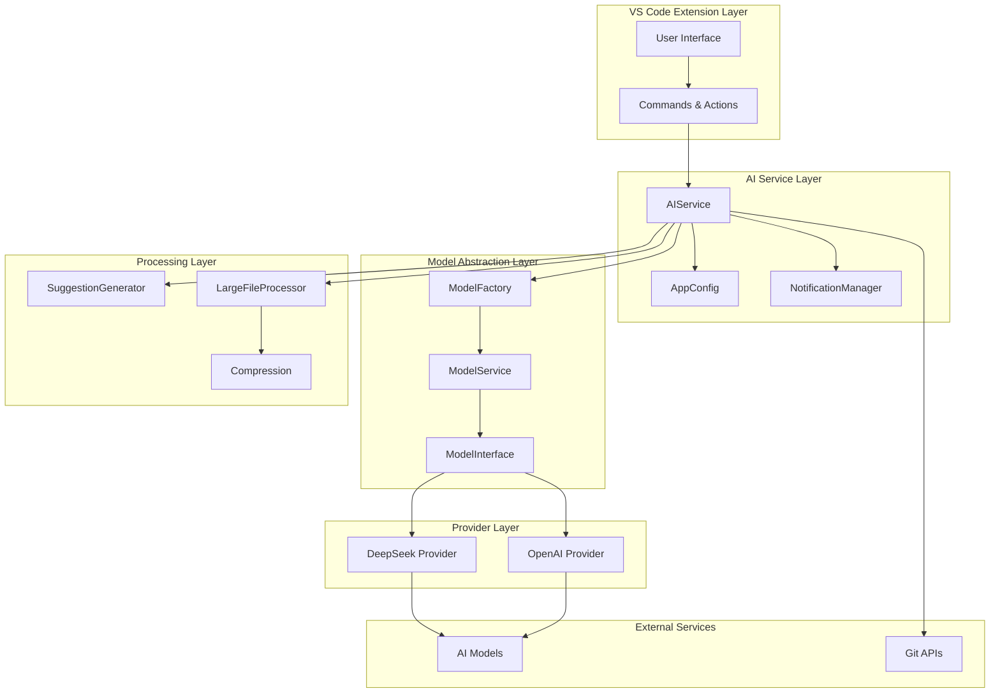
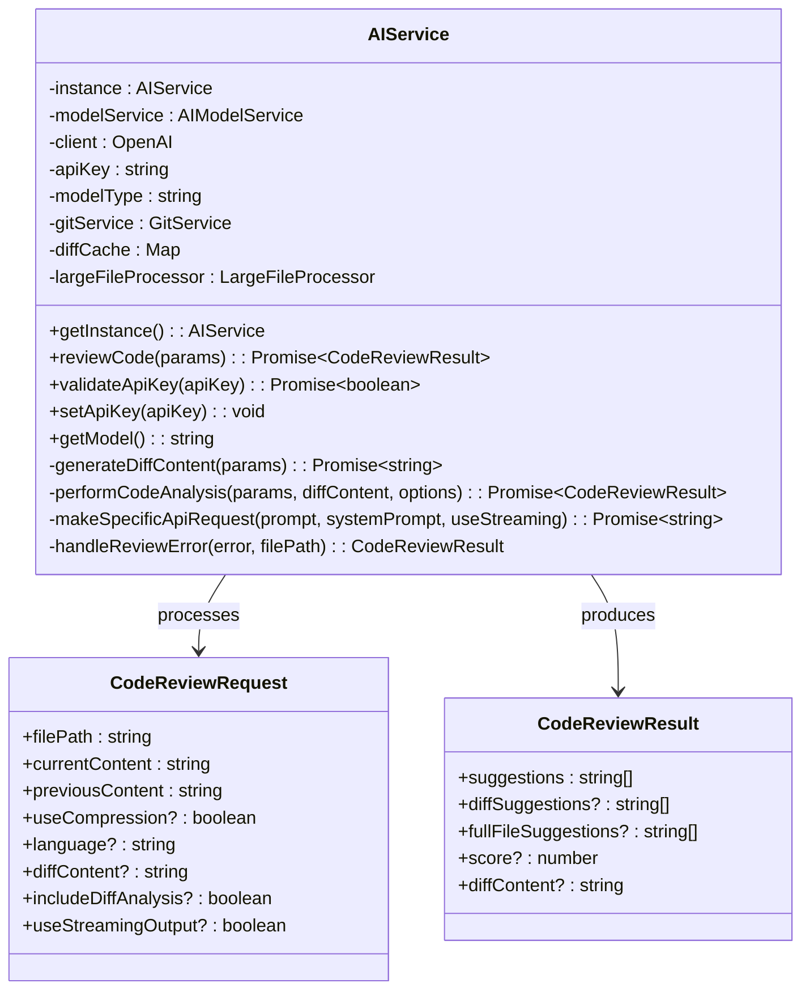
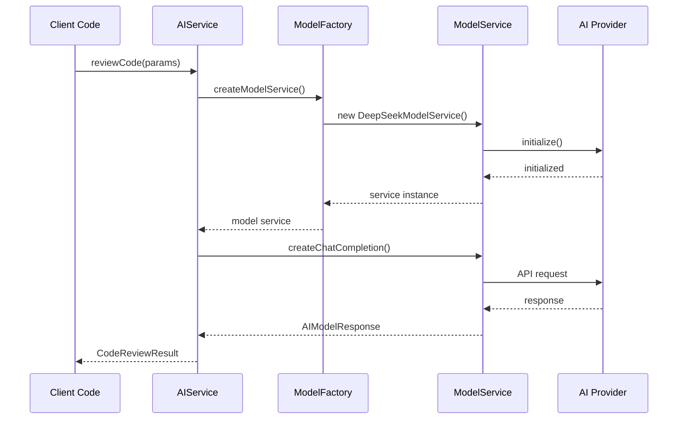
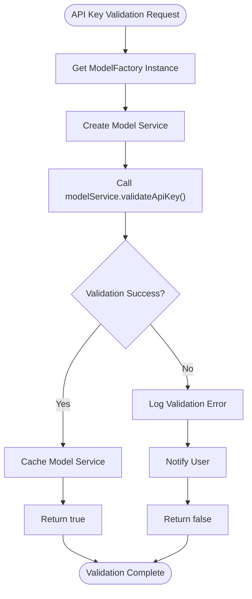
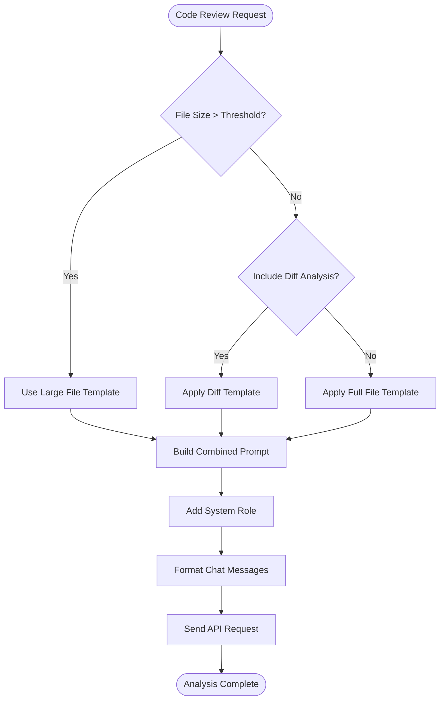
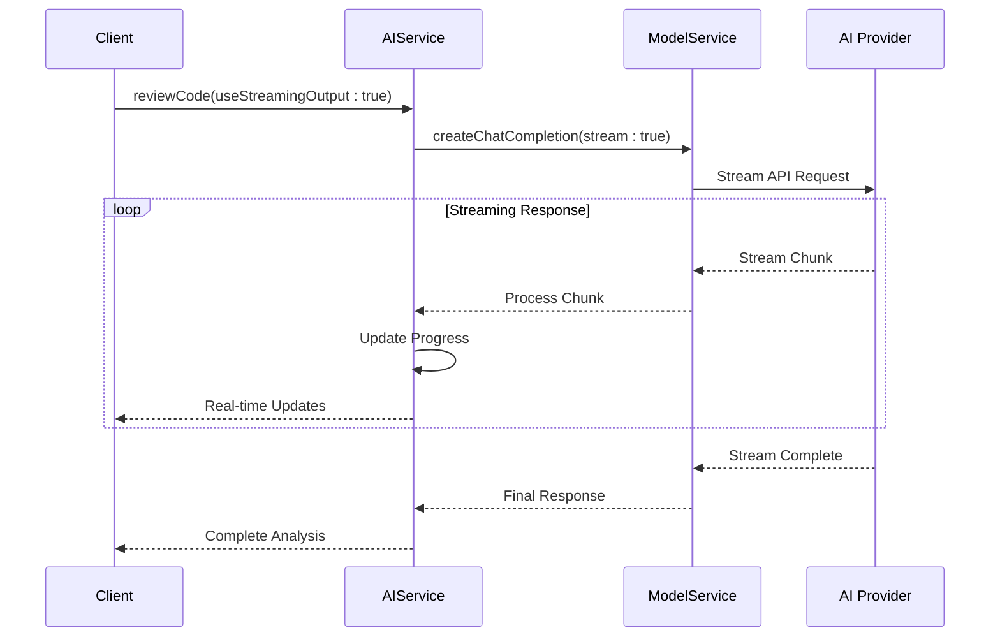
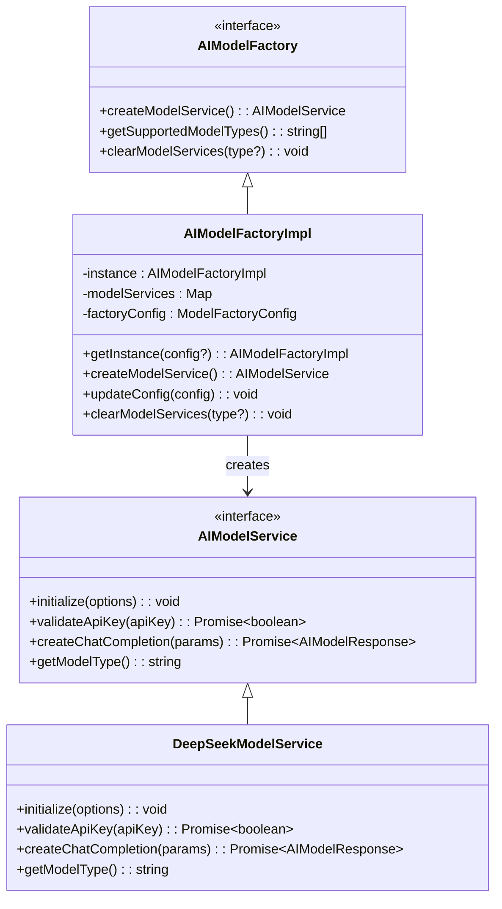
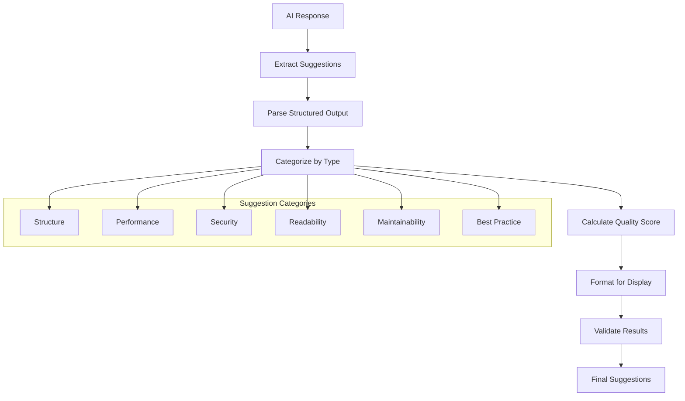
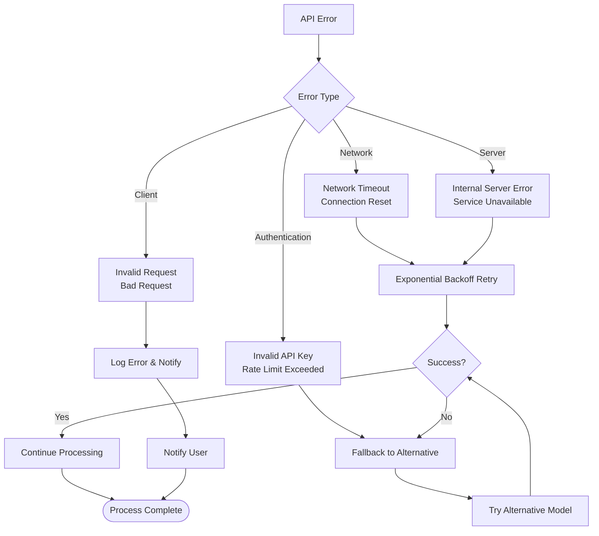
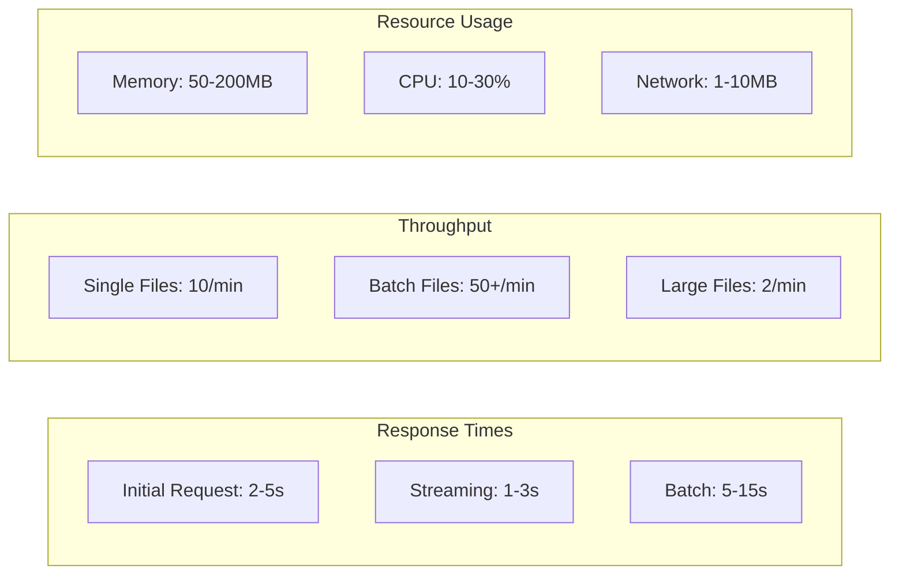

# AI Service

<cite>
**Referenced Files in This Document**
- [aiService.ts](file://src/services/ai/aiService.ts)
- [modelFactory.ts](file://src/models/modelFactory.ts)
- [modelInterface.ts](file://src/models/modelInterface.ts)
- [appConfig.ts](file://src/config/appConfig.ts)
- [suggestionGenerator.ts](file://src/core/review/suggestionGenerator.ts)
- [notificationManager.ts](file://src/services/notification/notificationManager.ts)
- [logger.ts](file://src/utils/logger.ts)
- [retryUtils.ts](file://src/utils/retryUtils.ts)
- [prompts.ts](file://src/i18n/en/prompts.ts)
- [types.ts](file://src/models/types.ts)
</cite>

## Table of Contents
1. [Introduction](#introduction)
2. [Architecture Overview](#architecture-overview)
3. [Core Components](#core-components)
4. [API Key Validation](#api-key-validation)
5. [Prompt Construction and Formatting](#prompt-construction-and-formatting)
6. [Streaming Response Management](#streaming-response-management)
7. [Integration with ModelFactory](#integration-with-modelfactory)
8. [Suggestion Processing Pipeline](#suggestion-processing-pipeline)
9. [Error Handling and Rate Limiting](#error-handling-and-rate-limiting)
10. [Performance Considerations](#performance-considerations)
11. [Security Aspects](#security-aspects)
12. [Configuration Management](#configuration-management)
13. [Troubleshooting Guide](#troubleshooting-guide)

## Introduction

The AIService serves as the central orchestrator for AI model interactions in CodeKarmic, providing a comprehensive framework for code review automation. It manages the complete lifecycle of AI-powered code analysis, from API key validation and prompt construction to response processing and suggestion generation. The service acts as a bridge between the VS Code extension and various AI model providers, offering seamless integration with multiple model types while maintaining consistent interfaces and robust error handling.

The AIService implements sophisticated caching mechanisms, intelligent retry logic, and performance optimization strategies to ensure reliable and efficient code review operations. It supports both real-time streaming responses and batch processing for large-scale code analysis scenarios.

## Architecture Overview

The AIService follows a layered architecture pattern that separates concerns and promotes modularity:

**Diagram sources**
- [aiService.ts](file://src/services/ai/aiService.ts#L40-L70)
- [modelFactory.ts](file://src/models/modelFactory.ts#L19-L44)
- [modelInterface.ts](file://src/models/modelInterface.ts#L39-L62)

**Section sources**
- [aiService.ts](file://src/services/ai/aiService.ts#L40-L70)
- [modelFactory.ts](file://src/models/modelFactory.ts#L19-L44)

## Core Components

### AIService Singleton

The AIService implements the Singleton pattern to ensure centralized management of AI model interactions:

**Diagram sources**
- [aiService.ts](file://src/services/ai/aiService.ts#L15-L39)
- [aiService.ts](file://src/services/ai/aiService.ts#L40-L70)

### Model Factory Integration

The AIService integrates with the ModelFactory to manage different AI model providers:

**Diagram sources**
- [aiService.ts](file://src/services/ai/aiService.ts#L51-L61)
- [modelFactory.ts](file://src/models/modelFactory.ts#L58-L110)

**Section sources**
- [aiService.ts](file://src/services/ai/aiService.ts#L40-L70)
- [modelFactory.ts](file://src/models/modelFactory.ts#L19-L140)

## API Key Validation

The AIService provides robust API key validation capabilities through the ModelFactory integration:

### Validation Process

The API key validation follows a structured approach:

**Diagram sources**
- [aiService.ts](file://src/services/ai/aiService.ts#L712-L723)

### Implementation Details

The validation process involves several key steps:

1. **Factory Initialization**: Creates a temporary model service instance
2. **API Testing**: Makes a lightweight API call to verify credentials
3. **Error Handling**: Comprehensive error logging and user notification
4. **Caching**: Stores validated services for future use

**Section sources**
- [aiService.ts](file://src/services/ai/aiService.ts#L712-L723)
- [modelFactory.ts](file://src/models/modelFactory.ts#L58-L110)

## Prompt Construction and Formatting

The AIService constructs sophisticated prompts for code review analysis using a templating system:

### Prompt Templates

The system uses multiple prompt templates for different analysis scenarios:

| Template Type | Purpose | Key Features |
|---------------|---------|--------------|
| `SYSTEM_PROMPT` | General code review guidance | Structured analysis framework |
| `DIFF_PROMPT` | Change-focused analysis | Line-by-line comparison |
| `FULL_FILE_PROMPT` | Complete file analysis | Comprehensive structural review |
| `LARGE_FILE_PROMPT` | Large file compression | Summary-based analysis |
| `FINAL_PROMPT` | Consolidated suggestions | Combined analysis synthesis |

### Prompt Construction Process

**Diagram sources**
- [aiService.ts](file://src/services/ai/aiService.ts#L308-L332)
- [prompts.ts](file://src/i18n/en/prompts.ts#L10-L107)

### Authentication Headers

The AIService manages authentication headers through the underlying model services:

- **API Key Storage**: Secure storage in AppConfig
- **Header Management**: Automatic header injection for API requests
- **Token Refresh**: Intelligent token refresh mechanisms
- **Security Validation**: Multi-layered security checks

**Section sources**
- [aiService.ts](file://src/services/ai/aiService.ts#L308-L332)
- [prompts.ts](file://src/i18n/en/prompts.ts#L10-L107)
- [appConfig.ts](file://src/config/appConfig.ts#L145-L156)

## Streaming Response Management

The AIService supports real-time streaming responses for improved user experience:

### Streaming Architecture

**Diagram sources**
- [aiService.ts](file://src/services/ai/aiService.ts#L269-L275)
- [aiService.ts](file://src/services/ai/aiService.ts#L766-L768)

### Stream Processing Features

1. **Real-time Updates**: Progressive response delivery
2. **Progress Tracking**: Visual progress indicators
3. **Error Recovery**: Graceful handling of stream interruptions
4. **Resource Management**: Efficient memory usage during streaming

**Section sources**
- [aiService.ts](file://src/services/ai/aiService.ts#L269-L275)
- [aiService.ts](file://src/services/ai/aiService.ts#L766-L768)

## Integration with ModelFactory

The AIService leverages the ModelFactory for dynamic model service creation and management:

### Factory Pattern Implementation

**Diagram sources**
- [modelFactory.ts](file://src/models/modelFactory.ts#L19-L44)
- [modelInterface.ts](file://src/models/modelInterface.ts#L39-L62)

### Service Caching Strategy

The ModelFactory implements intelligent caching to optimize performance:

- **Cache Key**: Combination of model type and base URL
- **Lifetime Management**: Automatic cache invalidation
- **Memory Optimization**: LRU-based cache eviction
- **Concurrent Access**: Thread-safe cache operations

**Section sources**
- [modelFactory.ts](file://src/models/modelFactory.ts#L19-L140)
- [modelInterface.ts](file://src/models/modelInterface.ts#L39-L62)

## Suggestion Processing Pipeline

The AIService integrates with the SuggestionGenerator for structured output processing:

### Processing Workflow

**Diagram sources**
- [suggestionGenerator.ts](file://src/core/review/suggestionGenerator.ts#L66-L106)
- [aiService.ts](file://src/services/ai/aiService.ts#L364-L386)

### Structured Output Format

The suggestion generator produces structured suggestions with metadata:

| Field | Type | Description |
|-------|------|-------------|
| `content` | string | The suggestion text |
| `lines` | number[] \| string | Related line numbers or ranges |
| `category` | SuggestionCategory | Classification type |
| `severity` | SuggestionSeverity | Importance level |
| `fixExample` | string | Code example for fixes |

**Section sources**
- [suggestionGenerator.ts](file://src/core/review/suggestionGenerator.ts#L36-L50)
- [suggestionGenerator.ts](file://src/core/review/suggestionGenerator.ts#L183-L248)

## Error Handling and Rate Limiting

The AIService implements comprehensive error handling and rate limiting strategies:

### Error Classification

**Diagram sources**
- [aiService.ts](file://src/services/ai/aiService.ts#L388-L410)
- [retryUtils.ts](file://src/utils/retryUtils.ts#L33-L70)

### Retry Mechanisms

The system implements sophisticated retry logic:

- **Exponential Backoff**: Increasing delays between retries
- **Jitter**: Random variation to prevent thundering herd
- **Circuit Breaker**: Temporary service suspension after failures
- **Timeout Management**: Configurable request timeouts

**Section sources**
- [aiService.ts](file://src/services/ai/aiService.ts#L388-L410)
- [retryUtils.ts](file://src/utils/retryUtils.ts#L33-L70)

## Performance Considerations

The AIService incorporates multiple performance optimization strategies:

### Optimization Strategies

| Strategy | Implementation | Benefits |
|----------|----------------|----------|
| **Caching** | Model service caching, diff content caching | Reduced API calls, faster responses |
| **Compression** | Large file compression, content summarization | Lower bandwidth, reduced costs |
| **Batch Processing** | Multi-file analysis batching | Improved throughput |
| **Streaming** | Real-time response streaming | Better UX, resource efficiency |
| **Lazy Loading** | On-demand service initialization | Faster startup, lower memory usage |

### Performance Metrics

**Section sources**
- [aiService.ts](file://src/services/ai/aiService.ts#L270-L275)
- [aiService.ts](file://src/services/ai/aiService.ts#L444-L446)

## Security Aspects

The AIService implements multiple security measures:

### API Key Security

- **Encrypted Storage**: Secure storage in VS Code settings
- **Memory Protection**: Minimal exposure in memory
- **Access Control**: Restricted access to sensitive operations
- **Audit Logging**: Comprehensive logging of API interactions

### Data Protection

- **Content Sanitization**: Removal of sensitive information
- **Transmission Security**: HTTPS encryption
- **Local Caching**: Secure local storage of processed data
- **Privacy Compliance**: GDPR and data protection standards

**Section sources**
- [appConfig.ts](file://src/config/appConfig.ts#L145-L156)
- [aiService.ts](file://src/services/ai/aiService.ts#L726-L732)

## Configuration Management

The AIService integrates with AppConfig for centralized configuration:

### Configuration Options

| Setting | Type | Default | Description |
|---------|------|---------|-------------|
| `apiKey` | string | "" | AI provider API key |
| `modelType` | string | "deepseek-reasoner" | Selected AI model |
| `baseUrl` | string | "https://api.deepseek.com/v1" | API endpoint URL |
| `language` | string | "ENGLISH" | UI language preference |

### Dynamic Configuration

The system supports runtime configuration changes:

- **Hot Reloading**: Immediate effect of configuration updates
- **Validation**: Real-time validation of configuration changes
- **Rollback**: Automatic rollback on invalid configurations
- **Persistence**: Automatic saving of configuration changes

**Section sources**
- [appConfig.ts](file://src/config/appConfig.ts#L37-L42)
- [appConfig.ts](file://src/config/appConfig.ts#L95-L110)

## Troubleshooting Guide

Common issues and their solutions:

### API Key Issues

**Problem**: API key validation fails
**Solution**: 
1. Verify API key format and validity
2. Check network connectivity
3. Review rate limiting policies
4. Test with alternative API keys

### Performance Issues

**Problem**: Slow response times
**Solution**:
1. Enable streaming for real-time updates
2. Reduce file sizes through compression
3. Optimize prompt complexity
4. Check network latency

### Error Handling

**Problem**: Unexpected errors during analysis
**Solution**:
1. Check error logs in output panel
2. Verify configuration settings
3. Test with smaller files
4. Contact support with error details

**Section sources**
- [aiService.ts](file://src/services/ai/aiService.ts#L691-L710)
- [notificationManager.ts](file://src/services/notification/notificationManager.ts#L79-L121)