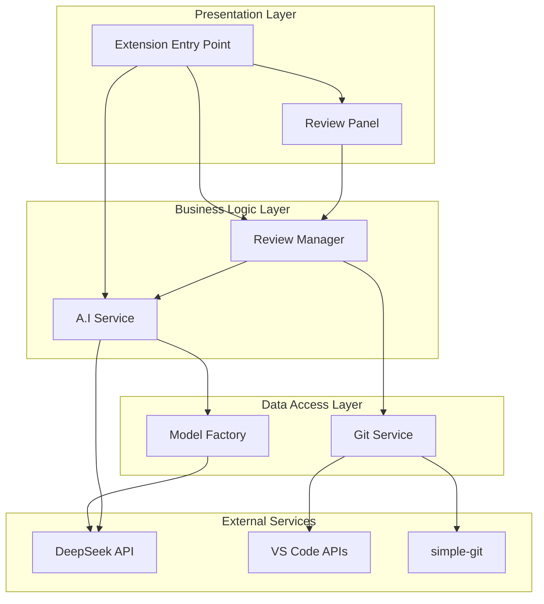
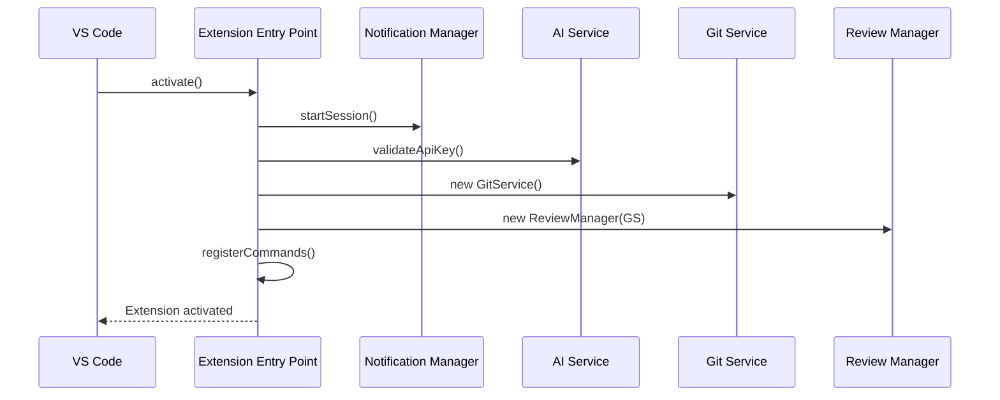
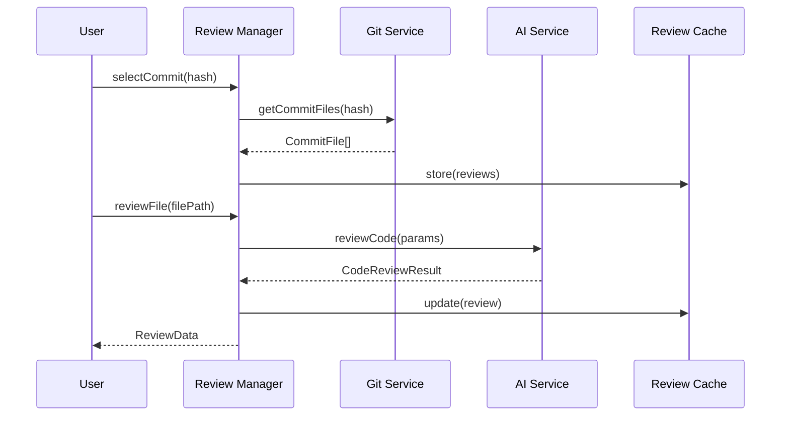
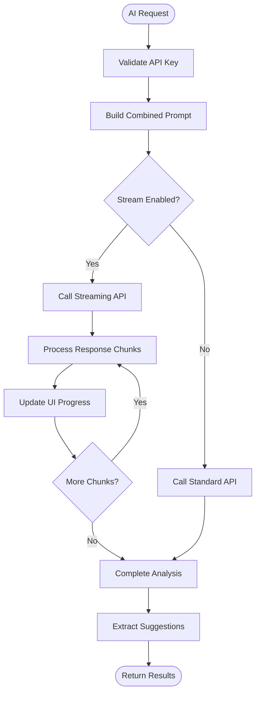
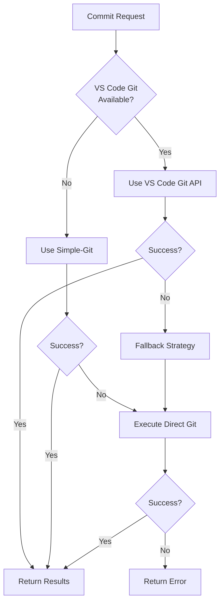
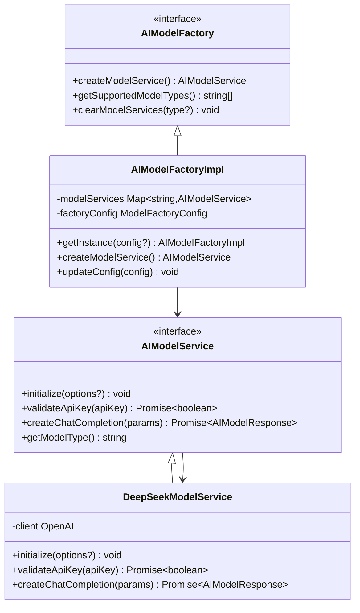
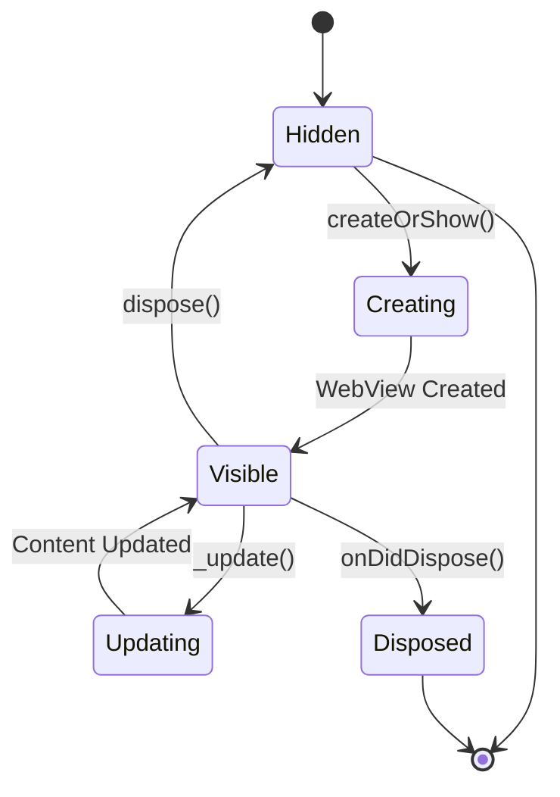

# Core Modules

<cite>
**Referenced Files in This Document**
- [extension.ts](file://src/extension.ts)
- [reviewManager.ts](file://src/services/review/reviewManager.ts)
- [aiService.ts](file://src/services/ai/aiService.ts)
- [gitService.ts](file://src/services/git/gitService.ts)
- [modelFactory.ts](file://src/models/modelFactory.ts)
- [reviewPanel.ts](file://src/ui/views/reviewPanel.ts)
- [baseModel.ts](file://src/models/baseModel.ts)
- [baseModelAdapter.ts](file://src/models/baseModelAdapter.ts)
- [modelInterface.ts](file://src/models/modelInterface.ts)
- [chatTypes.ts](file://src/models/chatTypes.ts)
- [types.ts](file://src/models/types.ts)
- [deepseek.ts](file://src/models/providers/deepseek.ts)
</cite>

## Table of Contents
1. [Introduction](#introduction)
2. [Architecture Overview](#architecture-overview)
3. [Extension Entry Point](#extension-entry-point)
4. [Review Manager](#review-manager)
5. [AI Service](#ai-service)
6. [Git Service](#git-service)
7. [Model Factory](#model-factory)
8. [Review Panel](#review-panel)
9. [Integration Context](#integration-context)
10. [Error Recovery Strategies](#error-recovery-strategies)
11. [Configuration Dependencies](#configuration-dependencies)

## Introduction

CodeKarmic is a sophisticated Visual Studio Code extension that provides intelligent code review capabilities through AI-powered analysis. The extension consists of five core modules that work together to deliver a seamless code review experience: Extension Entry Point, Review Manager, AI Service, Git Service, and Model Factory. These modules are designed with clear separation of concerns, enabling robust error handling, efficient resource management, and extensible architecture for future enhancements.

## Architecture Overview

The CodeKarmic extension follows a layered architecture pattern with clear boundaries between presentation, business logic, and data access layers. The core modules interact through well-defined interfaces, enabling loose coupling and high testability.

**Diagram sources**
- [extension.ts](file://src/extension.ts#L1-L50)
- [reviewManager.ts](file://src/services/review/reviewManager.ts#L1-L50)
- [aiService.ts](file://src/services/ai/aiService.ts#L1-L50)
- [gitService.ts](file://src/services/git/gitService.ts#L1-L50)
- [modelFactory.ts](file://src/models/modelFactory.ts#L1-L50)

## Extension Entry Point

The extension entry point serves as the central orchestrator for the entire CodeKarmic system. It manages the lifecycle of all core services, registers commands, and initializes the user interface components.

### Role and Responsibilities

The extension entry point performs several critical functions:

**Service Initialization**: Creates and configures all core services with appropriate dependencies. The initialization follows a specific order to ensure proper dependency resolution.

**Command Registration**: Registers all VS Code commands with their corresponding handlers, enabling user interactions through the command palette and context menus.

**Configuration Management**: Validates and applies user configuration settings, including API keys and model preferences.

**Session Management**: Handles extension activation and deactivation, managing resources and cleanup operations.

### Lifecycle Management

The extension follows a structured lifecycle pattern:

**Diagram sources**
- [extension.ts](file://src/extension.ts#L20-L100)

### Command Registration

The extension registers numerous commands for different functionalities:

| Command | Purpose | Handler |
|---------|---------|---------|
| `codekarmic.configureApiKey` | Configure API key | API key validation and storage |
| `codekarmic.startReview` | Initialize code review | Repository validation and Git service setup |
| `codekarmic.reviewCode` | Perform code review | AI service integration with error handling |
| `codekarmic.generateReport` | Generate review report | Batch processing and file export |
| `codekarmic.reviewFile` | Open review panel | Webview creation and content rendering |
| `codekarmic.togglePane` | Toggle AI panel | Dynamic panel management |

**Section sources**
- [extension.ts](file://src/extension.ts#L81-L290)

## Review Manager

The Review Manager serves as the central coordinator for code review operations, managing state, coordinating between Git and AI services, and handling session persistence.

### Coordination Between Services

The Review Manager acts as an intermediary between the Git Service and AI Service, orchestrating complex workflows:

**Diagram sources**
- [reviewManager.ts](file://src/services/review/reviewManager.ts#L149-L207)
- [reviewManager.ts](file://src/services/review/reviewManager.ts#L229-L262)

### State Management

The Review Manager maintains comprehensive state for review sessions:

**Commit Selection State**: Tracks the currently selected Git commit, enabling navigation between different review contexts.

**Review Data Cache**: Maintains a Map-based cache of review results, preventing redundant AI analysis and enabling fast retrieval of previously generated suggestions.

**Quality Metrics**: Stores code quality scores and metadata for each reviewed file, supporting trend analysis and improvement tracking.

### Session Handling

The Review Manager implements sophisticated session management:

**Batch Processing**: Supports concurrent processing of multiple files with configurable batch sizes and progress reporting.

**Progress Tracking**: Provides real-time progress updates during intensive operations like report generation.

**Error Recovery**: Implements retry logic and graceful degradation when individual file processing encounters errors.

**Section sources**
- [reviewManager.ts](file://src/services/review/reviewManager.ts#L79-L110)
- [reviewManager.ts](file://src/services/review/reviewManager.ts#L289-L306)

## AI Service

The AI Service provides the core intelligence for code analysis, implementing a sophisticated prompt engineering system and model interaction framework.

### Prompt Formatting and Model Interaction

The AI Service employs a multi-layered approach to prompt engineering:

**Template-Based Generation**: Uses predefined templates for different analysis scenarios, ensuring consistent and high-quality output.

**Context-Aware Processing**: Dynamically adjusts prompts based on file type, content size, and analysis requirements.

**Streaming Response Handling**: Supports real-time streaming of AI responses for improved user experience during long-running operations.

### Streaming Response Management

The AI Service implements comprehensive streaming support:

**Diagram sources**
- [aiService.ts](file://src/services/ai/aiService.ts#L260-L386)

### Batch Processing Capabilities

The AI Service supports efficient batch processing for multiple files:

**Token Optimization**: Groups files by size and content type to maximize token utilization while respecting model limits.

**Parallel Execution**: Processes multiple files concurrently with intelligent queuing and resource management.

**Result Aggregation**: Merges individual file analyses into coherent batch results with proper attribution.

**Section sources**
- [aiService.ts](file://src/services/ai/aiService.ts#L431-L552)

## Git Service

The Git Service provides comprehensive Git repository interaction through multiple abstraction layers, ensuring reliability and performance across different environments.

### Repository Interface Design

The Git Service implements a multi-strategy approach to Git operations:

**VS Code Git API Integration**: Leverages VS Code's built-in Git extension for optimal performance and compatibility.

**Simple-Git Library**: Provides a robust fallback mechanism using the simple-git library for broader compatibility.

**Direct Git Commands**: Executes raw Git commands for specialized operations requiring fine-grained control.

### Commit Data Retrieval

The Git Service offers sophisticated commit data extraction:

**Diagram sources**
- [gitService.ts](file://src/services/git/gitService.ts#L720-L794)

### Diff Content Processing

The Git Service implements intelligent diff generation:

**Multi-Method Strategy**: Tries VS Code Git API, simple-git, and direct Git commands in sequence.

**Content Optimization**: Handles large files efficiently with compression and selective processing.

**Format Preservation**: Maintains diff format consistency across different retrieval methods.

**Section sources**
- [gitService.ts](file://src/services/git/gitService.ts#L110-L178)
- [gitService.ts](file://src/services/git/gitService.ts#L707-L794)

## Model Factory

The Model Factory implements a pluggable architecture for AI model integration, supporting multiple model providers through a unified interface.

### Pluggable AI Model Architecture

The Model Factory follows the Factory Pattern to create model service instances:

**Diagram sources**
- [modelFactory.ts](file://src/models/modelFactory.ts#L19-L140)
- [modelInterface.ts](file://src/models/modelInterface.ts#L39-L62)
- [deepseek.ts](file://src/models/providers/deepseek.ts#L11-L149)

### Adapter Pattern Usage

The Model Factory incorporates the Adapter Pattern to integrate different model implementations:

**Base Model Abstraction**: Provides a common interface for all model implementations through the BaseModel abstract class.

**Adapter Implementation**: Converts between different model interfaces using the BaseModelAdapter.

**Service Caching**: Implements intelligent caching to reuse model service instances and reduce initialization overhead.

### Instantiation Logic

The Model Factory implements sophisticated instantiation logic:

**Configuration-Driven Creation**: Creates model services based on user configuration and runtime requirements.

**Lazy Initialization**: Defers model service creation until actually needed, reducing startup overhead.

**Error Handling**: Provides graceful degradation when model initialization fails.

**Section sources**
- [modelFactory.ts](file://src/models/modelFactory.ts#L58-L114)
- [baseModelAdapter.ts](file://src/models/baseModelAdapter.ts#L9-L74)

## Review Panel

The Review Panel provides the user interface for code review activities, implementing a sophisticated webview-based architecture with dynamic content rendering.

### WebView Lifecycle Management

The Review Panel manages a complex webview lifecycle:

**Diagram sources**
- [reviewPanel.ts](file://src/ui/views/reviewPanel.ts#L78-L124)

### Message Passing Architecture

The Review Panel implements bidirectional communication with the webview:

**Command Processing**: Handles user actions from the webview and translates them into service calls.

**State Synchronization**: Keeps the webview content synchronized with the underlying review data.

**Progress Reporting**: Updates the webview with progress information during long-running operations.

### Dynamic Content Rendering

The Review Panel generates dynamic HTML content based on review data:

**Tabbed Interface**: Implements a tabbed layout for organizing different types of review information.

**Real-Time Updates**: Automatically refreshes content when review data changes.

**Interactive Elements**: Provides interactive controls for adding comments, requesting AI analysis, and generating reports.

**Section sources**
- [reviewPanel.ts](file://src/ui/views/reviewPanel.ts#L46-L75)
- [reviewPanel.ts](file://src/ui/views/reviewPanel.ts#L242-L380)

## Integration Context

The core modules integrate through well-defined interfaces and dependency injection patterns, ensuring loose coupling and high maintainability.

### Module Interdependencies

The modules exhibit a hierarchical dependency structure:

**Extension Entry Point** depends on all other modules and coordinates their initialization.

**Review Manager** depends on both **Git Service** and **AI Service** for its core functionality.

**AI Service** depends on **Model Factory** for model instantiation and **Git Service** for commit data.

**Review Panel** depends on **Review Manager** for review data and state management.

### Configuration Dependencies

Each module has specific configuration requirements:

**Extension Entry Point**: Requires API key configuration and model type selection.

**Review Manager**: Depends on Git repository availability and commit selection.

**AI Service**: Requires valid API credentials and model configuration.

**Git Service**: Needs repository path and Git installation.

**Model Factory**: Configures model-specific parameters and caching behavior.

## Error Recovery Strategies

The CodeKarmic extension implements comprehensive error recovery mechanisms across all core modules.

### Multi-Level Error Handling

Each module implements error handling at different levels:

**Module-Level**: Individual modules handle their own errors gracefully.

**Service-Level**: Services provide fallback mechanisms and retry logic.

**Application-Level**: The extension entry point manages overall application health.

### Recovery Mechanisms

**API Key Validation**: Automatic validation and user prompting for missing or invalid API keys.

**Service Degradation**: Graceful fallback to simpler operations when advanced features fail.

**Caching Strategies**: Intelligent caching prevents repeated failures and improves performance.

**Retry Logic**: Exponential backoff retry for transient failures.

## Configuration Dependencies

The core modules rely on various configuration sources:

### Application Configuration

**API Keys**: Stored securely and validated before use.

**Model Settings**: Configurable model parameters and provider selection.

**Feature Flags**: Runtime toggles for experimental features.

### Environment Dependencies

**VS Code Extensions**: Relies on VS Code Git extension for optimal performance.

**Git Installation**: Requires Git CLI for certain operations.

**Network Connectivity**: Depends on internet access for AI model interactions.

**File System Access**: Requires read/write permissions for repository operations.

The CodeKarmic extension demonstrates sophisticated software architecture through its modular design, comprehensive error handling, and flexible integration patterns. Each core module plays a distinct role while maintaining clear interfaces and robust communication channels, enabling reliable and scalable code review capabilities.