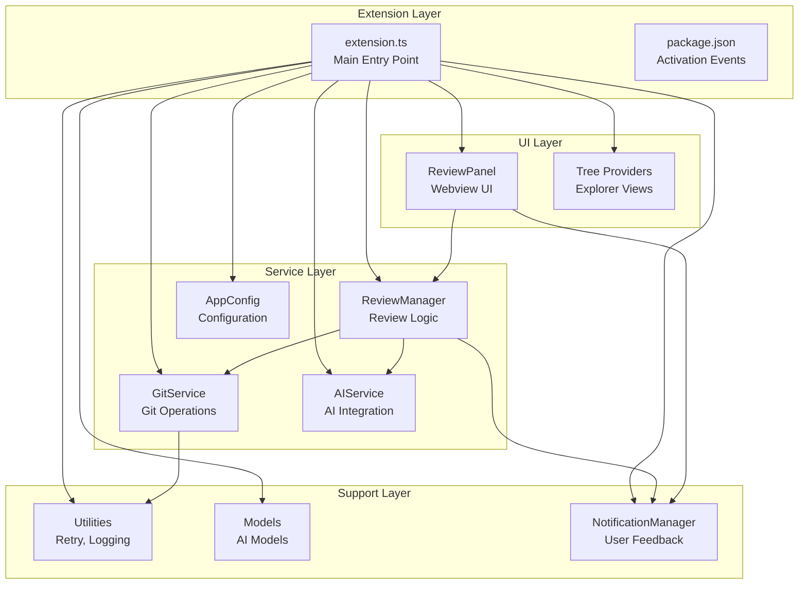
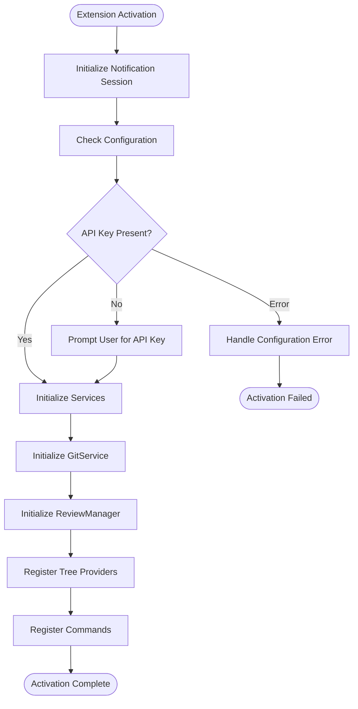
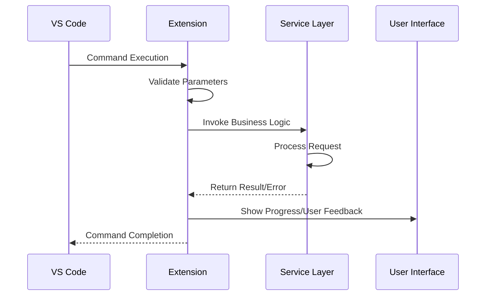
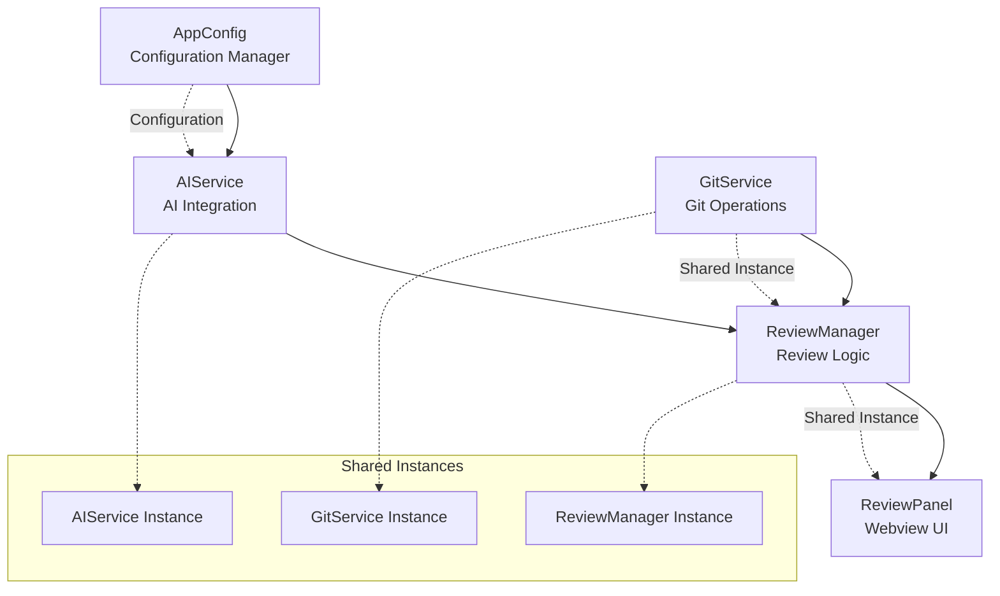
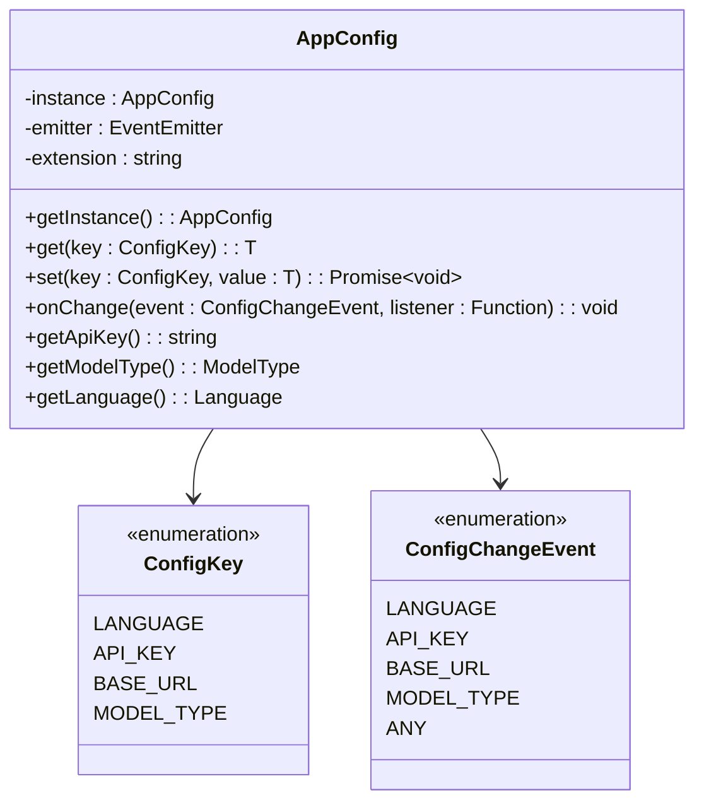
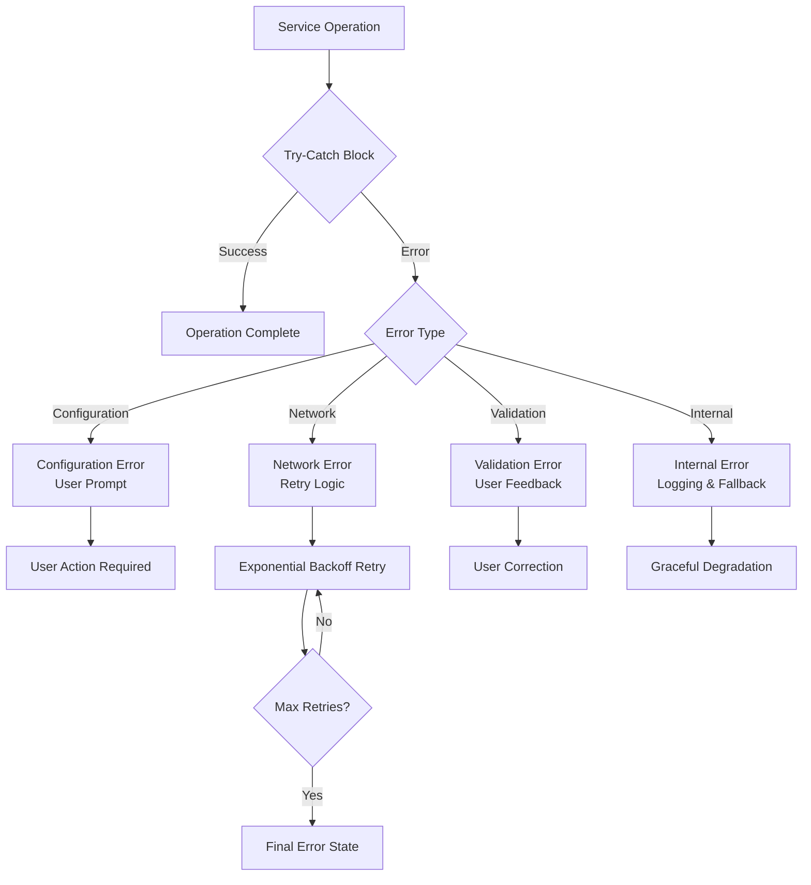
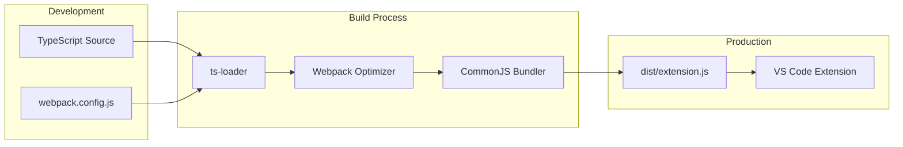
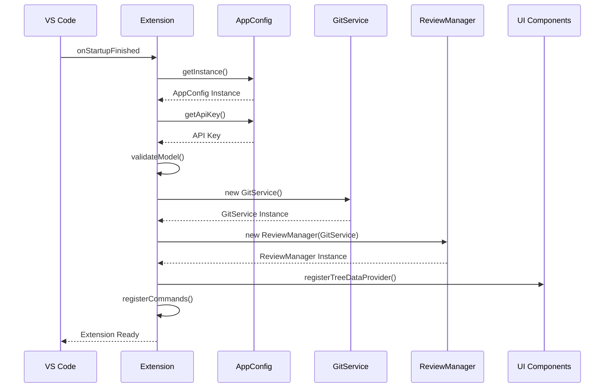

# Extension Entry Point

<cite>
**Referenced Files in This Document**
- [extension.ts](file://src/extension.ts)
- [package.json](file://package.json)
- [webpack.config.js](file://webpack.config.js)
- [appConfig.ts](file://src/config/appConfig.ts)
- [gitService.ts](file://src/services/git/gitService.ts)
- [reviewManager.ts](file://src/services/review/reviewManager.ts)
- [reviewPanel.ts](file://src/ui/views/reviewPanel.ts)
- [aiService.ts](file://src/services/ai/aiService.ts)
- [retryUtils.ts](file://src/utils/retryUtils.ts)
</cite>

## Table of Contents
1. [Introduction](#introduction)
2. [Extension Architecture Overview](#extension-architecture-overview)
3. [Entry Point Analysis](#entry-point-analysis)
4. [Command Registration System](#command-registration-system)
5. [Service Initialization](#service-initialization)
6. [Configuration Management](#configuration-management)
7. [Error Handling and Recovery](#error-handling-and-recovery)
8. [Integration Patterns](#integration-patterns)
9. [Build and Bundling](#build-and-bundling)
10. [Startup Sequence](#startup-sequence)
11. [Troubleshooting Guide](#troubleshooting-guide)
12. [Conclusion](#conclusion)

## Introduction

The CodeKarmic VS Code extension serves as an AI-powered code review tool that integrates seamlessly with Git repositories to provide intelligent code analysis and review capabilities. The extension's entry point, `extension.ts`, acts as the central orchestrator that manages the entire extension lifecycle, from activation to deactivation, while coordinating multiple interconnected services and components.

This documentation provides a comprehensive analysis of the extension's entry point, detailing its role in activating the extension, registering commands, initializing core services, and managing the overall extension lifecycle. The entry point demonstrates sophisticated patterns for error handling, configuration management, and service coordination that serve as excellent examples for VS Code extension development.

## Extension Architecture Overview

The CodeKarmic extension follows a modular architecture with clear separation of concerns across multiple layers:

**Diagram sources**
- [extension.ts](file://src/extension.ts#L1-L50)
- [gitService.ts](file://src/services/git/gitService.ts#L45-L70)
- [reviewManager.ts](file://src/services/review/reviewManager.ts#L79-L95)

**Section sources**
- [extension.ts](file://src/extension.ts#L1-L100)
- [package.json](file://package.json#L26-L35)

## Entry Point Analysis

The extension's main entry point is defined in `extension.ts` and implements the standard VS Code extension activation pattern. The entry point serves multiple critical functions:

### Activation Function Structure

The `activate()` function implements a comprehensive initialization sequence that handles:

1. **Session Management**: Initializes the notification system to ensure output panels are visible
2. **Configuration Validation**: Validates model configuration and API key presence
3. **Service Initialization**: Creates and configures core services with shared instances
4. **Command Registration**: Registers all extension commands with appropriate handlers
5. **UI Provider Setup**: Establishes tree data providers for explorer views
6. **Error Handling**: Implements robust error handling with user-friendly feedback

### Key Initialization Patterns

The entry point demonstrates several important initialization patterns:

**Diagram sources**
- [extension.ts](file://src/extension.ts#L20-L100)
- [appConfig.ts](file://src/config/appConfig.ts#L49-L88)

**Section sources**
- [extension.ts](file://src/extension.ts#L20-L100)

## Command Registration System

The extension registers numerous commands that provide comprehensive functionality for code review operations. The command registration follows a consistent pattern with proper error handling and user feedback mechanisms.

### Core Commands Overview

| Command | Purpose | Handler Pattern |
|---------|---------|----------------|
| `codekarmic.startReview` | Initialize code review session | Workspace validation → Git initialization → UI activation |
| `codekarmic.reviewCode` | Perform AI code analysis | Content validation → API key check → AI service invocation |
| `codekarmic.viewFile` | Open file in review panel | File path validation → Panel creation → Content display |
| `codekarmic.reviewExplorerItem` | Review selected files/folders | Selection validation → Batch processing → Progress reporting |
| `codekarmic.generateReport` | Create comprehensive review report | Commit validation → Parallel processing → Report generation |
| `codekarmic.configureApiKey` | Configure AI service credentials | Input validation → API verification → Configuration update |

### Command Registration Pattern

The extension uses a consistent pattern for command registration that ensures proper error handling and user feedback:

**Diagram sources**
- [extension.ts](file://src/extension.ts#L81-L120)
- [extension.ts](file://src/extension.ts#L140-L180)

### Advanced Command Features

The extension implements several advanced command features:

1. **Progress Tracking**: Commands that take significant time show progress indicators
2. **Cancellation Support**: Long-running operations can be cancelled by users
3. **Batch Processing**: Commands can process multiple items efficiently
4. **Error Recovery**: Commands implement retry logic for transient failures
5. **Context Awareness**: Commands adapt behavior based on current context

**Section sources**
- [extension.ts](file://src/extension.ts#L81-L240)
- [extension.ts](file://src/extension.ts#L404-L433)

## Service Initialization

The extension initializes multiple core services with careful attention to dependency management and shared instance patterns. The initialization follows a hierarchical approach where services depend on each other in a well-defined order.

### Service Dependency Graph

**Diagram sources**
- [extension.ts](file://src/extension.ts#L68-L76)
- [reviewManager.ts](file://src/services/review/reviewManager.ts#L79-L95)

### GitService Initialization

The GitService initialization demonstrates robust error handling and validation:

1. **Path Validation**: Ensures the repository path exists and contains a `.git` directory
2. **Repository Detection**: Validates that the path is a valid Git repository
3. **Instance Sharing**: Creates a single GitService instance shared across all components
4. **Error Recovery**: Handles various failure scenarios gracefully

### ReviewManager Initialization

The ReviewManager serves as the central coordinator for review operations:

1. **Dependency Injection**: Receives a shared GitService instance
2. **State Management**: Maintains review state and metadata
3. **Parallel Processing**: Supports concurrent review operations
4. **Caching Strategy**: Implements intelligent caching for performance

**Section sources**
- [extension.ts](file://src/extension.ts#L68-L76)
- [gitService.ts](file://src/services/git/gitService.ts#L64-L108)
- [reviewManager.ts](file://src/services/review/reviewManager.ts#L79-L130)

## Configuration Management

The extension implements a sophisticated configuration management system through the AppConfig class, which provides centralized access to all configuration settings with event-driven notifications for changes.

### Configuration Architecture

**Diagram sources**
- [appConfig.ts](file://src/config/appConfig.ts#L49-L88)
- [appConfig.ts](file://src/config/appConfig.ts#L22-L35)

### Configuration Validation

The extension implements comprehensive configuration validation:

1. **API Key Validation**: Ensures API key is present and valid before enabling AI features
2. **Model Type Validation**: Validates AI model configuration
3. **Workspace Validation**: Checks for valid workspace folders
4. **Error Recovery**: Provides fallback configurations and user prompts

### Dynamic Configuration Updates

The configuration system supports real-time updates:

- **Event-driven Changes**: Listens for VS Code configuration changes
- **Hot Reloading**: Applies configuration changes without restart
- **Validation Hooks**: Triggers validation when critical settings change

**Section sources**
- [appConfig.ts](file://src/config/appConfig.ts#L49-L189)
- [extension.ts](file://src/extension.ts#L35-L66)

## Error Handling and Recovery

The extension implements comprehensive error handling strategies that provide graceful degradation and user-friendly error messages across all operational contexts.

### Error Handling Patterns

**Diagram sources**
- [extension.ts](file://src/extension.ts#L515-L520)
- [retryUtils.ts](file://src/utils/retryUtils.ts#L33-L70)

### API Key Configuration Error Handling

The extension implements sophisticated API key error handling:

1. **Missing API Key Detection**: Identifies when API key is not configured
2. **User Prompt Strategy**: Offers multiple ways to configure API key
3. **Validation Feedback**: Provides immediate feedback on API key validity
4. **Fallback Mechanisms**: Allows continued operation with manual configuration

### Git Initialization Error Recovery

The Git service implements robust error recovery:

1. **Path Validation**: Early detection of invalid repository paths
2. **Repository Verification**: Confirmation that paths contain valid Git repositories
3. **Graceful Degradation**: Continues operation with reduced functionality when Git is unavailable
4. **Retry Logic**: Attempts multiple initialization strategies for Git repositories

### AI Service Error Management

The AI service implements comprehensive error handling:

1. **API Key Validation**: Ensures API key is configured before making requests
2. **Rate Limiting**: Handles rate limiting and implements backoff strategies
3. **Content Processing**: Manages large file processing with compression
4. **Fallback Responses**: Provides meaningful error messages when AI services are unavailable

**Section sources**
- [extension.ts](file://src/extension.ts#L35-L66)
- [gitService.ts](file://src/services/git/gitService.ts#L64-L108)
- [aiService.ts](file://src/services/ai/aiService.ts#L74-L123)

## Integration Patterns

The extension demonstrates several sophisticated integration patterns that enable seamless interaction between different components and external systems.

### Webpack Integration

The extension uses webpack for bundling and optimizing the extension code:

**Diagram sources**
- [webpack.config.js](file://webpack.config.js#L1-L48)
- [package.json](file://package.json#L36-L36)

### VS Code API Integration

The extension integrates deeply with VS Code APIs:

1. **Tree View Providers**: Implements custom tree views for commit and file exploration
2. **Webview Panels**: Creates interactive webview panels for code review
3. **Command Palette**: Integrates with VS Code's command palette
4. **Settings Management**: Leverages VS Code's settings infrastructure
5. **Output Channels**: Uses VS Code's output channels for logging

### External Service Integration

The extension integrates with external services:

1. **AI Services**: Connects to OpenAI-compatible APIs for code analysis
2. **Git Integration**: Works with VS Code's built-in Git support
3. **File System**: Accesses file system through VS Code's workspace APIs
4. **Notification System**: Integrates with VS Code's notification system

**Section sources**
- [webpack.config.js](file://webpack.config.js#L1-L48)
- [extension.ts](file://src/extension.ts#L74-L80)
- [reviewPanel.ts](file://src/ui/views/reviewPanel.ts#L78-L124)

## Build and Bundling

The extension uses webpack for building and bundling the TypeScript source code into a single JavaScript file suitable for VS Code distribution.

### Webpack Configuration Analysis

The webpack configuration demonstrates several important build patterns:

1. **Entry Point Configuration**: Specifies `src/extension.ts` as the main entry point
2. **Target Environment**: Targets Node.js environment for VS Code extension
3. **Output Configuration**: Produces a CommonJS module compatible with VS Code
4. **Module Resolution**: Configures TypeScript and Node.js module resolution
5. **External Dependencies**: Excludes VS Code as an external dependency

### Build Optimization Strategies

The build process implements several optimization strategies:

1. **Code Splitting**: Separates VS Code API from extension logic
2. **Tree Shaking**: Removes unused code from the final bundle
3. **Source Maps**: Provides debugging support with hidden source maps
4. **Minification**: Reduces bundle size for faster loading

**Section sources**
- [webpack.config.js](file://webpack.config.js#L1-L48)
- [package.json](file://package.json#L282-L292)

## Startup Sequence

The extension follows a carefully orchestrated startup sequence that ensures all components are properly initialized before becoming available to users.

### Activation Event Flow

**Diagram sources**
- [extension.ts](file://src/extension.ts#L20-L100)
- [package.json](file://package.json#L26-L35)

### Initialization Phases

The extension goes through distinct initialization phases:

1. **Preparation Phase**: Session initialization and configuration validation
2. **Service Phase**: Core service instantiation and dependency injection
3. **Registration Phase**: Command and provider registration
4. **Activation Phase**: UI component setup and ready state

### Deferred Initialization

Some components use deferred initialization to improve startup performance:

1. **Lazy Loading**: Services are instantiated only when needed
2. **Conditional Registration**: Commands are registered based on availability
3. **Progressive Enhancement**: Features are added progressively as dependencies become available

**Section sources**
- [extension.ts](file://src/extension.ts#L20-L100)
- [package.json](file://package.json#L26-L35)

## Troubleshooting Guide

This section provides guidance for diagnosing and resolving common issues with the extension.

### Common Issues and Solutions

| Issue | Symptoms | Solution |
|-------|----------|----------|
| API Key Not Configured | Commands fail with "API key not configured" | Run `Configure API Key` command or set in settings |
| Git Repository Not Found | "Not a git repository" errors | Ensure workspace contains a valid Git repository |
| Extension Activation Failed | Extension doesn't appear in command palette | Check VS Code output for error messages |
| Slow Performance | Commands take excessive time to execute | Verify Git repository size and network connectivity |
| AI Service Unavailable | AI review commands fail silently | Check API key validity and network connectivity |

### Diagnostic Commands

The extension provides several diagnostic capabilities:

1. **Debug Git Functionality**: Comprehensive Git repository inspection
2. **Configuration Validation**: Verifies all configuration settings
3. **Service Health Checks**: Monitors service availability and performance
4. **Error Reporting**: Collects detailed error information for debugging

### Performance Optimization

For optimal performance:

1. **Repository Size**: Keep Git repositories reasonably sized
2. **API Rate Limits**: Monitor API usage to avoid rate limiting
3. **Memory Usage**: Close unused review panels to free memory
4. **Network Connectivity**: Ensure stable internet connection for AI services

**Section sources**
- [extension.ts](file://src/extension.ts#L515-L520)
- [extension.ts](file://src/extension.ts#L589-L660)

## Conclusion

The CodeKarmic extension's entry point demonstrates exemplary practices for VS Code extension development. It showcases sophisticated patterns for service initialization, error handling, configuration management, and user experience design.

Key architectural strengths include:

1. **Modular Design**: Clear separation of concerns across multiple layers
2. **Robust Error Handling**: Comprehensive error recovery and user feedback
3. **Configuration Management**: Centralized and dynamic configuration system
4. **Service Integration**: Seamless integration with VS Code APIs and external services
5. **Performance Optimization**: Efficient resource utilization and lazy loading
6. **User Experience**: Intuitive command structure and helpful error messages

The extension serves as an excellent reference implementation for developers building VS Code extensions that require complex service orchestration, external API integration, and sophisticated user interaction patterns. Its comprehensive error handling, configuration management, and service initialization patterns provide valuable insights for building reliable and user-friendly VS Code extensions.