# Git Service

<cite>
**Referenced Files in This Document**
- [gitService.ts](file://src/services/git/gitService.ts)
- [versionControlTypes.ts](file://src/services/git/versionControlTypes.ts)
- [notificationManager.ts](file://src/services/notification/notificationManager.ts)
- [logger.ts](file://src/utils/logger.ts)
- [output.ts](file://src/i18n/en/output.ts)
- [constants.ts](file://src/constants/constants.ts)
- [commitExplorer.ts](file://src/ui/components/commitExplorer.ts)
- [reviewPanel.ts](file://src/ui/views/reviewPanel.ts)
</cite>

## Table of Contents
1. [Introduction](#introduction)
2. [Architecture Overview](#architecture-overview)
3. [Core Components](#core-components)
4. [Key Methods Implementation](#key-methods-implementation)
5. [Error Handling and Logging](#error-handling-and-logging)
6. [Integration with VS Code](#integration-with-vs-code)
7. [Performance Considerations](#performance-considerations)
8. [Caching Strategies](#caching-strategies)
9. [File Encoding and Compatibility](#file-encoding-and-compatibility)
10. [Usage Examples](#usage-examples)
11. [Troubleshooting Guide](#troubleshooting-guide)
12. [Conclusion](#conclusion)

## Introduction

The GitService serves as the primary interface between CodeKarmic and Git repositories, providing comprehensive functionality for retrieving commit history, file changes, and repository metadata. Built using the simple-git library, it offers robust methods for interacting with Git repositories while maintaining high performance and reliability.

The service acts as a bridge between the VS Code extension and Git operations, enabling features such as commit exploration, file diff generation, and code review capabilities. It implements multiple fallback strategies for Git operations and provides extensive error handling to ensure smooth user experience.

## Architecture Overview

The GitService follows a layered architecture pattern with clear separation of concerns:

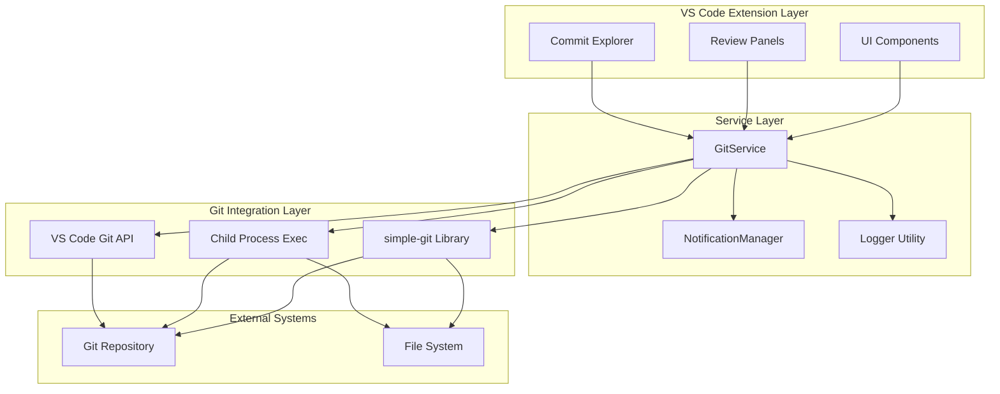

**Diagram sources**
- [gitService.ts](file://src/services/git/gitService.ts#L45-L1201)
- [notificationManager.ts](file://src/services/notification/notificationManager.ts#L8-L213)

**Section sources**
- [gitService.ts](file://src/services/git/gitService.ts#L1-L50)

## Core Components

### GitService Class Structure

The GitService class encapsulates all Git-related functionality with the following key components:

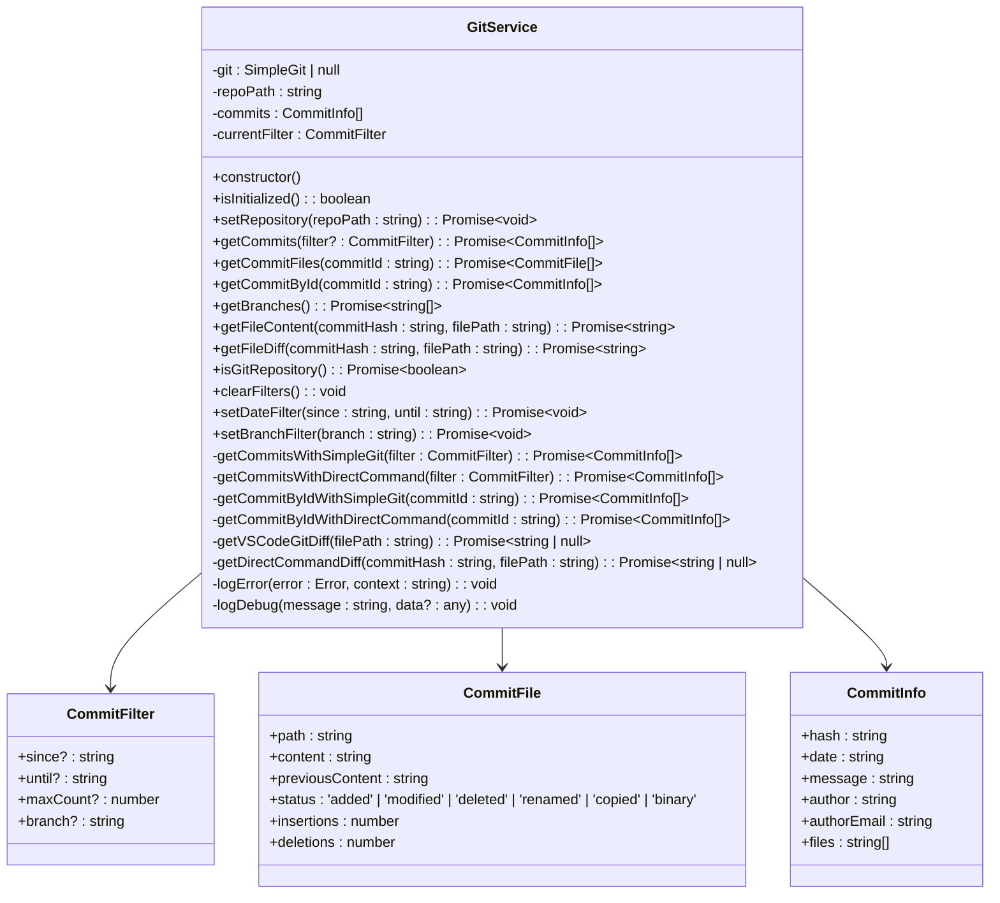

**Diagram sources**
- [gitService.ts](file://src/services/git/gitService.ts#L12-L35)
- [versionControlTypes.ts](file://src/services/git/versionControlTypes.ts#L7-L80)

### Type Definitions

The service utilizes several key interfaces for data structure:

| Interface | Purpose | Key Properties |
|-----------|---------|----------------|
| `CommitFilter` | Repository filtering criteria | `since`, `until`, `maxCount`, `branch` |
| `CommitFile` | File change representation | `path`, `content`, `previousContent`, `status`, `insertions`, `deletions` |
| `CommitInfo` | Complete commit information | `hash`, `date`, `message`, `author`, `authorEmail`, `files` |

**Section sources**
- [gitService.ts](file://src/services/git/gitService.ts#L12-L35)
- [versionControlTypes.ts](file://src/services/git/versionControlTypes.ts#L7-L80)

## Key Methods Implementation

### Repository Initialization and Validation

The `setRepository()` method serves as the primary initialization point:

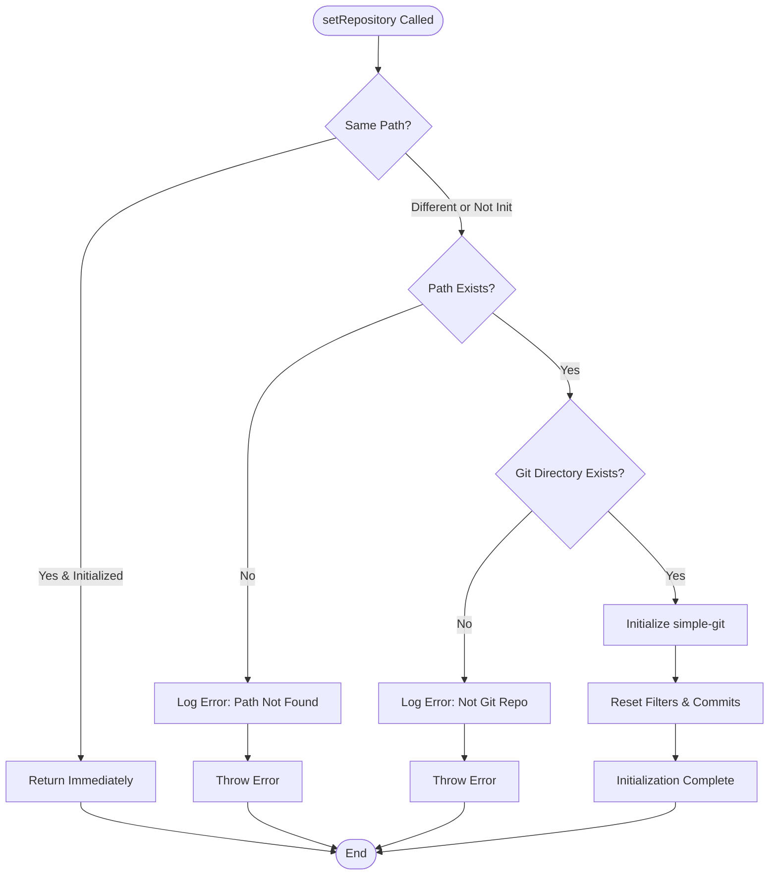

**Diagram sources**
- [gitService.ts](file://src/services/git/gitService.ts#L64-L107)

### Commit Retrieval Methods

The service implements multiple strategies for retrieving commits:

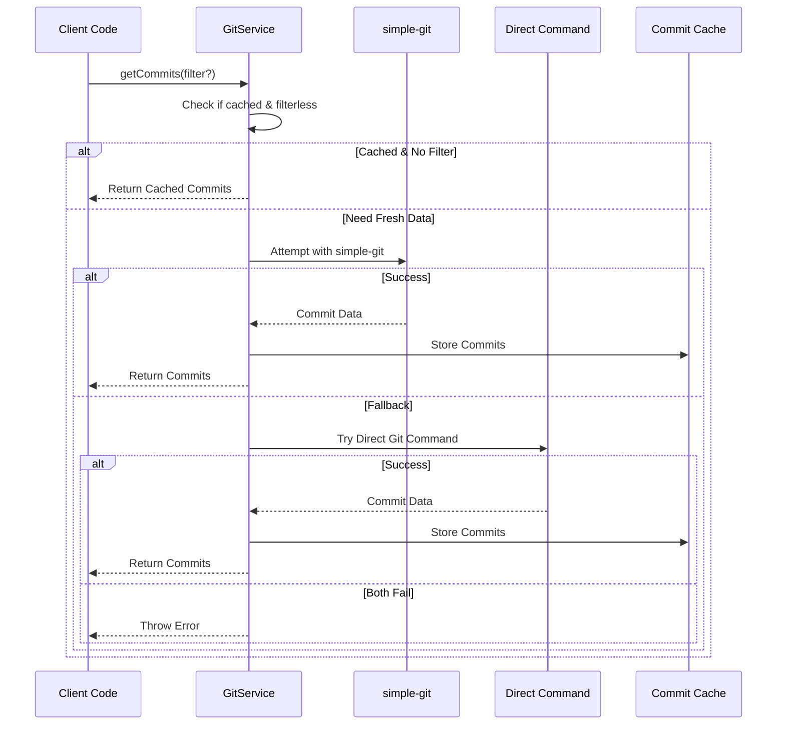

**Diagram sources**
- [gitService.ts](file://src/services/git/gitService.ts#L197-L241)

### File Change Detection

The `getCommitFiles()` method handles various file change scenarios:

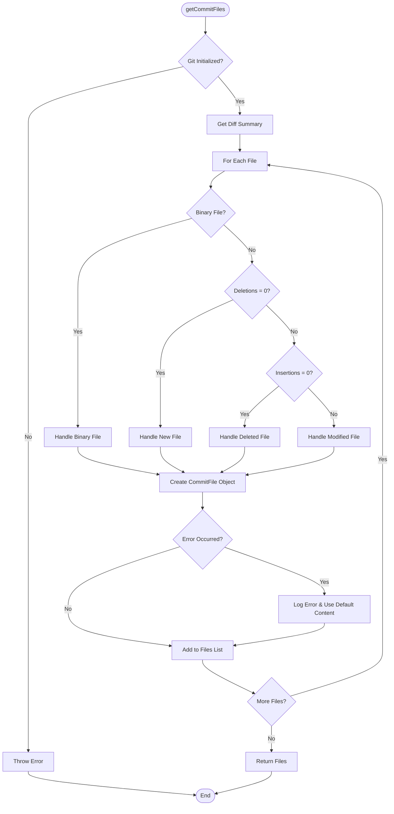

**Diagram sources**
- [gitService.ts](file://src/services/git/gitService.ts#L110-L177)

**Section sources**
- [gitService.ts](file://src/services/git/gitService.ts#L110-L177)

## Error Handling and Logging

### Comprehensive Error Management

The GitService implements a multi-layered error handling approach:

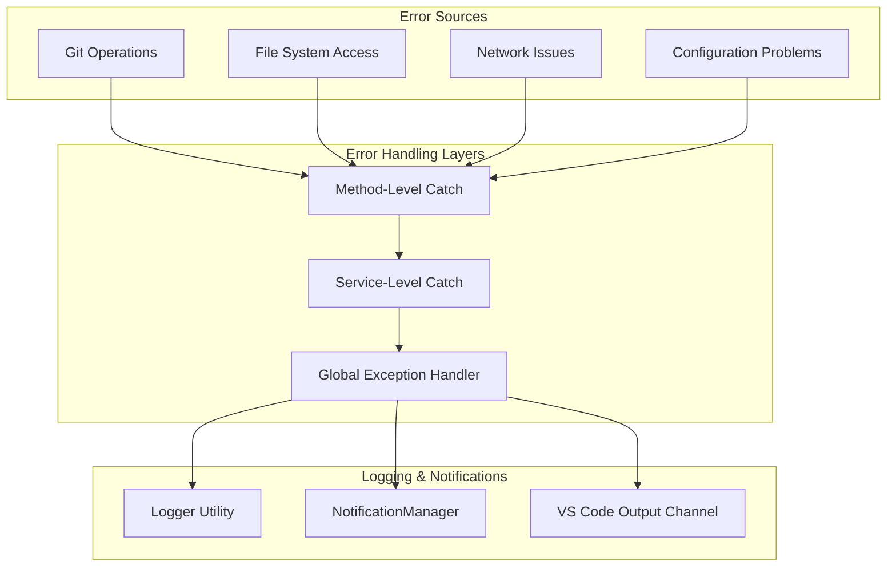

**Diagram sources**
- [gitService.ts](file://src/services/git/gitService.ts#L1195-L1199)
- [notificationManager.ts](file://src/services/notification/notificationManager.ts#L79-L117)

### Logging Implementation

The service uses structured logging with multiple severity levels:

| Log Level | Usage | Example Messages |
|-----------|-------|------------------|
| DEBUG | Development debugging | "Getting file content for {filePath} at commit {commitHash}" |
| INFO | General operations | "Setting date filter: from {since} to {until}" |
| WARN | Recoverable issues | "Fallback method also failed: {error}" |
| ERROR | Critical failures | "Failed to get commits: {error}" |

**Section sources**
- [gitService.ts](file://src/services/git/gitService.ts#L1186-L1199)
- [logger.ts](file://src/utils/logger.ts#L8-L88)

## Integration with VS Code

### VS Code Git API Integration

The service leverages VS Code's native Git capabilities when available:

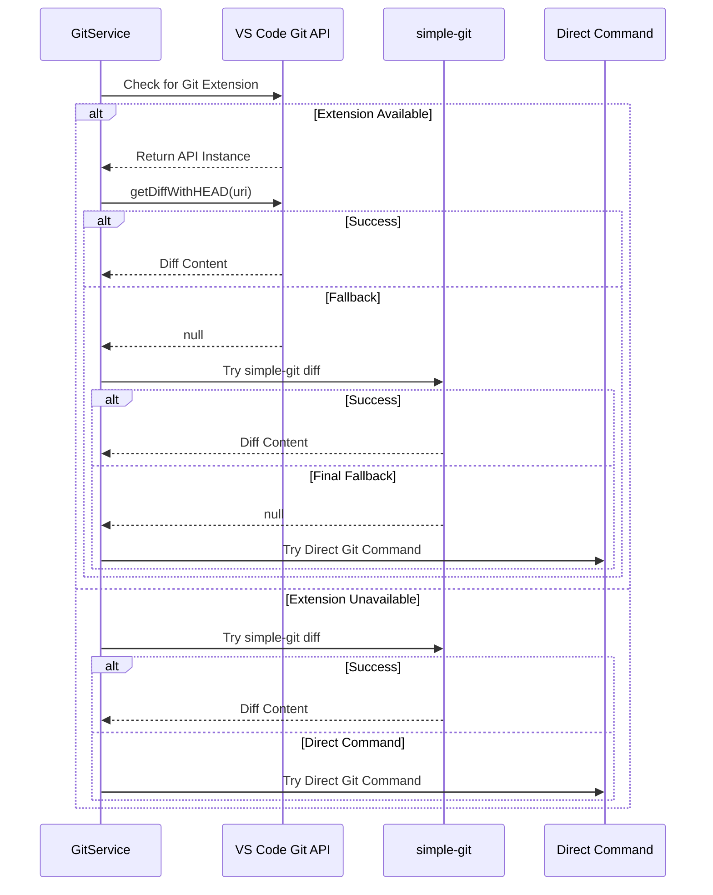

**Diagram sources**
- [gitService.ts](file://src/services/git/gitService.ts#L367-L406)

### UI Component Integration

The GitService integrates seamlessly with VS Code UI components:

| Component | Integration Point | Functionality |
|-----------|------------------|---------------|
| Commit Explorer | TreeDataProvider | Displays commit history and allows selection |
| Review Panel | File-based operations | Enables code review with commit context |
| Status Bar | Progress indication | Shows operation status during Git operations |

**Section sources**
- [commitExplorer.ts](file://src/ui/components/commitExplorer.ts#L1-L172)
- [reviewPanel.ts](file://src/ui/views/reviewPanel.ts#L1-L621)

## Performance Considerations

### Concurrent Process Management

The service optimizes performance through strategic concurrent process management:

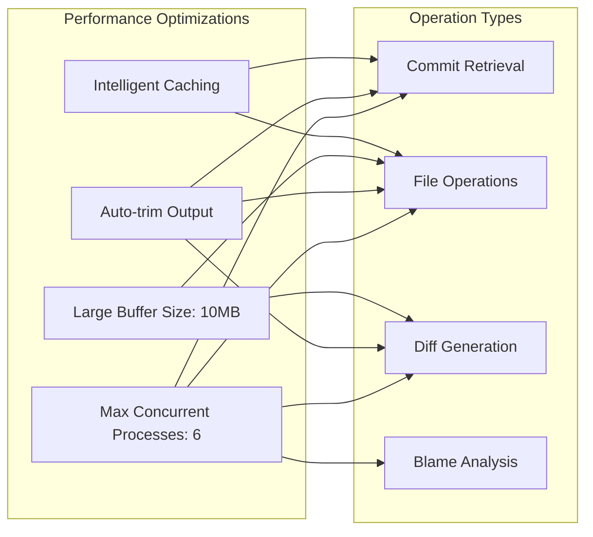

**Diagram sources**
- [gitService.ts](file://src/services/git/gitService.ts#L92-L97)

### Memory Management

The service implements several memory optimization strategies:

| Strategy | Implementation | Benefit |
|----------|----------------|---------|
| Lazy Loading | Commits loaded on demand | Reduces initial memory footprint |
| Content Streaming | Large file content streaming | Prevents memory overflow |
| Cache Invalidation | Automatic cache clearing on filter changes | Maintains cache effectiveness |
| Buffer Limits | 10MB buffer size for Git operations | Prevents out-of-memory errors |

**Section sources**
- [gitService.ts](file://src/services/git/gitService.ts#L825-L846)

## Caching Strategies

### Multi-Level Caching Architecture

The GitService employs a sophisticated caching system:

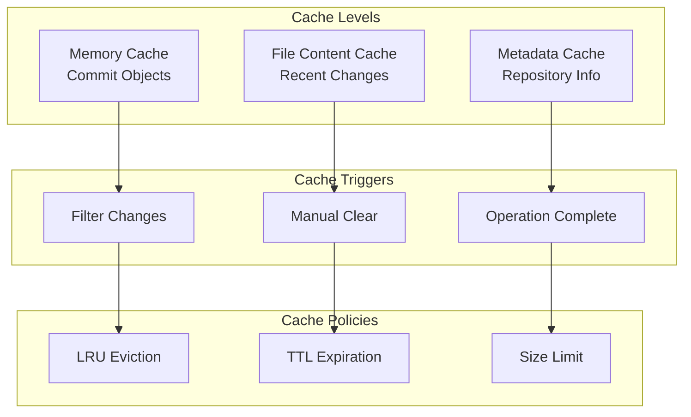

**Diagram sources**
- [gitService.ts](file://src/services/git/gitService.ts#L47-L49)

### Cache Invalidation Strategy

The service implements intelligent cache invalidation:

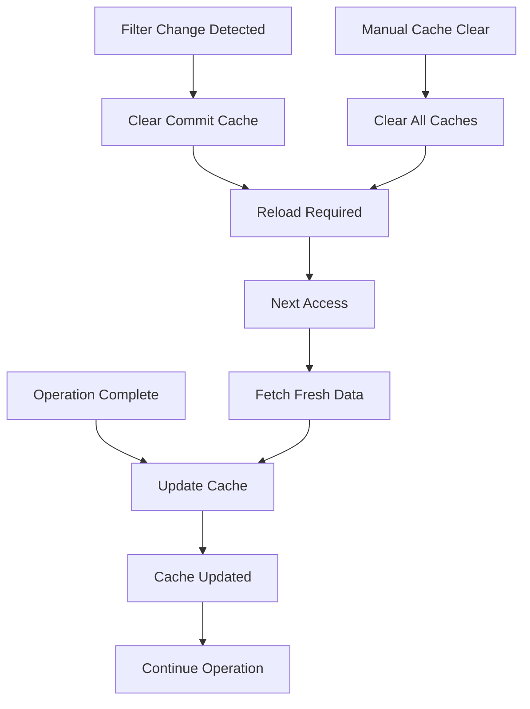

**Diagram sources**
- [gitService.ts](file://src/services/git/gitService.ts#L825-L846)

**Section sources**
- [gitService.ts](file://src/services/git/gitService.ts#L47-L49)
- [gitService.ts](file://src/services/git/gitService.ts#L825-L846)

## File Encoding and Compatibility

### Encoding Handling

The service handles various file encoding scenarios:

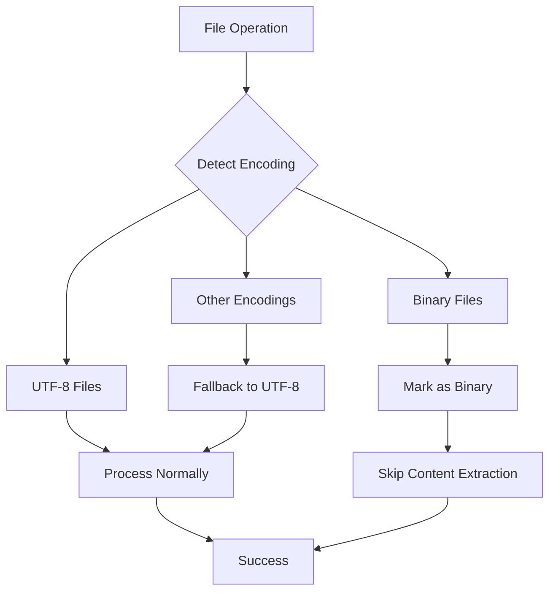

**Diagram sources**
- [gitService.ts](file://src/services/git/gitService.ts#L127-L146)

### Compatibility Features

| Feature | Implementation | Purpose |
|---------|----------------|---------|
| Binary File Support | Special handling for binary files | Prevents corruption during processing |
| Large File Handling | Streaming and chunked processing | Supports files larger than memory capacity |
| Cross-Platform Paths | Path normalization | Ensures compatibility across operating systems |
| Git Version Compatibility | Multiple command strategies | Works with different Git versions |

**Section sources**
- [gitService.ts](file://src/services/git/gitService.ts#L127-L146)

## Usage Examples

### Basic Repository Setup

```typescript
// Initialize GitService with repository path
const gitService = new GitService();
await gitService.setRepository('/path/to/repo');

// Check if repository is valid
const isValid = await gitService.isGitRepository();
console.log(`Is valid Git repository: ${isValid}`);
```

### Commit History Retrieval

```typescript
// Get recent commits with filtering
const commits = await gitService.getCommits({
    maxCount: 50,
    since: '2024-01-01',
    until: '2024-12-31'
});

// Get specific commit by ID
const commit = await gitService.getCommitById('abc1234');
```

### File Change Analysis

```typescript
// Get files changed in a commit
const files = await gitService.getCommitFiles('abc1234');

// Get file content at specific commit
const content = await gitService.getFileContent('abc1234', 'src/main.ts');

// Generate diff for a file
const diff = await gitService.getFileDiff('abc1234', 'src/main.ts');
```

### Branch Operations

```typescript
// Get all branches
const branches = await gitService.getBranches();

// Set branch filter
await gitService.setBranchFilter('develop');
const filteredCommits = await gitService.getCommits();
```

**Section sources**
- [gitService.ts](file://src/services/git/gitService.ts#L64-L107)
- [gitService.ts](file://src/services/git/gitService.ts#L197-L241)
- [gitService.ts](file://src/services/git/gitService.ts#L110-L177)

## Troubleshooting Guide

### Common Issues and Solutions

| Issue | Symptoms | Solution |
|-------|----------|----------|
| Repository Not Found | "Repository path does not exist" error | Verify repository path and ensure it's a valid Git repository |
| Git Operations Timeout | Long delays or hanging operations | Check network connectivity and Git configuration |
| Memory Issues | Out of memory errors with large repositories | Reduce maxCount filter or increase Node.js heap size |
| Encoding Problems | Garbled text in file content | Ensure files use UTF-8 encoding or handle binary files separately |

### Debugging Strategies

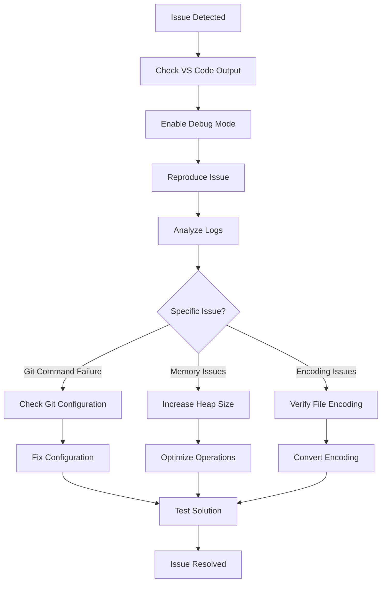

**Diagram sources**
- [gitService.ts](file://src/services/git/gitService.ts#L1186-L1192)

### Performance Optimization Tips

1. **Use Filtering**: Apply appropriate filters to limit the amount of data retrieved
2. **Cache Management**: Clear caches when switching repositories or changing filters
3. **Batch Operations**: Group related operations to minimize Git command overhead
4. **Memory Monitoring**: Monitor memory usage with large repositories

**Section sources**
- [gitService.ts](file://src/services/git/gitService.ts#L1186-L1192)

## Conclusion

The GitService represents a comprehensive and robust solution for Git integration within the CodeKarmic VS Code extension. Its multi-layered architecture, extensive error handling, and performance optimizations make it suitable for both small and large-scale Git repositories.

Key strengths include:

- **Reliability**: Multiple fallback strategies ensure operations succeed even under adverse conditions
- **Performance**: Intelligent caching and concurrent processing optimize response times
- **Flexibility**: Support for various Git configurations and file types
- **Integration**: Seamless integration with VS Code's native Git capabilities

The service continues to evolve with new features and optimizations, maintaining its position as a critical component of the CodeKarmic ecosystem for Git-based code review and analysis.