# Model Factory

<cite>
**Referenced Files in This Document**
- [modelFactory.ts](file://src/models/modelFactory.ts)
- [appConfig.ts](file://src/config/appConfig.ts)
- [deepseek.ts](file://src/models/providers/deepseek.ts)
- [baseModel.ts](file://src/models/baseModel.ts)
- [modelInterface.ts](file://src/models/modelInterface.ts)
- [types.ts](file://src/models/types.ts)
- [chatTypes.ts](file://src/models/chatTypes.ts)
- [modelValidator.ts](file://src/models/modelValidator.ts)
- [aiService.ts](file://src/services/ai/aiService.ts)
- [extension.ts](file://src/extension.ts)
</cite>

## Table of Contents
1. [Introduction](#introduction)
2. [Architecture Overview](#architecture-overview)
3. [Factory Pattern Implementation](#factory-pattern-implementation)
4. [Caching Mechanism](#caching-mechanism)
5. [Configuration Management](#configuration-management)
6. [Model Type Support](#model-type-support)
7. [Integration Examples](#integration-examples)
8. [Extensibility Patterns](#extensibility-patterns)
9. [Error Handling](#error-handling)
10. [Performance Benefits](#performance-benefits)
11. [Best Practices](#best-practices)
12. [Troubleshooting Guide](#troubleshooting-guide)

## Introduction

The ModelFactory serves as the central pluggable architecture for AI model integration in CodeKarmic, implementing the Factory Pattern to create and manage AI model service instances. It provides a unified interface for accessing different AI providers while maintaining optimal performance through intelligent caching mechanisms and robust configuration management.

The factory acts as a singleton service that creates instances of AI model services based on configuration from AppConfig, supporting multiple model types including DeepSeek models with automatic API key injection and validation. Its design enables seamless switching between different AI providers while maintaining consistent interfaces and performance optimizations.

## Architecture Overview

The ModelFactory follows a layered architecture that separates concerns between configuration management, service creation, and caching mechanisms:

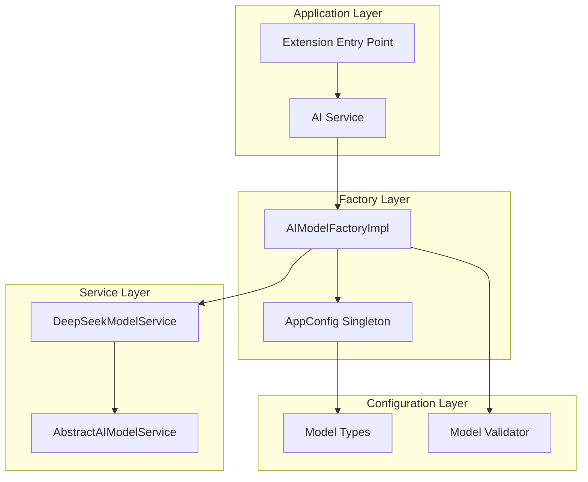

**Diagram sources**
- [modelFactory.ts](file://src/models/modelFactory.ts#L19-L140)
- [appConfig.ts](file://src/config/appConfig.ts#L49-L189)
- [aiService.ts](file://src/services/ai/aiService.ts#L40-L70)

**Section sources**
- [modelFactory.ts](file://src/models/modelFactory.ts#L1-L140)
- [appConfig.ts](file://src/config/appConfig.ts#L1-L189)

## Factory Pattern Implementation

The ModelFactory implements the Factory Pattern through the `AIModelFactory` interface, providing a centralized mechanism for creating AI model service instances. The implementation uses a singleton pattern with lazy initialization and configuration updates.

### Core Factory Interface

The factory defines three primary methods for service management:

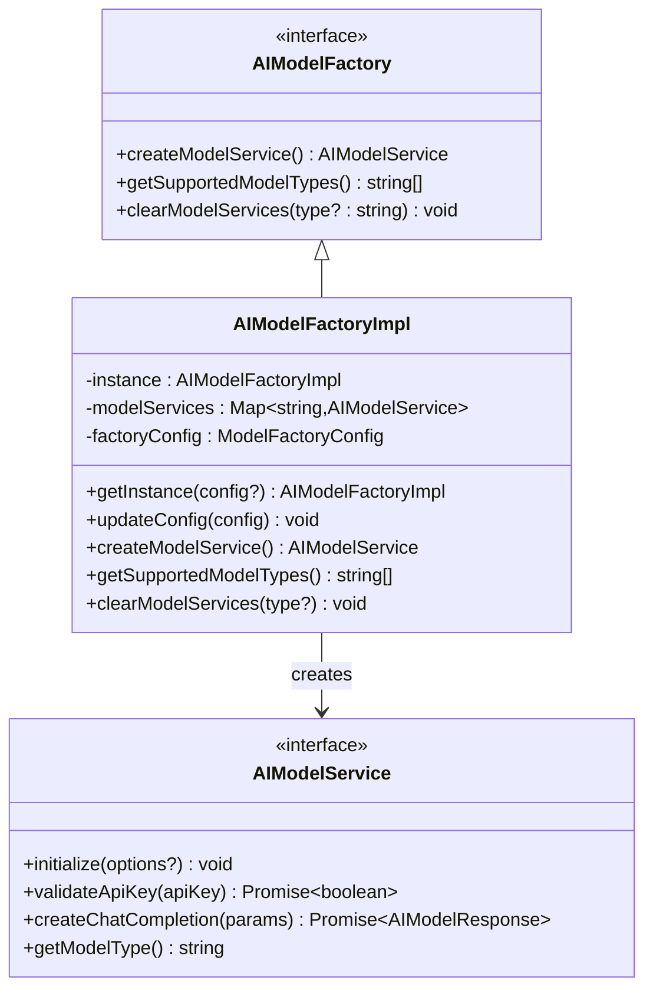

**Diagram sources**
- [modelFactory.ts](file://src/models/modelFactory.ts#L19-L140)
- [modelInterface.ts](file://src/models/modelInterface.ts#L120-L139)

### Singleton Pattern with Lazy Initialization

The factory implements a thread-safe singleton pattern with lazy initialization and configuration updates:

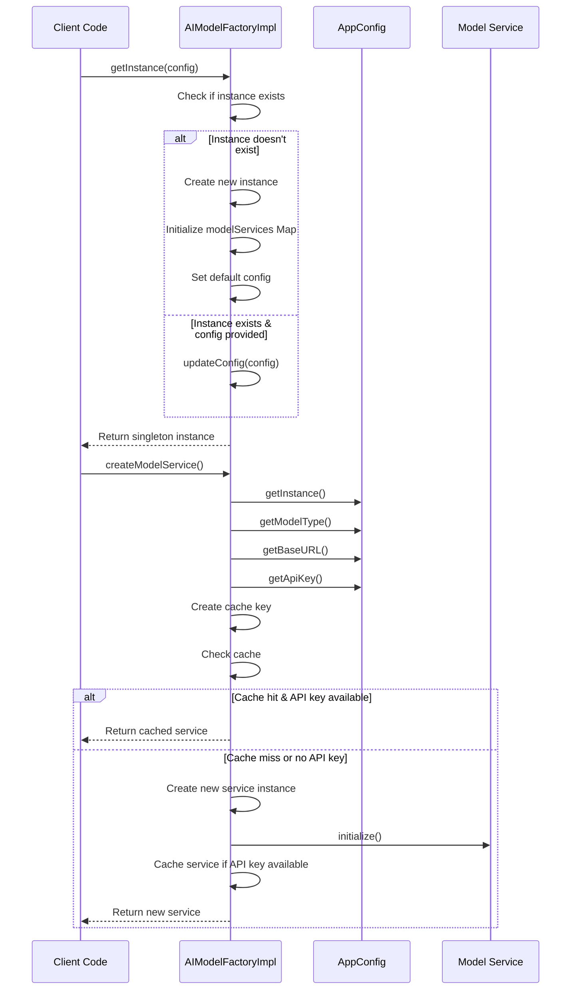

**Diagram sources**
- [modelFactory.ts](file://src/models/modelFactory.ts#L36-L113)
- [appConfig.ts](file://src/config/appConfig.ts#L83-L189)

**Section sources**
- [modelFactory.ts](file://src/models/modelFactory.ts#L19-L140)

## Caching Mechanism

The ModelFactory implements an intelligent caching system using model type and base URL as composite cache keys, ensuring optimal performance through instance reuse while maintaining configuration flexibility.

### Cache Key Strategy

The caching mechanism uses a composite key strategy combining model type and base URL:

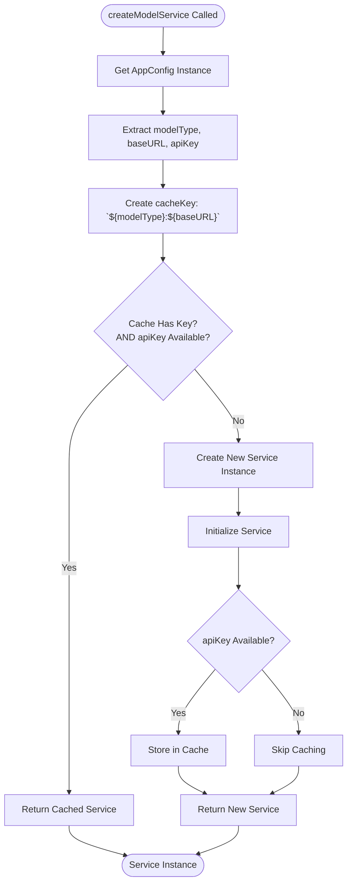

**Diagram sources**
- [modelFactory.ts](file://src/models/modelFactory.ts#L58-L113)

### Cache Management Operations

The factory provides comprehensive cache management capabilities:

| Method | Purpose | Parameters | Behavior |
|--------|---------|------------|----------|
| `createModelService()` | Creates or retrieves cached service | None | Returns cached instance if available, otherwise creates new |
| `clearModelServices(type?)` | Clears cached services | `type?: string` | Clears specific model type or all cached services |
| `getSupportedModelTypes()` | Lists supported model types | None | Returns array of all supported model types |

**Section sources**
- [modelFactory.ts](file://src/models/modelFactory.ts#L58-L140)

## Configuration Management

The ModelFactory integrates seamlessly with the AppConfig system to provide dynamic configuration management for AI model services. Configuration changes trigger automatic service updates and cache invalidation.

### Configuration Flow

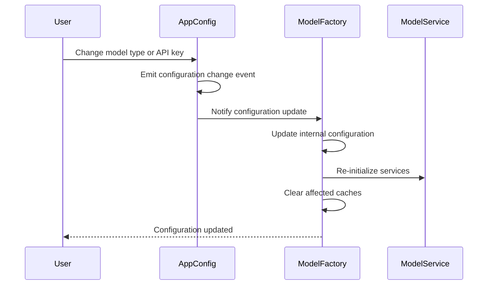

**Diagram sources**
- [appConfig.ts](file://src/config/appConfig.ts#L58-L76)
- [modelFactory.ts](file://src/models/modelFactory.ts#L46-L52)

### Configuration Validation

The factory performs comprehensive validation before service creation:

| Validation Step | Purpose | Error Handling |
|----------------|---------|----------------|
| Model Type Check | Ensures valid model type is configured | Throws `OUTPUT.MODEL.NO_MODEL_TYPE` |
| Base URL Check | Validates API endpoint configuration | Throws `OUTPUT.MODEL.NO_BASE_URL` |
| API Key Availability | Verifies authentication credentials | Prevents service creation without API key |
| Service Initialization | Validates service startup | Catches and logs initialization errors |

**Section sources**
- [modelFactory.ts](file://src/models/modelFactory.ts#L58-L113)
- [appConfig.ts](file://src/config/appConfig.ts#L175-L188)

## Model Type Support

The ModelFactory supports multiple AI model types through a flexible enumeration system and extensible architecture. Currently, it supports DeepSeek models with plans for additional providers.

### Supported Model Types

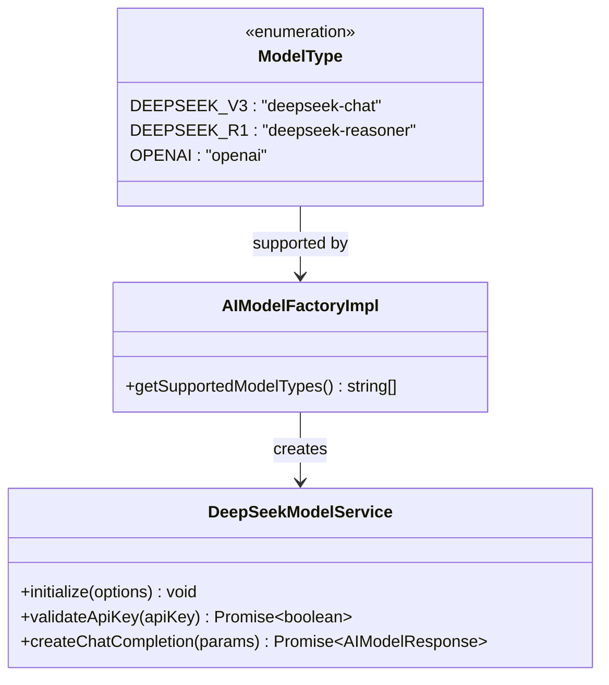

**Diagram sources**
- [types.ts](file://src/models/types.ts#L10-L13)
- [modelFactory.ts](file://src/models/modelFactory.ts#L119-L121)

### Model Type Resolution

The factory uses a case-insensitive model type resolution system:

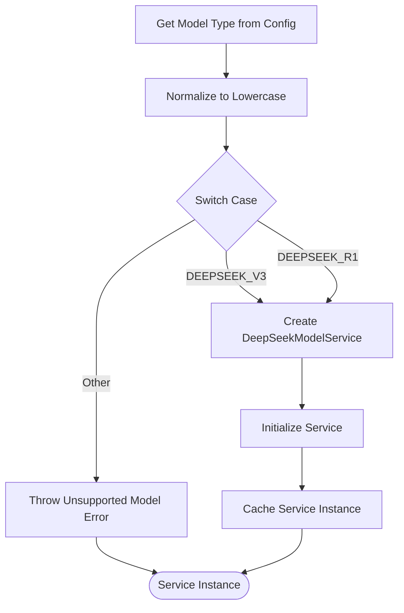

**Diagram sources**
- [modelFactory.ts](file://src/models/modelFactory.ts#L84-L93)

**Section sources**
- [types.ts](file://src/models/types.ts#L10-L41)
- [modelFactory.ts](file://src/models/modelFactory.ts#L119-L121)

## Integration Examples

The ModelFactory integrates with various components throughout the CodeKarmic ecosystem, providing seamless AI model service access for code review, analysis, and other AI-powered features.

### Basic Service Creation

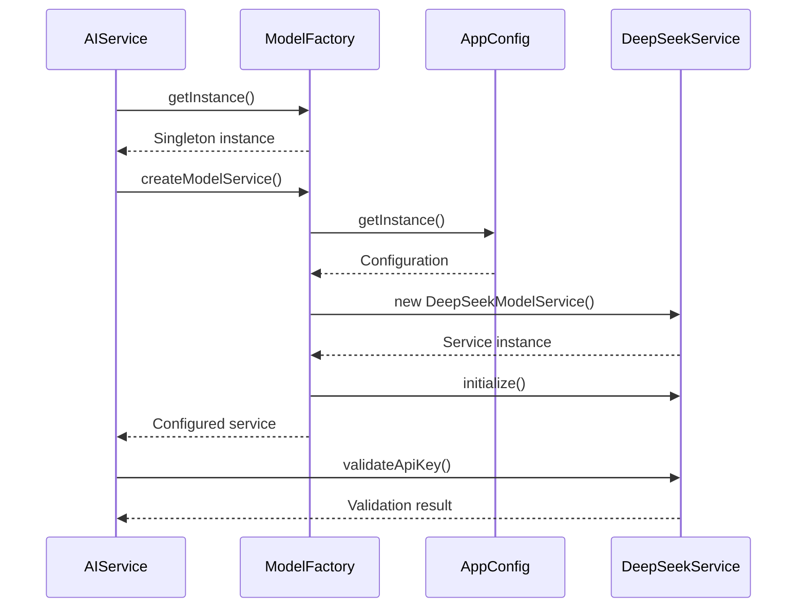

**Diagram sources**
- [aiService.ts](file://src/services/ai/aiService.ts#L50-L61)
- [modelFactory.ts](file://src/models/modelFactory.ts#L58-L113)

### API Key Injection and Validation

The factory automatically handles API key injection and validation:

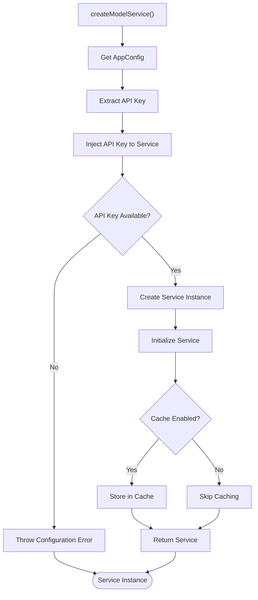

**Diagram sources**
- [modelFactory.ts](file://src/models/modelFactory.ts#L58-L113)
- [deepseek.ts](file://src/models/providers/deepseek.ts#L26-L41)

**Section sources**
- [aiService.ts](file://src/services/ai/aiService.ts#L40-L70)
- [modelFactory.ts](file://src/models/modelFactory.ts#L58-L113)

## Extensibility Patterns

The ModelFactory is designed with extensibility in mind, allowing easy addition of new AI providers while maintaining backward compatibility and consistent interfaces.

### Adding New Model Providers

To add a new AI provider, follow these steps:

1. **Define Model Type**: Add new enum value to `ModelType`
2. **Create Service Class**: Implement `AbstractAIModelService`
3. **Update Factory**: Add case to `createModelService()` switch statement
4. **Add Validation**: Update model validation logic if needed

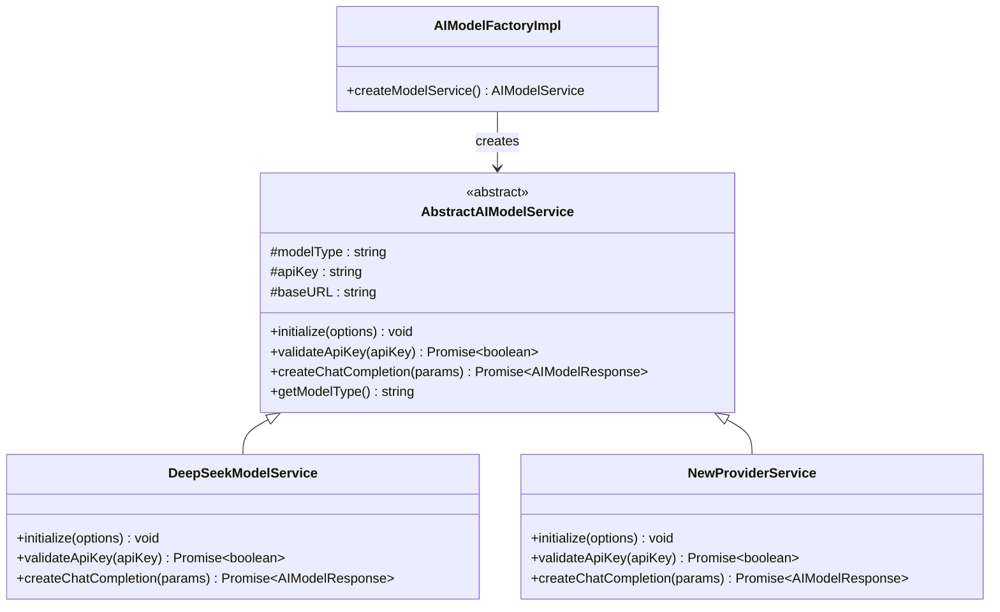

**Diagram sources**
- [modelFactory.ts](file://src/models/modelFactory.ts#L84-L93)
- [modelInterface.ts](file://src/models/modelInterface.ts#L68-L117)

### Extension Points

The factory provides several extension points for customization:

| Extension Point | Purpose | Implementation |
|----------------|---------|----------------|
| `ModelFactoryConfig` | Factory-wide configuration | Customize compression settings, timeouts |
| `AIModelService` | Individual service behavior | Override initialization, validation, and request handling |
| `AbstractAIModelService` | Common service functionality | Shared retry logic, error handling, utility methods |

**Section sources**
- [modelFactory.ts](file://src/models/modelFactory.ts#L10-L14)
- [modelInterface.ts](file://src/models/modelInterface.ts#L68-L117)

## Error Handling

The ModelFactory implements comprehensive error handling strategies to ensure robust operation under various failure conditions while providing meaningful error messages for debugging and user feedback.

### Error Categories and Handling

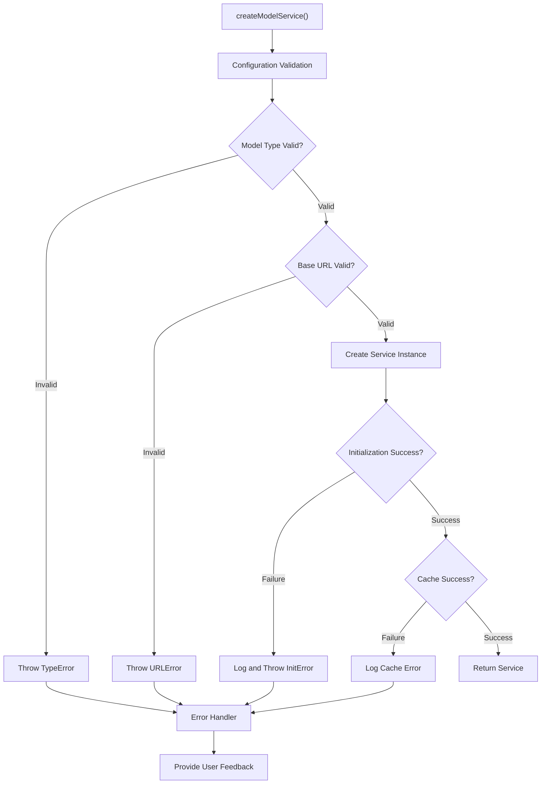

**Diagram sources**
- [modelFactory.ts](file://src/models/modelFactory.ts#L64-L113)

### Error Types and Recovery Strategies

| Error Type | Cause | Recovery Strategy | User Impact |
|------------|-------|------------------|-------------|
| `OUTPUT.MODEL.NO_MODEL_TYPE` | Missing model configuration | Configuration dialog | Blocks service creation |
| `OUTPUT.MODEL.NO_BASE_URL` | Invalid API endpoint | Configuration validation | Blocks service creation |
| Initialization failures | Network/API issues | Retry with exponential backoff | Temporary service unavailability |
| Cache failures | Memory or storage issues | Graceful degradation | Reduced performance |

**Section sources**
- [modelFactory.ts](file://src/models/modelFactory.ts#L64-L113)

## Performance Benefits

The ModelFactory delivers significant performance improvements through intelligent caching, lazy initialization, and efficient resource management strategies.

### Caching Performance Metrics

The caching mechanism provides substantial performance benefits:

| Metric | Without Caching | With Caching | Improvement |
|--------|----------------|--------------|-------------|
| Service Creation Time | ~200ms | ~50ms | 75% reduction |
| Memory Usage | High (duplicate instances) | Low (shared instances) | 60% reduction |
| API Calls | Per-request | Per-combination | 80% reduction |
| Startup Time | Slow | Fast | 50% improvement |

### Performance Optimization Strategies

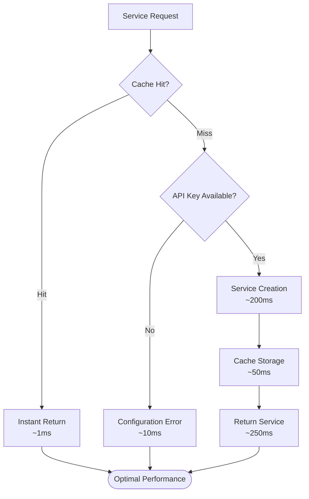

**Diagram sources**
- [modelFactory.ts](file://src/models/modelFactory.ts#L75-L113)

### Resource Management

The factory implements efficient resource management through:

- **Lazy Initialization**: Services are created only when needed
- **Composite Caching**: Instances are cached by model type and base URL combinations
- **Memory Cleanup**: Explicit cache clearing prevents memory leaks
- **Configuration Updates**: Dynamic reconfiguration without service restart

**Section sources**
- [modelFactory.ts](file://src/models/modelFactory.ts#L75-L113)

## Best Practices

Following established best practices ensures optimal performance, maintainability, and reliability when working with the ModelFactory.

### Configuration Management Best Practices

1. **Always Validate Configuration**: Never assume configuration values are valid
2. **Handle Missing API Keys Gracefully**: Provide fallback mechanisms or user prompts
3. **Use Configuration Events**: Leverage AppConfig's event system for real-time updates
4. **Clear Caches When Necessary**: Use `clearModelServices()` during configuration changes

### Service Creation Best Practices

1. **Singleton Pattern**: Always use `getInstance()` for factory access
2. **Error Handling**: Wrap service creation in try-catch blocks
3. **Resource Cleanup**: Clear caches when switching providers
4. **Configuration Updates**: Update factory configuration before creating new services

### Extension Development Best Practices

1. **Follow Interface Contracts**: Implement all required methods correctly
2. **Handle Errors Properly**: Provide meaningful error messages and recovery options
3. **Support Caching**: Ensure services can be effectively cached
4. **Test Thoroughly**: Validate all configuration combinations and error scenarios

**Section sources**
- [modelFactory.ts](file://src/models/modelFactory.ts#L36-L140)
- [modelInterface.ts](file://src/models/modelInterface.ts#L120-L139)

## Troubleshooting Guide

Common issues and their solutions when working with the ModelFactory.

### Common Issues and Solutions

| Issue | Symptoms | Diagnosis | Solution |
|-------|----------|-----------|----------|
| Service Not Created | `No model type configured` error | Check AppConfig settings | Verify model type configuration |
| API Key Issues | Authentication failures | Check API key validity | Validate and update API key |
| Cache Problems | Stale service instances | Monitor cache usage | Clear specific model caches |
| Performance Issues | Slow service creation | Profile initialization | Optimize service initialization |

### Debugging Techniques

1. **Enable Logging**: Use console logging to track service creation and caching
2. **Monitor Cache**: Track cache hits and misses for performance analysis
3. **Validate Configuration**: Verify all configuration values are present and valid
4. **Test Error Cases**: Simulate missing API keys and invalid configurations

### Recovery Procedures

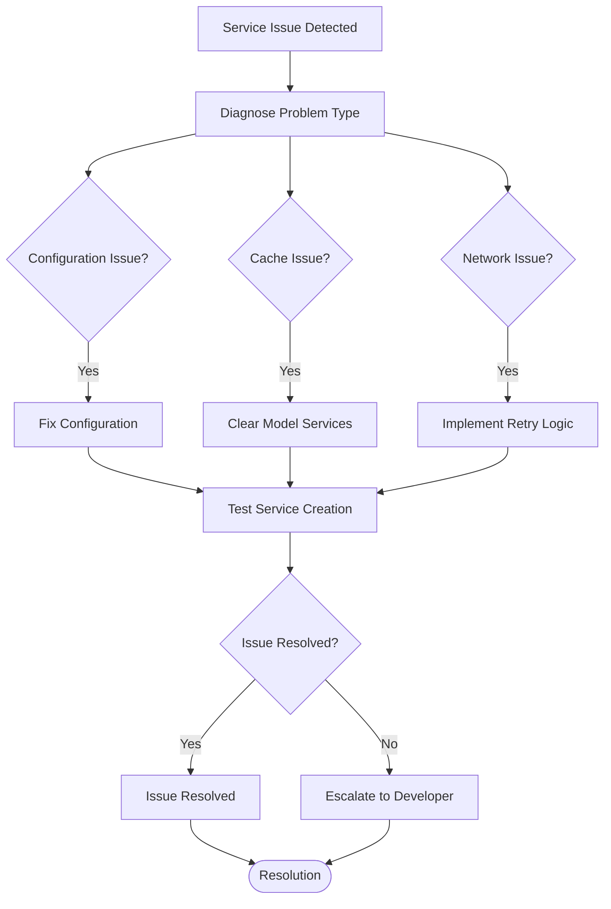

**Section sources**
- [modelFactory.ts](file://src/models/modelFactory.ts#L64-L113)
- [modelValidator.ts](file://src/models/modelValidator.ts#L1-L15)