# Review Manager

<cite>
**Referenced Files in This Document**
- [reviewManager.ts](file://src/services/review/reviewManager.ts)
- [gitService.ts](file://src/services/git/gitService.ts)
- [aiService.ts](file://src/services/ai/aiService.ts)
- [notificationManager.ts](file://src/services/notification/notificationManager.ts)
- [reviewPanel.ts](file://src/ui/views/reviewPanel.ts)
- [fileUtils.ts](file://src/utils/fileUtils.ts)
- [types.ts](file://src/models/types.ts)
- [appConfig.ts](file://src/config/appConfig.ts)
- [constants.ts](file://src/constants/constants.ts)
- [extension.ts](file://src/extension.ts)
</cite>

## Table of Contents
1. [Introduction](#introduction)
2. [Architecture Overview](#architecture-overview)
3. [Core Responsibilities](#core-responsibilities)
4. [State Management](#state-management)
5. [Integration Patterns](#integration-patterns)
6. [Batch Processing](#batch-processing)
7. [Error Handling](#error-handling)
8. [Configuration Dependencies](#configuration-dependencies)
9. [Performance Considerations](#performance-considerations)
10. [Failure Recovery Mechanisms](#failure-recovery-mechanisms)
11. [Usage Examples](#usage-examples)
12. [Best Practices](#best-practices)

## Introduction

The ReviewManager serves as the central coordination hub in the CodeKarmic extension, orchestrating the entire code review workflow between Git services and AI capabilities. It acts as the primary interface for managing review sessions, handling commit selection, maintaining state consistency, and coordinating file reviews across the system.

As the core orchestrator, ReviewManager maintains the relationship between Git repositories, AI analysis services, and user interactions, providing a unified interface for code review operations while ensuring thread safety and proper resource management.

## Architecture Overview

The ReviewManager follows a service-oriented architecture pattern, integrating multiple specialized services to provide comprehensive code review functionality:

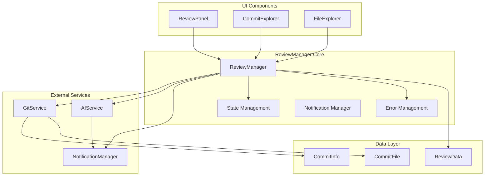

**Diagram sources**
- [reviewManager.ts](file://src/services/review/reviewManager.ts#L79-L95)
- [gitService.ts](file://src/services/git/gitService.ts#L45-L65)
- [aiService.ts](file://src/services/ai/aiService.ts#L40-L70)

**Section sources**
- [reviewManager.ts](file://src/services/review/reviewManager.ts#L79-L95)
- [gitService.ts](file://src/services/git/gitService.ts#L45-L65)
- [aiService.ts](file://src/services/ai/aiService.ts#L40-L70)

## Core Responsibilities

### Commit Selection Management

The ReviewManager handles commit selection through the `selectCommit()` method, which manages the complete lifecycle of commit retrieval and caching:

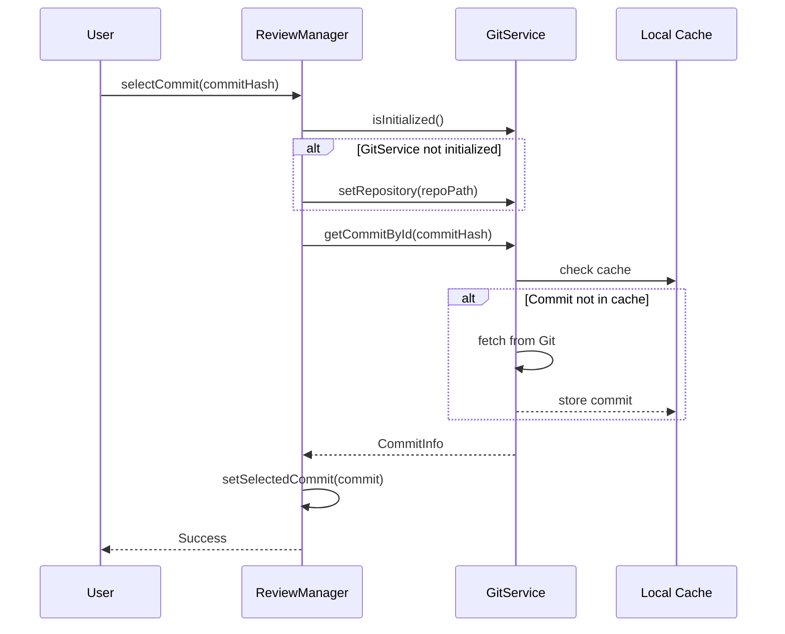

**Diagram sources**
- [reviewManager.ts](file://src/services/review/reviewManager.ts#L149-L206)
- [gitService.ts](file://src/services/git/gitService.ts#L244-L275)

### File Review Coordination

ReviewManager coordinates file reviews through the `reviewFile()` method, which creates and manages review data structures:

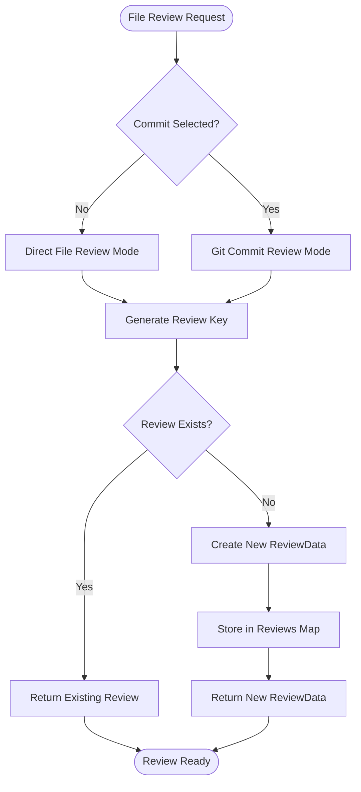

**Diagram sources**
- [reviewManager.ts](file://src/services/review/reviewManager.ts#L229-L262)

### Review Data Lifecycle Management

The ReviewManager maintains a comprehensive review data lifecycle, managing comments, AI suggestions, and quality scores:

| Operation | Method | Purpose | State Impact |
|-----------|--------|---------|--------------|
| Initialize | `initialize()` | Setup repository and clear state | Resets all review data |
| Select Commit | `setSelectedCommit()` | Set active commit context | Updates commit context |
| Review File | `reviewFile()` | Create/Retrieve review data | Adds to reviews map |
| Add Comment | `addComment()` | Add user comment | Updates review.comments |
| Add AI Suggestion | `addAISuggestion()` | Add AI-generated suggestion | Updates review.aiSuggestions |
| Set Quality Score | `setCodeQualityScore()` | Set code quality rating | Updates review.codeQualityScore |

**Section sources**
- [reviewManager.ts](file://src/services/review/reviewManager.ts#L111-L327)

## State Management

### Selected Commit Tracking

The ReviewManager maintains the currently selected commit through the `selectedCommit` property, which serves as the primary context for all review operations:

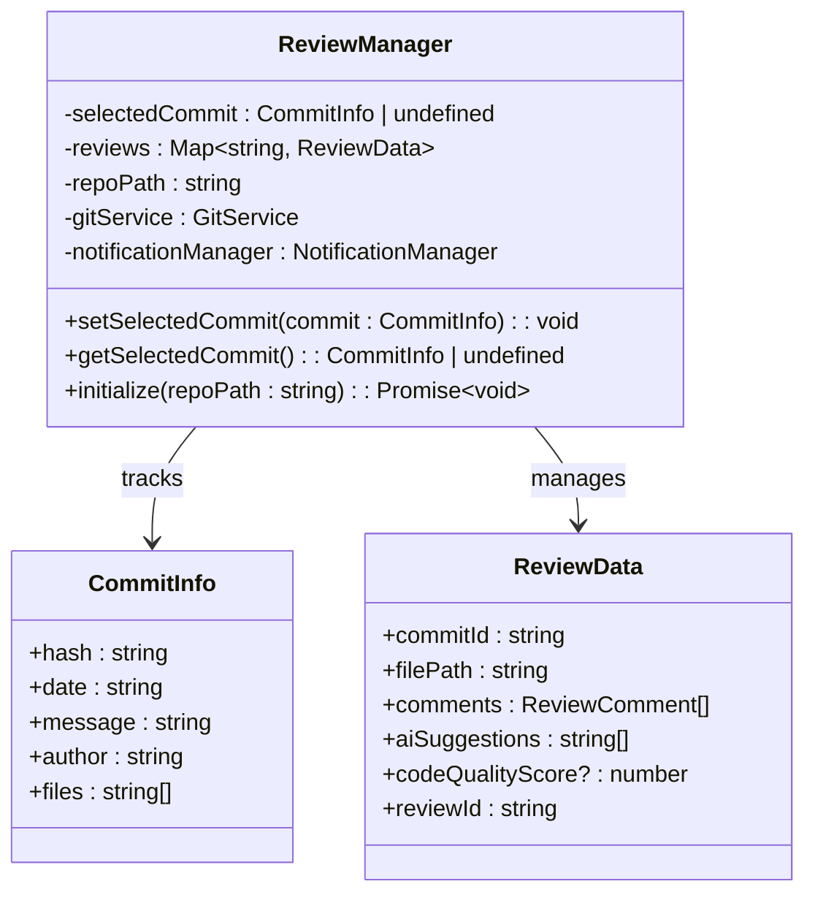

**Diagram sources**
- [reviewManager.ts](file://src/services/review/reviewManager.ts#L84-L86)
- [gitService.ts](file://src/services/git/gitService.ts#L28-L35)

### Reviews Map Management

The `reviews` map maintains all active review data, indexed by a composite key combining commit ID and file path:

```typescript
// Review key format: {commitHash}:{filePath} or direct:{filePath}
private reviews: Map<string, ReviewData> = new Map();

// Example keys:
// "abc123def:src/main.ts"
// "direct:/path/to/file.ts"
```

### Concurrent Operation Prevention

The ReviewManager implements safeguards against concurrent operations through the `isGeneratingReport` flag:

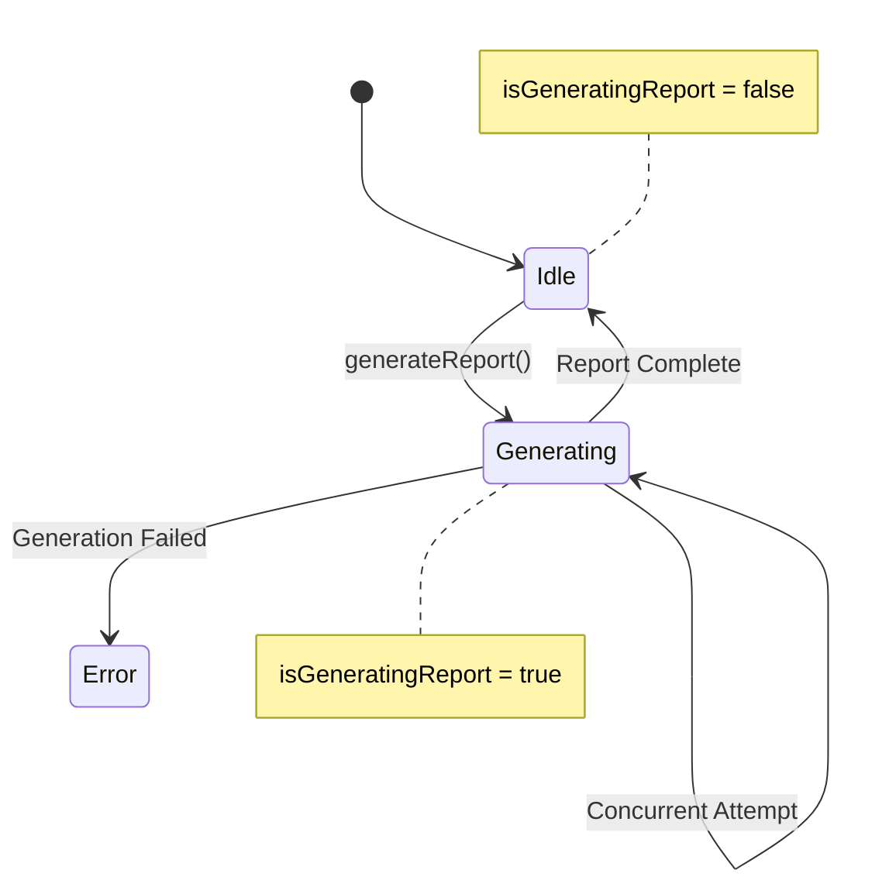

**Diagram sources**
- [reviewManager.ts](file://src/services/review/reviewManager.ts#L88-L90)

**Section sources**
- [reviewManager.ts](file://src/services/review/reviewManager.ts#L84-L88)

## Integration Patterns

### Git Service Integration

The ReviewManager integrates with GitService to fetch commit data and file contents:

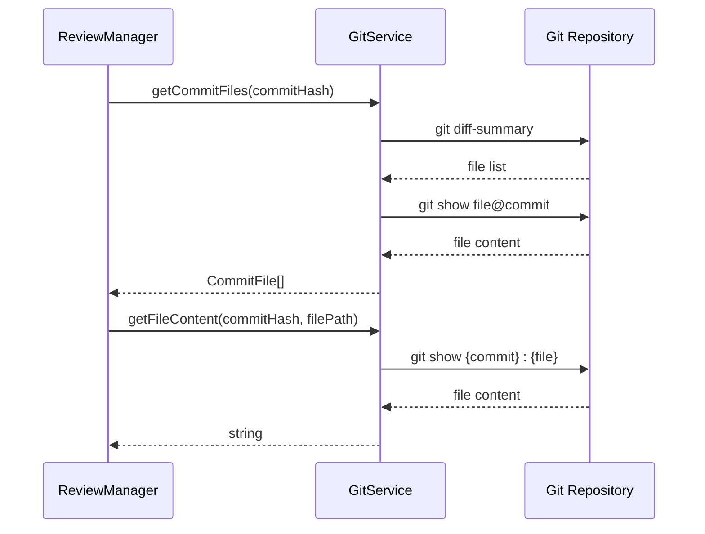

**Diagram sources**
- [reviewManager.ts](file://src/services/review/reviewManager.ts#L435-L437)
- [gitService.ts](file://src/services/git/gitService.ts#L110-L177)

### AI Service Integration

Integration with AIService enables automated code analysis and suggestion generation:

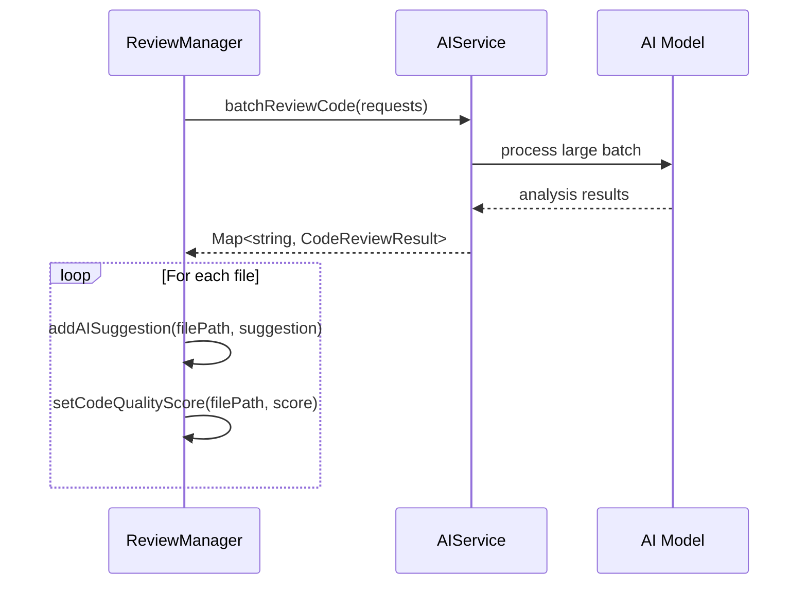

**Diagram sources**
- [reviewManager.ts](file://src/services/review/reviewManager.ts#L487-L492)
- [aiService.ts](file://src/services/ai/aiService.ts#L431-L552)

### Notification Manager Integration

The ReviewManager leverages NotificationManager for comprehensive logging and user feedback:

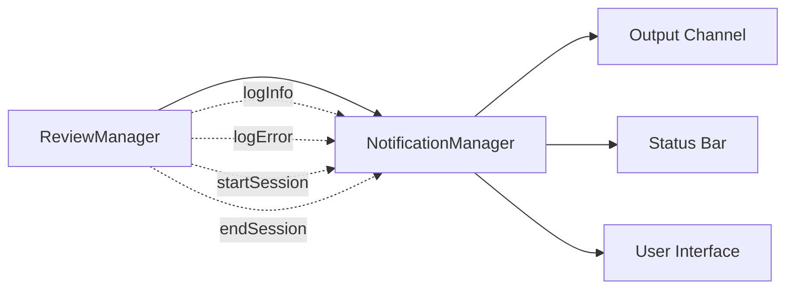

**Diagram sources**
- [reviewManager.ts](file://src/services/review/reviewManager.ts#L101-L109)
- [notificationManager.ts](file://src/services/notification/notificationManager.ts#L15-L30)

**Section sources**
- [reviewManager.ts](file://src/services/review/reviewManager.ts#L82-L87)
- [gitService.ts](file://src/services/git/gitService.ts#L45-L65)
- [aiService.ts](file://src/services/ai/aiService.ts#L40-L70)

## Batch Processing

### BATCH_SIZE Configuration

The ReviewManager implements efficient batch processing through the `BATCH_SIZE` constant, which controls the number of files processed simultaneously:

```typescript
private static readonly BATCH_SIZE = 5; // Number of files to process per batch
```

### Parallel File Processing

The `reviewFilesParallel()` method demonstrates sophisticated batch processing with progress tracking:

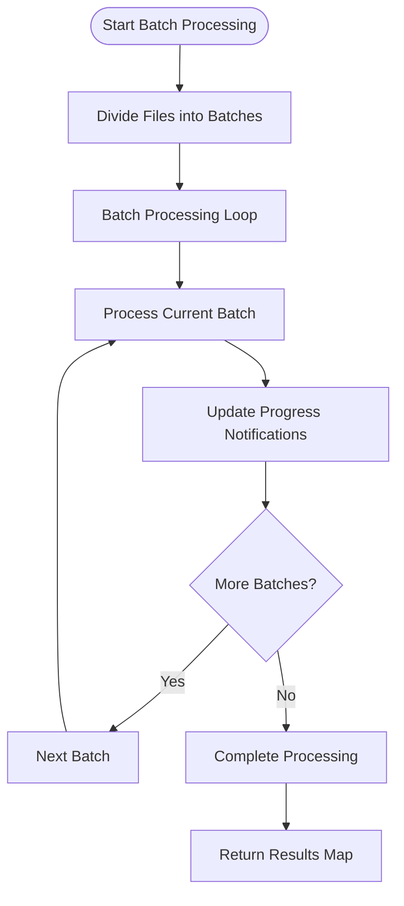

**Diagram sources**
- [reviewManager.ts](file://src/services/review/reviewManager.ts#L329-L369)

### Batch Processing Benefits

| Benefit | Implementation | Impact |
|---------|---------------|---------|
| Memory Efficiency | Process files in chunks | Reduces memory footprint |
| User Feedback | Progress notifications | Keeps users informed |
| Error Isolation | Failures don't cascade | Improves reliability |
| Performance | Parallel processing | Faster overall completion |

**Section sources**
- [reviewManager.ts](file://src/services/review/reviewManager.ts#L80-L81)
- [reviewManager.ts](file://src/services/review/reviewManager.ts#L329-L369)

## Error Handling

### Error Context Labeling

The ReviewManager implements comprehensive error context labeling through the `ErrorContext` enumeration:

```mermaid
classDiagram
class ErrorContext {
<<enumeration>>
initialize
setSelectedCommit
selectCommit
viewFile
reviewFile
addComment
addAISuggestion
setCodeQualityScore
generateReport
}
class ErrorContextLabels {
+initialize : {en : string, zh : string}
+setSelectedCommit : {en : string, zh : string}
+selectCommit : {en : string, zh : string}
+viewFile : {en : string, zh : string}
+reviewFile : {en : string, zh : string}
+addComment : {en : string, zh : string}
+addAISuggestion : {en : string, zh : string}
+setCodeQualityScore : {en : string, zh : string}
+generateReport : {en : string, zh : string}
}
ErrorContext --> ErrorContextLabels : labeled by
```

**Diagram sources**
- [reviewManager.ts](file://src/services/review/reviewManager.ts#L28-L76)

### Error Logging Strategy

The ReviewManager employs a structured error logging approach:

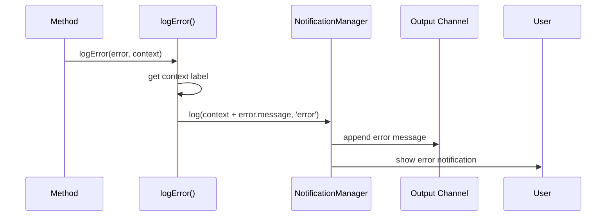

**Diagram sources**
- [reviewManager.ts](file://src/services/review/reviewManager.ts#L101-L105)

### Error Recovery Patterns

| Pattern | Implementation | Use Case |
|---------|---------------|----------|
| Graceful Degradation | Continue with partial results | Network failures |
| Retry Logic | Automatic retry with exponential backoff | Temporary errors |
| Fallback Strategies | Alternative processing methods | Unsupported file types |
| User Notification | Clear error messages | User-facing failures |

**Section sources**
- [reviewManager.ts](file://src/services/review/reviewManager.ts#L28-L76)
- [reviewManager.ts](file://src/services/review/reviewManager.ts#L101-L105)

## Configuration Dependencies

### Model Configuration

The ReviewManager depends on several configuration parameters managed through AppConfig:

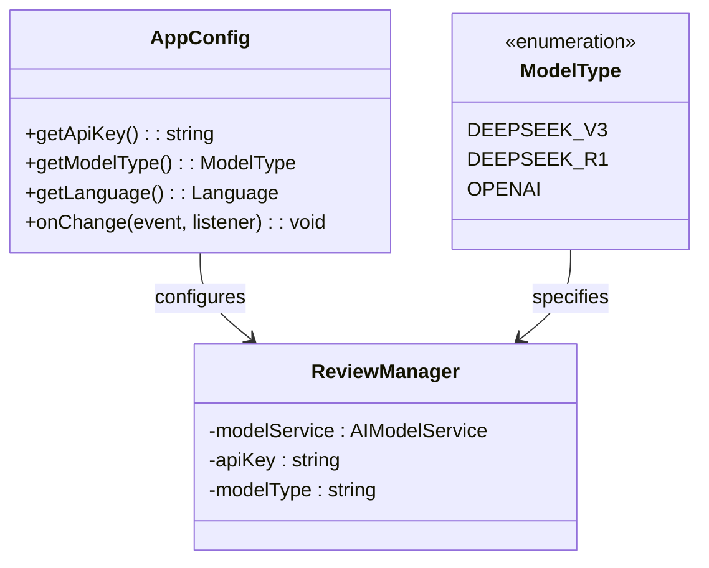

**Diagram sources**
- [appConfig.ts](file://src/config/appConfig.ts#L50-L88)
- [types.ts](file://src/models/types.ts#L10-L14)

### Environment Dependencies

The ReviewManager requires proper initialization of external dependencies:

| Dependency | Purpose | Initialization |
|------------|---------|----------------|
| Git Repository | File content retrieval | `gitService.setRepository()` |
| AI Service | Code analysis | `AIService.getInstance()` |
| Notification Manager | User feedback | `NotificationManager.getInstance()` |
| Workspace Folder | Repository access | VS Code workspace detection |

**Section sources**
- [appConfig.ts](file://src/config/appConfig.ts#L50-L88)
- [reviewManager.ts](file://src/services/review/reviewManager.ts#L90-L95)

## Performance Considerations

### Memory Management

The ReviewManager implements several memory optimization strategies:

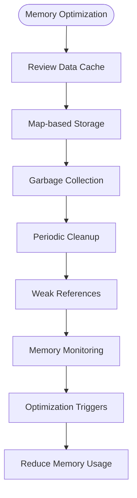

### Concurrent Processing Limits

The ReviewManager balances performance with resource constraints:

| Resource | Limit | Rationale |
|----------|-------|-----------|
| Batch Size | 5 files | Prevents memory exhaustion |
| Concurrent Reports | 1 at a time | Prevents resource contention |
| Cache Size | Dynamic | Based on available memory |
| Timeout | 3 minutes | Prevents hanging operations |

### Performance Monitoring

The ReviewManager includes built-in performance monitoring:

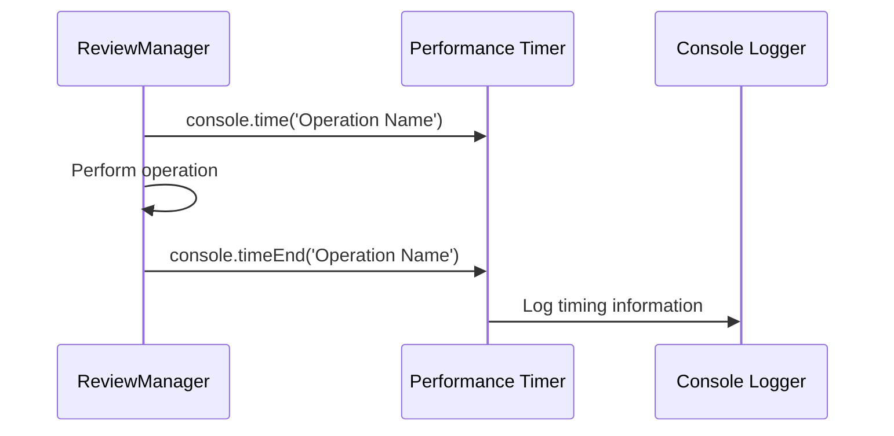

**Section sources**
- [reviewManager.ts](file://src/services/review/reviewManager.ts#L80-L81)
- [reviewManager.ts](file://src/services/review/reviewManager.ts#L372-L373)

## Failure Recovery Mechanisms

### Repository Initialization Recovery

The ReviewManager implements robust repository initialization recovery:

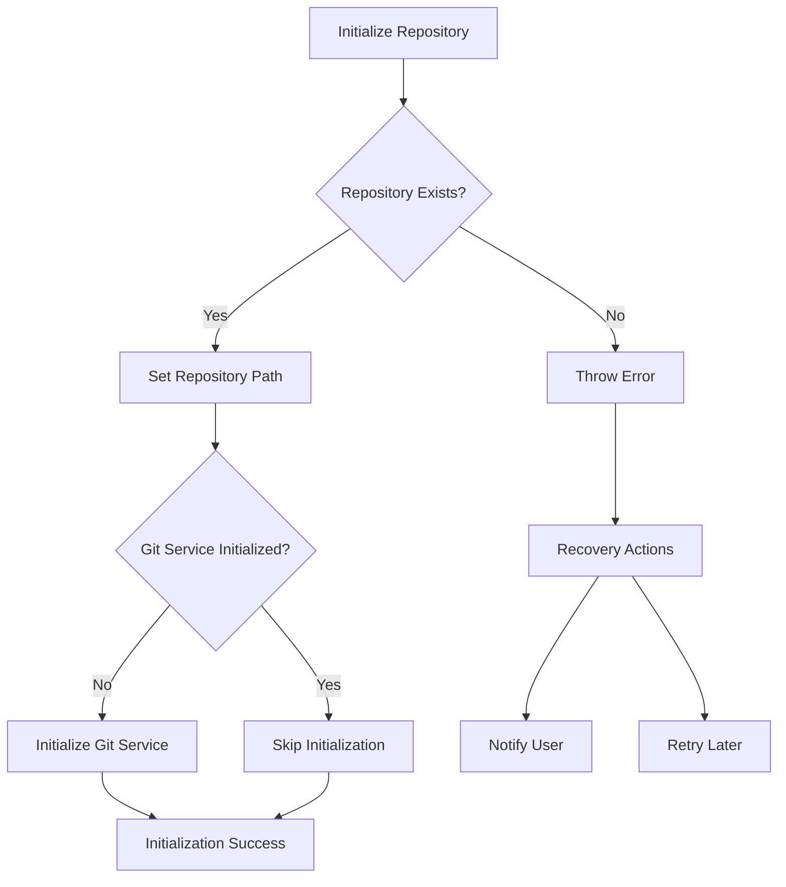

**Diagram sources**
- [reviewManager.ts](file://src/services/review/reviewManager.ts#L111-L128)

### Commit Retrieval Recovery

The ReviewManager handles commit retrieval failures gracefully:

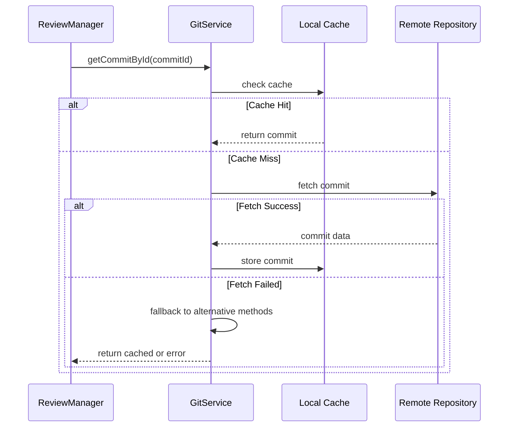

**Diagram sources**
- [reviewManager.ts](file://src/services/review/reviewManager.ts#L173-L199)
- [gitService.ts](file://src/services/git/gitService.ts#L244-L275)

### Report Generation Recovery

The ReviewManager implements comprehensive report generation recovery:

| Recovery Strategy | Implementation | Trigger |
|------------------|---------------|---------|
| Concurrent Prevention | `isGeneratingReport` flag | Multiple simultaneous requests |
| Partial Success | Continue with available results | Individual file failures |
| User Notification | Clear error messages | All failure scenarios |
| State Reset | Clear review data | Critical failures |

**Section sources**
- [reviewManager.ts](file://src/services/review/reviewManager.ts#L88-L90)
- [reviewManager.ts](file://src/services/review/reviewManager.ts#L377-L381)

## Usage Examples

### Basic Commit Selection

```typescript
// Select a specific commit for review
await reviewManager.selectCommit('abc123def456');

// Verify the selected commit
const selectedCommit = reviewManager.getSelectedCommit();
console.log(`Selected commit: ${selectedCommit?.hash}`);
```

### File Review Workflow

```typescript
// Start a new review for a file
const reviewData = await reviewManager.reviewFile('src/main.ts');

// Add user comments
await reviewManager.addComment('src/main.ts', 42, 'Consider adding error handling here');

// Add AI suggestions
await reviewManager.addAISuggestion('src/main.ts', 'Refactor this function for better readability');

// Set code quality score
await reviewManager.setCodeQualityScore('src/main.ts', 7.5);
```

### Report Generation

```typescript
// Generate comprehensive code review report
try {
    const report = await reviewManager.generateReport();
    console.log('Report generated successfully');
} catch (error) {
    console.error('Report generation failed:', error);
}
```

### Direct File Review

```typescript
// Review standalone files without Git context
const reviewData = await reviewManager.reviewFile('/path/to/file.ts');
// Works without selecting a commit
```

**Section sources**
- [reviewManager.ts](file://src/services/review/reviewManager.ts#L149-L206)
- [reviewManager.ts](file://src/services/review/reviewManager.ts#L229-L327)
- [reviewManager.ts](file://src/services/review/reviewManager.ts#L372-L661)

## Best Practices

### State Management Guidelines

1. **Always check commit context** before performing Git-dependent operations
2. **Clear state appropriately** during initialization and error conditions
3. **Use atomic operations** for state updates to prevent race conditions
4. **Maintain consistency** between reviews map and selected commit state

### Error Handling Best Practices

1. **Use specific error contexts** to provide meaningful error messages
2. **Log errors comprehensively** with stack traces for debugging
3. **Provide user-friendly messages** that guide users toward solutions
4. **Implement graceful degradation** when operations fail partially

### Performance Optimization

1. **Limit batch sizes** to balance memory usage and processing speed
2. **Use caching** for frequently accessed data (commits, file contents)
3. **Implement progress indicators** for long-running operations
4. **Monitor memory usage** and implement cleanup strategies

### Integration Patterns

1. **Dependency injection** for external services (GitService, AIService)
2. **Event-driven communication** between components
3. **Singleton pattern** for shared services (NotificationManager)
4. **Interface segregation** for modular design

### Testing Considerations

1. **Mock external dependencies** for unit testing
2. **Test error scenarios** thoroughly
3. **Verify state consistency** after operations
4. **Validate concurrent operation handling**

**Section sources**
- [reviewManager.ts](file://src/services/review/reviewManager.ts#L79-L95)
- [reviewManager.ts](file://src/services/review/reviewManager.ts#L101-L109)
- [reviewManager.ts](file://src/services/review/reviewManager.ts#L329-L369)