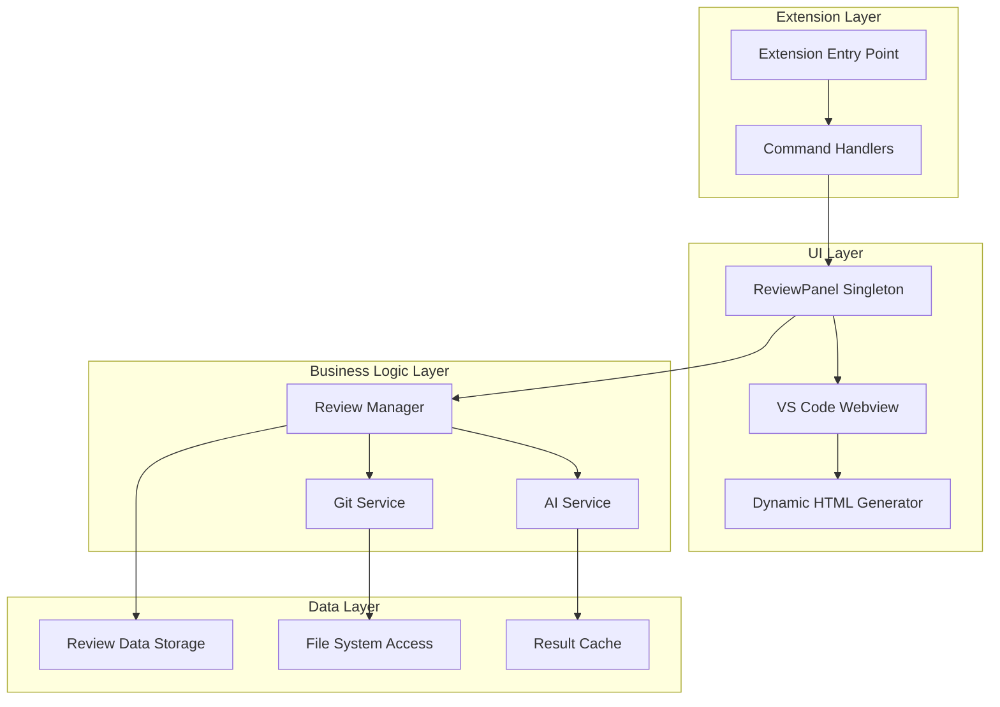
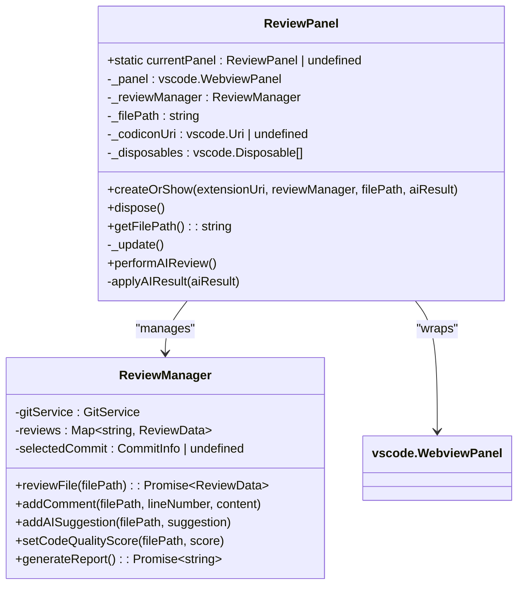
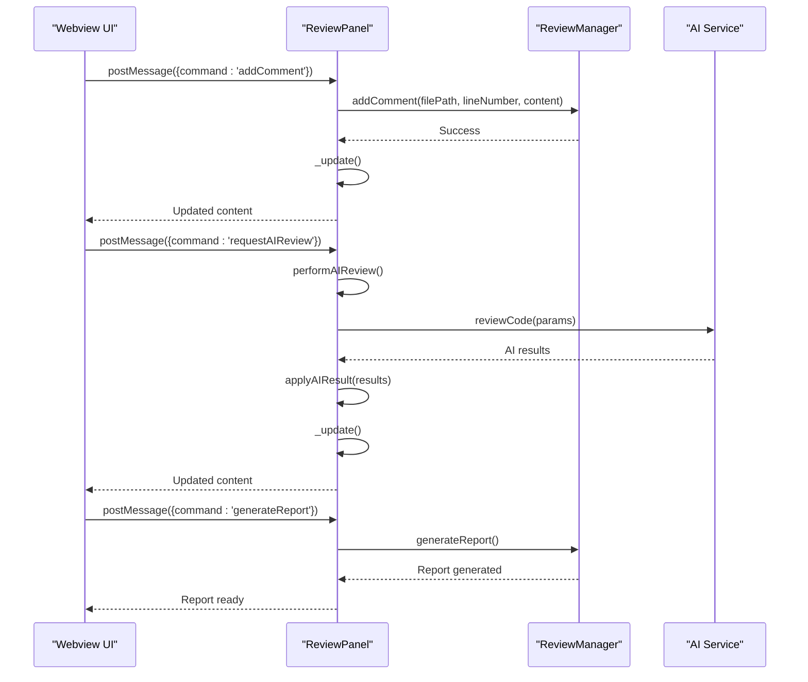
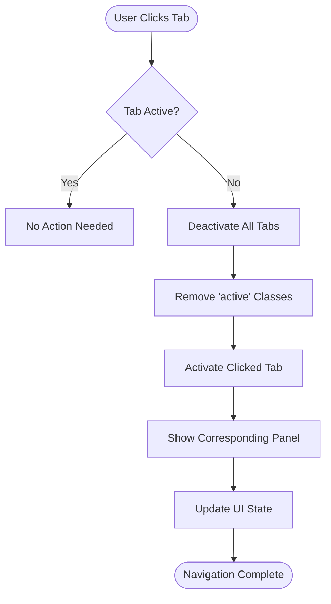
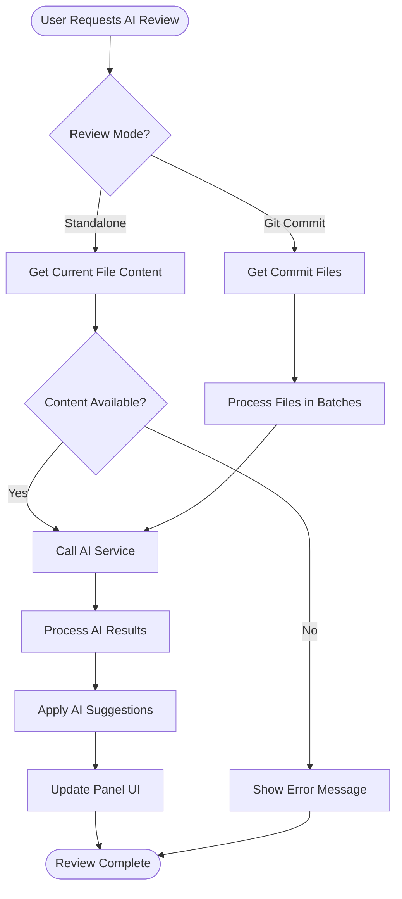

# Review Panel

<cite>
**Referenced Files in This Document**
- [reviewPanel.ts](file://src/ui/views/reviewPanel.ts)
- [reviewManager.ts](file://src/services/review/reviewManager.ts)
- [reviewTypes.ts](file://src/core/review/reviewTypes.ts)
- [aiService.ts](file://src/services/ai/aiService.ts)
- [fileUtils.ts](file://src/utils/fileUtils.ts)
- [extension.ts](file://src/extension.ts)
</cite>

## Table of Contents
1. [Introduction](#introduction)
2. [Architecture Overview](#architecture-overview)
3. [Singleton Pattern Implementation](#singleton-pattern-implementation)
4. [Webview Panel Management](#webview-panel-management)
5. [Message Passing System](#message-passing-system)
6. [Dynamic HTML Generation](#dynamic-html-generation)
7. [UI Features and Design](#ui-features-and-design)
8. [AI Integration](#ai-integration)
9. [Performance Optimization](#performance-optimization)
10. [Security Considerations](#security-considerations)
11. [Accessibility Compliance](#accessibility-compliance)
12. [Lifecycle Management](#lifecycle-management)
13. [Troubleshooting Guide](#troubleshooting-guide)
14. [Conclusion](#conclusion)

## Introduction

The ReviewPanel is the primary user interface component in CodeKarmic for displaying code review results. It serves as a VS Code WebviewPanel that renders AI-generated suggestions, code quality scores, and file comparisons in an intuitive and interactive manner. The panel implements a sophisticated singleton pattern for efficient resource management and provides seamless integration between the extension and webview environments.

Built with modern web technologies and adhering to VS Code's webview security guidelines, the ReviewPanel offers a responsive and accessible user experience while maintaining high performance even with large review sets. Its architecture supports both Git-based code reviews and standalone file analysis, making it versatile for various development workflows.

## Architecture Overview

The ReviewPanel follows a layered architecture that separates concerns between presentation, business logic, and data management:



**Diagram sources**
- [reviewPanel.ts](file://src/ui/views/reviewPanel.ts#L5-L13)
- [reviewManager.ts](file://src/services/review/reviewManager.ts#L79-L95)
- [extension.ts](file://src/extension.ts#L391-L415)

**Section sources**
- [reviewPanel.ts](file://src/ui/views/reviewPanel.ts#L1-L621)
- [reviewManager.ts](file://src/services/review/reviewManager.ts#L1-L854)

## Singleton Pattern Implementation

The ReviewPanel implements a sophisticated singleton pattern that ensures only one instance exists at any given time, optimizing memory usage and providing consistent user experience:



**Diagram sources**
- [reviewPanel.ts](file://src/ui/views/reviewPanel.ts#L5-L13)
- [reviewManager.ts](file://src/services/review/reviewManager.ts#L79-L95)

The singleton implementation provides several key benefits:

### Instance Management
- **Single Instance Enforcement**: Ensures only one ReviewPanel exists at a time
- **Resource Optimization**: Prevents memory leaks and excessive resource consumption
- **Consistent State**: Maintains unified state across multiple operations

### Path Update Handling
The panel efficiently handles file path updates through the `createOrShow()` method, which intelligently determines whether to reuse an existing panel or create a new one:

```typescript
// Path update logic in createOrShow()
if (ReviewPanel.currentPanel) {
    ReviewPanel.currentPanel._panel.reveal(column);
    ReviewPanel.currentPanel._filePath = filePath;
    // Apply AI results if available
    if (aiResult) {
        ReviewPanel.currentPanel.applyAIResult(aiResult);
    }
    ReviewPanel.currentPanel._update();
    return;
}
```

**Section sources**
- [reviewPanel.ts](file://src/ui/views/reviewPanel.ts#L78-L124)

## Webview Panel Management

The ReviewPanel creates and manages VS Code webviews with strict security controls and optimal performance characteristics:

### Webview Creation
The webview is configured with specific security and functionality parameters:

```typescript
const panel = vscode.window.createWebviewPanel(
    'codekarmic',
    'Code Review',
    column || vscode.ViewColumn.Two,
    {
        enableScripts: true,
        localResourceRoots: [
            vscode.Uri.joinPath(extensionUri, 'media'),
            vscode.Uri.joinPath(extensionUri, 'resources')
        ]
    }
);
```

### Security Configuration
The webview implements VS Code's recommended security practices:

- **Script Execution Control**: Enables JavaScript only when necessary
- **Resource Isolation**: Restricts access to extension-specific resources
- **Content Security Policy**: Prevents XSS attacks and unauthorized resource loading

### View State Management
The panel responds dynamically to VS Code's view state changes:

```typescript
this._panel.onDidChangeViewState(
    () => {
        if (this._panel.visible) {
            this._update();
        }
    },
    null,
    this._disposables
);
```

**Section sources**
- [reviewPanel.ts](file://src/ui/views/reviewPanel.ts#L103-L116)
- [reviewPanel.ts](file://src/ui/views/reviewPanel.ts#L35-L44)

## Message Passing System

The ReviewPanel implements a robust bidirectional message passing system between the extension and webview environments:



**Diagram sources**
- [reviewPanel.ts](file://src/ui/views/reviewPanel.ts#L47-L71)
- [reviewPanel.ts](file://src/ui/views/reviewPanel.ts#L515-L574)

### Message Types and Handlers

The panel supports three primary message types:

1. **Add Comment**: `addComment` - Adds user comments to specific line numbers
2. **Request AI Review**: `requestAIReview` - Initiates AI-powered code analysis
3. **Generate Report**: `generateReport` - Creates comprehensive review reports

### Communication Flow
Messages are processed asynchronously with proper error handling and state synchronization:

```typescript
switch (message.command) {
    case 'addComment':
        await this._reviewManager.addComment(
            this._filePath,
            message.lineNumber,
            message.content
        );
        this._update();
        return;
    case 'requestAIReview':
        await this.performAIReview();
        this._update();
        return;
    case 'generateReport':
        const selectedCommit = this._reviewManager.getSelectedCommit();
        if (!selectedCommit || !selectedCommit.hash) {
            this._panel.webview.postMessage({ 
                command: 'showError', 
                message: '请先选择一个有效的commit' 
            });
            return;
        }
        await this._reviewManager.generateReport();
        return;
}
```

**Section sources**
- [reviewPanel.ts](file://src/ui/views/reviewPanel.ts#L49-L71)

## Dynamic HTML Generation

The ReviewPanel generates dynamic HTML content using a sophisticated template system that adapts to different review scenarios:

### Template Structure
The HTML generation process creates a responsive layout with tabbed navigation:

```typescript
private async _getHtmlForWebview() {
    const selectedCommit = this._reviewManager.getSelectedCommit();
    const fileReview = await this._reviewManager.reviewFile(this._filePath);
    const isStandaloneMode = !selectedCommit;
    
    return `<!DOCTYPE html>
    <html lang="en">
    <head>
        <!-- Theme-aware CSS variables -->
        <style>
            body {
                background-color: var(--vscode-editor-background);
                color: var(--vscode-editor-foreground);
            }
        </style>
    </head>
    <body>
        <!-- Header with file and commit information -->
        <div class="header">
            <h1>代码审查: ${this._filePath}</h1>
            ${isStandaloneMode ? '<span class="standalone-mode">独立审查模式</span>' : ''}
        </div>
        
        <!-- Tabbed content area -->
        <div class="review-section">
            <div class="review-tabs">
                <button class="tab active" data-tab="comments">$(comment-discussion) 评论</button>
                <button class="tab" data-tab="ai-suggestions">$(lightbulb) AI建议</button>
                <button class="tab" data-tab="add-comment">$(edit) 添加评论</button>
            </div>
            
            <!-- Tab panels with dynamic content -->
            <div class="tab-content">
                <div class="tab-panel active" id="comments">
                    ${fileReview.comments.length === 0 
                        ? '<p>还没有评论。添加评论或请求AI审查。</p>' 
                        : `<ul class="comment-list">
                            ${fileReview.comments.map(comment => `
                                <li class="comment-item">${comment.content}</li>
                            `).join('')}
                          </ul>`
                    }
                </div>
            </div>
        </div>
    </body>
    </html>`;
}
```

### Responsive Design
The HTML template incorporates VS Code's theme system using CSS variables:

- **Background Colors**: `var(--vscode-editor-background)`
- **Text Colors**: `var(--vscode-editor-foreground)`
- **Border Colors**: `var(--vscode-panel-border)`
- **Description Text**: `var(--vscode-descriptionForeground)`

### Conditional Rendering
The template adapts to different review contexts:

- **Standalone Mode**: Displays when reviewing individual files outside Git context
- **Git Commit Mode**: Shows commit information and enables report generation
- **Empty States**: Provides helpful messaging when no data is available

**Section sources**
- [reviewPanel.ts](file://src/ui/views/reviewPanel.ts#L242-L577)

## UI Features and Design

The ReviewPanel implements a comprehensive set of UI features designed for usability and accessibility:

### Tabbed Navigation System
The interface provides intuitive tabbed navigation with visual feedback:



**Diagram sources**
- [reviewPanel.ts](file://src/ui/views/reviewPanel.ts#L518-L529)

### Codicon Integration
The panel seamlessly integrates VS Code's Codicon icon system:

```html
<button class="tab active" data-tab="comments">$(comment-discussion) 评论</button>
<button class="tab" data-tab="ai-suggestions">$(lightbulb) AI建议</button>
<button class="tab" data-tab="add-comment">$(edit) 添加评论</button>
```

### Interactive Elements
The UI includes several interactive components:

1. **Comment Form**: Allows users to add comments with line number selection
2. **AI Review Button**: Triggers automated code analysis
3. **Report Generation**: Creates comprehensive review reports
4. **Tab Switching**: Enables easy navigation between content areas

### Visual Design Principles
The interface follows VS Code's design language:

- **Consistent Typography**: Uses system fonts with appropriate sizing
- **Color Harmony**: Adapts to VS Code's theme system
- **Spacing and Layout**: Maintains consistent margins and padding
- **Focus Indicators**: Provides clear visual feedback for interactive elements

**Section sources**
- [reviewPanel.ts](file://src/ui/views/reviewPanel.ts#L514-L574)

## AI Integration

The ReviewPanel provides seamless integration with AI-powered code analysis capabilities:

### AI Review Workflow
The AI integration follows a structured workflow for code analysis:



**Diagram sources**
- [reviewPanel.ts](file://src/ui/views/reviewPanel.ts#L149-L239)
- [aiService.ts](file://src/services/ai/aiService.ts#L74-L119)

### AI Result Application
The `applyAIResult()` method processes AI-generated suggestions and quality scores:

```typescript
private async applyAIResult(aiResult: any) {
    try {
        // Process AI suggestions
        if (aiResult.suggestions && aiResult.suggestions.length > 0) {
            for (const suggestion of aiResult.suggestions) {
                await this._reviewManager.addAISuggestion(this._filePath, suggestion);
            }
        }
        
        // Process difference analysis suggestions
        if (aiResult.diffSuggestions && aiResult.diffSuggestions.length > 0) {
            for (const suggestion of aiResult.diffSuggestions) {
                await this._reviewManager.addAISuggestion(this._filePath, `[差异分析] ${suggestion}`);
            }
        }
        
        // Process full file analysis suggestions
        if (aiResult.fullFileSuggestions && aiResult.fullFileSuggestions.length > 0) {
            for (const suggestion of aiResult.fullFileSuggestions) {
                await this._reviewManager.addAISuggestion(this._filePath, `[文件分析] ${suggestion}`);
            }
        }
        
        // Set code quality score
        if (aiResult.score !== undefined) {
            await this._reviewManager.setCodeQualityScore(this._filePath, aiResult.score);
        }
        
        // Update panel content
        this._update();
    } catch (error) {
        this._reviewManager.getNotificationManager().log(`AI审查应用失败: ${error}`, 'error', true);
    }
}
```

### Review Modes
The AI integration supports multiple review modes:

1. **Standalone Mode**: Reviews individual files without Git context
2. **Git Commit Mode**: Analyzes changes within specific Git commits
3. **Batch Mode**: Processes multiple files concurrently

**Section sources**
- [reviewPanel.ts](file://src/ui/views/reviewPanel.ts#L580-L619)
- [reviewPanel.ts](file://src/ui/views/reviewPanel.ts#L149-L239)

## Performance Optimization

The ReviewPanel implements several performance optimization strategies for handling large review sets efficiently:

### Memory Management
The singleton pattern prevents memory leaks and optimizes resource usage:

```typescript
public dispose() {
    ReviewPanel.currentPanel = undefined;
    
    // Clean up resources
    this._panel.dispose();
    
    while (this._disposables.length) {
        const x = this._disposables.pop();
        if (x) {
            x.dispose();
        }
    }
}
```

### Concurrent Processing
The ReviewManager implements batch processing for large file sets:

```typescript
private async reviewFilesParallel(files: CommitFile[]): Promise<Map<string, ReviewData>> {
    const batches = [];
    
    // Divide files into batches
    for (let i = 0; i < files.length; i += ReviewManager.BATCH_SIZE) {
        batches.push(files.slice(i, i + ReviewManager.BATCH_SIZE));
    }
    
    // Process each batch concurrently
    for (const batch of batches) {
        const batchPromises = batch.map(async file => {
            return await this.reviewFile(file.path);
        });
        
        await Promise.all(batchPromises);
    }
}
```

### Lazy Loading
The panel implements lazy loading for content that isn't immediately needed:

- **Conditional Rendering**: Only loads content when tabs are activated
- **Progressive Enhancement**: Gradually enhances the interface with additional features
- **Resource Optimization**: Minimizes initial load time and memory footprint

### Caching Strategies
Several caching mechanisms improve performance:

- **Diff Content Caching**: Stores computed differences to avoid recomputation
- **AI Result Caching**: Prevents redundant AI analysis requests
- **File Content Caching**: Maintains recent file contents in memory

**Section sources**
- [reviewPanel.ts](file://src/ui/views/reviewPanel.ts#L126-L138)
- [reviewManager.ts](file://src/services/review/reviewManager.ts#L329-L369)

## Security Considerations

The ReviewPanel implements comprehensive security measures to protect against common web vulnerabilities:

### Content Security Policy
The webview enforces strict security policies:

```typescript
const panel = vscode.window.createWebviewPanel(
    'codekarmic',
    'Code Review',
    column || vscode.ViewColumn.Two,
    {
        enableScripts: true,
        localResourceRoots: [
            vscode.Uri.joinPath(extensionUri, 'media'),
            vscode.Uri.joinPath(extensionUri, 'resources')
        ]
    }
);
```

### Input Validation
All user inputs undergo rigorous validation:

```typescript
// Comment submission validation
document.getElementById('submit-comment').addEventListener('click', () => {
    const content = document.getElementById('comment-content').value.trim();
    const lineNumber = parseInt(document.getElementById('line-number').value, 10);
    
    if (!content) {
        alert('请输入评论内容');
        return;
    }
    
    if (isNaN(lineNumber) || lineNumber < 1) {
        alert('请输入有效的行号');
        return;
    }
    
    vscode.postMessage({
        command: 'addComment',
        content,
        lineNumber
    });
});
```

### Resource Isolation
The panel restricts access to external resources:

- **Local Resource Roots**: Limits webview access to extension-specific directories
- **Script Execution Control**: Enables JavaScript only when necessary
- **Cross-Origin Restrictions**: Prevents unauthorized cross-origin requests

### Data Sanitization
All user-generated content is properly sanitized before display:

- **HTML Escaping**: Prevents XSS attacks through proper escaping
- **Content Validation**: Validates all incoming data against expected formats
- **Secure Communication**: Uses VS Code's secure message passing API

**Section sources**
- [reviewPanel.ts](file://src/ui/views/reviewPanel.ts#L103-L116)
- [reviewPanel.ts](file://src/ui/views/reviewPanel.ts#L532-L556)

## Accessibility Compliance

The ReviewPanel implements accessibility features to ensure usability for all developers:

### Keyboard Navigation
The interface supports full keyboard navigation:

- **Tab Order**: Logical tab order through interactive elements
- **Keyboard Shortcuts**: Quick access to common actions
- **Focus Management**: Clear focus indicators and proper focus handling

### Screen Reader Support
The panel provides adequate support for screen readers:

- **Semantic HTML**: Proper use of HTML elements and attributes
- **ARIA Labels**: Descriptive labels for interactive elements
- **Alternative Text**: Meaningful text alternatives for icons

### Visual Accessibility
The interface accommodates various visual needs:

- **High Contrast**: Adapts to VS Code's theme system
- **Scalable Text**: Supports system font scaling preferences
- **Clear Visual Hierarchy**: Well-organized content structure

### Color Independence
The panel avoids relying solely on color for information:

- **Text-Based Indicators**: Uses text and icons alongside colors
- **Multiple Visual Cues**: Provides redundant information channels
- **Theme-Aware Design**: Works across different VS Code themes

**Section sources**
- [reviewPanel.ts](file://src/ui/views/reviewPanel.ts#L260-L435)

## Lifecycle Management

The ReviewPanel implements comprehensive lifecycle management to handle various scenarios gracefully:

### Initialization
The panel initializes with proper resource allocation:

```typescript
private constructor(
    panel: vscode.WebviewPanel,
    _extensionUri: vscode.Uri,
    reviewManager: ReviewManager,
    filePath: string
) {
    this._panel = panel;
    this._reviewManager = reviewManager;
    this._filePath = filePath;
    
    // Initialize Codicon support
    this._codiconUri = panel.webview.asWebviewUri(
        vscode.Uri.joinPath(_extensionUri, 'node_modules', '@vscode/codicons', 'dist', 'codicon.css')
    );
    
    // Set initial content
    this._update();
    
    // Setup event listeners
    this._panel.onDidDispose(() => this.dispose(), null, this._disposables);
    this._panel.onDidChangeViewState(
        () => {
            if (this._panel.visible) {
                this._update();
            }
        },
        null,
        this._disposables
    );
}
```

### State Persistence
The panel maintains state across view changes:

- **File Path Tracking**: Remembers the current file being reviewed
- **Content Updates**: Automatically refreshes when the panel becomes visible
- **Event Cleanup**: Properly disposes of event listeners

### Error Recovery
The system implements robust error handling:

```typescript
public async performAIReview() {
    try {
        // AI review logic with comprehensive error handling
        await vscode.window.withProgress(
            {
                location: vscode.ProgressLocation.Notification,
                title: '正在分析代码...',
                cancellable: false
            },
            async (progress) => {
                // Progress reporting and error handling
            }
        );
    } catch (error) {
        this._reviewManager.getNotificationManager().log(`AI审查失败: ${error}`, 'error', true);
    }
}
```

**Section sources**
- [reviewPanel.ts](file://src/ui/views/reviewPanel.ts#L13-L45)
- [reviewPanel.ts](file://src/ui/views/reviewPanel.ts#L149-L240)

## Troubleshooting Guide

Common issues and their solutions when working with the ReviewPanel:

### Panel Not Opening
**Symptoms**: ReviewPanel.createOrShow() doesn't display anything
**Causes**: 
- Extension not properly activated
- Invalid file path provided
- VS Code workspace not configured

**Solutions**:
1. Verify extension activation in VS Code's Output panel
2. Check that the file path exists and is accessible
3. Ensure a valid workspace is open

### AI Review Failures
**Symptoms**: AI review requests fail or timeout
**Causes**:
- API key not configured
- Network connectivity issues
- Rate limiting by AI service

**Solutions**:
1. Configure API key through extension settings
2. Check network connectivity and firewall settings
3. Implement exponential backoff for retry logic

### Performance Issues
**Symptoms**: Slow loading or unresponsive interface
**Causes**:
- Large file sizes
- Insufficient system resources
- Excessive concurrent operations

**Solutions**:
1. Implement file size limits and compression
2. Optimize batch processing parameters
3. Add progress indicators for long operations

### Security Warnings
**Symptoms**: Webview security warnings or blocked content
**Causes**:
- Incorrect resource roots configuration
- Malformed HTML content
- Cross-origin requests

**Solutions**:
1. Verify localResourceRoots configuration
2. Sanitize all user-generated content
3. Use VS Code's secure APIs exclusively

**Section sources**
- [reviewPanel.ts](file://src/ui/views/reviewPanel.ts#L149-L240)
- [reviewManager.ts](file://src/services/review/reviewManager.ts#L101-L108)

## Conclusion

The ReviewPanel represents a sophisticated and well-engineered solution for code review visualization in VS Code. Its implementation demonstrates excellence in several key areas:

### Technical Excellence
The panel showcases advanced software engineering practices through its singleton pattern implementation, robust message passing system, and comprehensive lifecycle management. The use of TypeScript ensures type safety and maintainability throughout the codebase.

### User Experience
The interface provides an intuitive and accessible user experience with responsive design, keyboard navigation, and screen reader support. The tabbed navigation system and Codicon integration enhance usability while maintaining consistency with VS Code's design language.

### Performance and Scalability
Through careful implementation of caching strategies, batch processing, and memory management, the ReviewPanel handles large review sets efficiently while maintaining responsive performance. The architecture supports future scalability as codebases grow in size and complexity.

### Security and Reliability
The panel implements industry-standard security practices including Content Security Policy enforcement, input validation, and resource isolation. Comprehensive error handling and graceful degradation ensure reliable operation under various conditions.

### Extensibility
The modular architecture and clear separation of concerns make the ReviewPanel highly extensible. New features can be added without disrupting existing functionality, and the AI integration demonstrates how third-party services can be seamlessly incorporated.

The ReviewPanel stands as an exemplary implementation of VS Code's webview capabilities, combining technical sophistication with practical usability to create a powerful tool for code review workflows. Its design principles and implementation patterns serve as valuable reference material for similar projects requiring webview integration in VS Code extensions.