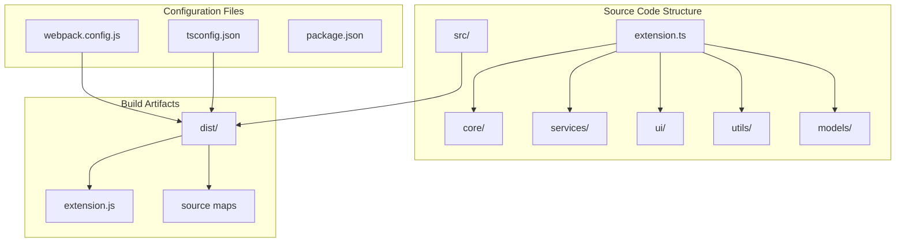
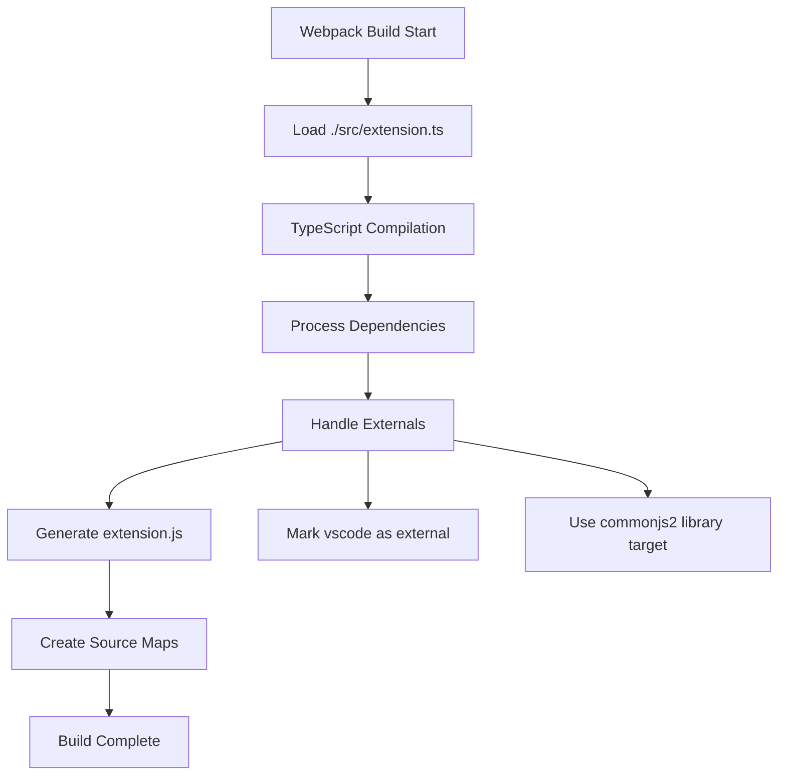
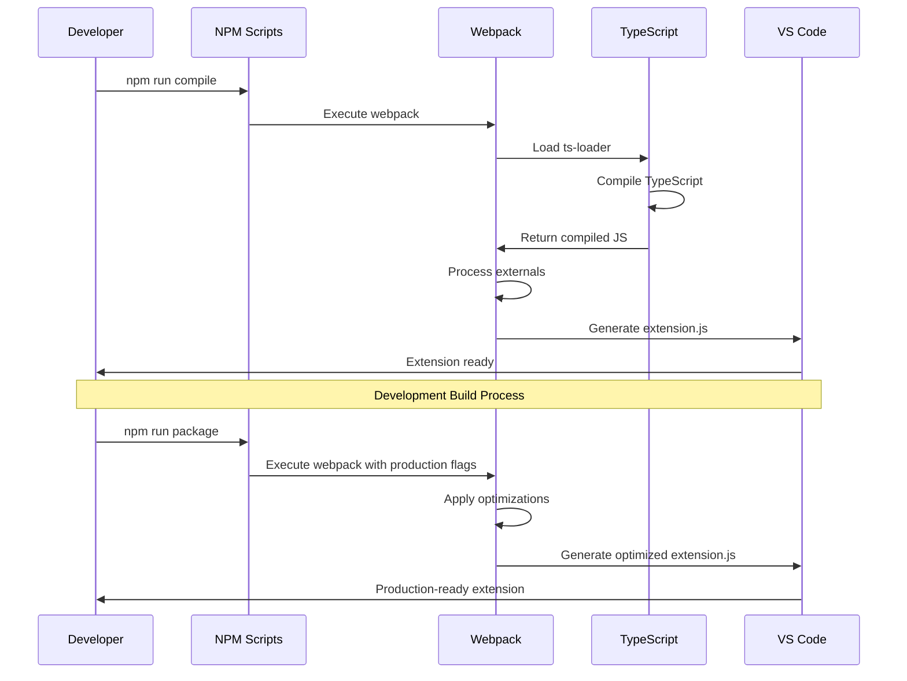
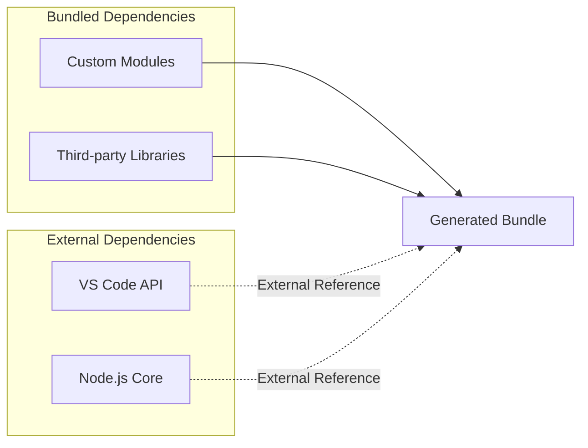

# Build Configuration

<cite>
**Referenced Files in This Document**
- [webpack.config.js](file://webpack.config.js)
- [tsconfig.json](file://tsconfig.json)
- [package.json](file://package.json)
- [src/extension.ts](file://src/extension.ts)
</cite>

## Table of Contents
1. [Introduction](#introduction)
2. [Project Structure Overview](#project-structure-overview)
3. [Webpack Configuration Analysis](#webpack-configuration-analysis)
4. [TypeScript Configuration Analysis](#typescript-configuration-analysis)
5. [Build Pipeline Architecture](#build-pipeline-architecture)
6. [Module Resolution Strategy](#module-resolution-strategy)
7. [Development Workflow](#development-workflow)
8. [Production Optimization](#production-optimization)
9. [Troubleshooting Guide](#troubleshooting-guide)
10. [Best Practices](#best-practices)

## Introduction

CodeKarmic is a sophisticated VS Code extension that leverages AI-powered code review capabilities. The build configuration serves as the foundation for transforming TypeScript source code into a deployable VS Code extension. This documentation provides a comprehensive analysis of the webpack and TypeScript configurations that enable seamless development and production workflows for the extension.

The build system is designed to handle the complexities of VS Code extension development, including proper module bundling, external dependency management, and source map generation for debugging. The configuration supports both development and production environments while maintaining optimal performance characteristics.

## Project Structure Overview

The CodeKarmic project follows a well-organized structure that separates concerns between source code, configuration files, and build artifacts:

**Diagram sources**
- [webpack.config.js](file://webpack.config.js#L6-L13)
- [tsconfig.json](file://tsconfig.json#L14-L15)
- [package.json](file://package.json#L36-L36)

**Section sources**
- [webpack.config.js](file://webpack.config.js#L1-L48)
- [tsconfig.json](file://tsconfig.json#L1-L19)
- [package.json](file://package.json#L1-L311)

## Webpack Configuration Analysis

The webpack configuration serves as the primary build tool for transforming TypeScript source code into a distributable VS Code extension. The configuration is specifically tailored for Node.js environments and VS Code extension requirements.

### Entry Point Configuration

The build process begins with a single entry point located at [`./src/extension.ts`](file://src/extension.ts#L1-L50). This file serves as the main activation point for the VS Code extension, containing the `activate()` and `deactivate()` functions required by VS Code extension APIs.

**Diagram sources**
- [webpack.config.js](file://webpack.config.js#L6-L13)
- [src/extension.ts](file://src/extension.ts#L20-L520)

### Target Environment Configuration

The configuration targets the `node` environment, which is essential for VS Code extension development. This setting ensures that the built extension can run within VS Code's Node.js runtime environment while maintaining compatibility with VS Code's extension API.

### Output Configuration

The output configuration generates a single JavaScript file named `extension.js` in the `dist` directory. The `libraryTarget: 'commonjs2'` setting is crucial for VS Code extension compatibility, as it ensures the module is exported using CommonJS format, which is the standard for Node.js modules.

### Module Processing Rules

The TypeScript compilation is handled by `ts-loader` with specific compiler options. The loader configuration includes:

- **Test Pattern**: Matches `.ts` files exclusively
- **Exclusion**: Ignores `node_modules` to prevent unnecessary processing
- **Compiler Options**: Sets `moduleResolution: 'node'` for proper module resolution

### External Dependencies Management

The `externals` configuration is a critical component that prevents bundling of VS Code's internal modules. Specifically, the `vscode` module is marked as `'commonjs vscode'`, ensuring that:

- The extension can access VS Code's API without bundling it
- Runtime dependencies are resolved dynamically
- Bundle size is minimized
- Extension loading performance is optimized

### Source Map Generation

The `hidden-source-map` devtool setting provides debugging capabilities for production builds while maintaining a clean separation between source code and generated code. This approach offers:

- Debugging support during development
- Production-ready source maps without exposing source code
- Minimal impact on bundle size
- Compatibility with VS Code's debugging infrastructure

### Module Resolution Configuration

The `resolve` configuration enhances module resolution by:

- Supporting `.ts` and `.js` extensions for flexible imports
- Adding custom module resolution paths for improved organization
- Enabling efficient path resolution for internal modules

**Section sources**
- [webpack.config.js](file://webpack.config.js#L1-L48)

## TypeScript Configuration Analysis

The TypeScript configuration provides comprehensive settings for compiling the extension's source code with modern JavaScript features while maintaining compatibility with VS Code's requirements.

### Compiler Target and Module System

The configuration targets `ESNext` for both the compiler target and module system, enabling the use of the latest JavaScript features. This choice provides:

- Access to modern JavaScript syntax and features
- Future-proofing for upcoming ECMAScript standards
- Optimal code generation for modern environments
- Compatibility with VS Code's Node.js runtime

### Module Resolution Strategy

The `moduleResolution: 'node'` setting ensures compatibility with Node.js module resolution, which is essential for:

- Proper handling of `node_modules` dependencies
- Support for ES modules and CommonJS interoperability
- Consistent behavior across different development environments
- Integration with VS Code's extension API

### Source Map and Declaration Generation

The configuration enables both source map generation and declaration file creation:

- **Source Maps**: Enabled with `sourceMap: true` for debugging support
- **Declaration Files**: Generated with `declaration: true` for TypeScript consumers
- These settings facilitate development workflows and provide IntelliSense support

### Directory Structure Configuration

The `rootDir` and `outDir` settings establish a clean separation between source and output directories:

- **rootDir**: Specifies the source directory (`./src`)
- **outDir**: Defines the output directory (`./dist`)
- This structure maintains organized file organization and simplifies build processes

### Strict Type Checking

The configuration enables strict type checking with relaxed rules for unused locals and parameters:

- **Strict Mode**: Enabled for comprehensive type safety
- **Relaxed Unused Checks**: Disabled for unused locals and parameters to accommodate VS Code extension patterns
- **Implicit Returns**: Enforced with `noImplicitReturns: true` for safer function implementations

**Section sources**
- [tsconfig.json](file://tsconfig.json#L1-L19)

## Build Pipeline Architecture

The build pipeline integrates webpack and TypeScript configurations to create a robust development and production workflow for the VS Code extension.

**Diagram sources**
- [package.json](file://package.json#L283-L287)
- [webpack.config.js](file://webpack.config.js#L8-L13)

### Development vs Production Builds

The build system supports both development and production configurations:

- **Development**: Uses `webpack` command with watch mode for rapid iteration
- **Production**: Uses `webpack --mode production --devtool hidden-source-map` for optimized builds
- **Pre-publish**: Uses `npm run package` for CI/CD integration

### Optimization Strategies

The production build incorporates several optimization strategies:

- **Minification**: Enabled through webpack's optimization settings
- **Source Maps**: Hidden source maps for debugging without exposing source code
- **Bundle Size**: Optimized through external dependency management

**Section sources**
- [package.json](file://package.json#L283-L287)

## Module Resolution Strategy

The module resolution strategy ensures efficient and predictable module loading throughout the extension's development lifecycle.

### Path Resolution Configuration

The `resolve.modules` configuration provides custom path resolution for improved module organization:

- **Custom Source Path**: Adds `./src` as a resolution path for easier imports
- **Node Modules**: Maintains standard `node_modules` resolution
- This approach reduces path complexity and improves code readability

### Extension Support

The `resolve.extensions` configuration enables flexible import statements:

- **TypeScript Files**: Supports `.ts` extensions for direct imports
- **JavaScript Files**: Supports `.js` extensions for compatibility
- This dual-extension support accommodates mixed TypeScript/JavaScript codebases

### External Dependency Handling

The external dependency management prevents bundling of VS Code's internal modules:

**Diagram sources**
- [webpack.config.js](file://webpack.config.js#L18-L20)

**Section sources**
- [webpack.config.js](file://webpack.config.js#L24-L28)

## Development Workflow

The development workflow leverages the build configuration to provide an efficient development experience with hot reloading and debugging capabilities.

### Script Configuration

The `package.json` defines several development scripts:

- **Compile**: Runs webpack for single build execution
- **Watch**: Enables continuous compilation with file watching
- **Package**: Creates production-ready builds with optimizations

### Hot Reloading Support

The development workflow supports hot reloading through:

- **File Watching**: Automatic recompilation on source file changes
- **Incremental Builds**: Fast rebuilds for improved development speed
- **Error Reporting**: Comprehensive error reporting for debugging

### Debugging Integration

The source map configuration enables seamless debugging:

- **Hidden Source Maps**: Production-ready debugging without source exposure
- **VS Code Integration**: Full debugging support within VS Code
- **Runtime Inspection**: Ability to inspect original TypeScript code during debugging

**Section sources**
- [package.json](file://package.json#L283-L287)

## Production Optimization

The production build configuration focuses on delivering optimized, production-ready extensions with minimal overhead.

### Bundle Optimization

The optimization strategies include:

- **External Dependencies**: Prevents bundling of VS Code API
- **Minification**: Reduces bundle size through code minification
- **Dead Code Elimination**: Removes unused code from the final bundle

### Performance Characteristics

The production build delivers:

- **Fast Loading**: Optimized bundle size for quick extension activation
- **Minimal Dependencies**: Reduced external dependencies through careful exclusion
- **Debugging Support**: Hidden source maps for production debugging

### Deployment Preparation

The production build prepares the extension for distribution:

- **Clean Output**: Organized `dist` directory with optimized files
- **Source Maps**: Hidden source maps for debugging without exposing code
- **Compatibility**: Ensures compatibility with VS Code's extension marketplace

**Section sources**
- [webpack.config.js](file://webpack.config.js#L15-L17)

## Troubleshooting Guide

Common issues and solutions for the build configuration:

### Module Resolution Issues

**Problem**: Import errors for internal modules
**Solution**: Verify `resolve.modules` configuration and ensure proper path resolution

**Problem**: VS Code API not found
**Solution**: Confirm `externals.vscode` configuration is properly set to `'commonjs vscode'`

### TypeScript Compilation Errors

**Problem**: Type checking failures
**Solution**: Review `tsconfig.json` settings and ensure proper type definitions

**Problem**: Source map generation issues
**Solution**: Verify `sourceMap` and `declaration` settings in `tsconfig.json`

### Build Performance Issues

**Problem**: Slow build times
**Solution**: Enable incremental compilation and optimize module resolution paths

**Problem**: Large bundle size
**Solution**: Review external dependencies and optimize module imports

## Best Practices

### Configuration Management

- **Separate Configurations**: Maintain separate configurations for development and production
- **Environment Variables**: Use environment-specific settings when necessary
- **Version Control**: Track configuration changes for reproducible builds

### Development Workflow

- **Hot Reloading**: Leverage watch mode for rapid development iteration
- **Debugging**: Utilize source maps for effective debugging
- **Testing**: Implement comprehensive testing strategies for extension functionality

### Performance Optimization

- **Bundle Analysis**: Regularly analyze bundle composition and size
- **Dependency Management**: Carefully manage external dependencies
- **Caching**: Implement caching strategies for improved build performance

### Maintenance and Updates

- **Dependency Updates**: Regularly update build dependencies
- **Configuration Reviews**: Periodically review and optimize build configurations
- **Documentation**: Maintain up-to-date documentation for build processes