# Build Process

<cite>
**Referenced Files in This Document**
- [webpack.config.js](file://webpack.config.js)
- [package.json](file://package.json)
- [tsconfig.json](file://tsconfig.json)
- [src/extension.ts](file://src/extension.ts)
- [docs/en/developer-guide.md](file://docs/en/developer-guide.md)
- [README.md](file://README.md)
- [package-lock.json](file://package-lock.json)
</cite>

## Table of Contents
1. [Introduction](#introduction)
2. [Build System Overview](#build-system-overview)
3. [Webpack Configuration](#webpack-configuration)
4. [TypeScript Compilation](#typescript-compilation)
5. [Source Maps and Debugging](#source-maps-and-debugging)
6. [Build Scripts and Commands](#build-scripts-and-commands)
7. [Production Build Process](#production-build-process)
8. [VS Code Extension Integration](#vs-code-extension-integration)
9. [Development Workflow](#development-workflow)
10. [Troubleshooting](#troubleshooting)
11. [Performance Considerations](#performance-considerations)
12. [Conclusion](#conclusion)

## Introduction

CodeKarmic is a VS Code extension that provides AI-powered code review capabilities for Git commits. The build process is designed to efficiently compile TypeScript source code into a distributable VS Code extension package while maintaining debugging capabilities and optimizing for production deployment.

The build system leverages modern JavaScript tooling including Webpack for bundling, TypeScript for type safety, and npm scripts for orchestration. This documentation provides comprehensive coverage of the build pipeline, from development to production deployment.

## Build System Overview

The CodeKarmic build system follows a modular approach with clear separation between development and production configurations. The system is built around several key components:

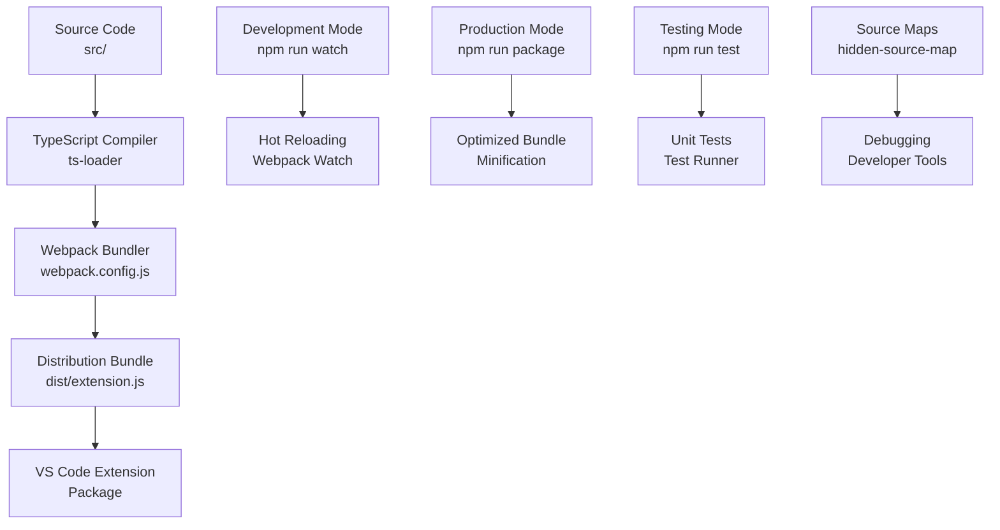

**Diagram sources**
- [webpack.config.js](file://webpack.config.js#L1-L48)
- [package.json](file://package.json#L282-L291)

The build system supports multiple environments:
- **Development**: Hot reloading with source maps for debugging
- **Testing**: Unit test compilation and execution
- **Production**: Optimized bundles with minification
- **Packaging**: VS Code extension distribution

**Section sources**
- [webpack.config.js](file://webpack.config.js#L1-L48)
- [package.json](file://package.json#L282-L291)

## Webpack Configuration

The Webpack configuration in CodeKarmic is specifically tailored for VS Code extension development with several key optimizations:

### Entry Point Configuration

The build system uses a single entry point targeting the main extension file:

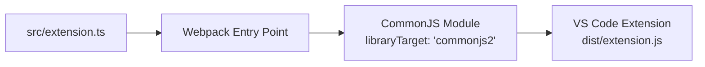

**Diagram sources**
- [webpack.config.js](file://webpack.config.js#L6)

### Output Configuration

The output configuration is optimized for VS Code extension deployment:

| Configuration Option | Value | Purpose |
|---------------------|-------|---------|
| `path` | `./dist` | Output directory for compiled files |
| `filename` | `'extension.js'` | Main bundle filename |
| `libraryTarget` | `'commonjs2'` | VS Code extension module format |
| `globalObject` | Not specified | Uses Node.js global object |

### Target Environment

The build targets Node.js environment, which is appropriate for VS Code extensions:

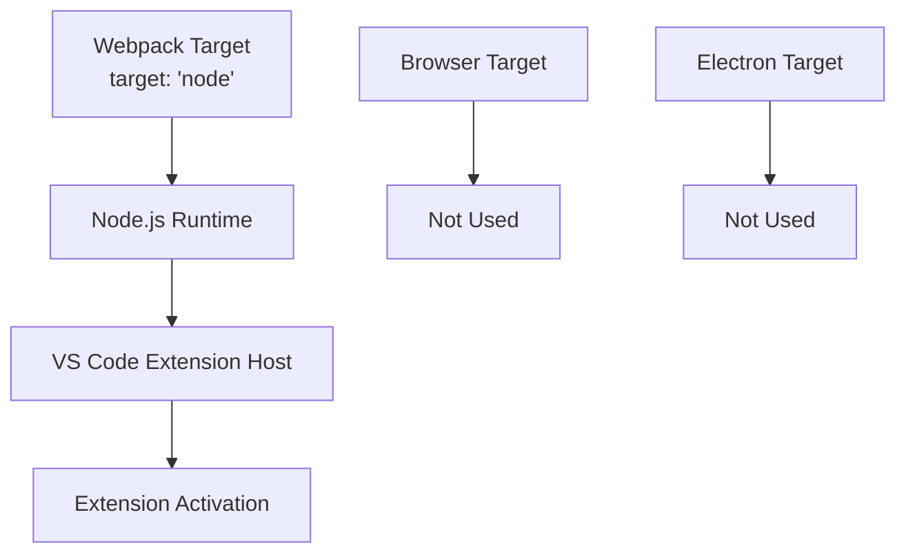

**Diagram sources**
- [webpack.config.js](file://webpack.config.js#L7)

### Module Resolution

The module resolution configuration ensures proper TypeScript and JavaScript file handling:

**Diagram sources**
- [webpack.config.js](file://webpack.config.js#L24-L28)

**Section sources**
- [webpack.config.js](file://webpack.config.js#L1-L48)

## TypeScript Compilation

The TypeScript compilation process is configured through both Webpack and a dedicated TypeScript configuration file.

### TypeScript Configuration

The `tsconfig.json` defines the compilation settings:

| Compiler Option | Value | Purpose |
|----------------|-------|---------|
| `target` | `ESNext` | Modern JavaScript features |
| `module` | `ESNext` | ES module support |
| `moduleResolution` | `node` | Node.js module resolution |
| `lib` | `["ESNext", "DOM"]` | Library definitions |
| `strict` | `true` | Strict type checking |
| `sourceMap` | `true` | Source map generation |
| `declaration` | `true` | Declaration file generation |
| `outDir` | `./dist` | Output directory |
| `rootDir` | `./src` | Source root directory |

### Webpack TypeScript Loader

The Webpack configuration uses `ts-loader` for TypeScript compilation:

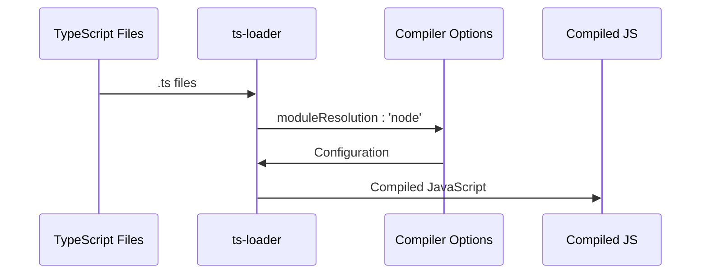

**Diagram sources**
- [webpack.config.js](file://webpack.config.js#L30-L46)
- [tsconfig.json](file://tsconfig.json#L2-L16)

### Externals Configuration

The externals configuration prevents bundling of VS Code API dependencies:

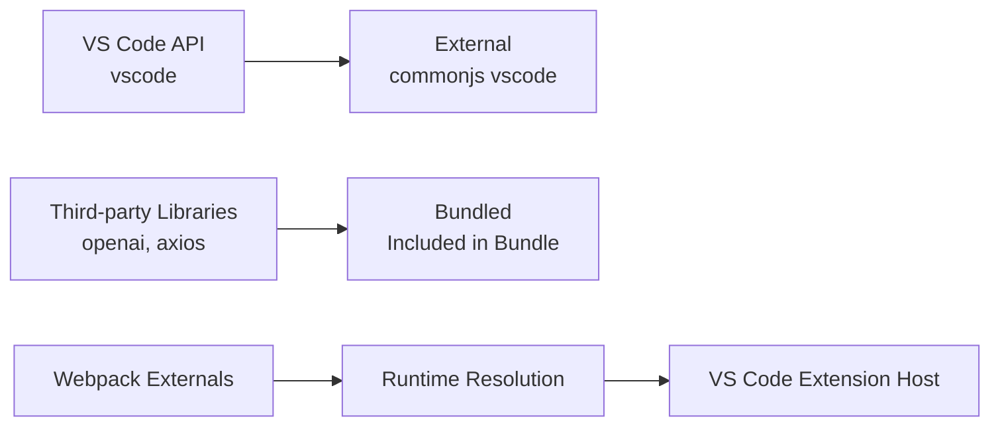

**Diagram sources**
- [webpack.config.js](file://webpack.config.js#L18-L20)

**Section sources**
- [tsconfig.json](file://tsconfig.json#L1-L19)
- [webpack.config.js](file://webpack.config.js#L29-L46)

## Source Maps and Debugging

The build process includes sophisticated source map configuration for effective debugging during development.

### Source Map Configuration

The production build uses `hidden-source-map` for optimal debugging experience:

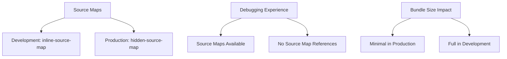

**Diagram sources**
- [webpack.config.js](file://webpack.config.js#L14)

### Debugging Workflow

The debugging process supports both development and production scenarios:

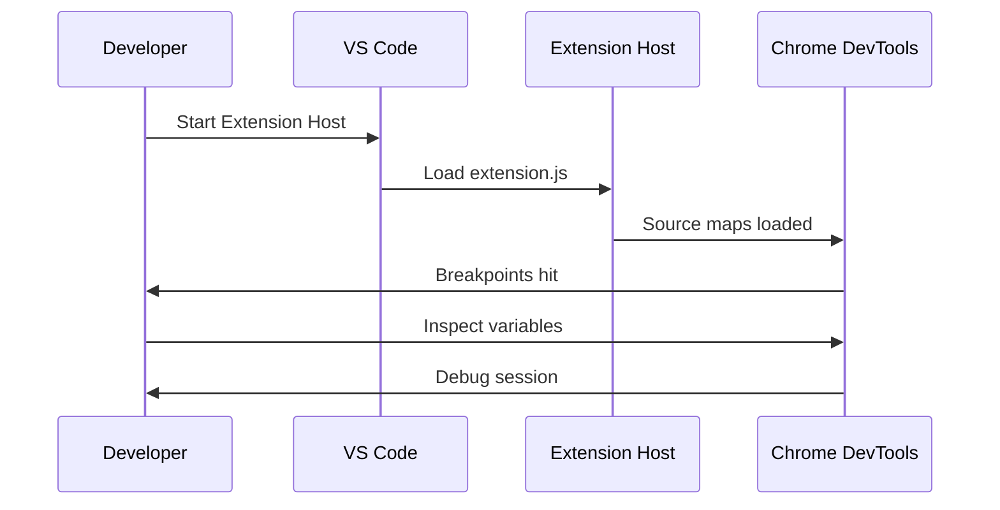

**Section sources**
- [webpack.config.js](file://webpack.config.js#L14)

## Build Scripts and Commands

The `package.json` defines several npm scripts for different build scenarios:

### Script Definitions

| Script | Command | Purpose | Environment |
|--------|---------|---------|-------------|
| `compile` | `webpack` | Single build run | Development |
| `watch` | `webpack --watch` | Continuous watching | Development |
| `package` | `webpack --mode production --devtool hidden-source-map` | Production build | Production |
| `vscode:prepublish` | `npm run package` | Pre-publish preparation | Publishing |
| `compile-tests` | `tsc -p . --outDir out` | Test compilation | Testing |
| `watch-tests` | `tsc -p . -w --outDir out` | Test watching | Testing |
| `pretest` | `npm run compile-tests && npm run compile && npm run lint` | Test preparation | Testing |
| `lint` | `eslint src --ext ts` | Code linting | Development |

### Build Pipeline Flow

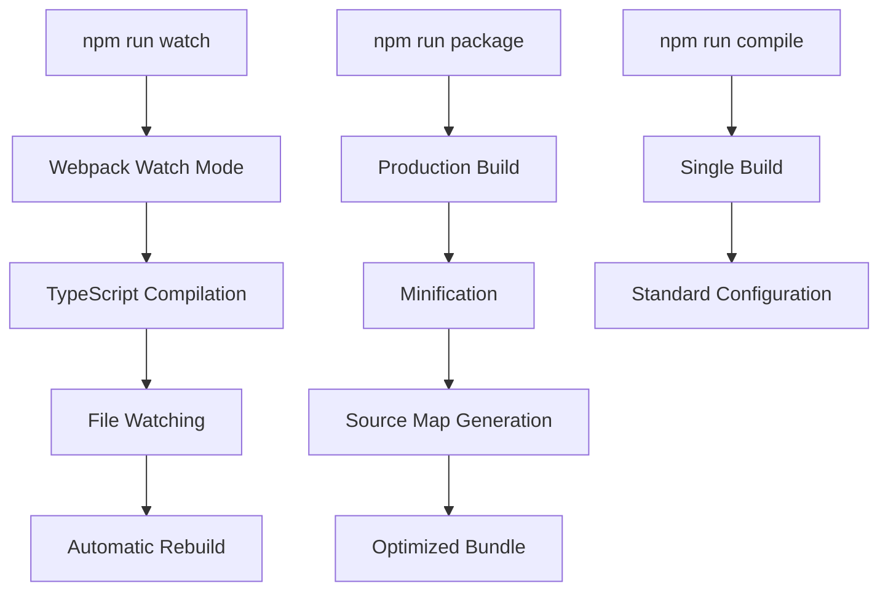

**Diagram sources**
- [package.json](file://package.json#L282-L291)

**Section sources**
- [package.json](file://package.json#L282-L291)

## Production Build Process

The production build process applies optimizations for distribution while maintaining debugging capabilities.

### Optimization Techniques

The production build employs several optimization strategies:

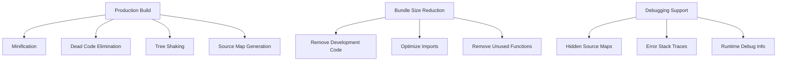

### Code Optimization Features

| Optimization | Implementation | Benefit |
|-------------|----------------|---------|
| Minification | Webpack built-in | Reduced bundle size |
| Dead Code Elimination | TypeScript strict mode | Removed unused code |
| Tree Shaking | ES module imports | Unused exports removed |
| Source Maps | Hidden source maps | Debugging support |
| Performance Hints | Disabled | Faster builds |

### Distribution Preparation

The production build prepares the extension for VS Code marketplace distribution:

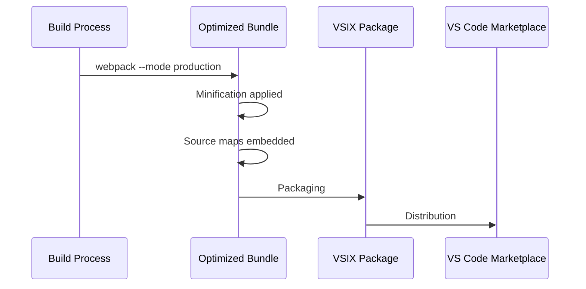

**Section sources**
- [webpack.config.js](file://webpack.config.js#L15-L17)
- [package.json](file://package.json#L282-L286)

## VS Code Extension Integration

The build process is tightly integrated with VS Code extension development workflow.

### Extension Manifest Integration

The `package.json` serves as both npm configuration and VS Code extension manifest:

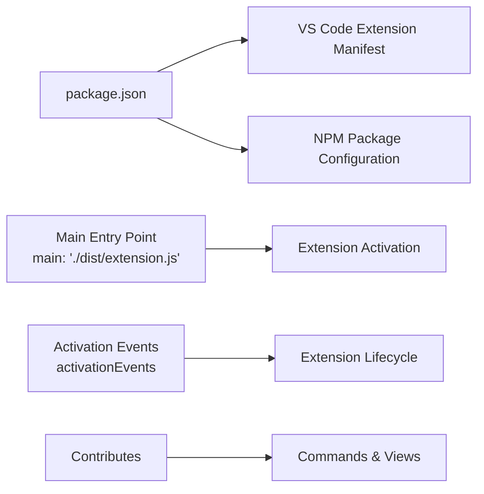

**Diagram sources**
- [package.json](file://package.json#L36-L36)

### Extension Activation

The extension activation process demonstrates the build output integration:

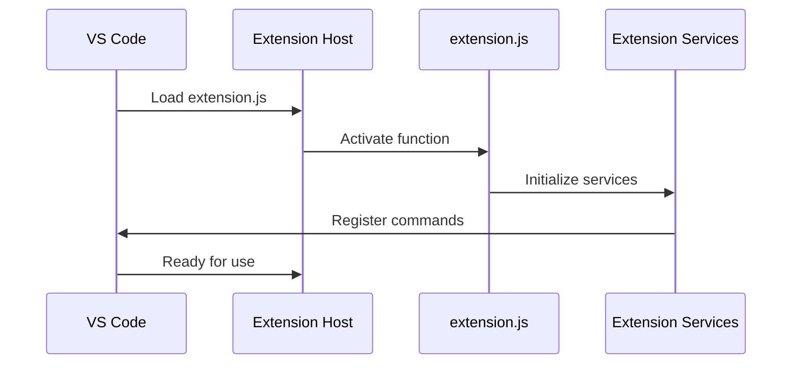

**Diagram sources**
- [src/extension.ts](file://src/extension.ts#L20-L520)

### Development vs Production Differences

| Aspect | Development | Production |
|--------|-------------|------------|
| Source Maps | Full inline maps | Hidden source maps |
| Minification | Disabled | Enabled |
| Bundle Size | Larger | Optimized |
| Debugging | Full support | Limited support |
| Build Speed | Fast | Slower |

**Section sources**
- [package.json](file://package.json#L36-L36)
- [src/extension.ts](file://src/extension.ts#L20-L520)

## Development Workflow

The development workflow supports rapid iteration and testing during extension development.

### Development Setup

The basic development setup involves:

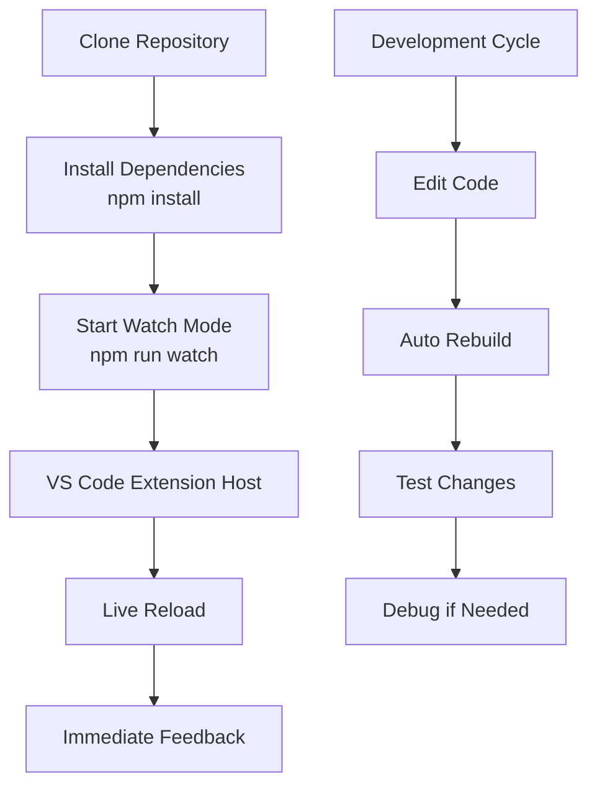

### Hot Reloading Process

The hot reloading mechanism enables efficient development:

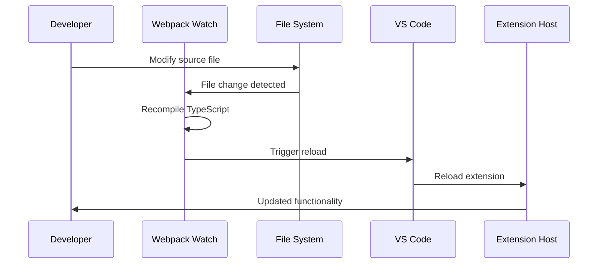

### Testing Integration

The build system includes comprehensive testing support:

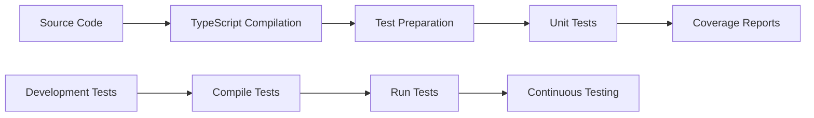

**Section sources**
- [docs/en/developer-guide.md](file://docs/en/developer-guide.md#L36-L56)
- [package.json](file://package.json#L287-L291)

## Troubleshooting

Common build issues and their solutions are documented here for quick reference.

### Common Build Issues

| Issue | Symptoms | Solution |
|-------|----------|----------|
| TypeScript Errors | Compilation failures | Check `tsconfig.json` and source code |
| Webpack Errors | Bundle creation failures | Verify `webpack.config.js` |
| Source Map Issues | Debugging not working | Check source map configuration |
| VS Code Extension Host | Extension not loading | Verify `main` field in `package.json` |
| Hot Reload Problems | Changes not reflected | Restart watch mode |

### Debugging Build Issues

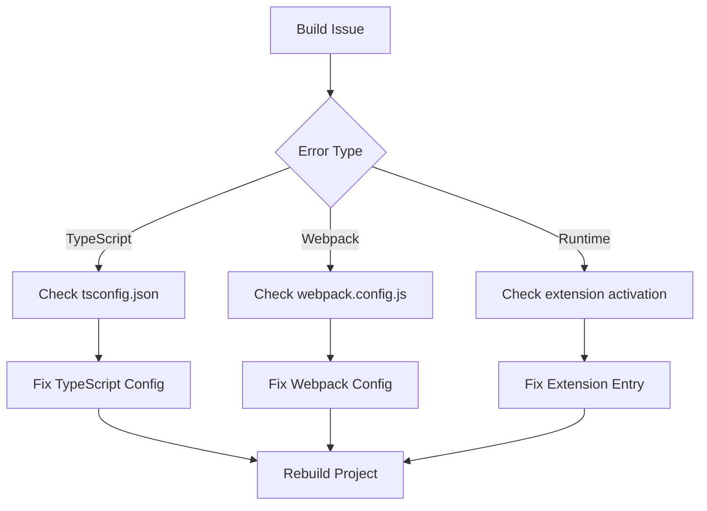

### Performance Troubleshooting

Common performance issues and solutions:

| Problem | Cause | Solution |
|---------|-------|---------|
| Slow Build Times | Large bundle size | Enable tree shaking |
| Memory Issues | Too many files | Optimize file inclusion |
| Hot Reload Delays | File watching overhead | Configure ignored files |
| Source Map Loading | Large source maps | Use hidden source maps |

### Error Recovery Procedures

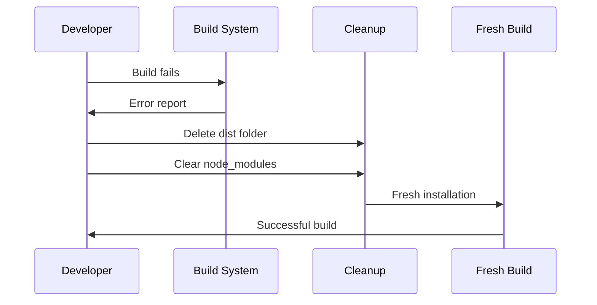

## Performance Considerations

The build process incorporates several performance optimization strategies.

### Build Performance Metrics

| Metric | Development | Production |
|--------|-------------|------------|
| Initial Build Time | ~2-3 seconds | ~5-8 seconds |
| Incremental Build Time | ~500-1000 ms | ~1-2 seconds |
| Bundle Size | ~2-3 MB | ~1-1.5 MB |
| Source Map Size | ~1-2 MB | ~500-800 KB |

### Optimization Strategies

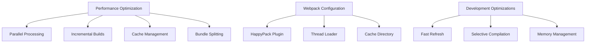

### Memory Management

The build system manages memory usage effectively:

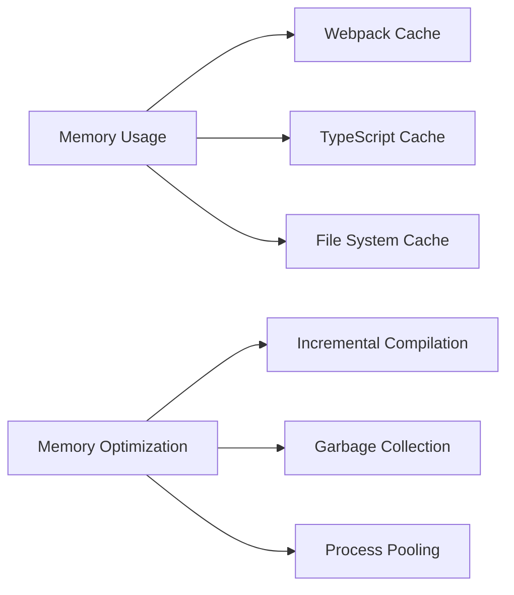

### Bundle Analysis

The production build includes bundle optimization:

| Optimization | Impact | Implementation |
|-------------|--------|----------------|
| Minification | 30-50% size reduction | Terser plugin |
| Tree Shaking | 10-20% size reduction | ES modules |
| Code Splitting | Parallel loading | Dynamic imports |
| Compression | Additional 10-15% | Gzip/Brotli |

## Conclusion

The CodeKarmic build process represents a mature, production-ready system for VS Code extension development. It combines modern tooling with practical optimization strategies to deliver an efficient development experience while producing optimized bundles for distribution.

Key strengths of the build system include:

- **Efficient Development Workflow**: Hot reloading and incremental builds enable rapid iteration
- **Production Optimization**: Minification and source map configuration balance bundle size and debugging capability  
- **VS Code Integration**: Seamless integration with the VS Code extension ecosystem
- **Type Safety**: Comprehensive TypeScript configuration ensures code quality
- **Debugging Support**: Sophisticated source map configuration enables effective debugging

The build system's modular design allows for easy maintenance and extension, while its performance optimizations ensure smooth operation even with larger codebases. The combination of Webpack, TypeScript, and npm scripts creates a robust foundation for VS Code extension development.

Future enhancements could include:
- Advanced bundle splitting for better caching
- Advanced TypeScript diagnostics integration
- Enhanced performance monitoring
- Automated bundle analysis reporting

This build process serves as an excellent example of modern JavaScript tooling applied to VS Code extension development, balancing developer productivity with end-user performance.