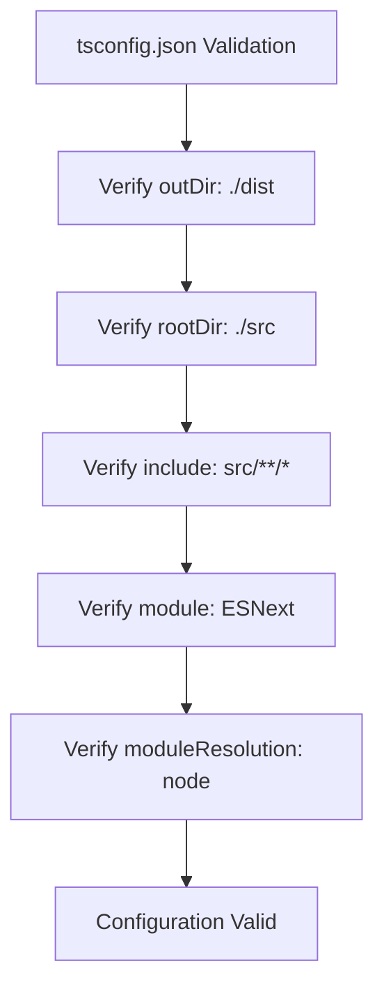
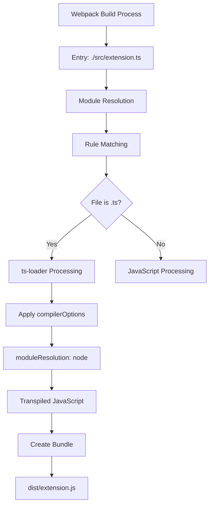
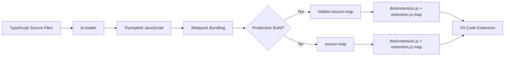
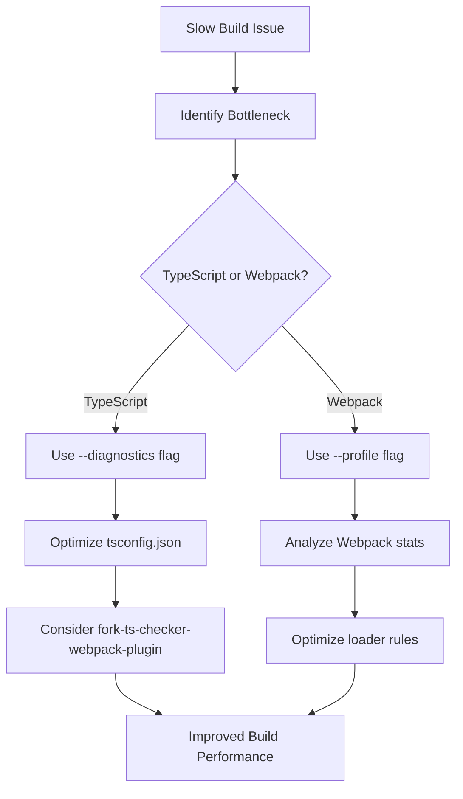

# Build Troubleshooting

<cite>
**Referenced Files in This Document**   
- [package.json](file://package.json)
- [tsconfig.json](file://tsconfig.json)
- [webpack.config.js](file://webpack.config.js)
- [src/extension.ts](file://src/extension.ts)
</cite>

## Table of Contents
1. [Introduction](#introduction)
2. [TypeScript Compilation Issues](#typescript-compilation-issues)
3. [Webpack Configuration Problems](#webpack-configuration-problems)
4. [Output and Source Map Generation](#output-and-source-map-generation)
5. [Script Execution Troubleshooting](#script-execution-troubleshooting)
6. [Debugging Strategies](#debugging-strategies)
7. [Performance Optimization](#performance-optimization)

## Introduction
This troubleshooting guide provides comprehensive solutions for common build issues in the CodeKarmic project. The build system uses TypeScript with Webpack to compile a VS Code extension, and various issues can arise during development. This guide covers TypeScript compilation errors, Webpack configuration problems, output generation issues, script execution failures, and performance optimization strategies. Understanding these common issues and their solutions will help maintain a smooth development workflow.

**Section sources**
- [package.json](file://package.json#L282-L291)
- [tsconfig.json](file://tsconfig.json#L1-L19)
- [webpack.config.js](file://webpack.config.js#L1-L47)

## TypeScript Compilation Issues

### Type Mismatch Errors
Type mismatch errors occur when TypeScript detects incompatible types in assignments, function parameters, or return values. These errors are typically caught during compilation due to the strict type checking enabled in the project's tsconfig.json. The configuration includes "strict": true and "noImplicitReturns": true, which enforce rigorous type checking and require explicit return statements in functions.

To resolve type mismatch errors:
1. Verify that all variables are properly typed with appropriate interfaces or types
2. Check function signatures to ensure parameters and return values match expected types
3. Use type assertions only when necessary and with proper validation
4. Ensure imported types from external modules match the expected structure

Common causes include using any type inappropriately, incorrect array or object type definitions, and mismatched Promise return types. The project follows strict naming conventions as defined in .windsurfrules, requiring camelCase for file names and TypeScript identifiers.

**Section sources**
- [tsconfig.json](file://tsconfig.json#L7-L11)
- [.windsurfrules](file://.windsurfrules#L2)

### tsconfig.json Configuration Problems
The tsconfig.json file contains critical compiler options that affect the build process. Issues with this configuration can lead to various compilation problems. The current configuration targets ESNext for both compilation target and module system, with node-style module resolution.

Key configuration issues to watch for:
- Incorrect "outDir" or "rootDir" paths that don't match the project structure
- Missing or incorrect "include" patterns that fail to capture all source files
- Conflicting module and moduleResolution settings
- Incompatible lib references for the target environment

The configuration must maintain consistency between the TypeScript compiler options and Webpack's module resolution. For example, both use node-style module resolution to ensure consistent behavior between TypeScript compilation and Webpack bundling.

**Diagram sources**
- [tsconfig.json](file://tsconfig.json#L2-L18)

## Webpack Configuration Problems

### Module Resolution Failures
Module resolution failures occur when Webpack cannot locate imported modules. The Webpack configuration specifies module resolution with extensions ['.ts', '.js'] and resolves modules from both the src directory and node_modules. This allows imports without file extensions and prioritizes source files over node_modules.

Common causes of module resolution failures:
- Incorrect import paths that don't match the file structure
- Missing or incorrect file extensions in import statements
- Case sensitivity issues in file paths
- Circular dependencies between modules

The resolve.modules configuration includes path.resolve(__dirname, 'src') as a module directory, allowing imports from the src root without relative path specifiers. For example, import statements can use 'services/git/gitService' instead of '../../services/git/gitService'.

**Section sources**
- [webpack.config.js](file://webpack.config.js#L24-L27)
- [src/extension.ts](file://src/extension.ts#L2-L7)

### Loader Configuration Issues with ts-loader
The Webpack configuration uses ts-loader to process TypeScript files. The loader is configured to handle .ts files with specific compiler options, particularly moduleResolution set to 'node'. Issues with ts-loader configuration can result in "Module parse failed" errors.

To troubleshoot ts-loader issues:
1. Verify that the test regex /\.ts$/ correctly matches TypeScript files
2. Ensure exclude pattern /node_modules/ prevents processing of dependencies
3. Check that ts-loader options align with tsconfig.json compiler options
4. Validate that the TypeScript version is compatible with ts-loader

A common error is "Module parse failed: Unexpected token" which typically indicates that ts-loader is not properly processing TypeScript syntax. This can occur if the loader configuration is bypassed or if JavaScript files with TypeScript syntax are processed without the loader.

**Diagram sources**
- [webpack.config.js](file://webpack.config.js#L6-L46)

### External Module Problems
The Webpack configuration specifies 'vscode' as an external module with the declaration 'commonjs vscode'. This prevents bundling the vscode module and instead references it as a CommonJS dependency at runtime. Issues with external modules can cause "Cannot find module 'vscode'" errors during extension execution.

Common external module issues:
- Missing or incorrect external declarations in webpack.config.js
- Attempting to bundle vscode module instead of treating it as external
- Version incompatibilities between the declared external and runtime environment
- Incorrect libraryTarget configuration

The externals configuration must match the target environment's module system. For VS Code extensions, commonjs2 is used as the libraryTarget to ensure compatibility with Node.js module loading.

**Section sources**
- [webpack.config.js](file://webpack.config.js#L18-L20)
- [package.json](file://package.json#L13)

## Output and Source Map Generation

### Missing Output Files
Missing output files typically occur when the build process fails to generate the expected dist/extension.js file. This can be caused by compilation errors, incorrect output configuration, or file system permissions issues.

To diagnose missing output files:
1. Check for TypeScript compilation errors that prevent Webpack from completing
2. Verify the output.path configuration points to the correct directory
3. Ensure the output.filename matches the "main" field in package.json
4. Validate that the build process has write permissions to the output directory

The Webpack configuration sets output.path to path.resolve(__dirname, 'dist') and filename to 'extension.js', which must match the "main" field in package.json that specifies "./dist/extension.js".

**Section sources**
- [webpack.config.js](file://webpack.config.js#L9-L12)
- [package.json](file://package.json#L36)

### Incorrect Output Paths
Incorrect output paths can cause the extension to fail loading in VS Code. The output path must be correctly configured in both webpack.config.js and referenced properly in package.json.

Key considerations for output paths:
- Use absolute paths with path.resolve() to ensure consistency across environments
- Maintain alignment between Webpack's output.path and package.json's "main" field
- Avoid hardcoded relative paths that may break in different execution contexts
- Ensure the output directory exists or can be created by the build process

The current configuration correctly uses path.resolve(__dirname, 'dist') to create an absolute path to the dist directory, preventing issues with relative path resolution.

### Source Map Generation Problems
Source map generation is configured with devtool: 'hidden-source-map' in webpack.config.js. This generates source maps without embedding them in the output bundle, which is appropriate for VS Code extensions. Issues with source maps can hinder debugging and error tracing.

Common source map issues:
- Missing source maps despite devtool configuration
- Source maps that don't accurately map to original source files
- Performance impacts from source map generation
- Incorrect source map references in the output

The hidden-source-map option creates separate .js.map files without adding a source map comment to the JavaScript file, which is required for VS Code extensions to pass marketplace validation.

**Diagram sources**
- [webpack.config.js](file://webpack.config.js#L14)
- [package.json](file://package.json#L286)

## Script Execution Troubleshooting

### 'compile' Script Issues
The 'compile' script in package.json runs 'webpack' to build the extension. Issues with this script can prevent successful compilation. The script relies on the Webpack configuration and may fail due to configuration errors, missing dependencies, or TypeScript compilation issues.

To troubleshoot 'compile' script problems:
1. Verify all devDependencies are installed (npm install)
2. Check for syntax errors in webpack.config.js
3. Validate TypeScript configuration in tsconfig.json
4. Ensure node_modules/.bin/webpack is available

The script executes Webpack with default settings, which uses the production mode unless otherwise specified. This can cause issues during development when more verbose output is needed.

**Section sources**
- [package.json](file://package.json#L284)

### 'watch' Script Problems
The 'watch' script runs 'webpack --watch' to enable continuous compilation during development. Issues with this script can disrupt the development workflow by failing to detect file changes or not recompiling properly.

Common 'watch' script issues:
- File system limitations preventing change detection
- Performance problems with large codebases
- Memory leaks in long-running processes
- Incomplete rebuilds after changes

The watch mode should automatically recompile when source files change, but may require manual restart if the file watcher becomes unresponsive. This can occur on certain file systems or when too many files are being watched.

**Section sources**
- [package.json](file://package.json#L285)

### 'package' Script Failures
The 'package' script runs 'webpack --mode production --devtool hidden-source-map' to create a production build. This script is used for the vscode:prepublish hook and must generate a valid extension package.

Common 'package' script issues:
- Minification problems that break functionality
- Incorrect source map generation
- Size optimization removing necessary code
- Environment-specific configuration conflicts

The production mode enables optimization.minimize, which uses TerserPlugin to minify the output. This can sometimes remove code that appears unused but is required at runtime, particularly with dynamic imports or reflection.

**Section sources**
- [package.json](file://package.json#L286)

## Debugging Strategies

### Enabling Verbose Logging
Verbose logging can be enabled by modifying the Webpack configuration or using command-line flags. While the current configuration doesn't include extensive logging, the build process can be made more verbose by:

1. Removing or modifying the performance.hints: false setting to receive performance suggestions
2. Using the --verbose flag with Webpack commands
3. Adding logging plugins to the Webpack configuration
4. Increasing TypeScript's diagnostic output

The extension itself includes a NotificationManager for runtime logging, but build-time logging requires Webpack-specific configuration.

**Section sources**
- [webpack.config.js](file://webpack.config.js#L21-L23)

### Configuration Syntax Validation
Validating configuration syntax is crucial for preventing build failures. Both tsconfig.json and webpack.config.js should be checked for syntax errors and logical consistency.

Validation strategies:
- Use JSON validators for tsconfig.json and package.json
- Leverage TypeScript's own validation for compiler options
- Use Webpack's built-in configuration validation
- Employ ESLint with appropriate rules for JavaScript configuration files

The project uses ESLint with @typescript-eslint/parser and @typescript-eslint/eslint-plugin, which can help identify issues in TypeScript code but not directly in configuration files.

**Section sources**
- [package.json](file://package.json#L297-L299)
- [tsconfig.json](file://tsconfig.json#L2-L16)

### Node.js and TypeScript Version Verification
Version compatibility is essential for a stable build environment. The project specifies TypeScript ^5.3.2 in devDependencies and targets ESNext, which requires a compatible Node.js version.

To verify versions:
1. Check Node.js version with node --version (should be recent LTS)
2. Verify TypeScript version with tsc --version
3. Ensure compatibility between TypeScript, ts-loader, and Webpack versions
4. Validate that the Node.js version supports ESNext features

The devDependencies specify @types/node: "16.x", suggesting compatibility with Node.js 16 and later versions. Using an incompatible Node.js version can cause build failures or runtime errors.

**Section sources**
- [package.json](file://package.json#L295-L303)

## Performance Optimization

### Cache Management
Effective cache management can significantly improve build performance. While the current Webpack configuration doesn't explicitly configure caching, Webpack 5 includes persistent caching by default.

To optimize cache performance:
1. Ensure node_modules and package-lock.json are not modified unnecessarily
2. Use consistent Node.js and dependency versions across environments
3. Avoid changing Webpack configuration frequently during development
4. Leverage ts-loader's transpileOnly mode for faster type checking

The build process can also benefit from TypeScript's incremental compilation when using tsc directly, though Webpack with ts-loader handles this internally.

### Incremental Compilation Best Practices
Incremental compilation reduces build times by only processing changed files. The current setup with Webpack's watch mode provides incremental compilation, but can be optimized.

Best practices:
- Organize code to minimize dependencies between modules
- Use smaller, focused modules rather than large files
- Avoid circular dependencies that force full rebuilds
- Leverage Webpack's module federation or code splitting when appropriate

For TypeScript specifically, ensure that declaration files (.d.ts) are properly generated and referenced to speed up type checking across files.

### Slow Build Diagnosis and Resolution
Slow builds can be caused by various factors including large codebases, complex type checking, or inefficient Webpack configurations.

To diagnose and resolve slow builds:
1. Use Webpack's --profile flag to identify slow operations
2. Analyze TypeScript compilation time with --diagnostics flag
3. Check for unnecessary file processing in Webpack rules
4. Optimize ts-loader performance with happyPackMode or transpileOnly
5. Consider using fork-ts-checker-webpack-plugin for separate type checking

The current configuration processes all .ts files through ts-loader, which can be optimized by excluding test files or using more specific include patterns.

**Diagram sources**
- [tsconfig.json](file://tsconfig.json#L2-L16)
- [webpack.config.js](file://webpack.config.js#L29-L46)