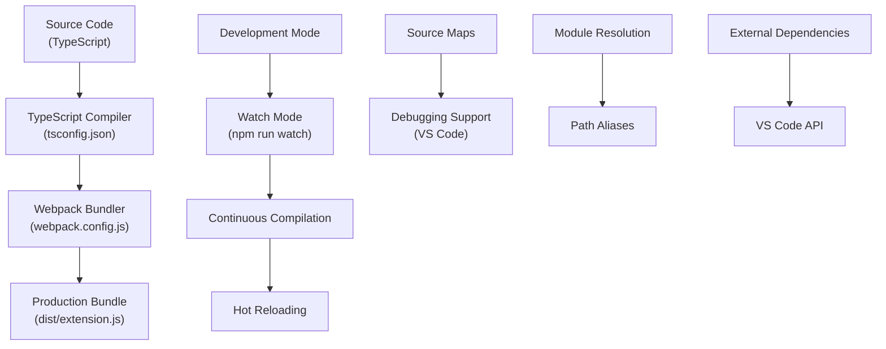
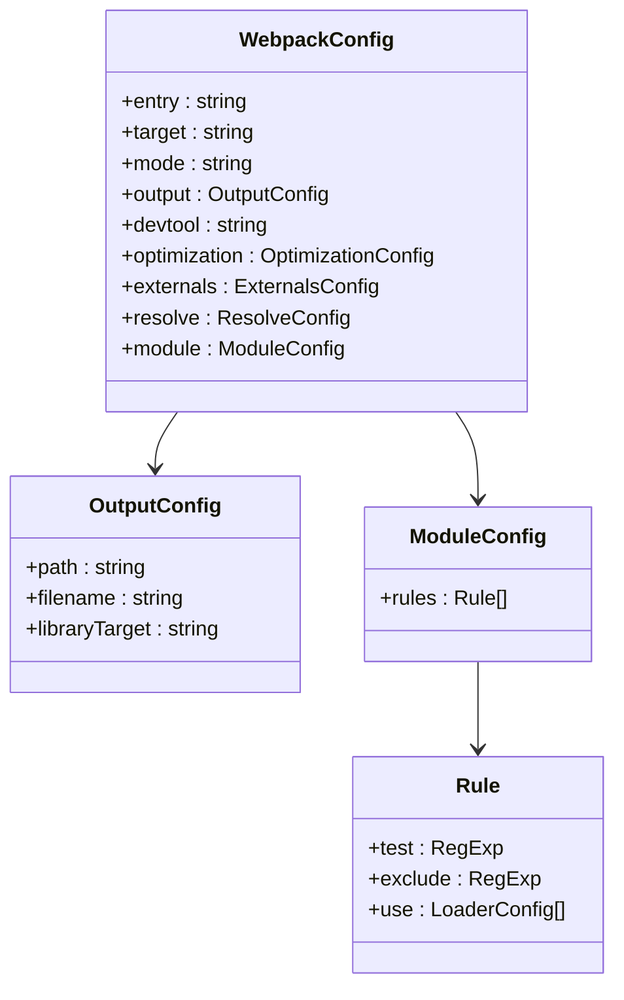
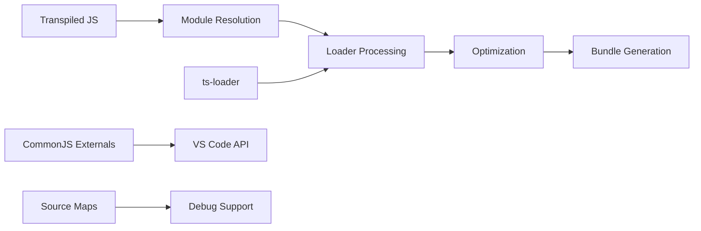
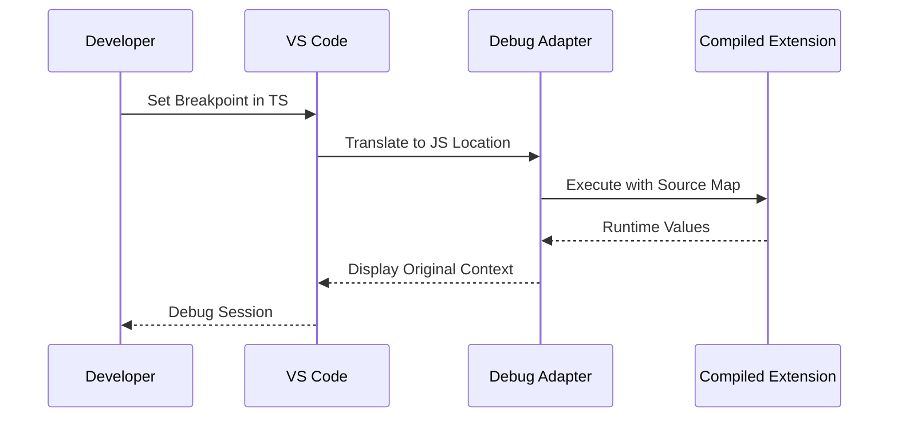
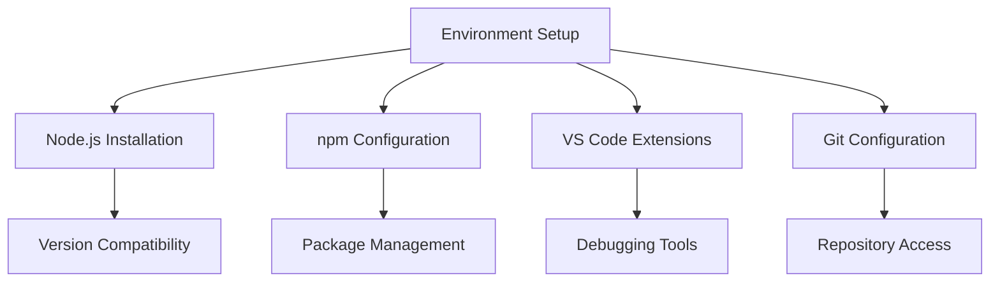
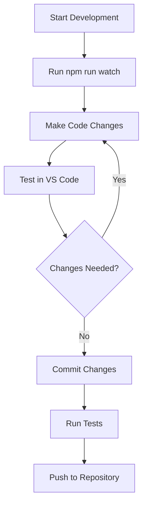
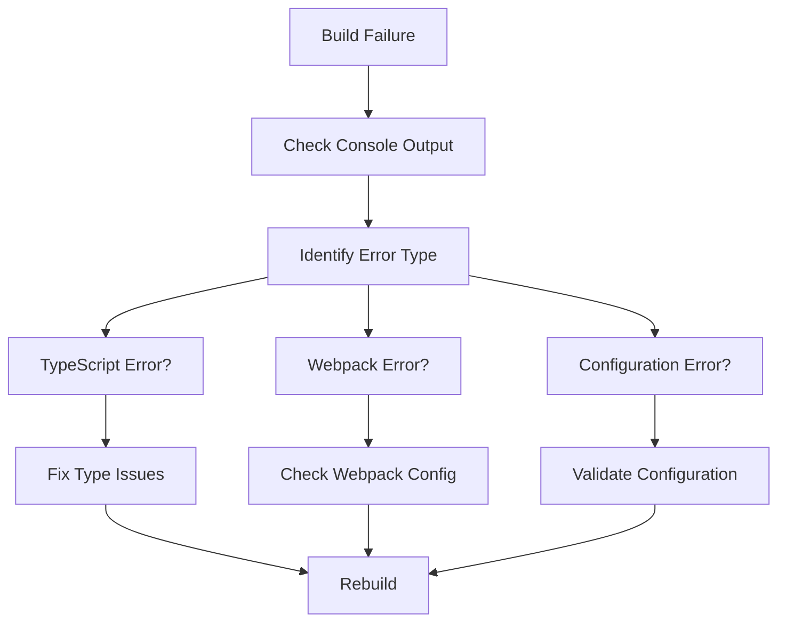
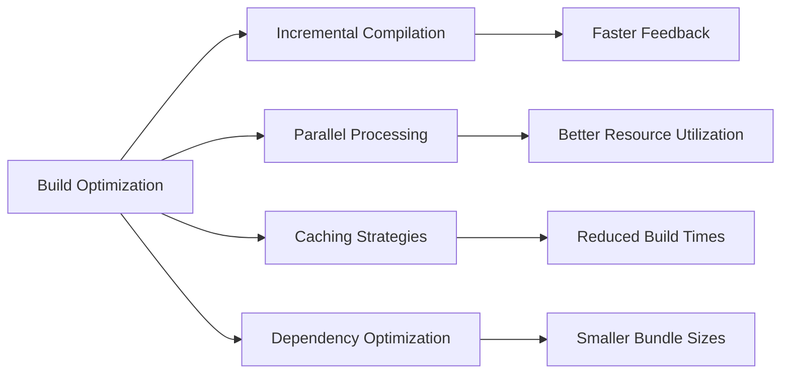

# Development Build

<cite>
**Referenced Files in This Document**
- [package.json](file://package.json)
- [webpack.config.js](file://webpack.config.js)
- [tsconfig.json](file://tsconfig.json)
- [src/extension.ts](file://src/extension.ts)
- [src/utils/logger.ts](file://src/utils/logger.ts)
- [src/services/git/gitService.ts](file://src/services/git/gitService.ts)
- [src/services/review/reviewManager.ts](file://src/services/review/reviewManager.ts)
- [src/models/baseModel.ts](file://src/models/baseModel.ts)
- [docs/en/developer-guide.md](file://docs/en/developer-guide.md)
- [README.md](file://README.md)
</cite>

## Table of Contents
1. [Introduction](#introduction)
2. [Build System Overview](#build-system-overview)
3. [Webpack Configuration](#webpack-configuration)
4. [TypeScript Configuration](#typescript-configuration)
5. [Development Scripts](#development-scripts)
6. [Compilation Process](#compilation-process)
7. [Watch Mode Operation](#watch-mode-operation)
8. [Source Maps and Debugging](#source-maps-and-debugging)
9. [Development Environment Setup](#development-environment-setup)
10. [Common Development Workflows](#common-development-workflows)
11. [Troubleshooting](#troubleshooting)
12. [Best Practices](#best-practices)

## Introduction

CodeKarmic is a VS Code extension that provides AI-powered code review capabilities for Git commits. The development build process is centered around a sophisticated webpack-based compilation system that handles TypeScript transpilation, module bundling, and source map generation for effective debugging. This document provides comprehensive coverage of the build system, from initial setup to advanced debugging techniques.

The build system integrates TypeScript compilation with webpack to produce optimized, production-ready JavaScript bundles while maintaining development-time debugging capabilities through source maps. The architecture supports both one-time compilation for production builds and continuous compilation for development iteration.

## Build System Overview

The CodeKarmic build system consists of several interconnected components that work together to transform TypeScript source code into deployable JavaScript bundles:

**Diagram sources**
- [webpack.config.js](file://webpack.config.js#L1-L48)
- [tsconfig.json](file://tsconfig.json#L1-L19)

The build system operates through three primary modes:
- **Compile Mode**: Single-pass TypeScript to JavaScript conversion
- **Watch Mode**: Continuous compilation with file change detection
- **Package Mode**: Production-optimized bundle generation

**Section sources**
- [package.json](file://package.json#L282-L292)
- [webpack.config.js](file://webpack.config.js#L1-L48)

## Webpack Configuration

The webpack configuration serves as the central orchestrator for the build process, handling module resolution, TypeScript compilation, and output optimization. The configuration is specifically tailored for VS Code extension development with Node.js target environment.

### Core Configuration Structure

The webpack configuration defines several critical aspects of the build process:

**Diagram sources**
- [webpack.config.js](file://webpack.config.js#L5-L46)

### Entry Point Configuration

The build system uses a single entry point located at `./src/extension.ts`, which serves as the main activation point for the VS Code extension. This centralized entry point ensures proper dependency resolution and module bundling.

### Target Environment

The configuration targets `node` environment, reflecting the fact that VS Code extensions run in a Node.js context. This affects how modules are resolved and how certain APIs are handled during compilation.

### Output Configuration

The compiled extension is output to the `dist/extension.js` file with CommonJS module format (`commonjs2`), ensuring compatibility with VS Code's extension loading mechanism.

### Module Resolution Strategy

The resolver configuration includes custom module resolution paths to support the project's directory structure and facilitate clean imports throughout the codebase.

**Section sources**
- [webpack.config.js](file://webpack.config.js#L6-L46)

## TypeScript Configuration

The TypeScript configuration provides comprehensive type checking and compilation settings optimized for VS Code extension development. The configuration balances strict type safety with practical development flexibility.

### Compiler Options

The TypeScript configuration includes several key compiler options:

| Option | Value | Purpose |
|--------|-------|---------|
| `target` | ESNext | Modern JavaScript features |
| `module` | ESNext | ES module syntax |
| `moduleResolution` | node | Node.js-style module resolution |
| `lib` | ESNext, DOM | Standard library definitions |
| `strict` | true | Enable all strict type-checking options |
| `sourceMap` | true | Generate source maps for debugging |
| `declaration` | true | Generate .d.ts declaration files |
| `esModuleInterop` | true | Better CommonJS/ES module interop |

### Directory Structure

The configuration specifies that all TypeScript files under `src/**/*` should be included in the compilation process, while excluding `node_modules` and the `dist` directory to prevent compilation conflicts.

### Source Map Generation

Source maps are enabled to preserve original TypeScript source locations during debugging, allowing developers to set breakpoints and inspect variables in their original TypeScript code rather than the compiled JavaScript.

**Section sources**
- [tsconfig.json](file://tsconfig.json#L2-L18)

## Development Scripts

The development scripts provide flexible build options for different scenarios, from quick testing to production deployment. Each script serves a specific purpose in the development workflow.

### Available Scripts

| Script | Command | Purpose |
|--------|---------|---------|
| `compile` | `webpack` | Single compilation pass |
| `watch` | `webpack --watch` | Continuous compilation |
| `package` | `webpack --mode production --devtool hidden-source-map` | Production build |
| `compile-tests` | `tsc -p . --outDir out` | Test compilation |
| `watch-tests` | `tsc -p . -w --outDir out` | Test watch mode |
| `pretest` | Multiple steps | Pre-test preparation |
| `lint` | `eslint src --ext ts` | Code linting |
| `test` | `node ./out/test/runTest.js` | Test execution |

### Compile Script

The `compile` script performs a single pass of TypeScript compilation and webpack bundling. It transforms all TypeScript source files into optimized JavaScript bundles ready for deployment.

### Watch Script

The `watch` script enables continuous compilation, automatically rebuilding the project whenever source files change. This dramatically accelerates the development iteration cycle by eliminating manual rebuild steps.

### Package Script

The `package` script generates production-optimized bundles with minimal source map information, suitable for distribution while maintaining debugging capabilities.

**Section sources**
- [package.json](file://package.json#L282-L292)

## Compilation Process

The compilation process involves multiple stages of transformation from TypeScript source code to deployable JavaScript bundles. Understanding this process is crucial for effective development and troubleshooting.

### Stage 1: TypeScript Transpilation

The TypeScript compiler processes all source files according to the configuration in `tsconfig.json`. This stage performs:

- **Type Checking**: Validates type annotations and catches type-related errors
- **Syntax Transformation**: Converts modern TypeScript features to compatible JavaScript
- **Module Resolution**: Resolves import/export statements
- **Declaration Generation**: Creates type definition files (.d.ts)

### Stage 2: Webpack Bundling

Webpack takes the transpiled JavaScript and applies several transformations:

**Diagram sources**
- [webpack.config.js](file://webpack.config.js#L29-L46)

### Stage 3: Output Generation

The final stage produces the distributable bundle with appropriate metadata and source maps for debugging.

**Section sources**
- [webpack.config.js](file://webpack.config.js#L29-L46)
- [tsconfig.json](file://tsconfig.json#L11-L14)

## Watch Mode Operation

Watch mode provides real-time compilation feedback, enabling rapid development iteration. The system monitors file changes and automatically triggers rebuilds with minimal overhead.

### File Monitoring Strategy

The watch mode implementation uses webpack's built-in file watching capabilities to monitor:
- All TypeScript source files in the `src/` directory
- Configuration file changes
- Dependency updates

### Incremental Compilation

When file changes are detected, the system performs incremental compilation:
1. **Change Detection**: Identifies modified files
2. **Dependency Analysis**: Determines affected modules
3. **Selective Rebuild**: Compiles only changed and affected modules
4. **Output Update**: Updates the output bundle

### Performance Optimizations

Several optimizations enhance watch mode performance:
- **Memory-based Compilation**: Keeps intermediate results in memory
- **Parallel Processing**: Utilizes multiple CPU cores when available
- **Intelligent Caching**: Caches compilation results for unchanged files

**Section sources**
- [package.json](file://package.json#L285)

## Source Maps and Debugging

Source maps are essential for effective debugging during development, allowing developers to work with TypeScript source code while observing JavaScript runtime behavior.

### Source Map Configuration

The build system generates source maps with varying levels of detail depending on the build mode:

| Build Mode | Source Map Type | Purpose |
|------------|----------------|---------|
| Development | `inline-source-map` | Full source map embedded in output |
| Production | `hidden-source-map` | Source map available for debugging but not referenced in output |

### VS Code Debugging Integration

VS Code integrates seamlessly with the generated source maps:

**Diagram sources**
- [src/utils/logger.ts](file://src/utils/logger.ts#L1-L88)

### Debugging Workflow

Effective debugging follows these steps:
1. **Set Breakpoints**: Place breakpoints in TypeScript source files
2. **Start Debugging**: Launch the extension in debug mode
3. **Inspect Variables**: View variables in their original TypeScript context
4. **Step Through Code**: Navigate through the original source structure

**Section sources**
- [webpack.config.js](file://webpack.config.js#L14)
- [tsconfig.json](file://tsconfig.json#L11)

## Development Environment Setup

Setting up a proper development environment requires careful attention to dependencies, configuration, and tooling. This section provides step-by-step instructions for getting started.

### Prerequisites

Before beginning development, ensure the following prerequisites are met:
- **Node.js**: Version 16.x or higher
- **npm**: Latest stable version
- **VS Code**: Latest stable version
- **Git**: For version control operations

### Initial Setup Steps

1. **Clone Repository**: Obtain the source code from the repository
2. **Install Dependencies**: Run `npm install` to install all required packages
3. **Verify Installation**: Confirm all dependencies are installed correctly
4. **Configure Environment**: Set up any required environment variables

### Environment Configuration

The development environment requires several configuration aspects:

### Dependency Management

The project uses specific versions of key dependencies:
- **TypeScript**: ^5.3.2 for modern language features
- **Webpack**: ^5.89.0 for module bundling
- **ts-loader**: ^9.5.1 for TypeScript integration
- **VS Code API**: ^1.85.0 for extension compatibility

**Section sources**
- [package.json](file://package.json#L293-L309)
- [docs/en/developer-guide.md](file://docs/en/developer-guide.md#L36-L46)

## Common Development Workflows

Understanding common development workflows helps maximize productivity and maintain code quality. This section covers typical development scenarios and best practices.

### Feature Development Workflow

The standard feature development process follows these steps:

### Debugging Workflow

Effective debugging requires a systematic approach:

1. **Reproduce Issue**: Identify the conditions under which the bug occurs
2. **Set Breakpoints**: Place breakpoints in relevant TypeScript files
3. **Execute Debug Session**: Start the extension in debug mode
4. **Step Through Code**: Navigate through the execution flow
5. **Inspect Variables**: Examine variable values and execution context
6. **Fix Issue**: Implement the necessary code changes
7. **Verify Fix**: Test the solution thoroughly

### Testing Workflow

The testing workflow integrates multiple tools and approaches:

| Tool | Purpose | Usage |
|------|---------|-------|
| ESLint | Code quality | Automated code analysis |
| TypeScript | Type checking | Static type validation |
| Unit Tests | Functionality | Automated testing |
| Manual Testing | Integration | Human verification |

### Release Preparation Workflow

Preparing for release involves several validation steps:

1. **Clean Build**: Run `npm run package` for production build
2. **Test Release**: Verify functionality in release configuration
3. **Generate Documentation**: Update any relevant documentation
4. **Version Bump**: Increment version numbers appropriately
5. **Tag Release**: Create release tags in version control

**Section sources**
- [package.json](file://package.json#L289-L292)
- [docs/en/developer-guide.md](file://docs/en/developer-guide.md#L46-L57)

## Troubleshooting

Development build issues can arise from various sources, including configuration problems, dependency conflicts, and environment issues. This section provides systematic approaches to identifying and resolving common problems.

### Common Build Issues

#### Compilation Errors

Compilation errors typically fall into several categories:

| Error Type | Symptoms | Solution |
|------------|----------|----------|
| Syntax Errors | TypeScript compilation fails | Fix syntax issues in source code |
| Type Errors | Type checking violations | Correct type annotations |
| Import Errors | Module resolution failures | Verify import paths and declarations |
| Configuration Errors | Webpack build failures | Check webpack.config.js |

#### Module Resolution Failures

Module resolution issues often occur due to:
- Incorrect import paths
- Missing type definitions
- Circular dependencies
- Path alias misconfigurations

#### Output Path Issues

Incorrect output paths can cause:
- Missing extension files
- Broken VS Code integration
- Deployment failures

### Debugging Build Issues

Systematic debugging approaches help isolate problems:

### Environment-Specific Issues

Different environments may present unique challenges:

#### Windows Environment
- Path separator issues
- Case sensitivity problems
- Line ending differences

#### macOS/Linux Environment
- Permission issues
- Shell configuration differences
- Dependency installation variations

### Performance Issues

Build performance problems can significantly impact development velocity:

| Symptom | Possible Cause | Solution |
|---------|---------------|----------|
| Slow Compilation | Large codebase | Optimize imports, reduce dependencies |
| Memory Issues | Insufficient RAM | Increase heap size, optimize configuration |
| Disk Space | Temporary files | Clean build artifacts regularly |

**Section sources**
- [webpack.config.js](file://webpack.config.js#L25-L28)
- [tsconfig.json](file://tsconfig.json#L17-L18)

## Best Practices

Following established best practices ensures maintainable, efficient, and reliable development processes. These guidelines apply to both individual development and team collaboration scenarios.

### Code Organization

Effective code organization principles include:

- **Single Responsibility**: Each module should have a clear, focused purpose
- **Dependency Management**: Minimize circular dependencies between modules
- **Interface Design**: Define clear contracts between components
- **Error Handling**: Implement comprehensive error handling strategies

### Build Optimization

Optimizing the build process improves development efficiency:

### Development Workflow Optimization

Streamlining development workflows enhances productivity:

1. **Automated Testing**: Integrate automated tests into the development process
2. **Linting Integration**: Use ESLint for consistent code quality
3. **Continuous Integration**: Implement CI/CD pipelines for automated validation
4. **Documentation**: Maintain comprehensive documentation for complex systems

### Performance Monitoring

Monitoring build performance helps identify bottlenecks:

- **Build Time Tracking**: Monitor compilation duration trends
- **Memory Usage**: Track memory consumption during builds
- **Disk I/O**: Monitor file system operations
- **Network Usage**: Track dependency downloads

### Security Considerations

Security best practices for build systems:

- **Dependency Scanning**: Regularly audit third-party dependencies
- **Access Control**: Limit access to build infrastructure
- **Secret Management**: Securely handle API keys and credentials
- **Code Signing**: Sign distributed binaries appropriately

**Section sources**
- [src/utils/logger.ts](file://src/utils/logger.ts#L1-L88)
- [src/services/git/gitService.ts](file://src/services/git/gitService.ts#L1-L200)