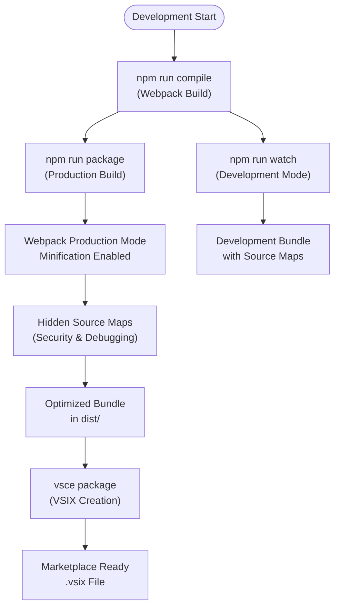
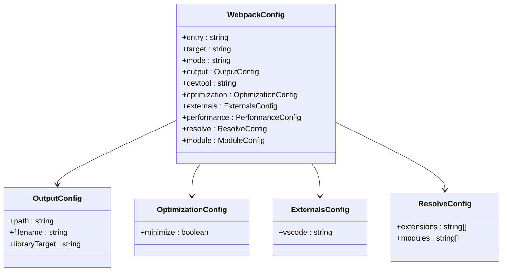
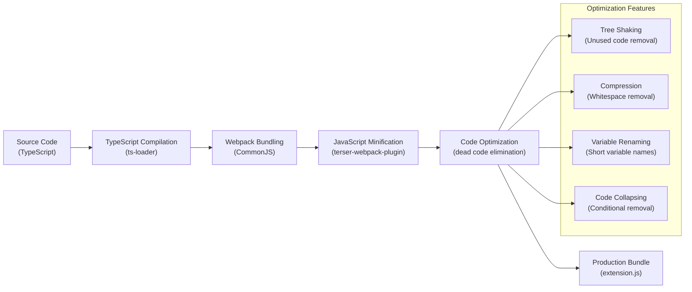
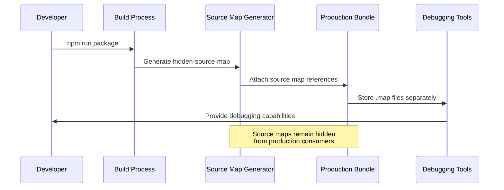
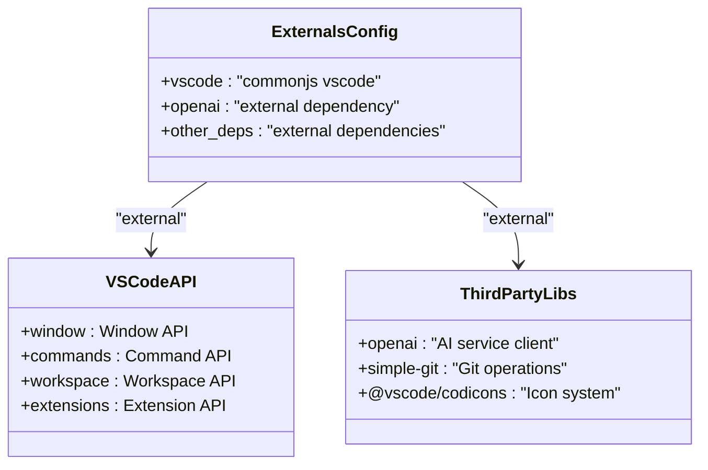
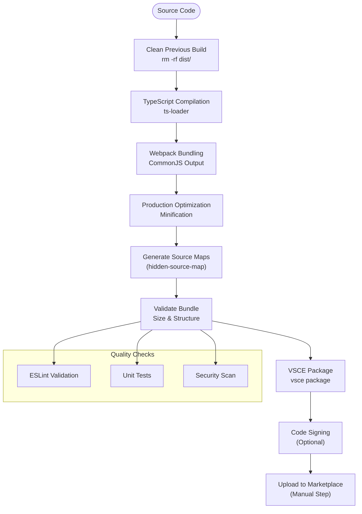
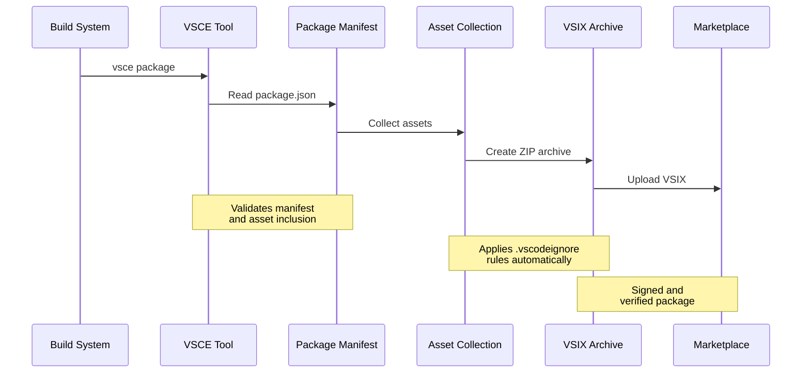

# Production Build

<cite>
**Referenced Files in This Document**
- [package.json](file://package.json)
- [webpack.config.js](file://webpack.config.js)
- [tsconfig.json](file://tsconfig.json)
- [.vscodeignore](file://.vscodeignore)
- [src/extension.ts](file://src/extension.ts)
- [src/ui/views/reviewPanel.ts](file://src/ui/views/reviewPanel.ts)
- [src/services/git/gitService.ts](file://src/services/git/gitService.ts)
- [docs/release-guide.md](file://docs/release-guide.md)
- [README.md](file://README.md)
</cite>

## Table of Contents
1. [Introduction](#introduction)
2. [Build Script Overview](#build-script-overview)
3. [Webpack Configuration](#webpack-configuration)
4. [TypeScript Configuration](#typescript-configuration)
5. [Production Mode Optimization](#production-mode-optimization)
6. [Source Map Generation](#source-map-generation)
7. [External Dependencies](#external-dependencies)
8. [Packaging Workflow](#packaging-workflow)
9. [VSIX Package Creation](#vsix-package-creation)
10. [Performance Considerations](#performance-considerations)
11. [Troubleshooting Guide](#troubleshooting-guide)
12. [Best Practices](#best-practices)

## Introduction

The CodeKarmic extension employs a sophisticated production build process designed to optimize the extension for distribution while maintaining development flexibility. The build system leverages Webpack for module bundling, TypeScript for type-safe compilation, and VSCE for marketplace packaging. This comprehensive build pipeline ensures optimal performance, minimal bundle size, and secure distribution of the extension.

The production build process transforms the source code into a highly optimized, self-contained package ready for deployment to the Visual Studio Code marketplace. The system balances performance optimization with security considerations, particularly through careful source map management and dependency isolation.

## Build Script Overview

The extension's build process is orchestrated through npm scripts defined in the package.json file. The primary production build script utilizes Webpack with specific optimization flags to generate a production-ready bundle.

**Diagram sources**
- [package.json](file://package.json#L283-L291)
- [webpack.config.js](file://webpack.config.js#L8-L17)

The build system provides multiple script targets for different development and production scenarios:

- **Development Builds**: `npm run compile` and `npm run watch` for development iteration
- **Production Builds**: `npm run package` for production optimization
- **Testing**: `npm run pretest` for quality assurance
- **Marketplace Publishing**: `npm run vscode:prepublish` triggers production build before publishing

**Section sources**
- [package.json](file://package.json#L282-L291)

## Webpack Configuration

The Webpack configuration serves as the core of the build system, defining how TypeScript source files are transformed into optimized JavaScript bundles. The configuration emphasizes production optimization while maintaining compatibility with VS Code's extension architecture.

**Diagram sources**
- [webpack.config.js](file://webpack.config.js#L4-L47)

The configuration establishes several critical build parameters:

- **Entry Point**: [`./src/extension.ts`](file://src/extension.ts) serves as the main entry point
- **Target Environment**: `node` target ensures compatibility with VS Code's runtime
- **Library Format**: `commonjs2` output format aligns with VS Code extension requirements
- **Module Resolution**: Enhanced resolution paths improve TypeScript compilation efficiency

**Section sources**
- [webpack.config.js](file://webpack.config.js#L1-L47)

## TypeScript Configuration

The TypeScript configuration provides the foundation for type-safe compilation and source map generation. The configuration optimizes for both development experience and production output quality.

| Configuration Option | Value | Purpose |
|---------------------|-------|---------|
| `target` | ESNext | Modern JavaScript features support |
| `module` | ESNext | Efficient module system |
| `moduleResolution` | node | Node.js-style module resolution |
| `lib` | ESNext, DOM | Browser and DOM APIs availability |
| `strict` | true | Strict type checking enforcement |
| `sourceMap` | true | Development-time debugging support |
| `declaration` | true | TypeScript declaration files generation |
| `outDir` | ./dist | Output directory specification |
| `rootDir` | ./src | Source root directory |

The TypeScript configuration ensures comprehensive type checking while maintaining compatibility with VS Code's extension API. The strict mode enforcement helps prevent runtime errors and improves code reliability.

**Section sources**
- [tsconfig.json](file://tsconfig.json#L1-L19)

## Production Mode Optimization

The production build mode enables comprehensive optimization through Webpack's built-in optimization mechanisms. The optimization.minimize flag activates JavaScript minification, reducing the final bundle size and improving load performance.

**Diagram sources**
- [webpack.config.js](file://webpack.config.js#L16)

The production mode optimization provides several benefits:

- **Bundle Size Reduction**: Minification reduces file sizes by removing whitespace, shortening variable names, and eliminating dead code
- **Performance Improvement**: Smaller bundles load faster and consume less memory
- **Security Enhancement**: Obfuscated code makes reverse engineering more difficult
- **Bandwidth Savings**: Reduced payload size benefits users with slower connections

**Section sources**
- [webpack.config.js](file://webpack.config.js#L16)

## Source Map Generation

The build process generates source maps using the `hidden-source-map` option, providing debugging capabilities without exposing sensitive source code information in the production build.

**Diagram sources**
- [webpack.config.js](file://webpack.config.js#L14)

The `hidden-source-map` configuration offers several advantages:

- **Debugging Support**: Developers can debug production builds using the separate source map files
- **Security Protection**: Source code remains obfuscated and inaccessible to end users
- **Error Reporting**: Stack traces reference original source locations
- **Maintenance Efficiency**: Easier troubleshooting without compromising security

The source map files are generated alongside the main bundle but are not included in the final VSIX package, ensuring that the production distribution maintains security while preserving debugging capabilities.

**Section sources**
- [webpack.config.js](file://webpack.config.js#L14)

## External Dependencies

The build system carefully manages external dependencies to minimize bundle size and ensure compatibility with VS Code's runtime environment.

**Diagram sources**
- [webpack.config.js](file://webpack.config.js#L18-L20)

The externals configuration strategically excludes certain dependencies from the bundle:

- **vscode**: Excluded as VS Code provides the API runtime
- **openai**: External dependency for AI service communication
- **@vscode/codicons**: External icon library for UI components

This approach provides several benefits:

- **Reduced Bundle Size**: Eliminates redundant copies of commonly available libraries
- **Runtime Compatibility**: Ensures proper integration with VS Code's environment
- **Update Flexibility**: Allows VS Code to manage library updates independently
- **Memory Efficiency**: Reduces memory footprint by sharing common dependencies

**Section sources**
- [webpack.config.js](file://webpack.config.js#L18-L20)

## Packaging Workflow

The complete packaging workflow transforms source code into a distributable VSIX package through a series of coordinated steps.

**Diagram sources**
- [package.json](file://package.json#L282-L291)
- [docs/release-guide.md](file://docs/release-guide.md#L42-L122)

The packaging workflow includes several critical stages:

1. **Preparation**: Cleaning previous build artifacts and dependencies
2. **Compilation**: Transpiling TypeScript to optimized JavaScript
3. **Bundling**: Creating a single JavaScript file with all dependencies
4. **Optimization**: Applying minification and tree shaking
5. **Validation**: Ensuring bundle quality and compliance
6. **Packaging**: Creating the VSIX distribution package
7. **Signing**: Optional code signing for security
8. **Publication**: Manual upload to the marketplace

**Section sources**
- [package.json](file://package.json#L282-L291)
- [docs/release-guide.md](file://docs/release-guide.md#L42-L122)

## VSIX Package Creation

The VSIX package creation process transforms the optimized bundle into a format suitable for distribution through the Visual Studio Code marketplace.

**Diagram sources**
- [package.json](file://package.json#L283)
- [docs/release-guide.md](file://docs/release-guide.md#L118-L122)

The VSCE packaging process handles several important tasks:

- **Manifest Validation**: Ensures package.json meets marketplace requirements
- **Asset Collection**: Automatically includes necessary files based on .vscodeignore rules
- **Dependency Resolution**: Manages external dependencies and their versions
- **Size Optimization**: Compresses assets while maintaining functionality
- **Metadata Generation**: Creates package metadata for marketplace display

The `.vscodeignore` file plays a crucial role in determining which files are included in the final package, ensuring that development artifacts and unnecessary files are excluded from distribution.

**Section sources**
- [package.json](file://package.json#L283)
- [.vscodeignore](file://.vscodeignore#L1-L37)
- [docs/release-guide.md](file://docs/release-guide.md#L118-L122)

## Performance Considerations

The production build process incorporates several performance optimization strategies to ensure efficient extension loading and operation.

### Tree Shaking Implementation

Tree shaking eliminates unused code from the final bundle, significantly reducing file sizes and improving load times. The build system achieves this through:

- **ES Module Imports**: Using ES6 import/export syntax enables dead code elimination
- **Pure Functions**: Identifying functions without side effects for safe removal
- **Static Analysis**: Analyzing code flow to determine unused code paths
- **Dependency Graph Optimization**: Removing unused dependencies and their transitive closures

### Code Splitting Strategies

While the current build uses a single bundle approach, the architecture supports future code splitting improvements:

- **Lazy Loading**: Dynamic imports enable on-demand module loading
- **Feature-Based Splitting**: Separating distinct features into independent chunks
- **Vendor Splitting**: Isolating third-party dependencies for caching benefits
- **Runtime Splitting**: Extracting common runtime code for reuse

### Dependency Optimization

The build system optimizes dependencies through several mechanisms:

- **External Dependencies**: Excluding VS Code API and common libraries from the bundle
- **Peer Dependencies**: Leveraging VS Code's built-in APIs instead of bundling them
- **Compression**: GZIP compression reduces transfer sizes
- **Caching**: Optimized asset structure enables effective browser caching

### Bundle Analysis

Regular bundle analysis helps maintain optimal performance characteristics:

- **Size Monitoring**: Tracking bundle size growth over time
- **Dependency Breakdown**: Understanding contribution of each dependency
- **Compression Efficiency**: Measuring effectiveness of compression techniques
- **Load Time Impact**: Correlating bundle size with perceived performance

**Section sources**
- [webpack.config.js](file://webpack.config.js#L18-L20)

## Troubleshooting Guide

Common production build issues and their solutions help maintain smooth development and deployment workflows.

### Missing Externals

**Problem**: Runtime errors indicating missing external dependencies

**Symptoms**:
- `Cannot find module 'vscode'` errors
- `require is not defined` in web contexts
- External library not found errors

**Solutions**:
1. Verify externals configuration in webpack.config.js
2. Ensure VS Code API compatibility
3. Check dependency versions match VS Code requirements
4. Validate module resolution paths

### Oversized Bundles

**Problem**: Bundle size exceeding recommended limits

**Symptoms**:
- Slow extension loading
- High memory consumption
- Marketplace size warnings

**Solutions**:
1. Analyze bundle composition using webpack-bundle-analyzer
2. Implement lazy loading for non-critical features
3. Reduce external dependencies where possible
4. Optimize image and asset sizes
5. Consider code splitting strategies

### Source Map Mismatches

**Problem**: Debugging fails due to source map issues

**Symptoms**:
- Breakpoints not hitting expected code
- Incorrect line numbers in stack traces
- Source map loading errors

**Solutions**:
1. Verify source map generation configuration
2. Check source map file accessibility
3. Ensure proper source map URL references
4. Validate source map integrity
5. Review build process for interruptions

### Compilation Errors

**Problem**: TypeScript compilation failures in production build

**Symptoms**:
- Type checking errors
- Import resolution failures
- Configuration conflicts

**Solutions**:
1. Validate TypeScript configuration
2. Check module resolution settings
3. Verify import/export syntax correctness
4. Review type definition availability
5. Ensure proper ambient type declarations

### Performance Degradation

**Problem**: Extension performance below expectations

**Symptoms**:
- Slow startup times
- Unresponsive UI
- High CPU usage

**Solutions**:
1. Profile extension loading performance
2. Analyze bundle composition
3. Optimize critical code paths
4. Implement lazy initialization
5. Review dependency loading strategies

**Section sources**
- [webpack.config.js](file://webpack.config.js#L1-L47)
- [tsconfig.json](file://tsconfig.json#L1-L19)

## Best Practices

Following established best practices ensures reliable and maintainable production builds.

### Build Configuration Management

- **Version Control**: Keep build configurations under version control
- **Environment Separation**: Maintain separate configurations for development and production
- **Documentation**: Document build process changes and rationale
- **Automation**: Automate repetitive build and testing tasks
- **Validation**: Implement automated quality checks in the build pipeline

### Security Considerations

- **Source Map Protection**: Use hidden-source-maps to protect intellectual property
- **Dependency Scanning**: Regularly audit third-party dependencies for vulnerabilities
- **Access Control**: Limit build system access to authorized developers
- **Secret Management**: Never include secrets in build artifacts
- **Code Signing**: Implement code signing for production releases

### Performance Optimization

- **Regular Analysis**: Monitor bundle sizes and performance metrics
- **Incremental Improvements**: Make gradual, measurable performance improvements
- **Testing**: Validate performance impact of build changes
- **Caching**: Leverage build caching for faster incremental builds
- **Compression**: Ensure proper compression of assets and bundles

### Quality Assurance

- **Automated Testing**: Integrate testing into the build process
- **Linting**: Enforce code quality standards automatically
- **Type Checking**: Maintain strict TypeScript configuration
- **Security Scanning**: Include security vulnerability scanning
- **Compatibility Testing**: Validate against target VS Code versions

### Deployment Strategy

- **Staged Releases**: Use staged releases for gradual rollout
- **Rollback Plans**: Maintain ability to quickly revert problematic releases
- **Monitoring**: Implement post-deployment monitoring and alerting
- **Documentation**: Maintain comprehensive release documentation
- **Feedback Loops**: Establish channels for user feedback and issue reporting

**Section sources**
- [package.json](file://package.json#L282-L291)
- [docs/release-guide.md](file://docs/release-guide.md#L1-L175)