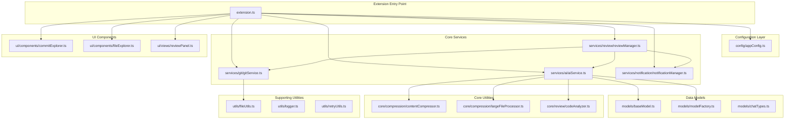
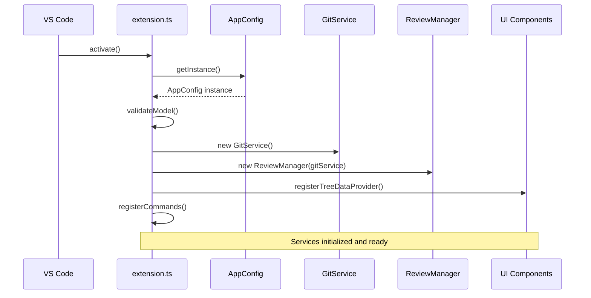
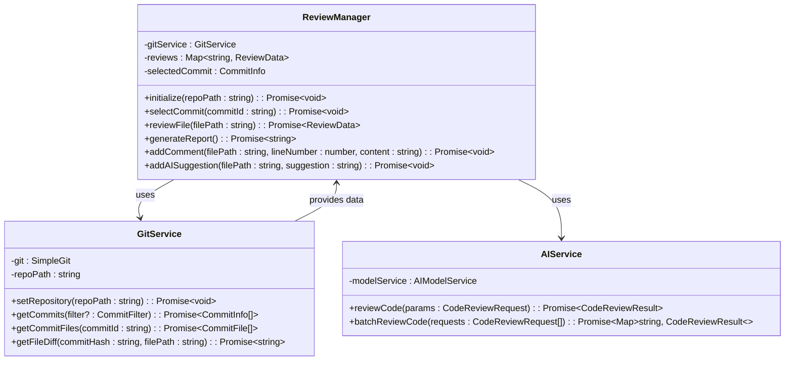
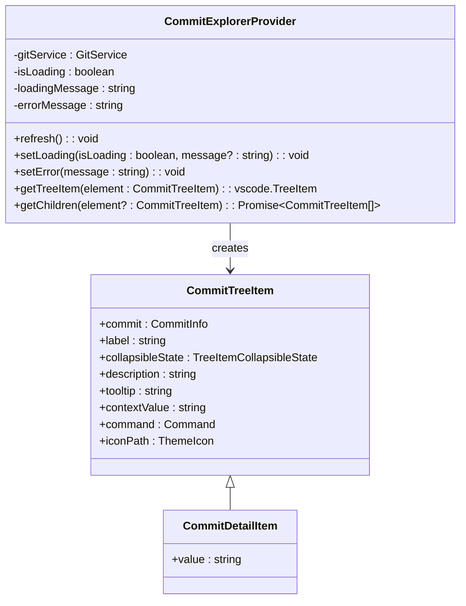
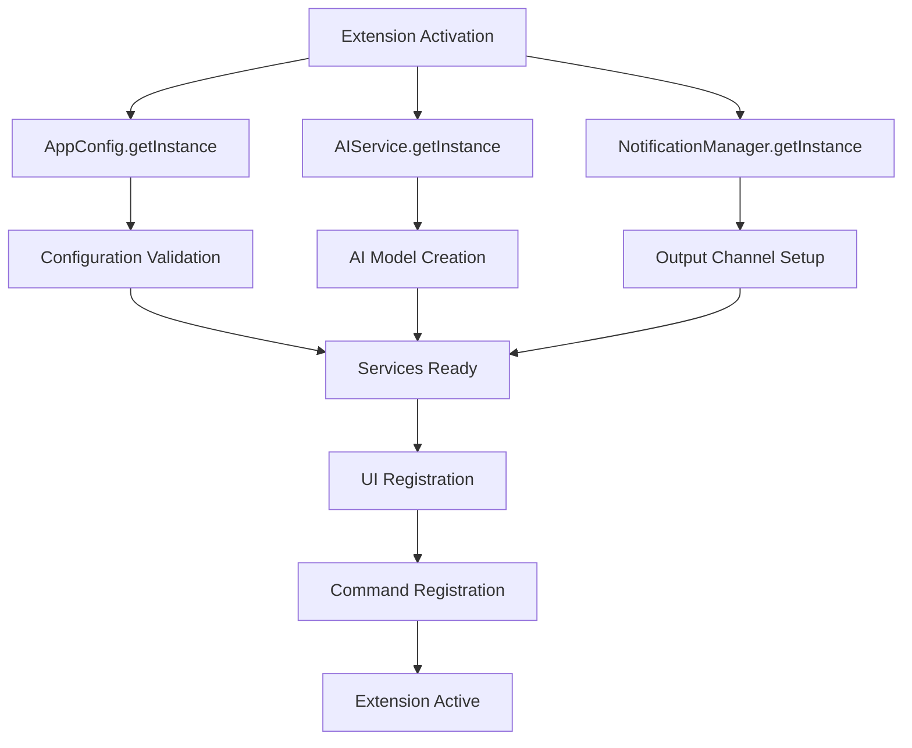

# Code Structure

<cite>
**Referenced Files in This Document**
- [extension.ts](file://src/extension.ts)
- [appConfig.ts](file://src/config/appConfig.ts)
- [reviewManager.ts](file://src/services/review/reviewManager.ts)
- [gitService.ts](file://src/services/git/gitService.ts)
- [aiService.ts](file://src/services/ai/aiService.ts)
- [commitExplorer.ts](file://src/ui/components/commitExplorer.ts)
- [reviewPanel.ts](file://src/ui/views/reviewPanel.ts)
- [baseModel.ts](file://src/models/baseModel.ts)
- [contentCompressor.ts](file://src/core/compression/contentCompressor.ts)
- [notificationManager.ts](file://src/services/notification/notificationManager.ts)
- [logger.ts](file://src/utils/logger.ts)
- [package.json](file://package.json)
</cite>

## Table of Contents
1. [Introduction](#introduction)
2. [Project Structure Overview](#project-structure-overview)
3. [Directory Architecture](#directory-architecture)
4. [Core Components](#core-components)
5. [Service Layer](#service-layer)
6. [UI Components](#ui-components)
7. [Models and Data Management](#models-and-data-management)
8. [Utilities and Supporting Services](#utilities-and-supporting-services)
9. [Dependency Injection and Initialization](#dependency-injection-and-initialization)
10. [Communication Patterns](#communication-patterns)
11. [Best Practices](#best-practices)
12. [Contributor Guide](#contributor-guide)

## Introduction

CodeKarmic is a sophisticated VS Code extension that provides AI-powered code review capabilities for Git repositories. The extension follows a modular architecture with clear separation of concerns across multiple directories, implementing robust patterns for dependency injection, event-driven communication, and asynchronous operations.

The codebase demonstrates excellent TypeScript practices, comprehensive error handling, and efficient resource management through its layered architecture. Each directory serves a specific purpose, contributing to the overall functionality while maintaining loose coupling between components.

## Project Structure Overview

The CodeKarmic extension is organized into distinct functional areas, each responsible for specific aspects of the code review workflow:

**Diagram sources**
- [extension.ts](file://src/extension.ts#L1-L50)
- [reviewManager.ts](file://src/services/review/reviewManager.ts#L1-L50)
- [gitService.ts](file://src/services/git/gitService.ts#L1-L50)
- [aiService.ts](file://src/services/ai/aiService.ts#L1-L50)

## Directory Architecture

### Config Directory (`src/config/`)
Contains centralized configuration management with the AppConfig class providing singleton access to all extension settings.

**Key Features:**
- Centralized configuration storage and retrieval
- Event-driven configuration change notifications
- Type-safe configuration access with default values
- Support for both workspace and global settings

**Section sources**
- [appConfig.ts](file://src/config/appConfig.ts#L1-L189)

### Core Directory (`src/core/`)
Implements fundamental functionality including compression algorithms and code analysis tools.

**Core Subdirectories:**
- **compression/**: Advanced content compression with semantic analysis
- **review/**: Code analysis and suggestion generation

**Key Components:**
- Content compressor with language-aware algorithms
- Code analyzer for intelligent review suggestions
- Large file processor for handling oversized files

**Section sources**
- [contentCompressor.ts](file://src/core/compression/contentCompressor.ts#L1-L414)

### Services Directory (`src/services/`)
Contains business logic services with clear separation of concerns:

**Review Service (`reviewManager.ts`)**:
- Coordinates Git operations and AI analysis
- Manages review state and data persistence
- Handles batch processing for multiple files
- Implements error handling and logging

**Git Service (`gitService.ts`)**:
- Provides comprehensive Git operations
- Implements multiple fallback strategies for reliability
- Supports commit filtering and file content extraction
- Handles large repositories efficiently

**AI Service (`aiService.ts`)**:
- Manages AI model interactions
- Implements batch processing for multiple files
- Provides content compression for large files
- Supports multiple AI providers through factory pattern

**Notification Service (`notificationManager.ts`)**:
- Centralized notification system
- Status bar integration
- Output channel management
- Multi-language support

**Section sources**
- [reviewManager.ts](file://src/services/review/reviewManager.ts#L1-L854)
- [gitService.ts](file://src/services/git/gitService.ts#L1-L1201)
- [aiService.ts](file://src/services/ai/aiService.ts#L1-L787)
- [notificationManager.ts](file://src/services/notification/notificationManager.ts#L1-L213)

### UI Directory (`src/ui/`)
Provides VS Code UI components and views:

**Components (`ui/components/`)**:
- Commit Explorer: Tree view for Git commits
- File Explorer: List view for changed files
- Tree data providers with real-time updates

**Views (`ui/views/`)**:
- Review Panel: Webview-based code review interface
- Interactive code review with AI suggestions
- Comment system with line-based navigation

**Section sources**
- [commitExplorer.ts](file://src/ui/components/commitExplorer.ts#L1-L172)
- [reviewPanel.ts](file://src/ui/views/reviewPanel.ts#L1-L621)

### Models Directory (`src/models/`)
Defines AI model interfaces and implementations:

**Base Model (`baseModel.ts`)**:
- Abstract base class for AI model interactions
- Content compression capabilities
- Standardized API for different AI providers

**Model Factory (`modelFactory.ts`)**:
- Factory pattern for creating AI model instances
- Provider abstraction layer
- Configuration-based model selection

**Section sources**
- [baseModel.ts](file://src/models/baseModel.ts#L1-L61)

### Utils Directory (`src/utils/`)
Contains utility functions and helpers:

**Logger (`logger.ts`)**:
- Structured logging with multiple levels
- Context-aware logging for debugging
- Performance monitoring capabilities

**File Utils (`fileUtils.ts`)**:
- File type detection and validation
- Path manipulation utilities
- Reviewable file filtering

**Retry Utils (`retryUtils.ts`)**:
- Exponential backoff retry logic
- Network operation resilience
- Timeout management

**Section sources**
- [logger.ts](file://src/utils/logger.ts#L1-L88)

## Core Components

### Extension Activation (`extension.ts`)

The main entry point initializes all services and registers commands. It demonstrates excellent dependency injection patterns and error handling:

**Diagram sources**
- [extension.ts](file://src/extension.ts#L20-L70)

**Key Initialization Steps:**
1. Configuration validation and API key setup
2. Git service initialization with repository detection
3. Review manager creation with shared Git service
4. UI component registration with event listeners
5. Command registration for all extension functionality

**Section sources**
- [extension.ts](file://src/extension.ts#L20-L100)

### Review Manager Coordination

The ReviewManager serves as the central coordinator, orchestrating Git operations and AI analysis:

**Diagram sources**
- [reviewManager.ts](file://src/services/review/reviewManager.ts#L79-L100)
- [gitService.ts](file://src/services/git/gitService.ts#L45-L70)
- [aiService.ts](file://src/services/ai/aiService.ts#L40-L70)

**Section sources**
- [reviewManager.ts](file://src/services/review/reviewManager.ts#L79-L200)

## Service Layer

### Git Service Implementation

The GitService provides robust Git operations with multiple fallback strategies:

**Advanced Features:**
- Multiple Git command execution strategies
- Intelligent diff generation with VS Code Git API integration
- Large file handling with compression
- Commit filtering and caching mechanisms

**Reliability Patterns:**
- Graceful degradation when primary methods fail
- Comprehensive error handling with detailed diagnostics
- Performance monitoring and optimization

**Section sources**
- [gitService.ts](file://src/services/git/gitService.ts#L110-L300)

### AI Service Architecture

The AI Service implements sophisticated batch processing and content compression:

**Intelligent Processing:**
- Language-aware content compression
- Batch processing for multiple files
- Streaming response support
- Automatic retry mechanisms

**Content Analysis:**
- Semantic compression preserving code structure
- Language detection for optimal processing
- Fingerprint calculation for caching

**Section sources**
- [aiService.ts](file://src/services/ai/aiService.ts#L260-L400)

## UI Components

### Commit Explorer Tree View

The Commit Explorer provides an interactive tree view for Git commit exploration:

**Diagram sources**
- [commitExplorer.ts](file://src/ui/components/commitExplorer.ts#L5-L30)
- [commitExplorer.ts](file://src/ui/components/commitExplorer.ts#L131-L172)

**Interactive Features:**
- Real-time loading indicators
- Error state management
- Commit detail expansion
- Click-to-select functionality

**Section sources**
- [commitExplorer.ts](file://src/ui/components/commitExplorer.ts#L36-L120)

### Review Panel Webview

The Review Panel provides an integrated code review interface:

**Features:**
- Tabbed interface for comments and suggestions
- Line-based commenting system
- AI suggestion integration
- Quality score display
- Report generation capability

**Communication Pattern:**
- Bidirectional messaging with webview
- State synchronization between UI and backend
- Real-time updates on data changes

**Section sources**
- [reviewPanel.ts](file://src/ui/views/reviewPanel.ts#L242-L400)

## Models and Data Management

### Base Model Architecture

The base model provides a standardized interface for AI model interactions:

**Key Features:**
- Abstract base class for model implementations
- Content compression capabilities
- Standardized API for different AI providers
- Configuration and validation support

**Compression Algorithm:**
- Semantic-aware content reduction
- Language-specific optimization
- Fingerprint calculation for caching
- Performance monitoring

**Section sources**
- [baseModel.ts](file://src/models/baseModel.ts#L17-L61)

### Data Models and Types

The extension uses comprehensive TypeScript types for data integrity:

**Review Data Structure:**
- Review comments with metadata
- AI suggestions with categorization
- Code quality scores
- File-specific review data

**Git Data Models:**
- Commit information with metadata
- File change tracking
- Diff content representation
- Repository state management

## Utilities and Supporting Services

### Logging and Monitoring

The logging system provides comprehensive debugging and monitoring capabilities:

**Logging Levels:**
- DEBUG: Detailed development information
- INFO: General operational messages
- WARN: Warning conditions
- ERROR: Error conditions

**Features:**
- Context-aware logging
- Performance timing
- Multi-language support
- Configurable log levels

**Section sources**
- [logger.ts](file://src/utils/logger.ts#L8-L88)

### Notification Management

The notification system handles user feedback and status updates:

**Components:**
- Status bar integration
- Output channel management
- Modal and non-modal notifications
- Persistent notification system

**Section sources**
- [notificationManager.ts](file://src/services/notification/notificationManager.ts#L8-L50)

## Dependency Injection and Initialization

### Singleton Pattern Implementation

The extension uses the singleton pattern extensively for service management:

**Diagram sources**
- [extension.ts](file://src/extension.ts#L20-L70)
- [appConfig.ts](file://src/config/appConfig.ts#L80-L90)

### Service Dependencies

Services are initialized with minimal coupling through dependency injection:

**Initialization Order:**
1. Configuration service (singleton)
2. Git service (shared instance)
3. Review manager (with Git service)
4. UI components (with Review manager)
5. Commands (with all services)

**Benefits:**
- Loose coupling between components
- Easy testing and mocking
- Resource efficiency
- Clear dependency chains

**Section sources**
- [extension.ts](file://src/extension.ts#L68-L75)

## Communication Patterns

### Event-Driven Architecture

The extension implements event-driven communication patterns:

**Configuration Events:**
- Change detection for settings
- Automatic service reinitialization
- UI updates on configuration changes

**Service Events:**
- Git operation completion
- AI analysis results
- Review state changes

**UI Events:**
- User interactions
- Tree view updates
- Webview messages

### Asynchronous Operations

All long-running operations use proper async/await patterns:

**Error Handling:**
- Comprehensive try-catch blocks
- User-friendly error messages
- Logging of error details
- Graceful degradation

**Progress Indication:**
- Loading states in UI
- Progress bars for long operations
- Status bar updates
- Notification management

## Best Practices

### TypeScript Typing

The codebase demonstrates excellent TypeScript practices:

**Type Safety:**
- Comprehensive type definitions
- Interface segregation
- Generic type usage
- Union and intersection types

**Code Organization:**
- Modular file structure
- Clear export/import patterns
- Consistent naming conventions
- Documentation comments

### Error Handling

Robust error handling throughout the codebase:

**Strategies:**
- Try-catch blocks with meaningful messages
- Graceful degradation
- User notification of failures
- Logging of error details

**Patterns:**
- Early validation
- Defensive programming
- Resource cleanup
- State recovery

### Asynchronous Operations

Proper handling of asynchronous operations:

**Patterns:**
- Async/await usage
- Promise chaining
- Error propagation
- Resource cleanup

**Performance:**
- Concurrent operations where appropriate
- Progress indication
- Timeout handling
- Cancellation support

## Contributor Guide

### Getting Started

**Development Environment:**
1. Clone the repository
2. Install dependencies with `npm install`
3. Compile with `npm run compile`
4. Run in VS Code debugger

**Code Structure Guidelines:**
- Maintain directory separation of concerns
- Use TypeScript interfaces for data contracts
- Implement proper error handling
- Add comprehensive logging

### Adding New Features

**Service Layer:**
1. Create service class in appropriate directory
2. Implement dependency injection
3. Add error handling and logging
4. Register with extension activation

**UI Components:**
1. Create component in ui directory
2. Implement tree data provider or webview
3. Add command registration
4. Handle state management

**Testing:**
- Write unit tests for new functionality
- Test error scenarios
- Verify UI interactions
- Performance testing for large files

### Code Quality Standards

**Coding Standards:**
- Follow TypeScript conventions
- Use descriptive variable names
- Implement proper documentation
- Maintain consistent formatting

**Performance Considerations:**
- Optimize for large repositories
- Implement caching where appropriate
- Handle memory efficiently
- Minimize blocking operations

**Security:**
- Validate all user inputs
- Secure API key storage
- Sanitize external data
- Implement proper error handling

The CodeKarmic extension demonstrates excellent software engineering practices through its modular architecture, comprehensive error handling, and robust service layer. Contributors should focus on maintaining these standards while extending functionality according to the established patterns and guidelines.