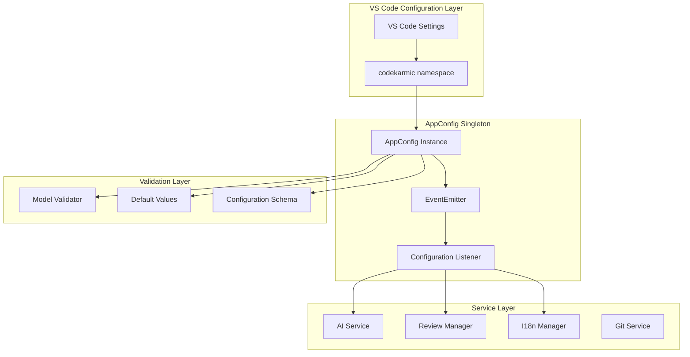
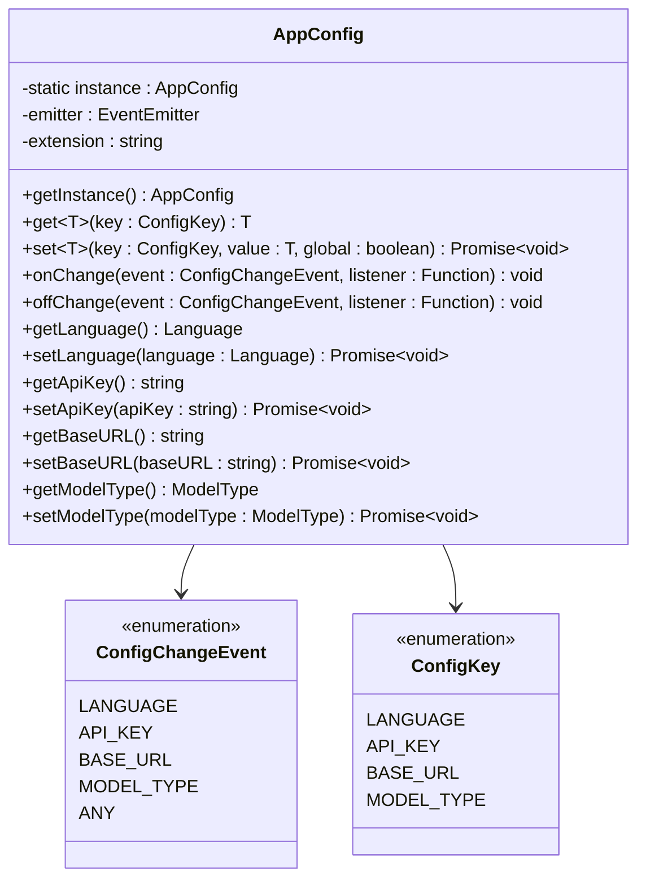
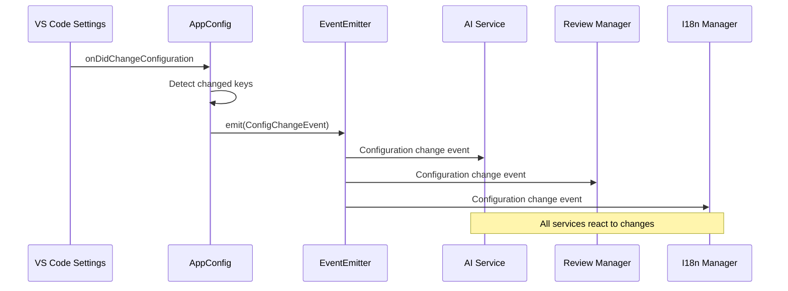
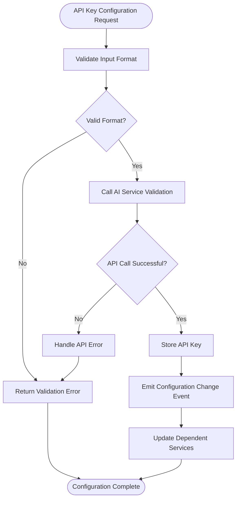
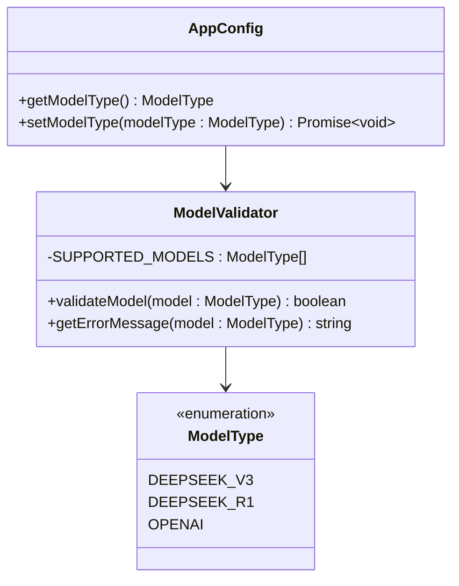
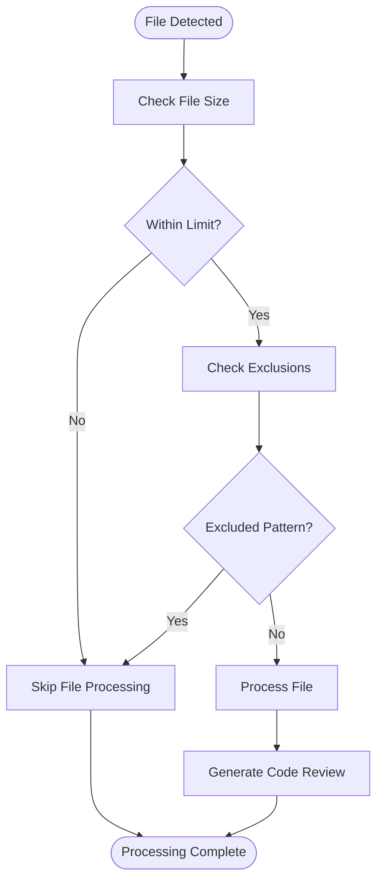
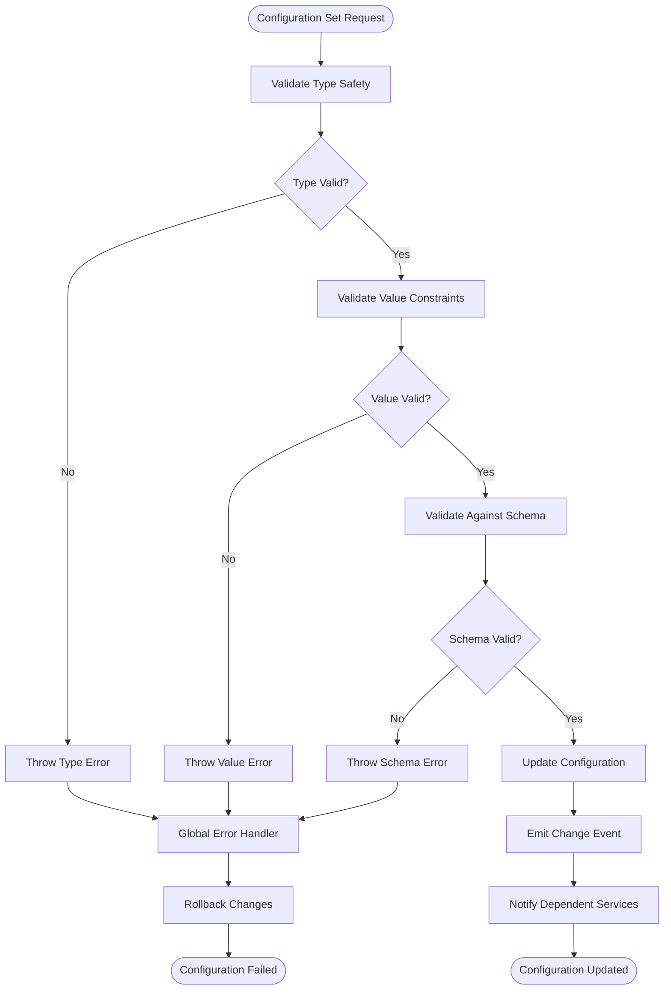
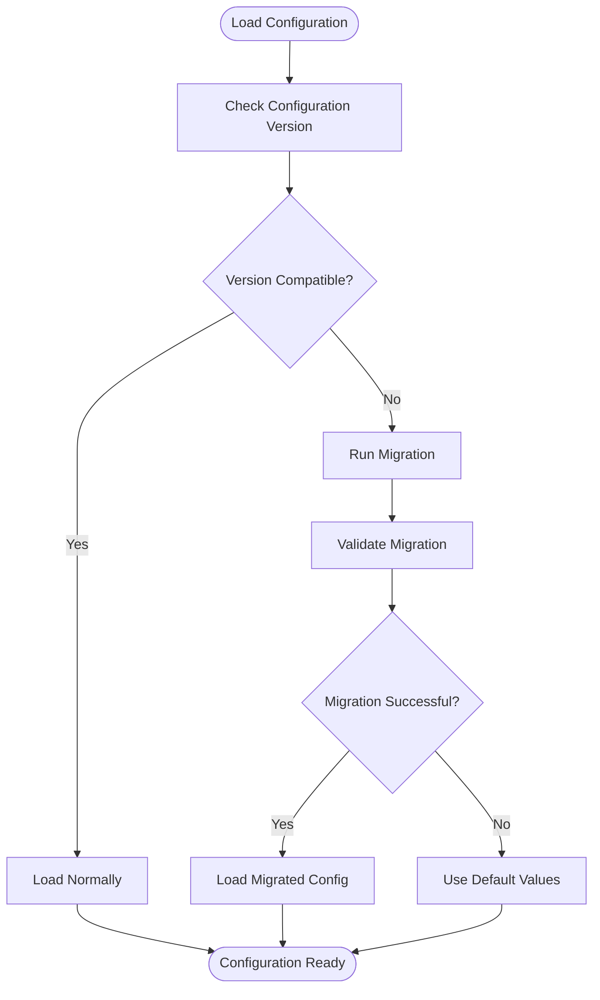

# Configuration Module

<cite>
**Referenced Files in This Document**
- [appConfig.ts](file://src/config/appConfig.ts)
- [extension.ts](file://src/extension.ts)
- [types.ts](file://src/models/types.ts)
- [aiService.ts](file://src/services/ai/aiService.ts)
- [modelValidator.ts](file://src/models/modelValidator.ts)
- [reviewManager.ts](file://src/services/review/reviewManager.ts)
- [index.ts](file://src/i18n/index.ts)
- [package.json](file://package.json)
</cite>

## Table of Contents
1. [Introduction](#introduction)
2. [Architecture Overview](#architecture-overview)
3. [AppConfig Singleton Class](#appconfig-singleton-class)
4. [Configuration Management](#configuration-management)
5. [Event-Based Change Notifications](#event-based-change-notifications)
6. [Integration with VS Code Configuration System](#integration-with-vs-code-configuration-system)
7. [API Key Management](#api-key-management)
8. [Model Selection and Validation](#model-selection-and-validation)
9. [File Size Limits and Exclusions](#file-size-limits-and-exclusions)
10. [Service Integration Examples](#service-integration-examples)
11. [Error Handling and Validation](#error-handling-and-validation)
12. [Best Practices](#best-practices)
13. [Common Issues and Troubleshooting](#common-issues-and-troubleshooting)
14. [Configuration Persistence and Migration](#configuration-persistence-and-migration)

## Introduction

The CodeKarmic Configuration module provides a centralized, event-driven system for managing all application settings. Built around the AppConfig singleton class, it offers seamless integration with VS Code's configuration system while maintaining robust error handling and real-time change notifications across the entire application.

The configuration system manages critical settings including API keys, model selection, language preferences, file size limits, and various operational parameters. It employs an event emitter pattern to notify components when configuration changes occur, ensuring all parts of the application remain synchronized with the latest settings.

## Architecture Overview

The configuration system follows a layered architecture that separates concerns between configuration storage, validation, and event notification:



**Diagram sources**
- [appConfig.ts](file://src/config/appConfig.ts#L49-L77)
- [aiService.ts](file://src/services/ai/aiService.ts#L50-L65)
- [reviewManager.ts](file://src/services/review/reviewManager.ts#L89-L93)

## AppConfig Singleton Class

The AppConfig class serves as the central hub for all configuration management, implementing the singleton pattern to ensure consistent access across the application:



**Diagram sources**
- [appConfig.ts](file://src/config/appConfig.ts#L11-L27)
- [appConfig.ts](file://src/config/appConfig.ts#L49-L188)

**Section sources**
- [appConfig.ts](file://src/config/appConfig.ts#L49-L188)

## Configuration Management

The AppConfig class provides a comprehensive interface for accessing and modifying configuration values:

### Core Configuration Keys

The system defines four primary configuration keys:

| Configuration Key | Type | Default Value | Description |
|------------------|------|---------------|-------------|
| `LANGUAGE` | string | `'ENGLISH'` | User interface language preference |
| `API_KEY` | string | `''` | Authentication key for AI services |
| `BASE_URL` | string | `'https://api.deepseek.com/v1'` | Base URL for AI API endpoints |
| `MODEL_TYPE` | string | `'deepseek-reasoner'` | Selected AI model for code review |

### Configuration Access Patterns

The configuration system supports type-safe access through generic methods:

```typescript
// Type-safe configuration retrieval
const apiKey: string = config.get(ConfigKey.API_KEY);
const modelType: ModelType = config.getModelType();
const language: Language = config.getLanguage();

// Type-safe configuration setting
await config.setApiKey('your-api-key-here');
await config.setModelType(ModelType.DEEPSEEK_R1);
```

**Section sources**
- [appConfig.ts](file://src/config/appConfig.ts#L22-L42)
- [appConfig.ts](file://src/config/appConfig.ts#L95-L187)

## Event-Based Change Notifications

The configuration system implements a sophisticated event emitter pattern to notify components of configuration changes:



**Diagram sources**
- [appConfig.ts](file://src/config/appConfig.ts#L58-L76)

### Event Types

The system defines specific event types for different configuration categories:

- **`LANGUAGE`**: Triggered when language settings change
- **`API_KEY`**: Triggered when API authentication credentials change  
- **`BASE_URL`**: Triggered when API endpoint URLs change
- **`MODEL_TYPE`**: Triggered when AI model selection changes
- **`ANY`**: General change event for all configuration modifications

**Section sources**
- [appConfig.ts](file://src/config/appConfig.ts#L11-L17)
- [appConfig.ts](file://src/config/appConfig.ts#L117-L128)

## Integration with VS Code Configuration System

The configuration system seamlessly integrates with VS Code's native configuration management through the `codekarmic` namespace:

### VS Code Configuration Schema

The extension contributes its configuration schema through the package.json manifest:

```json
{
  "configuration": {
    "title": "CodeKarmic",
    "properties": {
      "codekarmic.apiKey": {
        "type": "string",
        "default": "",
        "description": "API key for AI service",
        "scope": "machine"
      },
      "codekarmic.language": {
        "type": "string", 
        "default": "ENGLISH",
        "enum": ["ENGLISH", "CHINESE"],
        "description": "User interface language"
      }
    }
  }
}
```

### Configuration Namespace Management

The system uses the `codekarmic` namespace to isolate its settings from other extensions:

```typescript
private readonly extension = 'codekarmic';
private readonly emitter: EventEmitter;

// Configuration access through VS Code API
const config = vscode.workspace.getConfiguration(this.extension);
```

**Section sources**
- [appConfig.ts](file://src/config/appConfig.ts#L51-L52)
- [package.json](file://package.json#L118-L208)

## API Key Management

The configuration system provides secure and validated API key management:

### API Key Storage and Retrieval

```typescript
// Secure API key access
public getApiKey(): string {
    return this.get<string>(ConfigKey.API_KEY);
}

// Secure API key setting with validation
public async setApiKey(apiKey: string): Promise<void> {
    await this.set(ConfigKey.API_KEY, apiKey);
}
```

### API Key Validation Workflow

The system implements a multi-stage validation process:



**Diagram sources**
- [extension.ts](file://src/extension.ts#L37-L66)
- [aiService.ts](file://src/services/ai/aiService.ts#L87-L95)

**Section sources**
- [appConfig.ts](file://src/config/appConfig.ts#L146-L156)
- [extension.ts](file://src/extension.ts#L37-L66)

## Model Selection and Validation

The configuration system manages AI model selection with built-in validation:

### Supported Model Types

The system supports multiple AI models through a type-safe enumeration:

```typescript
export enum ModelType {
    DEEPSEEK_V3 = 'deepseek-chat',
    DEEPSEEK_R1 = 'deepseek-reasoner',
    OPENAI = 'openai'
}
```

### Model Validation Process



**Diagram sources**
- [modelValidator.ts](file://src/models/modelValidator.ts#L4-L14)
- [types.ts](file://src/models/types.ts#L10-L14)

### Model Configuration Integration

The AppConfig class provides convenience methods for model management:

```typescript
public getModelType(): ModelType {
    const displayName = this.get<string>(ConfigKey.MODEL_TYPE);
    return getModelTypeFromDisplayName(displayName);
}

public async setModelType(modelType: ModelType): Promise<void> {
    await this.set(ConfigKey.MODEL_TYPE, getModelTypeDisplayName(modelType));
}
```

**Section sources**
- [types.ts](file://src/models/types.ts#L10-L36)
- [modelValidator.ts](file://src/models/modelValidator.ts#L4-L14)
- [appConfig.ts](file://src/config/appConfig.ts#L176-L187)

## File Size Limits and Exclusions

The configuration system manages file processing limits and exclusions:

### Configuration Schema for File Management

| Setting | Type | Default | Purpose |
|---------|------|---------|---------|
| `maxFileSizeKb` | number | 100 | Maximum file size for review (KB) |
| `excludeFileTypes` | array | Extensive list | File patterns to exclude from review |

### File Processing Workflow



**Section sources**
- [package.json](file://package.json#L143-L207)

## Service Integration Examples

The configuration system enables seamless integration across multiple services:

### AI Service Configuration Updates

```typescript
// AI Service responds to configuration changes
const config = AppConfig.getInstance();
config.onChange(ConfigChangeEvent.API_KEY, async () => {
    const newApiKey = config.getApiKey();
    if (newApiKey) {
        // Reinitialize AI service with new credentials
        await AIService.getInstance().reinitialize(newApiKey);
    }
});
```

### Internationalization Service Updates

```typescript
// I18n Manager automatically updates when language changes
const i18n = I18nManager.getInstance();
config.onChange(ConfigChangeEvent.LANGUAGE, () => {
    const newLanguage = config.getLanguage();
    i18n.setLanguage(newLanguage);
});
```

### Review Manager Configuration Handling

```typescript
// Review Manager adapts to model changes
config.onChange(ConfigChangeEvent.MODEL_TYPE, () => {
    const newModel = config.getModelType();
    reviewManager.updateModelConfiguration(newModel);
});
```

**Section sources**
- [aiService.ts](file://src/services/ai/aiService.ts#L50-L65)
- [reviewManager.ts](file://src/services/review/reviewManager.ts#L89-L93)
- [index.ts](file://src/i18n/index.ts#L96-L102)

## Error Handling and Validation

The configuration system implements comprehensive error handling and validation:

### Configuration Validation Patterns



### Error Recovery Mechanisms

The system implements several error recovery strategies:

1. **Default Value Fallback**: Automatic fallback to predefined defaults
2. **Graceful Degradation**: Services continue operating with reduced functionality
3. **User Notification**: Clear error messages for user intervention
4. **Automatic Retry**: Intelligent retry mechanisms for transient failures

**Section sources**
- [appConfig.ts](file://src/config/appConfig.ts#L95-L98)
- [modelValidator.ts](file://src/models/modelValidator.ts#L7-L14)

## Best Practices

### Configuration Access Patterns

1. **Always use the singleton instance**:
```typescript
const config = AppConfig.getInstance();
```

2. **Use type-safe getters**:
```typescript
const apiKey = config.get(ConfigKey.API_KEY);
const modelType = config.getModelType();
```

3. **Handle asynchronous operations properly**:
```typescript
await config.setApiKey(newApiKey);
```

### Event Listener Management

1. **Register listeners during initialization**:
```typescript
config.onChange(ConfigChangeEvent.API_KEY, this.handleApiKeyChange.bind(this));
```

2. **Clean up listeners when appropriate**:
```typescript
config.offChange(ConfigChangeEvent.API_KEY, this.handleApiKeyChange);
```

### Error Handling Guidelines

1. **Validate configuration changes before applying**:
```typescript
if (this.validateApiKey(newValue)) {
    await config.setApiKey(newValue);
}
```

2. **Provide meaningful error messages**:
```typescript
try {
    await config.setApiKey(invalidKey);
} catch (error) {
    console.error('Invalid API key format:', error);
}
```

## Common Issues and Troubleshooting

### Configuration Not Persisting

**Symptoms**: Settings reset after restart
**Causes**: 
- Incorrect scope specification in package.json
- Insufficient permissions for configuration storage
- VS Code workspace-specific settings

**Solutions**:
1. Verify configuration scope in package.json
2. Check VS Code settings synchronization
3. Test with global vs workspace settings

### API Key Validation Failures

**Symptoms**: API key rejected despite being correct
**Causes**:
- Network connectivity issues
- Rate limiting by AI provider
- Expired or revoked API keys

**Solutions**:
1. Test API key manually with provider's tools
2. Check network connectivity and firewall settings
3. Monitor rate limits and adjust usage patterns

### Model Selection Issues

**Symptoms**: Model not recognized or failing
**Causes**:
- Unsupported model type
- Model configuration conflicts
- Provider-specific limitations

**Solutions**:
1. Verify model type is supported
2. Check model-specific configuration requirements
3. Review provider documentation for limitations

### Event Notification Problems

**Symptoms**: Services not responding to configuration changes
**Causes**:
- Missing event listeners
- Improper event registration
- Timing issues in initialization

**Solutions**:
1. Ensure proper event listener registration
2. Verify listener cleanup and memory management
3. Check initialization order and timing

## Configuration Persistence and Migration

### Version Compatibility

The configuration system handles version migrations gracefully:



### Migration Strategies

1. **Backward Compatibility**: New configurations work with older versions
2. **Forward Compatibility**: Older configurations work with newer versions
3. **Automatic Migration**: Seamless conversion of deprecated settings
4. **Manual Intervention**: Clear guidance for complex migrations

### Configuration Backup and Restore

The system supports configuration backup and restore through VS Code's native mechanisms:

- **Automatic Backup**: Configuration changes are automatically backed up
- **Manual Export**: Users can export configuration to JSON format
- **Import Functionality**: Import configurations from external sources
- **Reset Capabilities**: Reset to factory defaults when needed

**Section sources**
- [appConfig.ts](file://src/config/appConfig.ts#L58-L76)
- [package.json](file://package.json#L118-L208)