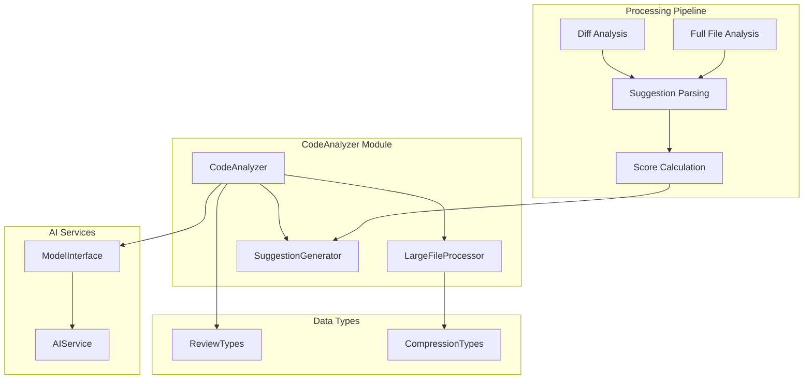
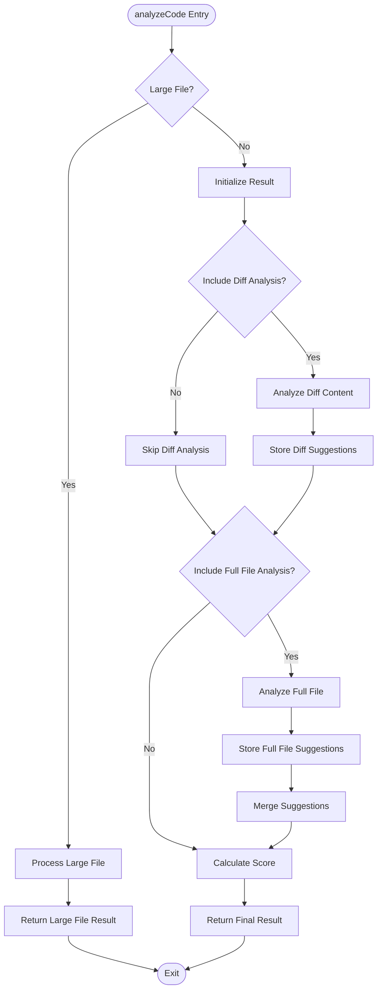
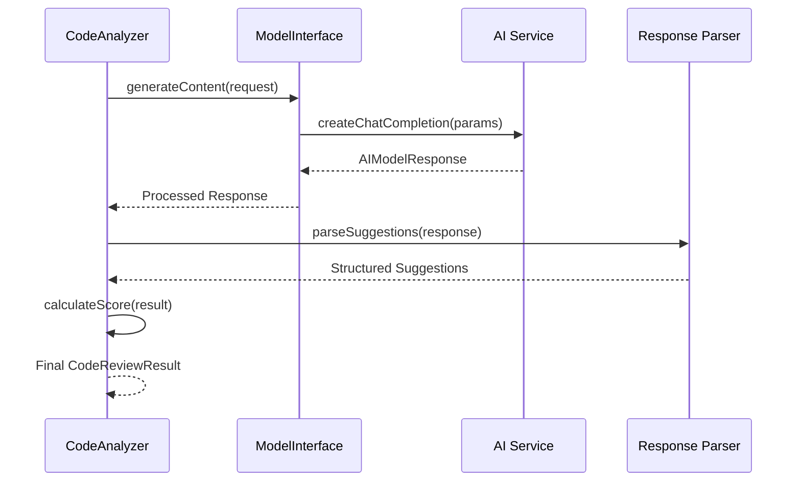
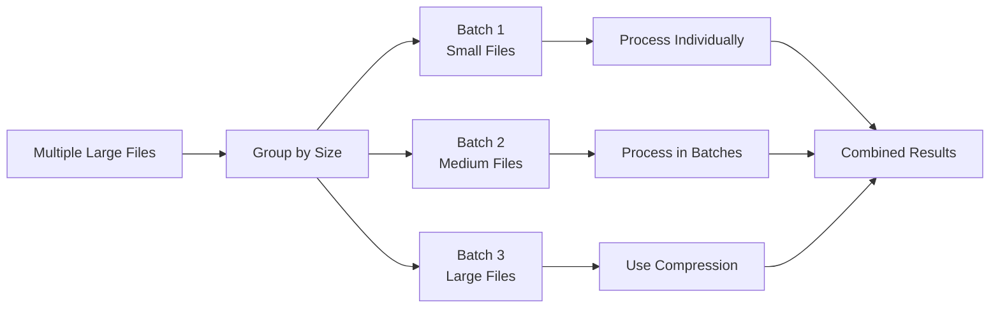

# Code Analysis

<cite>
**Referenced Files in This Document**
- [codeAnalyzer.ts](file://src/core/review/codeAnalyzer.ts)
- [reviewTypes.ts](file://src/core/review/reviewTypes.ts)
- [modelInterface.ts](file://src/models/modelInterface.ts)
- [largeFileProcessor.ts](file://src/core/compression/largeFileProcessor.ts)
- [compressionTypes.ts](file://src/core/compression/compressionTypes.ts)
- [contentCompressor.ts](file://src/core/compression/contentCompressor.ts)
- [prompts.ts](file://src/i18n/en/prompts.ts)
- [suggestionGenerator.ts](file://src/core/review/suggestionGenerator.ts)
- [aiService.ts](file://src/services/ai/aiService.ts)
- [extension.ts](file://src/extension.ts)
</cite>

## Table of Contents
1. [Introduction](#introduction)
2. [Architecture Overview](#architecture-overview)
3. [Core Components](#core-components)
4. [Code Analysis Workflow](#code-analysis-workflow)
5. [AI Integration](#ai-integration)
6. [Large File Processing](#large-file-processing)
7. [Performance Considerations](#performance-considerations)
8. [Error Handling](#error-handling)
9. [Integration Examples](#integration-examples)
10. [Best Practices](#best-practices)

## Introduction

The CodeAnalyzer module serves as the central component for analyzing and reviewing code changes in the CodeKarmic extension. It orchestrates the entire code analysis workflow, integrating with AI services to generate structured review results and calculate quality scores. The module handles both traditional code review scenarios and specialized processing for large files, ensuring optimal performance across different file sizes and complexity levels.

The analyzer operates through a sophisticated pipeline that includes conditional execution of diff and full-file analysis based on configurable options, intelligent suggestion parsing from AI responses, and adaptive scoring mechanisms that can derive scores either explicitly from AI output or estimated based on suggestion count.

## Architecture Overview

The CodeAnalyzer follows a modular architecture with clear separation of concerns:



**Diagram sources**
- [codeAnalyzer.ts](file://src/core/review/codeAnalyzer.ts#L17-L230)
- [largeFileProcessor.ts](file://src/core/compression/largeFileProcessor.ts#L23-L242)
- [suggestionGenerator.ts](file://src/core/review/suggestionGenerator.ts#L56-L456)

## Core Components

### CodeAnalyzer Class

The CodeAnalyzer class serves as the primary orchestrator for code review operations. It maintains dependencies on AI services and large file processors while providing a unified interface for code analysis.

**Key Responsibilities:**
- Coordinate the analysis workflow based on configuration options
- Manage conditional execution of diff and full-file analysis
- Integrate with AI services for suggestion generation
- Handle error scenarios gracefully
- Calculate final scores using multiple strategies

**Section sources**
- [codeAnalyzer.ts](file://src/core/review/codeAnalyzer.ts#L17-L230)

### Large File Processor

The LargeFileProcessor handles specialized processing for files exceeding size thresholds, employing intelligent compression techniques to make large files manageable for AI analysis while preserving essential information.

**Key Features:**
- Automatic detection of large files based on character thresholds
- Intelligent content compression with language-aware heuristics
- Batch processing capabilities for multiple large files
- Fingerprint calculation for caching and version comparison

**Section sources**
- [largeFileProcessor.ts](file://src/core/compression/largeFileProcessor.ts#L23-L242)

### Suggestion Generator

The SuggestionGenerator enhances raw AI suggestions by structuring them into meaningful categories, determining severity levels, and creating formatted reports for display.

**Capabilities:**
- Structured suggestion categorization (structure, performance, security, etc.)
- Severity assessment based on content analysis
- Report generation with categorized summaries
- Integration with the review panel for user display

**Section sources**
- [suggestionGenerator.ts](file://src/core/review/suggestionGenerator.ts#L56-L456)

## Code Analysis Workflow

The analyzeCode method orchestrates the complete analysis workflow through a carefully designed conditional execution pattern:



**Diagram sources**
- [codeAnalyzer.ts](file://src/core/review/codeAnalyzer.ts#L35-L89)

### Conditional Analysis Execution

The workflow adapts based on several factors:

1. **Large File Detection**: Files exceeding size thresholds trigger specialized compression processing
2. **Diff Analysis Option**: Conditional execution based on includeDiffAnalysis flag
3. **Full File Analysis**: Always executed unless disabled via configuration
4. **Fallback Mechanisms**: Graceful degradation when AI services are unavailable

**Section sources**
- [codeAnalyzer.ts](file://src/core/review/codeAnalyzer.ts#L45-L89)

## AI Integration

The CodeAnalyzer integrates seamlessly with AI services through the ModelInterface, enabling sophisticated code analysis capabilities:

### System and User Prompts

The module utilizes carefully crafted prompts for different analysis scenarios:

**Diff Analysis Prompts:**
- Focus on specific changes and their implications
- Line-number-based suggestion format
- Context-aware analysis of modifications

**Full File Analysis Prompts:**
- Comprehensive code quality assessment
- Structural organization evaluation
- Performance and security considerations

**Section sources**
- [prompts.ts](file://src/i18n/en/prompts.ts#L11-L105)

### Content Generation Requests

The AI integration supports various content generation patterns:



**Diagram sources**
- [codeAnalyzer.ts](file://src/core/review/codeAnalyzer.ts#L97-L127)
- [modelInterface.ts](file://src/models/modelInterface.ts#L168-L185)

**Section sources**
- [codeAnalyzer.ts](file://src/core/review/codeAnalyzer.ts#L97-L165)

## Large File Processing

The LargeFileProcessor provides sophisticated handling for files that exceed typical processing limits:

### Compression Strategies

The content compressor employs intelligent algorithms tailored to different programming languages:

**Language-Specific Heuristics:**
- JavaScript/TypeScript: Function definitions, React hooks, JSX elements
- Python: Function/class definitions, decorators, special methods  
- Java/Kotlin: Class definitions, method signatures, annotations
- CSS/SASS: Selectors, media queries, variables/mixins
- SQL: Schema definitions, queries, stored procedures

**Compression Algorithm:**
1. Header and footer preservation (configurable line counts)
2. Intelligent sampling based on content importance
3. Context preservation around important code blocks
4. Statistical reporting for transparency

**Section sources**
- [contentCompressor.ts](file://src/core/compression/contentCompressor.ts#L18-L414)

### Batch Processing

The processor supports efficient batch processing for multiple large files:



**Diagram sources**
- [largeFileProcessor.ts](file://src/core/compression/largeFileProcessor.ts#L159-L222)

**Section sources**
- [largeFileProcessor.ts](file://src/core/compression/largeFileProcessor.ts#L159-L222)

## Performance Considerations

### Token Management

The system implements intelligent token management to optimize AI API usage:

**Token Estimation:**
- Characters-to-tokens conversion (0.25 tokens per character)
- Batch size calculation based on model limits
- Dynamic adjustment based on content complexity

**Optimization Strategies:**
- Early termination for small files
- Streaming responses for long-running operations
- Caching mechanisms for repeated analyses

### Memory Management

Large file processing includes careful memory management:

**Compression Thresholds:**
- Configurable size limits (default: 20,000 characters)
- Adaptive sampling rates based on file characteristics
- Progressive loading for extremely large files

**Section sources**
- [compressionTypes.ts](file://src/core/compression/compressionTypes.ts#L82-L87)

### Concurrent Processing

The system supports concurrent processing for multiple files:

**Parallel Execution:**
- Independent file processing
- Asynchronous AI service calls
- Progress tracking for long operations

**Section sources**
- [aiService.ts](file://src/services/ai/aiService.ts#L426-L552)

## Error Handling

The CodeAnalyzer implements comprehensive error handling across all analysis phases:

### Analysis Phase Errors

**Diff Analysis Failures:**
- Fallback to simple diff generation
- Graceful degradation with partial results
- Error logging with diagnostic information

**Full File Analysis Failures:**
- Alternative analysis strategies
- Suggestion fallback mechanisms
- User-friendly error messages

### AI Service Integration Errors

**API Communication Issues:**
- Retry mechanisms with exponential backoff
- Timeout handling and cancellation support
- Graceful degradation to cached results

**Response Parsing Errors:**
- Robust parsing with fallback strategies
- Validation of extracted suggestions
- Error recovery for malformed responses

**Section sources**
- [codeAnalyzer.ts](file://src/core/review/codeAnalyzer.ts#L84-L89)
- [aiService.ts](file://src/services/ai/aiService.ts#L691-L710)

## Integration Examples

### Basic Code Review Request

```typescript
// Example of processing a CodeReviewRequest
const request: CodeReviewRequest = {
    filePath: 'src/components/Button.tsx',
    currentContent: '// File content here',
    previousContent: '// Previous content',
    language: 'typescript',
    reviewMode: ReviewMode.GIT_COMMIT
};

const options: CodeAnalysisOptions = {
    includeDiffAnalysis: true,
    includeFullFileAnalysis: true,
    useCompression: true
};

const result = await codeAnalyzer.analyzeCode(request, options);
```

### Large File Processing

```typescript
// Automatic large file detection and processing
const largeFileRequest: CodeReviewRequest = {
    filePath: 'src/very-large-file.js',
    currentContent: '/* Extremely large content */',
    useCompression: true
};

// Large files are automatically processed with compression
const result = await codeAnalyzer.analyzeCode(largeFileRequest);
```

### Batch Processing

```typescript
// Processing multiple files efficiently
const requests: CodeReviewRequest[] = [
    { filePath: 'file1.ts', currentContent: '...', previousContent: '...' },
    { filePath: 'file2.ts', currentContent: '...', previousContent: '...' }
];

// Batch processing handled internally
const results = await aiService.batchReviewCode(requests);
```

**Section sources**
- [aiService.ts](file://src/services/ai/aiService.ts#L426-L552)

## Best Practices

### Configuration Guidelines

**Analysis Options:**
- Enable diff analysis for Git-based reviews
- Use compression for files larger than 20,000 characters
- Configure appropriate token limits based on model capabilities

**Performance Tuning:**
- Monitor API usage and adjust batch sizes
- Implement caching for frequently reviewed files
- Use streaming responses for long-running operations

### Error Recovery

**Graceful Degradation:**
- Always provide fallback suggestions when AI fails
- Maintain partial results during processing errors
- Log detailed error information for debugging

**User Experience:**
- Provide clear progress indicators for long operations
- Offer alternative analysis approaches when primary methods fail
- Display helpful error messages with actionable suggestions

### Integration Patterns

**Service Layer Design:**
- Separate concerns between analysis and presentation
- Use dependency injection for AI services
- Implement proper abstraction for testing and mocking

**Monitoring and Logging:**
- Track analysis performance metrics
- Log AI response patterns and error frequencies
- Monitor token usage and cost optimization

The CodeAnalyzer module represents a sophisticated approach to automated code review, combining intelligent processing strategies with robust error handling to deliver reliable and efficient code analysis capabilities.