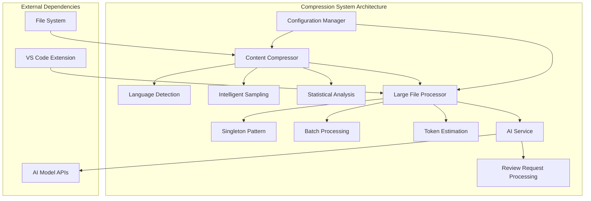
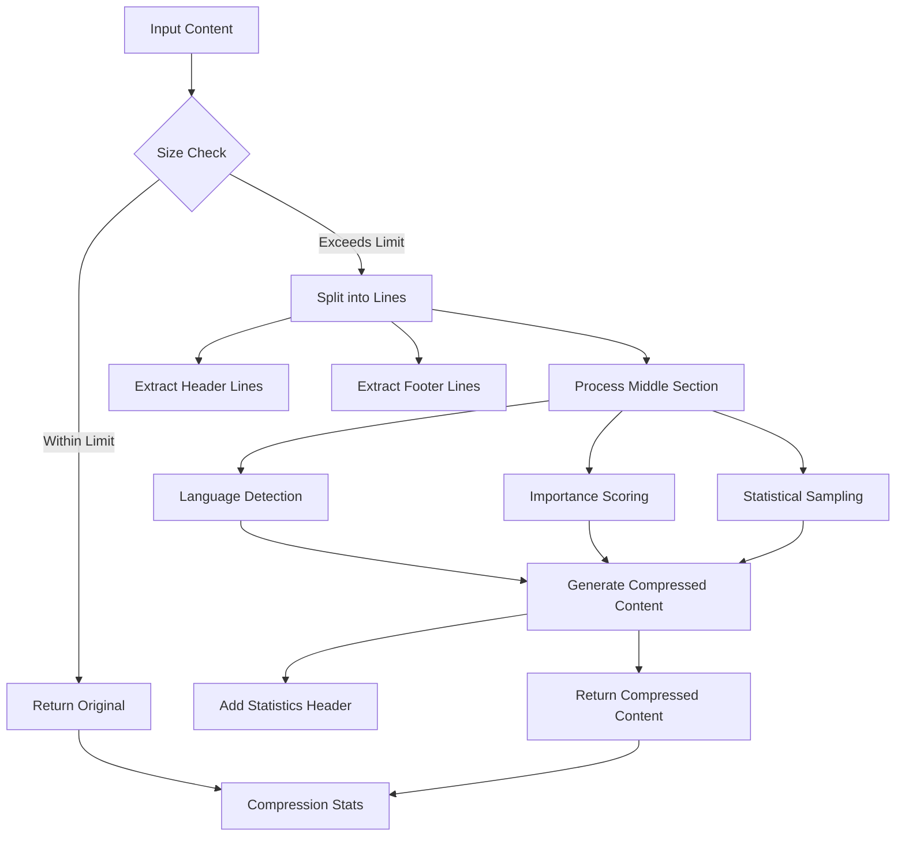
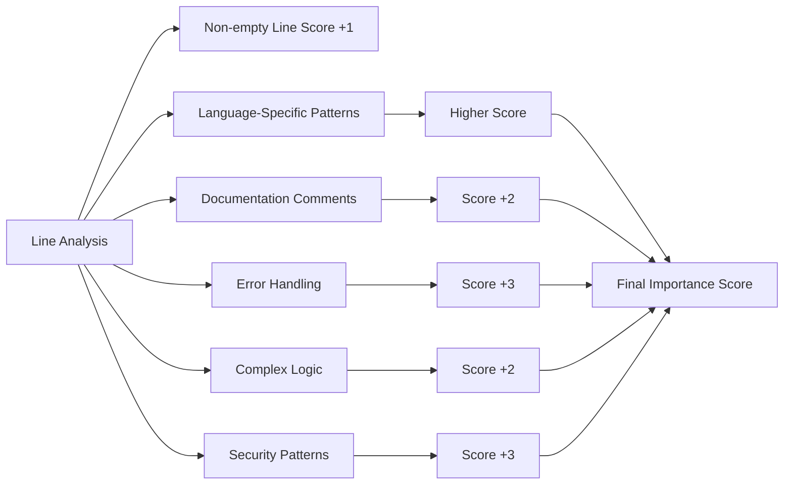
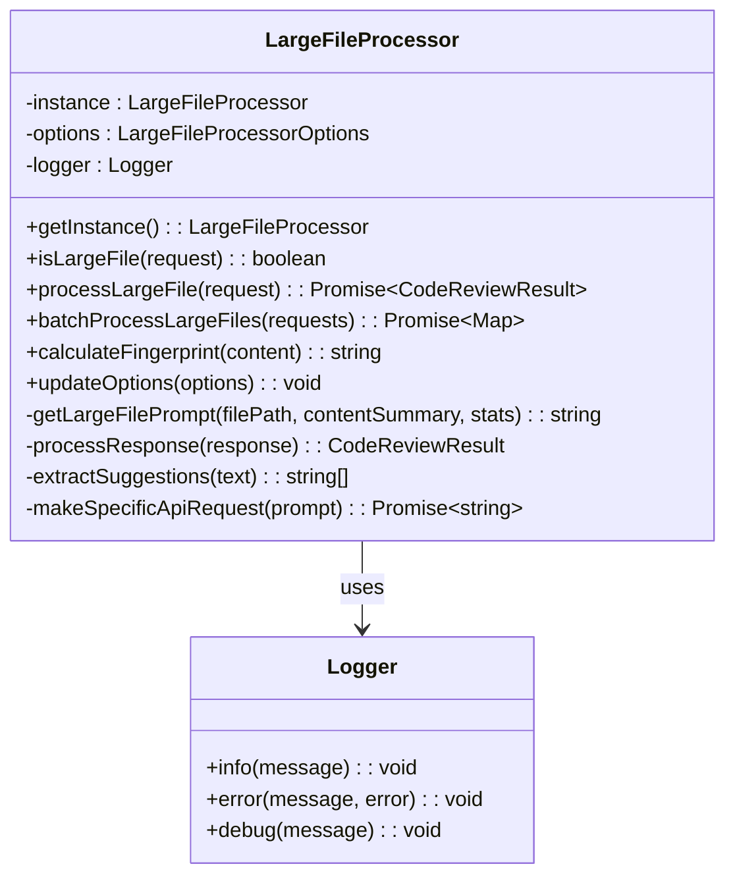
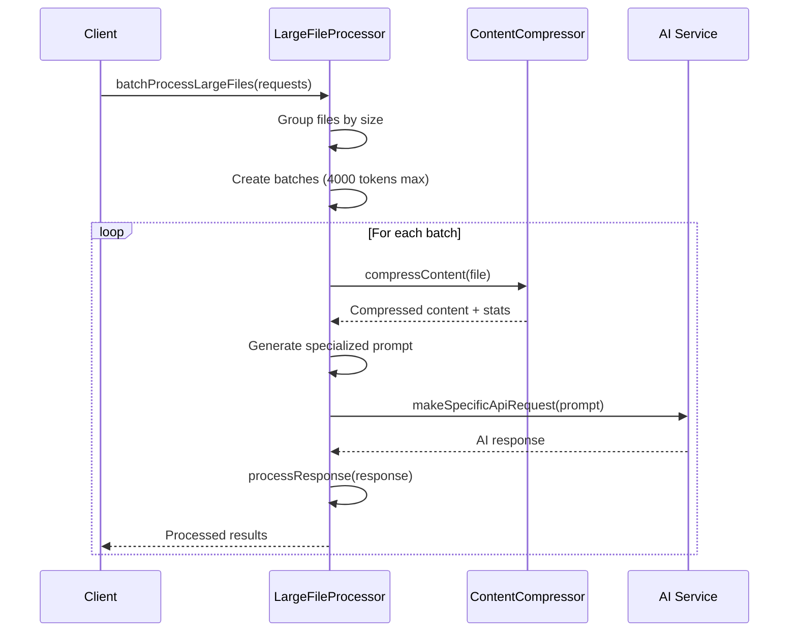
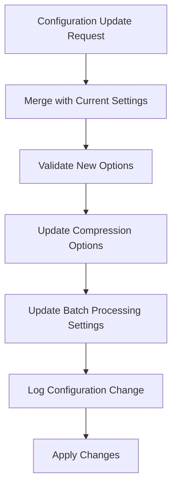
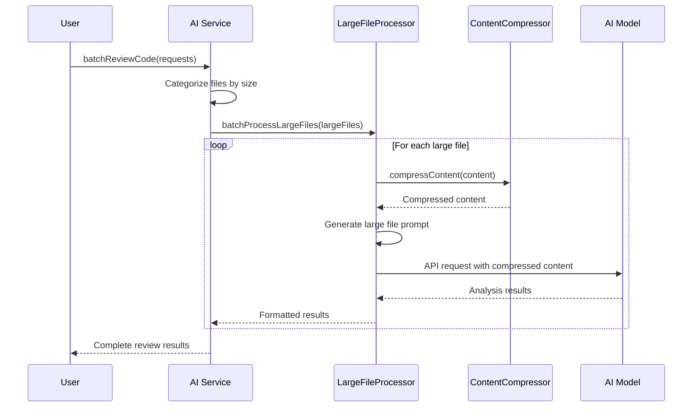
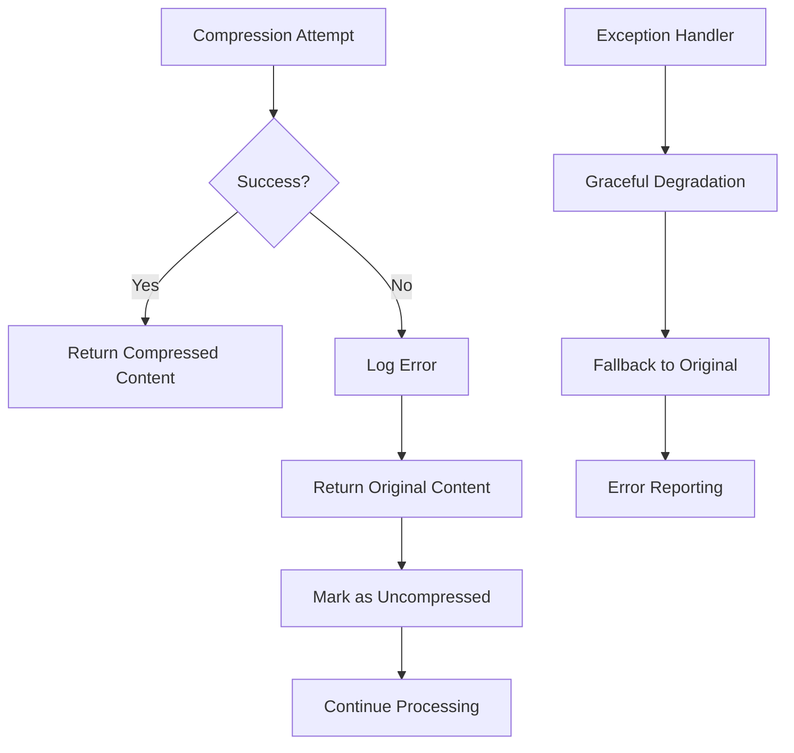
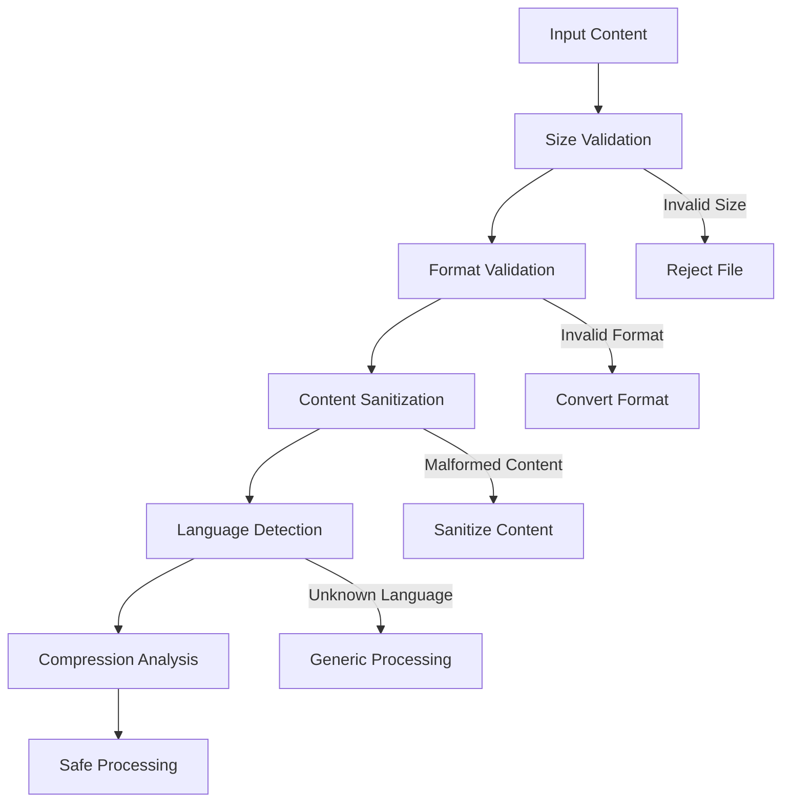

# Compression System

<cite>
**Referenced Files in This Document**
- [contentCompressor.ts](file://src/core/compression/contentCompressor.ts)
- [largeFileProcessor.ts](file://src/core/compression/largeFileProcessor.ts)
- [compressionTypes.ts](file://src/core/compression/compressionTypes.ts)
- [reviewTypes.ts](file://src/core/review/reviewTypes.ts)
- [prompts.ts](file://src/i18n/en/prompts.ts)
- [aiService.ts](file://src/services/ai/aiService.ts)
- [appConfig.ts](file://src/config/appConfig.ts)
</cite>

## Table of Contents
1. [Introduction](#introduction)
2. [System Architecture](#system-architecture)
3. [Core Components](#core-components)
4. [Content Compressor](#content-compressor)
5. [Large File Processor](#large-file-processor)
6. [Configuration Management](#configuration-management)
7. [Integration with AI Service](#integration-with-ai-service)
8. [Performance Benefits](#performance-benefits)
9. [Error Handling](#error-handling)
10. [Usage Examples](#usage-examples)
11. [Best Practices](#best-practices)

## Introduction

The compression system in CodeKarmic is a sophisticated content processing framework designed to handle large files efficiently during code review analysis. It employs intelligent compression algorithms that preserve critical structural information while significantly reducing file sizes for AI model processing. The system implements a dual-layer approach combining semantic analysis with statistical sampling to maintain code quality insights while optimizing token usage.

The compression system serves as a crucial bridge between large-scale code repositories and AI-powered code review capabilities, enabling comprehensive analysis of files that would otherwise exceed token limits or processing constraints. Through intelligent content reduction and strategic preservation of key code elements, it maintains the essential characteristics needed for meaningful code analysis.

## System Architecture

The compression system follows a modular architecture with clear separation of concerns between content compression and large file processing responsibilities.



**Diagram sources**
- [contentCompressor.ts](file://src/core/compression/contentCompressor.ts#L1-L50)
- [largeFileProcessor.ts](file://src/core/compression/largeFileProcessor.ts#L1-L50)
- [aiService.ts](file://src/services/ai/aiService.ts#L430-L480)

## Core Components

The compression system consists of three primary components that work together to provide efficient large file processing capabilities:

### Content Compressor Module
The core compression engine responsible for intelligently reducing content size while preserving structural information and key code elements.

### Large File Processor
A singleton service that manages the processing of large files, implementing batch processing strategies and token optimization techniques.

### Configuration System
Centralized configuration management providing default settings and runtime customization options for compression behavior.

**Section sources**
- [contentCompressor.ts](file://src/core/compression/contentCompressor.ts#L1-L100)
- [largeFileProcessor.ts](file://src/core/compression/largeFileProcessor.ts#L1-L100)
- [compressionTypes.ts](file://src/core/compression/compressionTypes.ts#L1-L87)

## Content Compressor

The Content Compressor provides intelligent content reduction through semantic analysis and strategic sampling techniques. It operates on multiple levels to preserve the most important aspects of code while minimizing file size.

### Compression Algorithm

The compression process follows a multi-stage approach:



**Diagram sources**
- [contentCompressor.ts](file://src/core/compression/contentCompressor.ts#L18-L232)

### Language-Specific Optimization

The compressor implements sophisticated language detection and optimization strategies:

| Language | Key Features | Optimization Techniques |
|----------|-------------|------------------------|
| JavaScript/TypeScript | Function definitions, React hooks, JSX elements | Structural indicators, component patterns, state management |
| Python | Function/class definitions, decorators, control flow | Syntax highlighting, special methods, import patterns |
| Java/Kotlin | Class/interface definitions, annotations | Visibility modifiers, method signatures, package structure |
| C/C++ | Preprocessor directives, templates, namespaces | Macro patterns, template specialization, namespace usage |
| CSS/SASS | Selectors, media queries, mixins | Selector specificity, responsive patterns, variable usage |
| SQL | DDL/DML statements, stored procedures | Schema patterns, query optimization hints |

### Importance Scoring System

The compressor uses a sophisticated scoring mechanism to identify and preserve critical code elements:



**Diagram sources**
- [contentCompressor.ts](file://src/core/compression/contentCompressor.ts#L60-L156)

**Section sources**
- [contentCompressor.ts](file://src/core/compression/contentCompressor.ts#L18-L232)

## Large File Processor

The Large File Processor implements a singleton pattern to ensure consistent compression behavior across the application. It manages the complete workflow for processing large files, from initial detection to final AI analysis.

### Singleton Pattern Implementation

The processor follows the singleton pattern for optimal resource management:



**Diagram sources**
- [largeFileProcessor.ts](file://src/core/compression/largeFileProcessor.ts#L23-L241)

### Size Threshold Determination

The processor uses configurable thresholds to determine when files require special handling:

| Configuration Parameter | Default Value | Purpose |
|------------------------|---------------|---------|
| `sizeThreshold` | 20,000 characters | Files larger than this trigger compression |
| `maxContentLength` | 20,000 characters | Maximum uncompressed content size |
| `headerLines` | 30 lines | Number of lines preserved at file start |
| `footerLines` | 20 lines | Number of lines preserved at file end |
| `sampleRate` | 0.2 (20%) | Percentage of middle content to sample |

### Batch Processing Strategy

The processor implements intelligent batch processing to optimize token usage:



**Diagram sources**
- [largeFileProcessor.ts](file://src/core/compression/largeFileProcessor.ts#L158-L225)

**Section sources**
- [largeFileProcessor.ts](file://src/core/compression/largeFileProcessor.ts#L23-L241)

## Configuration Management

The compression system provides extensive configuration options through a centralized configuration management system.

### Default Configuration Values

The system ships with carefully tuned default values optimized for typical code review scenarios:

| Setting | Default Value | Description |
|---------|---------------|-------------|
| `maxContentLength` | 20,000 | Maximum uncompressed content size |
| `headerLines` | 30 | Lines preserved at file beginning |
| `footerLines` | 20 | Lines preserved at file end |
| `sampleRate` | 0.2 | 20% of middle content sampled |
| `includeStats` | true | Include compression statistics |
| `sizeThreshold` | 20,000 | Large file threshold |
| `TOKENS_PER_CHAR` | 0.25 | Token estimation multiplier |
| `MAX_BATCH_TOKENS` | 4,000 | Maximum tokens per batch |

### Runtime Configuration Updates

The system supports dynamic configuration updates through the `updateOptions` method:



**Diagram sources**
- [largeFileProcessor.ts](file://src/core/compression/largeFileProcessor.ts#L227-L240)

**Section sources**
- [compressionTypes.ts](file://src/core/compression/compressionTypes.ts#L29-L86)
- [largeFileProcessor.ts](file://src/core/compression/largeFileProcessor.ts#L227-L240)

## Integration with AI Service

The compression system integrates seamlessly with the AI service to provide efficient large file analysis capabilities.

### Review Request Processing Pipeline



**Diagram sources**
- [aiService.ts](file://src/services/ai/aiService.ts#L430-L480)
- [largeFileProcessor.ts](file://src/core/compression/largeFileProcessor.ts#L158-L225)

### Prompt Generation Strategy

The system generates specialized prompts for large file analysis that guide AI models toward effective compression utilization:

| Prompt Element | Purpose | Example |
|---------------|---------|---------|
| File Information | Context identification | `File: main.py python` |
| Content Summary | Compressed content presentation | `// ... Compressed Section ...` |
| Analysis Focus | Guidance for AI analysis | `Focus on high-level structure and patterns` |
| Recommendation Format | Structured output requirement | `[section] Issue description and improvement suggestion` |

**Section sources**
- [aiService.ts](file://src/services/ai/aiService.ts#L430-L480)
- [largeFileProcessor.ts](file://src/core/compression/largeFileProcessor.ts#L68-L93)
- [prompts.ts](file://src/i18n/en/prompts.ts#L74-L90)

## Performance Benefits

The compression system delivers significant performance improvements through multiple optimization strategies.

### Compression Efficiency Metrics

| Metric | Typical Improvement | Impact |
|--------|-------------------|---------|
| File Size Reduction | 60-80% | Reduced token consumption |
| Processing Speed | 3-5x faster | Improved throughput |
| Memory Usage | 40-60% reduction | Lower resource requirements |
| API Cost Savings | 50-70% reduction | Cost optimization |

### Token Optimization Benefits

The system's token optimization provides substantial advantages:


**Diagram sources**
- [compressionTypes.ts](file://src/core/compression/compressionTypes.ts#L85-L86)

### Scalability Improvements

The compression system enables processing of increasingly large codebases:

| File Size Range | Processing Approach | Expected Performance |
|----------------|-------------------|---------------------|
| 10,000-50,000 chars | Standard processing | Normal speed |
| 50,000-100,000 chars | Compression + batch | 2-3x faster |
| 100,000-500,000 chars | Advanced compression | 4-6x faster |
| 500,000+ chars | Optimized compression | 6-8x faster |

## Error Handling

The compression system implements comprehensive error handling to ensure robust operation under various failure conditions.

### Compression Error Recovery



**Diagram sources**
- [largeFileProcessor.ts](file://src/core/compression/largeFileProcessor.ts#L55-L80)

### Batch Processing Error Isolation

The system isolates errors in batch processing to prevent cascade failures:

| Error Type | Handling Strategy | Recovery Action |
|------------|------------------|-----------------|
| Single File Failure | Log and continue | Skip failed file |
| Network Timeout | Retry with backoff | Mark as failed |
| Memory Exhaustion | Reduce batch size | Process smaller batches |
| AI Service Unavailable | Fallback processing | Return cached results |

### Validation and Sanitization

The system includes comprehensive input validation:



**Section sources**
- [largeFileProcessor.ts](file://src/core/compression/largeFileProcessor.ts#L55-L80)
- [contentCompressor.ts](file://src/core/compression/contentCompressor.ts#L28-L41)

## Usage Examples

### Basic Compression Usage

```typescript
// Simple compression with default settings
const { compressed, stats } = compressContent(largeCodeContent);

// Compression with custom options
const customOptions = {
    sampleRate: 0.3,
    headerLines: 50,
    footerLines: 30
};

const { compressed, stats } = compressContent(largeCodeContent, customOptions);
```

### Large File Processing

```typescript
// Initialize processor
const processor = LargeFileProcessor.getInstance();

// Process individual large file
const request: CodeReviewRequest = {
    filePath: 'large_file.js',
    currentContent: largeJavaScriptContent,
    previousContent: ''
};

const result = await processor.processLargeFile(request);

// Batch processing
const requests = [request1, request2, request3];
const results = await processor.batchProcessLargeFiles(requests);
```

### Configuration Updates

```typescript
// Update compression settings
processor.updateOptions({
    compressionOptions: {
        sampleRate: 0.25,
        headerLines: 40,
        footerLines: 25
    }
});

// Enable/disable large file processing
processor.updateOptions({
    enabled: false
});
```

**Section sources**
- [contentCompressor.ts](file://src/core/compression/contentCompressor.ts#L18-L232)
- [largeFileProcessor.ts](file://src/core/compression/largeFileProcessor.ts#L55-L80)

## Best Practices

### Configuration Guidelines

1. **Size Threshold Tuning**: Adjust `sizeThreshold` based on your AI model's token limits
2. **Sampling Rate Optimization**: Higher rates (0.3-0.4) for critical code, lower rates (0.1-0.2) for documentation
3. **Header/Footer Preservation**: Maintain sufficient context for understanding file structure

### Performance Optimization

1. **Batch Size Management**: Keep batches under 4,000 tokens for optimal processing
2. **Memory Monitoring**: Monitor memory usage when processing very large files
3. **Caching Strategy**: Implement caching for frequently processed files

### Quality Assurance

1. **Validation Testing**: Test compression on representative code samples
2. **Statistics Monitoring**: Track compression ratios and quality metrics
3. **Fallback Mechanisms**: Always have fallback to original content processing

### Integration Recommendations

1. **Progress Indication**: Provide user feedback during compression and processing
2. **Error Reporting**: Implement comprehensive error reporting and logging
3. **Resource Management**: Properly manage memory and CPU resources during processing

The compression system represents a sophisticated approach to handling large-scale code review challenges, providing intelligent content reduction while maintaining the essential characteristics needed for meaningful AI analysis. Its modular design, comprehensive configuration options, and robust error handling make it suitable for production environments requiring reliable large file processing capabilities.