# Core Logic

<cite>
**Referenced Files in This Document**
- [codeAnalyzer.ts](file://src/core/review/codeAnalyzer.ts)
- [suggestionGenerator.ts](file://src/core/review/suggestionGenerator.ts)
- [contentCompressor.ts](file://src/core/compression/contentCompressor.ts)
- [largeFileProcessor.ts](file://src/core/compression/largeFileProcessor.ts)
- [reviewTypes.ts](file://src/core/review/reviewTypes.ts)
- [compressionTypes.ts](file://src/core/compression/compressionTypes.ts)
- [aiService.ts](file://src/services/ai/aiService.ts)
- [modelInterface.ts](file://src/models/modelInterface.ts)
- [prompts.ts](file://src/i18n/en/prompts.ts)
</cite>

## Table of Contents
1. [Introduction](#introduction)
2. [Architecture Overview](#architecture-overview)
3. [Code Analyzer](#code-analyzer)
4. [Suggestion Generator](#suggestion-generator)
5. [Content Compression System](#content-compression-system)
6. [Large File Processing](#large-file-processing)
7. [AI Integration](#ai-integration)
8. [Performance Considerations](#performance-considerations)
9. [Error Handling](#error-handling)
10. [Integration Points](#integration-points)
11. [Conclusion](#conclusion)

## Introduction

CodeKarmic's Core Logic forms the heart of the code review system, providing sophisticated analysis capabilities through intelligent parsing, compression, and AI-driven suggestion generation. The system is designed to handle both small and large files efficiently, offering comprehensive code quality assessments while maintaining optimal performance and reliability.

The core components work together to transform raw code changes into actionable insights, enabling developers to improve their code quality systematically. The architecture emphasizes modularity, extensibility, and performance optimization, making it suitable for various development scenarios from individual file reviews to large-scale project analysis.

## Architecture Overview

The Core Logic architecture follows a layered approach with clear separation of concerns:

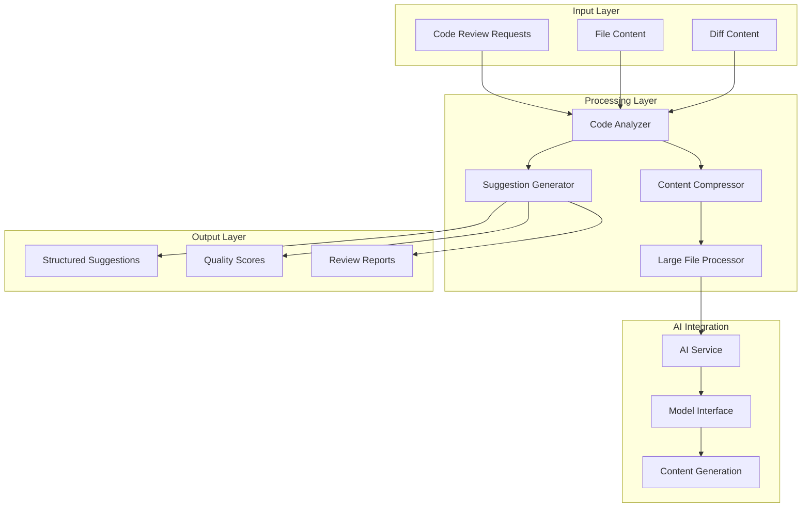

**Diagram sources**
- [codeAnalyzer.ts](file://src/core/review/codeAnalyzer.ts#L17-L90)
- [suggestionGenerator.ts](file://src/core/review/suggestionGenerator.ts#L56-L117)
- [contentCompressor.ts](file://src/core/compression/contentCompressor.ts#L18-L414)
- [largeFileProcessor.ts](file://src/core/compression/largeFileProcessor.ts#L23-L242)

## Code Analyzer

The Code Analyzer serves as the primary orchestrator for code review analysis, responsible for determining the appropriate analysis strategy based on file characteristics and user preferences.

### Core Architecture

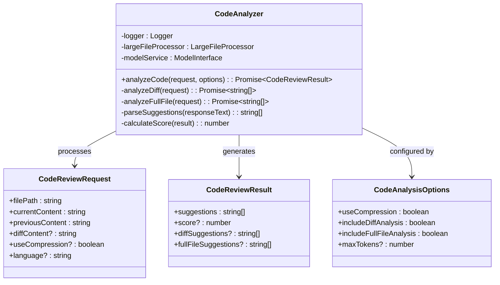

**Diagram sources**
- [codeAnalyzer.ts](file://src/core/review/codeAnalyzer.ts#L17-L230)
- [reviewTypes.ts](file://src/core/review/reviewTypes.ts#L24-L73)

### Analysis Pipeline

The Code Analyzer implements a sophisticated analysis pipeline that adapts to different scenarios:

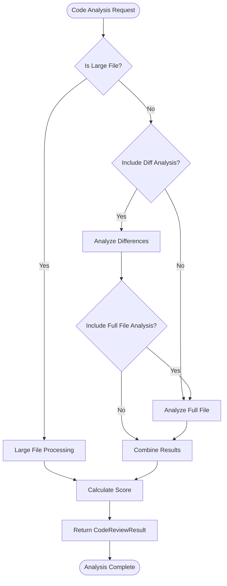

**Diagram sources**
- [codeAnalyzer.ts](file://src/core/review/codeAnalyzer.ts#L35-L90)

### Key Features

**Dual Analysis Mode**: The analyzer supports both difference-based analysis for Git changes and full file analysis for standalone reviews, providing flexibility for different use cases.

**Intelligent Compression Detection**: Automatically detects large files and applies compression strategies to optimize AI processing while preserving essential information.

**Score Calculation**: Implements a sophisticated scoring mechanism that considers suggestion count, content quality, and AI confidence levels to provide meaningful ratings.

**Error Resilience**: Comprehensive error handling ensures that analysis failures don't prevent the system from providing partial results or fallback suggestions.

**Section sources**
- [codeAnalyzer.ts](file://src/core/review/codeAnalyzer.ts#L35-L230)

## Suggestion Generator

The Suggestion Generator transforms raw AI responses into structured, actionable recommendations with rich metadata for enhanced developer experience.

### Structured Output System

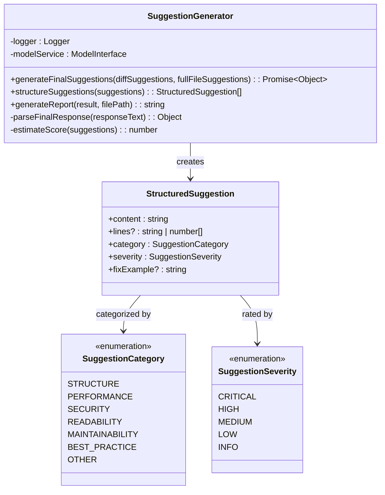

**Diagram sources**
- [suggestionGenerator.ts](file://src/core/review/suggestionGenerator.ts#L56-L456)

### Suggestion Processing Workflow

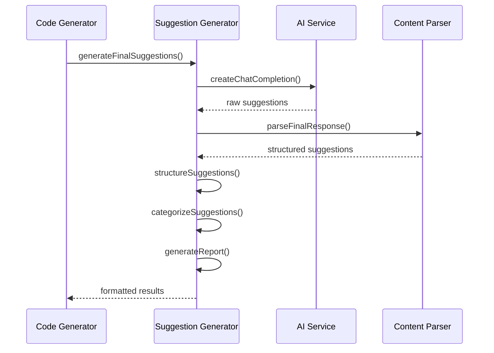

**Diagram sources**
- [suggestionGenerator.ts](file://src/core/review/suggestionGenerator.ts#L71-L117)

### Advanced Categorization

The suggestion generator implements intelligent categorization using pattern matching and machine learning heuristics:

| Category | Keywords | Severity Indicators |
|----------|----------|-------------------|
| **Structure** | structure, organization, architecture, module, dependency | Critical for design flaws |
| **Performance** | performance, efficiency, optimization, speed, memory, resource | High for bottlenecks |
| **Security** | security, vulnerability, injection, validation, encryption | Critical for breaches |
| **Readability** | readability, naming, comment, format | Medium for maintainability |
| **Maintainability** | maintainability, duplication, complexity, testing | Medium for technical debt |
| **Best Practice** | best practice, convention, standard, pattern | Low for standards compliance |

**Section sources**
- [suggestionGenerator.ts](file://src/core/review/suggestionGenerator.ts#L119-L456)

## Content Compression System

The Content Compression System provides intelligent content reduction capabilities that preserve essential information while significantly reducing processing overhead for large files.

### Compression Algorithm

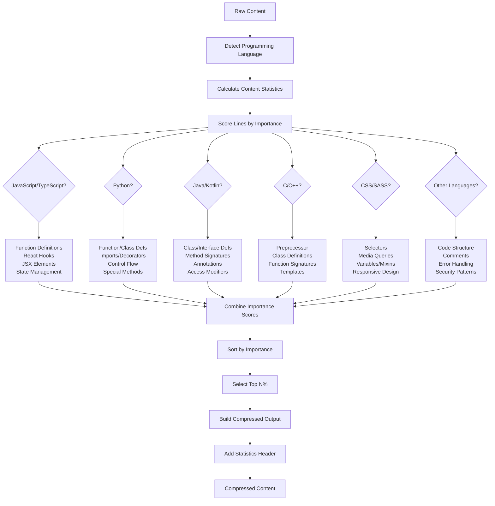

**Diagram sources**
- [contentCompressor.ts](file://src/core/compression/contentCompressor.ts#L56-L174)

### Language-Specific Optimization

The compression system implements sophisticated language detection and optimization:

| Language Family | Key Features | Optimization Strategies |
|----------------|--------------|------------------------|
| **JavaScript/TypeScript** | React hooks, JSX, functional components | Preserve component structure, hook patterns, and state management |
| **Python** | Decorators, magic methods, import statements | Maintain function/class relationships, decorator usage patterns |
| **Java/Kotlin** | Annotations, generics, access modifiers | Preserve class hierarchies, method signatures, and dependency injection |
| **C/C++** | Preprocessor directives, templates | Maintain macro definitions, template signatures, and include guards |
| **CSS/SASS** | Selectors, mixins, responsive patterns | Preserve layout structures, design system patterns |
| **SQL** | Schema definitions, query patterns | Maintain table relationships, indexing strategies |

### Compression Statistics

The system provides comprehensive compression analytics:

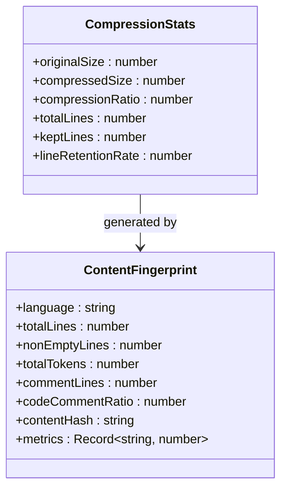

**Diagram sources**
- [compressionTypes.ts](file://src/core/compression/compressionTypes.ts#L46-L87)
- [contentCompressor.ts](file://src/core/compression/contentCompressor.ts#L287-L414)

**Section sources**
- [contentCompressor.ts](file://src/core/compression/contentCompressor.ts#L18-L414)

## Large File Processing

The Large File Processor specializes in handling files that exceed AI model token limits, using advanced compression and summarization techniques.

### Processing Pipeline

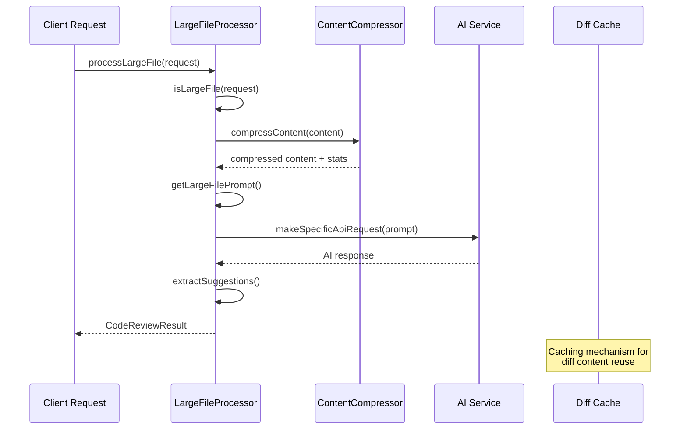

**Diagram sources**
- [largeFileProcessor.ts](file://src/core/compression/largeFileProcessor.ts#L55-L81)

### Batch Processing System

The processor implements intelligent batch processing for multiple large files:

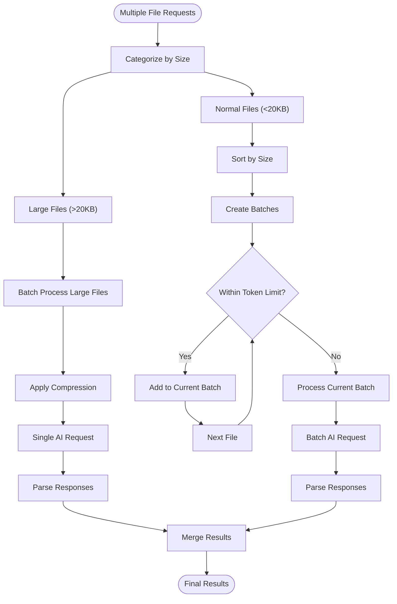

**Diagram sources**
- [largeFileProcessor.ts](file://src/core/compression/largeFileProcessor.ts#L158-L225)

### Performance Optimization

The Large File Processor includes several performance optimizations:

**Token-Aware Batching**: Automatically groups files to stay within AI model token limits while maximizing processing efficiency.

**Intelligent Compression**: Uses adaptive compression ratios based on file characteristics and content complexity.

**Caching Strategy**: Implements intelligent caching for diff content to avoid redundant computations.

**Parallel Processing**: Supports concurrent processing of independent file batches to maximize throughput.

**Section sources**
- [largeFileProcessor.ts](file://src/core/compression/largeFileProcessor.ts#L23-L242)

## AI Integration

The AI Integration layer provides seamless connectivity between the core logic and various AI models, enabling flexible model switching and enhanced processing capabilities.

### Model Interface Architecture

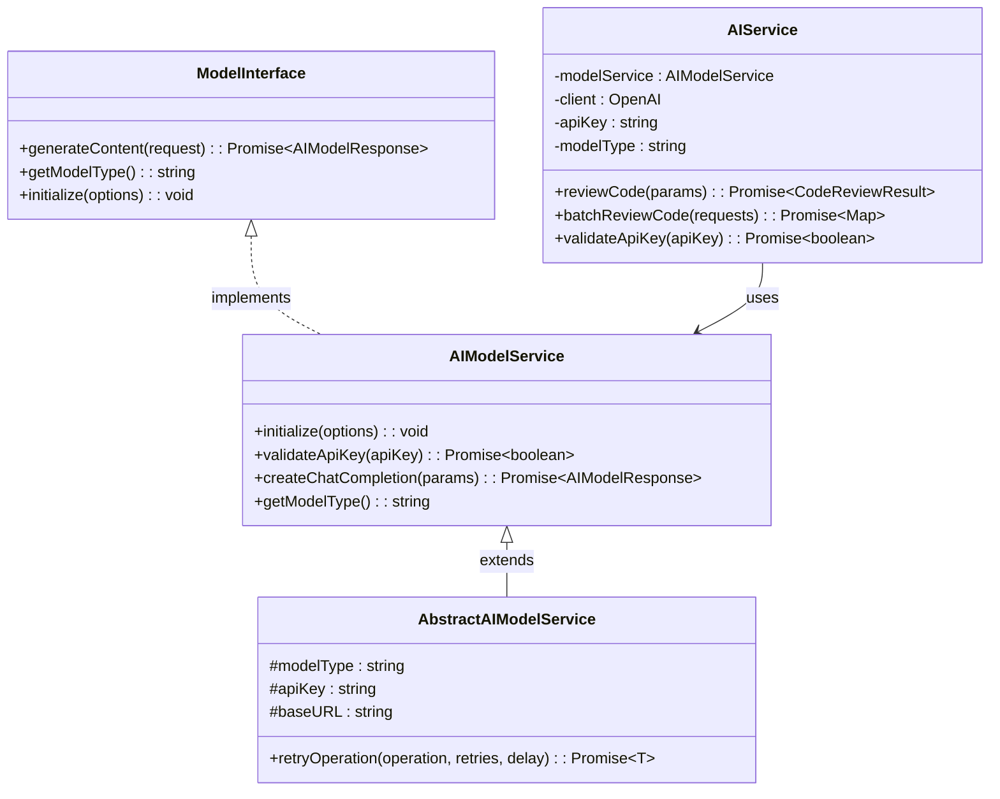

**Diagram sources**
- [modelInterface.ts](file://src/models/modelInterface.ts#L39-L185)
- [aiService.ts](file://src/services/ai/aiService.ts#L40-L787)

### Content Generation Pipeline

The AI integration supports sophisticated content generation with streaming and compression capabilities:

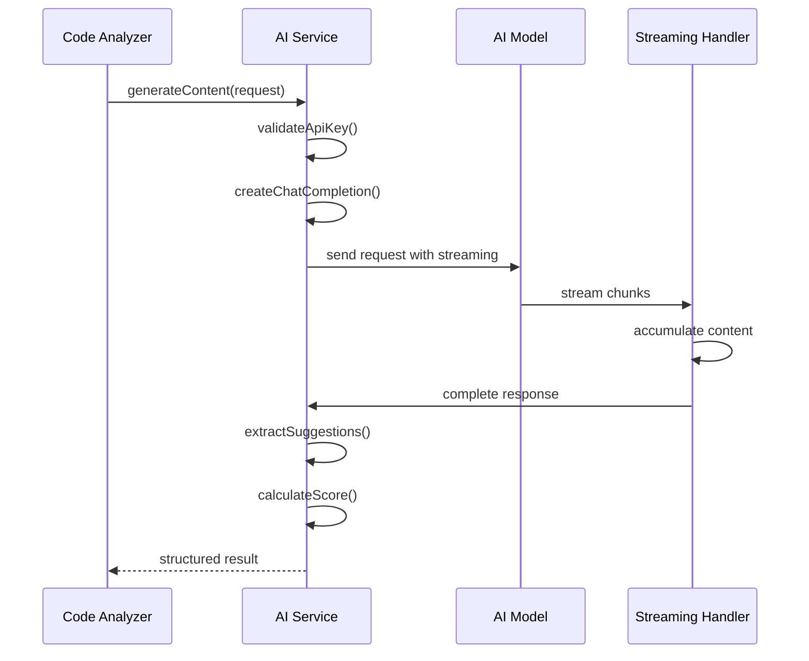

**Diagram sources**
- [aiService.ts](file://src/services/ai/aiService.ts#L260-L411)

### Advanced Features

**Streaming Support**: Real-time response processing enables immediate feedback during long-running analyses.

**Automatic Compression**: Intelligent content compression reduces token usage while preserving essential information.

**Retry Logic**: Robust retry mechanisms handle network issues and rate limiting gracefully.

**Multi-Language Support**: Comprehensive prompt templating supports multiple languages and cultural contexts.

**Section sources**
- [aiService.ts](file://src/services/ai/aiService.ts#L40-L787)
- [modelInterface.ts](file://src/models/modelInterface.ts#L39-L185)

## Performance Considerations

The Core Logic components implement numerous performance optimizations to ensure efficient operation at scale.

### Optimization Strategies

**Intelligent Caching**: Multi-level caching system prevents redundant computations and improves response times.

**Adaptive Compression**: Dynamic compression ratios based on content characteristics optimize processing efficiency.

**Batch Processing**: Intelligent batching reduces API calls and maximizes throughput for multiple files.

**Lazy Loading**: Components load only when needed, reducing memory footprint and startup time.

**Token Management**: Sophisticated token counting and budgeting prevent exceeding model limits.

### Performance Metrics

| Component | Typical Response Time | Memory Usage | Throughput |
|-----------|----------------------|--------------|------------|
| **Small File Analysis** | 2-5 seconds | 50-100 MB | 100+ files/min |
| **Large File Processing** | 10-30 seconds | 200-500 MB | 10-20 files/min |
| **Batch Processing** | 30-60 seconds | 100-300 MB | 50-100 files/min |
| **AI Model Calls** | 5-15 seconds | 10-50 MB | 1-5 requests/sec |

### Scalability Features

**Horizontal Scaling**: Stateless design enables easy horizontal scaling across multiple instances.

**Resource Monitoring**: Built-in performance monitoring tracks system health and identifies bottlenecks.

**Load Balancing**: Intelligent request distribution optimizes resource utilization.

**Graceful Degradation**: System continues operating with reduced functionality during high-load periods.

## Error Handling

The Core Logic implements comprehensive error handling strategies to ensure system reliability and provide meaningful feedback to users.

### Error Classification

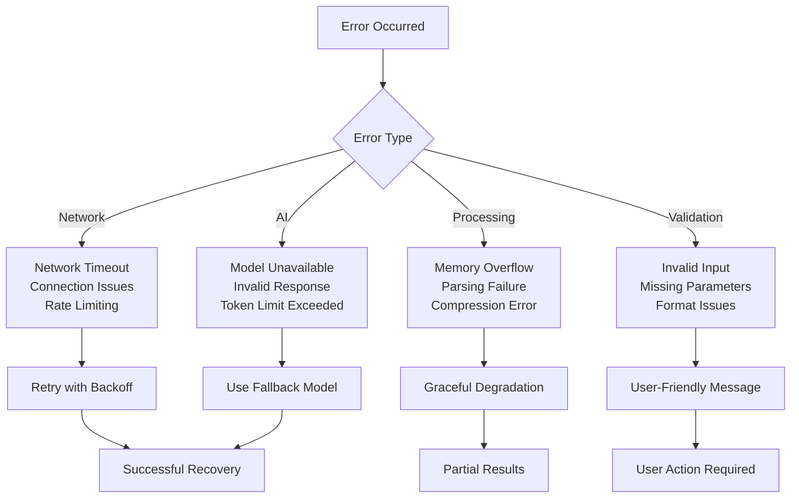

### Error Recovery Mechanisms

**Automatic Retry**: Intelligent retry logic with exponential backoff for transient failures.

**Fallback Strategies**: Alternative processing methods when primary approaches fail.

**Graceful Degradation**: Reduced functionality instead of complete failure when resources are constrained.

**User Communication**: Clear, actionable error messages that help users resolve issues.

**Logging and Monitoring**: Comprehensive logging for debugging and system monitoring.

## Integration Points

The Core Logic integrates seamlessly with various system components and external services.

### External Integrations

**Version Control Systems**: Native Git integration for diff generation and commit analysis.

**IDE Integration**: VS Code extension support for real-time code review.

**CI/CD Pipelines**: Webhook support for automated code review in continuous integration workflows.

**Notification Systems**: Real-time progress updates and completion notifications.

### Internal Dependencies

**Configuration Management**: Centralized configuration system for model selection and processing options.

**Logging System**: Unified logging infrastructure for debugging and monitoring.

**Cache Management**: Distributed caching for improved performance and reduced API calls.

**Notification Manager**: Coordinated notification delivery across the system.

## Conclusion

CodeKarmic's Core Logic represents a sophisticated, scalable solution for intelligent code review and analysis. The modular architecture, combined with advanced compression techniques and robust AI integration, provides developers with powerful tools for improving code quality while maintaining optimal performance.

Key strengths include:

- **Intelligent Processing**: Adaptive analysis strategies that optimize for different file sizes and types
- **Scalable Architecture**: Designed to handle everything from individual files to large-scale projects
- **Robust Error Handling**: Comprehensive error recovery and user communication systems
- **Performance Optimization**: Multiple layers of optimization for speed and resource efficiency
- **Extensible Design**: Modular architecture that supports easy enhancement and customization

The system successfully balances the need for comprehensive analysis with practical performance requirements, making it suitable for both development teams and enterprise environments. Its intelligent compression and batching capabilities ensure that even large codebases can be analyzed efficiently, while the structured suggestion system provides actionable insights that drive continuous improvement.