# Suggestion Generation

<cite>
**Referenced Files in This Document**
- [suggestionGenerator.ts](file://src/core/review/suggestionGenerator.ts)
- [reviewTypes.ts](file://src/core/review/reviewTypes.ts)
- [aiService.ts](file://src/services/ai/aiService.ts)
- [modelInterface.ts](file://src/models/modelInterface.ts)
- [prompts.ts](file://src/i18n/en/prompts.ts)
- [logger.ts](file://src/utils/logger.ts)
</cite>

## Table of Contents
1. [Introduction](#introduction)
2. [Module Architecture](#module-architecture)
3. [Core Components](#core-components)
4. [Generate Final Suggestions Method](#generate-final-suggestions-method)
5. [Parse Final Response Method](#parse-final-response-method)
6. [Structure Suggestions Method](#structure-suggestions-method)
7. [Error Handling and Fallback Mechanisms](#error-handling-and-fallback-mechanisms)
8. [Performance Considerations](#performance-considerations)
9. [Integration with AI Services](#integration-with-ai-services)
10. [Usage Examples](#usage-examples)
11. [Best Practices](#best-practices)

## Introduction

The SuggestionGenerator module serves as the central orchestrator for consolidating and refining code review suggestions from multiple analysis sources. It transforms raw text suggestions from both diff-based and full-file analyses into structured, categorized, and scored recommendations that provide actionable insights for developers.

The module implements intelligent decision-making logic to determine when to merge suggestions directly versus when to leverage AI summarization capabilities. It also provides sophisticated parsing mechanisms for extracting structured data from AI-generated responses and performs comprehensive categorization and severity assessment of code issues.

## Module Architecture

The SuggestionGenerator follows a modular architecture with clear separation of concerns:


**Diagram sources**
- [suggestionGenerator.ts](file://src/core/review/suggestionGenerator.ts#L52-L456)
- [modelInterface.ts](file://src/models/modelInterface.ts#L166-L185)
- [logger.ts](file://src/utils/logger.ts#L18-L88)

**Section sources**
- [suggestionGenerator.ts](file://src/core/review/suggestionGenerator.ts#L52-L456)

## Core Components

### Suggestion Categories

The module defines seven distinct categories for organizing code suggestions:

| Category | Purpose | Examples |
|----------|---------|----------|
| **STRUCTURE** | Code organization and architectural concerns | File structure, module division, dependency management |
| **PERFORMANCE** | Efficiency and resource optimization | Algorithm optimization, memory usage, concurrency |
| **SECURITY** | Security vulnerabilities and best practices | Input validation, access control, injection prevention |
| **READABILITY** | Code clarity and maintainability | Naming conventions, commenting, formatting |
| **MAINTAINABILITY** | Long-term code health | Duplication removal, complexity reduction, testing |
| **BEST_PRACTICE** | Industry standards and conventions | Design patterns, coding standards, architectural guidelines |
| **OTHER** | Miscellaneous suggestions | General improvements, edge cases |

### Suggestion Severity Levels

The severity system provides graduated importance assessment:

| Severity | Icon | Description | Use Case |
|----------|------|-------------|----------|
| **CRITICAL** | 🔴 | Severe issues requiring immediate attention | Security vulnerabilities, critical bugs |
| **HIGH** | 🟠 | Important issues that should be addressed soon | Major performance problems, significant bugs |
| **MEDIUM** | 🟡 | Moderate issues worth considering | Good practice improvements, minor inefficiencies |
| **LOW** | 🟢 | Minor suggestions for enhancement | Style improvements, small optimizations |
| **INFO** | 🔵 | Informational notes and suggestions | Best practice reminders, educational content |

**Section sources**
- [suggestionGenerator.ts](file://src/core/review/suggestionGenerator.ts#L12-L51)

## Generate Final Suggestions Method

The `generateFinalSuggestions` method serves as the primary entry point for consolidating suggestions from multiple analysis sources. It implements intelligent decision logic to optimize processing based on suggestion volume.

### Decision Logic Flow

```mermaid
flowchart TD
Start([Method Entry]) --> CheckVolume["Check Total Suggestion Count<br/>(diff + full file)"]
CheckVolume --> VolumeCheck{"Count ≤ 5?"}
VolumeCheck --> |Yes| DirectMerge["Direct Merging<br/>- Combine arrays<br/>- Remove duplicates<br/>- Estimate score"]
VolumeCheck --> |No| CreatePrompt["Create AI Prompt<br/>- Format suggestions<br/>- Generate template"]
CreatePrompt --> CallAI["Call AI Model Service<br/>- Set parameters<br/>- Execute request"]
CallAI --> ParseResponse["Parse AI Response<br/>- Extract suggestions<br/>- Determine score"]
DirectMerge --> ReturnResult["Return Results<br/>- Suggestions array<br/>- Calculated score"]
ParseResponse --> ReturnResult
CallAI --> ErrorCheck{"AI Call Successful?"}
ErrorCheck --> |No| FallbackLogic["Fallback Logic<br/>- Log error<br/>- Return original suggestions<br/>- Estimate score"]
FallbackLogic --> ReturnResult
ReturnResult --> End([Method Exit])
```



**Diagram sources**
- [suggestionGenerator.ts](file://src/core/review/suggestionGenerator.ts#L66-L117)

### Key Features

1. **Volume-Based Optimization**: When fewer than 6 suggestions exist, the method bypasses AI processing entirely, reducing computational overhead and API costs.

2. **Intelligent Merging**: Uses JavaScript's `Set` to eliminate duplicate suggestions while preserving the original order and quality.

3. **Score Estimation**: Implements a sophisticated scoring algorithm that correlates suggestion count with code quality assessment.

4. **AI Integration**: Leverages the configured AI model service for complex consolidation when volumes warrant it.

5. **Fallback Safety**: Provides robust error handling that ensures meaningful results even when AI processing fails.

**Section sources**
- [suggestionGenerator.ts](file://src/core/review/suggestionGenerator.ts#L66-L117)

## Parse Final Response Method

The `parseFinalResponse` method implements sophisticated pattern matching to extract structured data from AI-generated responses. It handles the complex formatting conventions established by the AI system prompts.

### Pattern Matching Strategy


**Diagram sources**
- [suggestionGenerator.ts](file://src/core/review/suggestionGenerator.ts#L120-L151)

### Parsing Rules

The method applies strict parsing rules to ensure reliable extraction:

1. **Suggestions Extraction**: Matches the `---OVERALL SUGGESTIONS---` section and extracts lines starting with bullets (`-`, `•`) or numbered lists (`1.`, `2.`).

2. **Score Extraction**: Looks for the `---SCORE---` section containing a numeric value between 1-10.

3. **Default Handling**: Falls back to estimation algorithms when AI responses lack proper formatting.

4. **Validation**: Ensures extracted scores fall within acceptable ranges, applying sensible defaults for malformed data.

**Section sources**
- [suggestionGenerator.ts](file://src/core/review/suggestionGenerator.ts#L120-L151)

## Structure Suggestions Method

The `structureSuggestions` method transforms raw text suggestions into structured objects with comprehensive metadata. This process involves sophisticated pattern recognition and intelligent categorization.

### Line Number Extraction


**Diagram sources**
- [suggestionGenerator.ts](file://src/core/review/suggestionGenerator.ts#L179-L248)

### Keyword-Based Classification

The method employs regex-based keyword matching for automatic categorization:

#### Category Detection Keywords
- **Structure**: `结构|组织|架构|模块|分层|依赖|structure|organization|architecture`
- **Performance**: `性能|效率|优化|速度|内存|资源|performance|efficiency|optimization`
- **Security**: `安全|漏洞|注入|验证|加密|security|vulnerability|injection|validation`
- **Readability**: `可读性|命名|注释|格式|readability|naming|comment|format`
- **Maintainability**: `可维护性|重复|复杂度|测试|maintainability|duplication|complexity|testing`
- **Best Practice**: `最佳实践|约定|标准|模式|best practice|convention|standard|pattern`

#### Severity Detection Keywords
- **Critical**: `严重|critical|crash|崩溃|安全漏洞|security vulnerability`
- **High**: `高|重要|high|important|major`
- **Low**: `低|minor|低优先级|low priority`
- **Info**: `信息|提示|info|hint|suggestion`

**Section sources**
- [suggestionGenerator.ts](file://src/core/review/suggestionGenerator.ts#L179-L248)

## Error Handling and Fallback Mechanisms

The SuggestionGenerator implements comprehensive error handling with multiple fallback layers to ensure system reliability and graceful degradation.

### Multi-Level Error Handling


**Diagram sources**
- [suggestionGenerator.ts](file://src/core/review/suggestionGenerator.ts#L75-L117)

### Fallback Strategies

1. **Immediate Fallback**: When AI processing fails, the method immediately falls back to merging the original suggestion sets without loss of data.

2. **Score Estimation**: Uses the `estimateScore` method to calculate a reasonable score based on the number of suggestions when AI-derived scores are unavailable.

3. **Logging Integration**: Comprehensive logging captures all error details for debugging and monitoring purposes.

4. **Graceful Degradation**: The system continues to provide valuable suggestions even when AI services are temporarily unavailable.

**Section sources**
- [suggestionGenerator.ts](file://src/core/review/suggestionGenerator.ts#L108-L117)

## Performance Considerations

The SuggestionGenerator is designed with performance optimization in mind, implementing several strategies to minimize computational overhead and API costs.

### Optimization Strategies

| Strategy | Implementation | Benefit |
|----------|----------------|---------|
| **Volume Threshold** | Process fewer than 6 suggestions directly | Eliminates unnecessary AI calls |
| **Set-based Deduplication** | Use JavaScript Set for duplicate removal | O(n) complexity instead of O(n²) |
| **Regex Compilation** | Pre-compile frequently used patterns | Reduces parsing overhead |
| **Early Termination** | Stop processing when conditions met | Minimizes computation time |
| **Memory Management** | Efficient string manipulation | Reduces garbage collection pressure |

### Performance Metrics

- **Small Volumes (< 6 suggestions)**: Direct processing with minimal overhead
- **Medium Volumes (6-20 suggestions)**: AI processing with optimized prompts
- **Large Volumes (> 20 suggestions)**: AI processing with comprehensive analysis

### Scalability Features

1. **Batch Processing**: Supports processing multiple suggestion sets efficiently
2. **Caching**: Integrates with AI service caching mechanisms
3. **Streaming**: Compatible with streaming AI responses for large datasets
4. **Resource Monitoring**: Built-in logging for performance tracking

**Section sources**
- [suggestionGenerator.ts](file://src/core/review/suggestionGenerator.ts#L78-L117)

## Integration with AI Services

The SuggestionGenerator seamlessly integrates with various AI model services through a unified interface, providing flexibility and extensibility.

### AI Service Interface


**Diagram sources**
- [modelInterface.ts](file://src/models/modelInterface.ts#L166-L185)

### Configuration Options

The AI integration supports configurable parameters:

- **Max Tokens**: Limits response length (default: 2000)
- **Temperature**: Controls creativity vs. consistency (default: 0.3)
- **Model Selection**: Supports multiple AI providers
- **Streaming**: Enables real-time response processing

**Section sources**
- [suggestionGenerator.ts](file://src/core/review/suggestionGenerator.ts#L93-L100)
- [modelInterface.ts](file://src/models/modelInterface.ts#L142-L161)

## Usage Examples

### Basic Suggestion Consolidation

```typescript
// Example usage pattern
const suggestionGenerator = new SuggestionGenerator(aiModelService);

const diffSuggestions = [
  '[123] Consider using async/await instead of callbacks',
  '[124-125] Variable naming could be more descriptive'
];

const fullFileSuggestions = [
  'Refactor the authentication logic into separate service',
  'Add comprehensive error handling for network requests'
];

const result = await suggestionGenerator.generateFinalSuggestions(
  diffSuggestions, 
  fullFileSuggestions
);

console.log(`Final suggestions: ${result.suggestions.length}`);
console.log(`Overall score: ${result.score}`);
```

### Structured Suggestion Processing

```typescript
// Transform raw suggestions into structured format
const rawSuggestions = [
  '[1-5] Refactor function into smaller, focused methods',
  'Consider adding unit tests for this module',
  '[10] Security vulnerability: SQL injection risk'
];

const structured = suggestionGenerator.structureSuggestions(rawSuggestions);

structured.forEach(suggestion => {
  console.log(`Category: ${suggestion.category}`);
  console.log(`Severity: ${suggestion.severity}`);
  console.log(`Lines: ${suggestion.lines}`);
  console.log(`Content: ${suggestion.content}`);
});
```

### Report Generation

```typescript
// Generate comprehensive code review report
const reviewResult = {
  suggestions: ['Fix the null pointer exception', 'Optimize database queries'],
  score: 7
};

const report = suggestionGenerator.generateReport(reviewResult, 'src/main.ts');
console.log(report);
```

## Best Practices

### Implementation Guidelines

1. **Volume Management**: Monitor suggestion counts to optimize AI usage
2. **Error Handling**: Always implement proper error catching around AI calls
3. **Logging**: Use the integrated logging system for debugging and monitoring
4. **Testing**: Test with various suggestion volumes and formats
5. **Performance**: Profile under realistic load conditions

### Optimization Tips

1. **Pre-filter Suggestions**: Remove obviously redundant suggestions before processing
2. **Batch Operations**: Process multiple files together when possible
3. **Cache Results**: Store processed suggestions for repeated analysis
4. **Monitor Costs**: Track AI API usage and optimize prompts
5. **Fallback Testing**: Regularly test fallback mechanisms

### Quality Assurance

1. **Validation**: Verify structured suggestions meet expected formats
2. **Consistency**: Ensure category and severity assignments are consistent
3. **Completeness**: Check that all suggestions receive proper metadata
4. **Accuracy**: Validate AI response parsing logic with test cases
5. **Performance**: Monitor processing times under various conditions

**Section sources**
- [suggestionGenerator.ts](file://src/core/review/suggestionGenerator.ts#L1-L456)