# Models Module

<cite>
**Referenced Files in This Document**
- [modelFactory.ts](file://src/models/modelFactory.ts)
- [modelInterface.ts](file://src/models/modelInterface.ts)
- [deepseek.ts](file://src/models/providers/deepseek.ts)
- [modelValidator.ts](file://src/models/modelValidator.ts)
- [baseModel.ts](file://src/models/baseModel.ts)
- [baseModelAdapter.ts](file://src/models/baseModelAdapter.ts)
- [types.ts](file://src/models/types.ts)
- [chatTypes.ts](file://src/models/chatTypes.ts)
- [appConfig.ts](file://src/config/appConfig.ts)
- [aiService.ts](file://src/services/ai/aiService.ts)
- [output.ts](file://src/i18n/en/output.ts)
</cite>

## Table of Contents
1. [Introduction](#introduction)
2. [Architecture Overview](#architecture-overview)
3. [Factory Pattern Implementation](#factory-pattern-implementation)
4. [Model Interface Contract](#model-interface-contract)
5. [DeepSeek Provider Implementation](#deepseek-provider-implementation)
6. [Model Validation System](#model-validation-system)
7. [Configuration Management](#configuration-management)
8. [Error Handling and Recovery](#error-handling-and-recovery)
9. [Adding New Model Providers](#adding-new-model-providers)
10. [Best Practices and Usage Examples](#best-practices-and-usage-examples)

## Introduction

The CodeKarmic Models module implements a sophisticated pluggable AI model architecture using the factory pattern to manage different AI providers seamlessly. This modular design enables the system to support multiple AI model providers while maintaining a consistent interface and robust error handling mechanisms.

The architecture follows established design patterns including Factory, Adapter, and Singleton patterns to provide flexible, scalable, and maintainable AI model integration. The system supports caching, configuration management, validation, and comprehensive error handling to ensure reliable operation in production environments.

## Architecture Overview

The Models module is structured around several key components that work together to provide a unified interface for AI model interactions:


**Diagram sources**
- [modelFactory.ts](file://src/models/modelFactory.ts#L19-L140)
- [modelInterface.ts](file://src/models/modelInterface.ts#L39-L185)
- [deepseek.ts](file://src/models/providers/deepseek.ts#L11-L211)
- [modelValidator.ts](file://src/models/modelValidator.ts#L4-L14)

**Section sources**
- [modelFactory.ts](file://src/models/modelFactory.ts#L1-L140)
- [modelInterface.ts](file://src/models/modelInterface.ts#L1-L185)

## Factory Pattern Implementation

The AIModelFactoryImpl class implements the Factory pattern to create and manage AI model service instances. This singleton factory provides centralized control over model instantiation with intelligent caching and configuration management.

### Factory Architecture


**Diagram sources**
- [modelFactory.ts](file://src/models/modelFactory.ts#L19-L140)
- [modelInterface.ts](file://src/models/modelInterface.ts#L123-L139)

### Key Factory Features

The factory implementation provides several advanced features:

1. **Singleton Pattern**: Ensures only one factory instance exists
2. **Intelligent Caching**: Reuses model service instances based on configuration
3. **Configuration Management**: Supports dynamic configuration updates
4. **Error Handling**: Comprehensive validation and error reporting
5. **Model Type Support**: Maintains list of supported model types

### Factory Usage Patterns

The factory follows specific usage patterns for optimal performance:

```typescript
// Basic factory usage
const factory = AIModelFactoryImpl.getInstance();

// Factory with custom configuration
const factoryWithConfig = AIModelFactoryImpl.getInstance({
    enableLargeFileCompression: true,
    compressionThreshold: 10000
});

// Creating model services
const modelService = factory.createModelService();
```

**Section sources**
- [modelFactory.ts](file://src/models/modelFactory.ts#L36-L140)

## Model Interface Contract

The model interface defines a comprehensive contract that all AI model services must implement, ensuring consistency across different providers while allowing for provider-specific optimizations.

### Interface Design

```mermaid
classDiagram
class AIModelService {
<<interface>>
+initialize(options?) void
+validateApiKey(apiKey) Promise~boolean~
+createChatCompletion(params) Promise~AIModelResponse~
+getModelType() string
}
class AbstractAIModelService {
<<abstract>>
#modelType : string
#apiKey : string
#baseURL : string
+initialize(options?) void*
+validateApiKey(apiKey) Promise~boolean*~
+createChatCompletion(params) Promise~AIModelResponse*~
+getModelType() string
#retryOperation(operation, retries?, delay?) Promise~T~
}
class AIModelResponse {
+content : string
+text : string
+model : string
+usage? : ModelUsage
}
class AIModelRequestParams {
+messages : ChatMessage[]
+model? : string
+temperature? : number
+max_tokens? : number
+compressLargeContent? : boolean
+compressionThreshold? : number
+stream? : boolean
}
AbstractAIModelService ..|> AIModelService
AIModelService --> AIModelResponse : returns
AIModelService --> AIModelRequestParams : accepts
```



**Diagram sources**
- [modelInterface.ts](file://src/models/modelInterface.ts#L39-L117)

### Core Interface Methods

The interface defines essential methods for AI model interaction:

1. **Initialization**: Sets up the model service with configuration options
2. **API Key Validation**: Verifies authentication credentials
3. **Chat Completion**: Processes AI requests and returns responses
4. **Model Type Identification**: Returns the specific model identifier

### Response and Request Types

The interface uses standardized types for consistent data handling:

- **AIModelResponse**: Contains model output with usage statistics
- **AIModelRequestParams**: Standardized request parameters with compression options
- **ChatMessage**: Structured conversation messages

**Section sources**
- [modelInterface.ts](file://src/models/modelInterface.ts#L1-L185)

## DeepSeek Provider Implementation

The DeepSeek provider serves as the primary AI model implementation, leveraging the OpenAI-compatible API to deliver high-quality code analysis capabilities.

### DeepSeek Architecture


**Diagram sources**
- [deepseek.ts](file://src/models/providers/deepseek.ts#L11-L211)

### Advanced Features

The DeepSeek implementation includes several sophisticated features:

1. **Large File Compression**: Intelligent content compression for large files
2. **Automatic Retry Logic**: Built-in retry mechanism with exponential backoff
3. **Timeout Management**: Configurable timeouts for reliable operation
4. **Content Optimization**: Smart content processing for better performance

### Compression Algorithm

The provider implements an advanced compression algorithm for large files:


**Diagram sources**
- [deepseek.ts](file://src/models/providers/deepseek.ts#L154-L185)

**Section sources**
- [deepseek.ts](file://src/models/providers/deepseek.ts#L1-L211)

## Model Validation System

The ModelValidator provides comprehensive validation for model configurations, ensuring only supported models are used and preventing runtime errors from invalid configurations.

### Validation Architecture


**Diagram sources**
- [modelValidator.ts](file://src/models/modelValidator.ts#L4-L14)
- [types.ts](file://src/models/types.ts#L10-L13)

### Validation Process

The validation system performs several checks:

1. **Model Type Validation**: Ensures the requested model is supported
2. **Configuration Validation**: Validates model-specific configuration
3. **Error Reporting**: Provides detailed error messages for unsupported models

### Usage Example

```typescript
// Validate model type
const isValid = ModelValidator.validateModel(ModelType.DEEPSEEK_V3);

// Get error message for unsupported model
const errorMessage = ModelValidator.getErrorMessage(ModelType.OPENAI);
```

**Section sources**
- [modelValidator.ts](file://src/models/modelValidator.ts#L1-L15)

## Configuration Management

The system integrates with the AppConfig class to manage model configurations centrally, providing a unified approach to configuration management across the application.

### Configuration Architecture


**Diagram sources**
- [appConfig.ts](file://src/config/appConfig.ts#L49-L188)
- [modelFactory.ts](file://src/models/modelFactory.ts#L58-L70)

### Configuration Features

The configuration system provides:

1. **Centralized Management**: Single source for all model configurations
2. **Event-Driven Updates**: Automatic notifications for configuration changes
3. **Type Safety**: Strong typing for configuration keys and values
4. **Default Values**: Fallback values for missing configurations
5. **VS Code Integration**: Seamless integration with VS Code settings

### Configuration Access Patterns

```typescript
// Get configuration values
const config = AppConfig.getInstance();
const modelType = config.getModelType();
const baseURL = config.getBaseURL();
const apiKey = config.getApiKey();

// Set configuration values
await config.setModelType(ModelType.DEEPSEEK_V3);
await config.setBaseURL('https://api.deepseek.com/v1');
await config.setApiKey('your-api-key');
```

**Section sources**
- [appConfig.ts](file://src/config/appConfig.ts#L1-L189)

## Error Handling and Recovery

The system implements comprehensive error handling and recovery mechanisms to ensure robust operation under various failure conditions.

### Error Handling Architecture


**Diagram sources**
- [modelFactory.ts](file://src/models/modelFactory.ts#L110-L113)
- [deepseek.ts](file://src/models/providers/deepseek.ts#L143-L146)

### Error Categories

The system handles several categories of errors:

1. **Configuration Errors**: Missing or invalid configuration values
2. **Network Errors**: API connectivity and timeout issues
3. **Authentication Errors**: Invalid API keys and authentication failures
4. **Validation Errors**: Unsupported model types and parameter validation
5. **Runtime Errors**: Unexpected exceptions during model operations

### Retry Mechanisms

Both the factory and individual model services implement retry logic:


**Diagram sources**
- [modelInterface.ts](file://src/models/modelInterface.ts#L103-L116)
- [deepseek.ts](file://src/models/providers/deepseek.ts#L198-L210)

**Section sources**
- [modelFactory.ts](file://src/models/modelFactory.ts#L110-L113)
- [modelInterface.ts](file://src/models/modelInterface.ts#L103-L116)

## Adding New Model Providers

The modular architecture makes it straightforward to add new AI model providers while maintaining compatibility with the existing system.

### Implementation Steps

To add a new model provider:

1. **Extend AbstractAIModelService**: Create a new service class
2. **Implement Required Methods**: Override abstract methods
3. **Add to Factory**: Update factory switch statement
4. **Update Types**: Add model type to ModelType enumeration
5. **Add Validation**: Update ModelValidator if needed

### New Provider Template

```typescript
// Step 1: Create new provider class
export class NewModelService extends AbstractAIModelService {
    constructor(modelType: string, baseURL: string, apiKey: string) {
        super();
        this.modelType = modelType;
        this.baseURL = baseURL;
        this.apiKey = apiKey;
    }
    
    initialize(options?: Record<string, any>): void {
        // Implementation
    }
    
    async validateApiKey(apiKey: string): Promise<boolean> {
        // Implementation
    }
    
    async createChatCompletion(params: AIModelRequestParams): Promise<AIModelResponse> {
        // Implementation
    }
}

// Step 2: Update factory
switch (modelType.toLowerCase()) {
    case ModelType.NEW_MODEL:
        service = new NewModelService(modelType, baseURL, apiKey);
        break;
    // ... other cases
}

// Step 3: Add to types
export enum ModelType {
    // ... existing types
    NEW_MODEL = 'new-model'
}

// Step 4: Update validator if needed
export const ModelDisplayNames = {
    // ... existing mappings
    [ModelType.NEW_MODEL]: 'New Model'
};
```

### Integration Requirements

New providers must meet these requirements:

1. **Interface Compliance**: Implement all methods from AIModelService
2. **Error Handling**: Provide meaningful error messages
3. **Configuration Support**: Work with AppConfig for settings
4. **Testing**: Include comprehensive unit tests
5. **Documentation**: Document provider-specific features

**Section sources**
- [modelFactory.ts](file://src/models/modelFactory.ts#L85-L92)
- [types.ts](file://src/models/types.ts#L10-L13)

## Best Practices and Usage Examples

### Factory Usage Best Practices

```typescript
// 1. Use singleton pattern for factory
const factory = AIModelFactoryImpl.getInstance();

// 2. Configure factory appropriately
const factoryWithConfig = AIModelFactoryImpl.getInstance({
    enableLargeFileCompression: true,
    compressionThreshold: 10000
});

// 3. Cache model services when appropriate
const modelService = factory.createModelService();
```

### Model Service Usage

```typescript
// 1. Create model service
const factory = AIModelFactoryImpl.getInstance();
const modelService = factory.createModelService();

// 2. Validate API key before use
const isValid = await modelService.validateApiKey(apiKey);

// 3. Use with proper error handling
try {
    const response = await modelService.createChatCompletion({
        messages: [{ role: 'user', content: 'Hello' }],
        temperature: 0.1,
        max_tokens: 1000
    });
} catch (error) {
    console.error('Model service error:', error);
    // Handle error appropriately
}
```

### Configuration Management

```typescript
// 1. Get current configuration
const config = AppConfig.getInstance();
const modelType = config.getModelType();
const baseURL = config.getBaseURL();

// 2. Update configuration
await config.setModelType(ModelType.DEEPSEEK_V3);
await config.setBaseURL('https://api.deepseek.com/v1');

// 3. Listen for configuration changes
config.onChange(ConfigChangeEvent.MODEL_TYPE, () => {
    // Refresh model services
    factory.clearModelServices();
});
```

### Error Handling Patterns

```typescript
// 1. Factory-level error handling
try {
    const modelService = factory.createModelService();
} catch (error) {
    if (error.message.includes('UNSUPPORTED_MODEL_TYPE')) {
        // Handle unsupported model
    } else if (error.message.includes('NO_MODEL_TYPE')) {
        // Handle missing model type
    }
}

// 2. Service-level error handling
try {
    const response = await modelService.createChatCompletion(params);
} catch (error) {
    if (error.message.includes('API key validation failed')) {
        // Handle authentication error
    } else if (error.message.includes('timeout')) {
        // Handle timeout error
    }
}
```

### Performance Optimization

```typescript
// 1. Enable compression for large files
const factory = AIModelFactoryImpl.getInstance({
    enableLargeFileCompression: true,
    compressionThreshold: 50000 // Higher threshold for larger files
});

// 2. Cache model services
const cachedService = factory.createModelService(); // Reuses existing instance

// 3. Clear cache when needed
factory.clearModelServices(ModelType.DEEPSEEK_V3); // Clear specific model type
factory.clearModelServices(); // Clear all cached services
```

**Section sources**
- [modelFactory.ts](file://src/models/modelFactory.ts#L36-L140)
- [aiService.ts](file://src/services/ai/aiService.ts#L50-L70)