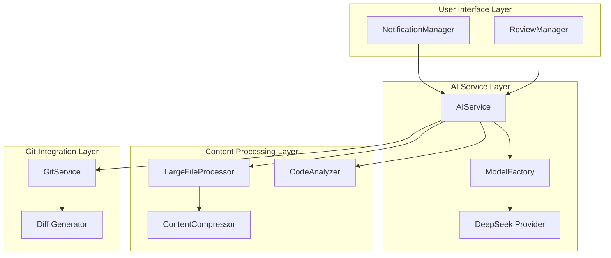
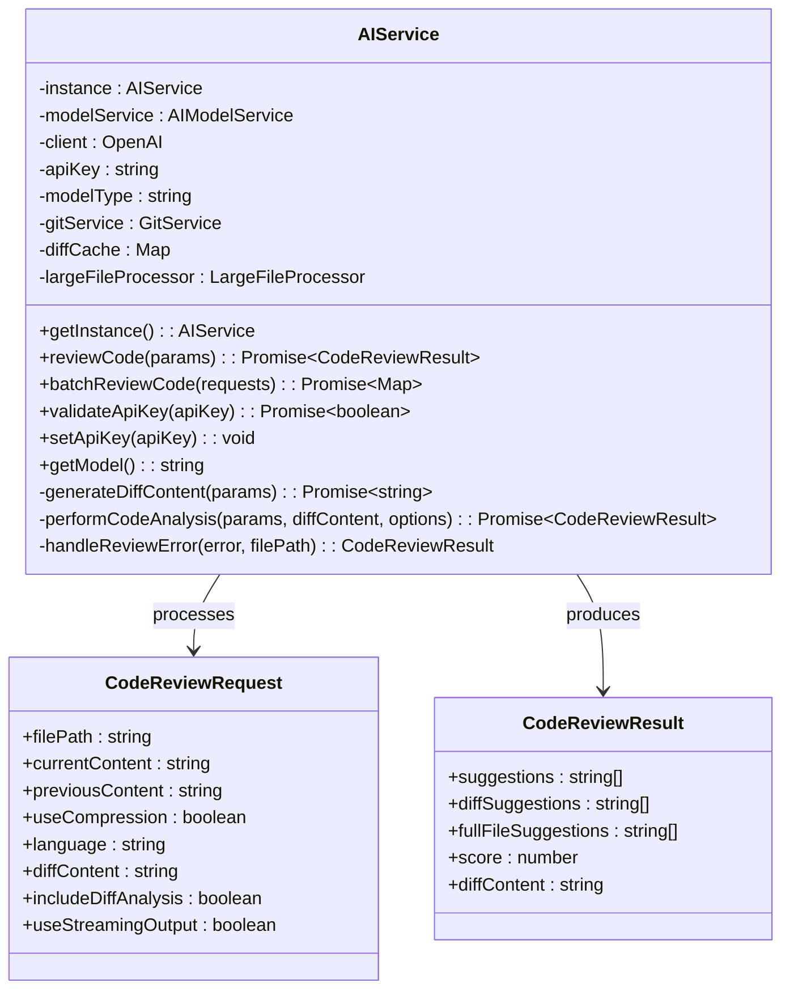
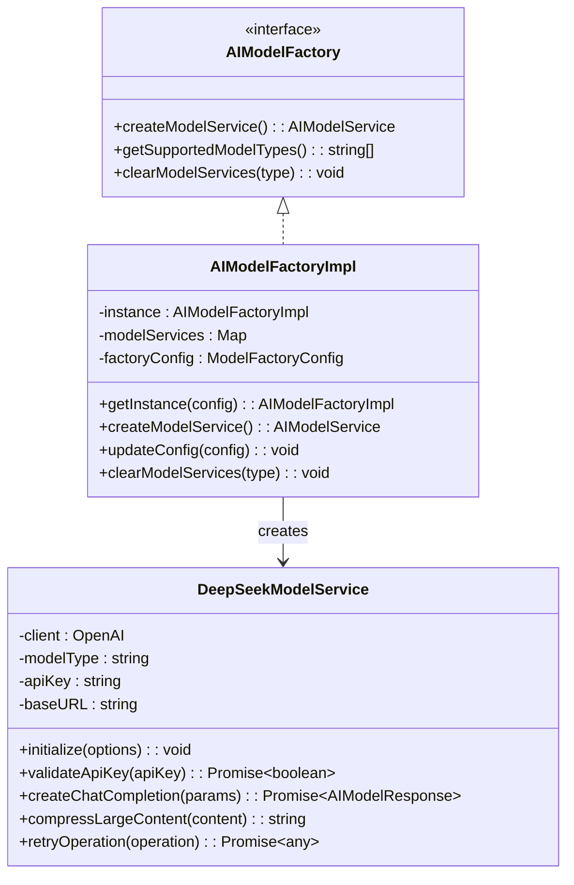
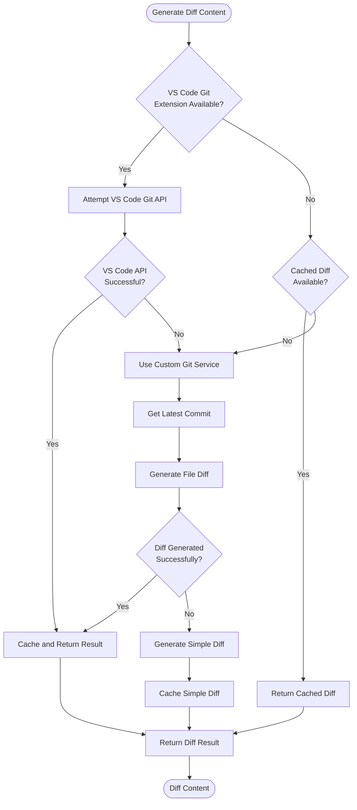
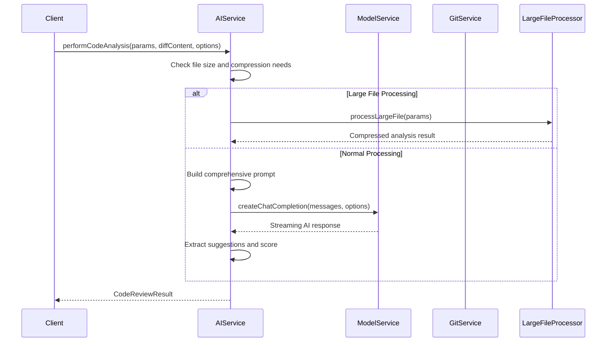
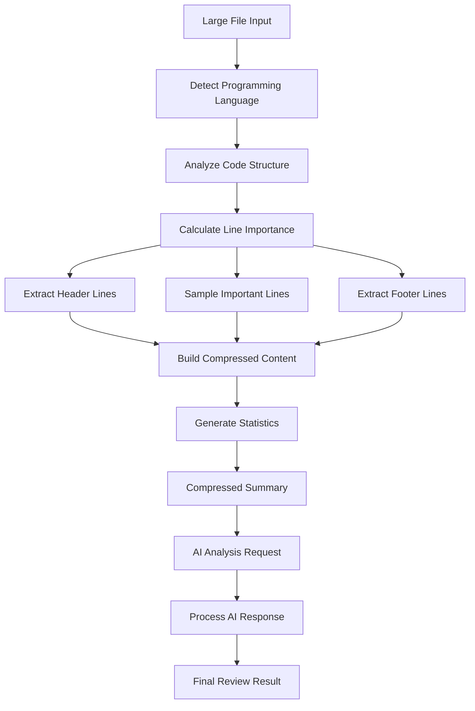
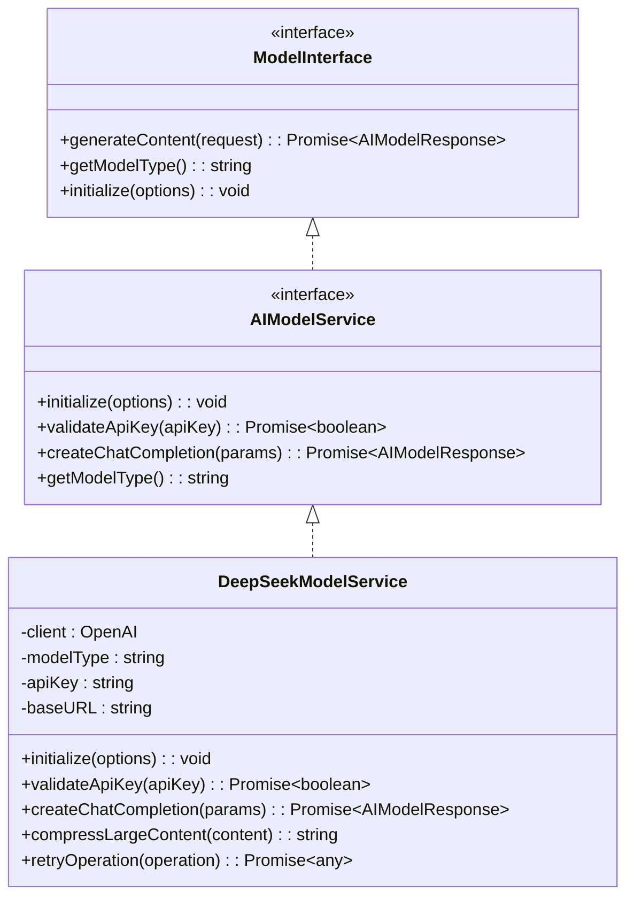
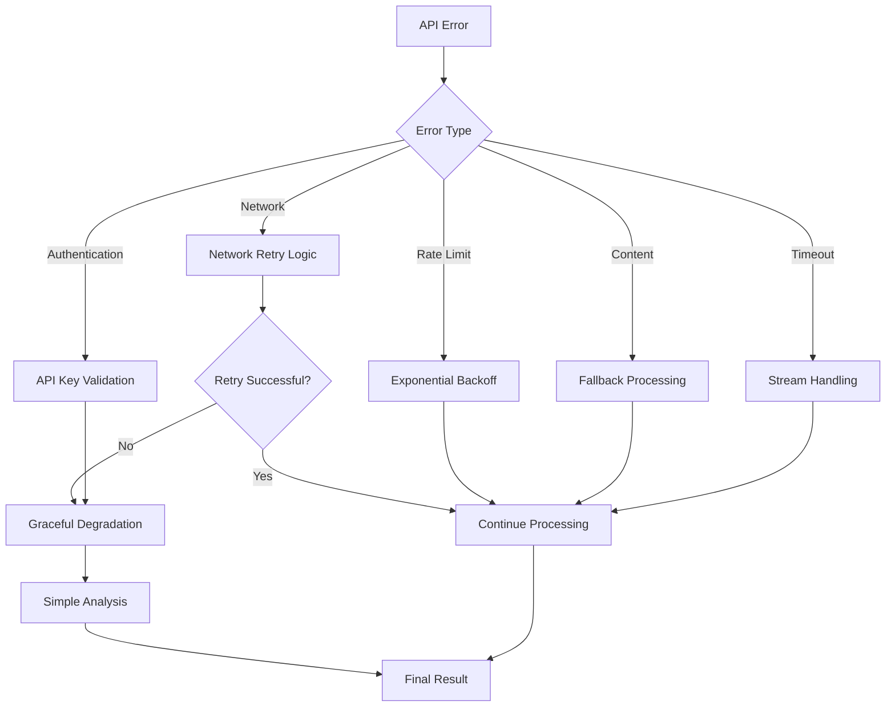

# AI Service

<cite>
**Referenced Files in This Document**
- [aiService.ts](file://src/services/ai/aiService.ts)
- [modelFactory.ts](file://src/models/modelFactory.ts)
- [deepseek.ts](file://src/models/providers/deepseek.ts)
- [largeFileProcessor.ts](file://src/core/compression/largeFileProcessor.ts)
- [codeAnalyzer.ts](file://src/core/review/codeAnalyzer.ts)
- [modelInterface.ts](file://src/models/modelInterface.ts)
- [contentCompressor.ts](file://src/core/compression/contentCompressor.ts)
- [reviewTypes.ts](file://src/core/review/reviewTypes.ts)
- [compressionTypes.ts](file://src/core/compression/compressionTypes.ts)
- [prompts.ts](file://src/i18n/en/prompts.ts)
- [fileUtils.ts](file://src/utils/fileUtils.ts)
</cite>

## Table of Contents
1. [Introduction](#introduction)
2. [System Architecture](#system-architecture)
3. [Core Components](#core-components)
4. [Diff Generation Strategy](#diff-generation-strategy)
5. [Code Analysis Pipeline](#code-analysis-pipeline)
6. [Batch Processing](#batch-processing)
7. [Large File Handling](#large-file-handling)
8. [AI Model Integration](#ai-model-integration)
9. [Performance Optimization](#performance-optimization)
10. [Error Handling and Resilience](#error-handling-and-resilience)
11. [Usage Examples](#usage-examples)
12. [Conclusion](#conclusion)

## Introduction

The AIService in CodeKarmic serves as the central orchestration component for AI-powered code analysis, leveraging the DeepSeek model to provide comprehensive code review capabilities. This sophisticated service implements a multi-layered approach to code analysis, incorporating advanced diff generation strategies, intelligent content compression, and optimized batch processing to handle both small and large files efficiently.

The service operates as a singleton pattern implementation, ensuring consistent AI model configuration and resource management across the application. It provides seamless integration with VS Code's Git API while maintaining fallback mechanisms for various scenarios, making it robust and reliable for production environments.

## System Architecture

The AIService follows a layered architecture that separates concerns between AI model abstraction, content processing, and user interface integration. The system is designed with modularity and extensibility in mind, allowing for easy adaptation to different AI providers and analysis strategies.



**Diagram sources**
- [aiService.ts](file://src/services/ai/aiService.ts#L40-L70)
- [modelFactory.ts](file://src/models/modelFactory.ts#L19-L44)
- [largeFileProcessor.ts](file://src/core/compression/largeFileProcessor.ts#L23-L42)

**Section sources**
- [aiService.ts](file://src/services/ai/aiService.ts#L40-L70)
- [modelFactory.ts](file://src/models/modelFactory.ts#L19-L44)

## Core Components

### AIService Singleton

The AIService implements a singleton pattern with lazy initialization, ensuring optimal resource utilization and consistent configuration across the application. The service maintains internal state for AI model configuration, Git integration, and caching mechanisms.



**Diagram sources**
- [aiService.ts](file://src/services/ai/aiService.ts#L15-L32)
- [aiService.ts](file://src/services/ai/aiService.ts#L40-L70)

### Model Factory Pattern

The ModelFactory implements the factory pattern to manage AI model instances, providing centralized configuration and caching of model services. This abstraction allows for easy switching between different AI providers while maintaining consistent interfaces.



**Diagram sources**
- [modelFactory.ts](file://src/models/modelFactory.ts#L19-L44)
- [deepseek.ts](file://src/models/providers/deepseek.ts#L11-L211)

**Section sources**
- [aiService.ts](file://src/services/ai/aiService.ts#L40-L70)
- [modelFactory.ts](file://src/models/modelFactory.ts#L19-L44)
- [deepseek.ts](file://src/models/providers/deepseek.ts#L11-L211)

## Diff Generation Strategy

The AIService implements a sophisticated three-tier diff generation strategy that prioritizes performance and reliability. The system intelligently selects the most appropriate method based on available resources and conditions.

### Priority Order Strategy

1. **VS Code Git Extension API** (Highest Priority)
   - Leverages VS Code's native Git integration
   - Provides fastest and most reliable results
   - Handles complex Git scenarios automatically

2. **Custom Git Service Implementation** (Fallback)
   - Uses the built-in GitService for scenarios without VS Code Git extension
   - Supports various Git operations and configurations
   - Maintains compatibility across different environments

3. **Simple Diff Algorithm** (Last Resort)
   - Generates basic unified diff format
   - Works with any file content regardless of Git status
   - Ensures minimal functionality in all scenarios



**Diagram sources**
- [aiService.ts](file://src/services/ai/aiService.ts#L125-L239)

### Advanced Caching Mechanism

The diff generation process incorporates intelligent caching to avoid redundant Git operations and improve performance. The caching strategy uses file path and content fingerprint combinations to ensure cache validity across file modifications.

**Section sources**
- [aiService.ts](file://src/services/ai/aiService.ts#L125-L239)

## Code Analysis Pipeline

The performCodeAnalysis method orchestrates a comprehensive code review process that combines full file analysis with differential analysis to provide contextually rich feedback. The pipeline implements streaming output support and sophisticated prompt engineering.

### Analysis Workflow



**Diagram sources**
- [aiService.ts](file://src/services/ai/aiService.ts#L260-L411)

### Prompt Engineering Strategy

The service employs sophisticated prompt engineering techniques to maximize AI analysis quality. The prompts combine full file context with differential information to provide comprehensive code review insights.

| Analysis Type | Prompt Strategy | Token Allocation | Quality Metrics |
|---------------|----------------|------------------|-----------------|
| Full File Analysis | Complete file content + structural assessment | 3000 tokens | Architecture, patterns, organization |
| Differential Analysis | Change highlights + impact assessment | 2000 tokens | Changes, regressions, improvements |
| Combined Analysis | Integrated context + comparative evaluation | 4000 tokens | Comprehensive coverage, balanced insights |
| Large File Analysis | Compressed summary + high-level patterns | 8192 tokens | Efficiency, scalability, key insights |

**Section sources**
- [aiService.ts](file://src/services/ai/aiService.ts#L260-L411)
- [prompts.ts](file://src/i18n/en/prompts.ts#L10-L108)

## Batch Processing

The batchReviewCode functionality enables efficient processing of multiple files by intelligently grouping them based on size and content characteristics. This optimization significantly improves throughput for bulk code review operations.

### Batch Optimization Strategy

```mermaid
flowchart TD
Start([Batch Review Request]) --> Categorize[Group Files by Size]
Categorize --> LargeFiles[Large Files (>100KB)]
Categorize --> NormalFiles[Normal Files (<100KB)]
LargeFiles --> LargeProcessor[LargeFileProcessor]
LargeProcessor --> LargeResults[Batch Process Large Files]
NormalFiles --> SortBySize[Sort by Size Ascending]
SortBySize --> CreateBatches[Create Batches Based on Token Limits]
CreateBatches --> Batch1[Batch 1: Small Files]
CreateBatches --> BatchN[Batch N: Medium Files]
Batch1 --> ProcessBatch[Process Single Batch]
BatchN --> ProcessBatch
ProcessBatch --> CombineResults[Merge Results]
LargeResults --> CombineResults
CombineResults --> FinalResult[Return All Results]
```

**Diagram sources**
- [aiService.ts](file://src/services/ai/aiService.ts#L431-L552)

### Token Management and Optimization

The batch processing system implements sophisticated token management to optimize API usage and minimize costs. The system calculates approximate token counts based on character-to-token ratios and creates optimal batch sizes.

| Batch Type | Character Limit | Token Limit | Processing Strategy |
|------------|----------------|-------------|-------------------|
| Small Files | 10,000 chars | 2,500 tokens | Single request per file |
| Medium Files | 50,000 chars | 12,500 tokens | Grouped in batches |
| Large Files | 100,000+ chars | 25,000+ tokens | Dedicated processors |
| Ultra-large Files | 200,000+ chars | 50,000+ tokens | Compressed analysis |

**Section sources**
- [aiService.ts](file://src/services/ai/aiService.ts#L431-L552)

## Large File Handling

The LargeFileProcessor provides specialized handling for files exceeding predefined thresholds, implementing intelligent compression and summarization techniques to make large files manageable for AI analysis while preserving essential information.

### Compression Algorithm

The content compression system employs a multi-faceted approach that considers programming language semantics, code structure importance, and contextual relevance.



**Diagram sources**
- [largeFileProcessor.ts](file://src/core/compression/largeFileProcessor.ts#L55-L80)
- [contentCompressor.ts](file://src/core/compression/contentCompressor.ts#L18-L232)

### Language-Specific Optimization

The compression algorithm adapts its strategy based on the detected programming language, applying specialized heuristics for different code patterns and structures.

| Language Category | Optimization Strategy | Key Features |
|------------------|----------------------|--------------|
| JavaScript/TypeScript | Function and class detection | React hooks, ES6+ features |
| Python | Indentation-aware parsing | Decorators, docstrings |
| Java/C++ | Syntax tree analysis | Class hierarchies, templates |
| SQL | Query structure preservation | Schema definitions, relationships |
| CSS | Style rule prioritization | Selectors, responsive design |

**Section sources**
- [largeFileProcessor.ts](file://src/core/compression/largeFileProcessor.ts#L55-L80)
- [contentCompressor.ts](file://src/core/compression/contentCompressor.ts#L18-L232)
- [compressionTypes.ts](file://src/core/compression/compressionTypes.ts#L1-L87)

## AI Model Integration

The AIService integrates with the DeepSeek model through a well-defined abstraction layer that provides model-agnostic functionality while leveraging provider-specific optimizations.

### Model Configuration and Validation



**Diagram sources**
- [modelInterface.ts](file://src/models/modelInterface.ts#L39-L62)
- [deepseek.ts](file://src/models/providers/deepseek.ts#L11-L211)

### Streaming Output Support

The service implements comprehensive streaming support for real-time AI response processing, enabling immediate feedback during code analysis operations.

**Section sources**
- [modelInterface.ts](file://src/models/modelInterface.ts#L39-L62)
- [deepseek.ts](file://src/models/providers/deepseek.ts#L11-L211)

## Performance Optimization

The AIService incorporates multiple performance optimization strategies to ensure efficient operation across various scenarios and file sizes.

### Caching Strategies

| Cache Type | Scope | Duration | Purpose |
|------------|-------|----------|---------|
| Diff Cache | Per-file basis | Session lifetime | Avoid redundant Git operations |
| Model Cache | Global | Application lifetime | Reuse model instances |
| Content Cache | File fingerprint | Persistent | Prevent duplicate processing |
| Response Cache | API responses | Configurable | Reduce API calls |

### Memory Management

The service implements careful memory management through:
- Lazy loading of components
- Efficient data structures for caching
- Garbage collection-friendly patterns
- Streaming processing for large files

### Network Optimization

Network performance is optimized through:
- Connection pooling and reuse
- Intelligent retry mechanisms
- Timeout management
- Compression for large payloads

**Section sources**
- [aiService.ts](file://src/services/ai/aiService.ts#L46-L48)
- [deepseek.ts](file://src/models/providers/deepseek.ts#L11-L211)

## Error Handling and Resilience

The AIService implements comprehensive error handling and resilience mechanisms to ensure reliable operation under various failure conditions.

### Error Classification and Recovery



**Diagram sources**
- [aiService.ts](file://src/services/ai/aiService.ts#L691-L710)
- [deepseek.ts](file://src/models/providers/deepseek.ts#L198-L210)

### Resilience Patterns

The service employs several resilience patterns:
- Circuit breaker for API failures
- Fallback strategies for degraded functionality
- Graceful degradation when AI services are unavailable
- Comprehensive logging and monitoring

**Section sources**
- [aiService.ts](file://src/services/ai/aiService.ts#L691-L710)
- [deepseek.ts](file://src/models/providers/deepseek.ts#L198-L210)

## Usage Examples

### Basic Code Review

```typescript
// Example usage of AIService for single file review
const aiService = AIService.getInstance();

const reviewRequest: CodeReviewRequest = {
    filePath: '/path/to/file.ts',
    currentContent: 'function example() { return true; }',
    previousContent: 'function example() { return false; }',
    useCompression: false,
    language: 'typescript',
    includeDiffAnalysis: true,
    useStreamingOutput: true
};

const result = await aiService.reviewCode(reviewRequest);
console.log('Code Quality Score:', result.score);
console.log('Suggestions:', result.suggestions);
```

### Batch Processing

```typescript
// Example usage for batch file review
const requests: CodeReviewRequest[] = [
    { filePath: '/file1.ts', currentContent: '...', previousContent: '...' },
    { filePath: '/file2.py', currentContent: '...', previousContent: '...' },
    { filePath: '/file3.js', currentContent: '...', previousContent: '...' }
];

const results = await aiService.batchReviewCode(requests);
results.forEach((result, filePath) => {
    console.log(`File: ${filePath}, Score: ${result.score}`);
});
```

### Large File Processing

```typescript
// Automatic large file handling
const largeFileRequest: CodeReviewRequest = {
    filePath: '/very-large-file.ts',
    currentContent: '/* Very long content */',
    previousContent: '/* Previous version */',
    useCompression: true,  // Automatically enabled for large files
    language: 'typescript'
};

const result = await aiService.reviewCode(largeFileRequest);
// Result contains compressed analysis with key insights
```

**Section sources**
- [aiService.ts](file://src/services/ai/aiService.ts#L74-L119)
- [aiService.ts](file://src/services/ai/aiService.ts#L431-L552)

## Conclusion

The AIService in CodeKarmic represents a sophisticated implementation of AI-powered code analysis that balances performance, reliability, and functionality. Through its multi-layered architecture, intelligent caching mechanisms, and adaptive processing strategies, it provides robust code review capabilities across diverse scenarios.

The service's strength lies in its ability to seamlessly handle both small and large files, integrate with various Git systems, and maintain high-quality analysis through advanced prompt engineering and content compression. The modular design ensures extensibility for future enhancements while maintaining backward compatibility.

Key achievements of the AIService include:
- **Performance Optimization**: Intelligent batching and caching reduce API calls and processing time
- **Reliability**: Multi-tier fallback mechanisms ensure consistent operation
- **Scalability**: Large file processing and streaming support handle enterprise-scale codebases
- **Flexibility**: Plugin architecture supports multiple AI providers and analysis strategies

The AIService serves as a foundation for comprehensive code review capabilities, enabling developers to maintain high code quality standards while benefiting from AI-assisted insights and automated analysis.