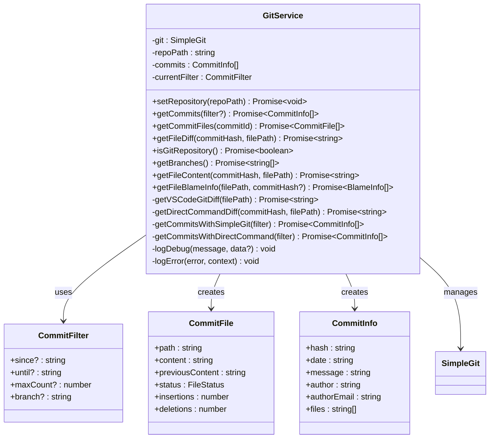
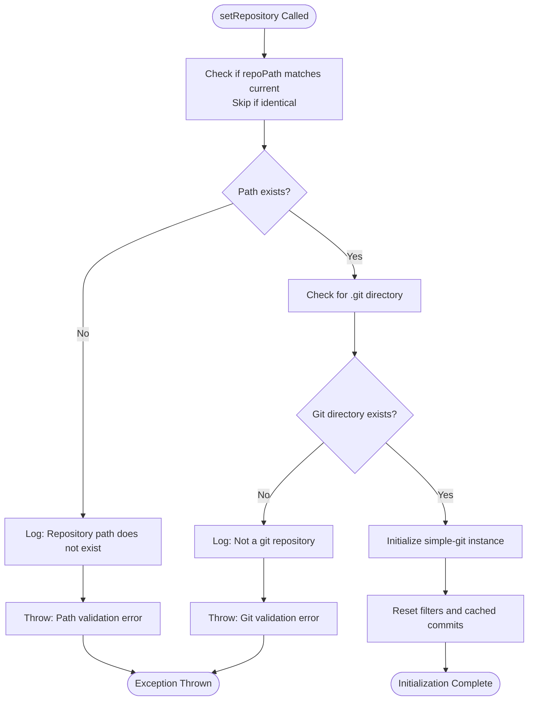
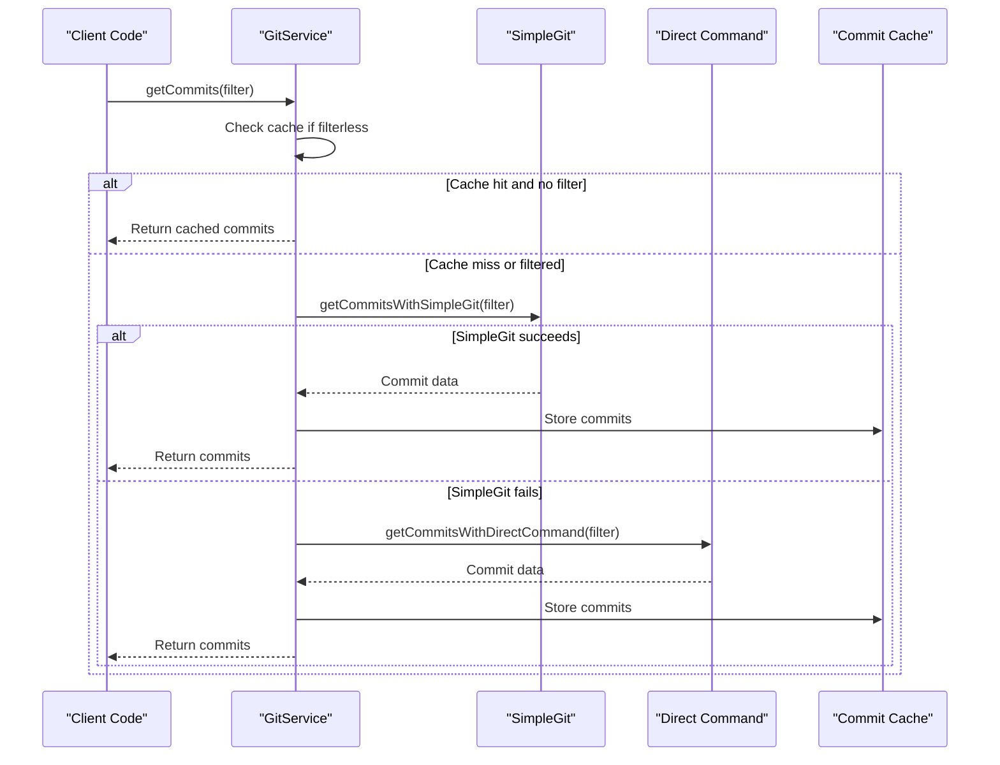
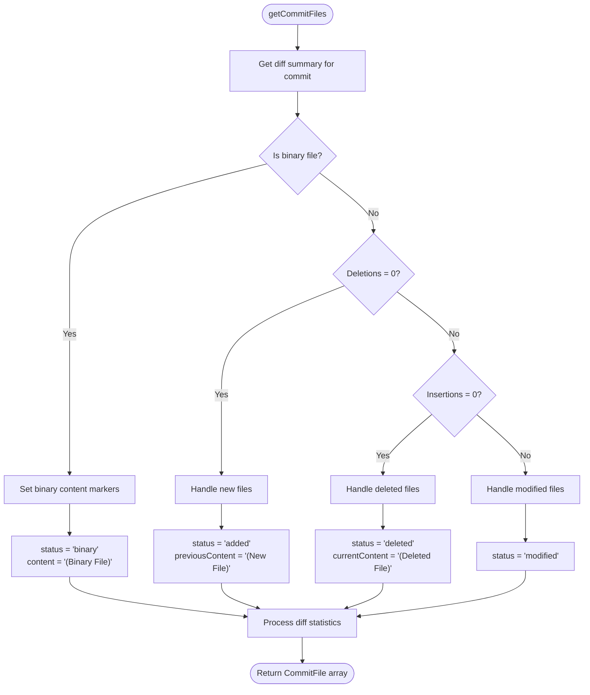
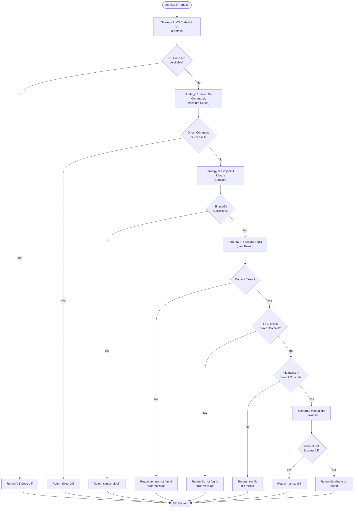
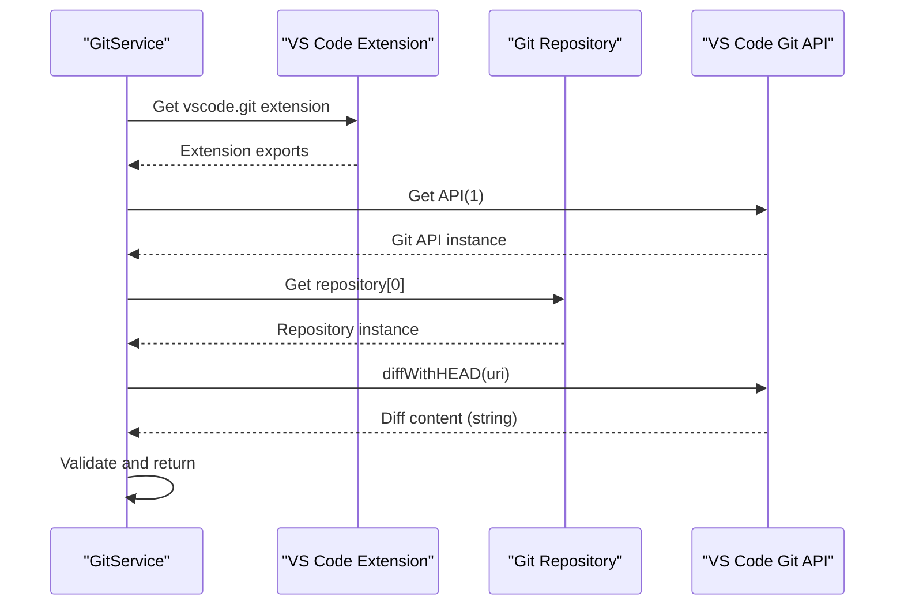
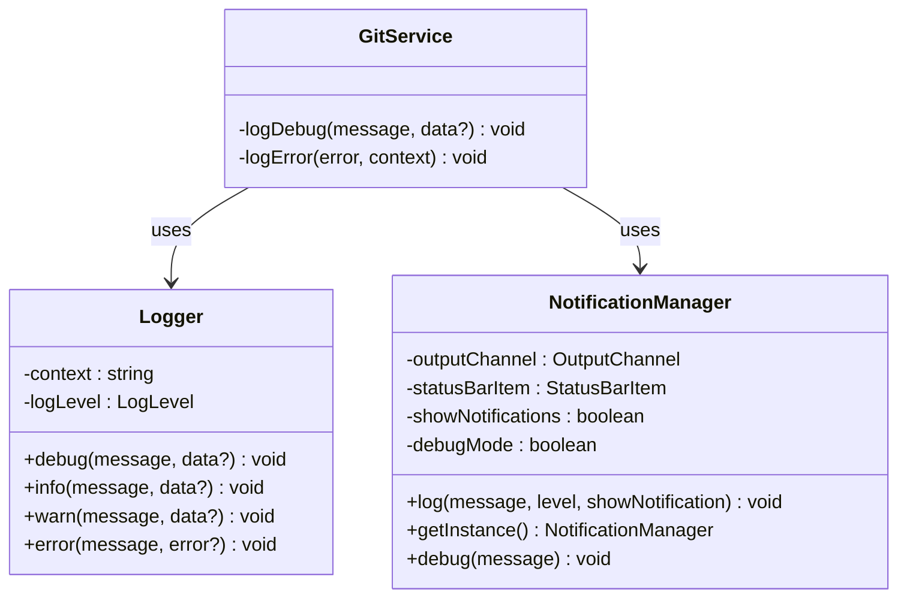

# Git Service

<cite>
**Referenced Files in This Document**
- [gitService.ts](file://src/services/git/gitService.ts)
- [versionControlTypes.ts](file://src/services/git/versionControlTypes.ts)
- [logger.ts](file://src/utils/logger.ts)
- [retryUtils.ts](file://src/utils/retryUtils.ts)
- [notificationManager.ts](file://src/services/notification/notificationManager.ts)
- [output.ts](file://src/i18n/en/output.ts)
</cite>

## Table of Contents
1. [Introduction](#introduction)
2. [Architecture Overview](#architecture-overview)
3. [Repository Initialization](#repository-initialization)
4. [Core Methods](#core-methods)
5. [Strategy Pattern Implementation](#strategy-pattern-implementation)
6. [Error Handling and Diagnostics](#error-handling-and-diagnostics)
7. [Performance Optimization](#performance-optimization)
8. [Integration Examples](#integration-examples)
9. [Best Practices](#best-practices)
10. [Troubleshooting Guide](#troubleshooting-guide)

## Introduction

The GitService in CodeKarmic serves as the primary interface between the extension and Git repositories, providing reliable access to commit history, file changes, and comprehensive Git operations. Built with robust error handling and multiple fallback strategies, it ensures consistent functionality across different Git environments and repository configurations.

The service implements a sophisticated dual-strategy approach for Git operations, combining the simplicity of the simple-git library with direct Git command execution, while maintaining compatibility with VS Code's Git API for optimal performance in integrated development environments.

## Architecture Overview

The GitService follows a modular architecture designed for reliability and extensibility:



**Diagram sources**
- [gitService.ts](file://src/services/git/gitService.ts#L45-L1201)
- [versionControlTypes.ts](file://src/services/git/versionControlTypes.ts#L8-L80)

**Section sources**
- [gitService.ts](file://src/services/git/gitService.ts#L45-L1201)
- [versionControlTypes.ts](file://src/services/git/versionControlTypes.ts#L1-L80)

## Repository Initialization

The repository initialization process implements a comprehensive validation and setup mechanism that ensures the GitService operates reliably across different scenarios.

### Validation Process

The [`setRepository`](file://src/services/git/gitService.ts#L64-L108) method performs three critical validations:

1. **Path Existence Check**: Uses synchronous `fs.existsSync()` for fast path validation
2. **Git Directory Verification**: Confirms the presence of `.git` directory
3. **Git Instance Creation**: Initializes simple-git with optimized configuration



**Diagram sources**
- [gitService.ts](file://src/services/git/gitService.ts#L64-L108)

### Configuration Settings

The service initializes with several performance-optimized settings:

- **Max Concurrent Processes**: 6 concurrent Git operations
- **Trimmed Output**: Automatic output trimming for cleaner results
- **Custom Binary**: Explicit Git binary specification
- **Base Directory**: Configured repository path

**Section sources**
- [gitService.ts](file://src/services/git/gitService.ts#L64-L108)

## Core Methods

### getCommits Method

The [`getCommits`](file://src/services/git/gitService.ts#L197-L242) method implements a sophisticated dual-strategy approach for retrieving commit history with comprehensive filtering capabilities.

#### Dual-Strategy Implementation

The method employs a fallback mechanism with three distinct approaches:

1. **Primary Strategy**: simple-git library with optimized log options
2. **Secondary Strategy**: Direct Git command execution with custom formatting
3. **Caching Mechanism**: Intelligent caching based on filter changes



**Diagram sources**
- [gitService.ts](file://src/services/git/gitService.ts#L197-L242)

#### Filtering Capabilities

The [`CommitFilter`](file://src/services/git/gitService.ts#L12-L17) interface supports comprehensive filtering:

- **Date Range**: `since` and `until` parameters for temporal filtering
- **Limit Control**: `maxCount` to restrict result size
- **Branch Selection**: `branch` parameter for specific branch targeting

**Section sources**
- [gitService.ts](file://src/services/git/gitService.ts#L197-L242)

### getCommitFiles Method

The [`getCommitFiles`](file://src/services/git/gitService.ts#L110-L178) method reconstructs file content for specific commits by intelligently combining Git operations for current and previous versions.

#### File Status Detection

The method handles five distinct file statuses:



**Diagram sources**
- [gitService.ts](file://src/services/git/gitService.ts#L110-L178)

#### Content Retrieval Strategies

For each file status, the method employs specific retrieval strategies:

- **Binary Files**: Uses placeholder content markers
- **New Files**: Retrieves current content, marks previous as new
- **Deleted Files**: Retrieves previous content, marks current as deleted
- **Modified Files**: Retrieves both versions for comparison

**Section sources**
- [gitService.ts](file://src/services/git/gitService.ts#L110-L178)

### getFileDiff Method

The [`getFileDiff`](file://src/services/git/gitService.ts#L707-L794) method implements a sophisticated strategy pattern with four distinct approaches, prioritizing speed and reliability.

#### Strategy Pattern Implementation



**Diagram sources**
- [gitService.ts](file://src/services/git/gitService.ts#L707-L794)

#### Optimization Features

The getFileDiff method includes several optimization strategies:

- **File Type Filtering**: Uses file extensions to optimize Git commands
- **Whitespace Ignoring**: Automatic whitespace normalization
- **Minimal Diff Generation**: Optimized diff output for large files
- **Intelligent Fallback**: Progressive fallback through strategies

**Section sources**
- [gitService.ts](file://src/services/git/gitService.ts#L707-L794)

## Strategy Pattern Implementation

The GitService implements a comprehensive strategy pattern for different Git operations, ensuring optimal performance across various environments and scenarios.

### VS Code Git API Integration

The [`getVSCodeGitDiff`](file://src/services/git/gitService.ts#L367-L406) method leverages VS Code's native Git capabilities:



**Diagram sources**
- [gitService.ts](file://src/services/git/gitService.ts#L367-L406)

### Direct Git Command Strategy

The [`getDirectCommandDiff`](file://src/services/git/gitService.ts#L408-L670) method employs multiple Git command variations:

#### Command Variations

1. **Show Command**: `git show ${commitHash} -- "${filePath}"`
2. **Standard Diff**: `git diff --unified=3 ${commitHash}^ ${commitHash} -- "${filePath}"`
3. **No Prefix Diff**: `git diff --unified=3 --no-prefix ${commitHash}^ ${commitHash} -- "${filePath}"`
4. **Content Comparison**: Separate retrieval of parent and current versions

#### Intelligent Diff Generation

For complex scenarios, the method implements manual diff generation with:

- **Longest Common Subsequence**: Efficient difference calculation
- **Adjacent Region Merging**: Consolidates small changes
- **Context Line Preservation**: Maintains surrounding context

**Section sources**
- [gitService.ts](file://src/services/git/gitService.ts#L367-L670)

## Error Handling and Diagnostics

The GitService implements comprehensive error handling with detailed diagnostic capabilities.

### Logging Infrastructure



**Diagram sources**
- [logger.ts](file://src/utils/logger.ts#L15-L88)
- [notificationManager.ts](file://src/services/notification/notificationManager.ts#L8-L128)

### Diagnostic Information

The service provides detailed diagnostic information through multiple channels:

#### Error Context Information

- **Operation Details**: Specific operation that failed
- **Parameter Values**: Input parameters causing issues
- **Environment Information**: Git version, repository state
- **Fallback Attempts**: Alternative methods tried

#### Error Recovery Mechanisms

The service implements several error recovery strategies:

1. **Graceful Degradation**: Continue with reduced functionality
2. **Alternative Methods**: Progress through fallback strategies
3. **Partial Results**: Return available data despite errors
4. **Detailed Reporting**: Comprehensive error messages with suggestions

**Section sources**
- [gitService.ts](file://src/services/git/gitService.ts#L1185-L1200)
- [notificationManager.ts](file://src/services/notification/notificationManager.ts#L73-L128)

## Performance Optimization

The GitService incorporates numerous performance optimizations for efficient Git operations.

### Caching Strategies

#### Commit Caching

The service maintains an in-memory cache of retrieved commits, automatically invalidated when filters change:

- **Cache Key**: Current filter state
- **Invalidation**: Filter changes trigger cache clearing
- **Hit Rate**: Significant performance improvement for repeated queries

#### File Content Caching

Individual file content is cached during commit file retrieval to avoid redundant Git operations.

### Concurrency Management

#### Process Pooling

- **Max Concurrent Processes**: 6 simultaneous Git operations
- **Resource Management**: Prevents system overload
- **Queue Management**: Automatic queuing for excess operations

### Memory Optimization

#### Buffer Management

- **Large File Handling**: Configurable buffer sizes for large repositories
- **Streaming Operations**: Process large diffs without memory overflow
- **Garbage Collection**: Automatic cleanup of temporary data

**Section sources**
- [gitService.ts](file://src/services/git/gitService.ts#L90-L97)

## Integration Examples

### Basic Repository Setup

```typescript
// Initialize GitService with repository path
const gitService = new GitService();
await gitService.setRepository('/path/to/repository');

// Verify repository validity
const isValid = await gitService.isGitRepository();
console.log(`Repository valid: ${isValid}`);
```

### Commit History Retrieval

```typescript
// Get recent commits with filtering
const commits = await gitService.getCommits({
    maxCount: 50,
    since: '2024-01-01',
    until: '2024-12-31'
});

// Access commit information
commits.forEach(commit => {
    console.log(`Commit: ${commit.hash}`);
    console.log(`Author: ${commit.author}`);
    console.log(`Date: ${commit.date}`);
    console.log(`Message: ${commit.message}`);
});
```

### File Change Analysis

```typescript
// Get files changed in a specific commit
const commitFiles = await gitService.getCommitFiles('abc123def456');

// Analyze file changes
commitFiles.forEach(file => {
    console.log(`File: ${file.path}`);
    console.log(`Status: ${file.status}`);
    console.log(`Insertions: ${file.insertions}`);
    console.log(`Deletions: ${file.deletions}`);
    
    if (file.status === 'modified') {
        // Compare file versions
        const currentContent = file.content;
        const previousContent = file.previousContent;
        // Perform content analysis...
    }
});
```

### Diff Generation

```typescript
// Generate diff for a specific file at a commit
const diffContent = await gitService.getFileDiff(
    'abc123def456', 
    'src/main.js'
);

console.log(diffContent);
// Outputs unified diff format
```

**Section sources**
- [gitService.ts](file://src/services/git/gitService.ts#L64-L178)

## Best Practices

### Repository Management

1. **Path Validation**: Always validate repository paths before initialization
2. **Error Handling**: Implement comprehensive error handling for Git operations
3. **Resource Cleanup**: Properly dispose of Git instances when no longer needed
4. **Concurrency Control**: Limit concurrent operations to prevent system overload

### Performance Considerations

1. **Filter Usage**: Use appropriate filters to limit result sets
2. **Caching**: Leverage built-in caching for repeated queries
3. **Batch Operations**: Group related operations when possible
4. **Memory Management**: Monitor memory usage with large repositories

### Error Recovery

1. **Fallback Strategies**: Utilize multiple fallback methods
2. **Graceful Degradation**: Continue operation with reduced functionality
3. **User Feedback**: Provide meaningful error messages
4. **Logging**: Enable comprehensive logging for debugging

## Troubleshooting Guide

### Common Issues and Solutions

#### Repository Not Found

**Symptoms**: `Not a git repository` error
**Causes**: Incorrect path, missing .git directory
**Solutions**:
- Verify repository path exists
- Check for .git directory presence
- Ensure proper permissions

#### Git Operations Timeout

**Symptoms**: Long delays or timeout errors
**Causes**: Large repositories, network issues, system overload
**Solutions**:
- Increase timeout values
- Use filtering to reduce result sets
- Optimize concurrent operations

#### Diff Generation Failures

**Symptoms**: Empty or incomplete diff content
**Causes**: Binary files, encoding issues, permission problems
**Solutions**:
- Check file types and encodings
- Verify file permissions
- Use fallback diff strategies

#### VS Code Integration Issues

**Symptoms**: VS Code Git API not available
**Causes**: Missing VS Code Git extension, API version mismatch
**Solutions**:
- Install VS Code Git extension
- Check API compatibility
- Use alternative diff methods

### Diagnostic Commands

#### Repository Validation

```bash
# Check Git repository status
cd /path/to/repository
git status
git rev-parse --is-inside-work-tree

# Verify Git installation
git --version
which git
```

#### Performance Monitoring

```bash
# Monitor Git operations
strace -p $(pgrep -f "git") 2>&1 | grep -E "(read|write|open)"

# Check system resources
htop
iotop
```

**Section sources**
- [gitService.ts](file://src/services/git/gitService.ts#L180-L195)