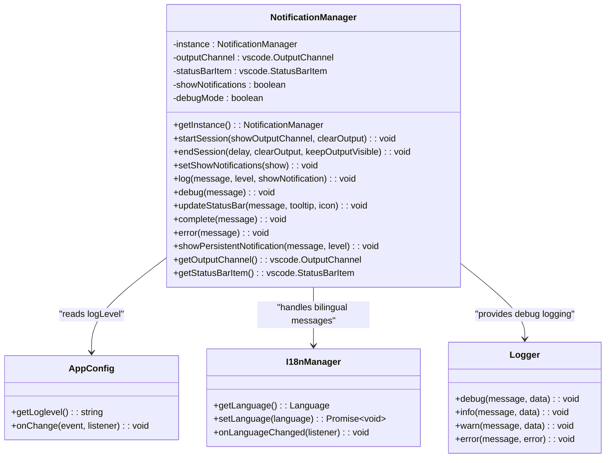
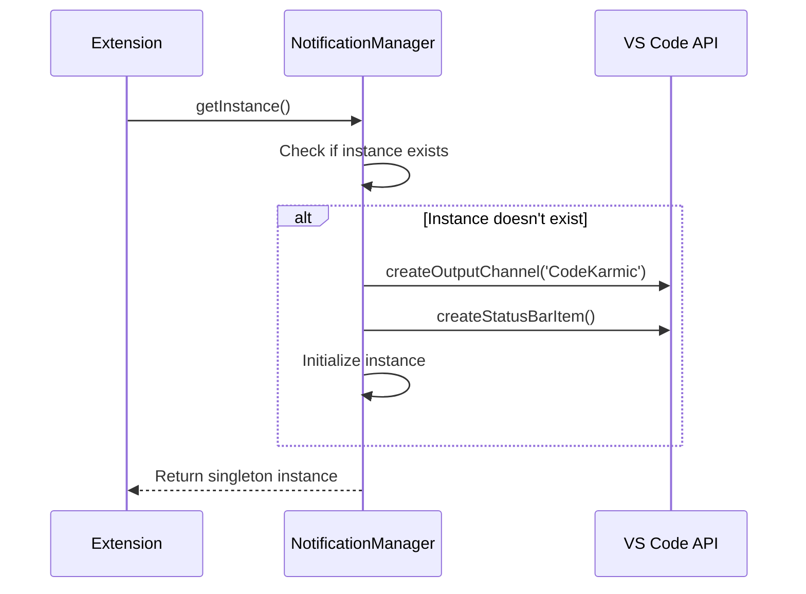
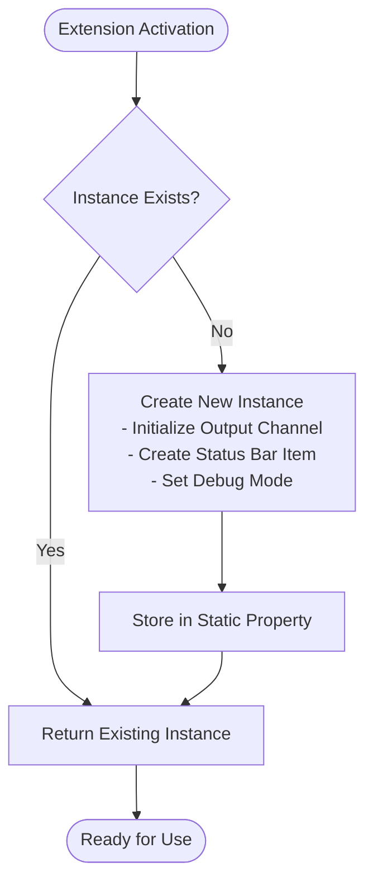
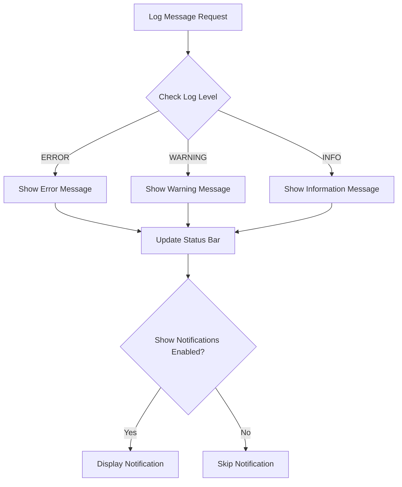
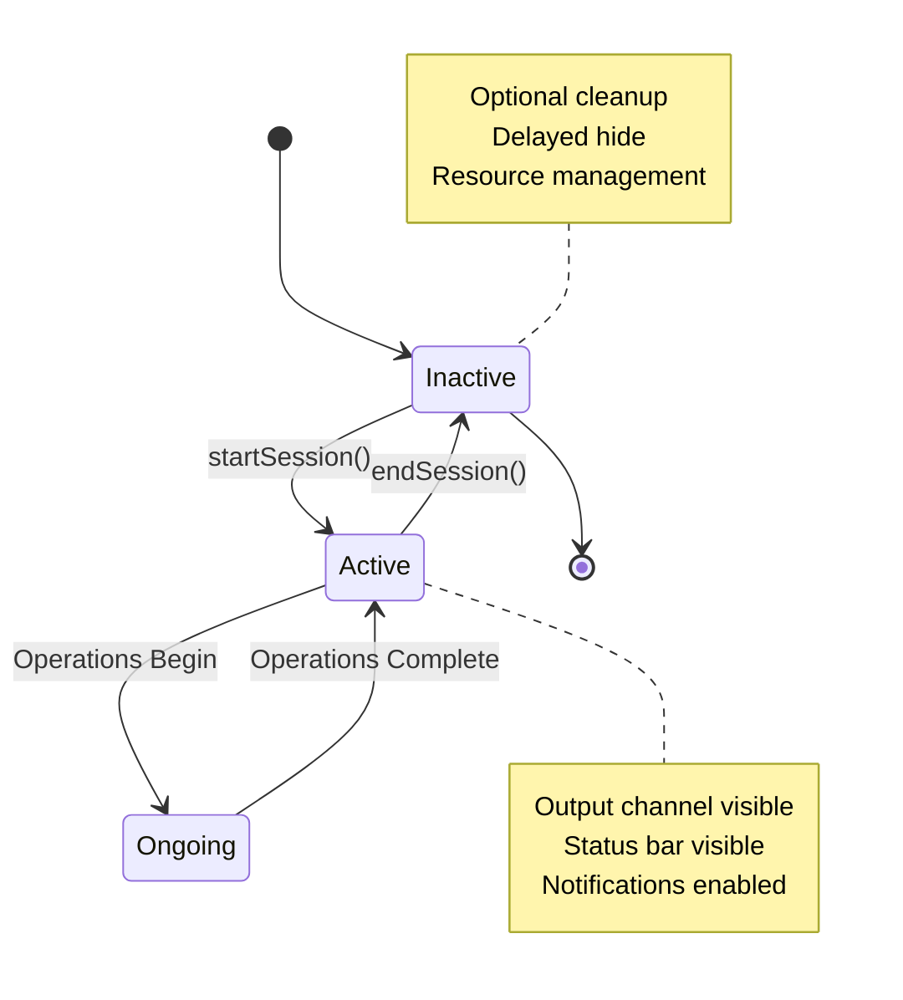
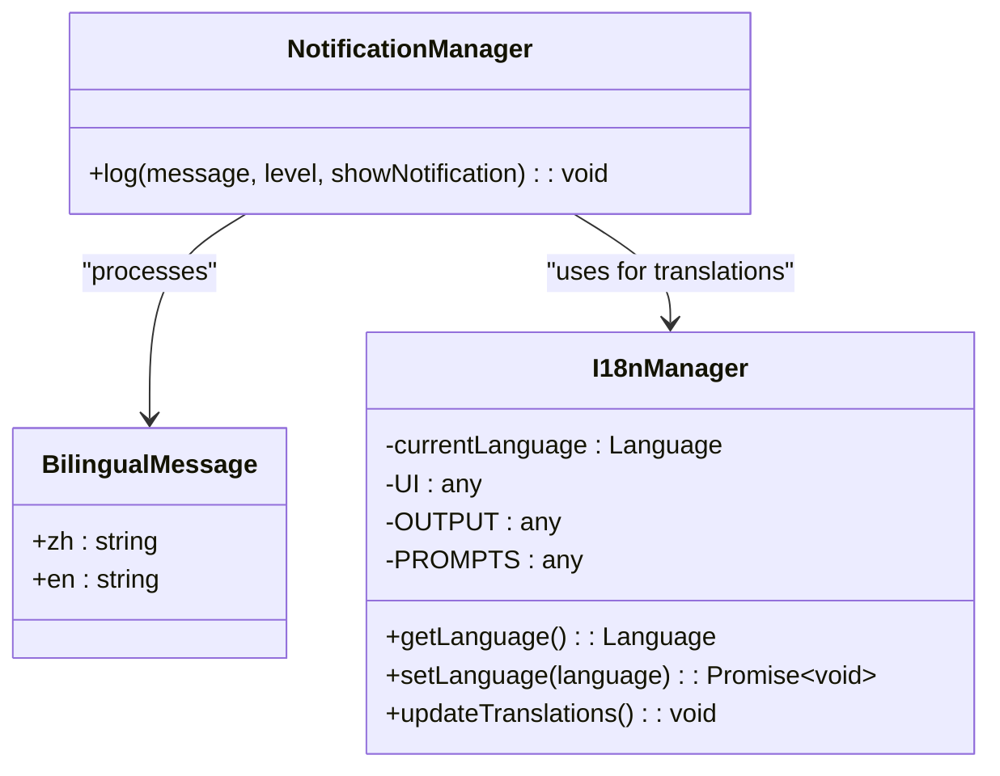

# Notification Manager

<cite>
**Referenced Files in This Document**
- [notificationManager.ts](file://src/services/notification/notificationManager.ts)
- [appConfig.ts](file://src/config/appConfig.ts)
- [constants.ts](file://src/constants/constants.ts)
- [logger.ts](file://src/utils/logger.ts)
- [index.ts](file://src/i18n/index.ts)
- [types.ts](file://src/i18n/types.ts)
- [extension.ts](file://src/extension.ts)
- [package.json](file://package.json)
</cite>

## Table of Contents
1. [Introduction](#introduction)
2. [System Architecture](#system-architecture)
3. [Core Components](#core-components)
4. [Singleton Pattern Implementation](#singleton-pattern-implementation)
5. [Output Channel Management](#output-channel-management)
6. [Status Bar Integration](#status-bar-integration)
7. [Notification System](#notification-system)
8. [Session Management](#session-management)
9. [Internationalization Support](#internationalization-support)
10. [Configuration Integration](#configuration-integration)
11. [Usage Examples](#usage-examples)
12. [Debugging Capabilities](#debugging-capabilities)
13. [Best Practices](#best-practices)

## Introduction

The NotificationManager serves as the centralized communication hub within the CodeKarmic VS Code extension, providing comprehensive user feedback and status communication throughout the code review workflow. As a singleton service, it orchestrates multiple VS Code UI elements including output channels, status bars, and notification dialogs to deliver contextual information to users during Git commit code reviews.

The manager implements a sophisticated logging system with timestamped entries, configurable log levels, and bilingual support for both English and Chinese languages. It seamlessly integrates with the extension's configuration system to respect user preferences while maintaining consistent feedback across all extension operations.

## System Architecture

The NotificationManager follows a centralized service pattern that coordinates multiple VS Code UI components through a unified interface. Its architecture emphasizes reliability, configurability, and internationalization support.



**Diagram sources**
- [notificationManager.ts](file://src/services/notification/notificationManager.ts#L8-L212)
- [appConfig.ts](file://src/config/appConfig.ts#L49-L188)
- [index.ts](file://src/i18n/index.ts#L75-L175)

**Section sources**
- [notificationManager.ts](file://src/services/notification/notificationManager.ts#L1-L212)

## Core Components

### Singleton Instance Management

The NotificationManager implements the singleton pattern to ensure a single point of control for all user notifications and status updates. This design prevents conflicts between different extension components and maintains consistent state management.



**Diagram sources**
- [notificationManager.ts](file://src/services/notification/notificationManager.ts#L24-L28)

### Output Channel Integration

The output channel provides a persistent log of all extension activities with timestamped entries and configurable log levels. Each log entry includes the current time, log level designation, and the formatted message content.

### Status Bar Coordination

The status bar displays real-time progress indicators with animated icons and contextual tooltips. The manager supports multiple icon states including spinning animations for ongoing operations and completion markers for successful operations.

### Notification Distribution

The notification system intelligently distributes messages based on severity levels, respecting user-configured preferences and displaying appropriate VS Code message types (information, warning, error).

**Section sources**
- [notificationManager.ts](file://src/services/notification/notificationManager.ts#L15-L19)

## Singleton Pattern Implementation

The NotificationManager employs a strict singleton pattern to ensure consistent behavior across the entire extension lifecycle. This implementation guarantees that all components interact with the same notification infrastructure.



**Diagram sources**
- [notificationManager.ts](file://src/services/notification/notificationManager.ts#L24-L28)

The singleton implementation includes several key features:

- **Lazy Initialization**: The instance is created only when first requested
- **Thread Safety**: The pattern prevents race conditions during initialization
- **Global Access**: All extension components can access the same notification instance
- **Resource Management**: Proper cleanup of VS Code resources when the extension deactivates

**Section sources**
- [notificationManager.ts](file://src/services/notification/notificationManager.ts#L24-L28)

## Output Channel Management

The output channel serves as the primary logging mechanism for the extension, providing a comprehensive audit trail of all operations performed during code reviews. Each entry includes precise timing information and structured log levels.

### Timestamped Logging

All log entries include precise timestamps in the format `[HH:MM:SS] [LEVEL] message`, enabling users to track the temporal progression of operations and identify performance bottlenecks.

### Structured Log Levels

The system supports multiple log levels with hierarchical precedence:

| Level | Priority | Purpose |
|-------|----------|---------|
| DEBUG | 0 | Development and troubleshooting information |
| INFO | 1 | General operational information |
| WARNING | 2 | Non-critical issues requiring attention |
| ERROR | 3 | Critical failures requiring immediate action |

### Configurable Visibility

The output channel can be controlled programmatically through session management methods, allowing for dynamic visibility based on user preferences and operational context.

**Section sources**
- [notificationManager.ts](file://src/services/notification/notificationManager.ts#L79-L101)

## Status Bar Integration

The status bar provides immediate visual feedback about ongoing operations and system state. The integration supports animated icons, contextual tooltips, and dynamic content updates.

### Animated Progress Indicators

During long-running operations, the status bar displays spinning icons to indicate progress. These animations are automatically managed and can be customized with different icon sets for various operation types.

### Contextual Tooltips

Each status bar update can include detailed tooltips that provide additional context about the current operation, error conditions, or completion status.

### Dynamic State Management

The status bar automatically transitions between different states based on operation outcomes, providing clear visual feedback about system health and progress.

**Section sources**
- [notificationManager.ts](file://src/services/notification/notificationManager.ts#L136-L141)

## Notification System

The notification system intelligently manages user-facing messages based on severity levels and user preferences. It integrates with VS Code's native notification mechanisms to provide appropriate user feedback.

### Severity-Based Distribution

The system categorizes messages into three severity levels, each triggering different VS Code notification types:



**Diagram sources**
- [notificationManager.ts](file://src/services/notification/notificationManager.ts#L107-L116)

### Configurable Filtering

Notifications are filtered based on the user-configured log level, ensuring that users only receive messages appropriate to their desired verbosity level.

### Automatic Status Updates

Each notification automatically updates the status bar with relevant information, providing dual-mode feedback for different user preferences.

**Section sources**
- [notificationManager.ts](file://src/services/notification/notificationManager.ts#L103-L117)

## Session Management

Session management controls the visibility and lifecycle of output channels and status bars during review workflows. This system ensures optimal user experience by managing UI resources efficiently.

### Session Lifecycle



**Diagram sources**
- [notificationManager.ts](file://src/services/notification/notificationManager.ts#L36-L63)

### Flexible Configuration

The session management system allows fine-grained control over visibility and cleanup behavior:

- **Show Output Channel**: Controls whether the output channel becomes visible
- **Clear Output**: Determines whether to clear existing content
- **Delay Timing**: Configures the delay before hiding status bar elements
- **Keep Visible**: Maintains output channel visibility after session completion

### Resource Optimization

Sessions are designed to minimize resource consumption while providing comprehensive feedback, automatically cleaning up resources when sessions end.

**Section sources**
- [notificationManager.ts](file://src/services/notification/notificationManager.ts#L36-L63)

## Internationalization Support

The NotificationManager provides comprehensive bilingual support for both English and Chinese languages, with automatic fallback mechanisms and dynamic language switching capabilities.

### Bilingual Message Structure

The system uses a standardized `BilingualMessage` interface that contains both English and Chinese translations for all user-facing content.



**Diagram sources**
- [types.ts](file://src/i18n/types.ts#L12-L15)
- [index.ts](file://src/i18n/index.ts#L75-L175)

### Dynamic Language Switching

The system supports runtime language changes without requiring extension restart, automatically updating all displayed content across the notification system.

### Fallback Mechanisms

When translations are incomplete, the system automatically falls back to English content, ensuring that users always receive comprehensible messages regardless of translation coverage.

**Section sources**
- [types.ts](file://src/i18n/types.ts#L12-L15)
- [index.ts](file://src/i18n/index.ts#L46-L68)

## Configuration Integration

The NotificationManager seamlessly integrates with the extension's configuration system to respect user preferences and provide flexible customization options.

### Log Level Configuration

Users can configure the minimum log level threshold through the extension settings, controlling which messages are displayed as notifications:

| Setting | Effect |
|---------|--------|
| DEBUG | Shows all messages including development information |
| INFO | Shows operational and informational messages |
| WARNING | Shows warnings and above |
| ERROR | Shows only error messages |

### Environment-Based Debugging

The system automatically enables debug mode when running in development environments, providing additional logging for troubleshooting without requiring explicit configuration.

### Real-Time Configuration Updates

Configuration changes are immediately reflected in notification behavior without requiring extension restart, ensuring responsive user experience.

**Section sources**
- [notificationManager.ts](file://src/services/notification/notificationManager.ts#L104-L106)
- [appConfig.ts](file://src/config/appConfig.ts#L49-L188)

## Usage Examples

### Basic Logging

```typescript
// Simple informational message
NotificationManager.getInstance().log("Code review started", "info");

// Error message with notification
NotificationManager.getInstance().log("API key not configured", "error", true);

// Warning message without immediate notification
NotificationManager.getInstance().log("Large file detected", "warning");
```

### Session Management

```typescript
// Start a new review session
NotificationManager.getInstance().startSession(true, true);

// End session with custom cleanup
NotificationManager.getInstance().endSession(3000, false, true);
```

### Status Bar Updates

```typescript
// Update with animation
NotificationManager.getInstance().updateStatusBar("Analyzing code...", "Working on review");

// Complete operation
NotificationManager.getInstance().complete("Review completed successfully");

// Error state
NotificationManager.getInstance().error("Analysis failed");
```

### Persistent Notifications

```typescript
// Show notification with action button
NotificationManager.getInstance().showPersistentNotification(
    "Review completed successfully", 
    "info"
);
```

**Section sources**
- [extension.ts](file://src/extension.ts#L22-L23)
- [extension.ts](file://src/extension.ts#L102-L138)

## Debugging Capabilities

The NotificationManager includes comprehensive debugging features for troubleshooting extension behavior and diagnosing issues.

### Conditional Debug Logging

Debug messages are only displayed when the extension runs in development mode, preventing sensitive information from appearing in production builds.

### Console Integration

Debug output is automatically logged to the VS Code console with timestamps and context information, enabling detailed troubleshooting of extension operations.

### Runtime Inspection

The manager provides methods to inspect current state, including notification visibility settings and debug mode status.

**Section sources**
- [notificationManager.ts](file://src/services/notification/notificationManager.ts#L123-L127)

## Best Practices

### Message Design Guidelines

- **Clarity**: Use clear, concise language that communicates the issue or status effectively
- **Context**: Include relevant context information to help users understand the situation
- **Actionability**: Provide guidance on what users can do to resolve issues
- **Consistency**: Maintain consistent terminology across all notification types

### Performance Considerations

- **Batch Operations**: Group related log messages to reduce UI overhead
- **Conditional Logging**: Use appropriate log levels to avoid overwhelming users
- **Resource Cleanup**: Properly manage session lifecycles to prevent resource leaks

### User Experience

- **Progress Feedback**: Provide timely feedback for long-running operations
- **Error Recovery**: Offer helpful suggestions when errors occur
- **Visual Hierarchy**: Use appropriate notification types to convey importance
- **Accessibility**: Ensure notifications are accessible to all users

The NotificationManager serves as the cornerstone of user communication within the CodeKarmic extension, providing reliable, configurable, and internationally-aware feedback that enhances the overall user experience during Git commit code reviews.