# Review Manager

<cite>
**Referenced Files in This Document**
- [reviewManager.ts](file://src/services/review/reviewManager.ts)
- [gitService.ts](file://src/services/git/gitService.ts)
- [aiService.ts](file://src/services/ai/aiService.ts)
- [notificationManager.ts](file://src/services/notification/notificationManager.ts)
- [reviewPanel.ts](file://src/ui/views/reviewPanel.ts)
- [fileUtils.ts](file://src/utils/fileUtils.ts)
- [index.ts](file://src/i18n/index.ts)
- [extension.ts](file://src/extension.ts)
</cite>

## Table of Contents
1. [Introduction](#introduction)
2. [Architecture Overview](#architecture-overview)
3. [Core Components](#core-components)
4. [Initialization Process](#initialization-process)
5. [Commit Selection Workflow](#commit-selection-workflow)
6. [File Review Process](#file-review-process)
7. [Batch Processing Mechanism](#batch-processing-mechanism)
8. [Report Generation Workflow](#report-generation-workflow)
9. [Error Handling and State Management](#error-handling-and-state-management)
10. [Integration with NotificationManager](#integration-with-notificationmanager)
11. [Multi-Language Support](#multi-language-support)
12. [Performance Considerations](#performance-considerations)
13. [Troubleshooting Guide](#troubleshooting-guide)
14. [Conclusion](#conclusion)

## Introduction

The ReviewManager service serves as the central orchestration layer in CodeKarmic, coordinating Git and AI services during code review sessions. It manages the complete lifecycle of code reviews, from repository initialization to comprehensive report generation, while maintaining review state and providing seamless integration with VS Code's user interface.

As the core orchestrator, ReviewManager handles multiple concurrent review sessions, manages file-level review data, coordinates with external AI services for intelligent code analysis, and maintains a sophisticated state management system for tracking review progress and results.

## Architecture Overview

The ReviewManager follows a service-oriented architecture pattern, acting as the central coordinator between various specialized services in the CodeKarmic ecosystem.

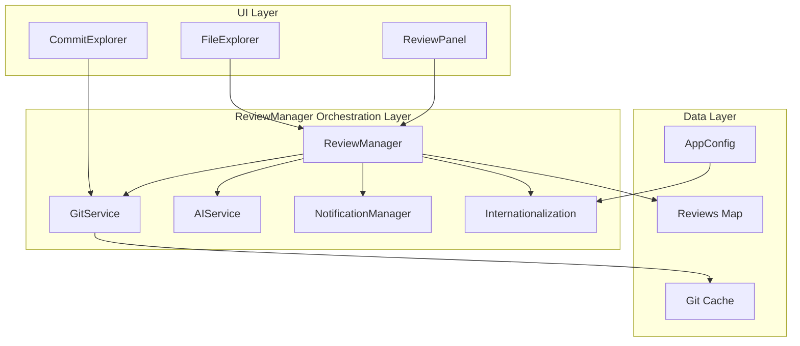

**Diagram sources**
- [reviewManager.ts](file://src/services/review/reviewManager.ts#L79-L95)
- [gitService.ts](file://src/services/git/gitService.ts#L45-L65)
- [aiService.ts](file://src/services/ai/aiService.ts#L40-L70)

**Section sources**
- [reviewManager.ts](file://src/services/review/reviewManager.ts#L79-L95)
- [extension.ts](file://src/extension.ts#L68-L73)

## Core Components

The ReviewManager consists of several key components that work together to provide comprehensive code review capabilities:

### State Management System

The ReviewManager maintains review state through a sophisticated Map-based storage system that tracks individual file reviews with unique identifiers.

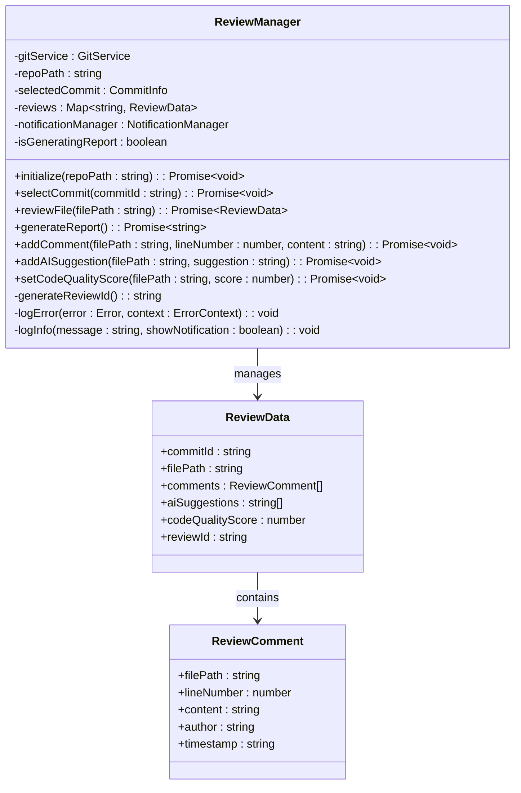

**Diagram sources**
- [reviewManager.ts](file://src/services/review/reviewManager.ts#L11-L26)
- [reviewManager.ts](file://src/services/review/reviewManager.ts#L82-L95)

### Error Context Management

The ReviewManager implements comprehensive error handling through a structured error context system that provides detailed diagnostic information for troubleshooting.

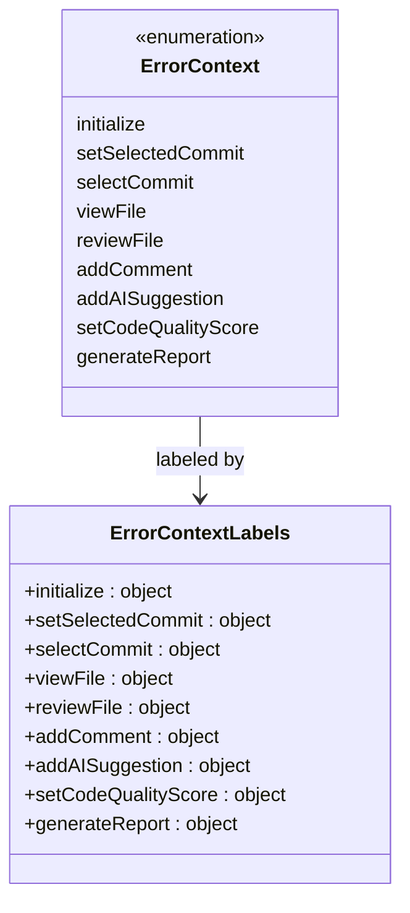

**Diagram sources**
- [reviewManager.ts](file://src/services/review/reviewManager.ts#L28-L77)

**Section sources**
- [reviewManager.ts](file://src/services/review/reviewManager.ts#L11-L26)
- [reviewManager.ts](file://src/services/review/reviewManager.ts#L28-L77)

## Initialization Process

The initialization process establishes the repository context and prepares the ReviewManager for code review operations. This process involves multiple validation steps and service initialization.

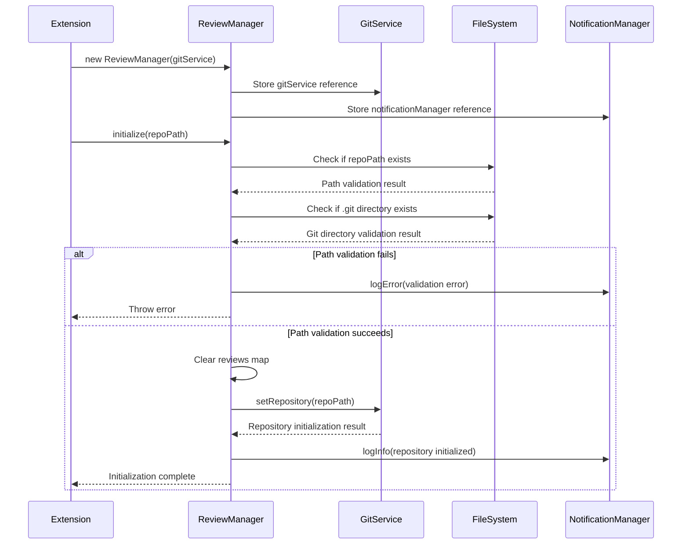

**Diagram sources**
- [reviewManager.ts](file://src/services/review/reviewManager.ts#L111-L129)
- [gitService.ts](file://src/services/git/gitService.ts#L64-L107)

The initialization process includes several critical steps:

1. **Path Validation**: Ensures the repository path exists and contains a valid Git repository
2. **Service Setup**: Establishes connections with GitService and NotificationManager
3. **State Reset**: Clears any previous review data to ensure clean state
4. **Logging**: Provides detailed logging for debugging and user feedback

**Section sources**
- [reviewManager.ts](file://src/services/review/reviewManager.ts#L111-L129)
- [gitService.ts](file://src/services/git/gitService.ts#L64-L107)

## Commit Selection Workflow

The commit selection workflow handles both cached and remote commit retrieval with sophisticated error handling and user feedback mechanisms.

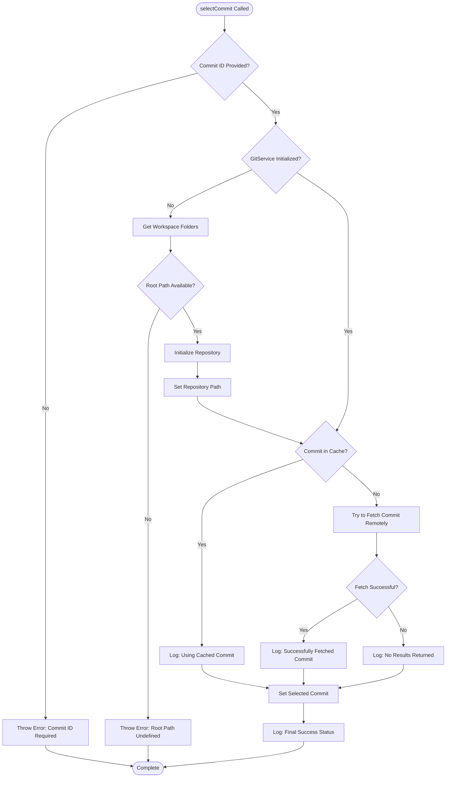

**Diagram sources**
- [reviewManager.ts](file://src/services/review/reviewManager.ts#L149-L206)

### Commit Retrieval Strategies

The ReviewManager employs multiple strategies for commit retrieval:

1. **Cache Lookup**: First checks if the commit is already in the GitService cache
2. **Remote Fetch**: Attempts to fetch the commit from remote repositories
3. **Fallback Logging**: Provides appropriate feedback for each retrieval attempt

**Section sources**
- [reviewManager.ts](file://src/services/review/reviewManager.ts#L149-L206)
- [gitService.ts](file://src/services/git/gitService.ts#L244-L275)

## File Review Process

The file review process manages review state for individual files, supporting both direct file reviews and commit-based reviews with comprehensive state tracking.

### Review State Management

Each file review is tracked through a unique review key that combines commit information with file path:

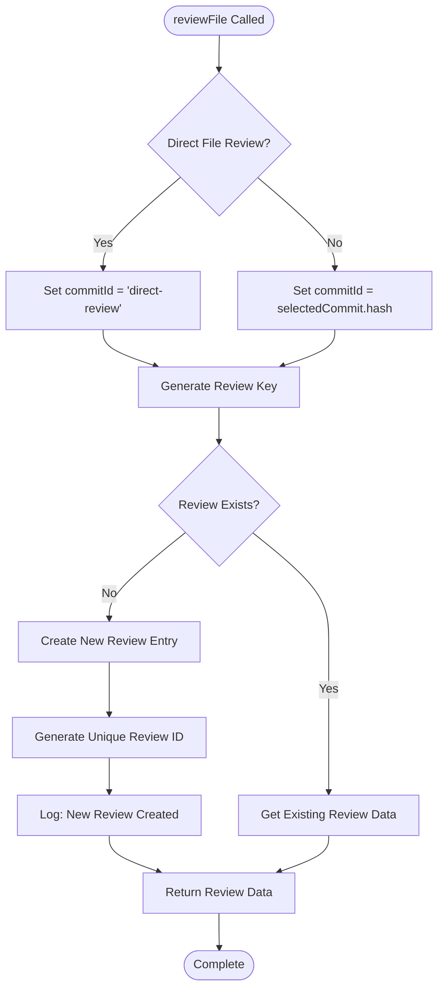

**Diagram sources**
- [reviewManager.ts](file://src/services/review/reviewManager.ts#L229-L262)

### File Type Validation

The ReviewManager ensures only reviewable file types are processed through comprehensive file type validation:

| File Category | Supported Extensions | Purpose |
|---------------|---------------------|---------|
| **Programming Languages** | `.ts`, `.js`, `.py`, `.java`, `.go`, `.cpp`, `.cs`, `.php`, `.swift`, `.kt`, `.rs`, `.scala`, `.dart`, `.groovy` | Core development files |
| **Markup & Stylesheets** | `.html`, `.css`, `.scss`, `.sass`, `.less`, `.vue` | Frontend assets |
| **Configuration Files** | `.json`, `.yaml`, `.yml`, `.xml`, `.env`, `.editorconfig`, `.gitignore`, `.dockerignore` | Project configuration |
| **Build Systems** | `Dockerfile`, `Makefile` | Infrastructure automation |
| **Documentation** | `.md`, `.markdown` | Project documentation |

**Section sources**
- [reviewManager.ts](file://src/services/review/reviewManager.ts#L229-L262)
- [fileUtils.ts](file://src/utils/fileUtils.ts#L6-L19)

## Batch Processing Mechanism

The batch processing mechanism divides files into manageable chunks for parallel processing, optimizing performance for large codebases while maintaining progress tracking and error handling.

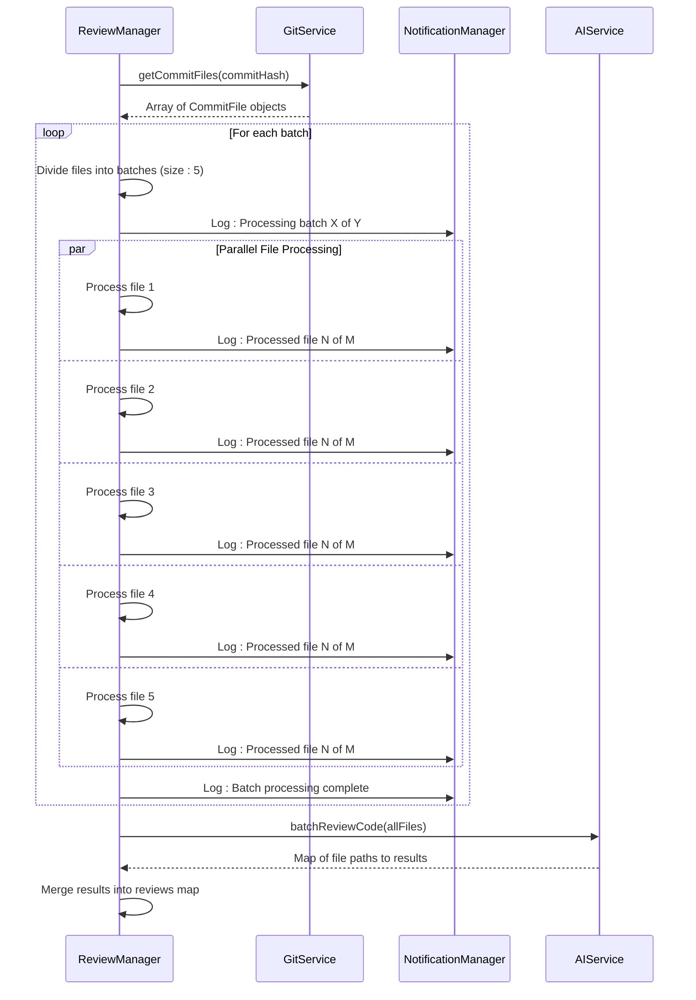

**Diagram sources**
- [reviewManager.ts](file://src/services/review/reviewManager.ts#L290-L370)
- [aiService.ts](file://src/services/ai/aiService.ts#L431-L552)

### Batch Processing Features

1. **Chunk Division**: Files are divided into batches of 5 for optimal processing
2. **Progress Tracking**: Real-time progress updates for user feedback
3. **Parallel Execution**: Multiple files processed simultaneously
4. **Error Isolation**: Individual file failures don't affect batch completion
5. **Result Aggregation**: Final results merged into the reviews map

**Section sources**
- [reviewManager.ts](file://src/services/review/reviewManager.ts#L290-L370)

## Report Generation Workflow

The report generation workflow integrates progress tracking, AI analysis, and result visualization through webviews, providing a comprehensive code review experience.

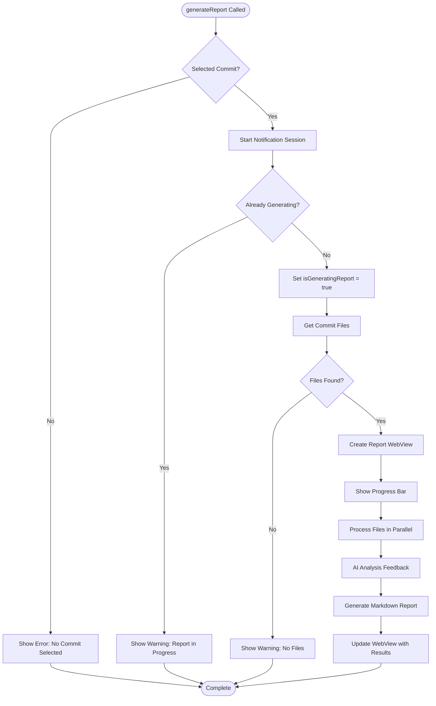

**Diagram sources**
- [reviewManager.ts](file://src/services/review/reviewManager.ts#L372-L661)

### Report Generation Phases

The report generation process consists of three main phases:

1. **File Review Phase**: Parallel processing of individual files
2. **AI Analysis Phase**: Intelligent code analysis with progress tracking
3. **Report Generation Phase**: Markdown report creation and WebView display

### WebView Integration

The ReviewManager creates dynamic webviews for real-time progress updates and final report display:

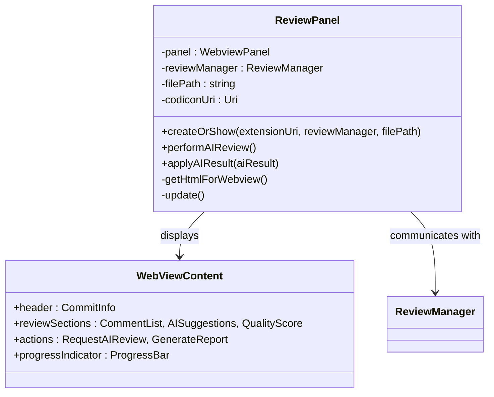

**Diagram sources**
- [reviewPanel.ts](file://src/ui/views/reviewPanel.ts#L6-L22)

**Section sources**
- [reviewManager.ts](file://src/services/review/reviewManager.ts#L372-L661)
- [reviewPanel.ts](file://src/ui/views/reviewPanel.ts#L242-L577)

## Error Handling and State Management

The ReviewManager implements comprehensive error handling and state management to ensure robust operation under various conditions.

### Error Context System

The error context system provides detailed diagnostic information for troubleshooting:

| Error Context | Description | Recovery Strategy |
|---------------|-------------|------------------|
| `initialize` | Repository initialization failure | Path validation, service availability |
| `setSelectedCommit` | Commit selection error | Commit validation, network connectivity |
| `selectCommit` | Remote commit retrieval failure | Cache fallback, retry mechanisms |
| `viewFile` | File opening error | File existence check, permissions |
| `reviewFile` | File review creation failure | File type validation, review state |
| `addComment` | Comment addition error | Review data validation, user input |
| `addAISuggestion` | AI suggestion addition error | AI service availability, content validation |
| `setCodeQualityScore` | Quality score setting error | Score validation, review state |
| `generateReport` | Report generation failure | Resource availability, processing timeout |

### State Persistence

The ReviewManager maintains state through several mechanisms:

1. **Reviews Map**: Persistent storage of review data keyed by file identifier
2. **Selected Commit**: Current commit context for batch operations
3. **Generation Flag**: Prevents concurrent report generation
4. **Error Context**: Detailed error information for debugging

**Section sources**
- [reviewManager.ts](file://src/services/review/reviewManager.ts#L28-L77)
- [reviewManager.ts](file://src/services/review/reviewManager.ts#L85-L95)

## Integration with NotificationManager

The ReviewManager integrates seamlessly with the NotificationManager to provide comprehensive user feedback and logging capabilities.

### Notification Patterns

The ReviewManager uses several notification patterns:

1. **Progress Notifications**: Real-time updates during long-running operations
2. **Error Notifications**: Detailed error reporting with context information
3. **Status Updates**: Current operation status for user awareness
4. **Completion Notifications**: Final status after successful operations

### Logging Levels

The ReviewManager supports multiple logging levels:

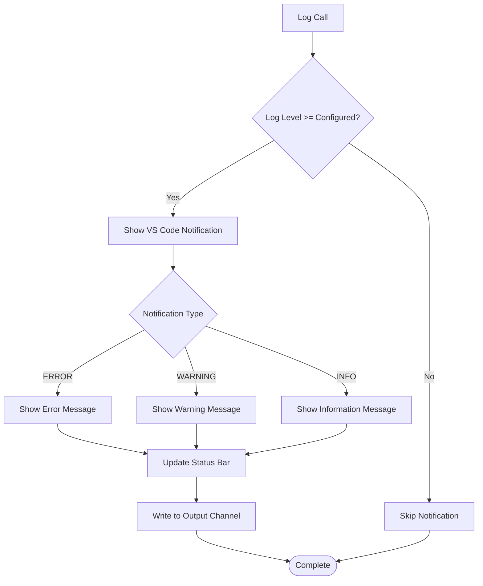

**Diagram sources**
- [notificationManager.ts](file://src/services/notification/notificationManager.ts#L79-L121)

**Section sources**
- [reviewManager.ts](file://src/services/review/reviewManager.ts#L101-L109)
- [notificationManager.ts](file://src/services/notification/notificationManager.ts#L79-L121)

## Multi-Language Support

The ReviewManager leverages CodeKarmic's internationalization system to provide multi-language support for user-facing messages and notifications.

### Internationalization Architecture

The i18n system provides automatic fallback mechanisms:

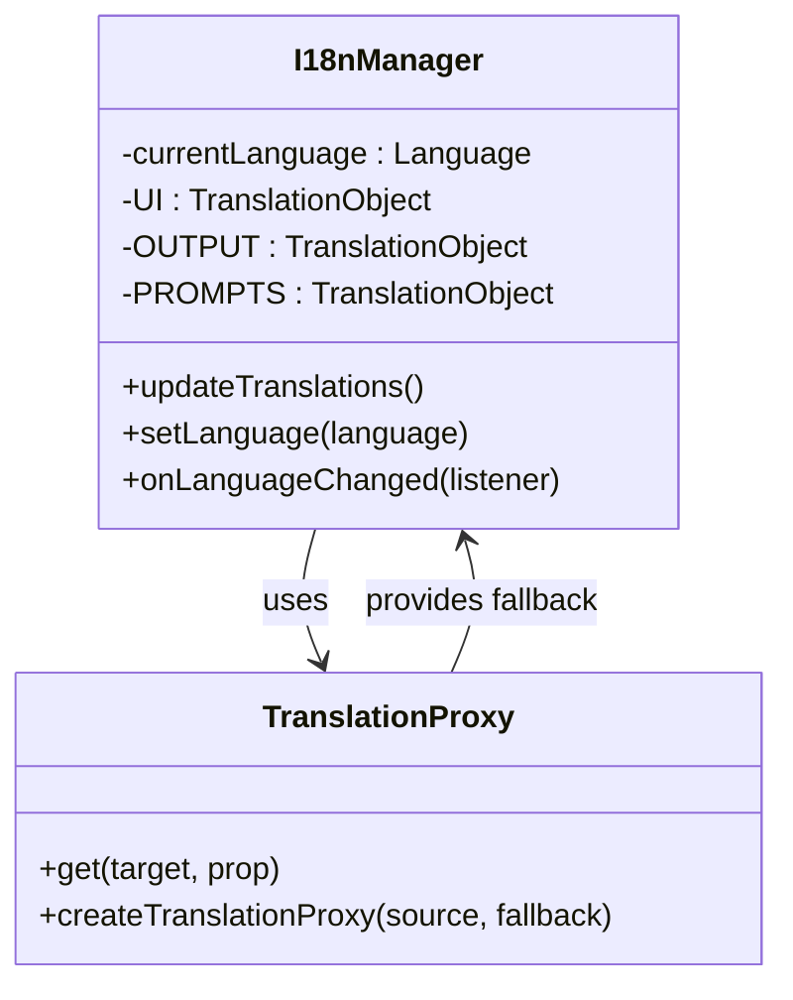

**Diagram sources**
- [index.ts](file://src/i18n/index.ts#L75-L131)

### Language Support Features

1. **Automatic Fallback**: Missing translations fall back to English
2. **Dynamic Switching**: Language changes take effect immediately
3. **Consistent Messaging**: All user-facing messages support localization
4. **Type Safety**: Strong typing ensures translation completeness

**Section sources**
- [index.ts](file://src/i18n/index.ts#L75-L131)
- [reviewManager.ts](file://src/services/review/reviewManager.ts#L101-L109)

## Performance Considerations

The ReviewManager implements several performance optimization strategies:

### Concurrent Processing

1. **Parallel File Processing**: Multiple files processed simultaneously
2. **Batch Size Optimization**: Configurable batch sizes for optimal throughput
3. **Memory Management**: Efficient memory usage for large codebases
4. **Progress Tracking**: Minimal overhead for progress updates

### Caching Strategies

1. **Git Commit Cache**: Cached commit information reduces network requests
2. **Review State Cache**: Persistent review data avoids redundant processing
3. **AI Response Cache**: Suggestion caching for repeated analyses

### Resource Management

1. **Timeout Handling**: Prevents hanging operations
2. **Memory Limits**: Controlled memory usage for large files
3. **Network Efficiency**: Optimized Git operations reduce bandwidth

## Troubleshooting Guide

Common issues and their solutions:

### Initialization Issues

**Problem**: Repository initialization fails
**Solution**: Verify repository path exists and contains .git directory

**Problem**: Git service unavailable
**Solution**: Check Git installation and repository accessibility

### Commit Selection Issues

**Problem**: Commit not found in cache
**Solution**: Network connectivity issues or commit deleted from remote

**Problem**: Invalid commit hash
**Solution**: Verify commit hash format and repository history

### Review Process Issues

**Problem**: File type not supported
**Solution**: Check file extension against supported types list

**Problem**: AI service unavailable
**Solution**: Verify API key configuration and service availability

**Problem**: Report generation timeout
**Solution**: Reduce batch size or increase timeout settings

### Performance Issues

**Problem**: Slow file processing
**Solution**: Increase batch size or optimize file filtering

**Problem**: Memory usage high
**Solution**: Reduce concurrent processing or implement streaming

**Section sources**
- [reviewManager.ts](file://src/services/review/reviewManager.ts#L101-L109)
- [gitService.ts](file://src/services/git/gitService.ts#L64-L107)

## Conclusion

The ReviewManager service represents a sophisticated orchestration layer that effectively coordinates Git and AI services for comprehensive code review capabilities. Its modular architecture, comprehensive error handling, and robust state management make it a reliable foundation for CodeKarmic's code review functionality.

Key strengths include:

- **Flexible Architecture**: Supports both direct file reviews and Git-based reviews
- **Robust Error Handling**: Comprehensive error context and recovery mechanisms
- **Performance Optimization**: Parallel processing and intelligent caching
- **User Experience**: Seamless integration with VS Code and real-time feedback
- **Extensibility**: Modular design allows for easy enhancement and customization

The ReviewManager's design demonstrates best practices in service orchestration, providing a solid foundation for future enhancements and feature additions in the CodeKarmic ecosystem.