# Services Layer Documentation

<cite>
**Referenced Files in This Document**
- [reviewManager.ts](file://src/services/review/reviewManager.ts)
- [aiService.ts](file://src/services/ai/aiService.ts)
- [gitService.ts](file://src/services/git/gitService.ts)
- [notificationManager.ts](file://src/services/notification/notificationManager.ts)
- [appConfig.ts](file://src/config/appConfig.ts)
- [modelInterface.ts](file://src/models/modelInterface.ts)
- [modelFactory.ts](file://src/models/modelFactory.ts)
- [largeFileProcessor.ts](file://src/core/compression/largeFileProcessor.ts)
- [extension.ts](file://src/extension.ts)
</cite>

## Table of Contents
1. [Introduction](#introduction)
2. [Service Architecture Overview](#service-architecture-overview)
3. [ReviewManager Service](#reviewmanager-service)
4. [AIService Service](#aiservice-service)
5. [GitService Service](#gitservice-service)
6. [NotificationManager Service](#notificationmanager-service)
7. [Service Dependencies and Lifecycle](#service-dependencies-and-lifecycle)
8. [Integration Patterns](#integration-patterns)
9. [Error Handling and Best Practices](#error-handling-and-best-practices)
10. [Performance Considerations](#performance-considerations)

## Introduction

The CodeKarmic Services layer forms the core orchestration engine that coordinates code review operations across multiple specialized services. This layer implements a sophisticated dependency injection pattern with clear separation of concerns, enabling seamless collaboration between Git operations, AI analysis, and user interface management.

The services layer provides four primary components:
- **ReviewManager**: Orchestrates the overall review process and coordinates between other services
- **AIService**: Handles communication with AI models and performs code analysis
- **GitService**: Interacts with Git repositories to retrieve commit history and file changes
- **NotificationManager**: Manages user feedback through VS Code's output channels and status notifications

## Service Architecture Overview

The services layer follows a hierarchical architecture with clear dependency relationships and singleton patterns for efficient resource management.

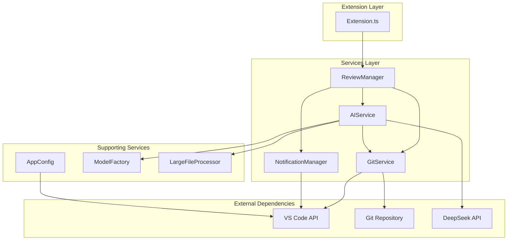

**Diagram sources**
- [extension.ts](file://src/extension.ts#L20-L97)
- [reviewManager.ts](file://src/services/review/reviewManager.ts#L79-L88)
- [aiService.ts](file://src/services/ai/aiService.ts#L40-L65)

**Section sources**
- [extension.ts](file://src/extension.ts#L20-L97)
- [reviewManager.ts](file://src/services/review/reviewManager.ts#L79-L88)

## ReviewManager Service

The ReviewManager serves as the central orchestrator for the code review process, managing the lifecycle of review sessions and coordinating between Git, AI, and notification services.

### Core Responsibilities

The ReviewManager handles several critical functions:

- **Repository Management**: Initializes and maintains Git repository connections
- **Commit Selection**: Manages selection and caching of Git commits
- **Review Session Coordination**: Orchestrates file review processes
- **Data Aggregation**: Collects and manages review data across multiple files
- **Report Generation**: Creates comprehensive markdown reports from review results

### Service Architecture

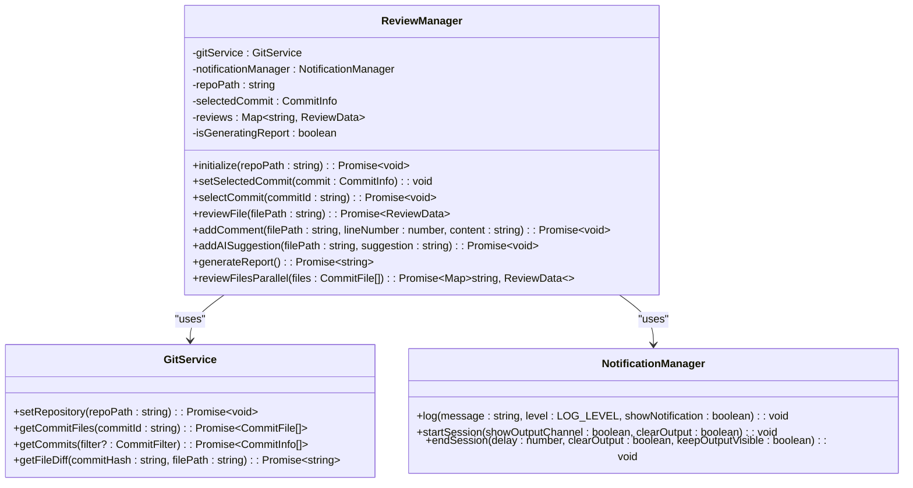

**Diagram sources**
- [reviewManager.ts](file://src/services/review/reviewManager.ts#L79-L88)
- [gitService.ts](file://src/services/git/gitService.ts#L45-L55)
- [notificationManager.ts](file://src/services/notification/notificationManager.ts#L8-L29)

### Key Features

#### Parallel File Processing
The ReviewManager implements sophisticated parallel processing capabilities using batch operations:

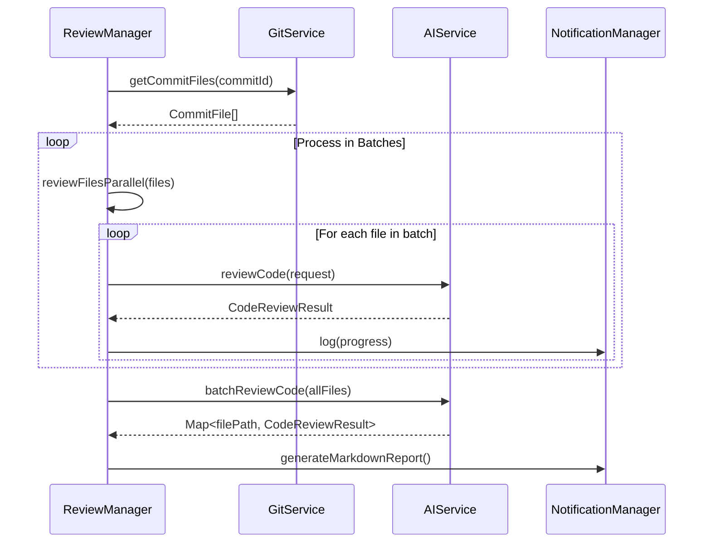

**Diagram sources**
- [reviewManager.ts](file://src/services/review/reviewManager.ts#L329-L369)
- [reviewManager.ts](file://src/services/review/reviewManager.ts#L475-L550)

#### Error Context Management
The ReviewManager provides comprehensive error tracking with contextual information:

| Error Context | Purpose | Recovery Strategy |
|---------------|---------|------------------|
| `initialize` | Repository initialization failures | Path validation and Git presence checks |
| `setSelectedCommit` | Commit selection errors | Hash validation and existence verification |
| `selectCommit` | Commit retrieval issues | Fallback to cached data and manual refresh |
| `reviewFile` | File review preparation | File type validation and accessibility checks |
| `generateReport` | Report generation failures | Incremental processing and partial results |

**Section sources**
- [reviewManager.ts](file://src/services/review/reviewManager.ts#L28-L76)
- [reviewManager.ts](file://src/services/review/reviewManager.ts#L111-L206)

## AIService Service

The AIService handles all AI-related operations, serving as the primary interface for code analysis and review generation. It implements a robust architecture with support for multiple AI models and intelligent caching mechanisms.

### Core Architecture

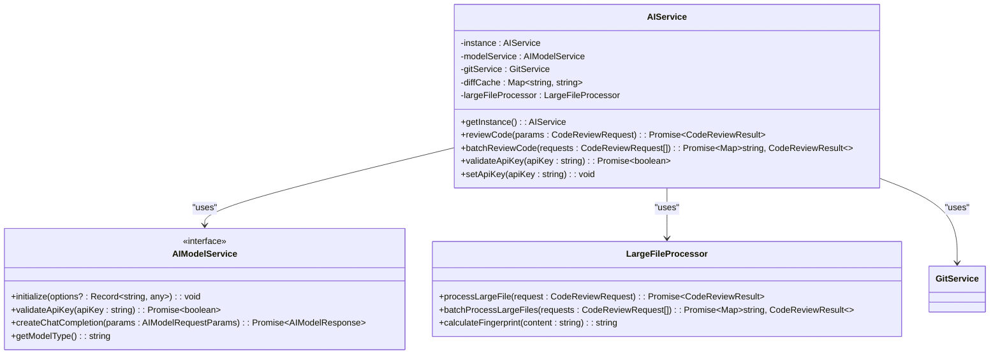

**Diagram sources**
- [aiService.ts](file://src/services/ai/aiService.ts#L40-L65)
- [modelInterface.ts](file://src/models/modelInterface.ts#L39-L57)
- [largeFileProcessor.ts](file://src/core/compression/largeFileProcessor.ts#L23-L42)

### Advanced Features

#### Intelligent Diff Generation
The AIService implements a sophisticated diff generation system with multiple fallback strategies:

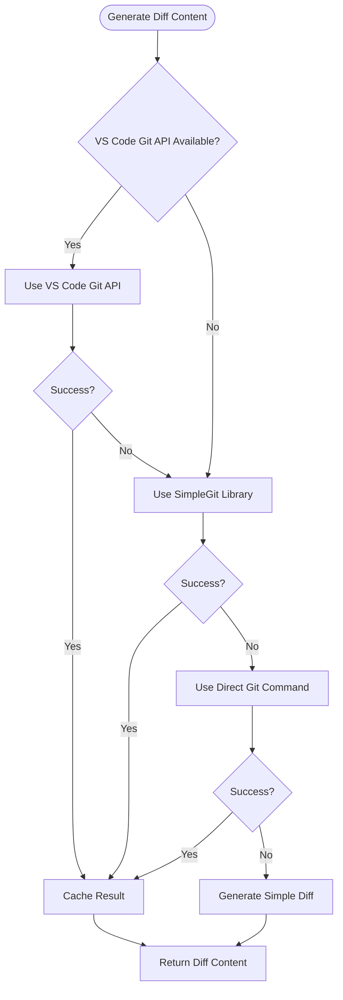

**Diagram sources**
- [aiService.ts](file://src/services/ai/aiService.ts#L125-L239)
- [gitService.ts](file://src/services/git/gitService.ts#L707-L794)

#### Batch Processing Optimization
The AIService supports intelligent batch processing for improved performance:

| Processing Mode | Use Case | Token Limit | Performance Gain |
|----------------|----------|-------------|------------------|
| Individual Files | Small files (< 10KB) | N/A | Baseline |
| Batch Full File Analysis | Medium files (10-100KB) | 8,000 tokens | 3-5x faster |
| Large File Processing | Large files (> 100KB) | Variable | Compression-based |

**Section sources**
- [aiService.ts](file://src/services/ai/aiService.ts#L431-L552)
- [aiService.ts](file://src/services/ai/aiService.ts#L125-L239)

## GitService Service

The GitService provides comprehensive Git repository interaction capabilities with multiple fallback strategies and performance optimizations.

### Service Capabilities

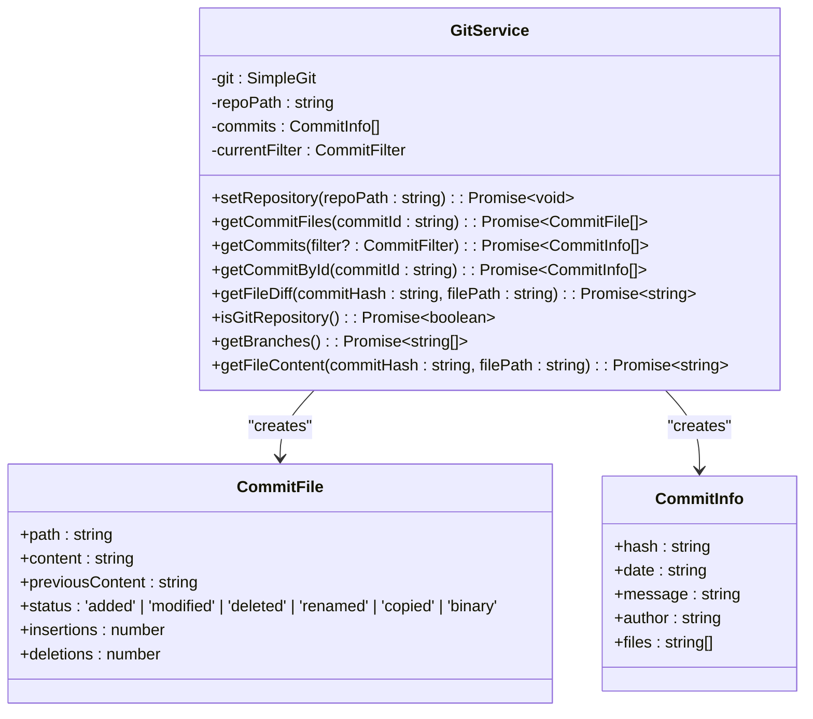

**Diagram sources**
- [gitService.ts](file://src/services/git/gitService.ts#L45-L55)
- [gitService.ts](file://src/services/git/gitService.ts#L19-L35)

### Multi-Strategy Approach

The GitService implements a layered approach for reliability and performance:

#### Strategy 1: VS Code Git API (Fastest)
- **Priority**: Highest
- **Method**: `repo.diffWithHEAD(uri)`
- **Benefits**: Native VS Code integration, optimal performance
- **Fallback**: Automatic when unavailable

#### Strategy 2: SimpleGit Library (Reliable)
- **Priority**: Medium
- **Method**: `git.diff()` with unified format
- **Benefits**: Consistent behavior across environments
- **Fallback**: When VS Code API fails

#### Strategy 3: Direct Git Commands (Fallback)
- **Priority**: Lowest
- **Method**: `git show` and `git diff` commands
- **Benefits**: Works in any Git environment
- **Fallback**: When library methods fail

**Section sources**
- [gitService.ts](file://src/services/git/gitService.ts#L707-L794)
- [gitService.ts](file://src/services/git/gitService.ts#L367-L406)

## NotificationManager Service

The NotificationManager provides comprehensive user feedback and logging capabilities through VS Code's native notification systems.

### Service Architecture

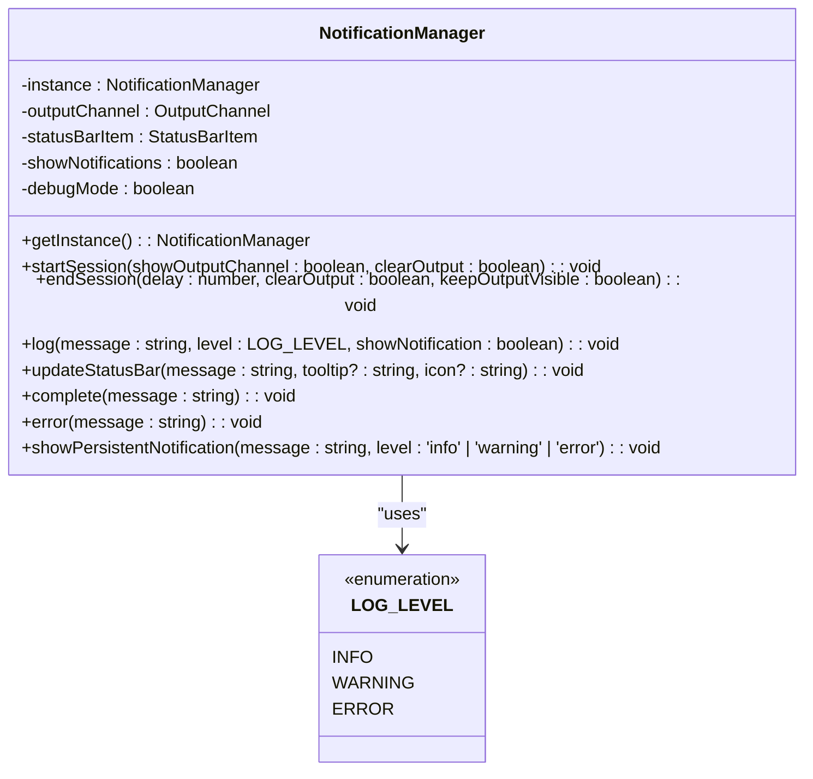

**Diagram sources**
- [notificationManager.ts](file://src/services/notification/notificationManager.ts#L8-L29)

### Notification Strategies

The NotificationManager implements multiple notification strategies based on context and importance:

| Notification Type | Trigger Condition | VS Code Method | Persistence |
|------------------|-------------------|----------------|-------------|
| Progress Updates | File processing | Status Bar | Temporary |
| Information | General operations | Info Message | Modal |
| Warnings | Non-critical issues | Warning Message | Modal |
| Errors | Critical failures | Error Message | Persistent |
| Debug | Development mode | Console Log | N/A |

### Session Management

The NotificationManager provides sophisticated session lifecycle management:

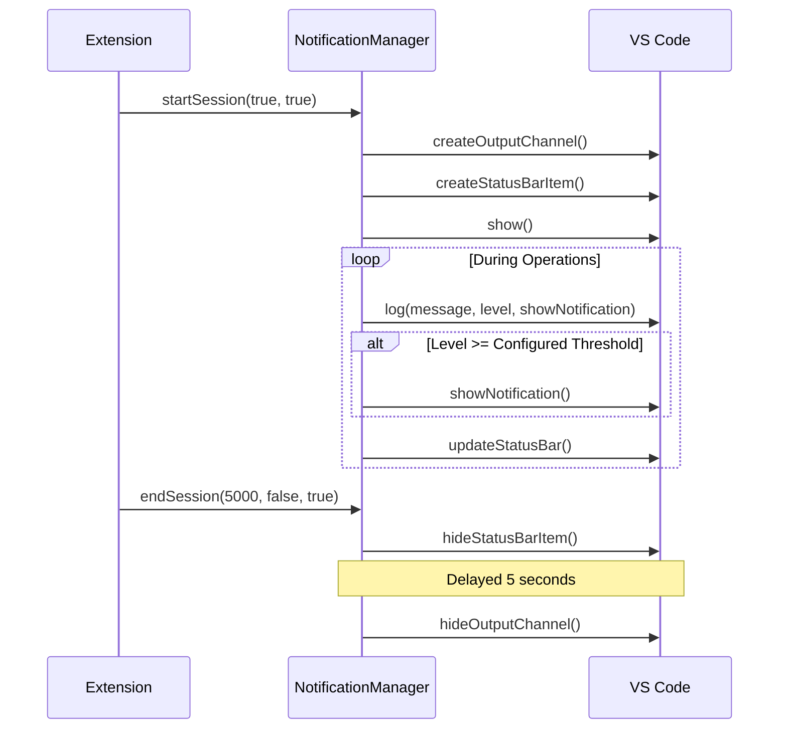

**Diagram sources**
- [notificationManager.ts](file://src/services/notification/notificationManager.ts#L36-L64)
- [extension.ts](file://src/extension.ts#L22-L24)

**Section sources**
- [notificationManager.ts](file://src/services/notification/notificationManager.ts#L36-L64)
- [notificationManager.ts](file://src/services/notification/notificationManager.ts#L79-L121)

## Service Dependencies and Lifecycle

The CodeKarmic services follow a carefully orchestrated initialization pattern with clear dependency relationships and lifecycle management.

### Initialization Order

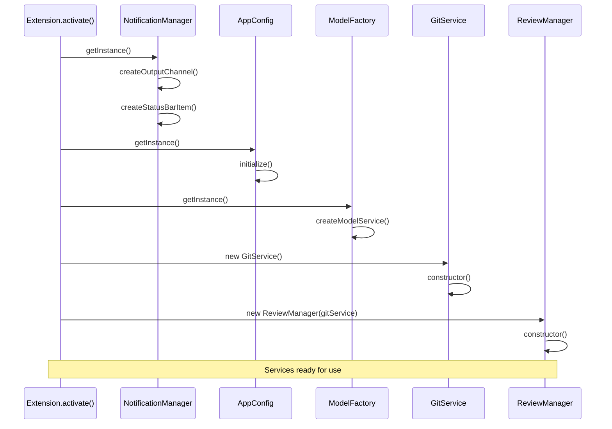

**Diagram sources**
- [extension.ts](file://src/extension.ts#L20-L97)
- [notificationManager.ts](file://src/services/notification/notificationManager.ts#L24-L29)
- [appConfig.ts](file://src/config/appConfig.ts#L49-L88)

### Dependency Injection Pattern

The services utilize a combination of constructor injection and singleton patterns:

| Service | Constructor Dependencies | Singleton Instance | Lazy Initialization |
|---------|------------------------|-------------------|-------------------|
| ReviewManager | `GitService` | Yes | On first use |
| AIService | `ModelFactory`, `AppConfig` | Yes | On first use |
| GitService | None | Yes | On `setRepository()` |
| NotificationManager | None | Yes | On first use |

### Lifecycle Management

Each service follows specific lifecycle patterns:

#### ReviewManager Lifecycle
1. **Construction**: Receives GitService dependency
2. **Initialization**: Calls `initialize(repoPath)` with workspace path
3. **Runtime**: Processes review requests and generates reports
4. **Cleanup**: Automatic cleanup through VS Code extension deactivation

#### AIService Lifecycle
1. **Singleton Creation**: First access creates instance
2. **Model Service Initialization**: Creates AI model service based on configuration
3. **Lazy Loading**: GitService and LargeFileProcessor initialized on demand
4. **Caching**: Model services cached for reuse with same configuration

**Section sources**
- [extension.ts](file://src/extension.ts#L68-L73)
- [reviewManager.ts](file://src/services/review/reviewManager.ts#L90-L93)
- [aiService.ts](file://src/services/ai/aiService.ts#L40-L72)

## Integration Patterns

The services layer demonstrates several sophisticated integration patterns that enable seamless collaboration between components.

### Orchestration Pattern

The ReviewManager implements the orchestration pattern, coordinating multiple services for complex workflows:

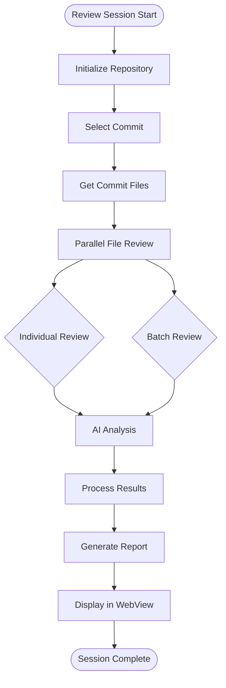

**Diagram sources**
- [reviewManager.ts](file://src/services/review/reviewManager.ts#L329-L369)
- [reviewManager.ts](file://src/services/review/reviewManager.ts#L475-L550)

### Facade Pattern

The AIService acts as a facade, simplifying complex AI interactions:

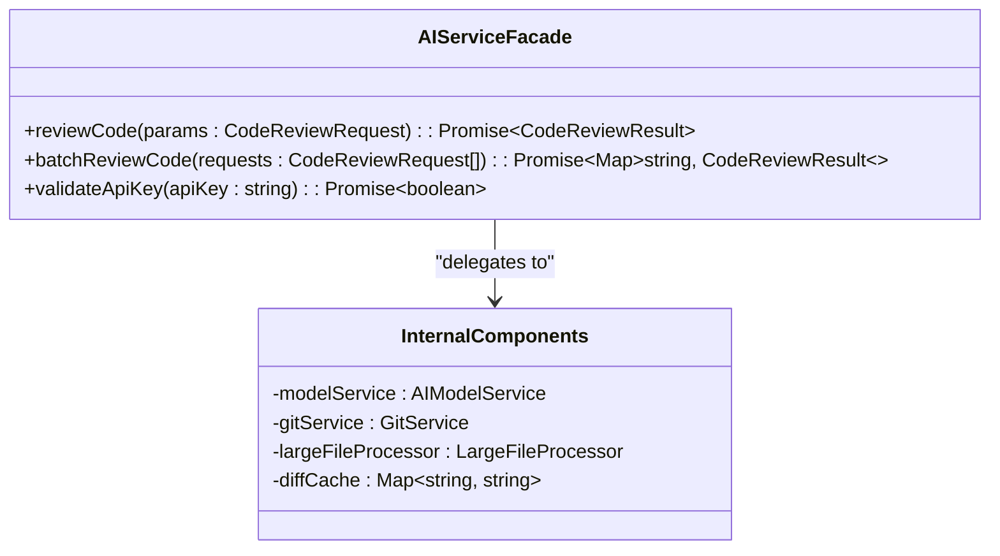

**Diagram sources**
- [aiService.ts](file://src/services/ai/aiService.ts#L74-L119)

### Strategy Pattern

The GitService implements the strategy pattern for different Git operations:

| Strategy | Priority | Method | Use Case |
|----------|----------|--------|----------|
| VS Code Git API | Highest | `diffWithHEAD()` | Fastest, native integration |
| SimpleGit Library | Medium | `git.diff()` | Reliable, cross-platform |
| Direct Git Commands | Lowest | `execAsync('git ...')` | Fallback, universal |

**Section sources**
- [reviewManager.ts](file://src/services/review/reviewManager.ts#L475-L550)
- [aiService.ts](file://src/services/ai/aiService.ts#L74-L119)
- [gitService.ts](file://src/services/git/gitService.ts#L707-L794)

## Error Handling and Best Practices

The services layer implements comprehensive error handling strategies with graceful degradation and user-friendly error reporting.

### Error Handling Strategies

#### Graceful Degradation
Each service implements fallback mechanisms to ensure system stability:

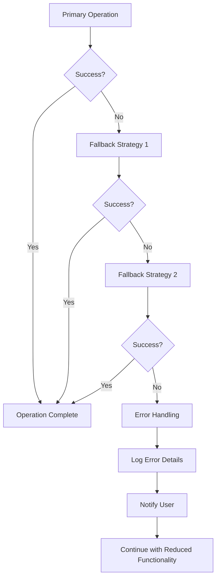

#### Error Context Preservation
The ReviewManager maintains detailed error context for debugging:

| Error Context | Information Captured | Recovery Action |
|---------------|---------------------|-----------------|
| `initialize` | Repository path, Git availability | Path validation, Git installation check |
| `selectCommit` | Commit hash, network status | Local cache, manual refresh |
| `reviewFile` | File path, permissions, content | File type validation, content fallback |
| `generateReport` | Processing stage, resource usage | Incremental processing, partial results |

### Best Practices

#### Service Initialization
1. **Lazy Initialization**: Services are initialized only when needed
2. **Dependency Validation**: Required dependencies are validated before use
3. **Resource Cleanup**: Proper cleanup during extension deactivation

#### Error Reporting
1. **Contextual Logging**: Errors include relevant context information
2. **User-Friendly Messages**: Technical errors are translated to user-understandable messages
3. **Progress Tracking**: Long-running operations provide progress updates

#### Performance Optimization
1. **Caching**: Frequently accessed data is cached appropriately
2. **Batch Processing**: Multiple operations are batched for efficiency
3. **Parallel Execution**: Independent operations run concurrently

**Section sources**
- [reviewManager.ts](file://src/services/review/reviewManager.ts#L101-L109)
- [aiService.ts](file://src/services/ai/aiService.ts#L691-L710)
- [gitService.ts](file://src/services/git/gitService.ts#L66-L89)

## Performance Considerations

The services layer implements several performance optimization strategies to ensure responsive user experience even with large repositories and complex analysis tasks.

### Optimization Strategies

#### Concurrent Processing
The ReviewManager implements sophisticated concurrent processing:

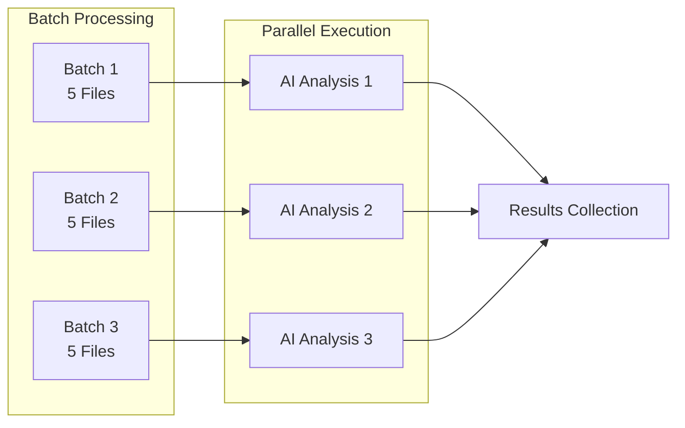

**Diagram sources**
- [reviewManager.ts](file://src/services/review/reviewManager.ts#L329-L369)

#### Intelligent Caching
Multiple caching strategies are employed:

| Cache Type | Scope | Duration | Benefits |
|------------|-------|----------|----------|
| Diff Cache | File content fingerprints | Session lifetime | Avoids redundant Git operations |
| Model Service Cache | API configurations | Until configuration changes | Reduces initialization overhead |
| Commit Cache | Repository metadata | Until repository changes | Faster commit retrieval |
| Large File Cache | Compressed content | Until content changes | Efficient large file processing |

#### Resource Management
1. **Memory Optimization**: Large file content is processed in chunks
2. **Network Efficiency**: API requests are batched and rate-limited
3. **CPU Utilization**: Heavy computations are performed asynchronously

### Performance Metrics

| Operation | Typical Duration | Optimization Applied |
|-----------|------------------|---------------------|
| Single File Review | 5-15 seconds | Streaming responses, caching |
| Batch File Review | 2-5 seconds/file | Parallel processing, batch API |
| Large File Processing | 10-30 seconds | Compression, chunked processing |
| Commit Retrieval | 100-500ms | Caching, lazy loading |

**Section sources**
- [reviewManager.ts](file://src/services/review/reviewManager.ts#L329-L369)
- [aiService.ts](file://src/services/ai/aiService.ts#L431-L552)
- [largeFileProcessor.ts](file://src/core/compression/largeFileProcessor.ts#L160-L225)