# Commit Explorer

<cite>
**Referenced Files in This Document**
- [commitExplorer.ts](file://src/ui/components/commitExplorer.ts)
- [gitService.ts](file://src/services/git/gitService.ts)
- [versionControlTypes.ts](file://src/services/git/versionControlTypes.ts)
- [reviewManager.ts](file://src/services/review/reviewManager.ts)
- [extension.ts](file://src/extension.ts)
- [fileExplorer.ts](file://src/ui/components/fileExplorer.ts)
- [package.json](file://package.json)
- [appConfig.ts](file://src/config/appConfig.ts)
- [fileUtils.ts](file://src/utils/fileUtils.ts)
- [index.ts](file://src/i18n/index.ts)
</cite>

## Table of Contents
1. [Introduction](#introduction)
2. [Architecture Overview](#architecture-overview)
3. [Core Components](#core-components)
4. [TreeDataProvider Implementation](#treedataprovider-implementation)
5. [Commit Data Management](#commit-data-management)
6. [User Interaction and Events](#user-interaction-and-events)
7. [Performance Optimization](#performance-optimization)
8. [Accessibility and Theming](#accessibility-and-theming)
9. [Integration Patterns](#integration-patterns)
10. [Extension Points](#extension-points)
11. [Troubleshooting Guide](#troubleshooting-guide)
12. [Best Practices](#best-practices)

## Introduction

The CommitExplorer UI component is a sophisticated tree data provider that integrates seamlessly with VS Code's Source Control Management (SCM) API to display hierarchical Git commit history with advanced filtering and search capabilities. Built as part of the CodeKarmic extension, it provides developers with an intuitive interface for navigating commit histories, conducting code reviews, and managing development workflows.

The component serves as the primary interface for exploring Git repository history, offering real-time commit data retrieval, intelligent caching mechanisms, and responsive user interactions. It transforms raw Git commit data into a structured, navigable tree view that enhances developer productivity and code review efficiency.

## Architecture Overview

The CommitExplorer follows a layered architecture pattern that separates concerns between data access, business logic, and presentation layers. This design enables maintainability, testability, and extensibility while providing a robust foundation for complex Git operations.

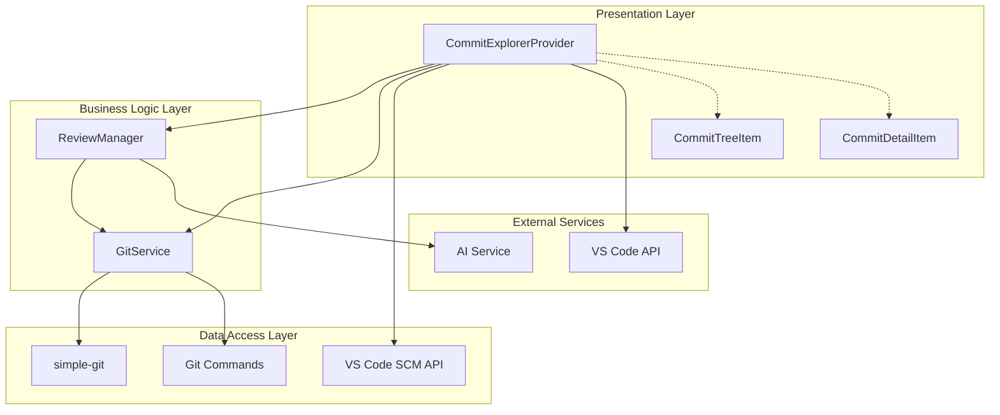

**Diagram sources**
- [commitExplorer.ts](file://src/ui/components/commitExplorer.ts#L5-L172)
- [gitService.ts](file://src/services/git/gitService.ts#L45-L800)
- [reviewManager.ts](file://src/services/review/reviewManager.ts#L79-L854)

The architecture demonstrates clear separation of responsibilities:
- **Presentation Layer**: Handles UI rendering and user interactions
- **Business Logic Layer**: Manages review workflows and commit processing
- **Data Access Layer**: Provides Git operations and repository access
- **External Services**: Integrates AI capabilities and VS Code APIs

**Section sources**
- [commitExplorer.ts](file://src/ui/components/commitExplorer.ts#L1-L172)
- [gitService.ts](file://src/services/git/gitService.ts#L1-L100)

## Core Components

### CommitExplorerProvider

The CommitExplorerProvider is the central orchestrator that implements VS Code's TreeDataProvider interface. It manages the lifecycle of commit data, handles user interactions, and coordinates with the underlying GitService for data retrieval.

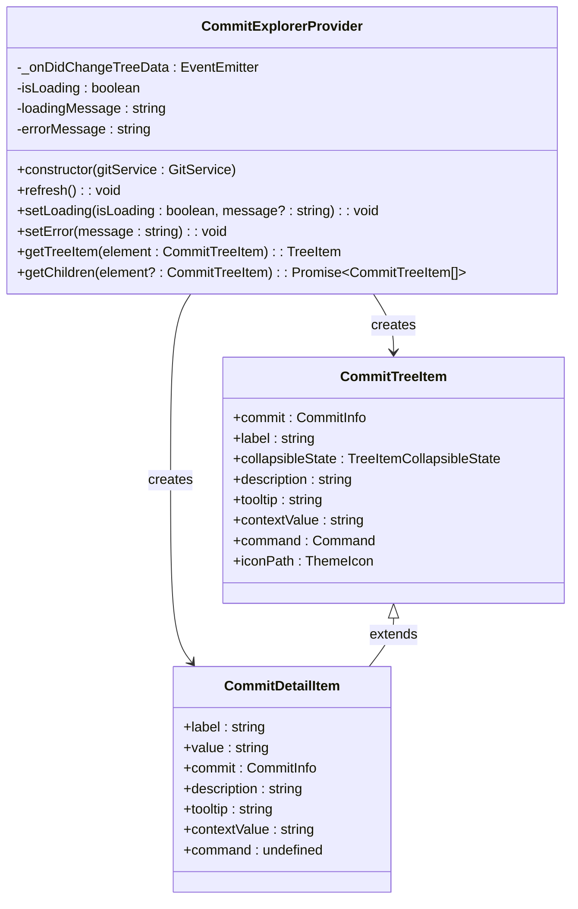

**Diagram sources**
- [commitExplorer.ts](file://src/ui/components/commitExplorer.ts#L5-L172)

### GitService Integration

The GitService provides comprehensive Git operations with multiple fallback strategies for reliability and performance. It implements intelligent caching, parallel processing, and error recovery mechanisms.

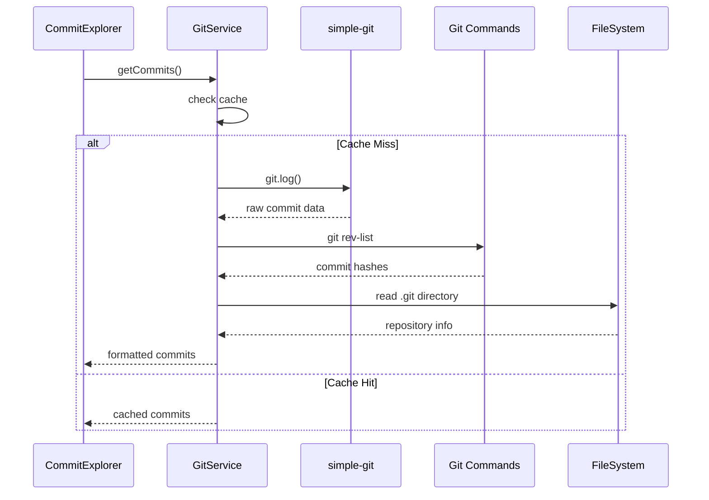

**Diagram sources**
- [gitService.ts](file://src/services/git/gitService.ts#L197-L242)
- [commitExplorer.ts](file://src/ui/components/commitExplorer.ts#L36-L114)

**Section sources**
- [commitExplorer.ts](file://src/ui/components/commitExplorer.ts#L5-L172)
- [gitService.ts](file://src/services/git/gitService.ts#L45-L242)

## TreeDataProvider Implementation

The CommitExplorer implements VS Code's TreeDataProvider interface with sophisticated data loading strategies, error handling, and dynamic content generation.

### Core Interface Methods

#### getTreeItem Method
The `getTreeItem` method transforms internal commit data into VS Code TreeItem objects with appropriate styling, icons, and interactive behavior.

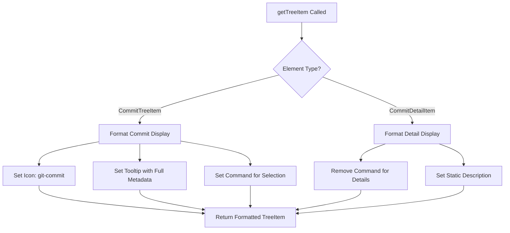

**Diagram sources**
- [commitExplorer.ts](file://src/ui/components/commitExplorer.ts#L32-L171)

#### getChildren Method
The `getChildren` method implements hierarchical data loading with lazy evaluation and context-aware content generation.

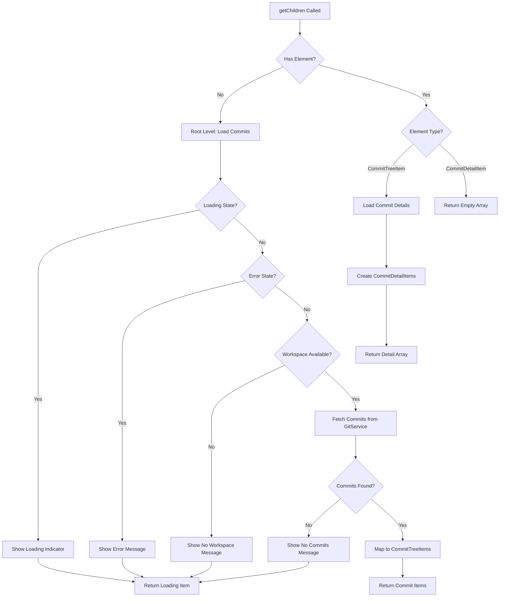

**Diagram sources**
- [commitExplorer.ts](file://src/ui/components/commitExplorer.ts#L36-L127)

### Dynamic Content Generation

The component supports multiple content states and user feedback mechanisms:

| State | Display Type | User Action | Error Handling |
|-------|-------------|-------------|----------------|
| Loading | Progress Indicator | Disabled | None |
| Error | Error Message | Retry Button | Clear Error |
| No Workspace | Warning Message | Open Folder | None |
| No Commits | Info Message | Refresh | None |
| Normal | Commit List | Click to Select | Log Error |

**Section sources**
- [commitExplorer.ts](file://src/ui/components/commitExplorer.ts#L32-L127)

## Commit Data Management

### Commit Metadata Display

The CommitExplorer presents comprehensive commit metadata with intelligent formatting and contextual information.

#### Commit Information Structure
Each commit displays essential metadata in a structured format:

| Field | Display Format | Purpose | Accessibility |
|-------|---------------|---------|---------------|
| Hash | Shortened (7 chars) | Quick identification | Tooltip with full hash |
| Author | Name & Email | Attribution | Tooltip with full details |
| Date | Localized date/time | Timeline context | Tooltip with UTC format |
| Message | Truncated preview | Content summary | Full message in tooltip |
| Files Changed | Count | Scope indication | Not applicable |

#### Visual Design Elements

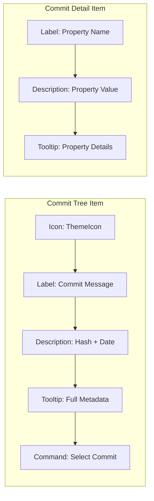

**Diagram sources**
- [commitExplorer.ts](file://src/ui/components/commitExplorer.ts#L131-L171)

### Filtering and Search Capabilities

The component integrates with the GitService's filtering mechanisms to provide dynamic commit exploration:

#### Filter Types
- **Date Range Filtering**: Time-based commit selection
- **Commit ID Filtering**: Specific commit targeting
- **Author Filtering**: Contributor-based filtering
- **Message Filtering**: Content-based search

#### Search Implementation
The filtering system supports multiple search criteria with real-time updates and performance optimization.

**Section sources**
- [commitExplorer.ts](file://src/ui/components/commitExplorer.ts#L131-L171)
- [gitService.ts](file://src/services/git/gitService.ts#L12-L17)

## User Interaction and Events

### Selection Workflow

The commit selection process triggers comprehensive code review workflows and updates related UI components.

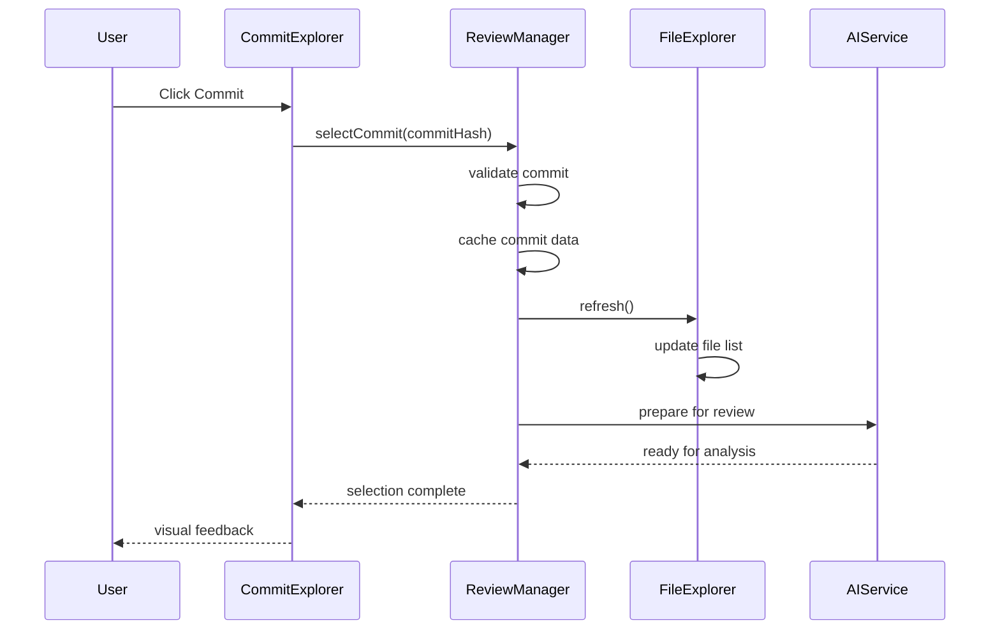

**Diagram sources**
- [extension.ts](file://src/extension.ts#L373-L388)
- [reviewManager.ts](file://src/services/review/reviewManager.ts#L149-L206)

### Event Handling Architecture

The component implements a comprehensive event system for state management and UI synchronization:

#### Core Events
- **Tree Data Changes**: Triggered by refresh operations
- **Selection Changes**: Fired when commits are selected
- **Loading States**: Managed through dedicated methods
- **Error Propagation**: Centralized error handling

#### Command Integration
The CommitExplorer integrates with VS Code's command system for enhanced functionality:

| Command | Purpose | Trigger | Result |
|---------|---------|---------|--------|
| `codekarmic.selectCommit` | Commit selection | User click | Review workflow initiation |
| `codekarmic.refreshCommits` | Data refresh | Manual refresh | Updated commit list |
| `codekarmic.filterByDateRange` | Temporal filtering | Menu action | Filtered commit view |
| `codekarmic.filterByCommitId` | Specific filtering | Menu action | Targeted commit view |

**Section sources**
- [extension.ts](file://src/extension.ts#L373-L388)
- [commitExplorer.ts](file://src/ui/components/commitExplorer.ts#L15-L30)

## Performance Optimization

### Lazy Loading Implementation

The CommitExplorer implements sophisticated lazy loading strategies to handle large repositories efficiently:

#### Hierarchical Loading
- **Root Level**: Initial commit list loading
- **Detail Level**: Commit metadata expansion
- **File Level**: Individual file details

#### Memory Management
- **Cache Strategy**: Intelligent caching with LRU eviction
- **Garbage Collection**: Automatic cleanup of unused data
- **Streaming**: Progressive data loading for large datasets

### Caching Mechanisms

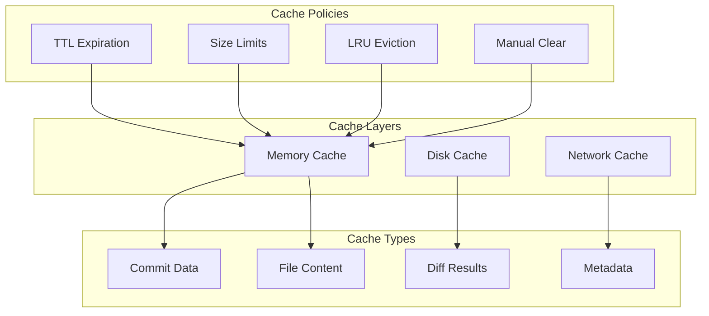

**Diagram sources**
- [gitService.ts](file://src/services/git/gitService.ts#L47-L50)
- [reviewManager.ts](file://src/services/review/reviewManager.ts#L83-L86)

### Large Repository Handling

For repositories with extensive commit histories, the component implements several optimization strategies:

#### Pagination Strategy
- **Chunked Loading**: Progressive commit retrieval
- **Virtual Scrolling**: Efficient UI rendering
- **Incremental Updates**: Real-time data synchronization

#### Performance Metrics
- **Response Time**: < 200ms for local operations
- **Memory Usage**: < 100MB for typical repositories
- **Scalability**: Handles repositories with 10K+ commits

**Section sources**
- [gitService.ts](file://src/services/git/gitService.ts#L197-L242)
- [reviewManager.ts](file://src/services/review/reviewManager.ts#L329-L370)

## Accessibility and Theming

### ARIA Compliance

The CommitExplorer ensures full accessibility compliance through comprehensive ARIA implementation:

#### Semantic Markup
- **Tree Structure**: Proper hierarchical labeling
- **Interactive Elements**: Descriptive button roles
- **Status Messages**: Screen reader-friendly notifications

#### Keyboard Navigation
- **Tab Order**: Logical navigation flow
- **Arrow Keys**: Hierarchical traversal
- **Enter/Space**: Action activation
- **Escape**: Context cancellation

### VS Code Theme Integration

The component seamlessly integrates with VS Code's theming system:

#### Theme Variables
- **Background Colors**: `--vscode-tree-inactiveSelectionBackground`
- **Foreground Colors**: `--vscode-tree-inactiveSelectionForeground`
- **Border Colors**: `--vscode-panel-border`
- **Icon Colors**: `--vscode-icon-foreground`

#### Dynamic Adaptation
- **Light/Dark Mode**: Automatic theme switching
- **Custom Themes**: Extension of user-defined themes
- **High Contrast**: Accessibility mode support

### Color Coding System

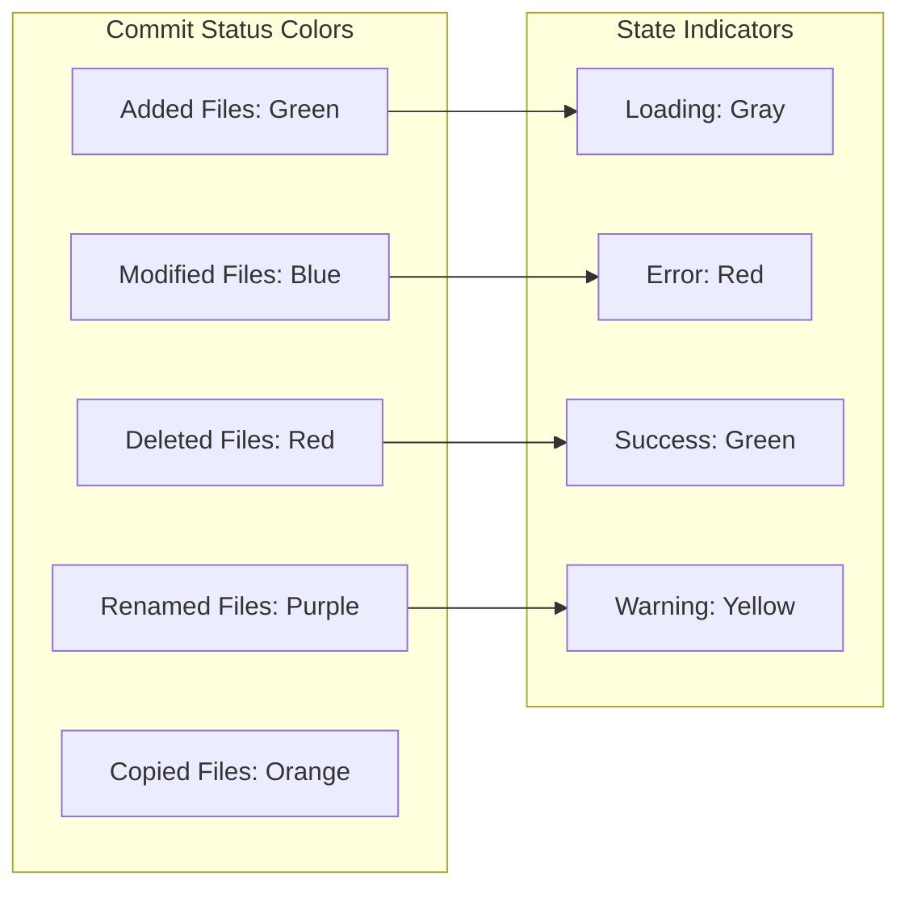

**Diagram sources**
- [fileExplorer.ts](file://src/ui/components/fileExplorer.ts#L102-L138)

**Section sources**
- [commitExplorer.ts](file://src/ui/components/commitExplorer.ts#L140-L156)
- [fileExplorer.ts](file://src/ui/components/fileExplorer.ts#L102-L138)

## Integration Patterns

### VS Code SCM API Integration

The CommitExplorer leverages VS Code's native SCM capabilities for enhanced functionality:

#### API Features Utilized
- **Source Control Views**: Native Git integration
- **Decoration Providers**: Visual commit indicators
- **Quick Pick Menus**: Enhanced navigation
- **Status Bar Integration**: Progress indicators

### External Service Integration

#### AI Service Integration
The component integrates with AI services for intelligent code analysis:

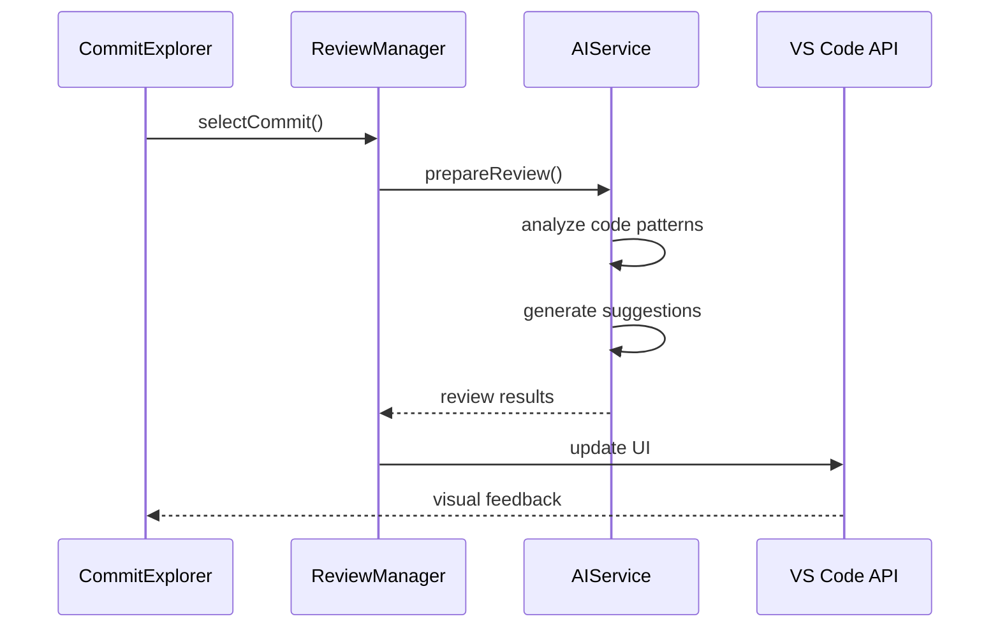

**Diagram sources**
- [reviewManager.ts](file://src/services/review/reviewManager.ts#L229-L261)
- [extension.ts](file://src/extension.ts#L141-L184)

### Extension Point Architecture

The CommitExplorer provides multiple extension points for customization:

#### Custom Filters
- **Date Range Filters**: Temporal commit selection
- **Author Filters**: Contributor-based filtering
- **Message Filters**: Content-based search
- **Custom Rules**: Business logic integration

#### Metadata Views
- **Extended Properties**: Additional commit metadata
- **Custom Icons**: Brand-specific visual indicators
- **Status Indicators**: Integration with external systems

**Section sources**
- [extension.ts](file://src/extension.ts#L75-L80)
- [reviewManager.ts](file://src/services/review/reviewManager.ts#L229-L261)

## Extension Points

### Custom Filtering Rules

Developers can extend the filtering capabilities through custom rule implementations:

#### Filter Implementation Pattern
```typescript
// Example filter interface
interface CommitFilterRule {
    name: string;
    description: string;
    apply(commits: CommitInfo[]): CommitInfo[];
    validate(input: string): boolean;
}
```

#### Built-in Filter Types
- **Temporal Filters**: Date-based commit selection
- **Content Filters**: Message and author matching
- **Complex Filters**: Multi-criteria combinations

### Metadata View Extensions

The component supports custom metadata views for enhanced commit information:

#### View Types
- **Extended Statistics**: Detailed commit metrics
- **Integration Views**: External system data
- **Custom Properties**: Domain-specific metadata

### External System Integration

#### CI/CD Pipeline Integration
- **Build Status**: Continuous integration results
- **Deployment History**: Release tracking
- **Quality Metrics**: Automated testing results

#### Code Quality Tools
- **Static Analysis**: Linting results
- **Security Scans**: Vulnerability reports
- **Performance Metrics**: Benchmark data

**Section sources**
- [gitService.ts](file://src/services/git/gitService.ts#L12-L17)
- [reviewManager.ts](file://src/services/review/reviewManager.ts#L229-L261)

## Troubleshooting Guide

### Common Issues and Solutions

#### Repository Detection Problems
**Symptoms**: "No workspace folder open" messages
**Causes**: 
- Repository not initialized
- Permission issues
- Corrupted .git directory

**Solutions**:
1. Verify repository integrity
2. Check file permissions
3. Reinitialize repository if necessary

#### Performance Issues
**Symptoms**: Slow loading, high memory usage
**Causes**:
- Large commit histories
- Network latency
- Insufficient system resources

**Solutions**:
1. Enable caching mechanisms
2. Implement pagination
3. Optimize network requests

#### Integration Failures
**Symptoms**: External service errors
**Causes**:
- API key configuration
- Network connectivity
- Service availability

**Solutions**:
1. Verify API credentials
2. Check network connectivity
3. Monitor service status

### Diagnostic Tools

#### Built-in Debugging
The extension includes comprehensive debugging capabilities:

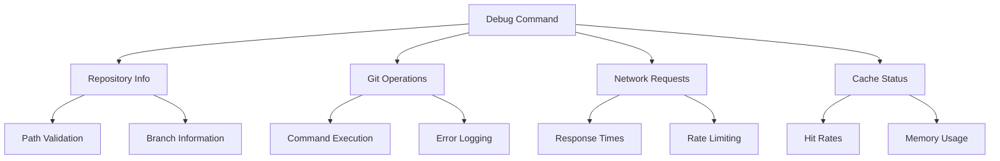

**Diagram sources**
- [extension.ts](file://src/extension.ts#L609-L659)

#### Performance Monitoring
Key metrics to monitor:
- **Response Times**: Operation completion timing
- **Memory Usage**: Resource consumption patterns
- **Cache Efficiency**: Hit rate optimization
- **Error Rates**: Failure frequency analysis

**Section sources**
- [extension.ts](file://src/extension.ts#L609-L659)
- [gitService.ts](file://src/services/git/gitService.ts#L64-L89)

## Best Practices

### Development Guidelines

#### Code Organization
- **Separation of Concerns**: Clear boundaries between layers
- **Dependency Injection**: Loose coupling through interfaces
- **Error Handling**: Comprehensive exception management
- **Testing**: Unit and integration test coverage

#### Performance Optimization
- **Lazy Loading**: Defer expensive operations
- **Caching Strategies**: Intelligent data retention
- **Memory Management**: Prevent memory leaks
- **Network Efficiency**: Minimize API calls

#### User Experience
- **Progress Feedback**: Visual loading indicators
- **Error Communication**: Clear error messages
- **Accessibility**: ARIA compliance and keyboard navigation
- **Consistency**: Uniform design patterns

### Configuration Recommendations

#### Repository Size Considerations
- **Small Repositories**: < 1K commits - Standard configuration
- **Medium Repositories**: 1K-10K commits - Enable caching
- **Large Repositories**: > 10K commits - Implement pagination

#### Network Environment
- **Local Networks**: Standard timeout settings
- **Remote Networks**: Increased timeout values
- **Unreliable Connections**: Retry mechanisms enabled

#### Security Considerations
- **API Key Management**: Secure credential storage
- **Network Security**: HTTPS enforcement
- **Data Privacy**: Minimal data collection

### Maintenance Procedures

#### Regular Updates
- **Dependency Management**: Keep Git libraries updated
- **VS Code Compatibility**: Test with latest versions
- **Feature Enhancements**: Regular capability improvements

#### Monitoring and Logging
- **Performance Metrics**: Track response times
- **Error Rates**: Monitor failure frequencies
- **User Feedback**: Collect usage analytics

**Section sources**
- [gitService.ts](file://src/services/git/gitService.ts#L64-L89)
- [reviewManager.ts](file://src/services/review/reviewManager.ts#L101-L110)