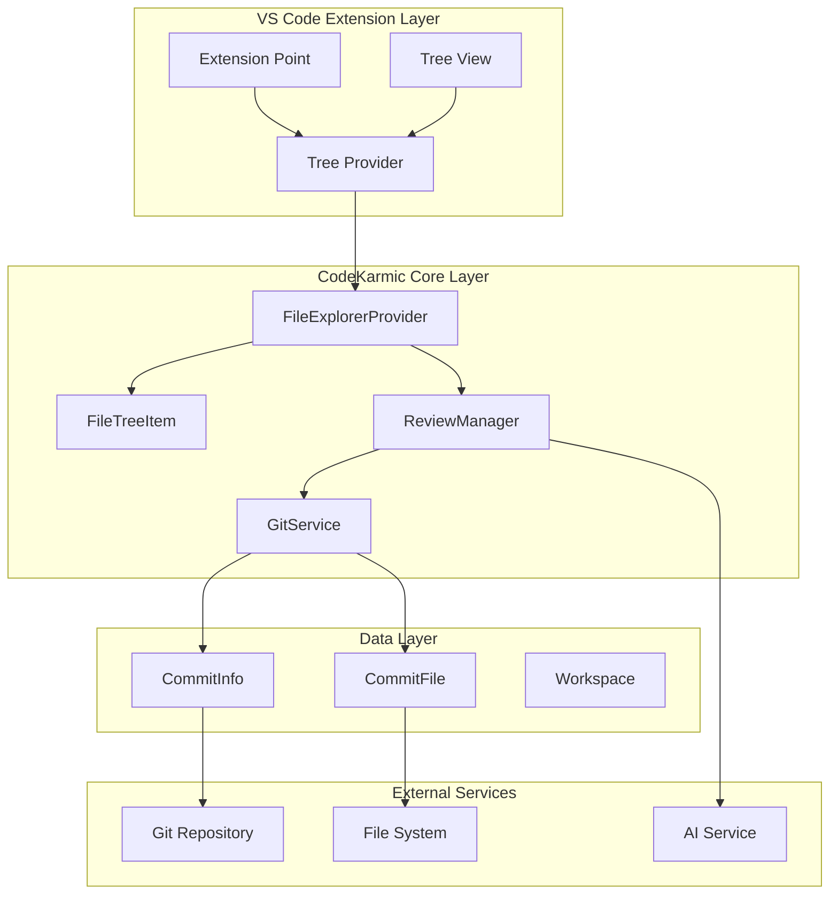
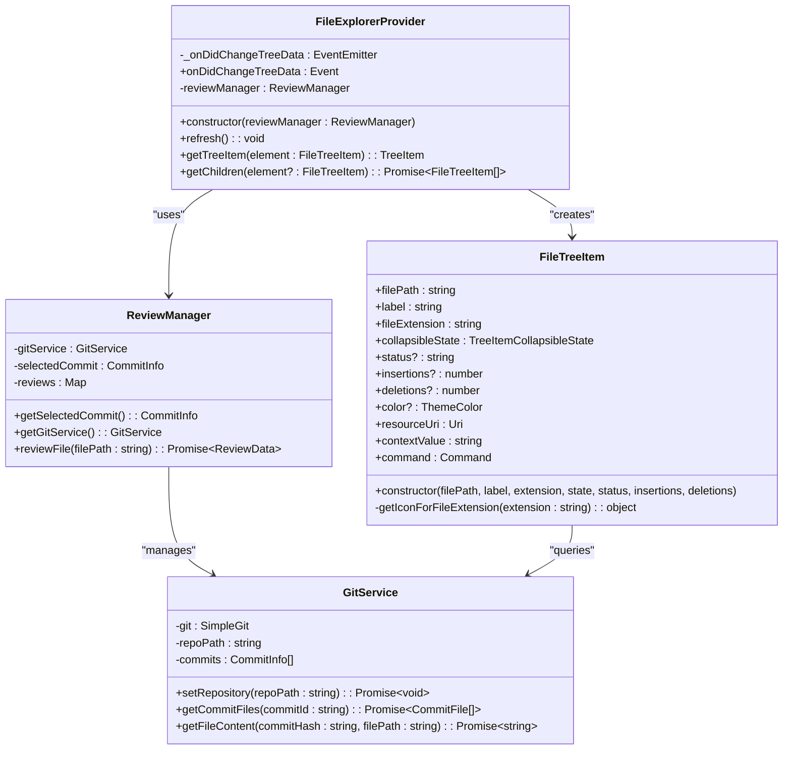
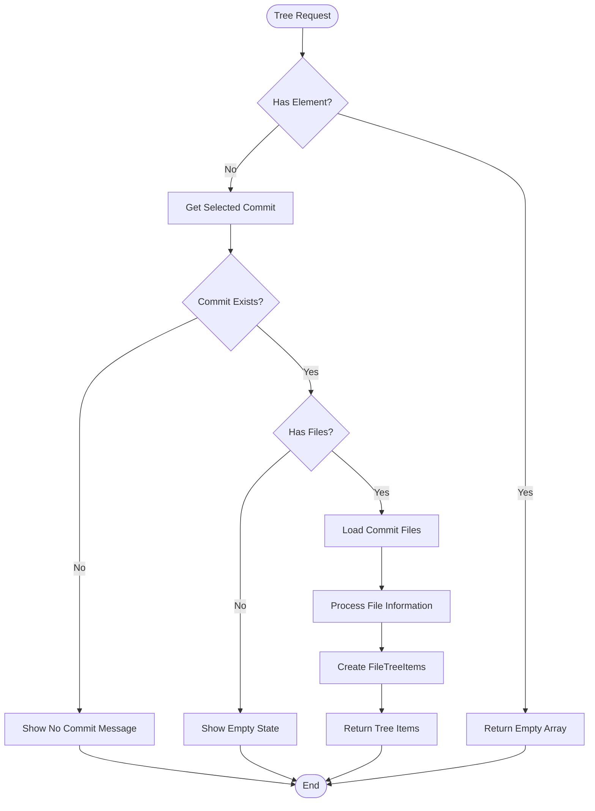
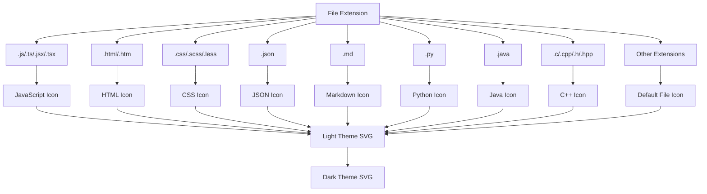
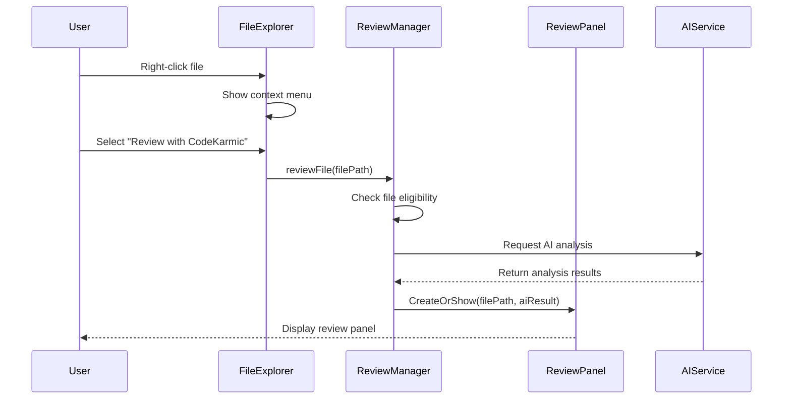
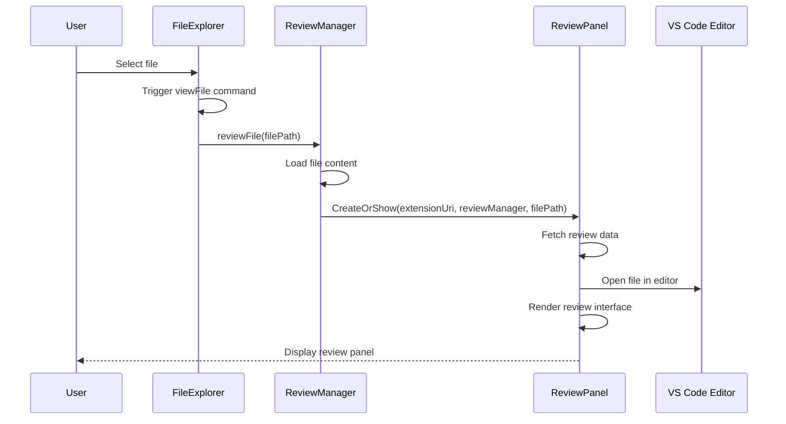
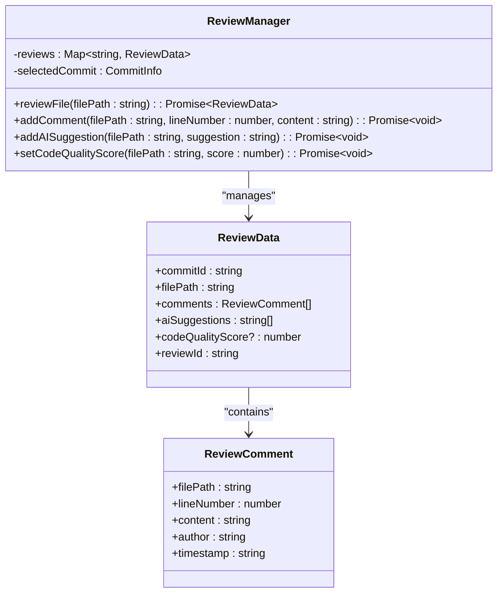

# File Explorer

<cite>
**Referenced Files in This Document**
- [fileExplorer.ts](file://src/ui/components/fileExplorer.ts)
- [reviewPanel.ts](file://src/ui/views/reviewPanel.ts)
- [gitService.ts](file://src/services/git/gitService.ts)
- [reviewManager.ts](file://src/services/review/reviewManager.ts)
- [extension.ts](file://src/extension.ts)
- [package.json](file://package.json)
- [deepseek.ts](file://src/models/providers/deepseek.ts)
- [index.ts](file://src/i18n/index.ts)
</cite>

## Table of Contents
1. [Introduction](#introduction)
2. [Architecture Overview](#architecture-overview)
3. [Core Components](#core-components)
4. [Tree Data Provider Implementation](#tree-data-provider-implementation)
5. [File Status and Icon System](#file-status-and-icon-system)
6. [Context Menu Actions](#context-menu-actions)
7. [Integration with Review Panel](#integration-with-review-panel)
8. [Performance Considerations](#performance-considerations)
9. [Accessibility Features](#accessibility-features)
10. [Customization and Theming](#customization-and-theming)
11. [Advanced Features](#advanced-features)
12. [Troubleshooting Guide](#troubleshooting-guide)

## Introduction

The FileExplorer UI component is a sophisticated tree-based file browser within the CodeKarmic VS Code extension that displays files changed in selected Git commits. It provides developers with an intuitive interface for navigating through code changes, understanding file modifications, and initiating code reviews. The component leverages VS Code's TreeView API to deliver a native, responsive user experience with comprehensive file status indicators and intelligent file categorization.

Built as part of CodeKarmic's AI-powered code review platform, the FileExplorer serves as the primary navigation interface for reviewing Git commit changes. It transforms raw Git diff data into an organized, visually appealing tree structure that highlights file modifications, additions, and deletions while maintaining contextual information about each change.

## Architecture Overview

The FileExplorer follows a layered architecture pattern that separates concerns between data management, presentation, and user interaction. The component integrates seamlessly with VS Code's extension ecosystem while maintaining CodeKarmic's core functionality.

**Diagram sources**
- [fileExplorer.ts](file://src/ui/components/fileExplorer.ts#L6-L14)
- [reviewManager.ts](file://src/services/review/reviewManager.ts#L79-L93)
- [gitService.ts](file://src/services/git/gitService.ts#L45-L65)

The architecture ensures clean separation of responsibilities while enabling efficient data flow between components. The FileExplorerProvider acts as the central orchestrator, coordinating between VS Code's TreeView API and CodeKarmic's internal services.

**Section sources**
- [fileExplorer.ts](file://src/ui/components/fileExplorer.ts#L1-L224)
- [extension.ts](file://src/extension.ts#L75-L79)

## Core Components

### FileExplorerProvider Class

The FileExplorerProvider serves as the primary data provider for the VS Code TreeView, implementing the `vscode.TreeDataProvider<FileTreeItem>` interface. This class manages the tree structure lifecycle and coordinates with the ReviewManager to fetch and display file change information.

**Diagram sources**
- [fileExplorer.ts](file://src/ui/components/fileExplorer.ts#L6-L14)
- [fileExplorer.ts](file://src/ui/components/fileExplorer.ts#L101-L174)
- [reviewManager.ts](file://src/services/review/reviewManager.ts#L79-L93)
- [gitService.ts](file://src/services/git/gitService.ts#L45-L65)

### FileTreeItem Class

The FileTreeItem extends VS Code's native TreeItem class to provide enhanced functionality for displaying file information. Each instance represents a single file in the tree structure, containing metadata about the file's status, changes, and visual representation.

Key features of FileTreeItem include:
- **Dynamic Icon System**: Automatically selects appropriate icons based on file extension and modification status
- **Status Indicators**: Visual representation of file changes (added, modified, deleted, renamed, copied, binary)
- **Change Statistics**: Display of insertions and deletions counts for modified files
- **Interactive Commands**: Click-to-open functionality linking to the ReviewPanel
- **Theme Integration**: Automatic adaptation to VS Code's light/dark themes

**Section sources**
- [fileExplorer.ts](file://src/ui/components/fileExplorer.ts#L101-L224)

## Tree Data Provider Implementation

The FileExplorer implements VS Code's TreeDataProvider interface with sophisticated logic for handling hierarchical file structures and dynamic content updates.

### Data Loading Strategy

The tree data provider employs a lazy-loading approach to optimize performance, especially for repositories with extensive file histories:

**Diagram sources**
- [fileExplorer.ts](file://src/ui/components/fileExplorer.ts#L20-L97)

### Hierarchical Organization

The FileExplorer organizes files in a flat structure at the root level, displaying all changed files from the selected commit. While this approach simplifies navigation, it maintains clear visual distinctions between different file types and statuses.

The tree structure supports the following organizational patterns:
- **Flat File List**: All files appear at the root level for easy browsing
- **Status Grouping**: Files are grouped by modification status (added, modified, deleted)
- **Type Categorization**: Visual differentiation based on file extensions
- **Size Indicators**: Change statistics for modified files

**Section sources**
- [fileExplorer.ts](file://src/ui/components/fileExplorer.ts#L20-L97)

## File Status and Icon System

The FileExplorer implements a comprehensive file status and icon system that provides immediate visual feedback about file changes and their nature.

### Status Classification

Files are classified into six distinct categories, each represented by specific visual indicators:

| Status | Symbol | Description | Visual Indicator |
|--------|--------|-------------|------------------|
| Added | `[A]` | New files in the commit | Green icon with plus sign |
| Modified | `[M]` | Changed files with differences | Blue icon with edit symbol |
| Deleted | `[D]` | Removed files from the commit | Red icon with minus sign |
| Renamed | `[R]` | Files moved or renamed | Yellow icon with arrow |
| Copied | `[C]` | Files duplicated in the commit | Purple icon with copy symbol |
| Binary | `[B]` | Binary files (images, executables) | Special binary file icon |

### Icon Mapping System

The FileExplorer uses a sophisticated icon mapping system that automatically selects appropriate icons based on file extensions:

**Diagram sources**
- [fileExplorer.ts](file://src/ui/components/fileExplorer.ts#L176-L222)

### Dynamic Icon Selection

The icon system adapts to VS Code's theme preferences, automatically selecting appropriate icons for both light and dark themes. This ensures consistent visual appearance regardless of the user's theme preference.

**Section sources**
- [fileExplorer.ts](file://src/ui/components/fileExplorer.ts#L122-L161)
- [fileExplorer.ts](file://src/ui/components/fileExplorer.ts#L176-L222)

## Context Menu Actions

The FileExplorer integrates with VS Code's context menu system to provide powerful actions for file review and analysis. These actions are accessible through right-click operations and keyboard shortcuts.

### Available Actions

The context menu provides several key actions for interacting with files:

| Action | Command | Description | Trigger |
|--------|---------|-------------|---------|
| Review with CodeKarmic | `codekarmic.reviewExplorerItem` | Initiates AI-powered code review | Right-click → Review with CodeKarmic |
| View File | `codekarmic.viewFile` | Opens file in editor | Double-click or context menu |
| Review Selected Items | `codekarmic.reviewSelectedItems` | Reviews multiple selected items | Explorer context menu |

### Action Implementation

The review action demonstrates sophisticated integration with CodeKarmic's AI capabilities:

**Diagram sources**
- [fileExplorer.ts](file://src/ui/components/fileExplorer.ts#L169-L173)
- [reviewPanel.ts](file://src/ui/views/reviewPanel.ts#L78-L124)

### Keyboard Shortcuts

The FileExplorer supports standard VS Code keyboard navigation patterns:
- **Enter/Space**: Activate selected item
- **Ctrl/Cmd+Click**: Multi-selection
- **F2**: Rename (if applicable)
- **Delete**: Delete file (if applicable)

**Section sources**
- [extension.ts](file://src/extension.ts#L391-L402)
- [package.json](file://package.json#L273-L279)

## Integration with Review Panel

The FileExplorer seamlessly integrates with the ReviewPanel to provide a comprehensive code review workflow. This integration enables smooth transitions between file browsing and detailed analysis.

### File Selection Workflow

When a user selects a file in the FileExplorer, the system initiates a coordinated workflow:

**Diagram sources**
- [fileExplorer.ts](file://src/ui/components/fileExplorer.ts#L169-L173)
- [reviewPanel.ts](file://src/ui/views/reviewPanel.ts#L78-L124)

### Data Synchronization

The integration maintains synchronized state between the FileExplorer and ReviewPanel:
- **File Path Tracking**: The ReviewPanel maintains the currently reviewed file path
- **Review State Persistence**: Comments and suggestions persist across file switches
- **AI Analysis Results**: Pre-computed AI analysis results are passed to the ReviewPanel
- **Change Propagation**: Updates in the ReviewPanel reflect in the FileExplorer

### Review Data Management

The ReviewManager handles the complex task of managing review data across multiple files and commits:

**Diagram sources**
- [reviewManager.ts](file://src/services/review/reviewManager.ts#L11-L26)
- [reviewManager.ts](file://src/services/review/reviewManager.ts#L27-L36)

**Section sources**
- [reviewPanel.ts](file://src/ui/views/reviewPanel.ts#L78-L124)
- [reviewManager.ts](file://src/services/review/reviewManager.ts#L229-L261)

## Performance Considerations

The FileExplorer is designed to handle repositories with extensive file histories efficiently, implementing several optimization strategies to maintain responsiveness.

### Memory Management

The component employs careful memory management techniques:
- **Lazy Loading**: Files are loaded only when needed, reducing initial memory footprint
- **Weak References**: Temporary objects are garbage-collected promptly
- **Batch Processing**: Large file sets are processed in manageable batches
- **Cache Invalidation**: Stale data is cleared when repositories change

### Rendering Optimization

Several strategies optimize rendering performance:
- **Virtual Scrolling**: Only visible items are rendered in the tree view
- **Icon Caching**: File icons are cached to avoid repeated file system access
- **Debounced Updates**: Frequent updates are debounced to prevent excessive re-rendering
- **Incremental Loading**: Large file lists are loaded incrementally

### Large Repository Support

The FileExplorer handles large repositories through:
- **Pagination**: Large file lists are paginated for better performance
- **Filtering**: Unnecessary files can be filtered out of the display
- **Compression**: Large file contents are compressed for display
- **Streaming**: Large datasets are streamed rather than loaded entirely

### Concurrent Operations

The system manages concurrent operations safely:
- **Mutex Locks**: Critical sections are protected against race conditions
- **Promise Queuing**: Asynchronous operations are queued appropriately
- **Timeout Handling**: Long-running operations have appropriate timeouts
- **Error Recovery**: Failed operations are gracefully handled

**Section sources**
- [reviewManager.ts](file://src/services/review/reviewManager.ts#L329-L369)
- [gitService.ts](file://src/services/git/gitService.ts#L110-L177)

## Accessibility Features

The FileExplorer incorporates comprehensive accessibility features to ensure usability for developers with diverse needs and preferences.

### Screen Reader Support

The component provides full screen reader compatibility:
- **ARIA Labels**: All interactive elements have descriptive ARIA labels
- **Semantic Markup**: Proper HTML structure for screen readers
- **Focus Management**: Logical focus order through the tree structure
- **Status Announcements**: Changes in file status are announced to screen readers

### Keyboard Navigation

Complete keyboard navigation support includes:
- **Arrow Keys**: Navigate through tree nodes
- **Tab/Shift+Tab**: Move between interactive elements
- **Enter**: Activate selected items
- **Space**: Toggle selection (if applicable)
- **Home/End**: Jump to tree boundaries
- **Page Up/Down**: Navigate large tree structures quickly

### Visual Accessibility

Visual accessibility features include:
- **High Contrast**: Works with high contrast themes
- **Zoom Support**: Respects user zoom preferences
- **Color Independence**: Information conveyed through multiple modalities
- **Focus Indicators**: Clear visual indication of focused elements

### Cognitive Accessibility

Features to aid cognitive accessibility:
- **Clear Visual Hierarchy**: Consistent visual organization
- **Predictable Patterns**: Standard interaction patterns
- **Error Messages**: Clear, actionable error messages
- **Help Text**: Contextual help available for complex operations

**Section sources**
- [fileExplorer.ts](file://src/ui/components/fileExplorer.ts#L101-L174)

## Customization and Theming

The FileExplorer supports extensive customization options to adapt to different development environments and personal preferences.

### Theme Integration

Full integration with VS Code's theming system:
- **Automatic Theme Detection**: Adapts to light/dark theme changes
- **Color Scheme Compatibility**: Works with custom color schemes
- **Icon Theme Support**: Compatible with various icon themes
- **Font Size Adaptation**: Responsive to user font size preferences

### File Type Customization

Users can customize file type recognition:
- **Extension Mapping**: Override default file type associations
- **Custom Icons**: Define custom icons for specific file types
- **Status Colors**: Customize colors for different file statuses
- **Priority Ordering**: Adjust display priority for file types

### Layout Customization

Layout options for different workflows:
- **Compact Mode**: Reduced spacing for dense displays
- **Expanded Mode**: More detailed information display
- **Icon Only**: Minimalist view showing only icons
- **Text Only**: Text-focused view for accessibility

### Behavior Customization

Behavioral customization options:
- **Auto-refresh**: Configure automatic refresh intervals
- **Preview Mode**: Enable preview of file changes without full review
- **Diff Display**: Customize how differences are shown
- **Notification Preferences**: Control notification verbosity

**Section sources**
- [fileExplorer.ts](file://src/ui/components/fileExplorer.ts#L176-L222)

## Advanced Features

The FileExplorer includes several advanced features that enhance its functionality for complex development scenarios.

### Binary File Handling

Special handling for binary files:
- **Detection**: Automatic detection of binary file types
- **Placeholder Display**: Shows appropriate placeholders for binary files
- **Size Information**: Displays file size for binary files
- **Limited Interaction**: Prevents inappropriate operations on binary files

### Large File Support

Sophisticated handling of large files:
- **Content Truncation**: Large files are truncated for display
- **Sampling Algorithms**: Intelligent sampling for large files
- **Compression**: Content is compressed for efficient display
- **Streaming**: Large files are streamed rather than loaded entirely

### Nested Directory Structures

Efficient handling of complex directory structures:
- **Hierarchical Display**: Maintains directory structure in tree view
- **Collapse/Expand**: Users can collapse/expand directory nodes
- **Search Integration**: Search works across nested structures
- **Bulk Operations**: Support for operations on entire directories

### Diff Analysis Integration

Advanced diff analysis capabilities:
- **Side-by-Side Comparison**: Visual comparison of changes
- **Unified Diff View**: Traditional unified diff format
- **Change Statistics**: Detailed statistics on modifications
- **Hunk Navigation**: Easy navigation between change hunks

### External Tool Integration

Integration with external diff tools:
- **Tool Detection**: Automatic detection of installed diff tools
- **Custom Tool Support**: Configuration of custom diff tools
- **Tool Launch**: Direct launch of external diff tools
- **Result Import**: Import results from external tools

**Section sources**
- [gitService.ts](file://src/services/git/gitService.ts#L110-L177)
- [reviewManager.ts](file://src/services/review/reviewManager.ts#L229-L261)

## Troubleshooting Guide

Common issues and their solutions when working with the FileExplorer component.

### Performance Issues

**Problem**: Slow loading with large repositories
**Solution**: 
- Reduce the number of excluded file types
- Increase the maximum file size limit
- Use filtering to focus on specific file types
- Consider using shallow clone for large repositories

**Problem**: Memory usage grows over time
**Solution**:
- Restart VS Code periodically
- Clear the review cache
- Reduce the number of concurrently open files
- Check for memory leaks in custom configurations

### Display Issues

**Problem**: Icons not displaying correctly
**Solution**:
- Verify icon theme compatibility
- Check file permissions for icon files
- Reset to default icon theme
- Clear VS Code cache

**Problem**: Incorrect file status display
**Solution**:
- Refresh the FileExplorer
- Check Git repository status
- Verify file encoding
- Reinitialize Git service

### Integration Issues

**Problem**: Review panel not opening
**Solution**:
- Check if AI service is configured
- Verify API key validity
- Ensure network connectivity
- Check for conflicting extensions

**Problem**: Context menu actions not working
**Solution**:
- Verify command registration
- Check VS Code version compatibility
- Review extension activation events
- Test with minimal configuration

### Configuration Issues

**Problem**: Customizations not taking effect
**Solution**:
- Restart VS Code after configuration changes
- Verify setting syntax
- Check for conflicting settings
- Reset to default configuration

**Problem**: Theme integration issues
**Solution**:
- Verify theme compatibility
- Check theme loading order
- Test with default theme
- Review custom theme configuration

**Section sources**
- [gitService.ts](file://src/services/git/gitService.ts#L45-L108)
- [reviewManager.ts](file://src/services/review/reviewManager.ts#L111-L129)