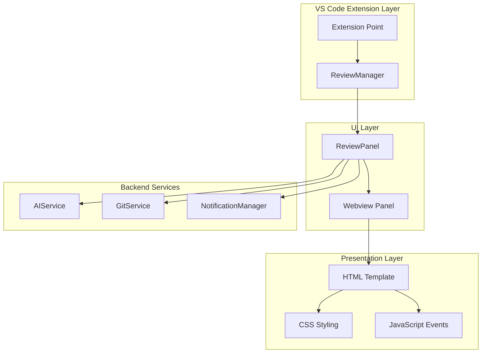
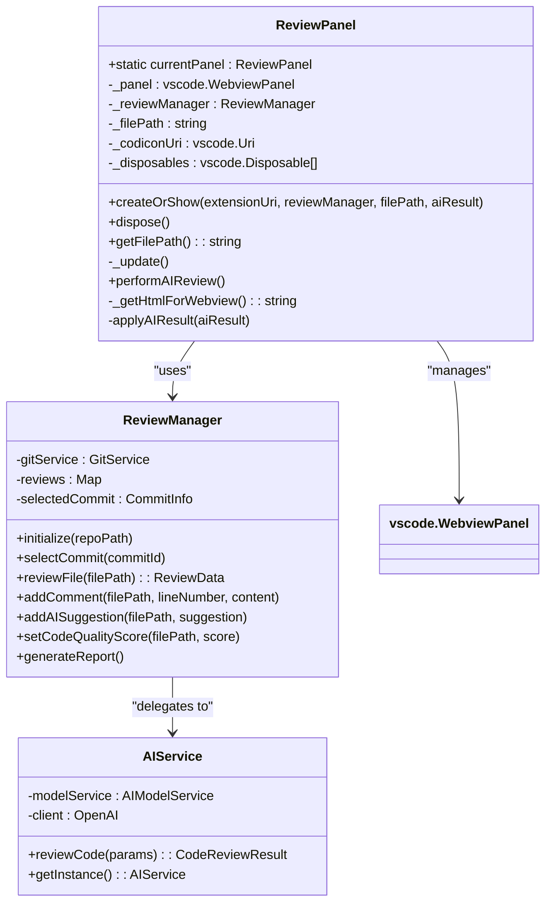
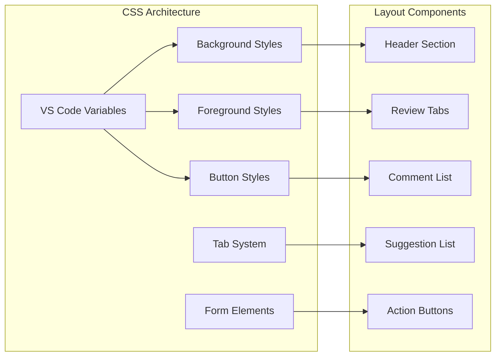
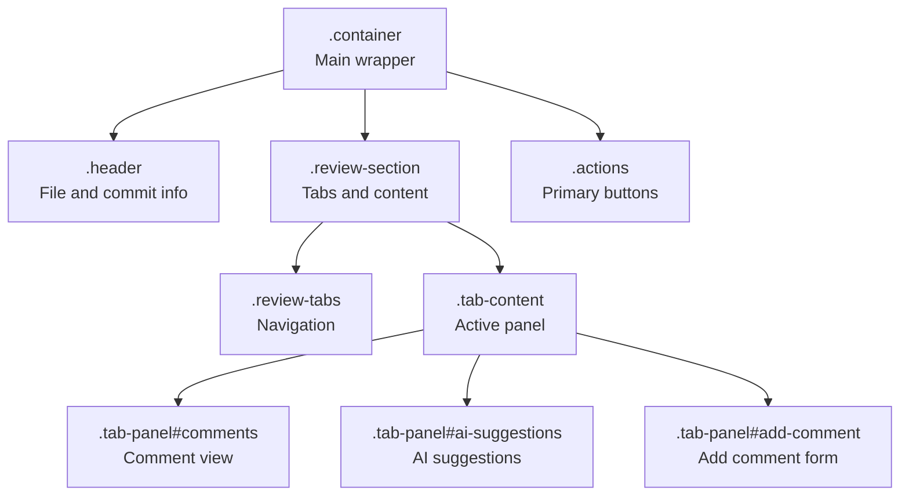
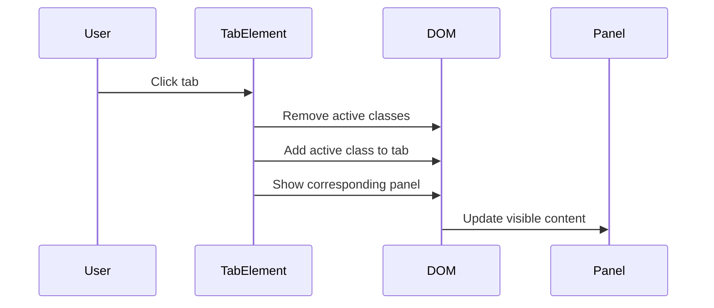
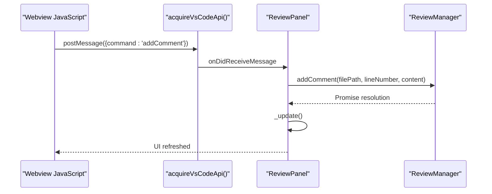
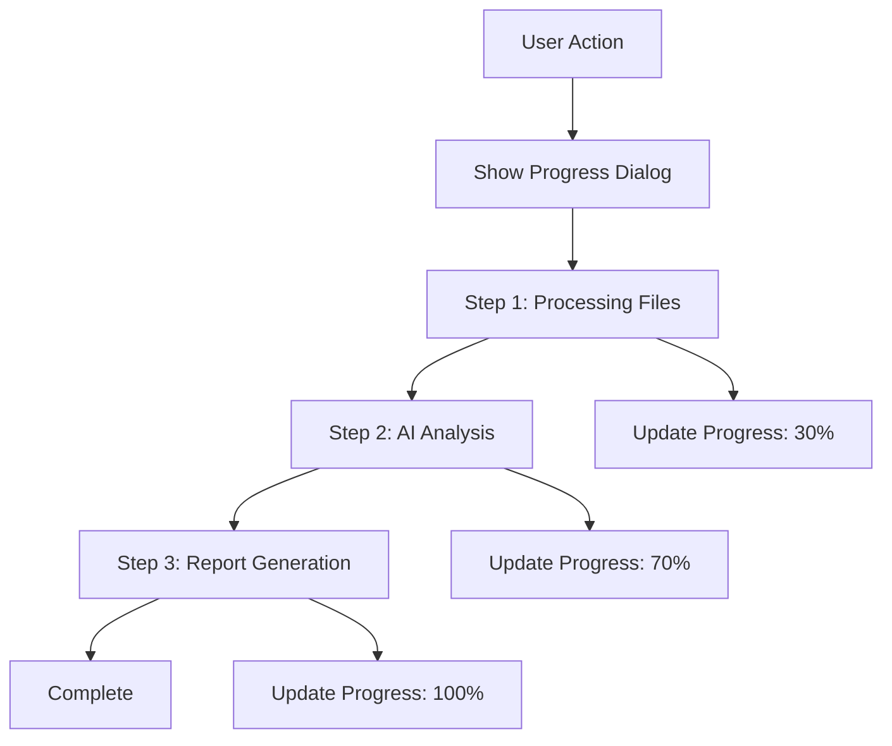
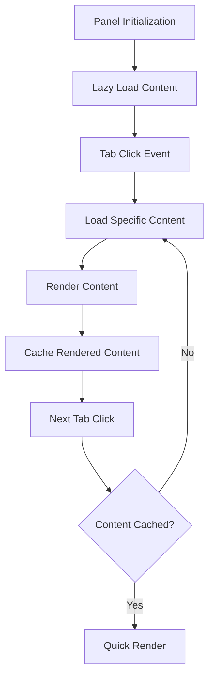

# Review Panel

<cite>
**Referenced Files in This Document**
- [reviewPanel.ts](file://src/ui/views/reviewPanel.ts)
- [reviewManager.ts](file://src/services/review/reviewManager.ts)
- [reviewTypes.ts](file://src/core/review/reviewTypes.ts)
- [aiService.ts](file://src/services/ai/aiService.ts)
- [extension.ts](file://src/extension.ts)
- [package.json](file://package.json)
</cite>

## Table of Contents
1. [Introduction](#introduction)
2. [Architecture Overview](#architecture-overview)
3. [Core Components](#core-components)
4. [HTML/CSS Structure](#htmlcss-structure)
5. [JavaScript Event Handling](#javascript-event-handling)
6. [Message Passing Communication](#message-passing-communication)
7. [Security Implementation](#security-implementation)
8. [Performance Considerations](#performance-considerations)
9. [Accessibility Features](#accessibility-features)
10. [Customization and Extension](#customization-and-extension)
11. [Troubleshooting Guide](#troubleshooting-guide)
12. [Conclusion](#conclusion)

## Introduction

The ReviewPanel UI component is a sophisticated VS Code webview panel that serves as the primary interface for displaying AI-generated code review results. Built using modern web technologies within the VS Code extension framework, it provides developers with an intuitive interface for reviewing code quality, receiving AI suggestions, and managing collaborative code reviews.

The panel implements a dual-mode architecture supporting both Git commit-based reviews and standalone file reviews, offering flexibility for different development workflows. It features interactive tabs, syntax highlighting, real-time feedback mechanisms, and seamless integration with the backend ReviewManager service.

## Architecture Overview

The ReviewPanel follows a layered architecture pattern that separates concerns between presentation, business logic, and data management:



**Diagram sources**
- [reviewPanel.ts](file://src/ui/views/reviewPanel.ts#L5-L10)
- [reviewManager.ts](file://src/services/review/reviewManager.ts#L79-L93)
- [extension.ts](file://src/extension.ts#L1-L50)

**Section sources**
- [reviewPanel.ts](file://src/ui/views/reviewPanel.ts#L1-L100)
- [reviewManager.ts](file://src/services/review/reviewManager.ts#L79-L150)

## Core Components

### ReviewPanel Class Structure

The ReviewPanel class serves as the main controller for the code review interface, implementing a singleton pattern to manage a single instance of the webview panel:



**Diagram sources**
- [reviewPanel.ts](file://src/ui/views/reviewPanel.ts#L5-L10)
- [reviewManager.ts](file://src/services/review/reviewManager.ts#L79-L93)
- [aiService.ts](file://src/services/ai/aiService.ts#L40-L72)

### State Management

The ReviewPanel manages several key states:

| State Property | Type | Purpose | Lifecycle |
|---------------|------|---------|-----------|
| `currentPanel` | `ReviewPanel \| undefined` | Singleton instance management | Static property |
| `_panel` | `vscode.WebviewPanel` | VS Code webview container | Constructor-initialized |
| `_reviewManager` | `ReviewManager` | Backend service communication | Constructor-initialized |
| `_filePath` | `string` | Currently reviewed file path | Dynamic updates |
| `_codiconUri` | `vscode.Uri \| undefined` | Icon resource URI | Constructor-initialized |

**Section sources**
- [reviewPanel.ts](file://src/ui/views/reviewPanel.ts#L5-L27)

## HTML/CSS Structure

### Responsive Design System

The ReviewPanel implements a comprehensive CSS styling system that adapts to VS Code's theme system and provides responsive layouts:



**Diagram sources**
- [reviewPanel.ts](file://src/ui/views/reviewPanel.ts#L260-L435)

### Theme Integration

The panel leverages VS Code's built-in theming system through CSS custom properties:

| Variable Category | Properties | Purpose |
|------------------|------------|---------|
| Editor Background | `--vscode-editor-background` | Main panel background |
| Editor Foreground | `--vscode-editor-foreground` | Text color |
| Description Foreground | `--vscode-descriptionForeground` | Secondary text |
| Button Background | `--vscode-button-background` | Interactive element backgrounds |
| Panel Border | `--vscode-panel-border` | Section dividers |
| Input Background | `--vscode-input-background` | Form field backgrounds |

### Layout Structure

The HTML template implements a hierarchical layout system:



**Diagram sources**
- [reviewPanel.ts](file://src/ui/views/reviewPanel.ts#L438-L513)

**Section sources**
- [reviewPanel.ts](file://src/ui/views/reviewPanel.ts#L260-L435)

## JavaScript Event Handling

### Interactive Tab System

The ReviewPanel implements a sophisticated tab switching mechanism using vanilla JavaScript:



**Diagram sources**
- [reviewPanel.ts](file://src/ui/views/reviewPanel.ts#L518-L529)

### Form Interaction Handlers

The panel includes comprehensive form validation and submission handling:

| Event Handler | Trigger | Validation | Action |
|--------------|---------|------------|--------|
| `submit-comment` | Comment form submission | Content and line number | Send to ReviewManager |
| `request-ai-review` | AI review button click | None | Initiate AI analysis |
| `generate-report` | Report generation button | Commit selection | Generate markdown report |

### Message Passing Protocol

The JavaScript side communicates with the backend through VS Code's webview messaging system:



**Diagram sources**
- [reviewPanel.ts](file://src/ui/views/reviewPanel.ts#L47-L72)

**Section sources**
- [reviewPanel.ts](file://src/ui/views/reviewPanel.ts#L514-L575)

## Message Passing Communication

### Command Protocol

The ReviewPanel implements a structured message passing protocol for bidirectional communication:

| Command | Direction | Parameters | Purpose |
|---------|-----------|------------|---------|
| `addComment` | Webview → Extension | `content`, `lineNumber` | Add user comment |
| `requestAIReview` | Webview → Extension | None | Initiate AI analysis |
| `generateReport` | Webview → Extension | None | Generate markdown report |
| `showError` | Extension → Webview | `message` | Display error notifications |

### Progress Indication

The panel integrates with VS Code's progress reporting system for long-running operations:



**Diagram sources**
- [reviewPanel.ts](file://src/ui/views/reviewPanel.ts#L149-L234)

**Section sources**
- [reviewPanel.ts](file://src/ui/views/reviewPanel.ts#L47-L72)
- [reviewManager.ts](file://src/services/review/reviewManager.ts#L372-L470)

## Security Implementation

### Content Security

The ReviewPanel implements robust security measures to protect against common web vulnerabilities:

#### Resource Loading Restrictions

The webview is configured with strict resource loading policies:

```typescript
// Local resource roots for secure content loading
localResourceRoots: [
    vscode.Uri.joinPath(extensionUri, 'media'),
    vscode.Uri.joinPath(extensionUri, 'resources')
]
```

#### URI Sanitization

All external resources are properly sanitized using VS Code's webview URI handling:

```typescript
// Secure codicon resource loading
this._codiconUri = panel.webview.asWebviewUri(
    vscode.Uri.joinPath(_extensionUri, 'node_modules', '@vscode/codicons', 'dist', 'codicon.css')
);
```

### Message Validation

The panel implements comprehensive message validation to prevent injection attacks:

| Validation Type | Implementation | Purpose |
|----------------|----------------|---------|
| Command Validation | Switch statement with known commands | Prevent unauthorized operations |
| Parameter Validation | Input sanitization and type checking | Protect against malformed data |
| Content Validation | Trim and sanitize user input | Prevent XSS attacks |

### Sandboxing

The webview operates within VS Code's built-in sandboxing environment, providing:

- Restricted JavaScript execution context
- Limited DOM manipulation capabilities
- Controlled network access
- Isolated storage mechanisms

**Section sources**
- [reviewPanel.ts](file://src/ui/views/reviewPanel.ts#L107-L116)
- [reviewPanel.ts](file://src/ui/views/reviewPanel.ts#L23-L26)

## Performance Considerations

### Rendering Optimization

The ReviewPanel implements several performance optimization strategies:

#### Lazy Loading

Content is loaded dynamically based on user interaction:



**Diagram sources**
- [reviewPanel.ts](file://src/ui/views/reviewPanel.ts#L460-L495)

#### Memory Management

The panel implements proper disposal patterns to prevent memory leaks:

| Disposal Method | Resources Cleaned | Timing |
|----------------|-------------------|--------|
| `onDidDispose()` | Event listeners, disposables | Panel close |
| `onDidChangeViewState()` | Content updates | Visibility changes |
| `dispose()` | All resources | Manual cleanup |

### Large Dataset Handling

For large review datasets, the panel implements:

- **Virtual Scrolling**: Efficient rendering of large lists
- **Pagination**: Breaking down large datasets into manageable chunks
- **Caching**: Storing frequently accessed data in memory
- **Debouncing**: Preventing excessive API calls during rapid user interactions

**Section sources**
- [reviewPanel.ts](file://src/ui/views/reviewPanel.ts#L31-L44)
- [reviewManager.ts](file://src/services/review/reviewManager.ts#L289-L304)

## Accessibility Features

### Keyboard Navigation

The ReviewPanel provides comprehensive keyboard accessibility:

#### Tab Navigation

- **Tab Key**: Moves focus between interactive elements
- **Shift+Tab**: Moves focus backwards through elements
- **Enter/Space**: Activates buttons and interactive elements

#### Screen Reader Support

The panel implements ARIA attributes and semantic markup:

| Element Type | ARIA Attributes | Purpose |
|-------------|----------------|---------|
| Tabs | `role="tablist"`, `aria-selected` | Group related interactive elements |
| Panels | `role="tabpanel"`, `aria-labelledby` | Associate panels with their labels |
| Forms | `aria-label`, `aria-describedby` | Provide context for form controls |

### Visual Accessibility

The panel respects user preferences for visual accessibility:

- **High Contrast Mode**: Adapts to VS Code's high contrast themes
- **Reduced Motion**: Respects system motion preferences
- **Color Independence**: Uses text and position cues alongside color
- **Scalable Text**: Supports VS Code's text scaling preferences

**Section sources**
- [reviewPanel.ts](file://src/ui/views/reviewPanel.ts#L514-L575)

## Customization and Extension

### Theming Customization

The ReviewPanel supports extensive theming through VS Code's theme system:

#### Color Customization

Users can customize various aspects of the panel's appearance:

| Customizable Element | VS Code Variable | Default Behavior |
|---------------------|------------------|------------------|
| Background Color | `--vscode-editor-background` | Matches VS Code theme |
| Text Color | `--vscode-editor-foreground` | Maintains readability |
| Button Colors | `--vscode-button-background` | Consistent with UI |
| Border Colors | `--vscode-panel-border` | Subtle visual separation |

#### Layout Customization

The flexible CSS grid system allows for layout modifications:

```css
.container {
    display: flex;
    flex-direction: column;
    height: 100vh;
    padding: 20px;
    box-sizing: border-box;
}
```

### Extending Functionality

The modular architecture enables easy extension of functionality:

#### Adding New Analysis Types

New analysis types can be added by extending the `CodeReviewResult` interface:

```typescript
interface ExtendedCodeReviewResult extends CodeReviewResult {
    securitySuggestions?: string[];
    performanceSuggestions?: string[];
    accessibilitySuggestions?: string[];
}
```

#### Export Options

The panel supports multiple export formats:

| Format | Implementation | Use Case |
|--------|----------------|----------|
| Markdown | Built-in conversion | Documentation |
| JSON | Structured data export | Integration |
| HTML | Full-featured export | Presentation |

**Section sources**
- [reviewTypes.ts](file://src/core/review/reviewTypes.ts#L75-L125)
- [reviewManager.ts](file://src/services/review/reviewManager.ts#L784-L854)

## Troubleshooting Guide

### Common Issues and Solutions

#### Panel Not Loading

**Symptoms**: Review panel appears blank or fails to load
**Causes**: 
- Extension activation failure
- Missing dependencies
- Configuration errors

**Solutions**:
1. Verify API key configuration
2. Check extension logs in VS Code Output panel
3. Restart VS Code extension host

#### AI Review Failures

**Symptoms**: AI review requests fail or timeout
**Causes**:
- Network connectivity issues
- API rate limiting
- Invalid API credentials

**Solutions**:
1. Verify internet connection
2. Check API key validity
3. Review rate limit status
4. Examine error logs for specific error messages

#### Performance Issues

**Symptoms**: Slow rendering or unresponsive interface
**Causes**:
- Large review datasets
- Insufficient system resources
- Memory leaks

**Solutions**:
1. Reduce dataset size
2. Close unused panels
3. Restart VS Code
4. Monitor memory usage

### Debugging Tools

The ReviewPanel includes built-in debugging capabilities:

#### Console Logging

Debug information is logged to VS Code's Developer Tools console:

```typescript
console.log(`审查数据状态: 评论数=${fileReview.comments.length}, AI建议数=${fileReview.aiSuggestions.length}`);
```

#### Progress Tracking

Long-running operations display progress information:

```typescript
progress.report({ increment: 30, message: '处理文件内容...' });
```

**Section sources**
- [reviewPanel.ts](file://src/ui/views/reviewPanel.ts#L582-L585)
- [reviewManager.ts](file://src/services/review/reviewManager.ts#L372-L470)

## Conclusion

The ReviewPanel UI component represents a sophisticated implementation of a VS Code webview panel that successfully combines modern web technologies with VS Code's extension framework. Its dual-mode architecture supports both Git-based and standalone file reviews, providing flexibility for diverse development workflows.

The component demonstrates excellent architectural principles through its separation of concerns, modular design, and comprehensive error handling. The implementation of security measures, performance optimizations, and accessibility features ensures a robust and user-friendly experience.

Key strengths of the implementation include:

- **Flexible Architecture**: Supporting multiple review modes and extensible functionality
- **Security First**: Implementing proper sandboxing and input validation
- **Performance Optimized**: Efficient rendering and memory management
- **Accessible Design**: Comprehensive keyboard navigation and screen reader support
- **Developer Friendly**: Extensive customization options and debugging capabilities

The ReviewPanel serves as an excellent example of how to build sophisticated UI components within the VS Code extension ecosystem while maintaining high standards for security, performance, and user experience.