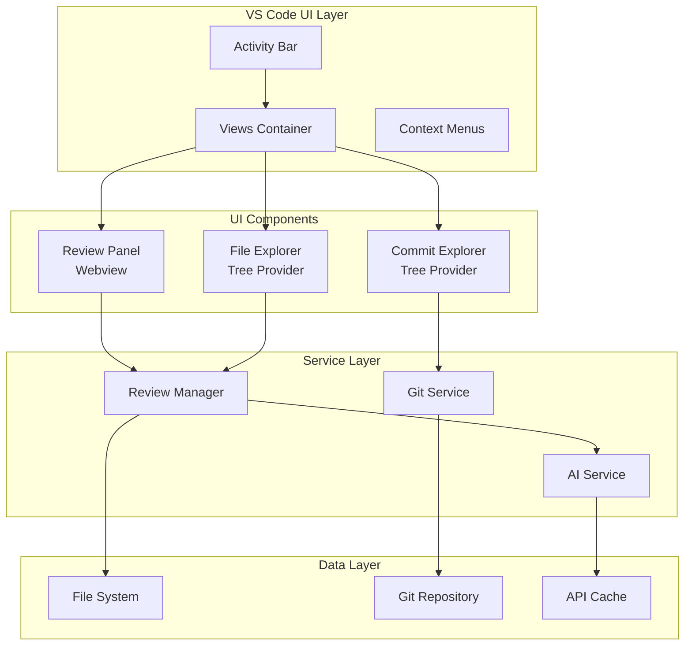
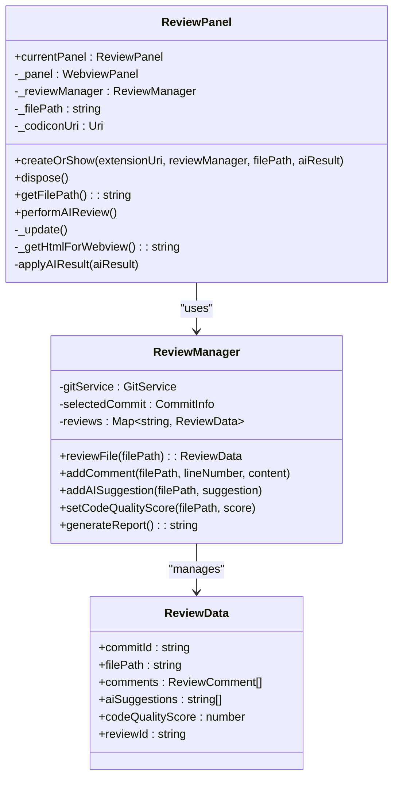
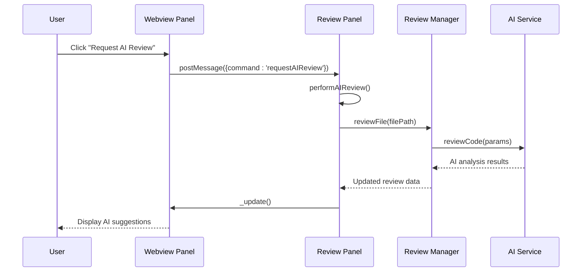
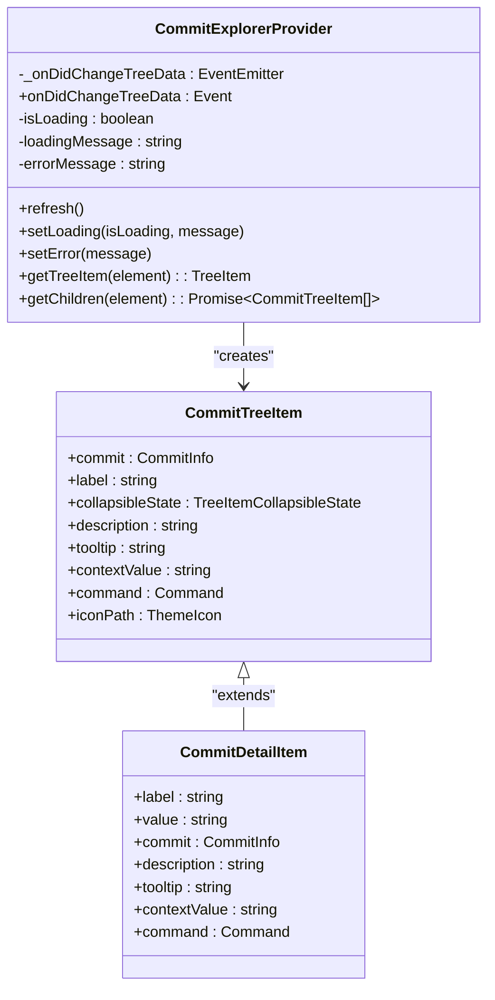
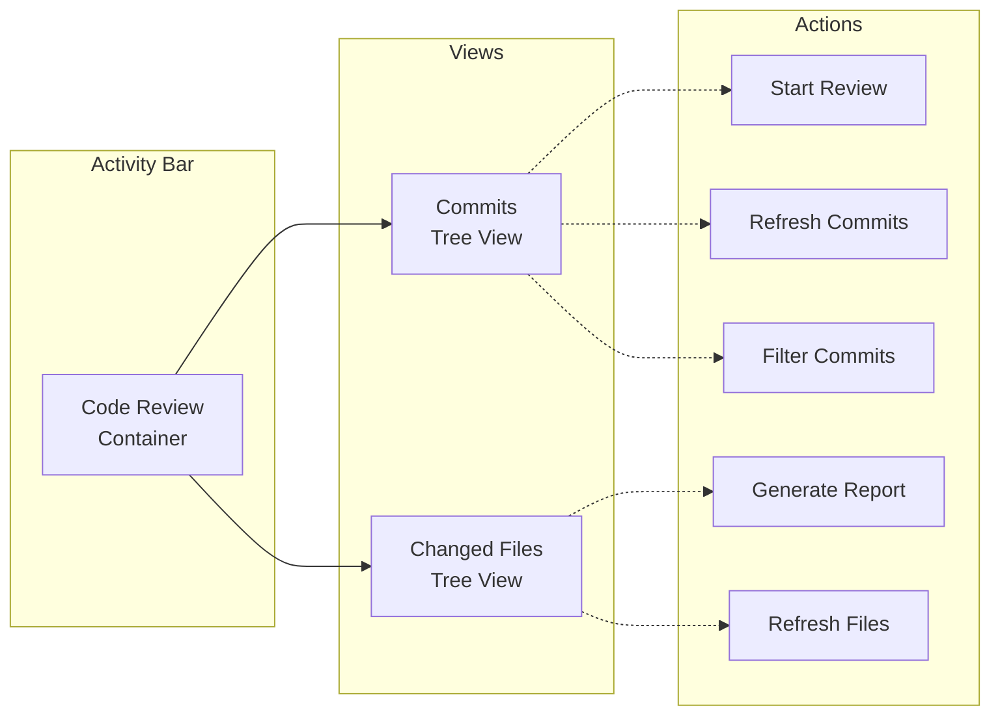

# UI Components

<cite>
**Referenced Files in This Document**
- [reviewPanel.ts](file://src/ui/views/reviewPanel.ts)
- [commitExplorer.ts](file://src/ui/components/commitExplorer.ts)
- [fileExplorer.ts](file://src/ui/components/fileExplorer.ts)
- [reviewManager.ts](file://src/services/review/reviewManager.ts)
- [gitService.ts](file://src/services/git/gitService.ts)
- [extension.ts](file://src/extension.ts)
- [package.json](file://package.json)
- [index.ts](file://src/i18n/index.ts)
</cite>

## Table of Contents
1. [Introduction](#introduction)
2. [Architecture Overview](#architecture-overview)
3. [Review Panel Component](#review-panel-component)
4. [Commit Explorer Tree Provider](#commit-explorer-tree-provider)
5. [File Explorer Tree Provider](#file-explorer-tree-provider)
6. [Integration with VS Code UI System](#integration-with-vs-code-ui-system)
7. [Webview Security Considerations](#webview-security-considerations)
8. [Performance Optimization](#performance-optimization)
9. [Accessibility Features](#accessibility-features)
10. [Customization and Extension Guidelines](#customization-and-extension-guidelines)
11. [Troubleshooting Guide](#troubleshooting-guide)
12. [Conclusion](#conclusion)

## Introduction

CodeKarmic provides a sophisticated UI system built on VS Code's extension framework, featuring three primary components: a webview-based review panel, a commit explorer tree provider, and a file explorer tree provider. These components work together to deliver an AI-powered code review experience that seamlessly integrates with Git commit history and file management.

The UI system is designed with modularity, performance, and accessibility in mind, providing users with intuitive interfaces for navigating Git repositories, reviewing code changes, and interacting with AI-generated suggestions. The architecture follows VS Code's recommended patterns for tree data providers and webview panels, ensuring optimal integration with the editor's ecosystem.

## Architecture Overview

The CodeKarmic UI system follows a layered architecture that separates concerns between presentation, business logic, and data persistence:



**Diagram sources**
- [extension.ts](file://src/extension.ts#L75-L79)
- [reviewPanel.ts](file://src/ui/views/reviewPanel.ts#L5-L12)
- [commitExplorer.ts](file://src/ui/components/commitExplorer.ts#L5-L13)
- [fileExplorer.ts](file://src/ui/components/fileExplorer.ts#L6-L10)

The architecture ensures loose coupling between components while maintaining clear data flow and separation of concerns. Each UI component is responsible for its specific domain while leveraging shared services for business logic and data access.

**Section sources**
- [extension.ts](file://src/extension.ts#L75-L79)
- [reviewPanel.ts](file://src/ui/views/reviewPanel.ts#L5-L12)
- [commitExplorer.ts](file://src/ui/components/commitExplorer.ts#L5-L13)
- [fileExplorer.ts](file://src/ui/components/fileExplorer.ts#L6-L10)

## Review Panel Component

The Review Panel is a sophisticated webview-based component that serves as the primary interface for displaying AI-generated code review results. It provides an interactive environment for developers to review code changes, add comments, and receive AI suggestions.

### Component Architecture



**Diagram sources**
- [reviewPanel.ts](file://src/ui/views/reviewPanel.ts#L5-L12)
- [reviewManager.ts](file://src/services/review/review/reviewManager.ts#L19-L26)

### Key Features

#### Webview Panel Management
The Review Panel implements a singleton pattern to manage webview instances efficiently. It handles panel creation, disposal, and state management while ensuring optimal memory usage.

#### Interactive Elements
The panel provides multiple interactive elements:
- **Tabbed Interface**: Switch between comments, AI suggestions, and comment forms
- **Syntax Highlighting**: Built-in support for various programming languages
- **Real-time Updates**: Automatic refresh when underlying data changes
- **AI Integration**: Seamless communication with AI services for code analysis

#### Message Passing System
The webview communicates with the extension through a structured message passing system:



**Diagram sources**
- [reviewPanel.ts](file://src/ui/views/reviewPanel.ts#L47-L72)
- [reviewManager.ts](file://src/services/review/review/reviewManager.ts#L229-L256)

### HTML Template System

The Review Panel generates dynamic HTML content based on the current state and selected commit. The template system supports both Git commit mode and standalone file review mode:

#### Git Commit Mode
- Displays commit information with author, date, and message
- Shows file changes with statistics
- Enables report generation functionality

#### Standalone Mode
- Reviews individual workspace files without Git dependency
- Provides immediate feedback for local development
- Supports direct commenting and AI analysis

**Section sources**
- [reviewPanel.ts](file://src/ui/views/reviewPanel.ts#L144-L621)

## Commit Explorer Tree Provider

The Commit Explorer provides a hierarchical view of Git commit history, enabling users to navigate through repository history and select specific commits for code review.

### Tree Data Provider Implementation



**Diagram sources**
- [commitExplorer.ts](file://src/ui/components/commitExplorer.ts#L5-L13)
- [commitExplorer.ts](file://src/ui/components/commitExplorer.ts#L131-L171)

### Dynamic Loading States

The Commit Explorer handles various loading scenarios gracefully:

#### Loading Indicators
- **Initial Load**: Shows loading message while fetching commits
- **Filter Changes**: Updates loading state during filtering operations
- **Error Recovery**: Displays error messages with retry options

#### Error Handling
The component provides comprehensive error handling for various failure scenarios:
- Git repository detection failures
- Network connectivity issues
- Permission problems
- Invalid repository states

### Filtering Capabilities

The Commit Explorer supports multiple filtering mechanisms:

#### Date Range Filtering
Users can filter commits by specifying start and end dates, enabling focused review sessions on specific time periods.

#### Commit ID Filtering
Direct filtering by commit hash allows quick navigation to specific historical changes.

#### Branch-Based Filtering
Integration with Git branches enables filtering commits by branch names or merge states.

**Section sources**
- [commitExplorer.ts](file://src/ui/components/commitExplorer.ts#L15-L172)

## File Explorer Tree Provider

The File Explorer displays files changed in selected commits, providing detailed information about file modifications and enabling direct file review initiation.

### File Information Display

```mermaid
flowchart TD
SelectCommit[Select Commit] --> GetFiles[Get Changed Files]
GetFiles --> ProcessFiles[Process File List]
ProcessFiles --> DetermineStatus{Determine File Status}
DetermineStatus --> |Added| AddedFile[Display as Added<br/>Status: [A]]
DetermineStatus --> |Modified| ModifiedFile[Display as Modified<br/>Status: [M] + Stats]
DetermineStatus --> |Deleted| DeletedFile[Display as Deleted<br/>Status: [D]]
DetermineStatus --> |Renamed| RenamedFile[Display as Renamed<br/>Status: [R]]
DetermineStatus --> |Copied| CopiedFile[Display as Copied<br/>Status: [C]]
DetermineStatus --> |Binary| BinaryFile[Display as Binary<br/>Status: [B]]
AddedFile --> SetIcons[Set File Icons]
ModifiedFile --> SetIcons
DeletedFile --> SetIcons
RenamedFile --> SetIcons
CopiedFile --> SetIcons
BinaryFile --> SetIcons
SetIcons --> CreateTreeItem[Create Tree Item]
CreateTreeItem --> DisplayUI[Display in UI]
```

**Diagram sources**
- [fileExplorer.ts](file://src/ui/components/fileExplorer.ts#L77-L94)
- [fileExplorer.ts](file://src/ui/components/fileExplorer.ts#L101-L224)

### File Type Detection and Icon Mapping

The File Explorer implements intelligent file type detection with comprehensive icon support:

#### Supported File Extensions
- **Programming Languages**: JavaScript, TypeScript, Python, Java, C/C++, HTML, CSS, JSON, Markdown
- **Configuration Files**: Various configuration formats with appropriate icons
- **Documentation**: Markdown files with dedicated documentation icons
- **Binary Files**: Special handling for binary content with warning indicators

#### Status Indicators
Each file displays its modification status with visual indicators:
- **Added Files**: Green indicators with addition symbols
- **Modified Files**: Blue indicators with modification symbols
- **Deleted Files**: Red indicators with deletion symbols
- **Renamed Files**: Yellow indicators with rename symbols
- **Binary Files**: Special binary file indicators

### Change Statistics

The File Explorer provides detailed change statistics for modified files:
- **Insertion Count**: Number of lines added
- **Deletion Count**: Number of lines removed
- **Net Changes**: Total change count
- **File Size**: Original and modified file sizes

**Section sources**
- [fileExplorer.ts](file://src/ui/components/fileExplorer.ts#L77-L224)

## Integration with VS Code UI System

CodeKarmic integrates seamlessly with VS Code's UI ecosystem through multiple extension points and standardized interfaces.

### View Registration

The extension registers three primary views in the activity bar:



**Diagram sources**
- [package.json](file://package.json#L210-L232)
- [extension.ts](file://src/extension.ts#L75-L79)

### Command Integration

The extension provides comprehensive command integration:

#### Context Menu Actions
- **Explorer Context**: Right-click actions for file and folder review
- **Editor Title**: Toggle review panel from editor title bar
- **View Titles**: Refresh and filter actions within views

#### Keyboard Shortcuts
- **Global Commands**: Access review functionality from anywhere
- **View-Specific**: Optimized shortcuts for each view
- **Customizable**: Support for user-defined keyboard shortcuts

### Theme Integration

The UI components automatically adapt to VS Code's theme system:
- **Light/Dark Themes**: Automatic color adaptation
- **High Contrast**: Support for accessibility themes
- **Custom Icons**: Integration with VS Code's icon system

**Section sources**
- [package.json](file://package.json#L233-L280)
- [extension.ts](file://src/extension.ts#L75-L79)

## Webview Security Considerations

CodeKarmic implements robust security measures for webview content to protect against potential vulnerabilities while maintaining functionality.

### Content Security Policy

The webview implementation follows strict CSP guidelines:

#### Resource Restrictions
- **Local Resources Only**: Webviews restricted to extension-provided resources
- **Script Execution**: Controlled JavaScript execution with message passing
- **External Content**: Blocked external script and resource loading

#### URI Validation
- **Resource Roots**: Defined local resource roots for webview access
- **Path Traversal**: Prevention of malicious path traversal attacks
- **Dynamic URIs**: Secure generation of webview-specific URIs

### Message Security

The webview-to-extension communication implements secure message handling:

#### Command Validation
- **Whitelisted Commands**: Only approved commands accepted
- **Parameter Sanitization**: Input validation for all message parameters
- **Access Control**: Context-aware permission checking

#### Cross-Origin Protection
- **Same-Origin Policy**: Enforced origin restrictions
- **CSRF Protection**: Anti-CSRF measures for critical operations
- **Data Isolation**: Separation of sensitive data from webview content

**Section sources**
- [reviewPanel.ts](file://src/ui/views/reviewPanel.ts#L108-L115)

## Performance Optimization

CodeKarmic implements several performance optimization strategies to handle large repositories and extensive commit histories efficiently.

### Lazy Loading Strategies

#### Tree View Optimization
- **On-Demand Loading**: Tree items loaded only when expanded
- **Virtual Scrolling**: Efficient rendering for large lists
- **Incremental Loading**: Progressive data loading for better responsiveness

#### Webview Content Optimization
- **Conditional Rendering**: Dynamic HTML generation based on current state
- **Template Caching**: Reuse of compiled templates for repeated operations
- **Minimal DOM Updates**: Efficient DOM manipulation strategies

### Memory Management

#### Resource Cleanup
- **Disposable Pattern**: Proper cleanup of event listeners and resources
- **Weak References**: Memory-efficient object referencing
- **Garbage Collection**: Proactive cleanup of unused data structures

#### State Management
- **Immutable Updates**: Efficient state change detection
- **Selective Refresh**: Targeted updates to minimize re-rendering
- **Cache Invalidation**: Intelligent cache management for stale data

### Concurrent Operations

#### Parallel Processing
- **Batch Operations**: Grouped processing for multiple files
- **Async Processing**: Non-blocking operations for long-running tasks
- **Progress Reporting**: Real-time progress updates for user feedback

#### Throttling and Debouncing
- **Input Throttling**: Rate limiting for user interactions
- **Network Debouncing**: Intelligent API call batching
- **Render Throttling**: Optimized rendering cycles

**Section sources**
- [reviewManager.ts](file://src/services/review/review/reviewManager.ts#L80-L82)
- [reviewManager.ts](file://src/services/review/review/reviewManager.ts#L329-L370)

## Accessibility Features

CodeKarmic prioritizes accessibility to ensure usability for developers with diverse needs and preferences.

### Keyboard Navigation

#### Full Keyboard Support
- **Tab Navigation**: Logical tab order through interface elements
- **Arrow Keys**: Hierarchical navigation in tree views
- **Enter/Space**: Activation of interactive elements
- **Escape**: Modal dismissal and navigation cancellation

#### Screen Reader Support
- **ARIA Labels**: Descriptive labels for all interactive elements
- **Role Definitions**: Proper ARIA roles for complex components
- **State Announcements**: Dynamic state changes announced to screen readers

### Visual Accessibility

#### High Contrast Support
- **Theme Adaptation**: Automatic adaptation to high contrast themes
- **Color Independence**: Information conveyed through multiple modalities
- **Focus Indicators**: Clear visual focus indicators for keyboard navigation

#### Text Scaling
- **Responsive Typography**: Scalable text for readability
- **Minimum Sizes**: Compliance with accessibility guidelines
- **Contrast Ratios**: Adequate contrast for text and backgrounds

### Cognitive Accessibility

#### Clear Information Architecture
- **Logical Grouping**: Related controls grouped together
- **Consistent Patterns**: Standardized interaction patterns
- **Helpful Feedback**: Clear error messages and success notifications

#### Reduced Complexity
- **Progressive Disclosure**: Advanced features revealed as needed
- **Clear Instructions**: Helpful guidance for complex operations
- **Undo Capability**: Safe experimentation with reversible actions

**Section sources**
- [reviewPanel.ts](file://src/ui/views/reviewPanel.ts#L242-L621)
- [commitExplorer.ts](file://src/ui/components/commitExplorer.ts#L131-L171)

## Customization and Extension Guidelines

CodeKarmic provides several extension points and customization options for advanced users and developers.

### Theme Customization

#### Color Scheme Modification
- **CSS Variables**: Extensible styling system
- **Theme Overrides**: Customizable appearance for specific contexts
- **Dynamic Theming**: Runtime theme switching support

#### Icon Customization
- **Custom Icons**: Support for custom file type icons
- **Theme Integration**: Consistent icon appearance across themes
- **Accessibility Icons**: Additional accessibility-focused icon variants

### Feature Extension

#### Plugin Architecture
- **Service Registration**: Extensible service registration system
- **Hook Points**: Strategic extension points for custom functionality
- **Event System**: Comprehensive event system for feature coordination

#### Configuration Options
- **Advanced Settings**: Extensive configuration options for power users
- **Feature Flags**: Granular control over feature availability
- **Performance Tuning**: Customizable performance parameters

### Integration Patterns

#### Third-Party Services
- **API Integration**: Support for external AI services
- **Repository Integration**: Compatibility with various Git hosting platforms
- **CI/CD Integration**: Build system integration capabilities

#### Workflow Customization
- **Custom Workflows**: Configurable review workflows
- **Automated Actions**: Scriptable automated review processes
- **Reporting Formats**: Extensible reporting system

**Section sources**
- [extension.ts](file://src/extension.ts#L20-L30)
- [package.json](file://package.json#L118-L208)

## Troubleshooting Guide

Common issues and their solutions for CodeKarmic UI components.

### Webview Issues

#### Panel Not Opening
- **Cause**: Extension activation failure or webview restrictions
- **Solution**: Check extension logs and verify webview permissions
- **Prevention**: Ensure proper extension activation and security settings

#### Content Not Loading
- **Cause**: Network connectivity or API key issues
- **Solution**: Verify API configuration and network access
- **Prevention**: Regular API key validation and network monitoring

### Tree View Problems

#### Commits Not Showing
- **Cause**: Git repository detection or permission issues
- **Solution**: Verify repository integrity and access permissions
- **Prevention**: Regular repository health checks

#### File Explorer Empty
- **Cause**: No commits selected or file filtering issues
- **Solution**: Select a valid commit and check file filters
- **Prevention**: Clear filters and verify commit selection

### Performance Issues

#### Slow Loading
- **Cause**: Large repository size or network latency
- **Solution**: Implement pagination or increase timeout settings
- **Prevention**: Optimize data loading strategies

#### Memory Usage
- **Cause**: Resource leaks or excessive caching
- **Solution**: Implement proper cleanup and cache management
- **Prevention**: Regular memory profiling and optimization

**Section sources**
- [reviewPanel.ts](file://src/ui/views/reviewPanel.ts#L47-L72)
- [commitExplorer.ts](file://src/ui/components/commitExplorer.ts#L36-L114)
- [fileExplorer.ts](file://src/ui/components/fileExplorer.ts#L20-L98)

## Conclusion

CodeKarmic's UI system represents a comprehensive solution for AI-powered code review within VS Code. The three primary components—Review Panel, Commit Explorer, and File Explorer—work together to provide an intuitive and powerful interface for navigating Git repositories and conducting thorough code reviews.

The architecture demonstrates best practices for VS Code extension development, including proper separation of concerns, efficient resource management, and comprehensive accessibility support. The modular design allows for easy maintenance and future enhancements while maintaining backward compatibility.

Key strengths of the system include:
- **Seamless Integration**: Native VS Code UI integration with minimal learning curve
- **Performance Optimization**: Efficient handling of large repositories and extensive commit histories
- **Security Focus**: Robust security measures protecting against common webview vulnerabilities
- **Accessibility Support**: Comprehensive accessibility features for inclusive development
- **Extensibility**: Well-defined extension points for customization and third-party integrations

The UI system serves as an excellent foundation for AI-assisted code review workflows, combining the power of modern AI services with the familiarity and reliability of VS Code's interface. Future enhancements could include additional AI features, expanded repository support, and enhanced collaboration capabilities.