# Utilities

<cite>
**Referenced Files in This Document**   
- [fileUtils.ts](file://src/utils/fileUtils.ts)
- [logger.ts](file://src/utils/logger.ts)
- [retryUtils.ts](file://src/utils/retryUtils.ts)
- [extension.ts](file://src/extension.ts)
- [reviewManager.ts](file://src/services/review/reviewManager.ts)
- [gitService.ts](file://src/services/git/gitService.ts)
- [deepseek.ts](file://src/models/providers/deepseek.ts)
- [constants.ts](file://src/constants/constants.ts)
</cite>

## Table of Contents
1. [Introduction](#introduction)
2. [File Utilities](#file-utilities)
3. [Logger Utility](#logger-utility)
4. [Retry Utilities](#retry-utilities)
5. [Integration Examples](#integration-examples)
6. [Error Handling](#error-handling)
7. [Performance Considerations](#performance-considerations)
8. [Best Practices](#best-practices)

## Introduction
The Utilities module in CodeKarmic provides essential helper functions that support core functionality across the application. This module contains three primary utilities: file operations and path handling, structured logging, and retry logic with exponential backoff. These utilities are designed to be reusable, reliable, and consistent throughout the codebase, enabling efficient file processing, comprehensive logging, and resilient network operations. The utilities are implemented as standalone modules that can be easily imported and used by various components of the application.

## File Utilities

The fileUtils.ts module provides helper functions for file operations, path handling, and determining reviewable file types. It includes a comprehensive list of file extensions that can be code reviewed, functions to determine if a file should be reviewed, and utilities to map file extensions to language types.

**Diagram sources**
- [fileUtils.ts](file://src/utils/fileUtils.ts#L6-L108)

**Section sources**
- [fileUtils.ts](file://src/utils/fileUtils.ts#L6-L108)
- [extension.ts](file://src/extension.ts#L788)

## Logger Utility

The logger.ts module provides structured logging with different severity levels and output destinations. It implements a Logger class with methods for debug, info, warn, and error levels, allowing for consistent logging throughout the application. The logger supports context-based logging and global log level configuration.

**Diagram sources**
- [logger.ts](file://src/utils/logger.ts#L8-L88)
- [constants.ts](file://src/constants/constants.ts#L8-L28)

**Section sources**
- [logger.ts](file://src/utils/logger.ts#L8-L88)
- [reviewManager.ts](file://src/services/review/reviewManager.ts#L253)
- [gitService.ts](file://src/services/git/gitService.ts#L175)

## Retry Utilities

The retryUtils.ts module implements retry logic with exponential backoff for handling transient failures in network operations. It provides a withRetry function that executes operations with configurable retry parameters, including maximum retries, initial delay, backoff factor, and retryable error patterns.

```mermaid
flowchart TD
A["withRetry(operation, options)"] --> B[Apply config]
B --> C["Attempt = 1"]
C --> D["Execute operation()"]
D --> E{Success?}
E --> |Yes| F[Return result]
E --> |No| G[Store error]
G --> H{Retryable error?}
H --> |No| I[Throw error]
H --> |Yes| J{Attempt ≤ maxRetries?}
J --> |No| K[Throw last error]
J --> |Yes| L[Calculate delay]
L --> M["Wait 'delay' ms"]
M --> N["Attempt++"]
N --> C
```

**Diagram sources**
- [retryUtils.ts](file://src/utils/retryUtils.ts#L8-L70)

**Section sources**
- [retryUtils.ts](file://src/utils/retryUtils.ts#L8-L117)
- [deepseek.ts](file://src/models/providers/deepseek.ts#L200)

## Integration Examples

The utilities are extensively used throughout the CodeKarmic codebase. The fileUtils are used to filter reviewable files when scanning directories, the logger provides consistent application logging, and retryUtils ensure reliable network operations.

### File Utilities Usage
The isReviewableFile function is used in the extension.ts file to filter files that should be included in code reviews:

**Diagram sources**
- [fileUtils.ts](file://src/utils/fileUtils.ts#L26-L36)
- [extension.ts](file://src/extension.ts#L788)

### Logger Usage
The Logger class is used across various services to provide consistent logging with context:

**Diagram sources**
- [logger.ts](file://src/utils/logger.ts#L18-L88)
- [reviewManager.ts](file://src/services/review/reviewManager.ts#L253)

### Retry Utilities Usage
The withRetry function is used in AI service providers to handle transient network failures:

**Diagram sources**
- [retryUtils.ts](file://src/utils/retryUtils.ts#L33-L70)
- [deepseek.ts](file://src/models/providers/deepseek.ts#L198-L209)

**Section sources**
- [retryUtils.ts](file://src/utils/retryUtils.ts#L33-L70)
- [deepseek.ts](file://src/models/providers/deepseek.ts#L198-L209)

## Error Handling

The utility functions implement robust error handling strategies to ensure reliability and provide meaningful feedback.

### File Utilities Error Handling
The file utilities use defensive programming to handle edge cases:

- isReviewableFile handles files with special names (like Dockerfile) that don't have extensions
- getFileLanguage returns 'plaintext' as a default for unrecognized file types
- Both functions accept any string input and handle malformed paths gracefully

### Logger Error Handling
The logger implements safe error handling:

- All logging methods check the current log level before outputting
- Optional data parameters are safely handled when undefined
- The global log level is statically managed to prevent race conditions
- Context is always included to help with debugging

### Retry Utilities Error Handling
The retry utilities provide comprehensive error handling:

- Specific retryable errors can be configured via patterns or regular expressions
- The isRetryableError function handles both string and Error objects
- Failed operations are retried with exponential backoff
- The last error is preserved and rethrown when retries are exhausted

**Section sources**
- [fileUtils.ts](file://src/utils/fileUtils.ts#L26-L108)
- [logger.ts](file://src/utils/logger.ts#L50-L88)
- [retryUtils.ts](file://src/utils/retryUtils.ts#L43-L69)

## Performance Considerations

The utilities are designed with performance in mind, balancing functionality with efficiency.

### File Utilities Performance
- The REVIEWABLE_FILE_EXTENSIONS array is defined once and reused
- File extension lookups are case-insensitive but only converted once
- The getFileLanguage function uses a direct object lookup for extension mapping
- Special filename checks are performed before extension checks

### Logger Performance
- Log level checks prevent unnecessary string formatting
- Console methods are called directly without intermediate processing
- Context is stored in the instance rather than passed with each call
- No formatting is applied to data objects

### Retry Utilities Performance
- Configuration is merged once at the start of withRetry
- Error checking is optimized with early returns
- The exponential backoff calculation is simple and efficient
- Promise resolution is used for delays rather than busy waiting

**Section sources**
- [fileUtils.ts](file://src/utils/fileUtils.ts#L6-L108)
- [logger.ts](file://src/utils/logger.ts#L8-L88)
- [retryUtils.ts](file://src/utils/retryUtils.ts#L8-L70)

## Best Practices

### Configuration Options
Each utility provides sensible defaults while allowing customization:

- **fileUtils**: The REVIEWABLE_FILE_EXTENSIONS list can be extended as needed
- **logger**: The global log level can be set dynamically via setLogLevel
- **retryUtils**: Default retry options can be overridden per operation

### Extending Utilities
To extend these utilities:

1. For fileUtils: Add new extensions to REVIEWABLE_FILE_EXTENSIONS or create specialized filtering functions
2. For logger: Create new logger instances with specific contexts; avoid creating multiple instances for the same module
3. For retryUtils: Define custom retryable error patterns or create specialized retry configurations

### Usage Guidelines
- Import utilities at the top of files that need them
- Create logger instances with meaningful context names
- Use appropriate log levels (DEBUG for development, INFO for normal operation, WARN for potential issues, ERROR for failures)
- Configure retry options based on the specific operation's requirements
- Use the provided constants and patterns (like API_RETRYABLE_ERRORS) when appropriate

**Section sources**
- [fileUtils.ts](file://src/utils/fileUtils.ts)
- [logger.ts](file://src/utils/logger.ts)
- [retryUtils.ts](file://src/utils/retryUtils.ts)