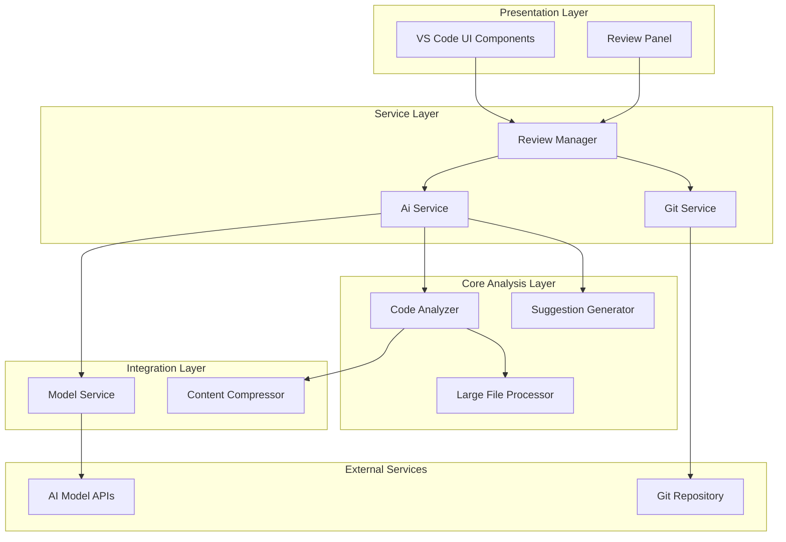
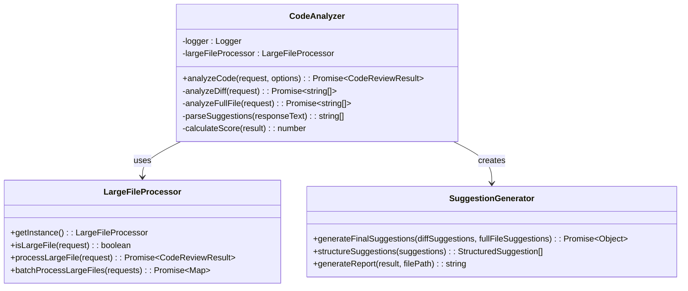
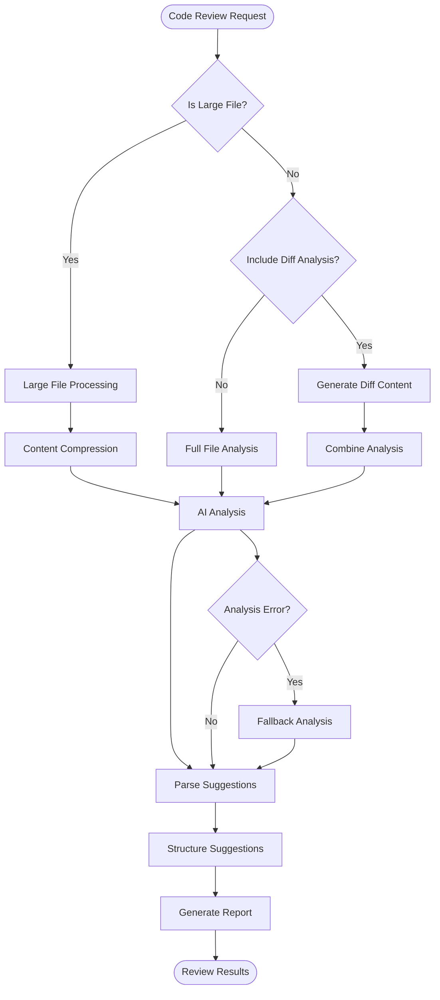
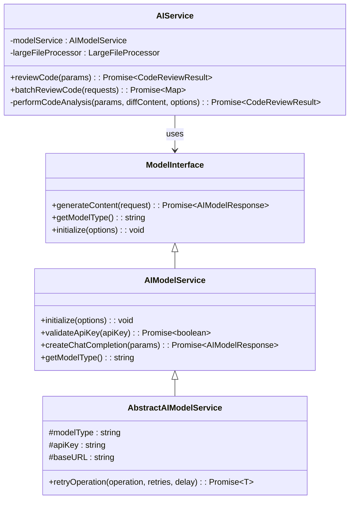
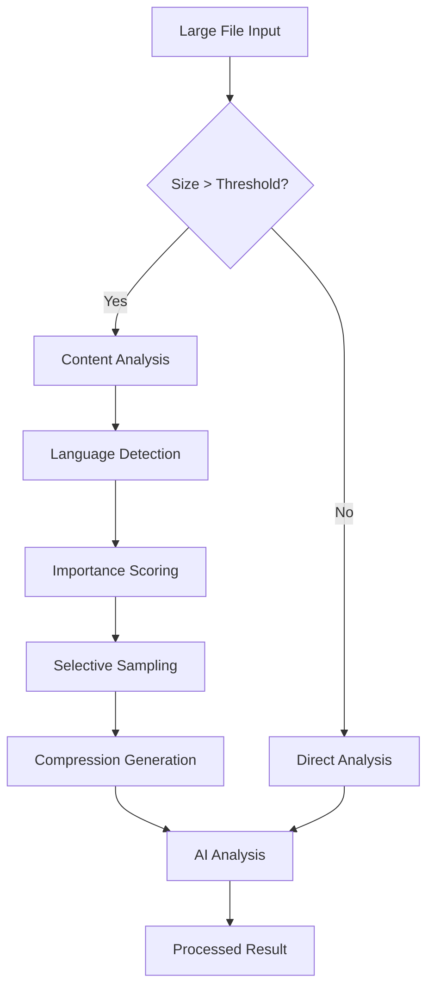

# Code Review Process

<cite>
**Referenced Files in This Document**
- [codeAnalyzer.ts](file://src/core/review/codeAnalyzer.ts)
- [reviewManager.ts](file://src/services/review/reviewManager.ts)
- [suggestionGenerator.ts](file://src/core/review/suggestionGenerator.ts)
- [gitService.ts](file://src/services/git/gitService.ts)
- [largeFileProcessor.ts](file://src/core/compression/largeFileProcessor.ts)
- [reviewTypes.ts](file://src/core/review/reviewTypes.ts)
- [modelInterface.ts](file://src/models/modelInterface.ts)
- [aiService.ts](file://src/services/ai/aiService.ts)
- [compressionTypes.ts](file://src/core/compression/compressionTypes.ts)
- [contentCompressor.ts](file://src/core/compression/contentCompressor.ts)
- [developer-guide.md](file://docs/en/developer-guide.md)
- [code-review-rules.md](file://docs/zh-CN/guide/code-review-rules.md)
</cite>

## Table of Contents
1. [Introduction](#introduction)
2. [Architecture Overview](#architecture-overview)
3. [Core Review Components](#core-review-components)
4. [Code Analysis Pipeline](#code-analysis-pipeline)
5. [AI Integration and Suggestion Logic](#ai-integration-and-suggestion-logic)
6. [Large File Processing](#large-file-processing)
7. [Performance Considerations](#performance-considerations)
8. [Documentation Guidelines](#documentation-guidelines)
9. [Testing and Quality Assurance](#testing-and-quality-assurance)
10. [Common Anti-Patterns and Best Practices](#common-anti-patterns-and-best-practices)
11. [Troubleshooting Guide](#troubleshooting-guide)

## Introduction

CodeKarmic implements a sophisticated AI-powered code review system designed to evaluate proposed changes against established architectural standards and coding best practices. The review process evaluates code quality, identifies potential issues, and provides actionable suggestions while maintaining backward compatibility and performance optimization.

The system operates on multiple levels, from individual file analysis to comprehensive commit-based reviews, utilizing advanced AI models to provide context-aware suggestions that align with the project's architectural vision.

## Architecture Overview

CodeKarmic follows a modular, pluggable architecture that separates concerns across distinct layers:

**Diagram sources**
- [reviewManager.ts](file://src/services/review/reviewManager.ts#L79-L93)
- [gitService.ts](file://src/services/git/gitService.ts#L45-L62)
- [aiService.ts](file://src/services/ai/aiService.ts#L40-L72)

**Section sources**
- [reviewManager.ts](file://src/services/review/reviewManager.ts#L79-L93)
- [gitService.ts](file://src/services/git/gitService.ts#L45-L62)
- [aiService.ts](file://src/services/ai/aiService.ts#L40-L72)

## Core Review Components

### CodeAnalyzer

The CodeAnalyzer serves as the primary analysis engine, responsible for evaluating code quality and generating review results. It implements a dual-analysis approach combining difference-based and full-file analysis.

**Diagram sources**
- [codeAnalyzer.ts](file://src/core/review/codeAnalyzer.ts#L17-L230)
- [largeFileProcessor.ts](file://src/core/compression/largeFileProcessor.ts#L23-L242)
- [suggestionGenerator.ts](file://src/core/review/suggestionGenerator.ts#L56-L456)

### ReviewManager

The ReviewManager orchestrates the entire review workflow, managing commit selection, file processing, and result aggregation. It maintains state for multiple concurrent reviews and handles both Git-based and direct file reviews.

### SuggestionGenerator

The SuggestionGenerator transforms raw AI responses into structured, categorized suggestions with severity levels and actionable recommendations. It provides comprehensive reporting capabilities and maintains consistency in suggestion formatting.

**Section sources**
- [codeAnalyzer.ts](file://src/core/review/codeAnalyzer.ts#L17-L230)
- [reviewManager.ts](file://src/services/review/reviewManager.ts#L79-L93)
- [suggestionGenerator.ts](file://src/core/review/suggestionGenerator.ts#L56-L456)

## Code Analysis Pipeline

The code analysis pipeline implements a sophisticated multi-stage evaluation process:

**Diagram sources**
- [codeAnalyzer.ts](file://src/core/review/codeAnalyzer.ts#L35-L82)
- [aiService.ts](file://src/services/ai/aiService.ts#L260-L386)

### Analysis Stages

1. **Preprocessing**: File size checking, content compression for large files
2. **Diff Analysis**: Examines changes between versions using Git operations
3. **Full File Analysis**: Evaluates entire file content for quality and best practices
4. **AI Integration**: Leverages multiple AI models for comprehensive analysis
5. **Suggestion Generation**: Structuring and categorizing AI responses
6. **Result Compilation**: Aggregating suggestions and calculating scores

**Section sources**
- [codeAnalyzer.ts](file://src/core/review/codeAnalyzer.ts#L35-L82)
- [aiService.ts](file://src/services/ai/aiService.ts#L260-L386)

## AI Integration and Suggestion Logic

### Model Architecture

CodeKarmic integrates with multiple AI models through a unified interface, enabling flexible model switching and consistent behavior across different providers.

**Diagram sources**
- [modelInterface.ts](file://src/models/modelInterface.ts#L39-L185)
- [aiService.ts](file://src/services/ai/aiService.ts#L40-L72)

### Suggestion Consistency Patterns

The system maintains consistency in AI-generated suggestions through several mechanisms:

1. **Structured Output**: All suggestions follow a standardized format with categories and severity levels
2. **Pattern Matching**: Consistent parsing patterns for extracting suggestions from AI responses
3. **Scoring Logic**: Uniform scoring algorithms across different analysis types
4. **Categorization**: Standardized suggestion categories (Structure, Performance, Security, etc.)

### Integration Patterns

The AI integration follows these key patterns:

- **Fallback Mechanisms**: Graceful degradation when AI services fail
- **Batch Processing**: Efficient handling of multiple files simultaneously
- **Streaming Support**: Real-time response processing for better user experience
- **Error Recovery**: Comprehensive error handling and recovery strategies

**Section sources**
- [modelInterface.ts](file://src/models/modelInterface.ts#L39-L185)
- [aiService.ts](file://src/services/ai/aiService.ts#L40-L72)
- [suggestionGenerator.ts](file://src/core/review/suggestionGenerator.ts#L56-L456)

## Large File Processing

### Compression Strategy

CodeKarmic implements intelligent content compression for files exceeding size thresholds, preserving essential information while reducing processing overhead.

**Diagram sources**
- [largeFileProcessor.ts](file://src/core/compression/largeFileProcessor.ts#L23-L242)
- [contentCompressor.ts](file://src/core/compression/contentCompressor.ts#L18-L414)

### Compression Features

The compression system provides:

1. **Intelligent Sampling**: Preserves important code structures based on language-specific patterns
2. **Context Preservation**: Maintains surrounding context for better AI understanding
3. **Statistics Tracking**: Comprehensive metrics on compression effectiveness
4. **Batch Processing**: Efficient handling of multiple large files
5. **Fallback Strategies**: Alternative processing methods when primary approaches fail

### Configuration Options

Large file processing supports extensive customization:

- **Size Thresholds**: Configurable file size limits
- **Sampling Rates**: Adjustable compression ratios
- **Language-Specific Rules**: Optimized processing for different programming languages
- **Context Preservation**: Configurable context line counts

**Section sources**
- [largeFileProcessor.ts](file://src/core/compression/largeFileProcessor.ts#L23-L242)
- [compressionTypes.ts](file://src/core/compression/compressionTypes.ts#L1-L87)
- [contentCompressor.ts](file://src/core/compression/contentCompressor.ts#L18-L414)

## Performance Considerations

### Optimization Strategies

CodeKarmic implements multiple performance optimization strategies:

1. **Lazy Loading**: Components are instantiated only when needed
2. **Caching Mechanisms**: Diff content and AI responses are cached
3. **Batch Processing**: Multiple files processed efficiently in batches
4. **Memory Management**: Proper cleanup and resource management
5. **Asynchronous Operations**: Non-blocking processing for better responsiveness

### Performance Metrics

Key performance indicators monitored include:

- **Analysis Duration**: Time taken for code analysis
- **Memory Usage**: Resource consumption during processing
- **AI Request Latency**: Response times from AI services
- **Throughput**: Number of files processed per unit time
- **Success Rates**: Percentage of successful analyses

### Scalability Features

The system scales effectively through:

- **Concurrent Processing**: Parallel analysis of multiple files
- **Resource Pooling**: Efficient reuse of AI model connections
- **Adaptive Batching**: Dynamic batch sizing based on available resources
- **Load Balancing**: Distribution of processing load across available resources

**Section sources**
- [reviewManager.ts](file://src/services/review/reviewManager.ts#L289-L370)
- [aiService.ts](file://src/services/ai/aiService.ts#L426-L552)

## Documentation Guidelines

### Updating Developer Documentation

When contributing to CodeKarmic, maintain documentation consistency across all languages:

1. **Primary Documentation**: Update the English version first
2. **Translation Updates**: Ensure translations reflect changes
3. **Code Examples**: Include relevant code snippet references
4. **Architecture Diagrams**: Update visual representations when components change
5. **API Documentation**: Document new interfaces and parameter changes

### Backward Compatibility

Maintain backward compatibility through:

1. **Interface Stability**: Preserve existing method signatures
2. **Default Values**: Provide sensible defaults for new parameters
3. **Deprecation Warnings**: Gradually phase out old features
4. **Migration Guides**: Document breaking changes and migration steps

### Documentation Standards

Follow these documentation standards:

- **Technical Accuracy**: Ensure all technical information is correct
- **Clarity**: Use clear, concise language suitable for developers
- **Completeness**: Cover all aspects of functionality
- **Consistency**: Maintain consistent terminology and formatting

**Section sources**
- [developer-guide.md](file://docs/en/developer-guide.md#L1-L74)
- [code-review-rules.md](file://docs/zh-CN/guide/code-review-rules.md#L1-L109)

## Testing and Quality Assurance

### Test Coverage Requirements

Ensure comprehensive testing coverage:

1. **Unit Tests**: Individual component testing
2. **Integration Tests**: Cross-component functionality
3. **Performance Tests**: Load and stress testing
4. **Regression Tests**: Preventing feature breakage
5. **AI Response Tests**: Validating suggestion generation

### Quality Gates

Implement quality gates for code submissions:

1. **Code Style Compliance**: Enforce coding standards
2. **Test Coverage**: Minimum coverage requirements
3. **Performance Benchmarks**: Maintain performance thresholds
4. **Security Scanning**: Automated security vulnerability checks
5. **Documentation Completeness**: Verify documentation updates

### Continuous Integration

The CI/CD pipeline ensures:

- **Automated Testing**: Complete test suite execution
- **Static Analysis**: Code quality and security scanning
- **Performance Monitoring**: Regression detection
- **Deployment Validation**: Production readiness checks

**Section sources**
- [reviewManager.ts](file://src/services/review/reviewManager.ts#L289-L370)
- [codeAnalyzer.ts](file://src/core/review/codeAnalyzer.ts#L35-L82)

## Common Anti-Patterns and Best Practices

### Anti-Patterns to Avoid

1. **Tight Coupling**: Avoid direct dependencies between unrelated components
2. **God Objects**: Prevent single classes from becoming overly complex
3. **Magic Numbers**: Use named constants instead of hard-coded values
4. **Verbose Logging**: Maintain appropriate log levels and verbosity
5. **Blocking Operations**: Use asynchronous patterns for long-running operations

### Best Practices

1. **Single Responsibility**: Each class should have one clear purpose
2. **Dependency Injection**: Use DI for better testability and flexibility
3. **Error Handling**: Implement comprehensive error handling strategies
4. **Configuration Management**: Externalize configuration values
5. **Monitoring and Observability**: Implement proper logging and metrics

### Architectural Principles

Follow these architectural principles:

- **Separation of Concerns**: Clear boundaries between different functional areas
- **Open/Closed Principle**: Extendable through interfaces, not modification
- **Dependency Inversion**: Depend on abstractions, not concretions
- **Interface Segregation**: Small, focused interfaces
- **Liskov Substitution**: Subtypes should be substitutable for their base types

**Section sources**
- [reviewManager.ts](file://src/services/review/reviewManager.ts#L79-L93)
- [codeAnalyzer.ts](file://src/core/review/codeAnalyzer.ts#L17-L230)

## Troubleshooting Guide

### Common Issues and Solutions

1. **AI Service Failures**
   - **Symptom**: Analysis requests timeout or fail
   - **Solution**: Implement retry logic with exponential backoff
   - **Prevention**: Monitor AI service health and implement circuit breakers

2. **Large File Processing Issues**
   - **Symptom**: Memory errors with large files
   - **Solution**: Increase memory limits and optimize compression
   - **Prevention**: Implement size validation and compression warnings

3. **Git Integration Problems**
   - **Symptom**: Cannot access repository or commits
   - **Solution**: Verify Git installation and repository permissions
   - **Prevention**: Implement graceful fallback to local file access

4. **Performance Degradation**
   - **Symptom**: Slow analysis response times
   - **Solution**: Optimize batch sizes and implement caching
   - **Prevention**: Regular performance monitoring and profiling

### Debugging Strategies

Implement effective debugging through:

1. **Comprehensive Logging**: Detailed logs for troubleshooting
2. **Performance Profiling**: Identify bottlenecks and optimization opportunities
3. **Error Tracking**: Centralized error reporting and analysis
4. **User Feedback**: Collect and analyze user-reported issues
5. **Automated Monitoring**: Proactive issue detection and alerting

### Recovery Procedures

Establish recovery procedures for:

- **Service Failures**: Automatic failover to backup systems
- **Data Corruption**: Data validation and recovery mechanisms
- **Configuration Errors**: Safe configuration rollback procedures
- **Performance Issues**: Dynamic scaling and resource allocation

**Section sources**
- [aiService.ts](file://src/services/ai/aiService.ts#L691-L710)
- [gitService.ts](file://src/services/git/gitService.ts#L45-L62)
- [largeFileProcessor.ts](file://src/core/compression/largeFileProcessor.ts#L23-L242)