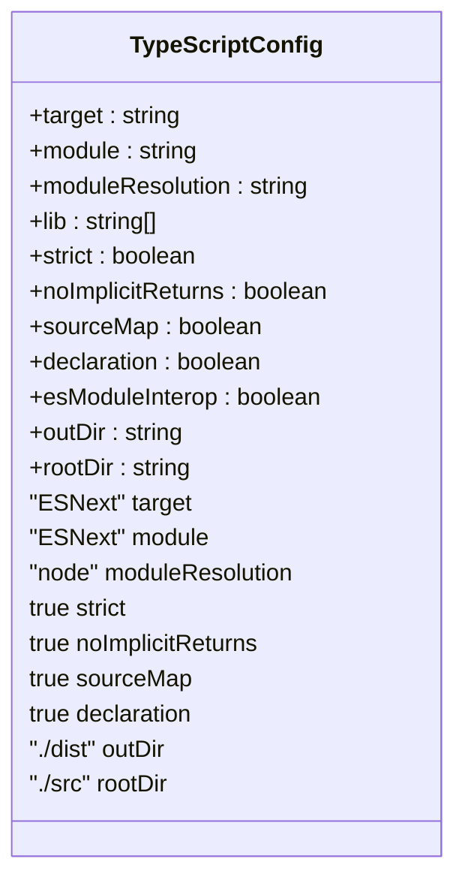
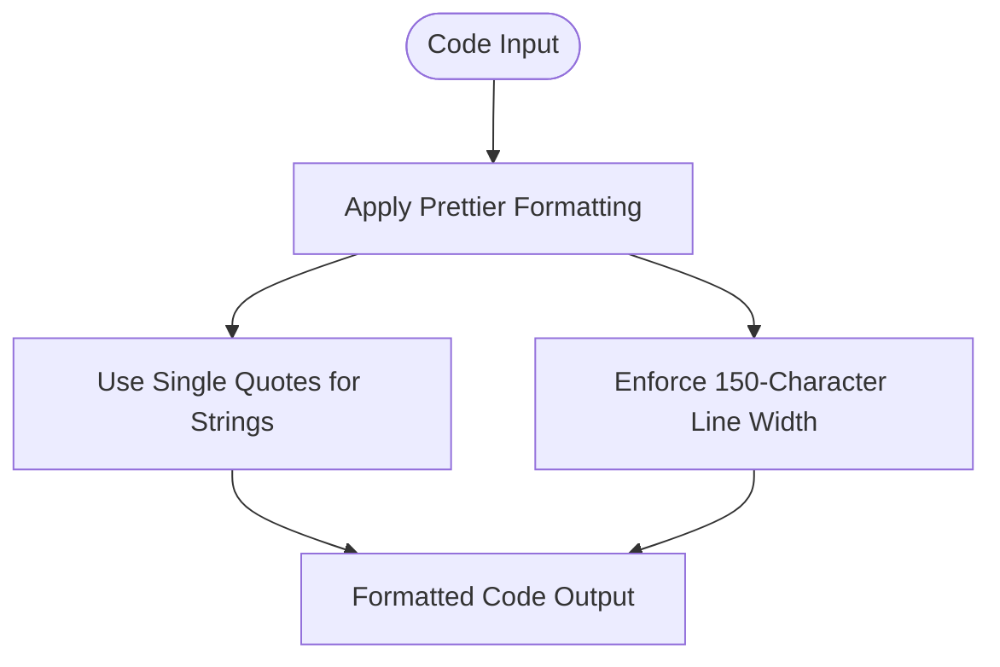
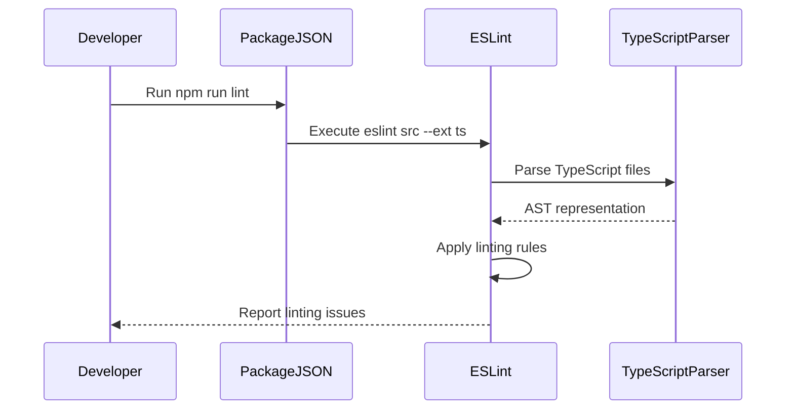
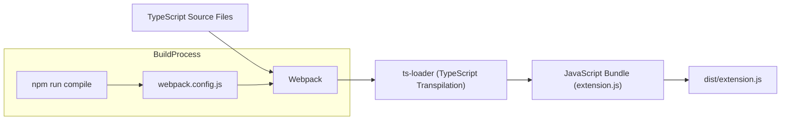
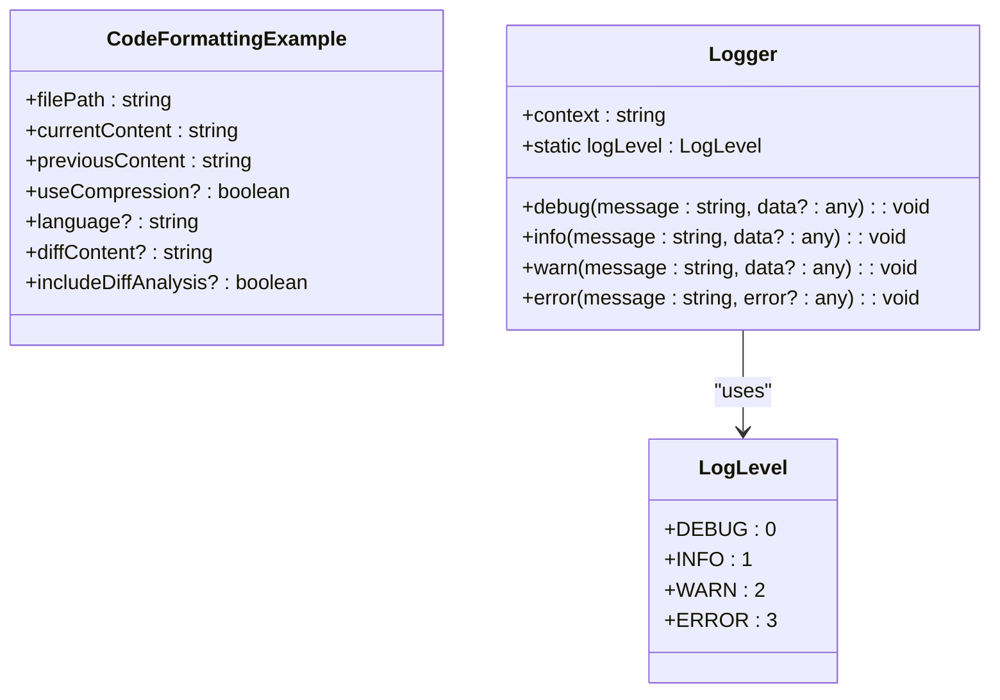

# Coding Standards

<cite>
**Referenced Files in This Document**   
- [tsconfig.json](file://tsconfig.json)
- [.prettierrc.yaml](file://.prettierrc.yaml)
- [package.json](file://package.json)
- [webpack.config.js](file://webpack.config.js)
- [src/extension.ts](file://src/extension.ts)
- [src/utils/logger.ts](file://src/utils/logger.ts)
- [src/models/baseModel.ts](file://src/models/baseModel.ts)
- [src/services/git/gitService.ts](file://src/services/git/gitService.ts)
- [src/services/ai/aiService.ts](file://src/services/ai/aiService.ts)
</cite>

## Table of Contents
1. [Introduction](#introduction)
2. [TypeScript Configuration](#typescript-configuration)
3. [Prettier Formatting Rules](#prettier-formatting-rules)
4. [ESLint Integration and Code Quality](#eslint-integration-and-code-quality)
5. [Build Process and Compilation](#build-process-and-compilation)
6. [Code Formatting Examples](#code-formatting-examples)
7. [Common Formatting Issues and IDE Integration](#common-formatting-issues-and-ide-integration)
8. [Conclusion](#conclusion)

## Introduction
The CodeKarmic project enforces a comprehensive set of coding standards to ensure code quality, consistency, and maintainability across the codebase. This document details the configuration and implementation of these standards, focusing on TypeScript compilation settings, Prettier formatting rules, ESLint integration for code quality, and the build process using Webpack. The standards are designed to support the development of a robust AI-powered Git commit code review extension for Visual Studio Code, ensuring that all code contributions adhere to consistent patterns and practices.

**Section sources**
- [package.json](file://package.json#L1-L311)

## TypeScript Configuration
The TypeScript configuration for the CodeKarmic project is defined in the `tsconfig.json` file, which specifies the compilation options and project settings. The configuration targets the latest ECMAScript standard (ESNext) for both the language target and module system, enabling the use of modern JavaScript features while maintaining compatibility with the VS Code extension environment. The module resolution is set to "node" to follow Node.js module resolution conventions, allowing for seamless import of dependencies from the node_modules directory.

Strict type checking is enabled through the "strict" option, which activates a suite of type safety features including strictNullChecks, strictFunctionTypes, and strictPropertyInitialization. This ensures that variables are properly initialized and that null and undefined values are handled explicitly, reducing the likelihood of runtime errors. Additional strictness is enforced through "noImplicitReturns" and "noImplicitAny", requiring functions to have explicit return types and preventing the use of the any type without explicit declaration.

Source maps are generated to facilitate debugging by mapping the compiled JavaScript code back to the original TypeScript source files. Declaration files are also produced to provide type information for the compiled output, enabling proper type checking when the code is imported in other projects. The compilation output is directed to the "dist" directory, with the source files located in the "src" directory, maintaining a clear separation between source and compiled code.

**Diagram sources **
- [tsconfig.json](file://tsconfig.json#L1-L19)

**Section sources**
- [tsconfig.json](file://tsconfig.json#L1-L19)

## Prettier Formatting Rules
The CodeKarmic project uses Prettier to enforce consistent code formatting across the codebase. The formatting rules are defined in the `.prettierrc.yaml` configuration file, which specifies key formatting options to ensure uniform code style. The primary formatting rule is the use of single quotes for string literals, which helps maintain consistency in string representation throughout the codebase.

The line width is set to 150 characters, providing a generous limit that accommodates longer lines of code without excessive wrapping. This setting balances readability with the practical need to express complex logic in a single line when appropriate. The increased line width is particularly beneficial for TypeScript code, which often includes verbose type annotations and complex generic expressions that can extend line length.

Prettier's opinionated formatting approach eliminates debates about code style by automatically formatting code according to the specified rules. This ensures that all developers on the project produce code with identical formatting, regardless of their personal preferences or editor settings. The configuration is minimal by design, focusing on the most impactful formatting decisions while accepting Prettier's default behavior for other aspects of code style.

**Diagram sources **
- [.prettierrc.yaml](file://.prettierrc.yaml#L1-L5)

**Section sources**
- [.prettierrc.yaml](file://.prettierrc.yaml#L1-L5)

## ESLint Integration and Code Quality
The CodeKarmic project integrates ESLint through the "lint" script defined in the `package.json` file to maintain high code quality standards. The linting process is executed using the command `eslint src --ext ts`, which runs ESLint on all TypeScript files in the source directory. This integration ensures that code quality checks are performed consistently across the codebase, catching potential issues before they are committed.

Although the specific ESLint configuration file (.eslintrc.js) is not present in the repository, the project dependencies indicate the use of `@typescript-eslint/eslint-plugin` and `@typescript-eslint/parser`, which provide TypeScript-specific linting rules and parsing capabilities. These tools extend ESLint's functionality to understand TypeScript syntax and enforce type-aware linting rules, enhancing the effectiveness of the code quality checks.

The linting process is integrated into the development workflow through the "pretest" script in `package.json`, which runs the lint command before executing tests. This ensures that code quality checks are performed as part of the testing process, preventing the execution of tests on code that does not meet the project's quality standards. The integration of linting with testing creates a comprehensive quality assurance pipeline that catches both functional and stylistic issues.

**Diagram sources **
- [package.json](file://package.json#L282-L292)
- [package.json](file://package.json#L297-L305)

**Section sources**
- [package.json](file://package.json#L282-L292)
- [package.json](file://package.json#L297-L305)

## Build Process and Compilation
The build process for the CodeKarmic project is configured through Webpack and defined in the `webpack.config.js` file. Webpack is used to bundle the TypeScript source code into a single JavaScript file that can be executed in the VS Code extension environment. The build process is optimized for production, with the mode set to "production" and source maps hidden to minimize the size of the compiled output.

The entry point for the build process is `src/extension.ts`, which serves as the main module for the VS Code extension. The output is directed to the "dist" directory with the filename "extension.js", following the convention for VS Code extensions. The target is set to "node" to ensure compatibility with the Node.js runtime environment used by VS Code.

Webpack is configured to handle TypeScript files through the `ts-loader`, which transpiles TypeScript code to JavaScript during the bundling process. The loader is configured with the same module resolution settings as the TypeScript compiler to ensure consistency between development and build environments. The resolve configuration includes both ".ts" and ".js" extensions, allowing for seamless import of modules regardless of their file extension.

The build process is integrated into the development workflow through npm scripts in `package.json`. The "compile" script runs Webpack to build the project, while the "watch" script runs Webpack in watch mode to automatically rebuild the project when source files change. The "package" script is used for production builds, running Webpack with production mode and hidden source maps to optimize the output for distribution.

**Diagram sources **
- [webpack.config.js](file://webpack.config.js#L1-L48)
- [package.json](file://package.json#L284-L286)

**Section sources**
- [webpack.config.js](file://webpack.config.js#L1-L48)
- [package.json](file://package.json#L284-L286)

## Code Formatting Examples
The CodeKarmic project follows consistent formatting patterns that adhere to the defined coding standards. TypeScript files use single quotes for string literals, as specified in the Prettier configuration. This convention is applied consistently across all string representations, including object properties, function parameters, and template literals.

The 150-character line width allows for longer lines of code without wrapping, particularly beneficial for complex type annotations and function signatures. For example, the `CodeReviewRequest` interface in `aiService.ts` includes multiple optional properties that can be declared on a single line without exceeding the line width limit.

TypeScript's strict mode influences the code structure by requiring explicit type annotations and preventing implicit any types. This results in code that is more verbose but also more predictable and easier to maintain. For instance, the `Logger` class in `logger.ts` explicitly defines the type of its context property and uses TypeScript's enum feature to define the `LogLevel` enumeration.

The use of modern JavaScript features enabled by the ESNext target is evident in the codebase, with arrow functions, destructuring assignment, and async/await syntax used consistently. These features contribute to more concise and readable code while maintaining compatibility with the target environment.

**Diagram sources **
- [src/services/ai/aiService.ts](file://src/services/ai/aiService.ts#L15-L24)
- [src/utils/logger.ts](file://src/utils/logger.ts#L8-L13)
- [src/utils/logger.ts](file://src/utils/logger.ts#L18-L88)

**Section sources**
- [src/services/ai/aiService.ts](file://src/services/ai/aiService.ts#L15-L24)
- [src/utils/logger.ts](file://src/utils/logger.ts#L8-L13)
- [src/utils/logger.ts](file://src/utils/logger.ts#L18-L88)

## Common Formatting Issues and IDE Integration
Developers working on the CodeKarmic project may encounter common formatting issues related to the interaction between TypeScript, Prettier, and ESLint. One frequent issue is the conflict between Prettier's formatting rules and ESLint's code quality rules, particularly when using optional chaining and nullish coalescing operators. These modern JavaScript features can sometimes trigger ESLint rules that conflict with Prettier's formatting preferences.

IDE integration is crucial for maintaining coding standards and preventing formatting issues. Most modern IDEs, including Visual Studio Code, support automatic formatting through extensions that integrate with Prettier and ESLint. Developers should configure their IDEs to format code on save, ensuring that all code modifications adhere to the project's formatting rules without requiring manual intervention.

The project's build process can help identify formatting issues by failing the compilation if linting errors are detected. Developers can run the lint command locally using `npm run lint` to check their code before committing changes. This local validation helps catch issues early in the development process, reducing the likelihood of merge conflicts and code review delays.

For teams working on the project, it's recommended to use editor configuration files such as `.vscode/settings.json` to standardize IDE settings across the team. This ensures that all developers have consistent formatting behavior, regardless of their personal IDE configurations. The combination of automated formatting, local linting, and standardized IDE settings creates a robust system for maintaining code quality and consistency.

**Section sources**
- [package.json](file://package.json#L290)
- [.prettierrc.yaml](file://.prettierrc.yaml#L1-L5)
- [tsconfig.json](file://tsconfig.json#L1-L19)

## Conclusion
The coding standards implemented in the CodeKarmic project provide a comprehensive framework for maintaining code quality, consistency, and maintainability. The combination of TypeScript's strict type checking, Prettier's opinionated formatting, and ESLint's code quality enforcement creates a robust development environment that supports the creation of a high-quality VS Code extension. The build process, configured through Webpack, ensures that the code is properly compiled and optimized for production use. By following these standards and leveraging IDE integration, developers can contribute to the project with confidence that their code will meet the project's quality requirements.