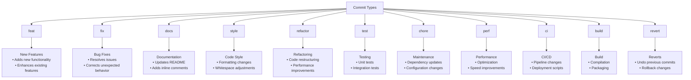
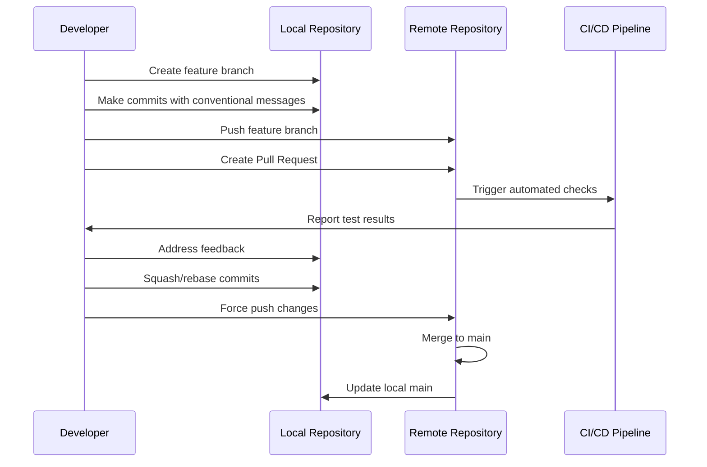
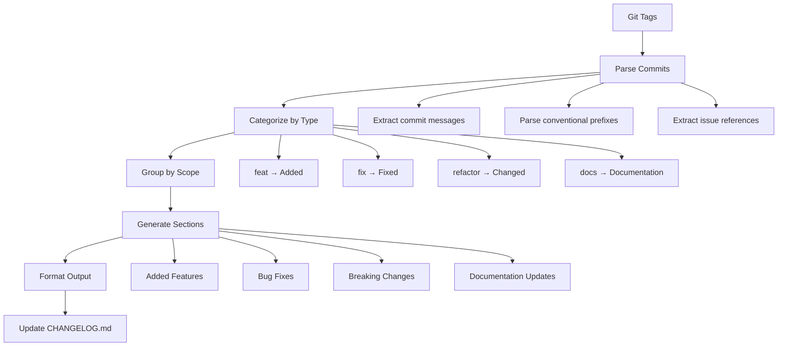
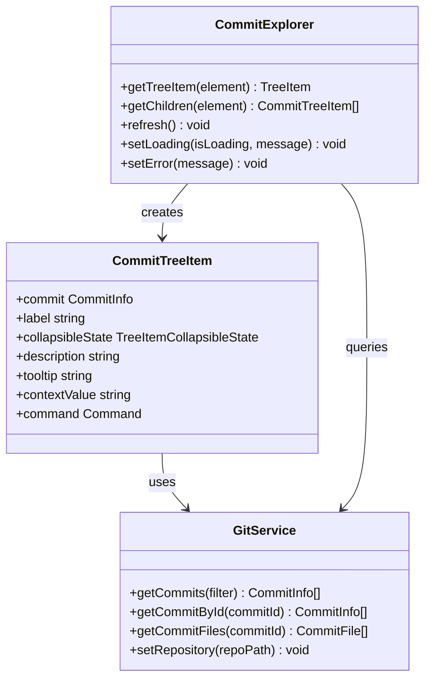

# Commit Conventions

<cite>
**Referenced Files in This Document**
- [README.md](file://README.md)
- [package.json](file://package.json)
- [CHANGELOG.md](file://CHANGELOG.md)
- [docs/release-guide.md](file://docs/release-guide.md)
- [docs/en/developer-guide.md](file://docs/en/developer-guide.md)
- [docs/zh-CN/developer-guide.md](file://docs/zh-CN/developer-guide.md)
- [src/services/git/gitService.ts](file://src/services/git/gitService.ts)
- [src/ui/components/commitExplorer.ts](file://src/ui/components/commitExplorer.ts)
- [src/extension.ts](file://src/extension.ts)
- [tsconfig.json](file://tsconfig.json)
- [webpack.config.js](file://webpack.config.js)
</cite>

## Table of Contents
1. [Introduction](#introduction)
2. [Commit Message Structure](#commit-message-structure)
3. [Conventional Prefixes](#conventional-prefixes)
4. [Branching Strategy](#branching-strategy)
5. [Issue and Pull Request References](#issue-and-pull-request-references)
6. [Git History for Release Notes](#git-history-for-release-notes)
7. [Writing Effective Commit Messages](#writing-effective-commit-messages)
8. [Code Review Integration](#code-review-integration)
9. [Best Practices](#best-practices)
10. [Troubleshooting](#troubleshooting)

## Introduction

CodeKarmic follows established Git conventions to maintain clean, readable commit history that supports automated release note generation and facilitates collaborative development. The project emphasizes clarity in commit messages to enable effective code review processes and streamline the release management workflow.

The commit conventions are designed to work seamlessly with the project's VS Code extension architecture, where commit exploration and review are core functionalities. Well-structured commit messages enhance the user experience by providing meaningful context for code changes and enabling automated analysis.

## Commit Message Structure

CodeKarmic adopts a structured commit message format that combines conventional prefixes with descriptive content. The standard format follows the conventional commit specification while incorporating project-specific requirements.

### Basic Format

```
<type>(<scope>): <subject>

[body]

[footer]
```

### Components Breakdown

| Component | Description | Example |
|-----------|-------------|---------|
| **Type** | Indicates the category of change | `feat`, `fix`, `docs`, `chore` |
| **Scope** | Optional contextual information | `git-service`, `ui-components`, `ai-service` |
| **Subject** | Brief description of the change | `add commit filtering capabilities` |
| **Body** | Detailed explanation of the change | `Implements date range filtering for commits` |
| **Footer** | References to issues or breaking changes | `Closes #123`, `BREAKING CHANGE:` |

**Section sources**
- [docs/release-guide.md](file://docs/release-guide.md#L45-L68)
- [src/services/git/gitService.ts](file://src/services/git/gitService.ts#L28-L45)

## Conventional Prefixes

CodeKarmic utilizes conventional commit prefixes to categorize changes consistently across the codebase. These prefixes help maintain organized commit history and support automated tooling.

### Available Prefixes



**Diagram sources**
- [src/services/git/gitService.ts](file://src/services/git/gitService.ts#L1-L50)

### Type Definitions

| Type | Purpose | Usage Guidelines |
|------|---------|------------------|
| **feat** | New feature implementation | Use for adding substantial new functionality |
| **fix** | Bug fix or correction | Use when resolving issues or unexpected behavior |
| **docs** | Documentation changes | Updates to README, comments, or inline documentation |
| **style** | Code formatting only | Changes that don't affect logic (whitespace, indentation) |
| **refactor** | Code restructuring | Improvements that don't add features or fix bugs |
| **test** | Testing additions/changes | Adding or modifying tests without affecting functionality |
| **chore** | Maintenance tasks | Dependency updates, configuration changes, etc. |
| **perf** | Performance improvements | Code that improves performance |
| **ci** | Continuous Integration | Changes to CI/CD pipeline |
| **build** | Build system changes | Compilation, packaging, or build process changes |
| **revert** | Reverting commits | When undoing previous commits |

**Section sources**
- [docs/release-guide.md](file://docs/release-guide.md#L45-L68)

## Branching Strategy

CodeKarmic follows a feature branch workflow that integrates with the conventional commit message conventions. The branching strategy supports both development and release management processes.

### Branch Naming Convention

```
<type>/<feature-description>
```

### Branch Patterns

| Pattern | Purpose | Example |
|---------|---------|---------|
| `feature/` | New functionality | `feature/commit-filtering` |
| `fix/` | Bug fixes | `fix/git-diff-bug` |
| `docs/` | Documentation updates | `docs/api-documentation` |
| `refactor/` | Code restructuring | `refactor/git-service` |
| `test/` | Testing improvements | `test/unit-tests` |
| `hotfix/` | Emergency fixes | `hotfix/security-patch` |

### Feature Branch Workflow



**Diagram sources**
- [docs/en/developer-guide.md](file://docs/en/developer-guide.md#L61-L66)
- [docs/zh-CN/developer-guide.md](file://docs/zh-CN/developer-guide.md#L21-L35)

**Section sources**
- [docs/en/developer-guide.md](file://docs/en/developer-guide.md#L61-L66)
- [docs/zh-CN/developer-guide.md](file://docs/zh-CN/developer-guide.md#L21-L35)

## Issue and Pull Request References

CodeKarmic commit messages should reference related issues and pull requests to maintain traceability and enable automated linking in release notes.

### Reference Formats

| Format | Example | Purpose |
|--------|---------|---------|
| **Closes #issue** | `Closes #123` | Automatically closes issue when merged |
| **Fixes #issue** | `Fixes #456` | Indicates fix for specific issue |
| **Resolves #issue** | `Resolves #789` | Signifies complete resolution |
| **Related to #issue** | `Related to #101` | Indicates related work |
| **PR #pullrequest** | `PR #202` | References associated pull request |

### Best Practices for References

1. **Single Issue per Commit**: Each commit should address one specific issue or feature
2. **Clear References**: Use exact issue numbers without additional text
3. **Multiple References**: Separate multiple references with commas
4. **Order Matters**: Place closing references last in the footer

### Example Commit with References

```
feat(git-service): add date range filtering for commits

Adds new functionality to filter commits by date ranges in the commit explorer.
This enables users to focus on recent changes or historical analysis.

- Implements date picker interface
- Adds filtering logic to GitService
- Updates commit explorer UI
- Includes unit tests for new functionality

Closes #152
Fixes #148
```

**Section sources**
- [src/services/git/gitService.ts](file://src/services/git/gitService.ts#L197-L241)

## Git History for Release Notes

CodeKarmic leverages Git commit history to automatically generate release notes, making clear commit messages essential for maintaining accurate documentation.

### Release Note Generation Process



**Diagram sources**
- [CHANGELOG.md](file://CHANGELOG.md#L1-L92)
- [docs/release-guide.md](file://docs/release-guide.md#L45-L68)

### Automated Release Note Categories

| Category | Conventional Types | Purpose |
|----------|-------------------|---------|
| **Added** | `feat` | New features and enhancements |
| **Fixed** | `fix`, `perf` | Bug fixes and performance improvements |
| **Changed** | `refactor`, `style`, `test` | Code changes without new features |
| **Documentation** | `docs` | Documentation updates |
| **Removed** | `deprecate` | Deprecated features (if applicable) |
| **Security** | `security` | Security-related changes (if applicable) |

### Release Note Template

The project uses a standardized template for release notes that maintains consistency across versions:

```markdown
## [X.Y.Z] - YYYY-MM-DD

### Added
- New feature description
- Enhancement details

### Fixed
- Bug fix description
- Issue resolution details

### Changed
- Code change description
- Refactoring details

### Documentation
- Documentation update details
- README improvements
```

**Section sources**
- [CHANGELOG.md](file://CHANGELOG.md#L1-L92)
- [docs/release-guide.md](file://docs/release-guide.md#L45-L68)

## Writing Effective Commit Messages

Effective commit messages go beyond mere technical descriptions; they provide context, rationale, and impact information that benefits both current and future developers.

### Message Writing Principles

#### 1. Subject Line Guidelines
- **Limit to 50 characters**: Keep it concise and impactful
- **Use imperative mood**: "Add feature" not "Added feature"
- **Be specific**: Avoid vague terms like "improve" or "update"
- **Focus on WHAT changed, not HOW**: Technical details belong in code comments

#### 2. Body Content Guidelines
- **Explain WHY the change was necessary**: Context and motivation
- **Describe WHAT changed**: Technical details of the implementation
- **Link to related issues**: Use reference format for traceability
- **Avoid redundancy**: Don't repeat information already in the subject

#### 3. Footer Guidelines
- **Breaking changes**: Clearly mark with `BREAKING CHANGE:`
- **Issue references**: Use `Closes #XXX`, `Fixes #XXX`
- **Additional context**: Related PRs, migration steps, etc.

### Commit Message Examples

#### Good Examples

```
feat(ai-service): enhance code review suggestions

Improves AI-powered code review by:
- Adding context-aware suggestion generation
- Implementing confidence scoring for suggestions
- Enabling multi-language support in reviews

Closes #201
Fixes #198
```

```
fix(git-service): resolve Windows path separator issues

Addresses path handling problems on Windows systems by:
- Normalizing file paths using Node.js path module
- Adding platform-specific path conversion logic
- Updating unit tests to handle cross-platform scenarios

Fixes #215
```

```
docs(readme): update installation instructions

Updates installation guide to reflect latest VS Code requirements:
- Clarifies Node.js version requirements
- Adds troubleshooting section for common installation issues
- Updates marketplace installation steps

Closes #220
```

#### Poor Examples

```
fix: fix stuff
```
- Too vague, no context or impact information

```
feat: add new stuff
```
- Vague subject, no technical details

```
fix: fix bug
```
- Repetitive, doesn't explain what was fixed

### Message Quality Checklist

| ✅ Good | ❌ Bad |
|---------|--------|
| Clear subject line | Vague subject |
| Explains motivation | Just describes what changed |
| Links to issues | No references |
| Concise body | Too verbose |
| Specific examples | Generic statements |

**Section sources**
- [src/services/git/gitService.ts](file://src/services/git/gitService.ts#L28-L45)
- [src/ui/components/commitExplorer.ts](file://src/ui/components/commitExplorer.ts#L101-L125)

## Code Review Integration

CodeKarmic's commit conventions are designed to integrate seamlessly with the project's code review functionality, enhancing the review process through structured commit information.

### Commit Exploration Features

The extension provides comprehensive commit exploration capabilities that benefit from well-formed commit messages:



**Diagram sources**
- [src/ui/components/commitExplorer.ts](file://src/ui/components/commitExplorer.ts#L5-L172)
- [src/services/git/gitService.ts](file://src/services/git/gitService.ts#L45-L1201)

### Review Process Integration

Well-structured commit messages enhance the code review process by providing:

1. **Contextual Information**: Clear subject lines help reviewers understand the purpose
2. **Change Impact**: Descriptive bodies explain the scope and significance
3. **Traceability**: Issue references enable easy navigation to related discussions
4. **Automation Support**: Structured messages work with automated review tools

### Commit Message Analysis

The AI service analyzes commit messages to provide insights:

- **Change Classification**: Automatically categorizes commits by type
- **Impact Assessment**: Evaluates the scope and importance of changes
- **Quality Metrics**: Analyzes message clarity and completeness
- **Pattern Recognition**: Identifies common issues in commit messaging

**Section sources**
- [src/ui/components/commitExplorer.ts](file://src/ui/components/commitExplorer.ts#L101-L125)
- [src/services/git/gitService.ts](file://src/services/git/gitService.ts#L197-L241)

## Best Practices

Following these best practices ensures commit messages remain useful throughout the project lifecycle and support both human and automated processes.

### Daily Commit Habits

#### 1. Atomic Commits
- **Single Responsibility**: Each commit should represent one logical change
- **Complete Functionality**: Ensure the code works after each commit
- **Logical Grouping**: Bundle related changes together

#### 2. Regular Commit Frequency
- **Small Increments**: Commit frequently with small, focused changes
- **Daily Integration**: Merge feature branches regularly to main
- **Hotfix Priority**: Address critical issues immediately

#### 3. Pre-Commit Validation
- **Test Execution**: Ensure all tests pass before committing
- **Linting Checks**: Run code quality checks
- **Documentation Updates**: Update relevant documentation

### Long-term Maintenance

#### 1. Historical Preservation
- **Meaningful Messages**: Write commit messages that remain understandable
- **Context Retention**: Include relevant background information
- **Reference Maintenance**: Keep issue references up-to-date

#### 2. Team Coordination
- **Consistency Standards**: Follow agreed-upon conventions
- **Communication**: Discuss significant changes before committing
- **Review Requirements**: Implement mandatory code review for major changes

#### 3. Tool Integration
- **Automated Tools**: Leverage commit message validation tools
- **CI/CD Integration**: Ensure commit messages trigger appropriate workflows
- **Documentation Automation**: Use commit messages to generate documentation

### Quality Assurance

| Practice | Benefit | Implementation |
|----------|---------|----------------|
| **Atomic Commits** | Easier debugging and rollback | Split large changes into smaller commits |
| **Descriptive Messages** | Better historical understanding | Use clear, specific subject lines |
| **Reference Tracking** | Enhanced traceability | Link to issues and related PRs |
| **Regular Cleanup** | Maintained commit history | Periodic rebase and squashing |

**Section sources**
- [docs/en/developer-guide.md](file://docs/en/developer-guide.md#L61-L66)
- [docs/zh-CN/developer-guide.md](file://docs/zh-CN/developer-guide.md#L21-L35)

## Troubleshooting

Common issues with commit messages and their solutions help maintain consistent quality across the project.

### Common Commit Message Issues

#### 1. Vague Subject Lines
**Problem**: "Update code" or "Fix bug"
**Solution**: Be specific about what changed and why
**Example**: "fix(git-service): resolve encoding issues in file diffs"

#### 2. Missing Context
**Problem**: Subject line without explanatory body
**Solution**: Include motivation and technical details
**Example**: 
```
feat(api): add rate limiting middleware

Adds rate limiting to prevent abuse of the API endpoints by:
- Implementing configurable limits per endpoint
- Adding request counting and throttling logic
- Creating monitoring metrics for rate limit violations

Closes #185
```

#### 3. Incomplete References
**Problem**: Commits that don't link to issues
**Solution**: Always reference related issues or PRs
**Example**: "docs(contributing): update commit message guidelines (#25)"

#### 4. Breaking Change Omissions
**Problem**: Significant changes without proper marking
**Solution**: Use BREAKING CHANGE footer for incompatible modifications
**Example**:
```
refactor(config): migrate to new configuration system

BREAKING CHANGE: The configuration file format has changed
- Old JSON format replaced with YAML
- Configuration keys renamed and restructured
- Default values updated

Closes #200
```

### Validation Tools

#### 1. Commit Message Validators
- **husky**: Pre-commit hook validation
- **commitlint**: Conventional commit enforcement
- **lint-staged**: Selective linting of staged files

#### 2. Automated Quality Checks
- **Message Length**: Enforce subject line limits
- **Reference Format**: Validate issue/pr references
- **Content Analysis**: Check for required elements

### Recovery Procedures

#### 1. Fixing Commit Messages
- **Interactive Rebase**: Amend messages for recent commits
- **Commit Rewriting**: Use `git commit --amend` for single commits
- **Squashing**: Combine multiple commits into meaningful units

#### 2. Historical Corrections
- **Amend Old Commits**: Use `git commit --amend` for recent history
- **Create Fixup Commits**: Add corrective commits for older changes
- **Document Rationale**: Explain why corrections were made

#### 3. Branch Recovery
- **Reset to Clean State**: Use `git reset` for local corrections
- **Force Push Caution**: Communicate with team before force pushing
- **Backup Creation**: Create backup branches before major changes

### Monitoring and Metrics

Track commit message quality using these metrics:

| Metric | Purpose | Measurement |
|--------|---------|-------------|
| **Message Length** | Enforce brevity | Average subject line length |
| **Reference Rate** | Track traceability | Percentage with issue references |
| **Category Distribution** | Monitor change types | Ratio of different commit types |
| **Quality Score** | Overall message quality | Automated scoring system |

**Section sources**
- [src/services/git/gitService.ts](file://src/services/git/gitService.ts#L197-L241)
- [src/ui/components/commitExplorer.ts](file://src/ui/components/commitExplorer.ts#L101-L125)